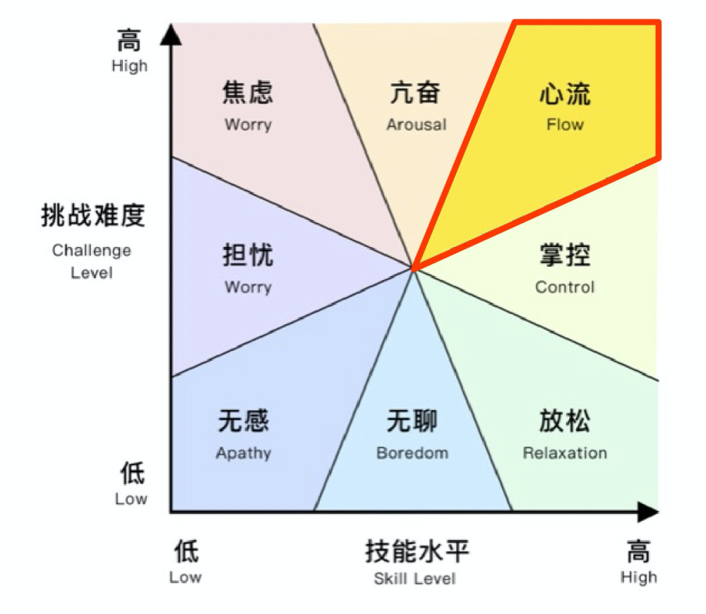
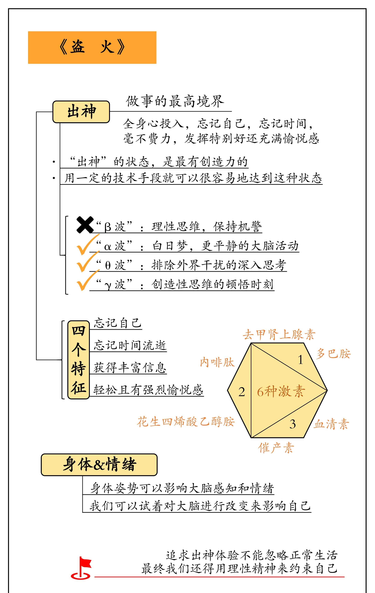

# 《不可能的技艺：巅峰表现入门》

**书名：**《不可能的技艺：巅峰表现入门》（*The Art of Impossible: A Peak Performance Primer*）

**作者：**史蒂芬·科特勒（Steven Kotler）

**出版时间：**2021年1月

[跨越不可能](https://www.dedao.cn/ebook/reader?id=qPKdG1m9B8MaveyJdxRzNnKYlqgVZ3kjX2Wo5pL7E4m1r26kQjXDAPObGkYgJ4pN)

**附件**：《The Art of Impossible: A Peak Performance Primer》原书 PDF（5,197,475 字节）
本地存档：`raw/assets/2026-09-18-art-of-impossible-book.pdf`

你得做一个凶猛的人，凶猛的关键就是迎难而上。判断你能否跨越不可能的唯一方法，就是去尝试。

### 核心要点

核心论点：**“不可能”并非一个无法触及的终点，而是一个可以通过特定公式破解的过程。**

**所谓“不可能”，指的是超出了一般人的正常能力甚至想象力的、极端的表现。**世界上有些人做事的效率之高，能力之强，会让你觉得他们“不正常”。**人类的极限并非由基因决定，而是由神经可塑性与科学训练的结合所塑造**。“不可能”本质上是未被破解的生物学谜题。**实现“不可能”并非天赋或运气的产物，而是一个可以通过学习和实践掌握的“公式”或“系统”** 。这个系统建立在神经科学、心理学和巅峰表现研究的基础上，旨在系统性地利用我们内在的生物和心理机制，将我们推向能力的极限。

一本基于神经科学的巅峰表现指南。本书旨在揭示人类突破极限的底层逻辑。不仅是对“不可能”的重新定义，更提供了一套可操作的科学路径，帮助读者将看似遥不可及的目标转化为现实。

**要达成“不可能”的目标，需要依次掌握并整合四个关键技能：**

只要掌握**动机（Motivation）、学习（Learning）、创造力（Creativity）和心流（Flow）**这四大核心技能，任何人都能从实现“小写的不可能（lowercase i, 个人突破）”进阶到“大写的不可能（Capital I, 改变历史的突破）”。

1. **动机（Motivation）：**强大的、可持续的**内在驱动力** 。外在奖励（金钱、名誉）远不如内在驱动力（好奇心、热情、意义感、自主性、掌控感）有效和持久。**“动机堆叠”（Motivation Stack）**即将多个内在驱动力结合起来，创造出强大的、难以熄灭的行动燃料。特别是“热情”（Passion）和“目标感”（Purpose）的结合至关重要。
2. **学习力（Learning）：**快速且高效地获取达成目标所需的技能和知识至关重要。这涉及到**加速学习**的技巧，如深度专注（Deep Work）、刻意练习（Deliberate Practice）、快速反馈循环（Tight Feedback Loops）以及利用睡眠和休息进行知识巩固。科特勒强调了学习如何学习（Meta-learning）的重要性。
3. **创造力（Creativity）：**许多“不可能”的目标需要创新的解决方案。科特勒探讨了如何系统性地提升创造力，包括增加信息输入的多样性、练习模式识别、利用不同的思维模式（如发散思维和收敛思维），甚至利用轻度改变的意识状态（包括心流）来促进新颖想法的产生。
4. **心流（Flow）：**巅峰表现的核心状态，一种完全沉浸、物我两忘、能力被发挥到极致的体验。触发心流的条件（**清晰的目标、即时反馈、挑战与技能的平衡、高度专注**等）以及心流的神经生物学基础（涉及多巴胺、去甲肾上腺素、内啡肽、花生四烯乙醇胺、血清素等神经化学物质）。**“心流周期”（Flow Cycle）：挣扎（Struggle）-> 释放（Release）-> 心流（Flow）-> 恢复（Recovery）**，理解和管理这个周期对于持续进入心流至关重要。

**巅峰表现 = 动机 × 学习力 × 创造力 × 心流**  

- **动机 = 好奇心 + 激情 + 使命感 + 自主性 + 掌控感**
- “**元学习**”，强调**结构化的反馈循环**与**跨领域迁移**。
- 当任务难度比现有技能高出4%时，大脑会分泌多巴胺奖励这种“适度冒险”，从而进入最佳学习状态。
- 创造力源于大脑**默认模式网络**（负责想象）与**突显网络**（负责注意力）的动态交互。通过**“深度现在”** 训练（如4小时无干扰时段），抑制前额叶皮层的“自我审查”，释放潜意识的创造力。**准备期**（积累知识）→**酝酿期**（潜意识处理）→**顿悟期**（灵感闪现）→**验证期**（实践检验）。
- **心流触发器**：**内部触发，外部触发，社会触发，创造性触发。**
- **心流的完整周期**：**挣扎期**（学习阶段）→**释放期** （放松让潜意识整合）→**心流期**（高效产出）→**恢复期** （积极休息）。
- 触发心流的三个条件：**即时反馈，挑战和技能的平衡，明确的目标。**这些方法都是把注意力引到当下你在做的这件事情上：

  - 做加法，提高去甲肾上腺素和多巴胺，增加这件事对你的吸引力；
  - 做减法，降低认知负荷，把多余的能量转移到对这件事的注意力上。
- 三级目标体系：

  - **目的**：目的是人生尺度上的东西；  
  - **高难度目标**：五个月之内写一本好书，这是一个高难度而又可以考核的目标；  
  - **清晰目标**：每一天具体要做的事情，相当于任务列表上的任务。  
- 神经可塑性训练：

  - **注意力强化**：通过冥想、正念练习增强前额叶皮层对注意力的控制，减少分心。研究显示，持续8周的正念训练可使大脑**背外侧前额叶皮层**增厚，提升抗干扰能力。
  - **失败免疫机制**：主动设计“可控失败”，通过反复暴露降低焦虑敏感度，增强心理韧性。

### 巅峰表现的四大支柱

这四个步骤是线性且循环的：动机让你入局，学习让你持续，创造力助你破局，心流让你飙升。

#### 1. 动机（Motivation）：驱动力的堆叠

动机不是单一的，而是需要像积木一样“堆叠”起来才能产生持久的燃料。

- **内在驱动力序列（Intrinsic Stack）：** 必须按照特定顺序激活，不能跳级。

  - **好奇心（Curiosity）：** 一切的起点。要从“多个好奇心的交集”中寻找激情。
  - **激情（Passion）：** 当好奇心产生交集并被深入挖掘，就转化为激情。
  - **使命感（Purpose）：** 将激情与服务他人/社会结合，形成使命（MTP，宏大变革目标）。
  - **自主性（Autonomy）：** 拥有对自己时间和工作的控制权。
  - **精通（Mastery）：** 对技艺精进的渴望。
- **目标设定的三个层级：**

  - **MTP（Massively Transformative Purpose）：** 宏大的变革目标，是一生的北极星。
  - **HHG（High, Hard Goals）：** 高且难的目标（1-5年），是通往MTP的阶梯。
  - **Clear Goals（清晰目标）：** 每日的小目标，必须清晰明确，位于能力与挑战的平衡点上，是触发心流的关键。
- **坚毅（Grit）：** 坚毅不止一种，科特勒提出了**6种坚毅**，需要分别训练：

  - 坚持不懈（Perseverance）
  - 控制思想（Thought control）
  - 掌控恐惧（Mastery of fear）
  - 在最糟糕的状态下做到最好（Be your best when at your worst）
  - 训练弱点（Train your weaknesses）
  - 恢复（Recovery，休息也是一种坚毅）

#### 2. 学习（Learning）：5步学习法

终身学习是维持巅峰表现的基础，科特勒提出了一套快速掌握新领域的\*\*“5步学习法”\*\*：

1. **阅读5本书（The Five Books of Stupid）：**

   - 第1本：通俗读物（建立概览）。
   - 第2本：同主题的通俗读物（查漏补缺）。
   - 第3本：半学术/半通俗（了解专业术语）。
   - 第4本：硬核教科书/学术专著（深入内核）。
   - 第5本：关于该领域未来的书（了解前沿方向）。
2. **像白痴一样提问（Be the Idiot）：** 带着书中的问题去请教专家，不要怕丢脸。
3. **探索缺口（Explore the Gaps）：** 寻找专家们意见不一或尚未解决的领域，那是机会所在。
4. **提出下一个问题（Ask the Next Question）：** 基于缺口，提出深层问题。
5. **寻找叙事（Find the Narrative/Teach it）：** 将所学知识融合成一个故事或教给别人，以实现知识内化。

#### 3. 创造力（Creativity）：三个大脑网络

创造力不是天分，而是一种可训练的技能（Skill）。它本质上是**三个大脑网络的协作**：

1. **执行注意力网络（Executive Attention Network）：** 负责激光般的专注（聚光灯）。
2. **默认模式网络（Imagination Network / DMN）：** 负责发散思维、做白日梦（漫游）。
3. **突显网络（Salience Network）：** 负责在上述两者间切换，筛选出有价值的创意。

创造力是“在旧事物之间建立新连接”。要提升创造力，必须学会在“极度专注”和“彻底放松”之间切换，给自己留出无所事事的时间。

#### 4. 心流（Flow）：终极加速器

心流是巅峰表现的最高级状态，能让生产力提升500%，学习速度提升400%以上。

- **心流的四个周期（必须顺应周期，不能强求）：**

  1. **挣扎期（Struggle）：** 大脑加载信息，感到挫败和压力（此时不应放弃，这是必经之路）。
  2. **释放期（Release）：** 转移注意力，做点轻松的事，让潜意识工作（从交感神经切换到副交感神经）。
  3. **心流期（Flow）：** 巅峰状态出现，时间消失，自我消失。
  4. **恢复期（Recovery）：** 补充神经化学物质，睡觉、休息（没有恢复就没有下一次心流）。
- **心流触发器（Flow Triggers）：**

  - **内部触发器：** 激情/使命、清晰的目标、即时反馈、挑战与技能的平衡（4%原则：挑战比技能高出4%）。
  - **外部触发器：** 严重后果（高风险）、丰富的环境（新奇性、复杂性、不可预测性）。

### 实践行动指南（构建日常系统）

要实现“不可能”，必须将上述理论转化为**日常习惯**：

1. **前一天晚上：** 列出第二天的“清晰目标清单”（Clear Goals List）。
2. **早晨：感恩练习**（提升心理韧性）。**90-120分钟的深度工作**（Deep Work）：利用早晨意志力最强的时候攻克最难的任务（针对HHG）。
3. **学习时间：** 每天至少**25分钟**阅读核心专业**之外**的书籍（增加跨学科的模式识别能力，滋养创造力）。
4. **休息与恢复：** 保证7-8小时睡眠，并在心流过后安排主动恢复（如散步、桑拿）。
5. **每周/每月：** 安排一次“探索性”活动，去陌生的环境，触发外部心流机制。

巅峰表现不是靠运气，而是通过**对齐内在动机**，利用**系统化学习**获取知识，借助**训练有素的创造力**解决难题，最终通过**驾驭心流状态**将原本看似“不可能”的目标变为现实。

### 巅峰表现四步行动指南

巅峰表现并非与生俱来的天赋，而是一套可以学习和训练的技能。实现“不可能”的目标，本质上是一个可以被分解和执行的流程。本指南将此流程分为四个相互关联、循序渐进的阶段：**驱动力、学习、创造力、心流**。

#### **第一阶段：建立驱动力**

驱动力是启动一切的基础。没有它，最艰难的学习和挑战都无法维系。

1. **堆叠你的内在驱动力：**

   - **好奇心（Curiosity）：** 列出至少25件让你感到好奇的事情或问题。每天花15-30分钟去探索其中之一，不带任何功利目的。这是激情最初的火花。
   - **激情（Passion）：** 从你的好奇心列表中，找到那些能让你持续投入、甚至废寝忘食的领域。将多个好奇点连接，形成一个或多个激情领域。
   - **目标（Purpose）：** 将你的激情与一个超越自我的事业或问题相结合。问自己：“我的激情能为他人或世界解决什么问题？” 这将为你提供最持久、最强大的动力。
2. **设定一个“宏大变革目标”（Massively Transformative Purpose - MTP）：**根据你的“目标”，设定一个清晰、宏大、且极具挑战性的北极星式目标。这个目标应该能点燃你的激情，并为你所有的努力提供方向。
3. **培养坚毅力：**认识到通往“不可能”的道路上必然有低谷和挫折。将坚毅力视为一种实践：即使在动力不足时，也坚持完成计划中的最小任务。你的MTP是克服困难时的燃料。

#### **第二阶段：加速学习**

拥有了驱动力，你需要高效地获取和掌握达成目标所需的技能。

1. **精通基础（Master the Fundamentals）：**抵制跳过基础知识的诱惑。将所有核心技能分解为最小的组成部分，并对每一个进行刻意练习，直到它们成为你的第二天性。
2. **拥抱“必要难度”（Embrace Desirable Difficulties）：**

   - 高效学习是费力的。放弃被动阅读或观看，转向主动学习方法：
   
     - **主动回忆（Active Recall）：** 不看资料，强迫自己回忆学过的内容。
     - **自我测试（Self-Testing）：** 定期对自己进行测验。
     - **间隔重复（Spaced Repetition）：** 在即将忘记的临界点上复习知识。
3. **将失败视为数据（Treat Failure as Data）：**采用成长型思维。每一次错误或失败都不是对你能力的否定，而是提供了关于如何改进的宝贵信息。分析失败，调整策略，然后继续前进。

#### **第三阶段：解锁创造力**

创造力是将你学到的知识以新颖的方式组合，从而解决问题的能力。

1. **大量输入，拓宽边界：**持续为你大脑提供高质量、多样化的信息。广泛阅读，尤其是你专业领域之外的书籍和文章。与不同背景的人交流。
2. **练习模式识别：**创造力是连接看似无关的想法。定期留出时间，回顾你学到的知识和遇到的问题，积极寻找它们之间的潜在联系和共同模式。
3. **善用限制：**给自己设定明确的限制（如时间、资源），这会迫使你的大脑跳出常规思维，寻找更具创造力的解决方案。

#### **第四阶段：驾驭心流**

心流是意识的巅峰状态，在此状态下，你的注意力高度集中，行动与意识融为一体，表现和效率得到极大提升。

1. **识别并运用心流触发器（Identify and Use Flow Triggers）：**

   - 心流是可以被主动触发的。专注于以下核心触发器：
   
     - **明确的目标：** 对你正在做的每一步都有清晰的认识。将大任务分解为具体的、即时的小任务。
     - **即时反馈：** 你需要能立即知道自己的做法是否有效。如果任务本身不提供反馈，就创造一个反馈回路（如录下自己的演讲、使用运动追踪器）。
     - **挑战与技能的完美平衡：** 这是心流的黄金法则。任务的挑战性应略高于（约4%）你当前的技能水平。太难会引发焦虑，太容易则导致无聊。
2. **创造零干扰环境：**心流需要长时间不间断的专注。在计划进入心流状态前，关闭所有通知，隔绝干扰。设定一个90-120分钟的“专注模块”。
3. **建立“心流前”仪式：**建立一个简短、固定的例行程序（如深呼吸、听特定的音乐、整理桌面），向你的大脑发出信号：“现在是集中注意力的时间了”。

#### **总结：一个持续的循环**

这四个阶段并非线性的终点，而是一个不断强化的正向循环：强大的**驱动力**让你愿意忍受**学习**的艰辛；高效的**学习**为你提供了**创造力**的原材料；**创造力**的突破和**心流**带来的巅峰体验会反过来进一步点燃你的**驱动力**，让你去挑战下一个“不可能”。

从今天开始，选择一个阶段的一个行动项开始实践。祝你旅途愉快！

本书提供了一个强大而实用的框架。它的价值在于将众多巅峰表现的研究成果系统化、结构化，并给出了具体的操作路径。

**但请记住，阅读只是第一步，真正的改变来自于持续的实践和应用。**

### 5% 的改变

普通人要落实这本书的理念，关键在于**放弃“一口吃成胖子”的想法，转而采用“微习惯”和“聚焦过程”的策略**。您不需要立刻成为巅峰表现大师，只需要在正确的方向上，每天前进一小步。

#### 第一步：忘掉“不可能”，从“一个微小的兴趣”开始

您现在不需要一个“宏大变革目标”（MTP），那太有压力了。您只需要找到一个能让您稍微兴奋的小火花。

- **行动指令：** **执行“25个好奇心”练习。** 找个安静的15分钟，写下任何让你感到好奇的事情，无论大小。比如：“咖啡豆是怎么烘焙的？”、“冥想真的有用吗？”、“我能学会用Python写个小程序吗？”。
- **如何坚持：** **每周只选一个好奇心去探索。** 本周，就花30分钟在网上搜索一下咖啡烘焙的知识。仅此而已。这个阶段的目标不是“激情”，而是“点燃火花”，享受探索的乐趣，没有任何功利目的。

#### 第二步：放弃“系统性学习”，转向“每日15分钟”

您不需要立刻掌握所有高效学习技巧。您只需要建立一个微小但持续的学习习惯。

- **行动指令：** **设定一个“15分钟学习闹钟”。** 从你的好奇心列表中，选择一个你想稍微深入了解的技能或知识。每天，只要求自己投入15分钟。可以是阅读一本书的几页，看一小段教学视频，或者练习一个新动作。
- **如何坚持：** **关注打卡，而非效果。** 关键在于每天都执行这个动作，形成习惯。今天学得好不好不重要，重要的是你“做了”。这15分钟会慢慢累积，消除你对学习新技能的畏惧感。

#### 第三步：别想着“创造力”，只要“连接两个点”

创造力听起来很高深，但其本质只是将已有的想法进行新的组合。

- **行动指令：** **每天睡前，写下一条“连接日记”。**回顾你今天学到的新知识（哪怕只有一点点）和你遇到的一个问题（工作或生活中的都行）。然后问自己：“这两者之间有任何可能的联系吗？” 哪怕这个联系很荒谬，也写下来。
- **如何坚持：** **把它当成一个有趣的游戏。**目的不是为了产生伟大的创意，而是训练你的大脑去寻找连接。比如，你今天学了“咖啡烘焙”，又遇到了“下午犯困”的问题。连接可能是：“不同烘焙度的咖啡，提神效果有区别吗？我可以试试。”

#### 第四步：追求“微心流”，而不是“巅峰心流”

您不需要立刻拥有长达数小时的完美心流体验。您只需要创造一些不被打扰的专注时刻。

- **行动指令：** **每周设立一到两个“90分钟专注模块”。**这是你唯一需要严格执行的纪律。在这90分钟里：

  - **手机静音，放到另一个房间。**
  - **关闭电脑上所有无关的网页和通知。**
  - **只做一件清晰、具体、且难度略高于你能力的事情。**
- **如何坚持：保护这个时间块，就像保护一个重要的约会。** 把它写进你的日程表。这90分钟就是你实践“挑战/技能平衡”的训练场。一开始可能会走神，没关系，察觉到之后，温和地把注意力拉回来即可。

#### **总结：**

1. 将书中的宏大概念转化为你可以立即执行的微小行动（探索好奇心、15分钟学习、连接日记、90分钟专注）。
2. 不要用最终结果来评判自己。你的目标是“今天我做那15分钟学习了吗？”而不是“我今天学会了多少？”。只要你完成了过程，你就赢了。
3. 这些微小的行动会在一年后产生惊人的复利效应。你的好奇心会自然生长为激情，你的每日15分钟会累积成专业知识，你的连接能力会让你更有创意，你的专注模块会让你更频繁地体验到心流。

记住，史蒂芬·科特勒描绘的是一座山峰的地图，而您不需要第一天就冲到山顶。您只需要找到地图上的起点，然后**穿上鞋，走出第一步**。

今天，就从写下那25个好奇心开始吧。

### **“解锁潜力”90天行动计划**

正是因为感觉“平庸”，这个计划才更有意义。巅峰表现不是天才的专利，而是普通人通过正确的系统和持续的努力可以达成的结果。这个90天计划的核心是：**用微小的、可持续的行动，为你的人生安装一套新的操作系统。**

请忘掉“一步登天”，我们只专注于走好脚下的每一步。

#### **核心原则：**

- **小处着手：** 每个任务都设计得足够小，让你无法拒绝执行。
- **关注过程：** 我们不衡量“天赋”，只记录“完成”。
- **耐心复利：** 相信微小行动在90天后产生的巨大变化。

#### **第一阶段：点燃火花 (Days 1 - 30)**

**目标：** 停止内耗，从外界寻找能量，建立一个微小但不可动摇的积极习惯。

- **第1周：探索周 (Days 1-7)**

  - **Day 1：** 完成**“25个好奇心”练习**。找一张纸，一支笔，在15分钟内写下任何让你哪怕有一点点好奇的东西。无论多傻、多不切实际都可以。（例如：木匠是怎么做榫卯的？宇宙是怎么起源的？怎么做一杯完美的手冲咖啡？）
  - **Day 2-7：** **每日15分钟“好奇心漫游”**。每天从你的列表中选一个，用15分钟在网上搜索相关信息、看个短视频。**规则：** 不带任何功利心，纯粹为了好玩。
- **第2-4周：聚焦周 (Days 8-30)**

  - **Day 8：** 回顾你的好奇心列表和前一周的漫游经历。**选出1个**让你感觉最有趣、最想多了解一点的领域。这就是你接下来82天的“实验田”。
  - **Day 9-30：** 建立**“每日15分钟学习”**的雷打不动的习惯。
  
    - **内容：** 围绕你选定的领域进行学习（看书、看课程、读文章）。
    - **关键：** 每天在日历上打勾。我们追求的不是学到了多少，而是“今天我做了”这个事实。这是在训练你的毅力肌肉。

**第一阶段结束时，你将拥有：一个明确的兴趣方向 + 一个已坚持22天的学习习惯。**

#### **第二阶段：打磨工具 (Days 31 - 60)**

**目标：** 将被动学习转为主动获取技能，开始真正“长本事”。

- **第5-6周：主动周 (Days 31-45)**

  - 继续**“每日15分钟学习”**，但升级玩法：学习后，花2分钟**“费曼学习法”**：用最简单的语言，假装把刚学到的知识讲给一个完全不懂的人听。这会立刻暴露你没弄懂的地方。
  - **每周增加1次“30分钟整理”**。在周末，花30分钟回顾这周学习的内容，简单写几句总结或画个思维导图。
- **第7-8周：挑战周 (Days 46-60)**

  - 继续每日学习和每周整理。
  - **引入第一次“微挑战”**。为你学习的领域设定一个极小的、可执行的项目。*例子：* 如果学编程，就尝试写一个“Hello World”之外的最简单程序。如果学写作，就写一段200字的完整描述。如果学手冲咖啡，就严格按照教程冲一次并记录参数。
  - **开始“连接日记”**：每晚睡前，写下一条“今天学到的\_\_\_”和“今天遇到的一个困难\_\_\_”有什么可能的联系。锻炼创造性思维。

**第二阶段结束时，你将拥有：将知识转化为技能的初步能力 + 创造性思维的萌芽。**

#### **第三阶段：进入心流 (Days 61 - 90)**

**目标：** 创造深度专注的环境，体验“物我两忘”的高效状态。

- **第9-10周：专注周 (Days 61-75)**

  - 继续所有习惯。
  - **引入每周1次“90分钟专注模块”**。
  
    - **仪式感：** 找一个你绝对不会被打扰的时间段。
    - **物理隔绝：** 手机静音，放到另一个房间。关闭所有电脑通知。
    - **单一任务：** 在这90分钟里，只做你那个“微挑战”项目相关的事。
    - **觉察：** 如果走神了，没关系，温和地把注意力拉回来。
- **第11-12周：整合周 (Days 76-90)**

  - **将“90分钟专注模块”增加到每周2次。** 你会发现，你进入状态的速度越来越快。
  - **Day 85：** 回顾你的“微挑战”项目，无论完成度如何，都为自己庆祝。你已经完成了从0到1的突破。
  - **Day 90：回顾与展望。**
  
    - 拿出一张纸，回答三个问题：
    
      1. 这90天，我最大的收获是什么？（不是技能，而是关于“我自己”的发现）
      2. 哪个环节我做得最开心？哪个最困难？
      3. 基于这份经验，我的下一个90天“微挑战”可以是什么？

**90天后，你获得的将远不止一项新技能。你将获得一套经过验证的、属于你自己的成长系统，以及一个不再认为自己“平庸”的、充满自信的内心。**

给您的最后提醒：

这个计划的精髓在于行动。不要过度思考，不要追求完美。今天就开始，从写下第一个好奇心开始。90天后，您会感谢今天这个决定。祝您旅途愉快！

### 《不可能的技艺》

作者史蒂芬·科特勒在书中列举了几个能够触发心流的方法。这些方法在科特勒的书中被分成三大类：

（1）每一天要做的；

（2）每一周要做的；

（3）堆叠过程。 

#### **每一天要做的：**

**1）花90到120分钟不间断的专注，专注于自己觉得最重要的事情。** 

2）五分钟准备明天不间断地专注。 

3）五分钟准备明天的专注清单。写下每一个明天要做的事情，越仔细越好。 

4）五分钟的感恩。 

5）20分钟的释放和/或20分钟的正念。 

**6）至少25分钟的时间来阅读。** 

**7）7到8小时的睡眠。** 

#### **每一周要做的：**

 8）每个礼拜一次或两次，每次2到6个小时作心流最高的活动，譬如说滑雪、跳舞、唱歌等等。用这种专注的技能来训练自己的坚毅力。 

**9）每个礼拜三次，每次60分钟运动。可能的话作户外运动。** 

10）一个礼拜三次，每次20到40分钟做积极恢复，这其中包括桑拿、按摩、简单瑜珈、正念等等。 

11）每个礼拜一次，每次30到60分钟训练里你最弱或/和你最强的地方。

12）每个礼拜一次，每次30到60分钟，得到朋友的反馈。 

13）每个礼拜120分钟做社会服务。为其他人腾出时间，尤其是对一个内向的人格外重要。一个充满爱心的人，也会是一个镇静快乐的人。 

#### **堆叠过程：**

14）可以用上述第9项中的运动来训练自己的坚毅力。**当你在锻炼过程中到精疲力竭的时候，再多付出一点，是最好训练自己的坚毅力的时候。**

 15）在做上述第10项时，也可以训练自己的正念和读书。 

16）上述第5项的时候，可以试着用MacGyver 的方法：**用轻微刺激的活动，譬如将要解决的问题写在纸上，来激化潜意识。** 

17）善用你的好奇心来找到想法的联系。 

18）将新鲜的、复杂的、和不可预测的事物作为你的好朋友；寻找反馈的伙伴；练习承担风险。 

19）在做社会服务的时候，善用这个时间来训练你的EQ和团队心流。 

20）创造力和掌控感的追求应该要融入你所做的每一件事情中。 

 

以上就是科特勒在书中讲的触发心流的方法，每一个方法并不难懂，贵在能够持之以恒。套句万老师的结语：“**我认为这本书说的一切都是完全可能的，而且是非常可行的。**”

## 前言：“不可能”的公式

小时候，我们总会梦想未来的自己能取得怎样的成就。当你即将实现一个梦想时，又会生出一个新的梦想。人们总是渴望不断学习，不断进步。眼前似乎总有一条终点线，但当你试着去触碰它时，就会发现这条线其实并不存在，没有什么能真正限制你。所谓“不可能”，就是比这条线更远的地方。所以，让我们不断地刷新终点线吧！只要持之以恒，总会习惯成自然。—— 迈尔斯·戴什尔

对很多人来说，阅读这本书的过程可能会是一次认知与思维的重塑。其实，我们每个人的能力是没有边界的，很多时候是我们自己限制了自己的能力；而能力实际上是因需求而产生的，只要你想，你就可以拥有。就史蒂芬·科特勒的这本书而言，只要你想，你就可以按照书里提供的工具和技术，主动从行动上做出改变。要跨越不可能，要实现自己的梦想，能做的就是：开始行动！—— 陈春花

### 极致创新

如何完成看似不可能完成的任务。确切地说，对于缺乏实践能力的朋友，特别是对于那些总是用不切实际的标准来要求自己，或是对自己抱有不切实际的预期的朋友而言，这是一本非常实用的指导手册。

首先，定义是非常有意义的。

“不可能”这个词，指的是一种极致的创新。那些善于解决“不可能”问题的人，不仅会在做事的方式上创新，也会在思想上创新。

“不可能”这个词划定了一个范围，指的是以前从未有人做过，而且大多数人认为永远也做不到的事情，这些事情超越了我们的能力和想象力。从字面意义上来理解，有一些极度不可能的事情，令人连想都不敢想，比如做出颠覆性的突破、4分钟内跑完1英里、对月发射航空器等。

通往成功的旅途没有清晰的路径，而且从统计结果来看，成功的概率非常低。

20世纪90年代早期的极限运动员，大多是那种不拘小节、好像天生就不招人待见的人。几乎所有我认识的极限运动员出身都很一般，很多都来自破碎家庭，小时候度日艰难，也没受过什么教育。然而，就是这样一群人，居然一次又一次地创造了不可能，而且在这个过程中，不断刷新人类这个物种的极限。

### 我弟弟并不会魔术

20世纪70年代是魔术的全盛时代，顶尖的魔术师会定期巡演。也不知道为什么，俄亥俄州克利夫兰城总是最后一站——魔术总是在这里被传承下来。这真是天大的好运气。这意味着，魔术世界里的所有人迟早都会来到我的世界。那么，我就有机会近距离地观察“不可能”了。

那些年我学到的最重要的一点是：一个戏法不管表面上看起来有多不可思议，它背后总有一套可解释的逻辑。也就是说，不可能的背后是有公式的。更神奇的是，如果我自己去挑战不可能，有时候就能学会那个公式。正如我的第一位魔术导师挂在嘴边的一句话：“只要长年累月地练习，几乎没有什么是不可能的。”

“公式”与计算机科学家所说的“算法”意思一样，指的是为了得到同一结果所遵循的步骤序列。

### 生物学原理

“个性是无法复制的，能复制的是生物机制。”很多时候人们能找到激发自己巅峰表现的方法，就会觉得这套方法对其他人也管用，但事实上很少会这样。

更常见的情况恰恰相反。

问题的关键在于，每个人的个性都是独一无二的。激发巅峰表现力的关键特质（比如风险承受能力或性格内外向程度）是由基因编码决定的，这是一个神经生物学过程，很难改变。再加上文化背景、经济状况、社会地位等外部因素的影响，这个问题就更复杂了。因此，对我有效的方法，对你却基本不奏效。

实现不可能的生物学公式是什么？

答案就是心流。

心流被定义为“一种最理想的意识状态，该状态下人们会呈现出最佳的自我感觉和外在表现”。心流是人类为了取得巅峰表现而进化出的一种状态。这也解释了为什么无论在哪个领域，每当不可能的事情变成可能时，心流总是发挥着重要的作用。心流背后的神经生物学原理即为“不可能的艺术”背后的运作机制。

当然，仅仅将心流描述为“最理想的意识状态”并不能让我们对此有深刻的理解。更具体地说，“心流”这个术语描述的是我们专注于手头的任务时，那种全神贯注的、忘我的甚至感受不到周围一切的状态。你的行动和意识合二为一，自我意识消失，时间似乎静止了。在这种状态下，你的外在表现会突飞猛进。

但心流对体能和精力的影响非常之大。在心流状态下，在体能方面，力量、耐力和肌肉反应灵敏度都会得到显著提升，同时，疼痛感、消耗感和疲劳感都会显著减轻。

此外，心流会在认知层面产生更大的影响。人们的动机和生产力、创造和革新能力、学习能力和记忆能力、同理心和环境洞察能力，以及合作与协同能力在心流状态下都会得到显著提升。一些研究发现，心流状态下的人在这些方面的表现是平常的500%。

为什么人类会进化出能够强化这些能力的特殊意识状态呢？

为了生存，大脑在进化中被不断重塑。进化本身是由可用资源驱动的，资源的稀缺性一直是人类生存的最大威胁，因此这成了人类进化的最主要驱动因素。对于这种威胁，人类只有两种应对方法，要么去争夺日益减少的资源，要么去探索，用创造力、创新精神和合作精神去创造新的资源。

当你要挑战不可能解决的问题时，心流只是必要条件，而非充分条件。

毫无疑问，实现不可能——实际上也就是显著地提升自己的表现水平——是需要心流的，但同时也需要通过训练来强化心流所能激活的技能：动机、学习力和创造力。

### 巅峰表现是一场无限游戏

哲学家詹姆斯·卡斯用“有限游戏”和“无限游戏”来形容我们在地球上生存和活动的主要方式。

- 有限游戏是有边界的，其结局和玩家数量是有限的，每个人都要遵守既定的游戏规则，最终会有赢家和输家。国际象棋、跳棋、政治、体育和战争属于这类游戏。
- 无限游戏恰好相反。无限游戏没有明确的赢家或输家，没有确切的比赛周期，也没有固定的游戏规则。无限游戏的领域是可变的，玩家的数量也是不断变化的，游戏的唯一目标就是让游戏延续下去。艺术、科学和爱情都属于无限游戏。
- 最重要的是，巅峰表现也属于一种无限游戏。巅峰表现不是靠竞争赢得的。在这场游戏中，没有固定的规则，也没有固定的赛程，赛场的大小取决于你选择过怎样的生活。

巅峰表现是一场无限游戏，但也不完全是，它是一种不寻常的无限游戏。你或许有一定的赢的概率，但输的概率基本上是100%。哈佛大学杰出的心理学家威廉·詹姆斯是这样解释的：“人类个体一般都远未达到极限。人们囿于自身习惯，从未将与生俱来的诸多能力发挥到极致。人的精力并未得到充分使用，其行为表现也低于巅峰水平。在基础学习能力、协调能力、自律和自控力等任何你能想到的方面，人的能力就像癔症患者的视野一样被压缩了。然而，我们也没有什么理由为自己辩解，因为癔症是一种疾病，而我们大多数人只是养成了一种根深蒂固的习惯——对自己整个人的习惯性自卑。这糟透了。”

动机能让你投入游戏，学习力能帮助你持续参与，创造力能为你指明前行的方向，而心流则帮助你火力全开，超越所有理论标准和预期。

朋友们，这才是真正的不可能的艺术。

## 第一部分：动机

如果生活不是一场真正的战斗，

不能奋勇作战赢得这场战斗，

为世间万物留下永恒的遗产，

那么生活与一场可以随意罢演的独角戏无异。

但生活就是一场真正的战斗，

如同浩瀚宇宙中未开垦的荒芜之地，

等待着我们的救赎。

——威廉·詹姆斯

- **不可能的公式：**“不可能”是可以系统化实现的。
- **内在驱动力：**深入探讨好奇心、热情、目标感、自主性和掌控感等内在动机的重要性。
- **动机堆叠：**如何将多种内在驱动力结合，形成强大的行动力。
- **目标设定：**设定清晰、有挑战性且与内在动机相符的宏伟目标。
- **坚毅力：**培养长期坚持和克服困难的心理韧性。

### 第1章：解码动机

前提：实现“不可能”有一个公式。不可能的事情变成可能，实际上是娴熟应用四种技能并显著提升其效果而达到的最终结果。这四种技能即动机、学习力、创造力和心流。

- 巅峰表现 = 动机 + 学习 + 创造力 + 心流
- 动机 = 驱动力 + 目标 + 坚毅力
- 驱动力 = 外部驱动 + 内在驱动
- 内在驱动 = 好奇心 + 热情 + 意义 + 目的 + 精通 + 掌控感

#### 动机心理学

挑战不可能完成的任务，需要日拱一卒的长期积累。老子说：“千里之行，始于足下。”但你要知道，这是一段在黑暗中爬坡的千里之行，不进则退。

不可能之旅往往是一段充满艰辛的长途跋涉，精英玩家从不依赖单一的燃料来源，无论是体能燃料还是心理燃料。

- 外在驱动是我们自身之外的奖励，比如金钱、名声和性。
- 内在驱动则相反，它是我们自身的心理和情绪力量，如好奇心、激情、意义感和使命感。另外，自主性——对掌控自己生活的渴望——也是一种内在驱动，掌控感——我们出色地完成一项工作时的感受——则是另一种强有力的内在驱动。

#### 从神经化学视角看待激励

玩游戏时，大脑会释放多巴胺和催产素，这是两种最重要的“奖励性”化学物质。当我们完成或试图完成任何满足基本生存需求的任务时，这些“开心药”会让我们觉得身心愉悦。

多巴胺是大脑产生的最主要的奖励性化学物质，其次是催产素。5-羟色胺（血清素）、内啡肽、去甲肾上腺素和大麻素也会起到让人愉悦的作用。这些化学物质所产生的愉悦感驱使我们做出某些行为，成功完成这些行为之后还会强化我们对该行为的记忆。

神经化学物质是有针对性功能的。

- 多巴胺擅长驱动我们参与各种与欲望（从性欲到求知欲）相关的活动。多巴胺给我们带来的感受是兴奋、热情，以及某个场景下对寻求意义的渴望。当手机响起，你会很好奇，想去看看是谁打来的，那便是多巴胺在发挥作用。渴望破解黑洞理论，渴望攀登珠穆朗玛峰，渴望挑战极限，这些也都是多巴胺在发挥作用。
- 去甲肾上腺素与多巴胺有相似之处，但又有些不同。去甲肾上腺素这种物质称得上是大脑中的肾上腺素，它会产生巨大的能量，并显著提升警觉性，因此会让人处于过度亢奋和过度警觉的状态。当你沉迷于某个想法无法自拔，或沉醉于某项工作停不下来，或者不由自主地想起你刚刚遇到的那个人时，便是去甲肾上腺素在作祟。
- 催产素会让人感受到信任、爱和友谊。它是一种“亲社会”的神经化学物质，正是因为催产素的存在，才产生了爱情、长久的婚姻以及富有合作精神且健康运行的公司。催产素带给我们的感受是愉悦和爱意，它能帮助人们彼此信任，相互忠诚，相互理解，让人们更好地沟通和合作。
- 5-羟色胺是一种镇静舒缓性的化学物质，能够缓和人的情绪。一顿美餐或性高潮都会带来这种满足感，而饭后或性交后犯困，部分原因也在于5-羟色胺。当人们出色地完成工作时，5-羟色胺似乎也能带来满足感和满意感。
- 内啡肽和大麻素是最后两种愉悦性化学物质，能够产生止痛的功效。它们都是强力减压剂，能释放一种令人放松的幸福感和愉悦感，将繁重的生活压力一扫而光。这两种物质会给我们带来一种“世间万物都很美好”的感受，跑步的人进入“跑者高潮”状态（跑得筋疲力尽时忽然恢复元气）时就会有这种感受。

然而，奖励机制背后的神经化学原理并不仅仅取决于某一种神经化学物质，因为我们常常是被多种神经化学物质共同影响的。多巴胺和催产素共同造就了玩游戏时的愉悦感，激情——从艺术创作到恋爱的各种激情——则是由去甲肾上腺素和多巴胺共同引起的。

心流可能是由最复杂的神经化学混合机制引起的。这种状态似乎融合了上述六种愉悦性化学物质，而同时激活这六种化学物质的情况是很罕见的。它们的混合物的效力非常强大，这就解释了为什么心流总是被人们描述为“最令人享受的体验”，而心理学家则将其称为“内在动机的源代码”。

> 我每天早上4点起床，然后开始写作。这需要毅力吗？偶尔需要。但最重要的是，因为我对写作充满好奇心并抱有激情和使命感，所以自然会有毅力。每天醒来的时候，我都特别想知道这一天会写出什么样的文字。即使晚上做噩梦醒来，我也会通过写作来排解。当我想要纵情驰骋的时候，写作就是我的跑道，是我的救赎。如果和那些解决过“不可能”难题的人交流，他们也会告诉你类似的故事。

#### 驱动力的秘诀

我们将会学习“叠加”，也就是培养、匹配、提升和运用五种最强大的内在驱动力，即好奇心、激情、使命感和自主性、掌控感。我们会关注如何将这五种内在驱动力结合起来，不仅因为它们是人类最强大的驱动力，也因为神经生物学机制决定了这五种驱动因素需要共同发挥作用。

好奇心是我们首先要了解的，因为这是生物学设计的起点。好奇心指的是你对某件事的基本兴趣，从神经化学的角度来说，好奇心是由去甲肾上腺素和多巴胺共同引起的。

这是一个必须严格按顺序将所有驱动因素不断“叠加”的过程。如果操作得当，你将会迎来令人振奋且充满乐趣、可能性和意义感的生活。这种能量的叠加可以解释为什么打破不可能实际上比你想象的要容易：如果内在驱动因素能够被合理地“叠加”，我们的生理机能就能为我们所用，而不是与我们作对。简而言之，尝试打破不可能这种行为本身，就能帮助我们真正把不可能变成现实。

### 第2章：激情的培养秘诀

我们将开始积累内在驱动力，学习如何培养好奇心，并通过不断增强好奇心，使之转化为激情，最终转化为使命感。

这个过程并不能一蹴而就。有些步骤可能需要几周才能完成，有些甚至可能耗时数月。摆正心态慢慢来。

要想呈现巅峰表现，有时你必须放慢速度才能进步得更快。

#### 开列清单

如何开始积累内在驱动力呢？

最简单的方法是列一个清单。如果可以的话，把这个清单写在笔记本上而不是电脑上。手写和记忆之间存在着很强的联系，这就意味着，学习的时候，用纸和笔来做记录，效果远远胜过用笔记本电脑来做记录。

写下25件你最好奇的事情。好奇的程度大概相当于，如果周末有空，你会有兴趣读几本关于这个话题的书，参加几场讲座，也许还会和专家交流一两次。

列清单时要尽可能具体。这种细节可以为你的大脑提供素材，以供大脑的模式识别系统在这些素材与思想之间建立联系。信息越详细越好。

#### 寻找交集

列好清单后，仔细观察这25件你感兴趣的事情之间有哪些交集。

重点是，好奇心本身并不足以产生真正的激情，因为它产生的神经化学物质不足以激活你的动机。你要寻找的是好奇心清单上三四项内容的交集。如果你能发现多项内容之间的交集，就意味着你走上正轨了。这才能激发真正的能量。

多种好奇心的交集不仅能提升好奇心强度，还能为模式识别或联想创造必要条件。模式识别是大脑最基本的功能，也是大多数神经元的基本工作。作为结果，每当我们识别出一种模式，大脑都会奖励我们少量的多巴胺。

多巴胺的另外四种作用：

- 能够极大提升注意力集中度。
- 能够调节大脑的信噪比，这意味着这种神经化学物质能够提升信号强度，减少噪音，从而帮助我们识别更多模式。这是一个反馈循环的过程。当我们发现两个想法之间的联系（模式）时，就会分泌多巴胺，而这些多巴胺又会帮助我们发现更多联系（模式识别）。
- 奖励性化学物质，能够让人产生驱动力。多巴胺会让人产生快感。
- 就像所有的神经化学物质一样，多巴胺，会强化记忆。关于大脑的学习机制，可以用一个简单的说法来概括：在一段体验中产生的神经化学物质越多，这段体验就越有可能从短期记忆转变为长期记忆。增强记忆是神经化学物质的另一个关键作用——它们会给体验打上“重要，保存留待后用”的标签。

#### 在交集处下功夫

每天花20\~30分钟来听播客、看视频、阅读文章和书籍，或者去做任何与交集相关的事情。

我们的目标是每次都给予那些好奇心一点点满足，并且每天都满足一点点。

这种缓慢增长的策略利用了大脑固有的学习机制。当你的知识水平每次都提升一点点时，就符合潜意识对信息的自适应处理特点。在创造力研究领域，这个过程被称为“孕育”。这个过程实际上就是模式识别。大脑会自动在已经学习过的旧信息和正在学习的新信息之间寻找联系。随着时间的推移，大脑会识别更多的模式，分泌更多的多巴胺，产生更多的动机，最终让你获得专业知识。

专业知识会减少工作量。

当我们在感兴趣的信息上下功夫时，并不是在强迫大脑做出新的发现。没有压力是件好事，因为太多的压力会降低我们的学习能力。相反，我们正在观察大脑在“孕育”过程中自然形成的关联，然后激活生理机能，为我们完成艰苦的工作。我们正在让模式识别系统在好奇心之间找到关联，进而产生更多的好奇心——这就是培养激情的方式。

我们的大脑喜欢叙事——这只不过是一种随着时间推移不断深入的模式识别。

#### 与外界互动

培养真正的激情不是一夜之间就能完成的，仅仅在好奇心的交集处下功夫是不够的。这些交集的确会产生一些情绪能量（当然，这些能量背后的神经化学作用有助于将好奇心转化为激情），但要真正点燃激情之火，并且确保自己不偏离正轨，还需要通过一系列“世俗的成功”来增强激情。

世俗的成功无非是来自他人的积极反馈。任何一种积极的社会反馈都会强化令人感到愉悦的神经化学反应，从而增强动机。他人的积极关注会使大脑分泌更多的多巴胺，甚至比我们从激情中获得的更多。他人的积极关注还会使人分泌更多的催产素，与多巴胺共同构成对“社交互动”的奖励，进而创造信任和爱的感觉，而这两种感觉对我们的生存至关重要。这种令人产生快感的奖励会形成自我反馈，进一步提升我们的好奇心。这种神经生物学反馈回路为获得真正的激情奠定了基础。

#### 将激情转化为使命感

激情是一种强大的驱动力。然而，尽管激情有颇多益处，却可以说是一种利己主义状态。全身心投入意味着所有的注意力都集中于个人感受，不太会去关注其他人。如果你要解决不可能的问题，迟早会需要一些外部援助。因此，在这个节点上，需要把激情之火转化为燃料，去点燃“使命感”这枚火箭。

在20世纪80年代中期，“自我决定理论”引出了“归属”的概念。自此以后，自我决定理论成为动机科学的主导理论，而归属概念始终是核心组成部分。

最初的思考很简单：作为一种社会性生物，人类天生对联系和关心有需求。我们想要和别人产生联系，我们想要关心别人。从基本的生物学角度来看，我们需要与他人产生联系才能生存并繁衍生息。因此，神经化学反应会促使我们去满足这种需求。

近年来，研究人员进一步将“归属”（即关心和联系的需求）拓展为“使命感”（purpose）这一概念，即通过某些行为来影响他人的欲望。对在激情中积累的所有激励性能量给予一定的额外刺激，它们就会转化为使命感。

从神经生物学的角度来看，使命感对大脑产生了影响。使命感会降低杏仁核的活跃度，减少内侧颞叶皮层的厚度，并增加右侧岛叶皮层的厚度。如果杏仁核的活跃程度降低，那么压力就会减小，复原力则会增强。内侧颞叶皮层与感知的方方面面有关，这表明使命感改变了大脑过滤输入信息的方式，而更厚的右侧岛叶皮层已被证明有助于防止抑郁，并且可以通过刺激这一区域来提升幸福感。

所有这些变化似乎对我们的长期健康有着深远的影响，因为拥有“人生使命”（专业术语）已被证明可以降低中风、痴呆和心血管疾病的发病率。从表现效率的角度来看，使命感可以提高积极性、生产力、复原力和专注力。此外，使命感还是一种特殊的专注。

使命感会将我们的注意力从自己（内在专注）转移到其他人或我们手头的任务（外在专注）上。在此过程中，使命感可以对抗强迫性的自我反思，而后者正是焦虑和抑郁的根源之一。使命感就像一个力场，强迫你去关注外部，从而保护你不受自己情绪的伤害，同时避免被不相干的激情吞噬。更准确地说，使命感似乎降低了默认模式网络（即负责胡思乱想的大脑网络）的活跃度，提升了注意执行网络（即控制外在关注的大脑网络）的活跃度。

使命感还有一个更大的好处：可以带来外部援助。使命感就像战斗口号，可以鼓舞他人，吸引他人加入你的事业。这对驱动力会产生明显的影响。社会支持能让人分泌更多的神经化学物质，从而对内在动机产生更大的促进作用。更重要的是，其他人会提供实际的援助，比如经济援助、体力援助、智力援助、创造力援助、情感援助，这些都很重要。简单地说，在通往不可能的道路上，任何能得到的帮助对我们都是有益的。

#### 将使命感付诸实践

在确定人生使命时，要志存高远。因为这将成为你人生的首要使命任务，是你的“I类不可能”。

- 第一步，你需要再拿出一张纸，用笔写下15个你想要解决的宏大问题，也就是那些让你夜不能寐的问题，比如饥荒问题、贫穷问题。
- 第二步，在最能激起你激情的事物中，找到与这些全球性重大挑战的一个或多个交集，在这些交集中，个人的积极性可能有助于提出其中某些问题的解决方案。

但不要指望很快就能找到宏大变革目标，也不要指望在此之前找到权宜之计。我在写作生涯的第一个十年里，主业是一名酒保，这让我有时间精进写作技能，且不用担心当不成作家没饭吃。这对我的成功至关重要。这也是为什么蒂姆·费里斯告诉创业者，第一次创业时应该只把这次创业当成业余爱好——只在晚上和周末干创业相关的工作。把好奇心转化为激情，把激情转化为使命感，最后把使命感转化为对收益的耐心——这是最稳妥的成功之路。

### 第3章：充分叠加内在驱动力

好奇心、激情和使命感就像将你送往不可能的发射台。它们帮助你把棋子摆上棋盘，游戏由此开始。但这是一场漫长的游戏，如果你志在通关，仅靠这三个初始驱动因素的推动力远远不够。

为了通关，我们需要在驱动力（即好奇心、激情和使命感）的基础上，融入自主性和掌控感。自主性和掌控感都是非常强大的驱动力，而且其生物学机制决定了两者必须与前三种已经叠加好的驱动因素共同发挥作用。

自主性是对自由追求激情和使命的渴望，是对驾驭生命之舟的需求。掌控感则更进一步，它可以驱使你成为专家，也会鞭策你去掌握释放激情、完成使命所需要的技能。换句话说，如果自主性是对驾驭生命之舟的渴望，那么掌控感就是游刃有余地驾驭生命之舟的动力。

#### 自主性

无论在什么情况下，只要基本需求得到满足，内在动机比外在动机有效得多。

如果你是被引诱、胁迫或出于其他原因被迫去做某件事，就属于受控动机。自主动机恰恰相反，它意味着你在遵循自己的选择去做事。

自主性永远是更强大的驱动力。

当我们做某件事是出于“兴趣和乐趣”，或者是因为“这件事符合我们的核心信念和价值观”，我们就正确地利用了自主性。换句话说，“搜寻系统”喜欢控制它所搜寻的资源类型。

这也是我们带着好奇心、激情和使命感开始探索的原因。这三者构成的驱动力组合开始发挥作用，好奇心和激情带来了兴趣和享受，使命感巩固了核心信念和价值观。它们是最大限度提高自主性的基础。

自主性会提升我们的效率。自主性所带来的神经化学反应在增强我们驱动力的同时，也强化了许多其他的能力。当我们驾驭自己的人生之舟时，会更加专注、高效、乐观，复原力更强，更有创造力，也更健康。

#### 20%的时间

自2004年以来，谷歌一直在实施一项“20%时间”的制度，以自主性作为对员工的激励。谷歌的工程师可以把20%的工作时间投入自己创建的项目，这些项目都是员工自己最有激情、最想做的事情。这个实验产生了令人难以置信的效果。谷歌创收最高的产品中，有多一半是在这20%的时间里被开发出来的，包括互联网广告服务（AdSense）、谷歌邮箱（Gmail）、谷歌地图（Google Maps）、谷歌新闻（GoogleNews）、谷歌卫星地图（Google Earth）和谷歌邮箱实验室（Gmail Labs）。

如果你已经找到了令你充满激情的梦想，现在正试图挤出一点时间来追求这个梦想，就可以参考这些生活实验——每周花4\~5个小时来追求你的新目标，就可以得到你想要的结果。

#### 运动

为了呈现巅峰表现，运动毫无疑问是必要的。运动的诸多益处能写满一本教科书——**有助于身体健康、精力充沛、调节情绪等——但最关键的是，运动可以调节神经系统。**挑战任何不可能都会让你经历情绪上的波折。

如果你不能定期调节你的神经系统，让自己镇静下来，你就会感到崩溃或筋疲力尽，或者两者兼有。运动不仅能降低我们身体系统中的应激激素水平，还会促进分泌内啡肽和大麻素等“情绪助推器”，让我们更加冷静，这对于长期保持巅峰表现至关重要。

#### 掌控感

掌控感是一种让自己不断精进的欲望，它让我们渴望磨炼自己的技能，取得更大的进步，持续不断地改进。人类最喜欢一点一点不断地取得微小的胜利。从神经化学的角度来讲，这些胜利会使人分泌多巴胺。过去，科学家们认为多巴胺只是一种奖励性物质，这意味着当我们完成一个目标时，大脑会分泌这种神经化学物质让我们记住达成目标的感觉。现在我们知道，多巴胺实际上是大脑用来鼓励我们做出某些行为的方式——这意味着当我们做出一些冒险行为时，多巴胺不会在事后分泌，而是在事前分泌，因为多巴胺的作用不是“奖励”我们做出了冒险行为，而是“鼓励”我们去冒险。换句话说，多巴胺为探索和创新提供了生理基础。

到目前为止，最强大的单一驱动力就是在有意义的工作中取得进步。

#### 心流触发器

只有全部注意力都集中在当下，才能进入心流状态。这正是所有触发器的作用：把注意力转化为心流。

从神经生物学的角度看，这些触发器会通过以下方式来驱动注意力转化为心流：

- 第一种方式，推动多巴胺或者去甲肾上腺素进入我们的身体系统，它们是大脑用来集中注意力的最主要的两种化学物质；
- 第二种方式，降低认知负荷，也就是我们在某一时间点的所思所想造成的心理负担。通过降低认知负荷，我们可以释放能量，大脑就可以再次使用这些能量，让我们将注意力集中在手头的任务上。

**好奇心、激情、使命感、自主性和掌控感**，这五个最强大的内在驱动力作为心流触发器会起到双重作用。

- 一方面，这五种驱动力会共同促使多巴胺进入身体系统，同时部分驱动力也可以促使去甲肾上腺素进入神经系统；
- 一方面，这五种驱动力在恰当的排列组合下可以降低认知负荷。

如果我们有计划地（好奇心、激情、使命感）、自由地（自主性）寻求这些资源，并且掌握了所需要的技能（掌控感），便很有可能获得这些资源。如果这些内在驱动因素没有被正确地组合起来，它们就会失调，进而变成一种持续的焦虑，这种心理负担正是因为我们没有做该做的事而造成的。如果我们把这些驱动力正确地组合在一起，就能减轻心理负担。这种情况下，我们会有更多精力投入手头的任务，也会有更高的概率进入心流状态。

更令人欣慰的是，这一切几乎是自动发生的。当我们充满好奇心、激情和使命感时，认知负荷就会减轻，多巴胺和去甲肾上腺素就会流入我们的身体系统，自主性也同样遵循这个过程，但是掌控感却并非如此。好奇心、激情、使命感和自主性会自动改变我们的神经生物反应，从而强化驱动力，同时让我们更有可能进入心流状态——这是神经化学反应的结果；但掌控感却需要一些其他的人为推动。

作为一种心流触发器，掌控感被称为“挑战与技能的平衡”。这个概念比较容易理解：心流状态总是在专注中出现，当某项任务的挑战难度略超过我们的技能水平时，我们会尽可能地把注意力集中在手头的任务上。我们可以循序渐进，但不能一步登天。

当我们最大限度地发挥自己的才能时，就走上了通往掌控感的道路——大脑会注意到这一点。大脑会分泌多巴胺来奖励这种努力，而且因为多巴胺会进一步提升注意力，所以会增加我们进入心流状态的概率，进而形成持续的循环。

要想真正利用好“掌控感”这种驱动力，你可以用生活中15%的时间——可以把它称为“自主时间”——寻找挑战和技能的平衡点，去试着做那些与你的好奇心、激情和使命感相一致的事情，力求做到更好。逐渐提升自己，让自己保持在更高的水平上。让自己沉浸在多巴胺带来的快感中，然后不断重复。试着今天变得更好一点，试着明天变得再好一点。

### 第4章：目标

由于我们的生活节奏越来越快，所以知道自己想要去哪里就变得越来越重要，因此，我们需要先把注意力转向目标这个话题。

#### 初学目标设置

如果说内在驱动力创造了推动我们前进所需的心理能量，那么目标则能准确地告诉我们前进的方向。之前我们已经确定了宏大变革目标，或者说是我们生活的使命，在这里，我们需要把这个使命分解成更小的组成部分，把不可能的事情分解成一系列困难但可执行的目标。一旦完成这些目标，就会让不可能的事情成为可能。

两千多年前，哲学家亚里士多德就注意到，设定目标——一个理想的结果或指标——是人类行为的基础动机之一。他把目标称为世界变化的四大基本“诱因”或驱动因素之一。这是一个开创性的发现，但我们花了很长时间才理解。

设定目标的要点在于复杂性。目标设置这个概念看起来很简单，但具体的细节却很麻烦。并不是每个目标都具有相同的特征，而且并不是每个目标都适用于所有的场景，最重要的是，在错误的场景下确定错误的目标，会严重影响人们的表现，并降低生产力和积极性。

确立目标是强化动机和提高表现的最简单的方法之一。

要理解另一个人在说什么，大约需要处理40比特的信息量。如果三个人同时说话，我们的“处理器”就过载了，只能忽略其他输入信息。但我们忽略的不只是其他人的谈话，还忽略了世界上发生的绝大多数事情。系统总是超负荷运转，太多的事实被忽略了。

我们发现，如果你想要最大限度地提升动机和生产力，那么设定难度较高的目标会带来最优的结果。大目标带来的成效明显优于小目标、中等目标和模糊目标。

#### 高且有难度的目标的重要性

这也意味着这些目标是我的第一个过滤器。当我遇到新的发展机会时，如果它不能对这三项任务做出贡献，那么就说明这个机会并不适合我。这一点非常重要。因为去做这些事情只会把精力浪费在无谓的小事上，对于提升动机并不能起到多大作用。

高且有难度的目标可以同时提升注意力和毅力，而这两个因素对于持续保持巅峰表现至关重要。

最重要的是，要有冲劲。高且有难度的目标需要有挑战性，但必须是可以实现的。如果你总是因为实现目标太难而感到压力重重，那么在实现目标之前你就已经筋疲力尽了。此外要记住，真正的目的是提升自我效能以实现目标，即从根本上提升你的能力和可能性，成为一个全新的、有长进的自己。

#### 明确目标

使目标明确是目标设定过程中更难的事。高且有难度的目标和明确目标之间有显著的区别，明确目标是实现高且有难度的目标所需的日常步骤。两者的区别归根结底在于时间周期。

明确目标则是完成高且有难度的目标所需的微小的日常步骤。明确目标的时间跨度要小得多。

1. 成为伟大的作家是一个宏伟变革目标，或者说是一个终身追求的目标；
2. 写一部小说是次级目标，即高且有难度的目标，可能需要很多年才能完成；
3. 每天早上8点到10点之间完成500字创作，则是一个明确目标；
4. 每天早上8点到10点之间写一篇500字左右、能够打动读者的作品，这就是一个更为明确的目标。

**拟定每天的“待办事项清单”**

一份恰当的待办事项清单应该起到为这一天规划所有明确目标的作用。这正是通向不可能之路最初的样子——一份精心设计、每天坚持执行的待办事项清单。

清单上的每一项任务都源自你的宏大变革目标，这个宏大变革目标被具体化为一个高且有难度的目标，然后被进一步分解成每天要做的事情，通过每天完成一个小任务来推动整体目标的达成。

一个明确目标应该是一项微小的任务。如果这个小任务与核心价值相一致，你的动机就会大幅提升，从而激励你去完成这个任务。

一旦完成任务，你就会获得奖励性的多巴胺，它会让你有更强的意愿去完成第二天的任务。

把微小的胜利一点一点积累起来，永远是通往胜利的道路。

明确目标是一种重要的心流触发器。进入心流状态需要集中注意力，而明确目标可以告诉我们应该在何时何地集中注意力。当目标明确的时候，大脑就不需要去思考现在应该做什么或者下一步要做什么——它已经有答案了。因此，注意力会更集中，动机会更强，无关的信息会被过滤掉。从某种意义上说，明确目标对大脑而言就像一个“优先事项清单”，可以降低认知负荷，并告诉身体系统应该在哪里消耗能量。

正确的目标设定应该包含三组目标：宏大变革目标、高且有难度的目标以及明确目标，分别对应三个不同的时间尺度——宏大变革目标是持续一辈子的目标，高且有难度的目标可能需要花费数年时间来完成，明确目标即刻就可以完成。这也意味着你需要知道何时该关注哪个目标。在短时间内，注意力需要集中在手头的任务（明确目标）上，而不是完成这项任务的原因（即高且有难度的目标或宏大变革目标）上。如果搞错了，就有可能阻碍你进入心流状态，因为那会让你无法获得实现目标所需的进步。

重要的一点是，“不可能”总是可以写成清单。今天完成清单上的每一项，明天也完成清单上的每一项，日复一日。明确目标就这样日积月累，变成高难度成就，而这些高难度成就最终会成为实现宏大变革目标之路上的里程碑。

### 第5章：坚毅力

#### 没有压力就没有钻石

追求卓越是要付出代价的。长久保持优异表现是件苦差事。因此，即使你已经可以驾驭一整套内在驱动因素，并通过适当的目标设置来提升最终的效果，但要达到长远目标，仍然是不够的。

坚毅力是一种强大的动力，它不仅是完成一项艰巨任务所需的力量，更是数年如一日完成许多艰巨任务所需的力量。如果没有挺过艰难时期的能力，就很难取得值得去争取的成就。可以这样想：内在动机引导你走上通往巅峰状态的道路，恰当的目标设定帮助你确定这条道路的方向，而坚毅力是让你不顾艰难险阻持之以恒的力量。

神经科学家对坚毅力的讨论主要集中在对前额叶皮层或者位于前额叶后侧的大脑组成部分的研究。前额叶皮层控制着我们大部分的高级认知功能，包括“目标导向行为”和“自我调节”。

“目标导向行为”这个术语涵盖了实现目标所需要的所有行动。

“自我调节”则是目标导向行为衍生出来的概念。自我调节指的是我们在实现目标的过程中的感受，以及我们如何应对这些感受。换句话说，自我调节既是一种控制情绪的能力，也是一种坚持完成具有挑战性的艰巨任务的能力。

从神经生物学角度来看，这两者是我们培养坚毅力的秘诀。

功能性磁共振成像（fMRI）研究发现，这些行为会以一种非常特殊的方式表现出来。缺乏坚毅品质的人的右背内侧前额叶皮层的自发性静息态活动会更加活跃，而更坚毅的人的静息态活动则相对没那么活跃。大脑的这一区域可以帮助我们控制自我调节和长期计划，但要理解为什么毅力较强者的静息态活动较为稳定，还需要更多地了解多巴胺和坚持不懈之间的关系。

每当我们完成一项艰难的任务时，身体会分泌多巴胺作为奖励。在本章中，我们希望基于这一理念来探究这个问题：如果我们反复完成困难的任务，大脑是否会将坚持不懈与多巴胺奖励自动联系起来？我们正在把挖掘情感储备这种行为变成一种习惯。这种自动机制可能是拥有坚毅品质的人的背内侧前额叶皮层保持稳定的原因。一旦把深入挖掘情感储备所需的情感韧性养成一种习惯，就能做到不必刻意思考即可深入挖掘，因此便无须调动负责思考的大脑区域。

#### 不屈不挠的坚毅力

1869年，弗朗西斯·高尔顿爵士第一次对坚毅力和高成就进行了研究。在一系列的历史分析中，他研究了政治、体育、艺术、音乐和科学领域的杰出人士，寻找他们成功的原因。他发现，虽然所有的卓越成就者似乎都拥有不同寻常的天赋，这可能是天生的（也就是遗传的），但并不足以解释他们为什么能取得那些实际成就。

除了遗传因素，他指出了两个更重要的品质，即“热情”和“吃苦耐劳的能力”。150多年过去了，尚未有人能证明高尔顿的观点是错的——尽管我们更新了他提出的两个术语的表述。

21世纪初，安杰拉·达克沃斯用“激情”（passion）取代了“热情”（zeal）这个表述，用“毅力”（perseverance）取代了“吃苦耐劳的能力”（capacity for hard labor），这两个词共同构成了她所提出的“坚毅力”的内涵，这一概念后来被人所熟知。在一系列的研究中，达克沃斯发现，这两种品质对于取得学术成就的重要性是智商的两倍。这个道理适用于学术界，同样也适用于其他许多领域。也就是说，正如达克沃斯所言，“所有取得卓越成就的人都是毅力卓绝的楷模”。

毅力是一种最常见的坚毅品质，是日复一日的坚定不移，是那种无论在什么情况下都能咬牙扛过去的坚持不懈。别人骂我还是夸我都无所谓，我仍在坚持。这就是为什么我在办公桌上放了一个牌子，上面写着“做艰难的事”，以及为什么海豹突击队把“接受糟糕”作为他们私下的座右铭。

我们人类喜欢坚韧不拔地艰苦奋斗，因为这更有益于长期生存。如果我们能开发这种动力，就能从根本上改变我们的生活质量。

但是，毅力作为坚毅力的体现之一，比许多人想象的更加微妙。研究人员在剖析“毅力”时，发现了三种心理特征：意志力、思维方式和激情。同样，没有捷径可走。你需要同时培养这三者来保持优异表现。

##### 意志力

意志力就是自制力，是一种抵御干扰、保持专注和延迟满足的能力，也是一种有限的资源。

如果你与顶尖高手交谈过就会知道，他们中的大多数人都认为，一天中的意志力会随着时间的推移而下降。也许这只是精力水平的正常下降，或者可能与“自我损耗”直接相关。无论哪种情况，巅峰表现者都会用日程规划来对抗意志力下降。

如果你的意志力随着时间的推移而衰减，不要找借口，每一天的工作从最困难的任务开始，然后按照重要性和难度降序排列，最后做最容易的工作。尽管这种方法与我们拟定明确目标清单时对任务的排序大致相同，但它在商业领域有一个约定俗成的说法，叫作“先吃最丑的青蛙”。永远按照你的明确目标清单去完成一个又一个任务，一旦完成所有的任务，你就能赢得当天最大的胜利。

##### 思维方式

“思维方式”可以用一句话来形容：“如果你认为你可以，你就可以；如果你认为你不行，你就不行。”更确切地说，这里的“思维方式”指的是我们对待学习的态度。如果你的思维是固定型的，意味着你相信天赋是与生俱来的，再多的练习也不会帮助你提升；如果你的思维是成长型的，意味着你相信天赋只是一个起点，练习会让一切变得不同。研究表明，为了保持长久的毅力，成长型思维必不可少。

##### 激情

激情起初看起来并不像后来的那样。最初的激情看上去朴实无华：一个孩子站在一个大篮筐前，试图把球投进去。最初的激情不过是一些好奇心加上几次小小的胜利。所以，最终的目标可能是“让自己痴迷，保持痴迷”，但我们的旅程却始于“让自己好奇，保持好奇”。

激情并不总是令人愉快的。很多时候，激情让人内心感到挫败，但从外部看上去又像是痴迷。最优秀的人必须学会忍受严重的焦虑和打击，这正是激情大多数时候给人的感受。激情不会让我们变得更坚毅，而是让我们能够容忍长期坚持所带来的负面情绪。

拥有成长型思维，我们就会把对消极情绪的容忍视为胜利的标志。成长型思维会帮助我们扭转局面，迫使大脑将痛苦重新定义为快乐。

还有一个方法也同样管用——一份明确的目标清单。

每一次忽略挫折，延迟满足，划掉清单上的一项，就是一次小小的胜利。你划掉一个待办事项时感受到的那种小小的快感就是多巴胺给你的奖励。激情会让你取得小小的胜利，小小的胜利会产生多巴胺，随着时间的推移，多巴胺会一次又一次地将成长型思维固化。同时，由于神经化学物质在大脑中扮演着许多不同的角色，分泌多巴胺也会提升注意力并引发心流体验。随着时间的推移，心流体验会逐渐培养出坚毅力。

心流体验带来的喜悦弥补了激情带来的痛苦。如果心流体验是对坚持不懈的奖励，我们就愿意忍受成长旅途中的诸多痛苦，因为这种奖励实在是妙不可言。

这就是为什么即使你可以正确地运用意志力、动机和激情，仍然需要通过训练来培养坚韧不拔的毅力。大多数专家认为，在培养毅力方面，几乎没有什么比锻炼身体更合适。去健身，进行有规律的锻炼：可以滑雪、冲浪或玩单板滑雪，可以骑自行车或散步，可以举重、跑步、练瑜伽、打太极。无论是什么运动，重要的是参与其中。

就这么简单。

好吧，也许没那么简单。

反馈很重要。衡量你的进步尺度，每次锻炼身体时，比上一次更努力一点，让自己保持在挑战与技能的最佳平衡点上，朝着那些能够帮助你分泌多巴胺的小小的渐进性胜利而努力。

#### 控制思绪的坚毅力

如果你想要做到最好，就要发自内心地相信自己能够做到最好。事实上，如果你想让自己的表现一直持续下去，控制住你的想法往往是关键，因为怀疑和失望会时刻伴随着你。

追求卓越需要一遍又一遍地重复。即使你的激情和目标完全一致，并且你全身心地热爱你所从事的事业，你的事业通常也会体现为每天的待办事项清单。这意味着，要取得巅峰表现，或多或少要克服华莱士所描述的成年人的生活特征：无聊、乏味，充满微小的挫折。

##### 自我对话

如果你想控制自己的思绪，可以从积极的自我对话开始。“世界上只有两种想法，”迈克尔·热尔韦解释道，“一种是禁锢我们的想法，另一种是让我们心胸更开阔的想法。消极想法会禁锢我们，积极想法会让我们心胸更开阔。而且你能感受到其中的不同。我们要寻求的是让自己心胸更加开阔。积极的自我对话就是选择那些能为你打开更多空间的想法。”

让自己振作起来的最佳方式是记住那些你确信的事实。如果你曾经遇到过类似的挑战并取得了成功，就可以让自己牢记这段经历。真实的信息永远胜过对“新时代”的渴望。

##### 感恩

我们的感官每秒钟会收集1100万比特的信息，这对大脑来说太难处理了。大脑所做的事情很多是筛选和分类，试图把关键信息和随机信息区分开来。由于任何有机体的首要任务都是生存，所以大多数信息面对的第一个过滤器就是杏仁核，也就是我们的威胁探测器。

不幸的是，为了保证我们的安全，杏仁核会非常偏好负面信息。我们总是在探索危险的事物。在加州大学伯克利分校进行的实验中，心理学家发现，我们需要接收9比特的负面信息，才能接收1比特的正面信息。这个糟糕比例还是在最佳条件下才得到的，而最佳条件往往是可遇不可求的，其发生的概率几乎为零。

消极想法会增加压力，会摧毁乐观主义，同时扼杀创造力。当我们把注意力转向消极想法时，就会对新颖性视而不见。“新颖”是模式识别的基础，进一步而言，也是创造力的基础。没有创造力，就没有创新；没有创新，就无法战胜不可能。

每天做感恩练习可以改变大脑的消极偏好。这会改变杏仁核的过滤器，本质上是在训练杏仁核接收更多的积极信息。这非常有效，因为令你感激的积极事物是已然发生了的，所以绝不会触发我们的谎言探测器。

练习感恩的两种方式：

- 方式一：写下10件让你感激的事情，每写一件就用一点时间去感受你的感激之情。试着感受这种情绪是从身体哪个部位产生的，找到它在身体中的位置（你的内脏、你的大脑或其他地方）以及它到底是什么感觉。
- 方式二：写下3件令你感激的事情，并将其中一件扩展成一段描述。在写这段话的时候，同样把注意力集中在产生感激之情的身体部位上。

这两种方式都很有效，两者都会开始改变你的认知，让积极比率向更优的方向倾斜，而且耗时不会太长。研究表明，只要每天练习感恩，坚持三周，就足以让大脑重获活力。

由感恩产生的乐观和自信似乎减轻了焦虑，这让我们不那么害怕把自己的能力拓展到极限，也让我们更能瞄准挑战与技能的平衡点，这恰恰是触发心流体验最重要的机制。

##### 正念

如果你有意培养控制思绪的坚毅力，你就会对思想和情绪之间的空隙感兴趣。从一个想法产生，到我们的大脑因为这个想法而产生某种情绪，中间有一个持续时间不超过一毫秒的小小间隙。一旦你有了这种情绪，尤其是消极的情绪，你的身体系统通常会耗费过多的能量来关闭这种情绪。但如果你能进入思想和情绪的间隙，你就能用更积极的想法来取代消极的想法，在短时间内中和应激反应，长此以往，就能改变大脑的思考方式。

这就是正念练习的一大好处。正如它被广为宣传的那样：正念是一种专注于个人思想的行为。这不是一种灵修，而是一种认知工具。通过观察在你脑海中冒出的想法，你会开始注意到想法和感受之间的距离，很快你就会发现这种简单的觉知行为会让你从情绪中跳脱出来。一旦有了行动的空间，就有了选择的自由，你就可以变被动为主动。

两种练习正念的方式：

- **方式一：单点正念。**你要把所有的注意力集中在一件事上：你的呼吸，蜡烛的火焰，一个单词或一个短语，远处的风声……任你选择。但当你选择的时候，至少在开始的时候，选择一些与你最喜欢的信息接收方式相一致的事物。如果你容易被语言所触动，那就选择一个能触动你的词语；如果你更容易接收动觉信息，那就专注于感觉。
- **方式二：开放感知冥想。**在这一方法中，你只需关注涌入大脑的所有想法。只观察想法的流动，不对想法做任何反应。对于创造者来说，单点冥想可以增强聚合型思维，抑制发散型思维。开放感知冥想的作用正好相反。因此，如果你是一名建筑师，需要在推进的项目中建立广泛的联系，那么你适合选择开放感知冥想。如果你是一名律师，试图让合同无懈可击，就应该选择单点冥想作为你的工具。

当我们意识到或观察到生活中的挑战，却不对它做出反应，不评判它，就能最有效地应对生活中的挑战。

#### 克服恐惧的坚毅力

如果你对实现不可能感兴趣，那么你就会对挑战感兴趣，而如果你对挑战感兴趣，你就会感到害怕。

情绪是生活的底色，我们都能感觉到。如何面对情绪，这才是关键。

我遇到的每一个成功人士，他们逃离的速度和追求的速度一样快。为什么？很简单，恐惧是一种神奇的动力。这就是为什么学会把恐惧视为一种需要应对的挑战，而不是一种需要避免的威胁，可以让我们的生活产生如此深刻的变化。这种方法利用了我们最原始的动力，即对安全和保障的需求，让它为我们所用。

作为结果，专注会自然而然地出现。我们天生就会关注那些让我们感到害怕的东西。当我们真的对某件事情感到害怕时，最难的是不去注意它。恐惧会驱动注意力的产生，而且是强大的注意力。通常需要消耗巨大能量才能做到的事情，现在很容易就能做到。

所有强烈的情绪都会提高记忆力，尤其是恐惧。研究表明，我们更容易记住不愉快的经历，而不是愉快的经历，这意味着把恐惧作为一种动力，无须做其他努力就可以集中注意力，同时还能提高学习能力。

最重要的一点是，恐惧是巅峰状态中的常态。如果你不学会带着这种感受工作，这种感受肯定也会想方设法与你共存。但是，如果你能利用好恐惧的能量，在短时间内驱动注意力和专注力的产生，并为长期的发展形成方向性引导，那么你就为培养坚毅力增添了一股非常强大的力量。在最糟糕的情况下做到最好的坚毅力

##### 恐惧练习

我们究竟该如何面对恐惧呢？

只有两种方式：

- 要么慢慢地建立起耐受性，这种方式被心理学家称为“系统性脱敏”；
- 要么直接进入最恐惧的情境，这种方式被形象地称为“满灌”。

不管哪一种，其过程都是一样的。

##### 把恐惧当作指南针

如果你能学会与不适感和谐相处，就可以开始进行这个过程的最后一步，即学习把恐惧当作指南针。对顶尖高手来说，恐惧就是路标。除非摆在他们面前的是一个需要回避的可怕而直接的威胁，否则高手中的高手往往会朝着让他们最害怕的方向前进。

#### 在最糟糕的情况下做到最好的坚毅力

毅力、控制思绪和恐惧对长期表现至关重要，他认为还有一个更重要的区别因素。“最重要的坚毅力，”他说，“是学会在最糟糕的时候做最好的自己，这就是精英与其他人的真正区别。你必须把坚毅力作为一种独立的技能，靠自己去训练这种品质。如果你能做到这一点，你就会发现真正的力量。这是一种真正的力量——一种你可能不知道自己拥有的力量。”

事实上，让自己在最糟糕的时候做到最好，唯一的训练方法就是，在你感到最糟糕的时候进行训练。

在极限运动中，不进医院的秘密之一就是在筋疲力尽的情况下学会保持平衡。

说到创造力，出于生理上的原因，在最糟糕的情况下学会做到最好还需要一个额外的步骤。恶劣的环境意味着更大的压力，也就意味着更多的应激激素，这会使我们的发散型思维减少。

塔夫茨大学精神病学荣誉退休教授基斯·阿布罗运用了一些认知重构的方法来解决这个问题：“我始终坚持这一坚定的哲学立场，那就是筋疲力尽是一件好事。当我为实现一个有价值的目标而努力奋斗至筋疲力尽时，这种疲惫于我而言是一种奉献。以这样的方式来看待疲惫，就会将其从消极状态重新定义为积极状态，这赋予了我对疲惫的某种免疫力。它还能抑制恐惧，恐惧往往是疲惫的副产品，却是创造力的巨大障碍。只要稍微降低一点焦虑，似乎就能释放出隐藏的创新思维。”

#### 针对弱点进行训练的坚毅力

即使你在最糟糕的状态下能通过练习做到最好，这个链条中也总会存在一些薄弱环节。一旦压力加重，潜在的失败风险就会变成真正的失败。

解决方案就是，认清自己的最大弱点，然后开始克服它。

更大的问题是，克服我们的弱点可能比听上去更棘手。认知偏差会影响认知，所以要清楚地认识自己是很困难的。

你的清单条目可能分为三类：生理弱点、情绪弱点和认知弱点。这都是训练自己的机会。缺乏耐力是生理弱点，一点就炸的脾气是一种情绪弱点，无法随着问题的增加而做相应思考是一个认知弱点，但这三个问题不能用同样的方式解决。

克服生理弱点和情绪弱点的最好方法是勇于面对这些弱点，但要慢慢来，不要指望在一两周内解决这些问题。积习难改。学会享受缓慢的进步，学会原谅自己不可避免的故态复萌。

#### 恢复元气的坚毅力

这种坚毅力是用来应对疲惫和备受打击的状态的。职业倦怠不仅是一种极端压力下的状态，也是在追求巅峰表现的过程中偏离正轨的状态。

职业倦怠具体有三种表现：疲惫、抑郁和愤世嫉俗。职业倦怠状态是在长时间的反复压力之下产生的。它不是长时间工作导致的，而是在特定条件下长时间工作造成的：高风险、缺乏掌控感、与自己的激情和使命感不一致、努力和回报之间存在长期且不确定的差距。不幸的是，这些条件在我们追求高且有难度的目标的过程中都会出现。

积极恢复恰恰相反。它能确保大脑不受影响，身体也能得到休息。积极恢复练习可以通过清除身体系统中的应激激素，将脑电波先后切换为α波和δ波，让我们重新精神焕发。

- **第一，保障你的睡眠。**δ波深度睡眠对恢复元气和学习能力至关重要，因为这种脑电波在巩固记忆的时候才会出现。你需要一个低温的、没有任何屏幕的黑暗房间。
- **第二，制订一份积极恢复方案并付诸行动。**传统的做法包括健身、恢复性瑜伽、打太极、在树林里长时间散步（让我失望的是，人们已经开始称之为“自然浴”）、桑拿和泡热水澡。
- **第三，定期恢复很重要。**每个人都有一个临界点，一旦越过这个临界点就会万劫不复。如果你的工作表现一直不佳，受挫感不断累积，就该休息几天了。

最重要的是，要正视这个问题。职业倦怠会让你失去动力和冲劲。短期来看，因为持续的压力干扰了认知功能，这种状态会降低你的工作质量，导致事倍功半。从长远来看，从解决问题到记忆，再到情绪调节，职业倦怠会对所有这些神经功能产生永久性的影响，由此彻底打乱你对不可能的追求。所以，虽然在日程安排中强制设置休息时间会让你觉得是在浪费时间，但你一旦陷入职业倦怠，所浪费的时间要比休息多得多。如果你能尽早培养恢复元气的坚毅力，你会走得更快、更远。

### 第6章：勇猛精进的习惯

卓越总是要付出代价的。如果你的目标是追求伟大的事业，那么你就要把所有的时间都投入这个目标，日复一日地努力。

不可能挑战者的三个核心特征：

- 最初愿景的宏大。偶然取得成就是很难的，你必须要有远大的梦想。
- 在这个过程中能获得更多的心流体验。不可能的旅程永远是漫长的，心流是长期坚持的关键因素之一。一项活动产生的心流体验的数量直接取决于我们多年来持续追求目标的意志强度。
- “勇猛精进的习惯”。这是一种随时、自发地迎接任何挑战的能力。每当顶尖高手遇到生活中的困难时，他们都会本能地主动迎接挑战。事实上，他们还没来得及考虑退缩，就已经挺身向前了。在面对生活中的阻碍时，最优秀的人不必担心能否坚持到底。他们精巧地融合了各种动机，并将应对困难的坚毅品质训练得炉火纯青，以至于在不知不觉中就接受了挑战。

在任何一条通往巅峰表现的道路上，如果你不养成勇猛精进的习惯——把驱动力、目标和坚毅力这三个动机组合起来——迟早你会被自己的恐惧拖入深渊。

养成勇猛精进的习惯也能降低认知负荷。我们为即将到来的任务感到焦虑，这会消耗很多能量。但一旦我们将“向前一步”培养成一种本能，不仅可以节省时间，还可以节省精力。

那么如何衡量进展呢？如何知道自己是否真正养成了勇猛精进的习惯？这很容易。当有人问你在忙些什么，你嘴里蹦出一串成就时，你们俩都会感到惊讶——这时候你就知道了，你已经养成了勇猛精进的习惯。

## 第二部分：学习力

我们怎样度过每一天，当然也就会怎样度过这一生。—— 安妮·迪拉德

- **加速学习的科学：**介绍学习的神经生物学基础。
- **专注的力量：**如何训练和保持深度专注，对抗分心。
- **刻意练习：**如何设计有效的练习，并利用反馈快速提升技能。
- **学习策略：**间隔重复、交叉学习、知识迁移等高效学习方法。
- **休息与恢复：**睡眠和休息在学习和记忆巩固中的关键作用。

### 第7章：不可能的必备知识库

如果你想追求更高的成就，动机可以让你投入这场无限游戏，但学习才能帮助你持续地追求下去。不管你的兴趣是I类不可能（实现历史上从未有人做到的事）还是i类不可能（你自己以前从未做到的事），这两条路都要求你培养实用的专业技能。

心理学家加里·克莱因在其关于决策的经典著作《如何作出正确决策》（Sources of Power）中明确指出了这一点。他指出了八种专家看得见但其他人看不见的知识类型：

- 新手不会注意到的模式
- 未发生的异常或事件，或违反预期的事件
- 全局视野
- 事情的运作方式
- 机会和即兴发挥
- 已经发生的（过去）或将要发生的（未来）事件
- 新手无法察觉的细微差异
- 新手自身的局限性

如果不具备克莱因清单上的所有知识，不可能仍然只是不可能，因为上面所列的条目实际上恰恰是不可能的组成要素。它们是必备的知识库，但开发这个知识库需要学习。

大量的学习。

有一个词可以描述我们究竟需要多少学习量：终身学习。

终身学习可以使大脑保持敏锐，既可以防止认知能力下降，又可以提高记忆力，还能增强自信，提升沟通技巧，创造职业机遇。心理学家之所以认为终身学习是满足感和幸福感的基础，正是因为它可以带来这些好处。但对于那些对巅峰表现感兴趣的人来说，还需要将心流纳入考虑范围。

如果我们的目标是保持挑战与技能的最佳平衡状态，最大限度地提升我们在该状态的时间，那么我们就需要不断地拓展自己的能力边界。这意味着我们要不断学习和进步，从而不断增加下一个挑战的难度。为了迎接这些更大的挑战，我们必须获得更多的技能和知识。终身学习让我们与不断变化的目标保持同步，而这些目标正是挑战与技能的最佳平衡点。这是保持高强度心流状态的生活方式的基石。

然而，这就是事情变得棘手的地方。学习是一种无形的技能，你在游刃有余地使用这项技能之前，多半都做不好。当然，你可以有意识地选择挖掘特定的信息流，并且有足够的耐心去面对必要的琐事，但学习过程的大部分是在你看不到的地方发生的。支撑学习的主要神经功能——模式识别、记忆巩固、网络构建——恰恰都超出了我们的认知范围。

这就提出了一个重要的问题：你如何改善你看不到的东西？

### 第8章：成长思维和真相过滤器

首先是成长型思维，我们之前已经有所讨论，此处再次提及是想提醒你，如果缺乏成长型思维，学习几乎是不可能的。固定型思维会改变我们潜在的神经生物学机制，使获取新信息变得异常困难。所以在开始学习之前，我们需要相信学习是可能的。

更重要的是，成长型思维可以节省你的时间。这意味着你的大脑已经准备好吸收新的知识，这样你就不会浪费时间白忙活了。这也是一种限制消极自我对话的重要方式，而消极自我对话是阻碍学习的另一种因素，因为它会影响我们寻找信息之间联系的能力。更重要的是，成长型思维可以帮助你把犯错看作进步的机会，而不是一味自责，这可以确保你在成长的道路上走得更远、更快，并在此过程中减少情绪混乱。

### 第9章：阅读的投资回报率

成长型思维让大脑处于学习的准备状态，真相过滤器让你能够评估学到的知识，这就引出了下一个问题，即关于学习材料的问题：我们到底应该利用哪些资源去学习？

一个残酷的事实摆在我们面前：如果你想学习，就应该看书。

这个观点提到了一种价值主张：你花费自己的时间来交换作者们的想法。

- 博客文章：阅读3分钟，获得作者3天的工作成果
- 杂志长文：阅读20分钟，获得作者4个月的工作成果
- 图书：阅读5个小时，获得作者15年的工作成果

那么，为什么读书要优于阅读博客？原因在于知识的浓缩度。也许你只是不喜欢阅读，也许你喜欢听访谈，也许你喜欢看纪录片，不幸的是，尽管访谈和纪录片都能很好地激发人们的好奇心，但它们都无法达到书所能提供的信息密度。

阅读还会带来另一种红利：提升效能。研究发现，阅读可以提升长期注意力，减轻压力，防止认知能力衰退。阅读也被证明可以强化同理心，改善睡眠并提高智力。把这些益处与书所能提供的信息密度结合起来，我们就会明白，为什么从比尔·盖茨、埃隆·马斯克这样的科技巨头，到奥普拉·温弗瑞、沃伦·巴菲特这样的文化偶像，无一不把自己的成功归功于对读书的无比热爱。

### 第10章：获取知识的五个步骤

#### 第一步：通读五本书

在实际操作中，这个数字对每个人而言可能不一样，但每次接触一个新课题时，我给自己定的规矩是读五本书，在此过程中允许自己一无所知。也就是说，挑选五本关于某一主题的书，并把它们通读一遍，在此过程中不去批评自己。

这一点值得强调：学习并不能让我们觉得自己聪明。至少一开始不能。

刚开始，学习会让我们觉得自己很笨。新的概念和术语往往会让我们备感受挫，但是不要因为在此过程中产生这样的感觉而否定自己。在通往巅峰表现的道路上，你的情绪所传达的实际意义通常与你以为的并不相同。

想想因为做不好某件事而产生的挫败感吧，这是一种停滞不前的沮丧和一触即发的愤怒。但这实际上是一个信号，表明你正朝着正确的方向前进。事实上，这种挫败感会增加体内的去甲肾上腺素，其主要功能是帮助大脑做好学习的准备。你需要体验到这种挫败感才能产生这种神经化学物质，有了这种神经化学物质才能学习。沮丧不是走错方向的信号，而是走对方向的信号。所以，你的工作就是坚持把这五本书看完，原谅自己在阅读过程中产生的不可避免的困惑。

阅读这五本书的主要目的是熟悉术语。我们之前讨论过这个问题，但有必要再次提及，因为事实上，术语可能是需要攻克的主要难题。

学习的困难，经常是由专业化的语言表述造成的，通常需要读五本书才能开始对这些语言表述有所领悟。这也意味着，读前三本书时，你无法对自己读到的很多东西理解透彻。不要停，不要回到开头重读，不用去查所有你不认识的词。秘诀在于不要（太）沮丧，坚持读下去。

从生物学角度来看，很多学习都可以归结为模式识别，而且大部分都是在无意识的情况下进行的。只要你坚持读下去，就会不断地捕捉到微小的信息，而你的模式识别系统就会不断地将这些信息拼接成更大的片段。这些更大的片段将成为你在新知识海岸上的滩头阵地。

而且，你要以一种非常特殊的方式建立滩头阵地。

首先，拿出你的笔记本。做笔记的时候要特别注意，我们的目标不是记下你认为需要知道的一切，我们只需要关注三件事。

- 第一，把历史叙述记录下来。这给大脑提供了一种简单的方式来整理新信息，并提高了学习速度。
- 第二，要关注术语。如果一个专业术语出现了三四次，把它写下来，查字典，下次再看到这个词的时候，读一读它的定义。保持这种状态，直到你一看到这个词就知道是什么意思。
- 第三，也是最重要的一点，把所有让你感到兴奋的东西记下来。如果你看到一个直击灵魂的句子，就把它记在笔记本里。如果你发现了一个让你大吃一惊的事实，那就记下来以备不时之需。如果你突然想到一个问题，把它写下来。让你感到好奇的东西总是充满活力。我们已经准备好记住任何吸引我们注意力的东西，这使得以后回忆这些信息会更加容易。它一开始就引起了你的注意，加上你把它记在了笔记本上，通常足以使这些信息留在你的长期记忆中。

当你开始就一个主题提出有意义的、清晰的问题时，就可以充满自信了——你已经掌握了基本知识。

在这个多动症泛滥的时代，人们普遍不喜欢读书，五本书似乎阅读量太大。但事实绝非如此。五本书比大学里任何一门课程前半学期的必读书目都要少。即使五本书都读完了，也不要沾沾自喜——你了解到的仍然只是冰山一角。

#### 第二步：把自己当成白痴

读完这五本书后，你的笔记本上应该已经记满了问题。把这些问题再看一遍，你会发现许多问题现在都有了答案。剩下的问题怎么办呢？你要带着这些问题进行下一步：找专家来讨论。

几个关键细节：采访是一种技能。你需要让你的采访对象感到舒服和被尊重。每个人的时间都很宝贵，不要在谈话一开始就喋喋不休地谈论你自己或你的调查。提前准备好问题清单，把你的采访时间想象成不超过半小时，不要浪费哪怕一秒钟。永远不要问别人你能查到的事情。一定要提前研究相关的报告、专著和技术论文。最重要的是，确保你的前几个问题既能显示出你对采访对象个人的了解，又能显示出你对他所从事领域的专业知识的了解。

#### 第三步：探索空白

当你完成第二步，并开始问一些巧妙的问题时，你就会开始注意到答案中的空白。这些空白有时会成为该领域的核心问题。换句话说，和大多数研究人员跟随好奇心找到了自己的研究方向一样，你也跟随自己的好奇心找到了你要研究的问题。

由于研究领域划分得越来越细，专业知识往往会随着时间的推移而形成孤岛。因此，最有趣的话题往往出现在不同研究类别之间的缝隙中。这些就是你要找的空白。当你围绕一个话题展开研究时，往往会陷入这些缝隙，苦苦挣扎。你所追求的正是这种挣扎——慢直觉就是在这个过程中真正显现出来的。如果你忽然发现自己有很多问题，却没有找到多少答案，别急，因为本来就应该是这样的。你现在好不容易跌跌撞撞地找到了地图上真正的空白地带。

#### 第四步：不断提问

当然，你偶然发现的谜题完全有可能是没有答案的，这也没关系，此时的目标是就答案给出自己的看法。选择一方，然后捍卫这一方。你应该具备说出下面这些话的能力：“专家往往不同意这一点，但我自己认为……”然后解释为什么你会有这样的观点。

就我个人而言，在感受到这种启示性的挫败之前，我并不认为自己已经真正搞懂了一个话题。如果我的立场从未彻底调换过，说明我下的功夫还不够。

#### 第五步：找到叙事结构

我们的大脑天生会把因果联系起来，这是一种生存机制。如果我们能基于“是什么”回溯“为什么”，就能学会预测未来。这就是大脑喜欢叙事的原因，因为叙事是一种更大规模的因果关系。

> 20世纪90年代末，剑桥大学的神经科学家沃尔弗拉姆·舒尔茨做了一项实验：
> 
> 给猴子一杯它们最喜欢的果汁作为奖励，然后观察它们大脑中的多巴胺水平。在实验刚开始时，只有当猴子真正喝完果汁后，它们的大脑才会释放多巴胺。随着时间的推移，多巴胺会提早出现，例如，实验室的门刚被打开时猴子便会大量分泌多巴胺。在实验进入尾声时，猴子的多巴胺甚至会更早出现激增——当它们听到实验室门外走廊上的脚步声时就已经分泌多巴胺了。

多巴胺对学习的作用。每当我们得到一种类似那杯果汁的奖励时，大脑就会搜索最近的经历，寻找可能触发这种奖励的因素，即导致结果的原因。如果不断重复这种模式，当我们再次注意到这个原因时，就会分泌更多的多巴胺。接下来，我们会进一步追溯原因——在我得到果汁之前，实验室的门打开了，这个人进来了——然后分泌更多的多巴胺强化这些额外的关联。

### 第11章：学习新技能的方法

80%的结果来源于20%的行为。要将这一原则应用到学习中，你需要在学习一项新技能时把努力集中在真正重要的那20%上。

蒂姆只花了5天的时间来学习，而你可以用更长的时间学得更好。而且，即使是花费数月时间，从长远来看，这种80/20的技能习得方法也绝对会节省你的时间。

但有一点需要注意，如果你想学习的是能够帮助你更快地从初级成长到更高级别的技能，80/20法则会让你事半功倍。例如在针对弱点进行的训练中，这个方法就很合适。

但它并不适用于掌握任何对你的宏大变革目标至关重要的技能。例如，我永远不会考虑用80/20法则去学习任何与培养心流相关的技巧，因为培养心流是我的核心任务。但我会用这个法则去学习必要的法律术语以理解商业合同，因为有这些知识才能让我与我的律师无障碍地交谈。如果我的律师也用80/20法则学习法律术语——好吧，那就完蛋了。

如果你要学习的技能或信息是为了服务于你的宏大变革目标的，那么你必须做到完全掌握，这才是你的真正目标，而这需要的学习量远远不止帕累托原则所要求的20%（如果你想知道原因，可以参考前文中加里·克莱因列出的专家看得见但其他人看不见的知识类型清单）。也就是说，坚持把注意力集中在学习那20%的信息上，会产生80%的效果，而且重复使用这个方法绝对会缩短精通某项技能需要的时间。蒂姆认为，这种方法可以让你学习一年半的时间就能获得真正的专业知识，或者说，比所谓的“一万小时定律”还要快八年半。

### 第12章：训练你的核心优势

你到底需要学习什么？你需要学习三类技能。

- 首先，是显而易见的技能。如果你追求的是高且有难度的目标，那就学习所有你需要学习的技能来实现这些目标。
- 其次，是令人不愉快的技能。围绕如何培养针对弱点进行训练的坚毅力，我们进行了讨论。不管怎样，培养坚毅力都需要掌握新技能或新知识，所以这也是你需要学习的。
- 最后，我们需要把注意力转向硬币的另一面，关注我们的核心优势。学会识别我们的核心优势，确切地说就是识别那些我们最擅长的事情，然后学习如何在这些方面做得更好，是达到巅峰表现的基础。从定期使用我们的核心力量是提升生活中的幸福感及增加心流体验的最好方法之一。事实上，塞利格曼认为，增加心流体验的最好办法是尽可能多花时间去参与那些能够发挥我们五大优势中的一项或几项的活动。

在心理层面上，发挥我们的优势——在我们已经很擅长的方面做到更好——会提升自主性和掌控感这两种更为强大的内在驱动力。反过来，这些驱动力会增强我们的信心、专注力和参与度，这三者结合起来就能提升学习能力，培养心流。最后，由于心流进一步增强了学习能力，这会强化我们的优势，进而开始良性循环。

从神经生物学的角度来看，优势似乎有许多不同的功能，其中最重要的一种是促进多巴胺分泌。我们喜欢游刃有余的感觉，这会产生多巴胺，让我们集中注意力，强化动机，并帮助我们在已经擅长的事情上做得更好。

许多研究人员还认为，我们的优势起到了一种“感觉门控”的作用，可以帮助大脑决定哪些信息需要被有意识地处理，哪些信息应该被剔除。我们喜欢游刃有余的感觉，也喜欢做得更好，所以任何有助于此的因素都会被打上重要的标签，然后被有意识地处理。

我应该学什么？学会打磨你的利剑，学会利用你的长处来推进事业。如果我们学习的知识能让我们做真正的自己，就能加快前进的速度。工作会完成得更快，最终你会有更多的收获。

### 第13章：训练情商的方法

情商，简称EQ，它是一个总称，用来描述我们准确感知、表达、评价、理解及调节自己和他人情绪的能力。在心理学术语中，它指的是动机、自我意识和自我控制等个人技能，以及关心和移情等人际关系技能。

研究人员将情商分为四个范畴：自我意识、自我管理、社会意识和关系管理。

- 自我意识和自我管理，指我们与自己的关系。自我意识通常被定义为对自身感情、动机、欲望和性格的了解，而自我管理则指对自身行为和幸福负责。
- 社会意识和关系管理，指我们与他人的关系。社会意识指有能力理解他人的人际斗争以及更广泛的社会问题。关系管理指的是你的人际沟通技巧。

### 第14章：成为高手的最短路径

埃里克森的研究表明，要想精通某一领域，需要一万小时的“刻意练习”。练习是有意为之的，因为它要满足三个条件：学习者能得到关于最佳方法的明确指示，能获得即时反馈和成绩结果，可以重复相同或非常相似的任务。

简而言之，埃里克森的研究结果认为，应该尽早地进行专业化训练，同时反复进行大量的练习。

爱泼斯坦在研究中考察了最优秀的人，而不是在某一领域刻意练习10年的人，然后得出了相反的结论。数据显示，大多数顶尖高手在职业生涯开始时都有一个广泛的“取样期”，而不是只选择一个主题并坚持下去。这是一段探索期，他们会测试各种各样的新活动，在各种活动之间来回尝试，而且通常没有什么规律或理由。所以，忘掉“早期专业化”和“一万小时理论”吧。爱泼斯坦的研究表明，最快达到顶峰的路径是曲折前进。

#### 匹配质量

巅峰表现者在开始职业生涯时往往会经历一段广泛的取样期，因为他们在寻找与自己完美匹配的工作。

匹配质量与较高的学习速率直接相关，这使匹配质量成为一个对持续性巅峰表现的更加优质的预测指标。或者，正如爱泼斯坦所说：“当你的能力、兴趣和工作匹配时，匹配质量看起来就像一种坚毅力。”而学习效率提升与坚毅力提升的结合会带来复利，这也是为什么匹配质量作为长期成功的一个预测指标，最终被证明比早期专业化更有效。

#### 更多心流体验

如果你想更快地拥有掌控感，你需要学会提升学习能力和记忆力。大脑的学习和记忆过程，可以用一个简单的说法来描述：在经历某件事情的过程中分泌的神经化学物质越多，该经历就越有可能从短期储存转变为长期储存。这是神经化学物质的另一项工作——给经历打上这样的标签：“重要，留待后用。”

当心流体验成为一种奖励时，刻意的、费心费力的学习就会转变为出于习惯和乐趣而自动完成的事情。这是勇猛精进的习惯在学习中的应用。从点亮冒险之旅的第一颗好奇心火种，到永无止境地在掌控感的道路上勇往直前，如果我们能把所有的本能自动化，就能不断地为我们的激情和使命感添砖加瓦。这样，我们才有资格在这场无限游戏中玩下去。不停地学习，就能不停地玩下去。如果你在这场游戏中连续坚持好几年，有一天你可能会注意到，赌注不仅超出了你的预期，还超出了你的想象——毕竟，这就是人们将之称为“无限游戏”的原因之一。

## 第三部分：创造力

如果你想取得卓越的成就，那么创造力就很重要——创造力是取得伟大成就的起点。

是4C——创造力（creativity）、批判性思维（criticalthinking）、协同（collaboration）和合作（cooperation）。

- **创造力的神经科学：**大脑如何产生新想法。
- **拓展认知边界：**通过阅读、旅行、跨界交流等方式增加信息输入的多样性。
- **模式识别与连接：**训练大脑发现看似无关事物之间的联系。
- **利用不同意识状态：**如何利用放松、散步甚至心流状态来激发创意。
- **创造性习惯：**建立有助于持续产生创意的日常习惯和环境。

### 第15章：创造力的优势

当涉及挑战不可能时，创造力扮演着更重要的角色。在追求伟大的梦想时，我们现在所处的位置和想要到达的位置之间很少有直线。事实是，梦想越大，道路就越不清晰。也就是说，在追求巅峰表现的无限游戏中，动机让你开启游戏，学习让你继续玩下去，而创造力才是你掌舵的方式。

### 第16章：“黑入”创造力

好心情是提高创造力的起点，而我们也早已沿着这条路线前行了。每天的感恩练习、日常正念练习、定期锻炼、晚上好好休息，动机部分介绍的这四种活动仍然是人们发现的增加幸福感的最佳秘诀。

### 第17章：持久的创造力

#### 第一：装好箭袋

#### 第二：费里斯四步法

- 每天锻炼：每天至少锻炼一小时。锻炼可以减轻焦虑，帮助头脑保持清醒。作为一种持续的减压方式，可能没有比锻炼更好的方法了。
- 坚持制定创作者时间表：留出大量的时间来专注于一项特定的任务。如果需要解决或分析复杂的问题，费里斯建议留出4个小时。这意味着要隔绝一切令人分心的元素。
- 长时间散步：关掉音乐，关掉播客，远离令人分心的东西，有意识地让大脑走神。散步会强制你进入创意孕育阶段。散步可以关闭注意力聚光灯，打开默认模式网络（也就是想象网络），给大脑足够的时间来寻找不同想法之间的联系。
- 问更妙的问题：为了得到自己需要的反馈，寻找那些帮助自己重构问题的人。这些人不会一味地钻入细节或唱反调，而是会更快、更深入地吸收这些想法。通过提出更好的问题，他们为“好奇号”提供了一个发射台。这会把能量重新注入系统，从而产生动力。对于长期保持创造力来说，没有什么比动力更重要了。

#### 第三：动力最重要

马尔克斯提出，保持动力的关键是在最兴奋的时候停止工作。

创造力不是一场战役，而是持久的战争。在你感到兴奋的时候戛然而止，可以把动力带入第二天的工作。动力是真正的关键要素。当你意识到自己离开了某个既令人兴奋又熟悉的环境——那个你确信想法即将涌现的时刻，你就能立即回归状态，不会浪费时间，不给恐惧留下一丝一毫滋长的机会，恢复速度的时间也会大大缩短。

#### 第四：挫败感是进步的标志

但是，如果挫败感是创造过程中必要的一步，那么我们就不能把它的到来视为一场灾难。对于创造力来说，挫败感是进步的标志，意味着迫切需要的突破比你想象中来得更快。或者，正如剧作家爱德华·阿尔比曾经说过的：“有时，要想走回捷径，就必须绕点儿远路。”

#### 第五：挫败感是保持创造力的必要条件

长期保持创造力需要一种低水平的、几乎不间断的挫败感。这不同于刚刚讨论的那种崩溃性的挫败感。崩溃时刻的挫败感会让你（或者至少是我）忍不住捶打地面，而罗宾逊提出的观点与动机有关，这是一种持续的、隐隐的不满，一种“如果……会怎样”“我能不能做得更好”之类的深刻感受。

#### 第六：创意型工作需要合作

创意型工作往往需要合作。每一个记者都要不断地面对编辑、文案编辑和执行编辑的挑战。电影、图书、戏剧和诗歌领域同样如此。初创企业的创业者总要面对投资人，而有创意的首席执行官必须与董事会打交道。这让我想到一个重要的问题：每个人都有自己的工作要做。

#### 第七：总有一群天才在追赶你

伯克·沙普利斯既是编剧，又是制片人，还是一个精英俱乐部的成员——他是好莱坞为数不多的能够撰写大制作动作片的人之一。大制作指的是预算超过1亿美元，这意味着很大的风险。对伯克来说，他花了将近20年的时间，付出了难以置信的努力，才使得别人愿意让他冒这个险。为了在如此漫长的时间里保持创造力，伯克认为应该利用一个最古老的激励因素：竞争。

“总有人在追赶我，”他说，“我试着让自己记住这一点。我每成功拍一部电影，就有成千上万部电影夭折。每一个像我这样的人之下，都有五千名编剧，在他们之下还有上万名编剧。这是一场永远的竞赛。他们都想抢走我的工作，其中有几百个编剧可能真的非常非常厉害，和我的水平差不多。他们天赋异禀，只是没有正确地发挥自己的天赋，但他们迟早会的。我觉得记住这一点会让自己充满动力。”

#### 第八：创造力是一种副产品

与人们普遍认为的观点相反，创造力几乎总是在充满激情、努力工作的过程中不经意产生，而非刻意求得。

#### 第九：信守诺言，尤其是独处的时候

富有创造力的人所表现出来的思想与行为倾向，在大多数人身上是分别体现的。他们身上有着极其矛盾的特征，每个人都不是一个‘个体’，而是一个‘群体’。

更重要的是，要坚守对自己的承诺。

取得巅峰表现的方法就是清单。凭借意志力，每天起床后完成清单上的每一个目标，然后重复。但是一旦创造力开始融入其中，这些目标就变成了创造性的目标，情绪过山车就会把我们吞噬。这就是为什么你要学会信守诺言。如果你设定了一个目标，就要完成这个目标，不管你有什么情绪。这就是保持创造力的方式。毕竟，如果你不能持之以恒，就没有任何收获，更别提长远的未来了。

### 第18章：创造力心流

兰德设计了一个测试来测量发散型思维能力，也就是非线性的、自由流动的、跳出固有模式的思维能力，我们现在称之为“替代使用测试”。

在美国宇航局的帮助下，兰德组织1604名不同背景的5岁儿童参加了测试，结果震惊了所有人：98%的孩子的得分显示，他们具备天才般的创造力。这意味着，大部分4岁孩子比一般的航天工程师更具创新能力。

但这种创造力并没有持续多久。

5年后，兰德再次对这些孩子进行了测试。此时的得分显示，他们的创造力水平已经下降到原来的30%。这些10岁的孩子由于某些说不清楚的原因，失去了大约68%的创造力。

又过了5年，情况变得更糟。长到15岁的时候，这些孩子的创造力水平下降到了原来的12%。接下来，兰德对一百多万名平均年龄为31岁的成年人进行了测试。结果显示，他们的平均创造力只有小时候的2%。

兰德得出了结论：创造力源于先天，毁于后天。根据他的研究，成长是压制创造力的头号风险因素。

注意执行网络位于前额叶皮层，但是前额叶皮层直到25岁才能完全发育成熟。因此，孩子们启用注意执行网络的能力较弱，这意味着他们更难控制自我冲动，也更难控制自己产生创造性想法。更重要的是，儿童的大脑并不是高度组织化的。我们的神经元之间生来就有大量的连接，但这些连接会随着年龄的增长而衰退。所以，当年轻的大脑寻找不同想法之间的遥远关联时，还会找到更多意想不到的东西。这是发散型思维随着时间而衰退的真正原因。并不是教育扼杀了创造力，而是正常的发育过程减缓了创造力的发展。

在心流状态下，支撑创造性活动过程的三个主要的大脑网络会以一种不同寻常的方式协同工作。注意执行网络会启动，但不是完全启动。针对特定任务产生聚焦作用的部分极度活跃，其他部分则不会被激活。这意味着你可以专注于自己的创造性问题，但内心的批判保持沉默。

与此同时，突显网络既异常活跃又异常敏感。它会同时接收由默认模式网络产生的内部信号和需要注意执行力的外部信号。

最后，默认模式网络是完全清醒的，并略有调整。前扣带皮层极度活跃，而杏仁核的大部分区域处于离线状态，这意味着我们进行模式识别和远程关联的能力增强了，但大脑在一般情况下对负面信息的偏好降低了。换句话说，心流状态就是大脑创造力的超速运转状态。它模拟出了4岁孩子的发明创造能力，却没有4岁孩子大脑的缺点。

## 第四部分：心流

- **心流的终极优势：**为什么心流是巅峰表现的关键。
- **心流的触发器：**详细解析触发心流的内外在条件（心理、环境、社会、创造性）。
- **心流的神经生物学：**深入了解心流状态下大脑的变化。
- **心流周期：**理解并掌握挣扎、释放、心流、恢复的完整循环。
- **将一切整合：**如何将动机、学习、创造力和心流整合为一个连贯的系统，应用于追求“不可能”的目标。
- **超越巅峰：**如何持续运用这些原则，不断挑战新的“不可能”。

### 第19章：心流解码器

纽伯格对“宇宙同一”感到好奇，这正是我在海浪中体验到的那种感觉，那种与万物合一的感觉。为了更好地理解这种感觉，他使用单光子发射计算机断层成像技术（SPECT）拍摄了方济各会修女和藏传佛教教徒在“入定”时的大脑图像——“入定”的意思是，在冥想期间产生了与宇宙合一的感觉。

纽伯格发现了这些体验背后的生物学机制。入定使得大脑功能产生了深刻的变化。由于入定需要保持极度专注，因此需要消耗大量的能量。但是大脑有固定的能量预算，这意味着它总是试图保存能量。在入定过程中，为了提供那种极度专注所需要的额外能量，大脑进行了一种效率交换，它会关闭不重要的结构，并根据注意力的需求重新安排能量的分配。

其中一个被关闭的结构是上顶叶右后侧。在正常情况下，这一大脑部位可以帮助我们感知空间位移。它在身体周围创造了一条界线，将自我与他人区分开来，这种感觉告诉我们应该在哪里停止动作，哪里是外部世界的起点。如果你试图穿过一个拥挤的房间，你需要这种自我感觉才能不撞到别人。相反，如果该大脑区域受损，你就很难在椅子上坐下来，因为你不确定你应该在哪里停止动作，椅子位于何处。

在冥想时，一旦这一结构失效，我们身体周围的边界线就会消失，我们就会失去将自己与他人分离的能力。“在那一刻，”纽伯格解释说，“大脑会认为你与万物是合为一体的。它只能得出这个结论。”

### 第20章：心流科学

#### 尼采的超人哲学

尼采在其职业生涯开始时呼吁以科学为基础的方法来取得巅峰表现，在其职业生涯结束时，绘制了与本书所用方法相同的蓝图：

第一步：找到激情和使命

第二步：以毅力和目标来强化激情

第三步：以学习和创造力放大结果

第四步：利用心流加速推进整个过程

#### 心流心理学

心流是可以定义的。这种状态包含六个核心心理特征，如果它们同时出现于某个体验，我们就将其称为心流。这六个核心心理特征是：

- **完全专注**：更具体地说，完全专注于有限的信息领域。注意力集中在手头的任务上，投入、享受、全神贯注于此时此地。
- **行动与觉知的融合**：接近与万物合一的感觉。这意味着“既是自己生活的旁观者又是积极的参与者”这种双重感受逐渐消失，你无法再把自己和自己所做的事情区分开来。
- **忘我**：在心流状态下，我们对自我的觉知消失了。同时消失的还有自我意识。自我批判归于平静。怀疑的声音沉寂下来，我们体验到一种解放，一种自由。我们终于超脱自我。
- **对时间的觉知改变**：严格来说，我们感受到了“时间膨胀”。时间要么变慢，好像定格一样；要么变快，明明已经过去了5个小时，却像5分钟一样短暂。过去和未来都消失了，我们陷入了一种被延长的当下，有时被称为“深度的现在”（the deep now）。
- **控制的矛盾**：我们对局面有强大的控制欲，而这种控制欲往往在无法控制的局面下产生。此时此刻，我们是人生之舟的舵手，是这一小段自我命运的主宰者。
- **自成目的的体验**：这种体验是一种强烈的内在奖励，或者用专业术语来说，就是“自成目的”——意味着体验本身就是奖励。我们正在做的事情是如此令人愉快和富有意义，以至于我们会竭尽全力再做一次，即使冒着巨大的个人风险并付出巨大代价。

总体幸福感和生活满意度得分最高的人，是生活中最常体验到“心流”的人。心流是编辑生活的源代码。

#### 心流神经科学

在心流状态下，我们并没有提升大脑利用率，反而降低了大脑利用率。有一个术语描绘了这一现象，即“瞬时脑前额叶功能低下”。“瞬时”意味着这种状态是短暂的；“低下”是“超高”的反义词，它意味着慢下来、关闭或停用；“脑前额叶功能”指的是前额叶皮层的功能。前额叶皮层是一个强大的大脑部位。正如我们所见，它是许多高级认知功能的基础，注意执行力、逻辑决策、长期思考、道德感、意志力……这些功能都汇集于此。然而，在心流状态下，大脑的这一部分会停止工作。

脑电波功能的变化进一步推动了这一过程。在心流状态下，我们的脑电波从代表清醒意识的高频β波转换到频率较低的α波和θ波之间。当你读这本书的时候，你的脑电波就处在β波段，这是清醒、警觉和集中注意力的神经信号。这通常意味着前额叶皮层正处于激活状态，而注意执行网络正在发挥作用。如果调高波段，放大至“强β波”，就会导致注意力过强，引起焦虑、应激反应、过度思考。

α波比β波频率略低。大脑在α波段会暂时停顿，我们的思绪在不同的想法之间飘移，大脑处于放空和做“白日梦”的状态。当默认模式网络被激活时，α波就会出现，这就是α波常常与创造力联系在一起的原因。

频率更低的θ波通常出现在快速眼动睡眠期（REM）或入睡前，在这种催眠状态下，各种想法会以幻象的形式结合在一起。在θ波中，你思考的那件绿色毛衣会突然变成一只绿海龟，然后变成一片绿色的海洋，最后变成一个绿色的星球。

尽管最低限度心流状态下，脑电波似乎徘徊在α波和θ波之间（大约8赫兹），但我们不会一直停留于此。当我们做出决定时——心流是一种不断做出决定的行动状态——我们就会脱离心流基准线。我们每个人都会遇到这种情况。巅峰表现者和其他人最大的区别之一就是，巅峰表现者可以回到心流基准线，而大多数人会分心。

最后，还有一种脑电波需要考虑——γ波。当大脑在不同想法之间建立联系时，会出现一种极高频率的脑电波，这一过程被称为“捆绑”。之所以如此称呼，是因为连接不同想法的行为实际上改变了大脑，将神经元捆绑在一个新的网络中——从字面意思来看，就是想法之间连接的物理呈现。当我们经历所谓的顿悟时刻，也就是突然迎来突破时，问题的解决方案突然出现在我们的意识中，就会产生这种捆绑。

我们在顿悟之前，大脑会经历一轮γ波脉冲。但γ波和θ波是“耦合的”，这意味着我们只有在已经生成了θ波的情况下才能产生γ波。由于心流产生于α波和θ波的边界，所以我们会永远停留在“顿悟”的边缘。正因为如此，当我们处于这个区域时，总有机会取得重大的创造性突破。

### 第21章：心流触发器

20世纪70年代，契克森米哈赖刚开始研究心流时，认为这种状态有九个核心特征，而非上文所说的六个。另外三个分别是明确的目标、即时的反馈以及挑战与技能的平衡。此后几年，随着心流研究的深入，我们逐渐明白，尽管这些特征会伴随心流出现，但这是由其他原因造成的。与其说它们是心流状态的特征，不如说它们是引发心流体验的原因，或者说是契克森米哈赖后来提出的“心流的近端条件”，即我们现在所知的“心流触发器”。

直至今天，我们总共发现了22个心流触发器。可能还有更多，但截至目前，研究成果仅限于此。

所有触发器都是以将注意力集中至当下的方式来触发心流，具体而言，主要有三种方式：推动去甲肾上腺素和（或）多巴胺这两种有助于集中注意力的化学成分进入身体系统，或是降低认知负荷，释放出额外的能量用于集中注意力，或是两者兼而有之。

#### 内部触发器

内部触发器是指我们的心理条件，即创造更多心流体验的心理环境。早在20世纪70年代，米哈里·契克森米哈赖就将“明确目标”“即时反馈”以及“挑战与技能的平衡”作为三个最关键的条件。他还将“注意力完全集中”列为心流的特征之一——现在仍然是，后来又将其列入触发器列表（原因很明显）。与此同时，研究内在动机的心理学家在清单上列出了另外两个触发器：“自主性”和“好奇心–激情–使命感”组合。

#### 外部触发器

外部触发器指的是环境触发器，也就是驱动我们进入深度心流状态的环境特性。外部触发器共有三种，不过它们的作用方式是一样的，即推动多巴胺和去甲肾上腺素进入我们的神经系统，增强注意力，推动我们进入心流状态。

- 严重后果。
- 丰富的环境：新颖性、不可预测性和复杂性。这三种因素都会促使多巴胺进入身体系统，从而吸引并保持我们的注意力，就像冒险一样。
- 深度具身：深度具身产生于内部触发器与外部触发器之间的临界点上。深度具身是一种生理意识的扩展，这意味着当我们的多重感官共同参与一项任务时，我们会在最大限度上把注意力集中于这项任务。

#### 创造性触发器

如果你仔细观察创造力，就会发现它表现出两大特点：模式识别，即大脑将新想法联系在一起的能力；冒险，即将这些新想法付诸实践的勇气。这两种体验都会产生多巴胺，推动我们集中注意力，进入心流状态。

- 我们需要不断给模式识别系统加载其找到事物之间联系所需的原材料。这就是为什么每天要读25\~50页与你从事的专业不太相关的书。
- 学会用不同的方式思考。不要站在熟悉的角度解决问题，而是站在不同角度、用不同风格去解决问题。努力发挥你的想象力。大量增加生活中的新鲜事物，新环境和新体验往往是建立新想法之间联系的开始。
- 可能是最重要的：让创造力成为一种价值观和品质。你需要把生活变成一种艺术。或者，更具体地说，“不可能的艺术”需要建立在“生活的艺术”之上。

#### 社会性触发器

集体心流被进一步细分为：

- 社会心流，即出现在社会环境中的心流；
- 人际心流，即两个人交谈时可能体验到的心流；
- 团队心流，即团队协作中固有的触发器引发的心流体验。

至少从心理学的角度来看，关于这种共享心流体验的本质以及导致这种体验的原因也有相当多的研究。

#### 关于心流触发器的最后建议

作为生物有机体，我们的进化方式注定颇为保守。当某种特定的适应性起效时，就会一次又一次地重复其基本功能。心流是最为有效的一种适应性，所以我们的大脑对这种体验有着与生俱来的反应。取得巅峰表现是我们生而为人的使命，因此，人类很容易受到心流触发器的影响。上述22个因素在进化过程中对于生存至关重要，这意味着大脑会对其自动做出反应。

为了在生活中切实培养心流，需要将这些触发器植入生活的方方面面。训练冒险能力，寻求新颖性，强化反馈循环，时刻为模式识别系统补充信息以随时激发创造力，在人际交往中保持对他人的肯定态度，在每一次交谈中练习自我融合，都是有效的方法。

### 第22章：心流循环

心流体验是一个包含四个阶段的循环过程，每个阶段都由大脑功能的不同和精确的变化做支撑。

你必须经历前面的阶段才能进入下一个阶段，你无法跳过某个步骤，只有经历完整的循环才能再次进入心流状态——这就是你无法时时刻刻生活在心流状态下的原因。

虽然你无法时时刻刻活在心流状态下，但绝对可以加快心流循环所有阶段的运转速度，显著增加生活中的心流体验。

虽然心流体验令人陶醉，但这只是四个阶段中的一个，而其他阶段则会让人感到非常不适。事实上，我们会发现，不愉快是心流体验的内核，是一种不可避免的生理需要。

#### 第一阶段：挣扎

最优表现始于最大挫折。虽然心流会把人带上难以置信的巅峰，它却始于幽深的低谷。

挣扎是一个加载过程。我们不停地给大脑加载信息，造成信息过载。这就是为什么前额叶皮层在心流状态下并不活跃，在挣扎阶段却异常活跃。这一阶段以学习为主。我们需要有意识的头脑来获取技能和信息。然而，这意味着我们会听到内心的批评声。自我批评在心流状态下保持沉，但不幸的是，在挣扎阶段，自我批评声会不绝于耳。

心流体验是围绕自动处理过程构建的，但自动处理的前提是技能储备。你需要先慢慢地、有意识地掌握技能，然后大脑才能完美地、无意识地执行。心流体验之所以令人感到流畅无阻，正是源于毫无瑕疵的无意识处理过程。当大脑知道该做什么时，它就会自动处理。但首先，我们必须学习该怎么做，这正是挣扎阶段的任务。

在此过程中，不愉快几乎是不可避免的。

挣扎阶段的任务是学习，然而工作记忆是一种有限的资源，一旦我们向大脑输入三四份新数据，就会占满大脑的存储空间，让我们疲于应对，之后我们试图输入的每条信息都会令我们产生挫败感。此外，由于潜意识更喜欢处理大量的数据，所以必须把自己逼到信息过载的边缘才能最大化这一阶段的效果。

在挣扎阶段，我们会再次发现持久巅峰表现带来的启示：情绪所表达的意义并不像我们认为的那样。这一阶段注定会令人沮丧。对大多数人来说，沮丧是他们正朝着错误方向前进的信号，意味着他们应该停下来重新思考，重新部署行动。但在挣扎阶段，挫折恰恰是朝着正确方向前进的标志，坚持下去，就能感受到心流体验。

这就是为什么这本书以驱动力、坚毅力和目标三个要素为基础来展开内容，也是为什么我们花了这么多时间来探索学习力和创造力。因为如果没有这些能力，我们就会在挣扎中停滞不前。问题正在于此：心流实际上是挣扎的救赎，是我们努力耕耘的酬劳。心理学家亚伯拉罕·马斯洛曾将心流体验命名为“高峰体验”，他是这样解释的：

高峰体验像是一种自我确认、自我证明的时刻……它被认为是一种价值非凡的体验，甚至是独一无二的。这种体验如此伟大，甚至有时试图证明其合理性都会剥夺其尊严和价值。事实上，许多人认为这是一种伟大而崇高的体验，它不仅自证合理性，甚至证明了生活的合理性。高峰体验的偶然出现让生活变得有价值。它们赋予生命意义，证明我们到世上走一遭是值得的。从消极的角度出发，我猜高峰体验有助于预防自杀。

但如果你不能应对挣扎带来的挫败感，就无法获得心流体验，这意味着挣扎的痛苦得不到救赎。无论挣扎阶段持续几毫秒还是几个月，你都将饱尝这种痛苦。

#### 第二阶段：放松

心流循环的第二个阶段是放松。

在挣扎阶段中，前额叶皮层异常活跃，它需要全速运转以解决问题。在放松阶段，我们需要学会松弛和释放。这样做的目的是把注意力从问题上转移开，使潜意识接替意识完成信息处理工作。暂时关闭注意执行网络，把接力棒传到默认模式网络手中。放松阶段是一段孕育期，旨在让大脑的模式识别系统在你做不相关的事情期间思考一下待解决的问题。

那么，我们可以做哪些不相关的事情呢？

低强度的体力活动可以起到最佳放松效果，比如开车去远一点的地方，制作飞机模型，在花园里侍弄花草，弹吉他。我个人喜欢画画、徒步旅行或者读书，阿尔伯特·爱因斯坦则特别喜欢把船开到日内瓦湖中央。不幸的是，爱因斯坦不会游泳，也不擅长驾船，由于这一地区经常遭受毫无征兆的暴风雨袭击，所以他常常被人从湖里捞出来。然而，正是因为这种放松方式对他的工作如此重要，他才宁愿冒着溺水的风险泛舟湖上。

- 不要在放松阶段把自己搞得筋疲力尽。在这一阶段，你需要暂时把注意力从问题上移开，但需要保留精力以便之后重新投入。如果你把自己搞得太累——比如，进行了剧烈运动——就需要在重新投入工作之前吃饱睡足，重振旗鼓。
- 不要看电视。脑电波需要处于α波范围内才能达到休息效果，但快速变换的电视画面会把脑电波切至β波。
- 并非所有挣扎阶段都具备相同特征。当你处于漫长的挣扎阶段时——比如想要写一本书、开一家公司或者学习概率论的来龙去脉——遵循“辛勤工作-放松活动”的顺序是有意义的。但是在那些挣扎阶段突然来临的情况下——比如骑山地车去户外时，道路突然变得陡峭而危险——该如何从挣扎中解脱出来呢？

在放松阶段，尽力激活“深度具身”这一触发器。这才是低强度体力活动的真正意义所在。这也是兹洛托夫以及其他许多人在淋浴时能够顿悟的原因。带着工作时未能解决问题的挫败感回到家，冲个澡，洗刷掉令人沮丧的痛苦，感受水珠在身体上的跳跃，感受香皂在皮肤上的触感，这一切已经足以激活触发器，让你进入放松和心流状态。

#### 第三阶段：心流

##### **维持心流**

一旦进入心流状态，最简单的维持方法就是避开以下四种可怕的“心流障碍”，也就是会使你很快脱离心流状态的四大因素。

- **分心之事**：干扰是中断心流体验的首要原因。一旦脱离心流状态，就很难再次进入。研究人员在针对计算机程序员的研究中发现，一旦脱离心流状态，至少需要15分钟才能再次进入，有时甚至无法再次进入。这就是我们需要练习注意力管理的另一个原因，也是你应该远离任何令你分心的东西的原因。
- **消极思考**：还记得为什么好心情对创造力如此重要吗？因为好心情使前扣带皮层得以找到不同想法之间遥远的联系。心流状态是一种高度创造性的状态，大脑在寻找这些联系。一旦开始消极思考，你就失去了这种能力。更糟糕的是，消极思考会重新激活前额叶皮层，自我批判又会卷土重来，进而破坏整个计划。
- **兴奋感不足**：这是我们进行动机训练的另一个原因。缺乏斗志的人无法进入心流状态。在心流状态之中同样如此。如果没有足够的精力来维持这场战斗，你就会感到疲劳，无法长时间保持状态。这也是营养摄入、积极恢复、充足睡眠和定期运动很重要的原因。无论在何种情况下，以上任意一条都能帮助你振奋情绪。
- **准备不足**：既包括生理准备，也包括心理准备。无论哪种情况，如果你不能将关键技能和能力内化成肌肉记忆，就无法进入心流状态。与此同时，一旦进入心流状态，如果挑战难度增大——通常出于我们无法控制的原因——你就需要运用技能来迎接新的挑战。我的建议是，学习任何知识都要以问题为出发点，从各个角度理解问题，这样就不会留下薄弱环节。简而言之，必须对你所学的知识做到了如指掌，轻车熟路。

##### **强化心流**

在心流体验中，可以通过多巴胺和去甲肾上腺素将“微心流”转变为“宏心流”。心流触发器则是达成这一目标的方式。如果你正处于心流状态，想要持续更久或更加深入，就需要激活更多的心流触发器，比如提升你所做事情的新颖性、复杂性或不可预测性，比如采用更有创意的行事方式，比如稍微提高挑战难度，或者再多冒一点风险。

##### **风险**

我们会在心流体验中浑然不觉地犯下错误。在活跃度陡增的模式识别系统与令人愉悦的神经化学物质的双重作用下，我们会误以为平庸的错误决定是了不起的发现。

举个例子，永远不要在心流状态下买衣服。随着模式识别系统增强，长期规划减少，一切看起来都很美好，甚至买一件20世纪70年代迪斯科风格的涤纶外套也会变成一个聪明的选择。

记住一条不可动摇的规则：永远不要相信多巴胺。

#### 第四阶段：恢复

心流是一种高能状态，但起伏必然相随，涨落必然相依。这就是为什么心流阶段之后紧接着恢复阶段。

在恢复阶段，我们需要给自己充电。心流状态所消耗的神经化学物质对大脑而言弥足珍贵，需要花一点时间再次把“油箱”加满。营养很重要，阳光很重要，睡眠也很重要。

事实上，睡眠至关重要。在心流状态下，学习能力会显著增强。但为了将信息从短期记忆转换为长期记忆，大脑需要维持δ波，进入深度睡眠。众所周知，δ波对于记忆巩固必不可少。这也是作息不规律就很难拥有高强度心流体验的另一个原因。

高强度心流状态下的生活方式需要积极的恢复方法。这就是为什么说恢复元气是一项坚毅力技能。并不是所有的恢复策略都能起到相同的效果：

- **消极恢复——看电视、喝啤酒——是行不通的。**
- 积极恢复包括正念冥想、桑拿、伸展运动、泻盐浴、按摩、冰浴等。

在心流状态下，模式识别系统高度活跃，每个想法看上去都是那么别出心裁。在恢复过程中，那些令人自我感觉良好的神经化学物质消耗殆尽，自我批评声又开始在耳边响起，此时的我们处于一个完美的思维框架中，可以审视那些可能很棒的想法。

但不要做过头。

> 以我为例，如果我在写作时进入了心流状态，就会在当晚做一些积极恢复活动，第二天早上再回过头来审视自己的作品。
> 
> 此时的我仍然处于恢复阶段，因此我不会尝试解决我发现的任何问题。相反，我只会做好笔记，以便在下一轮挣扎阶段来临时重新审视它们，然后用冷静的态度看待问题。届时我的观点将免于愉悦性神经化学物质的影响，如果我仍然对自己的作品爱不释手，那么就说明这部作品的确值得被喜欢。

### 第23章：巅峰表现的元策略

记得计算出你一天能完成多少个明确目标，然后每天都完成相同数量的目标。

如果你已经将某项任务列在了清单上，已经向自己保证了一定要完成，那么，要么完成这项任务，把它从清单上划掉，要么把它拆解为更小的任务——如果挑战比预期困难得多的话，就把其余的任务列入第二天的任务清单。

如果你完成了当天列出的所有明确目标，就意味着你距离高且有难度的目标又近了一步，意味着你有了使命，意味着你的内部驱动力在起效。从清单上划掉一项，获得一点多巴胺；再划掉一项，再获得一点多巴胺。每划掉一项，就是一场小小的胜利，这就是走向成功的方式。一次又一次地获得小小的胜利——尤其是其中一些小小的胜利使你产生了心流体验——动力就是这样产生的。

这就是秩序。

清单上有两项任务会消耗最多的时间：

- 其一是在一天开始时，必须投入90\~120分钟的时间，不被打扰地专注于最难的任务；
- 其二是每周至少花2\~6个小时，投入心流强度最大的活动。

#### 每日事项

1. 90\~120分钟不间断的注意力集中。

   - 把这些时间花在你最重要的任务上，即那些会带来最大胜利、一旦完成就会觉得这一天没有白费的任务。
   - 同时，试着在这个时间段内用一种新的方式运用你的优势（这可以将优势训练融入日常活动）。
   - 在这个过程中一定要对自己施压，确保自己脱离舒适圈，始终停留在挑战与技能的最佳平衡点上。
   - 随着时间的推移，对自己的不断施压、对技能习得的不断施压会形成惊人的毅力，更棒的是，你会养成“勇猛精进”的习惯。
2. 花5分钟进行注意力管理。

   - 在工作日结束时进行，以此为第二天不受干扰的专注时段做准备。
   - 隔绝那些经常打断你注意力的事物：短信、提醒、电子邮件、社交媒体、手机铃声或其他类似的事物。
3. 花5分钟列出明确的目标清单。

   - 通常是在工作日结束时进行，为第二天不受干扰的专注时段做准备。记住，任务排列顺序是，最艰难的（和最有价值的）任务在前，最简单的任务在后。
   - 此外，不要只列“工作任务”，把你每天想做的事情都写在清单上，包括锻炼和积极恢复（比如“去健身房”“洗个热水澡”“20分钟的专注练习”之类的活动）。
   - 最后，一定要检查清单上的所有项目，确保无遗漏。列在清单上的事项必须在当天完成，这是一条绝不能违背的规则。
   - 唯一例外的是，如果你没有进入挑战与技能的最佳平衡状态，而待解决任务又过于艰难，就可以把任务拆解为几个子任务，当天完成力所能及的部分，然后把剩下的任务列入第二天的清单。
4. 每天花5分钟进行感恩练习。
5. 花20分钟用来放松或冥想，也可以各用20分钟。

   - 20分钟似乎是成效显现所需的最短时间，当然你可以投入更长时间。
   - 记住，在放松阶段预先使用麦吉弗法，这样，大脑就能在你从难题中抽身出来喘口气时解决问题。
6. 花20分钟激活模式识别系统（阅读非本专业读物）。

   - 记住，阅读的投资回报率告诉我们，书是最好的选择。如果你想掌握一项技能，而不是学习新的知识，也可以参照80/20法则，将这20分钟花在掌握某项技能上。
   - 当然，20分钟只是一种估算，实际目标是至少要读20页左右含金量较高的书。
7. 每晚保证7\~8小时睡眠。

#### 每周事项

1. 每周1\~2次，每次投入2\~6个小时：从事心流强度最高的活动（滑雪、跳舞、唱歌等）。

   - 由于肩负的担子日益沉重，日程安排越来越满，我们往往会把这些活动从生活中剔除。
   - 但是，心流体验越多，就越容易获得更多的心流体验，这是一种专注技能。
   - 因此，在某些“无意义”但一定会产生心流体验的活动上多“浪费”一些时间，有助于在那些不太容易产生心流体验的活动中将心流体验放大到极致。在活动期间，尽可能尝试激活多种心流触发器。
   - 不断督促自己，让自己保持挑战与技能的最佳平衡。发挥创造力，敢于冒险，去探索新颖性、复杂性和不可预测性。
   - 同时，试着利用这些活动训练毅力，用新的方式来发挥你的一个或多个核心优势。
2. 每周3次，每次60分钟：定期运动。在运动过程中一定要逼自己坚持下去。同样，让自己保持在挑战与技能的平衡点上。在脱离舒适区的情况下，运动是一种既能训练毅力、又能重置神经系统的绝佳方法。此外，鉴于运动对大脑功能的影响方式，你需要选择具有认知挑战性质的运动——也就是说，要在户外的小路上跑步（大脑必须执行路线确定和空间绘图等任务），而不是在室内跑步机上跑步。
3. 每周3次，每次20\~40分钟：积极恢复（桑拿、按摩、长时间的正念练习、轻度瑜伽等活动）。
4. 每周1次，每次30\~60分钟：针对你的弱点进行训练，或者在状态最差时训练自己做到最好，或者练习冒险。
5. 每周1次，每次30\~60分钟：为每天90\~120分钟不受干扰的专注时段内产出的劳动成果寻求反馈。
6. 每周120分钟：社会支持。为他人腾出时间，特别是如果你性格内向，更要关心他人。在生活中感受他人的关爱与支持，同时关爱、支持他人，这有助于我们保持平静和快乐，同时也有助于我们做好冲击挑战与技能平衡点的心理准备。此外，这也给了我们一个提高情商的空间。

#### 融合练习

1. 将每周3次的运动作为坚毅力的训练场。

   - 运动可以起到一举多得的作用，它不仅是培养坚毅力的绝佳方式，还可以让你对弱点进行有针对性的训练；
   - 如果在运动得筋疲力尽时还想有一些其他收获，也可以在状态最差时训练自己做到最好，以此强化坚毅力。
2. 在某些积极恢复期内——例如桑拿或淋浴时——练习正念冥想，还可以同时激活模式识别系统。在激活模式识别系统时，尽量以书作为主要信息来源，因为任何其他形态材料的数据密度都无法与书相匹敌。
3. 进入放松活动之前，采用麦吉弗法。在某种程度上，这一方法可以起到双重作用。
4. 在培养激情的过程中，以探索好奇心交集作为激活模式识别系统的契机，为模式识别系统加载它所需的信息，以发现想法之间的关联。
5. 将心流触发器叠加于每项活动之中。与新颖性、复杂性和不可预测性为伴。确保你的明确目标清单上的所有条目都处于挑战与技能的最佳平衡状态。寻找一位反馈伙伴。在保证安全的前提下练习冒险。重复以上步骤。
6. 利用每周120分钟的社会支持活动训练情商，并练习使用集体心流触发器。
7. 无论做何事，都要将发挥创造力和精通技能作为追求。

现在你已经知道了所有秘诀，很不起眼，对吧？而这些不起眼的秘诀正是真正的难点所在。这些干预措施看似索然无味，不是什么绝世秘籍或灵丹妙药，它们只是待办事项清单上的一个个条目。更糟糕的是，进步往往不是立竿见影的。巅峰表现与复利的原理别无二致。今天进步一点点，明天再进步一点点，持之以恒，数周如一日，数月如一日，数年如一日，你的人生不仅将超越你的期望，还将超越你的想象。

最重要的是，我认为这本书包含的所有信息给我们每个人都带来了巨大甚至可怕的负担。不妨这样想：如果你知道自己的效能可以提高500%，你会去应对哪些不可能的挑战？如果你的创造力可以提升600%，又将如何？如果你能缩减一半的学习时间会怎么样？这正是本书中的工具和技术所能提供的，也就是说，每个人皆唾手可得。你打算怎么处理这些信息？这完全取决于你。

所以，加油吧，猛虎！

## 后记：“心流阻断剂”的10个障碍

心流研究小组确定了达成巅峰表现的10个障碍，这也是我们大多数人都会遇到的麻烦，我们称之为“心流阻断剂”。

关于“心流阻断剂”的10个障碍，目前学界尚未形成完全统一的标准定义，但结合米哈里·契克森米哈赖的经典理论、近年研究成果以及实践案例，可以梳理出以下10个最具代表性的阻碍因素。

#### 心理认知层面

1. **目标模糊与任务碎片化：**缺乏清晰的目标或任务边界会导致注意力分散。例如，在写作时同时处理邮件，或在健身时思考工作，都会使大脑无法聚焦于单一活动。2023年的一项研究发现，任务碎片化会使心流状态的断裂风险增加42%。
2. **自我怀疑与内在批评：**内心的自我批评（如“我做不到”“这不够好”）会干扰专注度。达蒙·扎哈里亚德斯在《心流的艺术》中指出，这种内在对话会消耗认知资源，使个体陷入焦虑。
3. **完美主义倾向：**过度追求细节完美（如“PPT动画必须精准到秒”）会引发杏仁核持续释放压力激素，导致精神熵增。哈佛教育实验室的研究显示，完美主义者进入心流的概率比普通人低37%。
4. **恐惧与焦虑：**对失败、批评或未知的恐惧会阻碍心流。例如，公开演讲前的紧张可能导致注意力分散，无法专注于内容本身。达蒙·扎哈里亚德斯将恐惧分为10类，包括害怕成功、害怕承诺等。
5. **情绪波动与压力过载：**负面情绪（如愤怒、抑郁）或长期压力会破坏认知平衡。2024年的研究发现，情绪不稳定者心流体验频率降低52%。

#### 环境与行为模式

1. **多线程认知过载：**同时处理多项任务会导致前额叶皮层超负荷运转。培训师在课堂上的多线程作战案例显示，当10分钟内出现5次以上随机互动时，心流状态必然断裂。
2. **外部干扰与分心：**手机通知、噪音或他人打断是常见的情境障碍。2023年的研究表明，开发者因干扰平均每天损失2.5小时心流时间。
3. **技能与挑战失衡：**任务过难导致焦虑，过易引发厌倦。契克森米哈赖的“心流通道”理论强调，只有当挑战与技能匹配时才能进入心流。
4. **缺乏即时反馈：**无法获得行动效果的即时确认（如游戏中的得分、工作中的进度更新）会削弱动力。微软研究院的跟踪数据显示，缺乏反馈的培训师学员留存率下降42%。
5. **生理疲劳与能量管理不当：**睡眠不足、饮食不规律或过度劳累会降低专注力。达蒙·扎哈里亚德斯建议通过“精力充沛期”管理来优化心流触发条件。

心流状态并非绝对排斥所有干扰，适度的外部刺激（如背景音乐）反而可能增强创造力。因此，个体需根据自身情况动态调整策略，在消除主要障碍的同时保留有益的环境元素。

## 心流：一种最优体验的心理状态

心流是生活给个人最好的奖励。幸福的人更经常进入心流，经常进入心流的人感到更幸福。你每天需要锁定一段时间，通过一些仪式感进入冲刺心流的状态，专门用于处理复杂和困难的事。心流不是偶然的“灵感爆发”，而是可以通过科学方法培养的习惯。关键在于**主动设计生活节奏**，而非被动适应外界压力。

心流描述了一种个体将个人精神力完全投入到某项活动中，从而达到全神贯注、忘我状态的心理体验。在这种状态下，个体通常会感受到：

- 高度专注（全神贯注）：注意力完全集中于当前任务，忽略外部干扰和内心杂念。
- 行动与意识融合（投入忘我）：个体感觉与所从事的活动融为一体，甚至忘记自身的存在（自我消失）。
- 时间感扭曲：对时间的感知发生变化，可能感觉时间飞逝，也可能感觉时间变慢。
- 内在愉悦感与满足感：活动过程本身带来强烈的乐趣和充实感，这种动机是内在的，而非依赖外部奖励。
- 成就感：在完成任务或克服挑战时体验到能力提升和掌控感。

#### 进入心流的条件

- 明确的目标。
- 即时反馈。
- 挑战与技能的平衡。

你需要明确的目标，你做的事情得有足够的挑战性，而你往上够一够又能恰好够得着，你会获得即时反馈等等。最好的办法就是把一个任务分解成若干个小挑战，每完成一个你立刻收获愉悦感。

#### 如何进心流

- 任务设计：

  - 分解任务：将复杂、宏大的任务拆解成一系列具体、可管理的小目标或子任务。每个小任务都应设计成“恰到好处的挑战”。
  - 设定清晰目标与反馈机制：为每个任务设定明确的完成标准，并思考如何获得即时反馈。
  - 动态调整难度，以维持挑战与技能的平衡。
- 创造专注环境：

  - 物理环境：减少潜在干扰源，如关闭不必要的通知、使用降噪工具、选择固定的“心流空间”。
  - 时间管理：锁定专门的、不受打扰的“心流时间块”（如推荐的90分钟专注周期），并利用生理黄金时间（通常是早晨或午后）处理高认知需求的任务。
- 训练专注力（心流的基石）：

  - 单任务工作：刻意练习一次只做一件事，抵制多任务切换的诱惑。
  - 正念与冥想：通过呼吸冥想等练习，提升对注意力的觉察和控制能力。
  - 渐进式训练：从较短的专注时间（如15-25分钟，类似番茄工作法）开始，逐步延长。
- 调整心理状态：

  - 拥抱内在动机：关注任务本身的意义、学习和成长的价值，而非仅仅为了外部奖励或避免惩罚。
  - 管理完美主义：允许“先完成再优化”，避免因过度追求细节而中断心流。
  - 接纳不确定性：认识到干扰有时不可避免，培养被打断后快速重新聚焦于任务的能力。

#### 专注力

- 专注力是心流的“燃料”和“入口”：没有足够的专注力作为基础，个体无法有效过滤干扰，难以进入并维持心流状态。
- 心流是专注力的“巅峰”和“高效模式”：心流状态下的专注是自发的、毫不费力的，甚至伴随愉悦感。从神经科学角度看，此时大脑可能进入一种更节能、高效的运作模式（如默认模式网络活动降低，任务相关脑区高效协作）。
- 专注力训练有助于更容易地进入心流；而心流体验本身也能反过来强化神经通路，提升日常的专注能力。

#### 心流管理

心流状态通常不是无限持续的，其持续时间受多种因素影响：

- 生理极限：大脑高强度专注会消耗神经递质和能量（如葡萄糖、氧气），通常在持续约60-90分钟后认知效率会自然下降（遵循超昼夜节律）。
- 任务设计的动态性：若任务挑战停滞或反馈缺失，心流感会减弱。
- 环境稳定性：外部干扰会中断心流。

**管理策略：**

- 周期性运作：采用“专注-休息”的节奏（如90分钟专注+20分钟休息），允许大脑恢复。
- 任务交替：在不同认知类型的任务间切换，避免单一脑区过度疲劳。
- 主动调整与重启：学习在被打断后快速记录关键信息，以便迅速回到之前的状态。
- 可持续的节奏：追求“波浪式”的心流体验，即有节奏地进入深度专注，然后充分恢复，而非追求不切实际的“直线式”持续高峰。建议每日深度心流时间控制在合理范围内（如不超过4小时），并结合不同类型的（工作型、愉悦型）心流活动。

## 《盗火》

书名：《盗火：硅谷、海豹突击队和疯狂科学家如何变革我们的工作和生活》（Stealing Fire）

作者：史蒂芬·科特勒

如果你运用一定手段，让你的大脑进入出神状态，你便可以全身心投入一项活动，忘记自己，忘记时间，做起事来毫不费力，充满愉悦感，从而大大提高你的工作效率和创造力。凡人本来是不应该拥有随便进入这个状态的能力的，所以作者把研发这个出神技术称为“盗火”——就像普罗米修斯一样，你获取了天神的力量，对别人就构成一个非常不公平的竞争优势。

探讨“出神状态”（包括心流）的本质、成因、益处、以及潜在的副作用。

  

做事的最高境界是进入一种出神状态，这种状态是最有创造力的。现在，我们用一定的技术手段就可以很容易达到这种状态，比如关闭大脑的自我评价和时间感知，就能接收和处理更多的信息，触发更多的创意想法；而一些身体动作也可以影响大脑的感知和情绪。但是，出神体验也有很大的副作用，会让人极度追求这种体验而忽略正常生活，所以最终我们还得用理性来约束自己。

### 5个核心观点：

1. 做事的最高境界是进入一种出神状态，团队合作的最高境界是达到集体心流的状态。
2. 出神的状态是最有创造力的，用一定的技术手段就可以很容易达到这种状态。
3. **如果我们能关闭自我评价和时间感知，一步步从忘我到感知，我们就能接收和处理更多的信息，触发更多的创意想法，从而达到心流状态。**
4. 身体动作可以影响大脑的感知和情绪。
5. 出神体验也有很大的副作用，会让人极度追求这种体验而忽略正常生活，所以最终我们还得用理性来约束自己。

### 出神状态

- **出神状态：**指全身心投入一项活动，忘记自己，忘记时间，做起事来毫不费力，并充满愉悦感的状态，类似于心理学上的“心流”（flow）。
- **“出神技术”（ecstatic technologies）：**指通过人为力量促成出神状态的技术，例如美军研发的集中注意力头盔。作者将研发此技术比作普罗米修斯的“盗火”，象征着获取了不属于凡人的力量。
- **团队合作中的集体心流：**海豹突击队和谷歌等机构都在追求集体心流，即团队成员忘记自我，融合成一个集体心理，高效协作。海豹突击队通过“与前方队友做不同的事”和“无固定领导，按需轮换”的规则，以及高效率的肢体和眼神交流，来尽可能达成集体心流的状态。谷歌则通过考察应聘者在“火人节”等极端环境下的表现，来筛选具备团队协作和应对复杂局面能力的人才。
- **达到出神状态的途径：**

  1. **心流：**忘我地投入工作，灵感爆发。
  2. **仪式：**通过宗教仪式、集体舞蹈或聚会等进入特殊心理状态。

从脑科学角度来看，它们都导致大脑前额叶皮层（主管理性思维）活动降低，潜意识区域活动增加，脑波从β波（理性思维和机警）转变为α波和θ波（放松和深入思考），并伴随愉悦感上升。

### 出神技术

海豹突击队是美军最精锐的部队，专门执行最难的任务。海豹突击队执行任务的环境有这几个特点：**局面变化多端，充满不确定性，非常复杂，信息模糊。**在这种环境里作战不能像电影里那样指望什么孤胆英雄，海豹突击队讲的是团队配合。他们有两个基本行动规则。

- 第一个就是你要跟你前面的那个队友干不一样的事。比如说搜索一个房子，如果前面队友搜索左边，你就要搜索右边，形成自动分工。
- 第二个规则就非常难了：队伍没有固定的领导，谁知道下一步该干什么，他马上就成为领导，其他人马上就跟随他。这要求互相交流必须非常高效。海豹突击队员交流的时候觉得说话的速度太慢，他们都是用动作和眼神。

但是光有交流还远远不够，最难的地方，是你凭什么信任这个队友？凭什么听他的？他又凭什么敢当领导？而且，战场上形式瞬息万变，可能电光火石的一刹那间，就要做出生死攸关的决策。所以，海豹突击队最想要的状态，就叫集体心流。全体人员一旦进入状态，就好像拨动了一个开关一样，小分队的每个成员都能忘记自己，整个队伍融合成一个集体心理，处处合拍。但是想要达到这个集体心流的境界根本没那么容易，这就需要一个行之有效的训练方法。

有这个需求的并不止海豹突击队一家，比如谷歌公司也正在干类似的事儿。2001年，刚刚创业不久的谷歌需要一位 CEO 来统领整个谷歌的工作。在硅谷工作不会死人，但是有时候也跟打仗差不多。谷歌需要这个 CEO 最好跟员工整天待在一起，摸爬滚打，连续作战，能应付紧张复杂的局面。谷歌找了很多人，最后锁定了一个叫埃里克·施密特的人，因为他是所有应聘者中唯一一个参加过“火人节”的人。火人节是深受硅谷人欢迎的、一个类似于狂欢节的活动，在内华达州的一片沙漠中举行。**在火人节里，钱不好使，每个人都要为别人服务，来换取别人的服务，比如我给你按摩，你给我食物。据说，火人节有各种跳舞狂欢、艺术展览，有的人裸体，有的人当场使用迷幻药。谷歌发现，施密特在火人节上表现很出色，对很多极端局面都能应对自如，于是选了他来当谷歌的 CEO。**事实证明，这是一个正确的选择。 

海豹突击队和谷歌都在追求出神技术，就是进入以下三种状态的技术：

- 心流，也就是忘我地投入工作，灵感爆发，怎么打怎么有，一般来说艺术家和运动员能经常达到心流；
- 通过某种仪式达到的一个神秘的境界，比如说通过某种宗教仪式，或者一帮人在一起跳舞，或者是什么聚会，进入一种不一样的心理状态，这通常是宗教人士的体验；

从脑科学角度来说，称为出神状态。它们都是潜意识的活动。在大脑里主管理性思维的大脑前额叶皮层的活动降低，而负责潜意识的区域活动增加。从脑波角度分析，就是我们大脑理性思维和保持机警的时候，会发出一种 β波，但是在出神状态中，β波 会减弱，另外两种脑波，α波 和 θ波 会加强，伴随着这两个脑波，人的紧张程度会下降，愉悦感会上升。凡是进入这种状态，特别是有过特别深入的体验的人，都想要不惜一切代价希望能再进入一次。

### 创造力  

- **心流与创造力：**心流状态能将解决复杂问题的能力提升数倍。创造力并非技能，而是一种头脑状态。
- **脑波与心流：**进入心流状态时，大脑会出现γ波（对应创造性思维的顿悟时刻）。要达到心流，需要关闭β波，启动α波、θ波和γ波，即关闭“冷认知”，激活“热认知”。
- **技术手段：**

  - **冥想：**冥想训练能显著提高创造性思维水平。
  - **微弱磁脉冲刺激大脑：**可暂时关闭前额叶皮层，诱发心流体验。实验表明，接受磁脉冲刺激的受试者解决难题的成功率显著高于未受刺激者。

美国现在非常流行冥想，有各种冥想培训班，相关的研究也很热门。据说，参加冥想训练八个星期，就能让人的创造性思维水平显著提高。后来还有人说五个星期就可以，甚至还有说冥想训练四天就有效果。

###  进入心流状态的原理  

- **心流的四个特征：**忘记自己；忘记时间流逝；获得丰富信息；做复杂工作毫不费力，并有强烈的愉悦感。
- **关闭头脑中的声音：**关闭前额叶皮层主管的两个声音：自我批评和时间感。
- **心流的深入过程：**

  1. **关闭自我批评，达到忘我。**我们大脑中有一个自己评价自己的声音。比如现在面对一大屋子人，让你上台唱首歌，你可能就会很紧张，因为你担心别人怎么看你，万一唱得不好听或者动作不自然怎么办，结果你越想越紧张，表演就越不自然。
  2. **去除时间感，专注于当下。**如果你要解决一个复杂问题，需要用到创造性思维，你应该忘掉时间。大脑中并没有一个专门的区域负责计时，时间感分布在前额叶皮层的各个部分中，来自随时的计算。忘记时间，可以释放出来一些宝贵的计算带宽，同时这还意味着专注做事的时候不要考虑过去，也别担心未来，要专注于眼前。
  3. **进入心流，获得丰富信息。**从低级到高级，心流是一个一步步深入的过程。

在这个过程中，大脑会经历不同脑波的变化（β波→α波→θ波），并分泌多种激素（**去甲肾上腺素、多巴胺、内啡肽、花生四烯酸乙醇胺、血清素、催产素**），这些激素共同作用，带来愉悦感和高效的信息处理能力。心流之所以令人上瘾，正是因为它能让人体验到所有带来愉悦感的激素。

平常状态下，我们保持有意识的机警，大脑的前额叶皮层活跃，脑波是 β波。当你进入工作状态，心流的前兆是大脑分泌去甲肾上腺素和多巴胺这两种激素，它们能帮你集中注意力，提升敏感度。等你慢慢关闭掉大脑中的一些声音，β波 就会逐渐被 α波 所取代。α波，我们上次讲过，是一种安静舒适的脑波，比如说做白日梦的时候会产生 α波。这时候你就会获得平时没有的视角，你看问题会有一种新鲜感。

等到你进一步深入，大脑会分泌内啡肽和花生四烯酸乙醇胺这两种激素，它们的作用是减轻痛苦，你的不适感和压力都减弱了，这将进一步让你集中注意力。特别是这个花生四烯酸乙醇胺，它特别擅长建立遥远的连接，把头脑中两种不同的东西连接起来，这就有可能带来创造性的发现。

当你真正深入到极致的时候，大脑将进入 θ波 状态。θ波 通常是我们在睡眠中才有的脑波，这个时候你的大脑已经处于一种半睡眠的状态。现在更多的区域关闭了，潜意识开始占据主导地位。我们有意识的理性思维处理信息的带宽非常低，大概每秒钟只能处理120个比特。要知道，如果有一个人在你旁边说话，他提供的就是每秒钟60比特，如果两个人同时和你说话，那你脑中的所有带宽就都被占完了。可是潜意识接收信息的量就非常大了，甚至有人说是每秒能接收上亿比特。在潜意识为主导的心流状态中能够接收和处理更多信息，更容易建立想法连接，计算的速度也更快。到了这一步，大脑会分泌血清素和催产素，这两种激素让我们感到和平、幸福、充满信任感，正好有利于把信息综合起来处理。

为什么我们在心流状态中做事会感到毫不费力，还充满愉悦感？正是因为前面提到的这六种激素都是带来愉悦感的激素。而且，**大脑能分泌的愉悦感激素也就只有这六种，一次完整的心流体验能让你享受全部六种快乐激素，这就是为什么心流会让人上瘾。**一个艺术家完成了一件作品，一个数学家证明了一个定理，那种兴奋感，也许都在这里。心流并不神秘。本书作者说，只要你是为了一个明确目标努力，你大致都能体会到工作带来的愉悦感，这就是为什么极端式的成功者把工作视为最大的乐趣。

###  身体动作对大脑的影响  

身体动作可以影响大脑感知和情绪。将大脑视为用户界面，可以通过各种操作来影响自身。

- **具身认知：**身体动作可以影响大脑感知和情绪。例如，手握冰水或热水会影响对陌生人的印象。
- **高能量姿势：**某些身体姿势（如“神奇女侠”姿势）可以提升自信，降低压力。
- **“幽灵体验”：**某些特殊的身体和精神练习可能导致体验到“自己”的幽灵，这与大脑中负责空间感的区域功能受到影响有关。

身体动作确实对大脑的感知和情绪有着显著的影响。我们可以将大脑看作一个精妙的用户界面，而身体动作则是我们与之交互的“操作”方式，通过这些操作可以有效地影响大脑的功能和状态。

**具身认知：身体如何塑造我们的感知和情绪**

具身认知理论强调了身体经验在认知过程中的重要性。身体状态和动作并非仅仅是大脑活动的被动产物，而是积极参与并影响着我们的思维、感知和情绪。

一个经典的例子就是温度对社交判断的影响。研究表明，当人们手握一杯冰水时，他们更容易对陌生人产生冷漠或不友好的印象；而当手握一杯热水时，则更容易感知到对方的温暖和友好。这表明身体的物理感受可以直接影响我们对他人性格的判断。

**高能量姿势：提升自信与降低压力**

特定的身体姿势也能显著改变我们的心理状态。例如，采取所谓的\*\*“高能量姿势”（Power Poses）\*\*，如“神奇女侠”姿势（双手叉腰，双腿分开），被认为能够在生理和心理层面带来积极影响。

研究发现，保持高能量姿势几分钟可以：

- 提升自信心：让人感觉更有力量和掌控感。
- 降低压力：减少皮质醇（压力荷尔蒙）的分泌，从而缓解紧张情绪。

这些姿势通过影响体内激素水平和神经递质的释放，从而在大脑中产生积极的反馈回路。

**“幽灵体验”：身体与空间感的奇妙联系**

某些特殊的身体和精神练习，例如一些冥想或身体意识训练，可能会导致一种被称为\*\*“幽灵体验”\*\*的现象。在这种体验中，个体可能会感觉到“自己”的幽灵或一个虚幻的身体存在于身边。

这种现象被认为与大脑中负责空间感和身体自我感知的区域功能受到影响有关。当这些区域的神经活动模式发生改变时，大脑可能会错误地解释身体的位置和边界，从而产生这种奇特的“幽灵”感知。这进一步证明了身体感知与大脑空间定位功能之间的紧密联系。

身体动作对大脑的影响是一个迷人且不断发展的研究领域。它告诉我们，身体并非仅仅是搭载大脑的容器，而是与大脑紧密相连、相互作用的系统。通过有意识地调整身体动作和姿势，我们有可能积极地影响自己的感知、情绪和认知状态。

实验人员把一位陌生人介绍给你认识。如果在介绍的过程中，让你拿着一杯冰水，那这杯水给你冷冷的感觉，会让你的心里也是冷冷的，你会对这个陌生人产生一种防范心理，你会怀疑他。但如果让你手里拿一杯热咖啡，你感到热的温度，会让你的心也热起来，你会更容易信任这个陌生人。本来，**冷和热只是你身体感知的温度，可是这个温度对你的大脑产生了影响，变成了你在情绪上的冷热，这就是身体影响大脑。**

既然身体可以左右认知，那我们是不是可以做些什么身体动作，对认知进行改善呢？这就要说到一个特别简单的技术。 

有人用美国电影《神奇女侠》讲过一个非常实用的技能。神奇女侠有个招牌姿势，叫神奇女侠的能量姿势。这个姿势非常简单，就是你双腿分开站在地上，然后把两个手叉腰放到胯骨上，两个胳膊肘向外拐，这是一个看起来非常自信的姿态。**心理学家说，只要你保持两分钟这个姿势，就能获得真正的自信，更愿意冒险。同时，你的代表压力的荷尔蒙水平将会降低15%。**

心理学家还列举了一些其他的高能量姿势 ，比如双手抱住后脑，把脚搁在桌子上；比如站立时，双手放在桌上，身体前倾。如果你要去做一件什么重要的事情，比如说参加面试，想要给自己多一点自信，做做这些动作岂不是会很方便地提升自信吗？

一个听起来更怪异的试验。十三世纪的时候，犹太民族出了一个神秘的人物，叫亚伯拉罕·阿布拉菲亚。阿布拉菲亚发明了一套方法，按照他的流程做完这一系列动作，如果你的动作规范或者运气好，你将会看到自己的幽灵，你会发现身边多了一个“你”，这个幽灵跟你长得一模一样，然后你可以问他一些问题，他可以给你人生的指引。还真有人照着阿布拉菲亚的流程做，还真的见到了自己的幽灵。那这个方法到底是什么原理呢？

科学家用核磁共振扫描了一个有这种幽灵体验的人的大脑，然后发现这个人大脑中颞部顶骨连接部位的功能受到了影响。这个区域负责给我们空间感，它的功能之一就是确定身体和外界的边界。现在这个功能关闭了，人当然就觉得自己跟世界融为一体了。

现代脑科学的确给我们破解宗教体验提供了一个很好的工具，有了这个工具，也许就能把这些宗教行为中有效的成分给提炼出来，帮我们找到最高效的训练方法。

《盗火》这本书的更大思路，就是像这样的观念的改变。我们以前都是把大脑当作身体的操作系统，现在我们的观念要变化一下，要把大脑当成一个用户界面，你可以对大脑进行各种操作来影响自己。

### 出神体验的潜在副作用

- **过度追求出神体验的风险：**过度沉迷于出神体验可能会让人忽略正常生活，甚至做出不理智的行为。作者以康有为的故事为例，说明了出神体验可能导致自我认知偏差，进而影响其言行。
- **理性约束的重要性：**在体验出神状态后，要能够回归理性。建议将各种出神体验按强度、时间和危险度排序，有计划地参与。

近代史上的名人康有为，年少的时候有神童之名，读书非常厉害。而且康有为把书读活了，对经典有批评意见，有自己的独特看法，可以说是读书人里面第一流的人物。康有为选择的是王阳明的心学。心学的确是大学问，不但有关个人修养，更是能做大事的学问。康有为身体力行，时常静坐养心，用今天的话来说，这大概就是冥想的功夫。**而我们现在知道，冥想的一个高境界就是出神体验，结果康有为就获得了出神体验。据说有一天，康有为静坐到一定程度，他突然感到自己和天地万物融为了一体，大放光明，原来我康有为是圣人啊！**

读了《盗火》，你现在一眼就能看出来，康有为这个体验其实正是刚才我们提到的，大脑一个部分的功能受到了静坐的影响，使得他一时之间无法区分自己身体和外界的边界。各种宗教人士，只要打坐的功夫深，都有这样的体验，你可以说这是人脑的一个正常的高级状态。但是康有为不知道这个知识，他从此就以圣人自居，言行十分狂放。比如他在见光绪皇帝的时候，对皇帝说了一番话，大概意思是说，日本改革才三十年就变强了，但是以我们这么大的国土和这么多的民众，我们可能三五年就有很明显的成效，而到十年的时候，国家的霸业就定下来了。这怎么可能呢？都说越是大国变法越困难，康有为这里整个反过来，来了个人多力量大。这个就和他的自我判断失误有关系，因为他认为自己是圣人，他认为自己说的话都是对的。现在看，戊戌变法之所以失败，跟康有为不会把握节奏、全凭冲动办事就很有关系。康有为这一次出神体验，还真的对历史进程产生了一些影响，是中国近代史上一件值得记下来的心流体验。这就是康有为的故事。事实上，很多自以为是圣人的人，都可能是受到了心流的影响，最后如进入了一个忘我的境地。

现在有很多很多人，这一生专门做的事情，就是追求出神体验。极限运动、火人节、吸毒、性、借助外部设备……无奇不有，打坐绝对算是最绿色无害的方法。**而且这些人发现，玩得越危险，走得越深入，越是接近生死边缘，这个体验就越 high，有的人宁可死都不愿意回来。还有的人，痴迷于心流这个毫不费力的状态，希望干什么事情都在心流状态进行，拒绝任何形式的努力。**

最后忠告，就是别忘了回来。**出神体验好是好，但是别忘了理性的作用，出神之后，你还得能回归理性才行。**所以火人节的组织者有一个忠告：不要在参加完火人节一个月的时间内做任何重大决定，因为你的激动心情用一个月的时间都平复不了，你的理性思维用一个月的时间都挤不进来。该投入投入，投入完了还能回来，这才是真正的自由。

《盗火》建议我们把各种出神体验按照强度、时间和危险度排序，有计划地参与。强度低、危险小的活动，可以多搞搞；强度高、危险大的活动，只能偶尔为之。总而言之，还是那句话，**我们必须得在相反的想法、矛盾的选项之中寻找平衡。**

