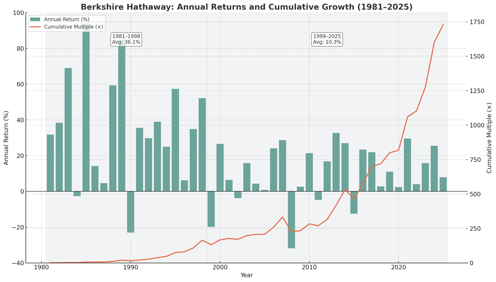
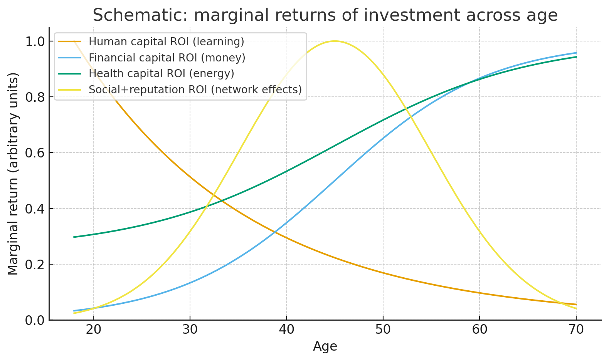
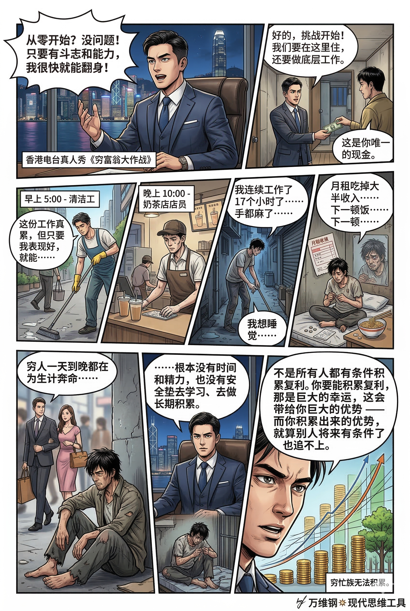

# 复利：可积累的优势（得到课程讲稿 + AI 加工段）

# 复利：可积累的优势

 [复利：可积累的优势](https://www.dedao.cn/course/article?id=R2Mo65zY4QZ3VnmADEKqEdNAa98jGB)

2026-03-27 08:32

「复利」这两个字你肯定早就听腻了，但人们对复利有很多误解，根本没抓住关键。

你不会因为每天存了一杯咖啡钱而在四十年后得到财务自由。不管练什么项目，你不可能连续365天每天都比前一天好1% —— 任何成长都有上限。而且爱因斯坦并没说过什么“复利是宇宙中最强大的力量”。

人生没有那么简单。但复利的确是个极为有用的、而且是战略性的工具，它专门做乘法，能让你积累别人无法短期追赶的优势。

复利不只是金融工具，你最重要的资本很可能不是钱。但说钱比较容易理解，咱们先讲两个关于钱的故事。

股神巴菲特在 89 岁那年，身价是 845 亿美元。这对一般股民来说是个不可思议的大数。但如果你考察巴菲特整个炒股生涯的平均年化收益率，那大概是 22%，听起来就不是那么离谱。运气好的时候，你一年也能赚 22%，对吧？巴菲特成功不是因为利率高。

事实上，华尔街最牛的对冲基金，文艺复兴科技公司，从 1988 到 2020 年平均年化收益率高达 66%，比巴菲特可强多了。

但文艺复兴的创始人吉姆·西蒙斯（Jim Simons），身价才两百多亿美元，只有巴菲特的四分之一。

为啥呢？因为巴菲特的炒股生涯是从 10 岁开始，而西蒙斯是 50 岁才找到那套神奇算法。

复利复利，成功最重要的不是利率有多高，而是持续的时间有多长。

再看一个更接地气的思想实验。设想有两个同学，小张和小李，都在 25 岁开始工作，60 岁退休，他们的投资年化收益率都是 8%。小张从 25 岁刚工作就每月定投 1000 元，一直投到 60 岁，总共投了 35 年；而小李晚了 10 年，35 岁才想起来存钱，但是他奋发追赶，每月定投 2000 元！也是投到 60 岁。

小张 35 年总共投入 42 万元本金，小李 25 年总共投入 60 万元本金。你猜他俩退休时谁钱多？

答案是小张 229 万，小李 191 万。

早开始比多投入重要得多。寸金难买寸光阴。

这就是乘法 —— 确切地说是指数增长 —— 的魔力。「复利（compound interest）」，是指利息不仅计在本金上，还计在之前已经累积的利息上。

在 35 岁这一年，小张已经积累出来一个很大的乘数，那是小李快跑也没有办法迅速赶上的优势。

存钱也好借钱也好，复利其实是一台用时间做成的放大机器。你希望站在积累而不是赊欠那一边，但首先你希望能用上这台机器。

**这个世界之所以是重尾的，之所以有那么大的贫富差距，就是因为有些人在乘法世界，有些人在加法世界。二者的关键区别就是有没有用上复利。**

法国经济学家托马斯·皮凯蒂（Thomas Piketty）在《21 世纪资本论》中提出一个著名的关系式：**r > g**

其中 r 是资本平均回报率（Return on Capital），也就是复利利率；g 是经济增长率（Growth），大致对应工资和 GDP 的增长节奏。

如果你只是上班拿工资，没有资产性收入，你的收入就会按照 g 的节奏增长，大致就是中国经济每年涨百分之几你的工资就涨百分之几；而如果你有资产性收入，比如买点理财、股票和房产，你的资产则是按照 r 来涨。r > g 就是说一般而论，钱生钱的速度快于人挣钱的速度……皮凯蒂说这就是为什么遍身罗绮者不是养蚕人。

那你说为啥 r > g 呢？可能因为劳动受限于人的肉体凡胎和物理边界，而资本可以在全世界不知疲倦地跑能选择高回报机会；也可能因为风险和耐心必须有个溢价。

要点是，贫富差距不是因为富人坏更不是因为穷人懒，而是因为富人能用上复利。他们玩的是不同的游戏。

或者说，是因为富人的优势是可积累的，而出卖劳动力是不可积累的。

听到这里你可能会说，可乘法世界是需要冒险的啊，毕竟世界上没有每年固定给 22% 利率的长期投资。没错。下面这张图是巴菲特1981年以来的业绩 ——

巴菲特职业生涯平均年化收益率是 22%，他可不是每年都能做到 22%：他有时候赚得多，有时候少，有时候赔钱。事实上巴菲特 1999 年以后的表现远不如之前，但他的财富恰恰是 1999 年以后才变得特别耀眼……那只不过是因为之前积累的乘数被放大了。

这个道理是乘法世界的确有风险，跟加法世界一分耕耘一分收获完全是两码事。我们看到的很多富人是「幸存者偏差」，可能有很多人使用跟他们一样的投资（或者投机）策略，都早已经失败离场了，没有进入我们的视野……你得想办法不离场才行。

风险管理的工具咱们后面再讲。这里的关键是利率是靠不住的。复利真正的秘密是长期、是早开始：它是一个必须长期存在、不爆仓、保持积累的系统。

「长期主义」这个话好说，其实很难做到。我们日常的直觉都是加法运算，干一份活儿拿一份钱吃一份饭，好像天经地义；我们的大脑不是很擅长思考“每年 8%”这种运算。今天的快乐很真，未来的收益很远。

如果你在一家比较正规的美国公司上班，你每年在社保之外再存多少退休金，公司会按照一定比例给你「匹配」—— 比如你存上总收入的 5%，公司就再帮你存 5%，等于你拿双份。那这 5% 就属于你白得的收入，是应该闭眼存上的，对吧？

可是有大量的美国人，恰恰就没存。有统计发现 [3]，美国有退休计划的员工中有 18% 的人干脆一分没存；还有 31% 存了点但没存到拿满公司匹配的档位。他们等于是为了今天多花点，宁愿白白把钱扔掉。他们临近退休才后悔。

你跟这些人谈啥复利？

对比之下，咱们中国人倒是很擅长延迟满足。这大约是东亚文化的先天优势，可能起源于农业或者科举。这两个项目都需要你在前期坚持单方面投入很长时间，才能有收获。

东亚文化最爱投资教育也最爱存钱。这的确是跟复利做朋友，东亚人移民到哪里都是当地最有钱的族裔。

但这两条赛道未免太窄了。一个人一辈子只做考试拿高分和银行里多存点钱这两件事儿，如此辛苦的人生有什么意思呢？

**复利不应该只用在考试和攒钱上，其实你还可以积累别的优势。**

法国社会学家皮埃尔·布迪厄（Pierre Bourdieu）早在1980年代就提出，「资本」不只是钱，还有文化资本、社会资本等等。借助这个视角，以下这七种资本，都值得你积累复利 ——

1. **金钱资本**，现金、股票、房产，是最直观的钱。金钱容易量化并且可以继承，但往往只是其他资本的副产品。
2. **人力资本**，**你的知识、技能、判断力和学习能力。**诺贝尔经济学奖得主加里·贝克尔（Gary Becker）的一个洞见 是人力资本的回报期特别长，所以越早投入越好。
3. **健康资本**，**你的体能、精力和慢性病风险。**年轻人以为健康是默认的，中老年人才能认识到健康是一种耐用资本存量，不是今天吃两颗保健品就能解决的问题。
4. **社会资本**，**你的关系网络，你跟别人之间有多少互惠和信任。**这里需要注意格兰诺维特（Mark Granovetter）提出的「弱联系」理论：很多重要机会来自你“朋友的朋友”，而不是你最亲近的人。
5. **声望资本**，**你有多大的品牌价值？别人对你是否靠谱的整体印象如何？**这是马太效应最典型的战场：你口碑越好，越有机会来找你。
6. **心理资本**，**包括自控力、韧性、情绪稳定和意义感，尤其要有尽责性。**心理资本是整套复利系统的操作系统，它决定你能不能长期稳定地做正确的事。
7. **体验资本**，**你做过什么难事、去过哪些地方、跟谁一起经历过什么。**高质量的体验叙事会沉淀为判断力、叙事能力和身份认同。科学家早就知道，体验型消费比纯物质消费更能提升长期幸福感。

这些资本不是互相矛盾的。它们都可以互相叠加和转化。比如你心理资本和健康资本很富裕，你就容易做个办事特别靠谱、长期守信的人，那么你就有声望资本；于是别人更愿意跟你合作，你就得到了社会资本；这又让你有机会参与很多高质量项目，那么你的成长速度就加快，这就是人力资本；然后这一切都是很好的体验资本，都在增加你的金钱资本……

这是一个美妙的正反馈过程。飞轮一旦跑起来，你会对积累复利上瘾。

那你说这也要积累那也要积累，如何取舍呢？再说总不能只积累不消费，否则人岂不成了机器？

首先积累本身就是一种乐趣，而且好的消费也是一种积累，最起码能积累体验资本。积累复利绝不只是存钱，更要储备精力、付出注意力和时间。不过不同处境之下，的确有不同的积累优先级。

因为复利的利率不同。咱们现代人最好建立「ROI 意识」，也就是投资回报率（Return on Investment）：这个处境之下最该积累什么，取决于 ROI。

下面这张图是 GPT 根据它自己的理解，画的几个资本在不同年龄的 ROI ——

金钱资本任何时候都可以投，但青少年时代投人力资本最值得，中年经营社会资本和声望资本回报最高，健康资本越老越重要。这样说来如果你是个没有多少闲钱的年轻人，你就别学巴菲特研究炒股了，你最该投资的是自己；而你如果是个身体还不错的中年人，就先别着急研究养生。

从数学上讲，最值得积累的是能抬高其他资本的利率的那个资本。先把它提上来，你此后积累啥都快。

把这些都考虑到，我们可以粗略地规划一个人生复利路线 ——

1. **18–25 岁是「抬利率期」，**先把自己变成一个升级快的系统。这时候的钱和时间尽量砸在人力资本上，哪怕借点钱也别耽误读书，最好能去个大城市；
2. **25–35 岁是「锁赛道期」，**暂停广泛探索，选定一个高复利赛道深耕。大幅度提升专业能力，建立行业声望，并且开始主动经营社会资本，有余钱可以搞长线投资了；
3. **35–50 岁是「规模期」，**理想情况下你的利率已经很高，你的声望和关系产生了网络效应。这时候要善于用团队、制度和工具来放大自己，尽可能多赚钱但小心健康和声望的归零风险；
4. **50–65 岁也许是「抗衰期」，也许是「新的探索期」，**取决于你当时的具体处境。不论如何，你都应该考虑把自己的经验压缩成可传递的知识，把琐事尽量外包；
5. 一般人 65 岁以后就退休了，那大约就是「分红期」，但你也许可以给子弟、给社会搞点复利。

复利视角下，年轻的强，是增长；中年的强，是杠杆；老年的强，是取舍。

最后我必须再给你讲个故事，讲复利不讲这个故事就是站着说话不腰疼。

2009–2013 年间，香港电台搞了个真人秀节目叫《穷富翁大作战》：请上市公司 CEO、富二代、律师等中上层人士，带着几乎为零的现金，去住笼屋和板间房，做清洁工、露宿者和奶茶店店员，在基层打拼。参加者原本坚信只要我有能力和斗志，从零开始也能很快翻身 —— 可是真实体验了每天工作 17 个小时、月租吃掉大半收入、每一顿饭都要精打细算的“穷忙族”生活之后，他们普遍的感受是：

穷人一天到晚都在为生计奔命，根本没有时间和精力，也没有安全垫去学习、去做长期积累。

不是所有人都有条件积累复利。你要能积累复利，那是一个巨大的幸运，这会带给你巨大的优势 —— 而你积累出来的优势，就算别人将来有条件了也追不上。

再想想开头小张和小李的那个故事吧。不要浪费这个幸运。

**GPT 有感于复利，做了一首偈子：**

> 把钱当种子，别当战利品；  
> 把身心当土壤，别当耗材；  
> 把关系当气候，别当工具。  
> 利率就在你身上，复利长在系统里。

---

### 事实核查

你描述的内容核心事实**全部属实**，以下是针对该节目相关信息的详细核查与佐证：

**节目基础信息核查**

《穷富翁大作战》（*Rich Mate Poor Mate Series*）确由**香港电台（RTHK）公共事务组**制作，是聚焦香港结构性贫穷与贫富悬殊问题的真人实境秀节目。

- 播出时间与季数：节目在2009-2013年间共播出三季，第一季2009年首播、第二季2011年播出、第三季2013年上线，与你提及的时间范围完全吻合。
- 核心规则：节目要求参与者上交所有现金、信用卡、身份证明等，仅保留极少启动资金（最低仅15港元），在5-7天内体验底层生活，全程不得动用原有资源和人脉。

**嘉宾与体验内容核查**

节目邀请的参与者，均为香港社会中上层人士，与你描述的群体完全匹配：

- 嘉宾身份覆盖：上市公司行政总裁、富二代名流、资深律师、投资银行家、连锁餐饮集团老板、专业精英、选美模特等，三季累计有16位相关人士参与体验。
- 典型代表包括：纵横二千集团（G2000品牌）创始人、香港豪门田家后人田北辰；谢瑞麟珠宝（国际）有限公司副主席兼行政总裁黄岳永；曾任律师的郑晴心；金融投资公司主席陈光明等。
- 体验内容：参与者需入住月租数百至千余港元的笼屋、板间房，甚至露宿街头；从事时薪极低的基层工作，包括街道清洁工、奶茶店/超市店员、外卖员、垃圾回收、街头小贩等，与你描述的场景一致。

**嘉宾的信念转变与核心结论核查**

1. **初始信念**：绝大多数参与者在体验前，均秉持“个人能力+斗志足以突破贫穷，从零开始也能翻身”的精英认知。最具代表性的田北辰，体验前明确表示“信奉自由市场，如果你有斗志，即使是弱者，也可以变成强者”。
2. **体验后的普遍共识**：与你描述的结论完全一致，几乎所有参与者都推翻了原有认知，核心感慨集中于：

   - 底层人群陷入“穷忙死循环”：超长工时（基层清洁工普遍单日工作16-17小时）完全耗尽体力与精力，仅能勉强维持温饱，根本没有多余的时间、精力去学习技能、做长期规划。
   - 生存成本挤压所有上升空间：月租会吃掉大半的月收入，每一顿饭、每一次交通都要极致精打细算，没有任何风险安全垫，一次意外就可能彻底陷入赤贫，完全不具备“试错、积累、逆袭”的基础条件。
   - 多位嘉宾最终明确提出：贫穷的核心并非“不够努力、没有斗志”，而是结构性困境下，底层人群根本没有选择的余地，所谓的“努力就能翻身”，只是脱离现实的精英幻觉。

---

这篇文章是对“复利”概念极具深度和现实感的重构。它不仅打破了市面上泛滥的“坚持每天进步1%”的廉价鸡汤，还将复利从单一的金融概念，升维成了人生战略和系统动力学。

### 核心洞见

1. **早开始 > 高收益。** 人生最大的奢侈品是“时间周期”，寸金难买寸光阴在数学上绝对成立。
2. **复利的前提是“活下来”。** 任何乘以0的结果都是0。健康破产、声誉毁坏、资金爆仓，都会让之前的积累瞬间归零。
3. **建立“ROI（投资回报率）意识”。** 年轻时投资“自己（人力资本）”收益最高；中年时投资“连接（社会/声望资本）”杠杆最大；任何时候投资“健康（健康资本）”都是保底。
4. **跨界转化是最高级的玩法。** 把体验转化为认知，把认知转化为能力，把能力转化为声誉，把声誉转化为财富。资本之间是可以互相兑换的。
5. **冗余是复利的土壤。** 没有安全垫（时间、精力、金钱的结余），人就会沦为被短期生存驱动的“耗材”。
6. **去神话与抓本质**：文章开篇就粉碎了“每天一杯咖啡钱能财务自由”的幻觉。复利的本质不是“无脑坚持”，而是**“做乘法”与“积累不可逆的优势”**。在加法世界（打工出卖时间）里，你的努力是线性的；在乘法世界里，前期的基数会成为后期的放大器。
7. **时间的权重远远大于收益率**：巴菲特与西蒙斯的故事、小张与小李的对比，都在说明一个反直觉的数学现实：**早开始比高收益率或高投入（增加本金）**重要得多。
8. **阶层固化的底层逻辑（$r>g$）**：引用皮凯蒂的理论，点出了残酷的经济学现实——资本的自我繁殖速度永远快于劳动力的工资增长速度。富人之所以富，是因为他们身处“乘法系统”，而穷人被困在“加法系统”。
9. **人生资本的多元化**：这是文章最精彩的部分。它将金钱复利的逻辑迁移到了人生的七个维度（金钱、人力、健康、社会、声望、心理、体验）。这意味着，即使你暂时没有钱，也可以通过积累“信任”或“技能”来启动人生的复利飞轮。
10. **现实主义的悲悯**：文章结尾提到香港真人秀《穷富翁大作战》，承认了**“拥有积累复利的条件，本身就是一种特权”**。穷人因为缺乏“安全垫”，每天都在处理危机，无法着眼于长期。这提醒我们：如果你现在有时间和精力思考复利，你已经是个幸运儿，绝不该浪费这种幸运。
11. **“不下牌桌”的知易行难**：乘法世界有风险，关键是“不爆仓”。但现实中，普通人要跨越到乘法世界，往往需要承担极大的初始风险（比如辞职创业、倾尽积蓄投资）。**如何在资源极度有限的情况下，既敢于冒险获取资产，又能保证不爆仓？** 这是文章未能详细展开的痛点。
12. **$r>g$ 的宏观局限性**：在经济高速增长期（过去几十年的中国），人力资本的增长（g）其实是非常可观的，很多人靠打工也能积累大量财富。但在当前全球经济增速放缓、AI替代脑力劳动的背景下，普通人获取高回报率（r）资产的门槛正在呈指数级上升。现在普通人面临的问题不是“不知道要买资产”，而是“买什么资产都在缩水”。
13. **“人生规划表”的线性陷阱**：文章给出了18-65岁的分阶段规划。但在不确定性极高的今天，这种线性规划可能过于理想化。很多人在35岁时不仅未能“规模化”，反而面临裁员和行业消失。未来的复利模型，可能更需要强调**“可迁移的跨界能力”和“多次重启的韧性”**，而不是在单一赛道死磕。

### 行动指南 

#### 1. 财务底座建设：把自己拉出“穷忙”泥潭

- **建立“强制安全垫”**：不管工资多少，每月发薪日**强行划走10%-20%**到一个不可触碰的账户（零存整取或定投宽基指数基金，如沪深300、标普500）。
- **杜绝“坏复利”**：绝对不碰消费贷、网贷、信用卡分期。利息的乘法效应在债务上同样可怕。

#### 2. 人力与心理资本积累：提升你的“利率 (r)”

- **每天一小时的“硬技能”时间**：选择一项保质期长、AI难以完全替代的技能（如深度沟通、复杂项目管理、特定领域的专业壁垒），每天雷打不动专注一小时。
- **刻意记录与复盘（心理资本）**：每周写复盘日记。不仅记录做过什么，更要记录“踩过的坑”和“深刻的体验”。这些会内化为你的判断力。

#### 3. 声望与社会资本积累：打造你的“个人品牌”

- **做个“靠谱”的人**：在职场和生活中，贯彻“凡事有交代，件件有着落，事事有回音”。靠谱是普通人积累声望资本最廉价、也最有效的方式。这会引发“马太效应”——好机会会自动找上你。
- **经营“弱联系”**：每月主动约一个不在你日常核心圈子里的朋友/同行喝咖啡或在线交流。不要带有极强的功利目的，仅仅是交换信息和建立信任。

#### 4. 健康资本防守：防止人生“爆仓”

- **把睡眠当作最高级的投资**：熬夜是用健康资本（会爆仓）去换取微薄的短期体验资本。保证7-8小时睡眠，这是维持情绪稳定和决策质量的物理基础。
- **微量持续的运动**：每天快走/慢跑20分钟，或做几组深蹲俯卧撑。运动不是为了练肌肉，是为了保持血管弹性和精力充沛。

#### 5. 清单建议

- [ ] **每日：** 存下一点钱（哪怕10块钱）/ 专注学习1小时 / 运动20分钟 / 睡够7小时。
- [ ] **每周：** 兑现对别人的一个承诺（积累声望）/ 做一次深度复盘 / 主动联系一个弱关系朋友。
- [ ] **每月：** 检查一次自己的资产状况，确保没有产生恶性负债 / 尝试一件有挑战的新事物（积累体验资本）。

**把身心当土壤，别当耗材。**不要高估一天的努力，更不要低估十年的积累。今天就开始，哪怕动作很小，只要方向是对的，时间就是你最忠诚的朋友。

### 走入真实世界

> 你还有什么补充的吗？有什么深度见解吗？

在上一轮的解读中，我们主要顺着文章的逻辑框架进行了梳理和延展。如果你希望再往下深挖一层，触及**复利在真实世界中运转的“底层密码”甚至“阴暗面”**，我们还需要补充几个极度重要、但在大众讨论中经常被忽视的深度见解。

这些见解将从**数学常识、系统动力学和人性弱点**三个维度，对“复利”进行更冷酷、也更高级的剖析：

#### 不仅要懂“正复利”，更要警惕“负复利”（系统性黑洞）

文章都在教我们如何积累优势，但现实中，大多数人之所以无法翻身，不是因为没找到好赛道，而是被**“负复利”** 拖垮了。

- **债务的恶魔属性：** 信用卡分期、网贷，就是用复利在收割你。
- **健康与情绪的负面累积：** 每天少睡一小时、长期保持不良坐姿、习惯性抱怨、留在有毒的关系里……这些看似微小的损耗，同样遵循指数级放大的规律。**50岁之后的心梗或抑郁，就是生理和心理上长期“负复利”的总爆发。**
- **减法策略：** 在追求任何正向复利之前，你的首要任务是**“止血”**。消除生活中的负复利（戒掉坏习惯、还清高息负债、离开消耗你的人），比寻找高收益的投资更立竿见影，且成功率是100%。

#### 真实的复利不是平滑曲线，而是“S型曲线”的接力

复利图表是一条无限向上的完美曲线。但这在物理世界和人生中是不存在的——**树长不到天上去。**

- **技能的边际收益递减：** 任何一项技能（比如敲代码、做PPT、甚至外语）练到前20%可能只需两年，但要练到前1%，可能需要再花十年。此时，在这项技能上继续死磕，它的ROI（投资回报率）其实已经暴跌。
- **如何破局（跨越S曲线）：** 高手的人生复利，不是在一条曲线上无限延展，而是在第一条曲线（比如专业技能）达到平台期之前，利用积累的资源，**果断跳跃到第二条曲线**（比如管理能力、商业模式创新、个人IP建设）。
- **洞见：** 永远不要在一棵树上吊死。**复利的最高境界，是“资本的跨界置换（Capital Arbitrage）”**。用时间换取技能（人力资本），用技能换取金钱（金钱资本），用金钱买回时间并结交高人（社会资本），最后用社会资本撬动更大的杠杆。这叫**“复利升维”**。

#### 遍历性：为什么你不能照搬富人的高风险策略？

文章提到了“幸存者偏差”，但可以用一个更硬核的数学概念来解释：**遍历性**。

- **什么叫非遍历性？** 假设有一个游戏：掷骰子，1-5点你资产翻倍，掷出6点你直接破产出局。对于群体来说（100个人一起玩），总资产是增长的；但对于个体来说，**只要你玩的时间足够长（长期主义），你一定会掷出6，你的结果必定是归零。**
- **富人的游戏与你的游戏不同：** 王健林可以给王思聪5个亿去“试错（亏光了再回万达上班）”，这是因为王家有无限的游戏币（具有遍历性）；普通人如果拿全部身家去加杠杆炒股或创业，一旦爆仓，就彻底丧失了重新上牌桌的资格（非遍历性）。
- **洞见：** 对于普通人，**“不下牌桌”的重要性远远、远远大于“赢一把大的”。** 任何带有“极小概率会导致彻底毁灭（爆仓、坐牢、猝死）”的策略，不管眼前的收益率（r）多高，从长期复利的视角看，其数学期望值都是0。**永远要留存备用金，永远不要押上全部。**

#### 穿越“失望之谷”的心理学外挂

为什么明明懂得复利的道理，99%的人还是做不到？因为人类的大脑在进化过程中，只适应线性的“即时反馈”（看到果子就摘，遇到老虎就跑），根本无法直观感知“指数级增长”。

- **失望之谷：** 在复利曲线的前期，你的实际产出，会远远低于你头脑中“线性预期”的回报。这段巨大的落差期，被称为失望之谷。比如你健身了3个月，或者做自媒体写了50篇文章，发现毫无变化。此时，绝大多数人会选择放弃。
- **如何欺骗大脑？建立“过程指标”替代“结果指标”。**

  - *错误视角：* “我坚持了100天，为什么还没赚到钱/瘦下10斤？”（盯着外部结果，容易崩溃）。
  - *正确视角：* “我已经成功打造了每天阅读1小时的系统，我的履约率是100%。”（盯着内部系统的运转，获得心理奖励）。
- **洞见提炼：** 在复利的拐点（飞轮效应）真正到来之前，**你需要把自己活成一个“不需要即时正反馈的机器”**。把关注点从“目标（我想得到什么）”转移到“体系（我今天按纪律执行了吗）”上。

**不要过早地追求“平衡”，年轻人需要局部的“极度不平衡”。**

社会主流常告诉我们要兼顾工作、生活、爱好。但在你人生最初的资本积累期（比如20-30岁），“全方位平衡”往往意味着“全方位平庸”。因为你的资源（时间、精力、金钱）极其有限。

想要启动飞轮，你必须在某一个特定的、具有长远价值的“资本”上（比如一项核心硬技能，或一个极具潜力的行业经验），进行**压倒性的、不平衡的饱和攻击**。

就像火箭升空，70%的燃料都消耗在突破大气层的头几分钟。等你冲破了地球引力（跨越了穷忙的加法世界，获得了第一桶金或不可替代的核心竞争力），进入了真空轨道（乘法世界），你才有资格、有余力去谈论“人生的松弛感与平衡”。

复利是一把屠龙刀。挥得动的人，时间会帮他劈开所有的障碍。**在这个世界上，能抵抗时间流逝的唯一武器，就是做时间的朋友。**

### AI 杠杆

> 在AI时代的当下，普通中年人如何借用AI这个杠杆，以复利思维为工具，实现突围呢

对于普通中年人当下正面临着双重夹击：

- 一方面，体力和精力开始不可逆地走下坡路，面临着年轻人的内卷；
- 一方面，AI（人工智能）的爆发式普及，正在无情地摧毁传统经验的壁垒，那些曾经需要熬夜加班才能交付的脑力劳动（写报告、做PPT、写代码、画图），AI几秒钟就能完成。

**如果我们把AI看作是一台“复利放大器”，中年人其实迎来了历史上最好的一次“跨越阶层、实现突围”的机遇。**

结合前面的复利理论和7种人生资本，中年人借用AI杠杆的突围之道，核心在于完成一次身份跃迁：**从“出卖技能的执行者”升级为“调动AI的操盘手”。**

在AI时代，复利方程式 $y = x^n$ 中的变量发生了质变：

1. **AI让“执行成本”无限趋近于零。** 过去你需要花一天写一份方案，现在AI五分钟写完。这意味着“初级人力资本”的价值被迅速清零。
2. **AI让“判断力”和“信任”的溢价呈指数级上升。** AI什么都会，但它不知道“应该做什么”以及“这对不对”。**品味、决策力、行业直觉、人与人之间的深度信任**，成为了AI时代最稀缺、回报率最高的资产。

对于中年人来说，你最大的优势是你在物理世界摸爬滚打十几年积累的**“暗知识”**——那些书本上没有的行业潜规则、搞定难缠客户的手段、对复杂人性的洞察。

#### 策略一：经验资本 + AI = 构建“超级个体”的资产库（高倍数杠杆）

不要去和年轻人比拼谁掌握的AI工具多，你要做的是**把你的“经验”转化为“资产”**。

- **过去（加法）：** 你脑子里的经验只能指导你手头的工作，你停下，产出就停下。
- **现在（乘法）：** 将你的行业经验、工作SOP（标准作业程序）、避坑指南，喂给AI（比如定制一个属于你的专属skills或知识库）。
- **复利效应：** 你实际上在利用AI“克隆”一个不需要发工资、24小时待命的顶级助理。你每向这个AI知识库输入一个优秀的行业案例或提示词（Prompt），你的这个“数字分身”就变强1%。**这是属于你的数字资产，它可以无限次为你产生红利。**

#### 策略二：社会资本与声望资本的降维打击

- **AI补足了你的“内容产能”：** 以前你想打造个人IP，想在行业群里输出洞见，或者写一本书，苦于没有时间和文笔。现在，你只需要对着手机录一段5分钟的语音（讲一个你今天处理的真实行业危机），扔给AI，让它帮你润色成一篇极具深度的行业爆款文章，或者一套精美的PPT。
- **复利效应：** 用AI极大地降低输出门槛，高频次地向外界展示你的“专业判断力”。AI负责苦力（排版、修饰），你负责灵魂（洞见、故事）。**由于内容产出变容易了，你的声望资本（个人品牌）将以过去十倍的速度积累。**

#### 策略三：跨越“非遍历性”，开启极低成本的试错创业

中年人不敢创业，是因为背着房贷和家庭（不能爆仓）。但AI极大地降低了创业的初始成本。

- **过去：** 搞个副业或小产品，需要找程序员、设计师、文案，成本极高，试错风险极大。
- **现在：** 你一个人就是一个团队。利用AI写代码、建网站、做Logo、写营销文案。你可以同时跑通3个低成本的商业测试（MVP）。
- **复利效应：** 这改变了风险模型。你不再需要押上身家性命。你可以用极小的时间成本，不断在市场中掷骰子，直到找到那个胜率极高的“飞轮”，然后再投入资源。

#### 策略四：心理资本的绝对防守（对抗AI焦虑）

在AI时代，信息过载和技能淘汰的恐慌，是最大的“负复利黑洞”。中年人极易陷入“我快被淘汰了”的内耗中。

- **战略定力：** 认清一个事实：**AI迭代虽快，但人性的演化极慢。** 无论AI多聪明，商业的本质依然是“为人解决问题”、“建立信任”、“承担责任”。AI无法替你请客户喝顿酒，无法替你在危机时拍板承担法律责任。
- **复利效应：** 你的情绪越稳定，越能在这个群体性焦虑的时代脱颖而出。保护好你的睡眠和健康（健康资本），每天留出断网时间。**一个身体健康、情绪稳定、还能从容调用AI的中年人，在职场上是降维打击。**

复利长在你的日常系统里。请尝试把以下习惯加入你的生活：

#### **每日微操：20分钟的AI驯化期**

- **遇到任何脑力停滞，先问AI：** 无论是写一封得罪人的拒信、策划周末的家庭旅行，还是分析一个难搞的客户心理。不要自己从零开始憋，**养成“让AI出草稿，我来做修改”的肌肉记忆。**
- **投资你的提示词（Prompt）：** 当你发现让AI做某件事的效果很好时，把那段“指令”保存下来。这就是你的生息资产。

#### **每周沉淀：建立1个自动化节点**

- 审视过去一周你做了哪些“重复性的烂活”（比如每周的周报、某个特定格式的数据整理）。
- 花1个小时，用AI为这个具体场景写一个自动化的工作流或模板。**下周，这件工作的时间从2小时变成了2分钟。这就是结结实实的复利。**

#### **每月破圈：用AI杠杆输出一次价值**

- 总结你这个月在行业里的一个深刻洞察（最好是AI不知道的，基于你的实战血泪史）。
- 用AI帮你把这个洞察包装成一篇文章、一份清单或一条短视频脚本。
- 分享到你的朋友圈、行业群或知乎/小红书。**持续做，你就是在经营“声望资本”的复利池。**

对于中年人来说，AI不是终结者，而是你手里那台“用时间做成的放大机器”的超级引擎。

**用你的阅历去指挥AI拼产出。**你要坐上马车，学会挥舞AI这根鞭子。哪怕你现在每天只用AI帮你省下半小时，这半小时用来锻炼身体、陪伴家人、或者思考战略，这多出来的半小时，就是你开启人生下半场复利飞轮的最强本金。

### **复利三部曲**

#### 核心认知：复利的残酷真相

现实中的复利绝不是顺势而为的“下坡滚雪球”，而是极度艰难、反人性的“上坡推雪球”。它具备三个真实特征：

1. **不均匀**（起伏不定）、**不连续**（常被意外打断）、**不对称**（亏损容易回本难）。
2. 复利的基础不是“最大化利益”，而是**“活下去（生存）”**。

#### 底层算法：人生复利三部曲（To Be - To Choose - To Do）

**1. To Be（存在 / 核心身份）：知止与内核**

- **核心理念**：明确“我是谁”，不追求一生的“最大化盈利”，而是追求“最大化幸福效用”。
- **行动准则**：懂得“知止”，不为了攀比而贱卖自己的“概率权”或去冒毁灭性风险；界定并死死守住自己的人生基本盘。
- **角色定位**：做个**“智者”**——定方向，不迷茫。

**2. To Choose（抉择 / 战略选择）：资源配置与不对称性**

- **核心理念**：做正确的事。努力是线性的，而选择是指数级的。
- **行动准则**：

  - 寻找“自带重力的斜坡”（顺势而为，不靠死磕的意志力）。
  - 寻找**“不对称”**的机会（下行风险有限，上行收益无限）。
  - 懂得拒绝（专注稀缺，大部分机会是陷阱）。
  - 优化环境（你和谁在一起，就会成为谁，环境即算法）。
- **角色定位**：做个**“高手”**——做抉择，不内耗。

**3. To Do（践行 / 行动结构）：连接器与递归引擎**

- **核心理念**：行动是公式中的“乘号”，是应对随机世界最珍贵的“确定性”。
- **行动准则**：通过专注、加杠杆、外包等微小而持续的行动，将每一次的结果变成下一次的本金，构建反脆弱系统。
- **角色定位**：做个**“杀手”**——拿结果，不拖延。

#### 场景应用

- **财富复利**：**“追求几何平均值的最大化”**。本质是买入一台对抗熵增、持续产出的机器。要警惕大起大落的“方差损耗”（算术平均值陷阱），做好仓位管理（凯利公式），保住本金。
- **成长复利**：**“分形理论”**（局部包含整体特征）。成长不是做出来的，而是“长”出来的。不要做苦行僧，要做“园丁”，把每一个微小的日常行动（生成元）做好，系统自然会演化出宏观的复利。
- **关系复利**：**关系本身是目的，而非手段**。真诚、守信和长期主义会织就一张信任之网。到了复利拐点，不是你在做加法，而是全世界在帮你做乘法。
- **健康复利**：**健康是撬动一切的“首要系数”（0前面的1）**。生命体具备“反脆弱性”，健康不是消耗品，而是可以通过定投（睡眠、饮食、运动）实现指数级增长的资产。

**人生复利本质上是一个哲学命题，是一场关于“成为自己”的无限游戏。** 

剥离战术上的盲目勤奋，先明确身份与底线（To Be），再寻找不对称的优势位（To Choose），最后通过持续的微观行动形成分形与叠加（To Do），最终让财富、成长、关系与健康在时间的复利下，长成一片繁茂的森林。
