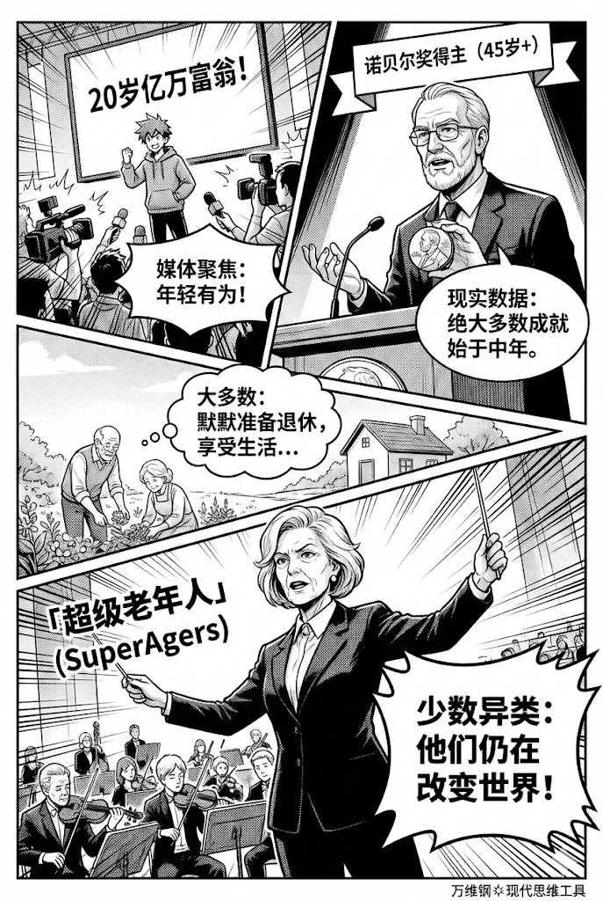
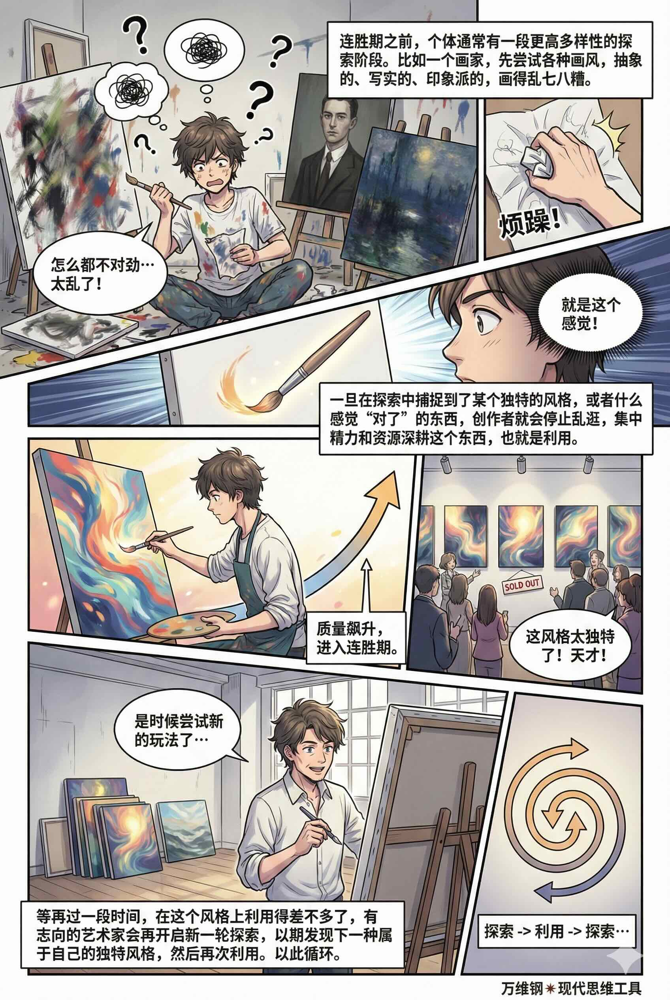

# 探索与利用：怎样继续做个年轻人（得到课程讲稿 + AI 加工段）

# 探索与利用：怎样继续做个年轻人

[探索与利用：怎样继续做个年轻人 ](https://www.dedao.cn/course/article?id=BM30m4na5NkyKQQwOxKjvDg7Eowd2G)

到了一定年龄，你会有一个明显的观感：影视剧的主人公都是年轻人。他们一般在 20 到 30 岁之间。他们谈恋爱、拯救世界、创业，或者只是犯错然后成长。过了 40 岁，有些剧情就不会发生在你身上了，再往后你可能连存在感都没有。

2015 年北美票房前 100 名的电影中，60 岁以上的角色 —— 不是只统计主角，而是所有的角色 —— 只占 11% [1]，远远低于真实世界的人口占比。

舞台属于年轻人。中老年人在屏幕上通常只有两个功能：要么是作为背景板的慈祥长辈，要么是作为阻碍年轻人成长的顽固势力……就算还允许你存在，你也是没戏了。

这是一种偏见，还是对真实世界的准确描写呢？

一方面，在真实世界里干大事的，其实不是年轻人，而是中年人，甚至中老年人。以前人们认为科学发现是年轻人的事业，但现在绝大多数诺贝尔物理学奖得主的获奖工作，都是在 40 岁以后完成的。媒体喜欢报道大学生甚至高中生创业成为亿万富翁的故事，但中年人创业成功的概率远远大于年轻人。创业成功者在创业那一年的平均年龄是 45 岁 。再想想当今影响力最大的电影导演、艺术家，特别是政治家，他们大多都是年过六十的人。

可是另一方面，干大事的只是少数人。绝大多数中老年人的确正在退出社会舞台。他们默默地收拾行囊奔向退休生活。他们的日子的确不值得被拍成电影，因为他们不再制造任何悬念。

所以中老年人其实有两种：一种是顺应社会设定、逐渐熄火的普通人；另一种，则是被科学家称为「超级老年人（SuperAgers）」的异类。影视剧只是迎合普通人的观感而已。

这一讲的思维工具告诉你怎样做第二种人。

如果你想让自己有剧情，你得折腾才行。科学的说法叫「 探索 （Explore）」，也就是今天尝试一下这个，明天去一下那里，做一些可能会带来意外回报但是伴随着风险的事儿。

年轻人没有地盘不得不探索，所以总会遇到有意思的事儿。但是人到了中年，已经探索过一片天地，找到了一个舒适区，就会认为自己只要继续待在那个探索成果之中就可以了，这叫「 利用 （Exploit）」。

如果你已经打下了一块很好的地盘，难道不应该就在这块地盘里深耕和好好享受吗？还有必要继续出去探索别的地盘吗？可是如果你从此就不出去探索，万一错过更好的地盘呢？

我们要说的思维工具就是「 探索与利用（Explore / Exploit）的权衡 」。

这其实是计算机科学和决策理论中的一个经典问题，也叫「多臂老虎机问题（multi-armed bandit problem）」：你面前有好多台老虎机，每台机器的中奖概率不同，你不知道哪台高哪台低。你手里有一把硬币，代表有限的时间和精力。怎么办呢？你有两种策略 ——

探索，就是去试那些没玩过的机器。这可能会让你输钱，但也可能让你发现一台超级大奖机器。利用，则是你已经发现了一台中奖率还不错的机器，于是就死守着它玩。探索是付出成本换取信息，利用是对已知的信息榨取最大的收益。

去一家新餐馆吃饭是探索；去那家你最爱吃的老面馆是利用。研发新产品是探索；加注推销那个最畅销的爆款是利用。如何权衡探索与利用？学术界提出了很多算法，我们不必一一细说，但是有几个原则你需要考虑。

第一个原则是先探索，再利用。 你都没见过几个好东西，怎么就能认准眼前这个东西呢？然而很多人恰恰就是不探索就利用，不采样就下注，比如误打误撞进入一行就决定利用一辈子。正确做法是把人生前期当作“采样期”：实习、跨部门、旁听课、做项目、见人、写东西 —— 先知道自己适合什么。

第二个原则是不能一味探索而不利用。 如果你已经大致了解哪些东西是好东西，就应该抓住一个好东西深耕了。

这里有个「最优停止（optimal stopping）」问题，也叫「秘书问题」，也可以叫「选择结婚对象问题」：你不应该遇到第一个感觉不错的异性就结婚，但也不应该看过很多个异性都一直不结婚……数学上的最优解 [4]，是如果异性大致随机分布，你应该在面试过 37% 的人选之后，就判断出什么样的对象对你合适 —— 然后遇到下一个合适的对象就立即结婚。

第三个原则是：哪怕已经拥有一个很不错的可利用选项，也要继续探索。 当然这一条不适合选择结婚对象，毕竟婚姻是终身大事 —— 但很多其他的事情都不是一辈子的事儿，比如说个人找工作、公司出产品。当前利用的项目利润越好，人们就越倾向于不探索。殊不知任何利用都会陷入边际效益递减，等到好处用尽必须探索的时候，已经来不及了。

还有一个关键因素是人的寿命。小孩肯定要多探索，但如果我今年 80 岁，我大概不会再去探索新的就业机会……那这里的度又该怎么把握呢？

数学家早就给出了答案，解法是「 吉廷斯指数 （Gittins Index）」。具体的数学咱们就不讲了，关键在于对未来的利用要有一个折扣：如果一个人预期十年以后他就已经很老了、甚至不在了，那么他今天的快乐就比十年以后的快乐要重要得多，也就没有必要付出成本为十年后探索。

也就是说，探索还是利用，取决于游戏还有多少剩余时间。

如果你的预期剩余时间还很长，你就应该多探索 —— 因为一旦探索到了一个大奖，你还有大把的时间去利用它，收益是巨大的。反过来说，如果你过不了多久就要离开这个游戏，比如说搬到别的城市去住，那就没必要在这个局里继续探索，看哪家餐馆好吃就多去几次吧。

具体的操作，严格来说得现场计算或者查数学表格，看看每个选项的吉廷斯指数来决定……但这个精神是剩余时间越长，探索的价值就越高；剩余时间越短，就越应该减少探索增加利用。

人肯定不应该为了探索而探索，探索的目的是利用。有的人一辈子都在换赛道，今天学这个明天学那个，从来没有深耕过，结果什么都干不成，那确实不行。但我看大多数人的问题是在本该继续探索的年纪，过早地进入了利用模式。

很多人刚过 30 岁就觉得大局已定，甚至大学一毕业就想找个安稳工作干到老。让他换个行业，他说风险太高；让他学 AI，他说他已经 35 岁太晚了。明明后面还有三四十年的职业生涯，简直是对吉廷斯指数的侮辱。

随着年龄变老，一般人慢慢退出探索转为利用，可以说是理性的。但如果你从此只做习惯的事情只跟熟悉的人交往，那也不对。

这里有个特别有意思的机制：从社会生活中退出会加速衰老。

早就有研究发现，社交孤立与更高的早死风险相关。2024 年的一项研究 [7] 用 AI 评估人们的心脏生物学年龄，发现社交孤立的人，其生物学年龄往往比实际年龄更老，并且全因死亡率也显著升高。

为啥呢？这里有个可怕的反馈回路 ——

> \- 退出社交/退出公共生活 → 输入减少（收到的信息、刺激、挑战、人际反馈都少了）  
> \- 输入减少 → 你的大脑和身体启动“节能模式”  
> \- 节能模式 → 更不愿意走出去  
> \- 更不愿意走出去 → 更退出

越退出，就越不健康；越不健康，就越退出，直至走向死亡。

与其说是因为衰老而退出，不如说是因为退出而衰老。

那你说，难道我保持探索就能减缓衰老吗？没错，而且效应很明显。

「 超级老年人 （SuperAgers）」是最近几年流行的一个新概念。这是美国西北大学的一项著名研究 [8]。科学家发现有这么一群年过八十的老人，他们的记忆力和认知能力竟然和中青年一样好。他们的大脑皮层更年轻，甚至在某些区域比中年对照组还厚。他们脑子好使身体也棒，频繁地参与社会活动，有的还在继续工作。

这里面可能有基因的因素，锻炼和饮食结构也都很重要。但最重要的因素是接触新奇有趣的事物，特别是学习新技能。

不是那种轻度参与，什么跟老朋友喝茶聊天听音乐之类 —— 而是实打实的真学习。有研究专门让老年人去学习数码摄影之类需要持续投入、高挑战、学成就真有用的新技能，结果发现记忆力等认知表现切实提升了。反过来说如果只是刷刷短视频、玩个小游戏什么的，效果就没那么明显 [9]。

还有一个研究更狠，让 58–86 岁的老年人同时学习至少三种新技能（比如西班牙语、绘画和音乐创作），就好像上学一样搞密集训练，坚持三个月。结果注意力和记忆力大幅度提升，认知测试成绩提升到了平均比自己年轻 30 岁的水平。更神奇的是，课程结束一年后再测试，这些老年人的认知能力不降反升，竟然进一步达到比自己年轻 50 岁的人的水平。研究者推测这可能是因为他们已经养成了持续学习的生活方式，以至于在课程结束之后继续主动接触新事物。

那可是认知水平年轻三十到五十岁啊……连我都感觉这个结论有点夸张了。但我们可以相信，活到老学到老、终身学习，是真有用。

年轻不是皮肤状态，年轻是系统更新的频率。

比遵循吉廷斯指数、逐步减少探索增加利用更厉害的算法，是把探索和利用搞成固定的节律。

这又是西北大学的研究。复杂系统科学家王大顺（Dashun Wang）发现，各行各业的成功人士，包括科学家、导演、艺术家等等，往往在职业生涯中都有「连胜期（hot streak）」，也就是在三四年的时间内密集地、连续地产出高质量作品，就如同开挂一般。而且连胜期在他们职业时间线上的位置似乎很随机，不一定在早期也不一定在中期，有时候是在晚期。还有很多人会有不止一个连胜期。那这些连胜期是怎么发生的呢？

王大顺等人用 AI 对这些人的作品进行分析，计算一个人在某段时间内的“探索程度”（也就是作品内容的多样性）与“利用程度”（也就是专注度），结果发现了连胜期的秘密：**你总是先探索再利用，利用出成绩之后再探索，再利用 。**

连胜期之前，个体通常有一段更高多样性的探索阶段。比如一个画家，先尝试各种画风，抽象的、写实的、印象派的，画得乱七八糟。你看不出他要成功的迹象。

可是一旦在探索中捕捉到了某个独特的风格，或者什么感觉“对了”的东西，创作者就会停止乱逛，集中精力和资源深耕这个东西，也就是利用。你发现他的作品风格突然统一，质量飙升，进入连胜期。

等再过一段时间，把这个风格利用得差不多了，有志向的艺术家会再开启新一轮探索，尝试各种新的玩法，以期发现下一种属于自己的独特风格，然后再次利用。

以此循环。

最典型的例子就是电影《指环王》的导演彼得·杰克逊（Peter Jackson）。他拍《指环王》大火之前曾经有过很长的探索期，拍过恐怖片、喜剧片、剧情片，然后才找到奇幻片这个成功打法好好利用。杰克逊拍完《指环王》系列（2001-2003）又拍了《金刚》（2005）和《霍比特人》三部曲（2012-2014），可谓是榨干了奇幻片的价值……但是他又开始了新的探索，2018 年（57 岁）转型拍纪录片……

这是一个可操作的职业节律： 探索不是游荡，探索是为了找到可深挖的矿脉；利用不是保守，利用是摸到好牌先打赢再说。

最重要的是，赢了这一把并不是你职业生涯就此定型更不是结束。你挖完这个矿还要再去找下一个矿。人生漫长，你可以经历好几个「探索-利用」循环。

吉廷斯指数的计算依赖于你的剩余时间，剩余时间越短就越要减少探索。但生物学的发现是探索本身可以延长剩余时间。然而不管你能经历多少个循环，吉廷斯指数终究会要求你在临近生命最后的阶段停止探索，毕竟到时候你探索出来什么结果都不再有新的利用价值。

但我觉得你到时候还是应该保持探索。我们探索不一定非得是为了利用，也许我们就是想知道一些信息。满足好奇心本身就是享受。

咱们不是说过吗？**我们最喜欢的不是确定性，而是“把不确定变成确定”的那个瞬间。**

影视剧总爱拍年轻人是因为年轻人的叙事天然带探索。也许我们真正喜欢的不是年轻，而是探索。

---

### 核心观点

1. **探索-利用的权衡法则**：

   - **先探索，再利用**：人生前期应广泛采样，找到适合自己的领域后再深耕。
   - **不能只探索不利用**：找到有价值的矿脉后必须专注开采，才能获得成果。
   - **利用时仍需保持探索**：即便拥有成功的舒适区，也需持续探索，避免边际效益递减，预防路径依赖的危机。
2. **探索的驱动力在于剩余时间**：按“吉廷斯指数”原理，当我们感知的剩余生命越长，探索的价值就越大。多数人的问题在于过早地结束了探索期。
3. **退出探索会加速衰老**：从社会生活与认知挑战中退出，会启动“社交孤立-输入减少-大脑节能模式-更不愿探索”的恶性循环。生理年龄的衰老，很大程度源于这种退出。
4. **“年轻”的本质是系统更新频率**：真正的年轻态不在于皮肤，而在于大脑持续接收新信息、学习新技能、应对新挑战的频率。成为“超级老年人”的关键，就是高强度、真投入地学习新知。
5. **职业生涯的连胜节律——“探索-利用”循环**：杰出者的职业生涯并非一条直线，而是由“广泛探索期”和“专注利用的连胜期”交替构成的多个循环。赢下一局不是终点，而是下一轮探索的起点。

这套策略可以命名为 **“终身探索者”计划**，旨在帮助你打破过早进入利用模式的惯性，建立可持续的“探索-利用”循环。

#### **启动“采样期”，哪怕你已不再年轻 (时长建议：6-12个月)**

此阶段的目标是打破信息茧房，重新激活你的雷达，低成本地发现新矿脉。

- **强制每周“探索配额”**：每周拿出固定时间（例如3-5小时），专门用于与当前工作或舒适区无关的新活动。规则是：**必须“做”而非“看”。**

  - 报名一个你完全不懂的线下课程；
  - 参加一个与你背景迥异的行业沙龙；
  - 开始写一个垂直领域的新博客或视频号，分享你的学习过程。
- **建立“信号”捕捉日志**：在探索中，不要追求立即变现，只记录那些让你感到“有点意思”、“时间变快了”、“比其他人上手快一点”的信号。这些信号就是潜在的矿脉。

#### **发起一轮“利用期”冲锋 (时长建议：2-4年)**

当你从上一阶段的日志中，识别出一个强烈且可行的信号后，立即切换模式。

- **界定“最小可行宝藏”**：将你发现的矿脉具体化。不要只定为“我对AI感兴趣”，要定为“我要用AI工具，为我所在的传统行业的小企业降本增效”。
- **执行“连胜冲刺”**：集中你所有能调动的资源（时间、精力、人脉、资金），围绕这个目标做深、做透。拒绝其他机会的诱惑。你的目标是在这个窄小领域里，快速成为前20%的专家，并产出代表作或标志性成果。这就是你的连胜期。

#### **设计你的“探索-利用”节律**

这是将探索与利用固化为终身习惯的关键，防止你在一个矿脉上枯竭。

- **设置强制转型点**：当一个利用期过了巅峰，增长曲线开始平缓时（通常是你觉得游刃有余、开始无聊时），就是启动下一轮探索的硬性信号。不要等到危机来临。
- **执行“创作式破坏”**：像彼得·杰克逊拍完奇幻片去拍纪录片一样，主动为自己策划一次转型。这次不是回到第一阶段的无目的采样，而是带着你在上一轮利用期积累的核心竞争力（你的独特视角、方法论、团队管理能力等），去一个与之看似无关的新领域进行验证和嫁接。
- **终身坚持“高挑战学习”**：将此写入你的生活原则。每年至少学习一样全新的、有难度的、可创造实际价值的技能。这不是休闲，这是对你的大脑进行“防衰老训练”。

这套策略的核心精神，就是将“持续探索”本身，作为你最值得利用的资产。最终，你的人生叙事将不再由年龄定义，而是由一轮又一轮“探索-利用”的精彩循环来书写。
