# 《隐藏的潜能：实现更大成就的科学》

**书名**：《隐藏的潜能：成就大事的科学》（*Hidden Potential：The Science of Achieving Greater Things*）

**作者**：亚当·格兰特

**出版时间**： 2023 年 10 月

<source name="Hidden_Potential_-_Adam_Grant.pdf" mime="application/pdf" size="24798322" token="XbfGbLzuAoB3uvxx0itchUNLnUc"/>

[隐藏的潜能](https://www.dedao.cn/ebook/reader?id=xGM6Evn5byxq2PnXBz71AjZaol6R8WJrGmdWOKpGkd4gmMLEJrYNQe9VvD8P4jLk)

[《隐性潜能》：用科学方法突破天赋上限，成就非凡｜冰雹讲书｜英文原版](https://www.bilibili.com/video/BV1zPp8ewEUC/?spm_id_from=333.999.0.0&vd_source=cb7f35069362aecb05dc63bc2858fa9d)

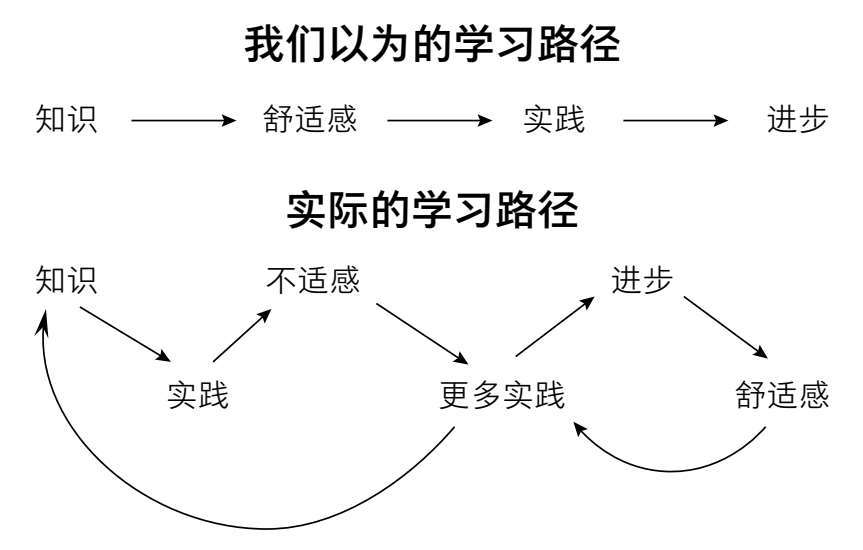

许多高成就者在早期并没有表现出明显的天赋，天赋也许会让一个人前期走得快一点，但是品格、内在动机才会决定一个人最终能走多远。

> 一个在别人看来天资平庸的运动员，最后的成绩表现却超过了另一个天才运动员。
> 
> 一个原本连第二外语都学不会的人，后来却能在几年内精通六国语言了。
> 
> 一个耳聋的人，后来成了世界顶级演奏家。
> 
> 每个人都有隐藏的潜力，关键在于怎么开启它。你的潜力多大，不在于你天资多高，而在于你出发后能走多远。

近些年已经有越来越多的实验告诉我们，那些所谓的“天才神话”，只不过是假象而已。绝大部分人小时候都不怎么突出，甚至可能一开始还是落后的。

“一个知识或者技能，但凡只要这个世界上有一个人能学好，那就意味着，其实世界上的每一个人都能学好它，只要有合适的学习条件。”

**培养强大品格** 

1. 吸收能力：主动寻找新知识和技能，放弃虚荣心，为自我成长而学习。 
2. 不完美主义：避免过分关注细节、逃避挑战和自我设限，转而设定具体有挑战性的目标。 
3. 刻意玩耍：享受学习过程而非压力，将练习视为一种乐趣。 

他们展现出的主动性、社会性、纪律性和坚韧性给他们带来更持久的影响，而且最终结果证明，这些影响比早期的数学和阅读技能更强大。

- 主动性：他们主动提问、主动回答问题、从书本中查找信息，以及课下向老师请教的频率如何？
- 社会性：他们与同龄人相处和合作的能力如何？
- 纪律性：他们的专注力如何？遵守课堂纪律的情况如何？
- 坚韧性：他们坚持不懈地解决具有挑战性的问题、超额完成作业，以及在遇到困难时咬牙坚持。

几乎没有游泳健将在早期比赛中创造过纪录，他们大多有在地方比赛中获胜的经历，却没有赢得过地区或全国冠军。而被调查的网球运动员大多在第一次参加比赛的前几轮就败下阵来，之后沉潜数年才成为当地的顶尖选手。他们受教练器重，不是因为天资过人，而是因为非凡的内驱力。

当倾慕伟大的思想家、实干家和领导者时，我们往往只是非常狭隘地注重他们的外在表现。这导致我们推崇那些成就最显赫的人，却忽视了那些用最少的资源取得最大成就的人。但是，**衡量潜能的真正标准不是你所至顶峰的高度，而是你为攀上顶峰走了多远的路程。**

**成长本身就是成就。**

有些看似源于天赋的差异，其实往往是机遇和内驱动上的差异。野心使你专注于你想要取得的结果，而抱负使你成为你想要成为的人。

- **品格技能比天赋更重要：** 决定一个人成就的并非先天禀赋，而是后天培养的品格技能，例如学习能力、适应能力、毅力、责任感等。这些技能可以通过刻意练习和不断挑战自我来习得和提高。
- **成长比完美更重要：** 鼓励人们拥抱不适从错误中学习，不断进步，而不是追求完美。重要的是持续改进和发展，而不是一开始就达到顶峰。
- **环境和机会至关重要：** 除了个人努力，环境和机会也对个人的发展起着关键作用。书中探讨了如何设计更好的教育体系、工作环境和社会环境，以支持和促进每个人的成长。

#### 品格是一种技能

切蒂仅仅通过观察学生的幼儿园教师，就能预测学生成年后能否取得成功。到25岁时，一些学生的收入明显超过同龄人，而他们恰好曾经被分到更有经验的幼儿园老师的班级。

有经验的老师对孩子们最大的影响其实是在性格方面。主要有四个：

- **主动性，他们会不会主动提问，主动回答问题，主动从书本上寻找信息。**
- **亲社会性，他们能不能很好地跟同龄人相处和合作。**
- **纪律性，他们能不能在课堂上有效集中注意力，不破坏课堂秩序。**
- **坚定性，他们面对挑战和困难的时候，愿不愿意坚持。**

一个人在长大之后是不是能表现卓越，并不是像很多人想的那样，依赖于天赋甚至认知水平。人越长大，性格的重要性就越会凸显。因为不管是，你要在棋盘上破解一个又一个的困局，还是你想在工作中攻克一个又一个的挑战，性格对你的影响都是很大的。

在200多年前，确实有心理学家提出，人到了30岁，性格就会像石膏一样凝固了，很难再改变了。但是近些年的实验发现，并不是这样的。

**个性是你与生俱来的本能，但是性格是一种你能把自己的价值观置于本能之上的能力。**比如说遇到困难，你的本能是想退缩，想放弃，但是如果你培养了有韧性的性格，那么它就会劝服你坚持下去。

我们总说成功和幸福是我们最重要的人生目标，我很好奇为何品格不是更重要的目标。**如果我们能像钻研职业技能一样，投入更多的时间学习品格技能，那会怎样呢？**

人们常常将品格与个性混为一谈，二者其实并不相同。**个性是你的倾向，是你最基本的思考、感受以及行为本能。品格则是你以价值观驾驭本能的能力。**

了解原则并不等于知道如何践行原则，尤其是在你紧张焦虑的时候。若诸事顺心，积极主动和意志坚定就并非难事。当身处逆境时，你是否仍旧能够坚守这些价值观，才是对品格的真正试炼。

**如果个性意味着你在寻常日子里的反应，那么品格就是你在艰难岁月里的表现。**

个性不是难违的天命，而是你的人格倾向。品格技能可以让你超越这种倾向，笃守自己的原则。关键不在于你具备哪些品质，而在于你决定用它们做些什么。无论今日是何样貌，你都没有理由不从现在开始，培养你的品格技能。

#### 拥抱不舒适是一种勇气

**采用学生喜欢的学习方式，并不能让他们有更好的学习表现**。我们在开始学一门技能的时候，不要总想着，我要准备好了再开始用它、实战练习它。如果这样的话其实你一直是在惯着自己。你不会在某一天醒过来就突然觉得，我准备好了。而正确的方式是什么呢？书里这句话写得挺好的——*We become prepared by taking the leap anyway.* 就是说，**不是准备好才行动，而是行动起来你才能真的准备好。不管怎么样，先迈出这一步再说。**

不只是拥抱和寻求不适，还要通过勇于犯更多的错误来放大这种不适。

舒适学习是一个悖论，只有练习得足够熟练，你才能游刃有余地掌握一门技能。**但在掌握之前，任何练习都会让你感到不适，所以你往往会逃避它。**

#### 吸收能力

海绵的这种吸收、过滤和适应的能力，对于人类来说也很重要，是一种性格技能，是一种能主动地吸收和过滤周围信息的性格技能，对于挖掘我们隐藏的潜能是非常重要的。

- 主动去寻求新知识，而不是被动等着别人来喂给你。
- 有效过滤信息。**有一个标准，就是你要去筛选那些能促进自身成长的信息，而不是那些能让你觉得自我满足的信息。**比如你去网上喜欢看那些支持自己观点的文章，或者喜欢听别人夸自己，这些就是让你觉得自我满足的信息。

那怎么去筛选出能促进自身成长的信息呢？**不要反馈，要建议**。作者他本身性格是比较内向的，那他后来是怎么成为一个很受欢迎的演讲者的呢？他不仅用上了我们前面说的，拥抱不舒适、主动开口去练，还有吸收各种有用信息。**他还有一个做法，就是每次演讲结束以后，他不会问别人，你觉得我这场好不好；而是会问，你觉得我有哪里可以改进。这就是，不要反馈，要建议。**这样你会得到更有建设性的回答。这就是一种海绵型的思维。就是不要纠结于你过去做错了什么，而要重点关注，怎么能在将来越做越好。

核心思想是挑战我们对“天赋”和“成功”的传统认知。格兰特认为，**伟大的成就并非仅仅源于与生俱来的天赋或早期展现的才华，而更多地来自于那些我们后天可以培养的“性格技能”以及我们所处的、能够支持成长的“环境结构”** 。

许多拥有巨大潜力的人常常因为不符合传统的“天才”模板而被忽视或低估。真正的潜力往往是隐藏的，需要通过特定的方法和心态去发掘和释放。这本书旨在揭示，**成长并非命中注定，而是可以通过拥抱不适、持续学习、寻求反馈、并建立正确的支持系统来实现的。** 关键在于关注成长的过程，而非仅仅是起点或天赋。我们应该从关注那些一开始就闪闪发光的人，转向关注那些展现出成长轨迹和坚韧品格的人。

**第一部分：性格技能 - 成长的内在引擎**

这一部分探讨了驱动个人成长的内在品质和心态，这些品质比原始智力或天赋更能预测长期的成功。

- **第一章：成为“不适者” ：** 强调走出舒适区的重要性。真正的学习和成长发生在面对挑战、感到不适的时候。能够拥抱并驾驭这种不适感是发掘潜力的关键。
- **第二章：像海绵一样吸收：** 探讨高效学习者的特质。他们像海绵一样主动吸收知识和反馈，保持好奇心，不断向他人学习，不怕显得无知。
- **第三章：拥抱不完美：** 挑战完美主义的弊端。书中可能论述，那些能够接受自己的不完美、从错误中学习并持续迭代的人，比追求一开始就完美无缺的人，往往能取得更大的进步和成就。强调“完成比完美更重要”以及从失败中汲取教训的能力。

**第二部分：搭建脚手架 - 支持成长的外部结构**

仅有内在品质还不够，还需要外部环境的支持系统来帮助个体跨越障碍，实现潜力。这部分探讨了如何构建这些“脚手架”。

- **第四章：寻找挑战的“甜蜜点” ：** 讨论如何找到既不过于容易（导致无聊）也不过于困难（导致挫败）的最佳学习区（类似维果茨基的“最近发展区”）。有效的指导者和系统能够帮助个体维持在这个区域内。
- **第五章：有效的指导与反馈 ：** 强调高质量指导、教练和反馈的重要性。好的指导者不仅仅是传授知识，更能提供个性化的支持、挑战和鼓励。反馈需要及时、具体且着眼于成长。
- **第六章：刻意“玩耍” ：** 可能探讨了将刻意练习（Deliberate Practice）与探索性、趣味性的“玩耍”相结合的重要性。这有助于保持动力，激发创造力，让学习过程更可持续。

## 前言

## 第一部分 品格技能 — 在变好方面越来越好

19世纪末，美国心理学之父威廉·詹姆斯提出了一个大胆的主张。“到30岁时，”他写道，“品格就会像石膏一样定型，不能被重新软化了。”孩子们的品格尚可被塑造，但成年人就没那么幸运了。

除了证明品格技能可以推动我们取得更多成就，这一实验的结果还表明，培养品格技能什么时候都不晚。威廉·詹姆斯固然聪明，但在这一点上他大错特错。**品格不会像石膏那样僵化定型，而是始终具有可塑性。**

人们常常将品格与个性混为一谈，二者其实并不相同。**个性是你的倾向，是你最基本的思考、感受以及行为本能。品格则是你以价值观驾驭本能的能力。**

了解原则并不等于知道如何践行原则，尤其是在你紧张焦虑的时候。若诸事顺心，积极主动和意志坚定就并非难事。**当身处逆境时，你是否仍旧能够坚守这些价值观，才是对品格的真正试炼。如果个性意味着你在寻常日子里的反应，那么品格就是你在艰难岁月里的表现。**

个性不是难违的天命，而是你的人格倾向。品格技能可以让你超越这种倾向，笃守自己的原则。关键不在于你具备哪些品质，而在于你决定用它们做些什么。无论今日是何样貌，你都没有理由不从现在开始，培养你的品格技能。

我们总说成功和幸福是我们最重要的人生目标，我很好奇为何品格不是更重要的目标。如果我们能像钻研职业技能一样，投入更多的时间学习品格技能，那会怎样呢？

### 第1章 不适之人：拥抱学习中难耐的尴尬 

品格无法在安逸和宁静中养成。只有经历试炼和苦难，心灵才能坚不可摧，视野才能更加开阔，雄心壮志才能得以激发，成功才能得以实现。——海伦·凯勒

在诸多不同类型的学习中，体验不适可以释放隐藏的潜能。**鼓起勇气面对不适是一种品格技能——一种极为重要的决心。**

这要求我们具备三种勇气：放弃你屡试不爽的方法，还没有准备好就上场，比别人犯更多的错误。

加速成长的最佳方式是拥抱、寻找和放大不适感。

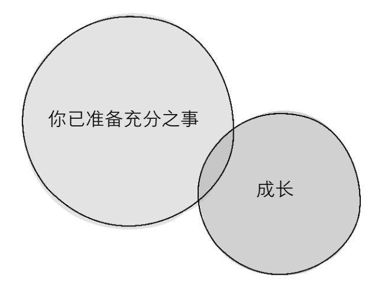

#### 过时的学习方式

你喜欢的学习方式会让你感到舒适，但它并不一定是你的最佳学习方式。有时，让你感到最不适的学习方式反而能够使你学得更好，因为你必须加倍努力地学习。这就是勇气的第一种形式：勇于拥抱不适感，把原来的学习方式抛在脑后。

#### 入竞技场

奉学习方式为圭臬的人会让我们相信，语言学习适合一个人，听觉学习适合另一个人。但学习并不总是要找到适合自己的方式，而往往是找到适合任务的方法。

一个实验的结果颇有意思：给学生们20多分钟的时间阅读一篇科学文章，随机分配一半学生读文章，另一半学生听文章。听文章的人比读文章的人更喜欢这堂课，但两天后进行测验时，他们学到的知识明显少于后者。听者的得分率为59%，而读者的得分率为81%。

舒适学习是一个悖论，只有练习得足够熟练，你才能游刃有余地掌握一门技能。但在掌握之前，任何练习都会让你感到不适，所以你往往会逃避它。为学习提速需要第二种勇气：在掌握知识的同时，要勇于运用知识。

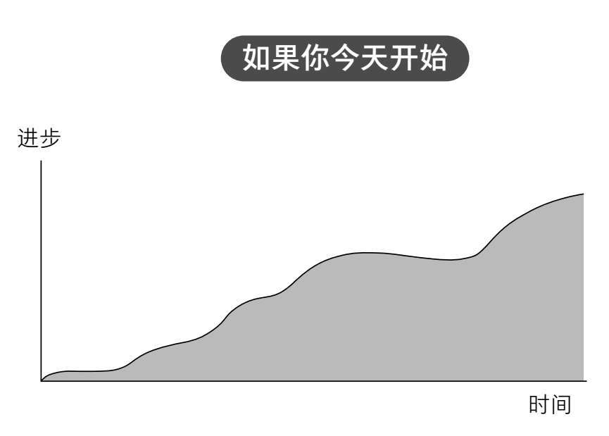

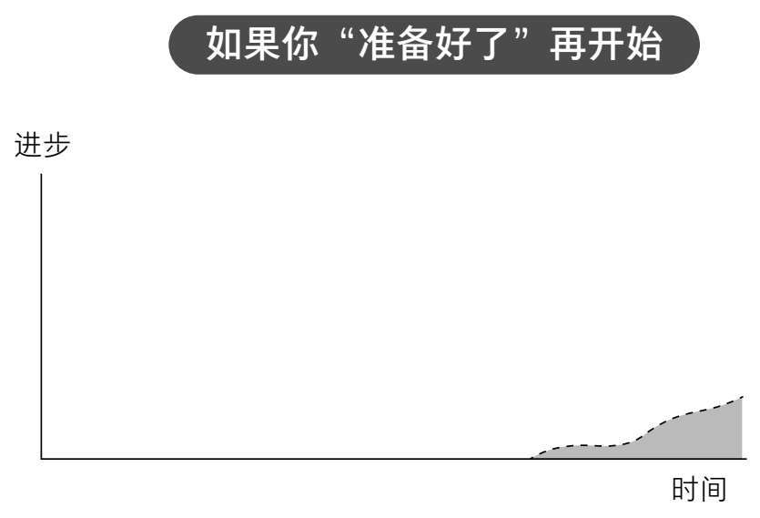

#### 自讨尴尬

“你的目标是感到尴尬和不舒服……这是有效练习的标志。”一旦将不适感视为成长的标志，人们就会有超越自己舒适区的动力。

这需要第三种勇气——不只是拥抱和寻求不适，还要通过勇于犯更多的错误来放大这种不适。

#### 咬紧牙关

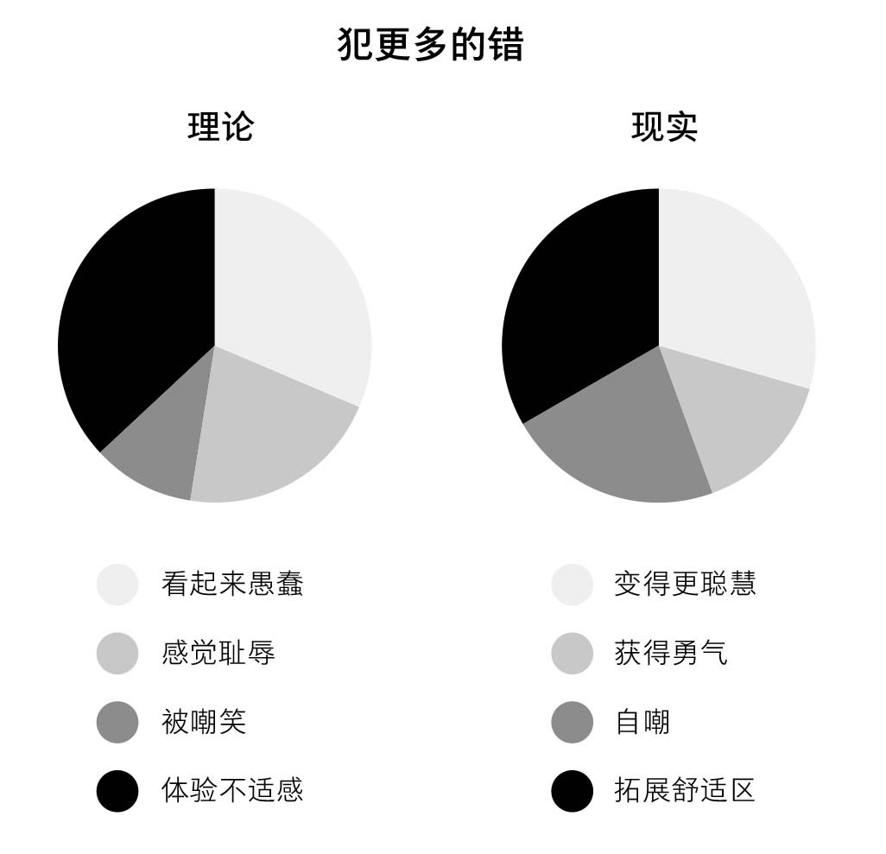

心理学家称这种循环为“习得性勤奋”。当你因为努力而受到表扬时，努力的感觉就开始呈现次级奖励的属性。你不再需要逼迫自己继续尝试，而是觉得有一股力量牵引着你去做更多尝试。

### 第2章 人型海绵：培养吸收和适应能力 

能够存活下来的并不是最聪明的物种；也不是最强壮的…… 而是适应能力最强的。——莱昂·C. 梅金森

#### 提高努力的回报率

一个世纪前，伟大的社会学家马克斯·韦伯将非凡的成就归结为新教宣扬的工作伦理。他认为，在新教改革之前，劳动是一种必要的罪恶。马丁·路德在16世纪推行的教化使劳动变成一种使命。作为一名优秀的新教徒，你有道德义务通过生产劳动服务社会。毅力和纪律成为美德，游手好闲和铺张浪费成为恶习。这也许就是今天许多人会在奋斗的祭坛前顶礼膜拜，向司管坚持的大祭司祈祷的原因。但是，相较于付出了多少劳动，我们所走过的路程与劳动果实的关系更为密切。

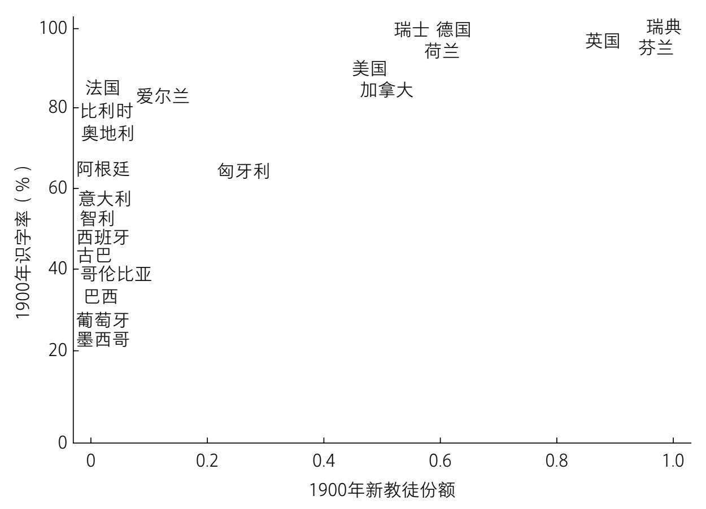

认知技能并不是学习的充分条件，却是必要条件。具备基本的识字能力，就能更有效地利用品格技能——积极主动地学得更多、学得更快。人们吸收新思想、过滤旧思想的能力一旦得到增强，社会繁荣就会随之而来。

#### 一位英雄和一位学者

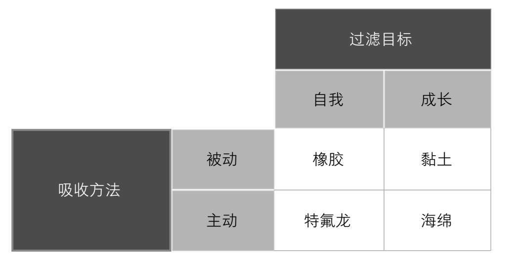

能够积极主动且以成长为导向的人，站在了学习的“甜蜜点”上。他们此时已成为海绵。这类人不断地主动拓展自己，从而更好地适应环境。

#### 无师自通

#### 得知残酷的真相

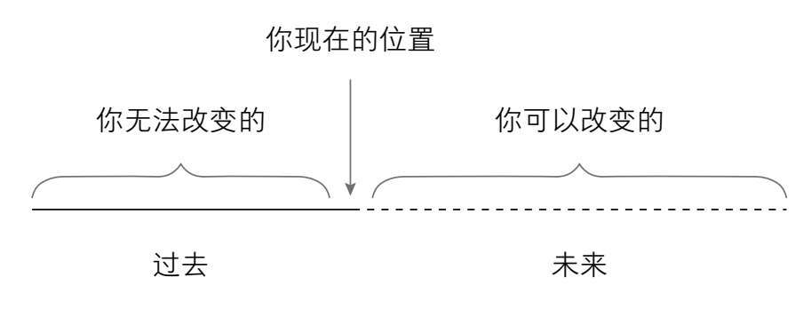

每次演讲结束后，我都会问主持人，我还能做得更好吗？这提醒我，并非所有建议都是等价的，收到的建议越多，你就越需要筛选。毕竟，你怎么知道信息来源是否值得信任？

#### 愿信任之源与你同在

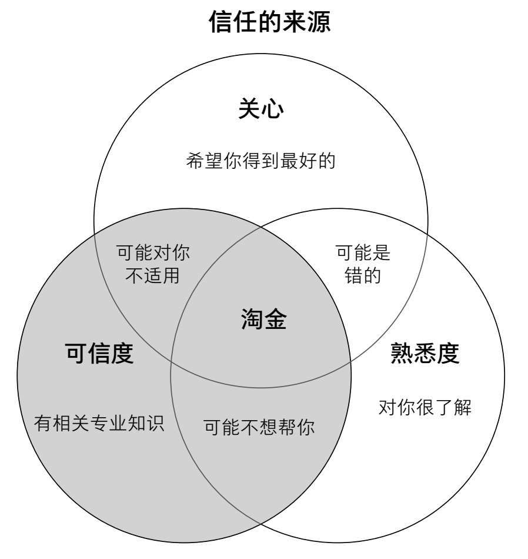

### 第3章 不完美主义者：在瑕疵与完美之间寻找“甜蜜点” 

万物皆有裂痕，那是光照进来的地方。—— 莱昂纳德·科恩

我们通常将审美和技术实力与追求完美联系在一起。然而，在研究了杰出的设计师、舞蹈家和潜水员的习惯后，我逐渐明白，挖掘隐藏的潜能与追求完美无关。容忍瑕疵不仅是新手需要做的事情，也是专家需要保持的做法。你越是精进，就越清楚自己可以接受哪些瑕疵。

**完成比完美更重要**。**不完美主义在学习或工作当中，很多时候能帮你提高效率，加快迭代。**

完美主义者在追求完美的过程当中，往往会犯这么三个错误：

- **沉迷于一些无关紧要的细节**，为了解决一些小问题而忽视了大方向的推进。纠结于无关紧要的细节。他们会忙于解决琐碎的问题，以致无法确定正确的问题是什么，从而只见树木，不见森林。
- **更愿意去解决一些简单的问题**，因为在这些问题上面他们能够做到完美。而这就让他们会变得讨厌风险，不喜欢去挑战困难的任务，发展新的技能。逃避可能导致失败的陌生环境和困难任务，这使得他们只能完善现有的极其有限的技能，而不会努力发掘新技能。
- **经常会纠结于自己已经犯下的错误**，责备自己，而不是把关注点放在怎么从错误中学习、成长上。因犯错而过分自责，这让他们更难从错误中学习。他们没有意识到，回顾错误不是为了羞辱过去的自己，而是为了教育未来的自己。

完美主义会限制我们潜力的发挥。作者说，**如果完美主义是一种药物，那么这种药物的标签上，会提醒我们注意一种它常见的副作用，那就是可能会导致我们发育迟缓。**

你其实并不需要太在意别人怎么看你，因为取悦所有人是不可能的。你最应该取悦的是自己。所以，在追求卓越的路上，作者建议我们经常问自己这么一个问题：**如果这是人们看到的你留在世上的唯一的作品，你会为此感到骄傲吗？**

#### 何为正确——学生的错误

研究表明，完美主义者在追求完美的结果时，往往会犯三个错误。

- 其一，纠结于无关紧要的细节。他们会忙于解决琐碎的问题，以致无法确定正确的问题是什么，从而只见树木，不见森林。
- 其二，逃避可能导致失败的陌生环境和困难任务，这使得他们只能完善现有的极其有限的技能，而不会努力发掘新技能。
- 其三，因犯错而过分自责，这让他们更难从错误中学习。他们没有意识到，回顾错误不是为了羞辱过去的自己，而是为了教育未来的自己。

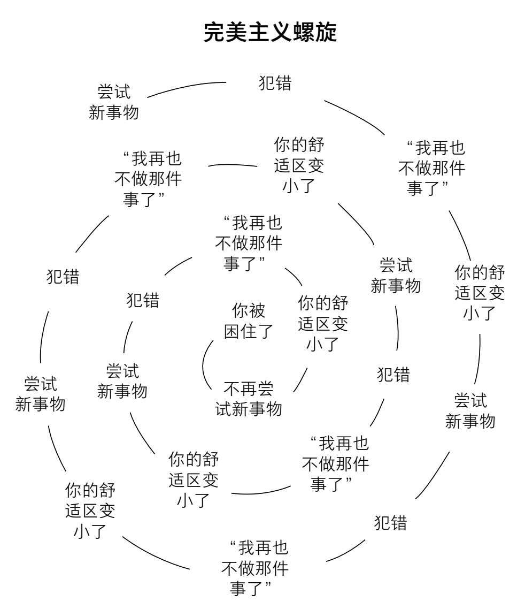

如果完美主义是一张药方，那么它的标签上一定有提醒我们需要注意的常见副作用。**警告：可能导致发育迟缓。**

完美主义会让我们陷入视野狭隘和规避错误的旋涡：它让我们无法看到更大的问题，并使我们所掌握的技能越来越狭窄。

#### 具体的可能性

这一传说可以追溯到16世纪，当时日本的茶道经历了翻天覆地的变化。完美无瑕的茶具被破损的茶碗取代。人们用磨损和老旧的陶器饮茶，并称这种做法为“侘寂”。

“侘寂”是一种尊重不完美之美的艺术。它不是指故意制造残缺，而是接受瑕疵的存在是不可避免的这一事实。但存在瑕疵的事物并不意味着与崇高无缘，这也一直是安藤忠雄建筑和生活的主题。他是一个不完美主义者：他有选择性地决定自己要做好的事情。

#### 找对不完美之处

自责不会让你变得更加强大，只会让你遍体鳞伤。善待自己并不是要忽视自己的弱点，而是允许自己从挫败中吸取教训。想要成长，我们需要接纳而不是惩罚自己的缺点。我们要让自己感

受错误。

完美主义者常常担忧，哪怕只是一次失败，也会让自己成为一个失败者。但有8项研究表明：人们不会根据一次表现来判断你的能力。这就是所谓的过度推断效应。

事实证明，人们在评估你的技能时，会更看重你的最高水平。即使你碰巧看到塞雷娜·威廉姆斯屡屡发球失误的情景，但只要看过一次她的王牌发球，你也会意识到她的卓越。即便史蒂夫·乔布斯在丽萨（Apple Lisa）项目上一败涂地，人们也会因为他在麦金塔（Mac）上的成就而认可他的远见。我们通过莎士比亚的代表作（如《哈姆雷特》和《李尔王》）来评判他的天才，而不会关注他那些被人遗忘的剧本（如《雅典的泰门》和《温莎的风流娘儿们》）。人们会从你最好而不是最差的时刻来判断你的潜能，你能否给予自己同样的宽容？

#### 演出必须继续

在硅谷，“转向”是一个很流行的概念，人们常说“完成胜于完美”。为了快速迭代和改进，创业者和工程师倾向于打造最小可行性产品。但是，卓越是一个更高的标准：对我来说，卓越意味着至少要做出一款讨人喜欢的产品。

#### 至少是讨人喜欢的作品

我们必须谨慎对待评委的打分。大量研究表明，完美主义者倾向于以他人的标准来定义优秀。这种专注于在他人眼中塑造完美的形象的做法容易导致抑郁、焦虑、职业倦怠和其他心理问题。

归根结底，卓越不仅仅是满足他人的期望，还关乎如何达到自己的标准。毕竟，你不可能取悦所有人。问题在于，你是否会让对的人失望。毕竟，让别人失望比让自己失望要好得多。

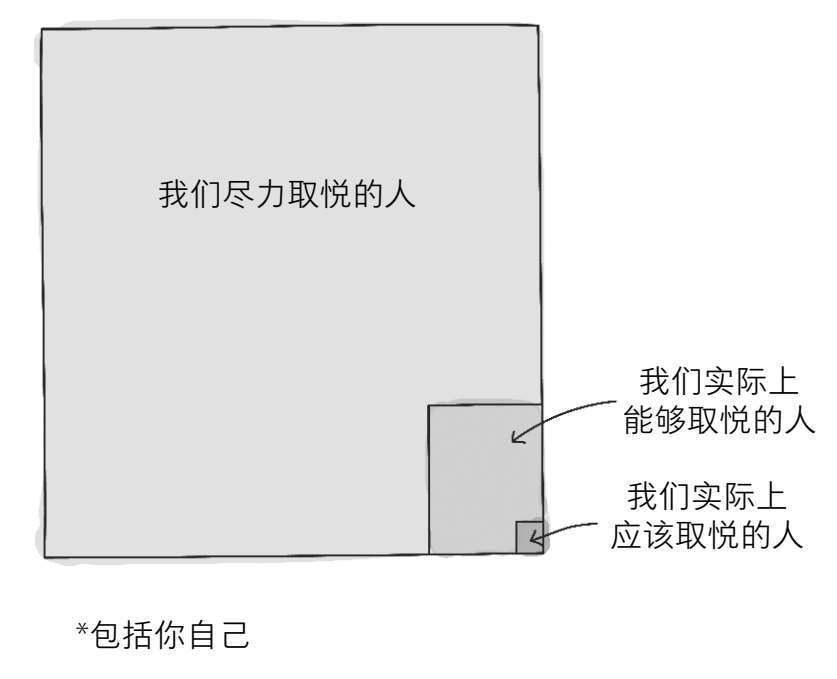

## 第二部分 动力结构 — 攻坚克难的鹰架

品格技能并不总是足以支撑我们长途跋涉。许多新的技能并不会自带使用手册，我们需要用梯子才能爬上更陡峭的山峰。鹰架就是这样的梯子：一种临时的支撑结构，使我们能够攀登仅凭一己之力难以企及的高度。鹰架帮助我们建立坚韧性，有了坚韧性，我们方能战胜那些可能会令我们难以承受的、限制我们成长的障碍。

- 第一，鹰架通常由他人搭建。
- 第二，鹰架是为你前行道路上的障碍量身定制的。
- 第三，鹰架会出现在一个关键的时间点。
- 第四，鹰架是临时性结构。

鹰架帮助我们开辟了原本看不见的道路，让我们释放出隐藏的潜能。它让我们在日常琐事中找到前行的动力，并将困难和疑虑转化为力量之源。

### 第4章 转化日常琐事：将激情注入实践 

让我们满足的，既非工作，也非娱乐；既非目的，也非无目的，它在中间翩翩起舞。—— 伯纳德·德科文

人们经常告诉我们，如果想要发展自己的技能，我们就需要长期全身心地进行单调的练习，只有这样我们才能有所长进。但是，解锁隐藏潜能的最佳方式并非忍受日常苦役般的折磨，而是将这些苦役转换成快乐的源泉。在音乐领域，“玩”就代表“练习”，这并非巧合。

#### 调和激情

按照一万小时定律，人们投入一万小时的时间去练习一项技能，就能够成为该领域的大师。自从这一定律席卷全球以来，教练、家长、老师们就醉心于一种特殊的训练：刻意根据明确目标和即时反馈安排练习，让练习者有组织地重复一项任务，从而提升他们的技能。然而，你需要的练习时长与我们认为的一万小时之间存在细微的差别。

研究表明，达到卓越所需的练习时间因人因事而差异巨大。能够明确的是，刻意练习对提高那些动作单一、可预测的任务的技能有很大的价值，如高尔夫球挥杆、解魔方或拉小提琴。

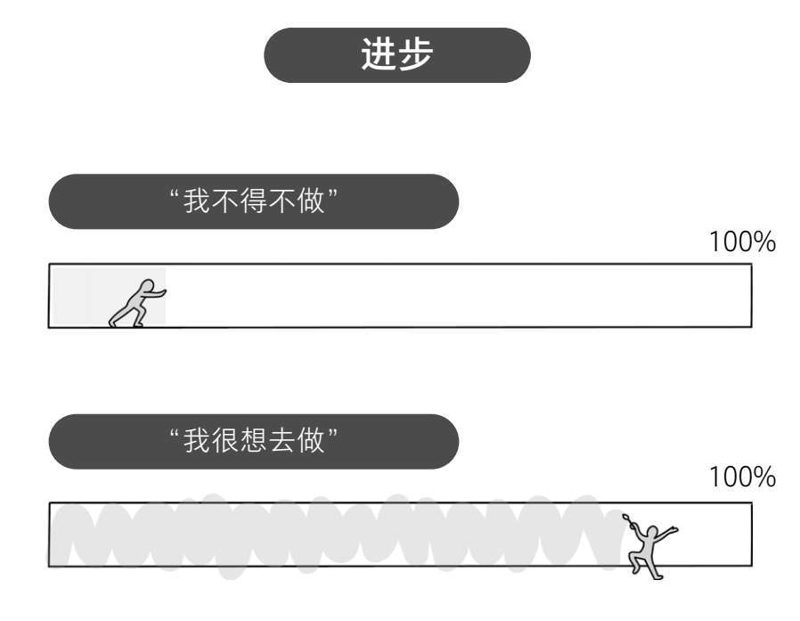

#### 寓教于乐

【学习是困难的，没有什么寓教于乐】

刻意游戏在体育运动领域尤其流行。大量证据表明，过早专攻某一运动项目的运动员往往会迅速达到巅峰，但他们的光芒很快就会消散。从小就全身心地投入运动，会使他们面临更大的身体和心理健康风险。而通过刻意游戏进行训练，更容易让运动员保持训练的乐趣，帮助他们取得更大的成就。

#### 投身练习

对某项任务的热情会让我们疏忽自己手上不那么令人兴奋的任务。

#### 改变游戏

斯蒂芬·库里被公认是NBA史上最出色的射手。人们常说，库里的三分球堪比迈克尔·乔丹的扣篮——他将篮球比赛变成了一场投篮比赛，从而彻底改变了这项运动。此前两位职业生涯投中三分球最多的纪录保持者打了1300多场比赛才创造了他们的得分纪录。而库里只用了789场比赛就超越了他们。

尽管父亲是NBA球员，但库里并没有获得过哪怕一项顶级大学篮球项目的奖学金。高中毕业时，他还被严重低估了：在五星级标准中，他只被评为三星级新秀。高三前的一个夏天，戴维森学院的教练去看了他的比赛。“他太糟糕了。他把球扔到看台上，传球失误，运球不稳，投篮也投不中，”教练回忆道，“但在那场比赛中，他从来没有对裁判有半句怨言，也没有对队友指指点点。他总是坐在替补席上欢呼……他从不退缩。这让我印象深刻。”

最自律的人实际上是最少管束自己的人，他们并不依靠意志力来克服困难，而是通过改变环境使其变得不那么艰难。

#### 热爱练习

刻意游戏虽然不一定能够让你成为职业运动员，但可以增加你的练习动力，为你的技能发展提速。

#### 适时休息

- 其一，暂停练习，让自己休息一会儿，有助于保持和谐的激情。研究表明，即使是5\~10分钟的短暂修整，也足以减轻疲劳，提高精力。
- 其二，休息能激发新想法。当对某项任务保有和谐的激情时，适当的休息能提高创造力。
- 其三，休息有助于深化记忆。一项实验表明，学生学完知识后休息10分钟，记忆力会提高10%\~30%。

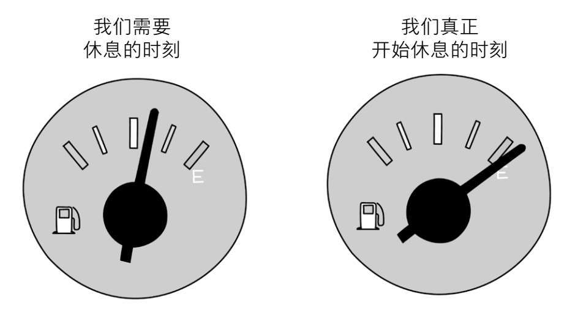

### 第5章 摆脱困境：前行之路迂回曲折 

每个极点既是起点，也是终点。——乔治·艾略特

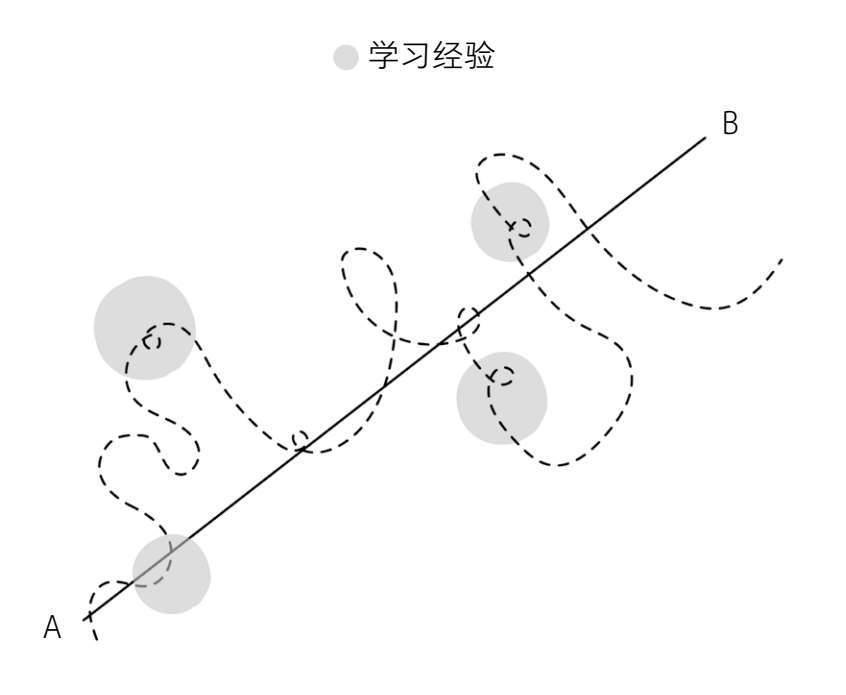

#### 以退为进

没有了明星球员，球队就被打回原形，不得不寻找新的成功之路。他们会重新定位自己的角色，让外围球员能够走上中心，并制定新的战术来发挥他们的优势。当明星球员归队后，球队的投篮分配会变得更平衡。他们不再只寄希望于明星球员像英雄一样扛起整支球队了。

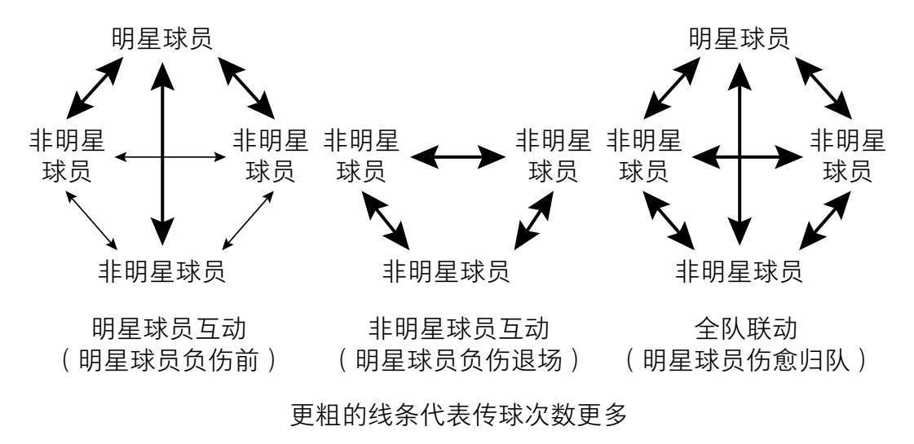

#### 一记挥空

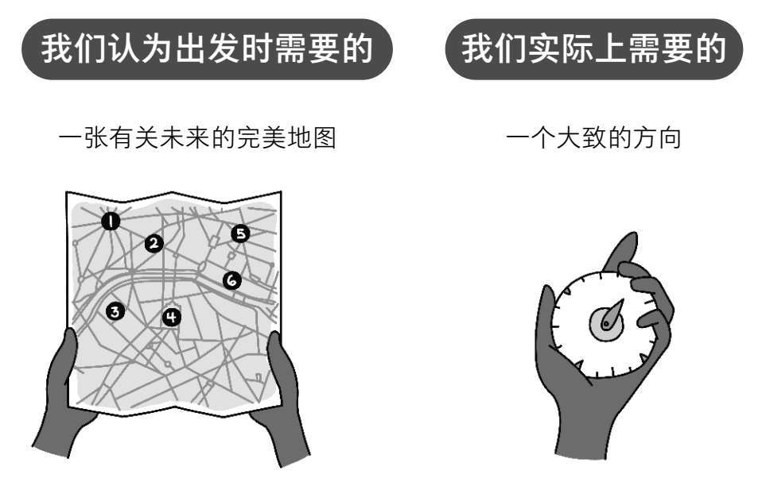

指南针的不足之处在于，它只能指明方向，却不能提供指导。它可以帮助你离开错误的道路，并为你指出一条更好的道路，但是你还需要一个向导，才能在这条新的道路上走得更稳健。

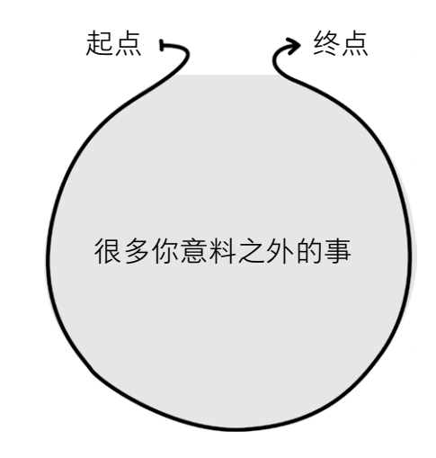

#### 能者不能教

#### 编写自己的指南

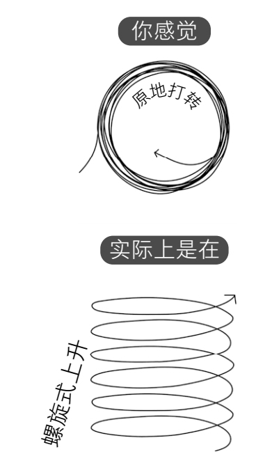

#### 勉强支撑

我意识到颓靡不仅指一种陷入困境的感觉，它还会让你停滞不前。研究表明，颓靡状态会分散你的注意力，削弱你的行动力。颓靡正像那吊诡的“第二十二条军规”：你知道自己需要做一些事情，但你又不确定做这些事情是否有意义。这时，你需要在高速公路上找到一个休息区停下来，为你的车补充燃料。

#### 绕道而行

当我询问人们怎样才能取得更大的成就时，最常见的一个答案是：你需要全神贯注、一心一意地向目标前行。你要加倍努力，舍弃一切有可能消耗精力或分散注意力的事物。如果想在工作中出类拔萃，你就得早出晚归，在工作上投入更多时间。要分清主次，把业余爱好放在次要位置……绝对不要做

副业。你肯定不想看到自己在工作中分心，落得精疲力竭的下场。

但事实并非如此。偏离目标不一定会分走你的注意力，它也可以成为你的能量源泉。

心理学家发现，并非只有巨大的成就才能为我们带来进步感，微小的突破也能为我们补充燃料。即使已经偏离了主路，你在路途中取得的进展也会提醒你进步的可能性。你不会再因为前路漫漫而畏葸不前，你已经准备好进行下一个转弯。

#### 永攀更高峰

进步很少能在瞬间就有所显现——它通常会在你行进了很长一段时间后才会显露出来。如果只执着于某段特别困难的时期，你就很容易感到困顿失落。只有将自己几周、几个月或几年的发展轨迹连起来审视，你才会感激自己走过的路。

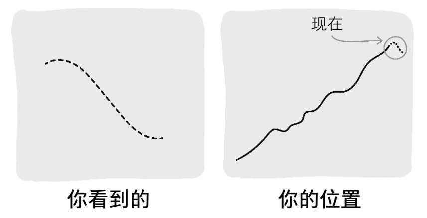

### 第6章 超越重力：自拉靴带，翱翔长空 

我相信你可以拉着自己的靴带抬起自己。我相信有人能做到。我见过一人将其实现，就在太阳马戏团。——斯蒂芬·科尔伯特

#### 互相学习

心理学家将这种现象称为导师效应。它甚至对初学者也颇为有效：学习某样事物的最佳方式就是去教授它。回顾所学知识，可以强化你对所学之物的记忆；向他人解释所学知识，你对这些知识的理解会更透彻。在自己还一知半解时，就得坐上讲师的宝座，这种事往往会让你感到不适。然而，你需要接受这种不适。当你需要教导他人时，你会督促自己更努力地学习。

#### 意外潜能

#### 听从己见

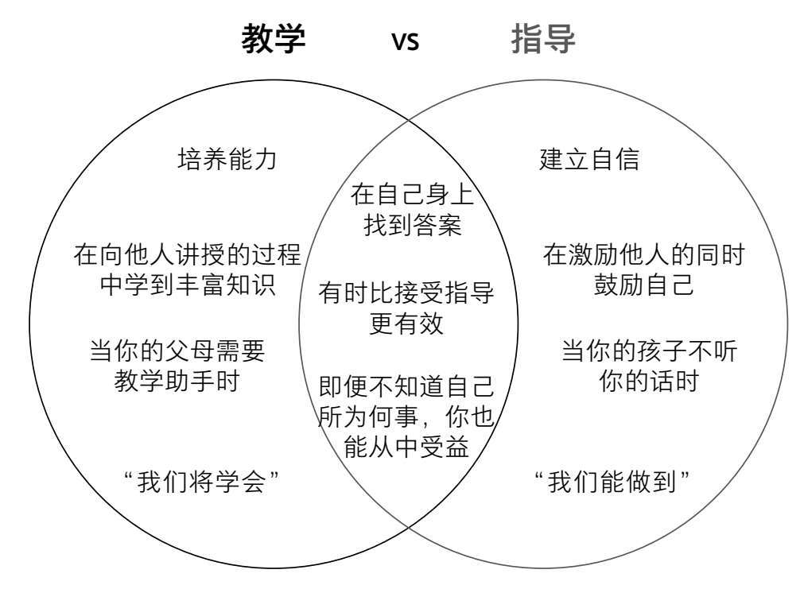

#### 敢于质疑

#### 点燃星火

## 第三部分 机会体系 — 打开门窗

品格技能和鹰架可以帮助我们挖掘自己与身边之人的潜能。但是，我们还需要更有效的东西，才能让更多的人有机会取得更大的成就。如果想为更多人创造机会，我们就必须在学校、团队和组织中建立优化体系。

即使人们的认知能力旗鼓相当，创造力也会受到家庭收入的影响。如果有两个三年级学生在数学测试中都得了95分，其中一个来自高收入家庭，而另一个来自低收入家庭，那么前者从事发明创造的概率是后者的两倍多。更糟糕的是，那些能在数学测验中得到高分但家境贫寒的数学天才，成为发明家的概率并不比那些得分低于平均成绩但家境富裕的孩子高。

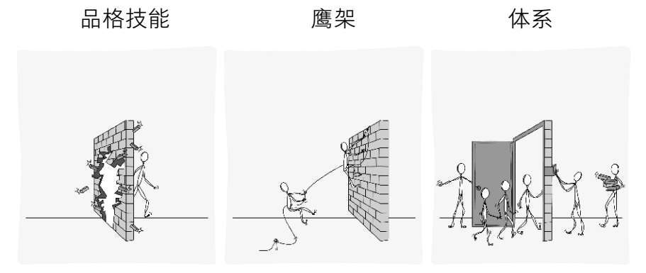

### 第7章 希望：设计学校体系，激发学生的最佳潜能 

米开朗琪罗认为，每一块大理石里都封藏着一个天使，而我认为，每个学生的心中，都封藏着一个聪颖的孩子。——玛瓦·柯林斯

芬兰的学校里普遍流传着这样一句口头禅：“我们不能浪费任何一个大脑。”正是这种精神催生了他们与众不同的教育文化。芬兰人知道，培养隐藏潜能的关键不是只看重并扶持那些早慧的学生，而是关注每个学生，无论他们的能力是高还是低。

#### 机遇之国

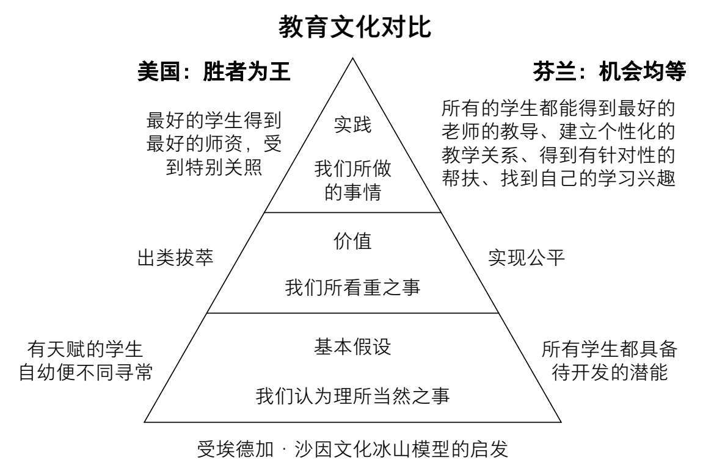

#### 师生齐心

学生的显著进步并非因为接受了更好的老师的指导，他们只是恰好连续两年由同一位老师教导。这就是循环式教学。在这种教学方式中，教师并非始终留在同一个年级教学，而是与学生一起升入下一个年级。

#### 我会帮你

芬兰学校并没有将学生的日程安排得满满当当，而是安排得别出心裁。相较之下，芬兰师生比美国师生的休息时间每天多一个小时。这也意味着，在日常工作之余，芬兰教师有充足的时间备课、批改作业并进行自我提升，他们不需要常常熬夜或是在周末加班。这种做法也是对教师的一种早期干预：不做过分要求，赋予其掌控感，避免其产生倦怠。让教师保持旺盛的精力，可以让他们长久维持对教学的和谐激情，也有助于他们从学生入学的第一天起就着手培养学生对学习的热爱。环境能够影响学生学习的积极性，如果学生处在专为发掘和发展其个人兴趣而设计的环境中，他们对学习的热爱会更加炽烈。

#### 儿童的游戏

而在芬兰，游戏是所有小学的核心必修课。芬兰政府坚持让孩子们玩耍，因为决策者明白，玩耍能培养儿童对学习的热爱。这种价值观最好能在人生的早期就开始培养，它最终会让人养成更好的认知能力和品格技能。

#### 乐园里的烦恼

几年前我去芬兰一探究竟，本以为芬兰人会为他们的教育体系感到自豪。但是我发现，但凡我遇到的人，从总理到教育专家再到学生家长，普遍对他们的学校持批评态度。起初，我将这视为北欧人的谦逊。据我所知，斯堪的纳维亚社会法则的首要原则是“切忌自命不凡”。

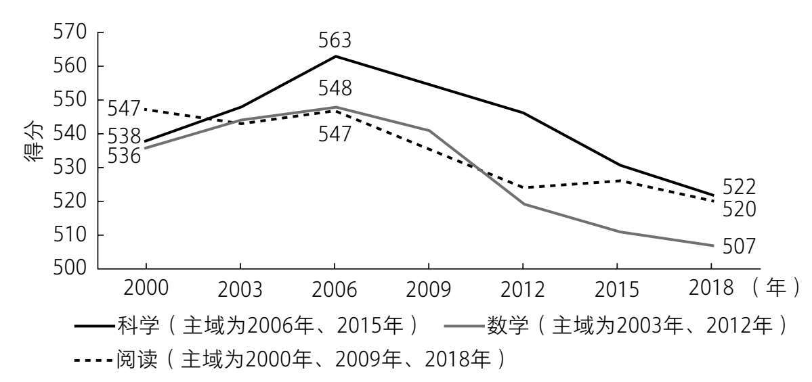

至2018年，芬兰的成绩不仅被几个亚洲国家超越，还跌至欧洲第二。一个与芬兰隔海相望的小国一跃成为欧洲第一。

这个国家就是爱沙尼亚。尽管爱沙尼亚的教育预算相对较低，每名教师负责教导的学生人数也不少，但其排名却一路攀升。到2018年，爱沙尼亚的总体成绩已跃居世界第五，也将学校之间以及贫富学生之间的成绩差距降至世界最小。

芬兰学生在坚持学习和提高学习成绩方面的欲望位居世界倒数第一。不知从何时起，他们似乎不再热爱学习了，而对学习的热爱正是芬兰教育体系旨在培养的内在动力。只有当学生有动力利用学校和老师创造的机会时，机会文化才会开花结果。

#### 保持热爱

体验式学习计划只是提升内驱力的开始，要增加学生学习的内在动力，还需要注意一个关键因素。“阅读是学习所有学科的基本技能，”卡里解释道，“如果你没有阅读动力，其他任何科目都无从学起。”让学生们爱上阅读，可以培养他们的个人学习兴趣。

#### 与众不同的小憩

虽然在家里堆满书可能是个好的开始，但是心理学家发现，这并不足以让孩子们爱上阅读。如果想让孩子们享受阅读，我们就必须让书籍成为他们生活的一部分。这意味着书籍应该是他们在吃饭和乘车时谈论的对象，他们应该常去图书馆或书店，并将书籍作为礼物相互赠送，我们也应该让他们看到我们在读书。孩子们会关注我们所关注的事物：我们关注什么，他们就会认为我们看重什么。

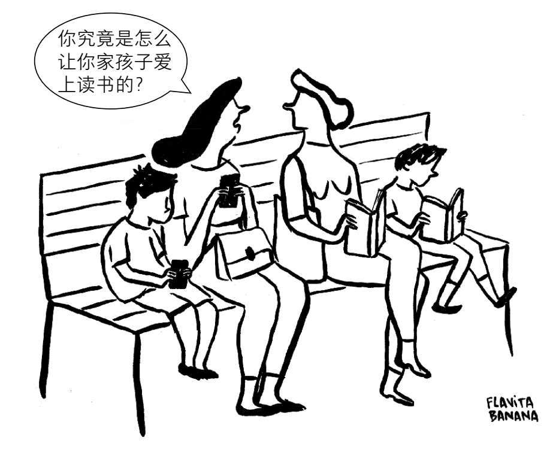

### 第8章 发掘矿藏：发掘团队的集体智慧 

旁人的眼睛会环视四周，见我前所未见之物。——马尔维娜·雷诺兹

### 第9章 钻石原石：在求职面试和高校招生中发现未经雕琢的宝石 

衡量一个人成功的标准，不是此生取得了多么高的地位，而是破除了多少障碍……在努力成功的同时克服困难。——布克·华盛顿

## 后记：走向远方

紧握梦想，因为，若梦想破灭，生命便是那折翼之鸟，无法飞翔。——兰斯顿·休斯

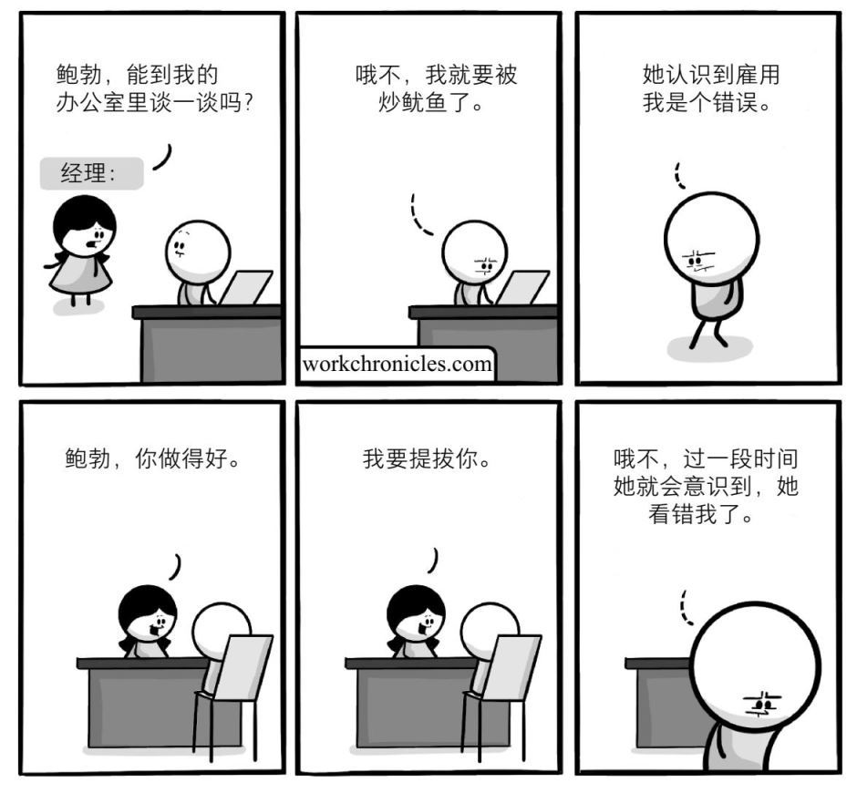

## 影响潜能的行为 

学习的过程并不是在我们获得知识后就结束了，只有这些知识能够持续地为我们所用，我们才算真正学有所成。以下是我的40条实用建议，可以帮助你释放隐藏的潜能、实现更大的成就。

### 培养品格技能

1. 通过品格技能释放隐藏的潜能。

房间里成长最快的并不是最聪明的人，而是努力让自己和他人变得更聪明的人。当机会不来敲门时，要想方设法建造一扇可敲之门，或者你也可以试试爬窗户进去。

#### A. 成为不适者

1. 不要害怕尝试新的风格。

与其专注于自己喜欢的学习方式，不如接受给你带来不适感的方法，用它来完成任务。一般来说，具有批判性思维的人最适合进行阅读和写作。“听”是理解言辞中情感的理想方式，而“做”更适合记忆信息。

1. 要么用，要么弃。

在你觉得还没准备好的时候就上场。你不需要提前适应一项技能，你的技能舒适度会在练习的过程中不断得到提高。多语言使用者告诉我们，即使是专家，也要从第一天开始。

1. 寻求不适。

与其一味地努力学习，不如主动追求不适感。追求不适感会让你更快地成长。如果想做对什么，你就必须先找到犯错的感觉。

1. 预设犯错计划。

为了鼓励自己尝试和犯错，设定一个最小犯错数，作为自己每天或每周的目标。你若已经预设了自己会犯错，就不会一直沉浸在犯下的错误里，你会取得更大的进步。

#### B. 成为海绵

1. 提高你的吸收能力。

寻找新的知识、技能和观点，不是为了自我满足，而是为了促进你的成长。进步取决于你吸收的信息的质量，而不是你搜集了多少信息。

1. 寻找建议，而不是反馈。

反馈是向后看的，它会引导人们批评或赞美你的表现。而建议是前瞻性的，它会引导别人指引你进步。“我下次可以在哪方面有所改进？”你只需要提出这个简单的问题，就能够让你的批评者和啦啦队更像教练。

1. 找出值得信任的信息来源。

决定吸收哪些信息，过滤哪些信息。倾听那些拥有相关专业知识（可信度）、非常了解你（熟悉度）并希望为你找到最好的路径（关心）的教练的意见。

1. 成为你希望拥有的教练。

诚实是忠诚的最高表现。乐于助人，尊重他人，能激发榜样效应。言谈坦诚，态度恭敬。让人们看到，从相信他们潜力并关心他们成功的人那里，总是很容易听到残酷的真相。

#### C. 成为不完美主义者

1. 追求卓越，不苛求完美。

进步来自保持高标准，而不是消除所有缺陷。通过确定一些你可以接受的缺点，实践“侘寂”，即在不完美的条件下尊重美的艺术。考虑一下，你需要在哪些方面真正做到最好，哪些方面满足于足够好即可。用埃里克·贝斯特的问题来记录你的成长：你今天让自己变得更好了吗？你今天让别人变得更好了吗？

1. 请别人评估你的进步。

想知道自己的作品是否至少讨人喜欢，可以请几个人从0到10分为你的作品独立打分。无论他们给你打几分，你都要追问他们，如何才能更接近10分。一定要设定一个你可以接受的结果和一个理想的结果。别忘了，要想在你最重视的方面获得高分，你可能必须接受其他方面的低分。

1. 将最后的裁判权留给自己。

让别人失望好过让自己失望。在你的作品面世前，评估一下它是否能成为你的代表作。如果这是你公之于众的唯一作品，你会引以为傲吗？

1. 进行心理时间旅行。

当苦于看不到自己的进步时，你想想过去的自己会如何看待现在的成就。如果你在5年前就知道自己现在取得的成绩，你会有多自豪？

### 搭建鹰架，攻坚克难

1. 在适当的时候，向他人寻求适当的支持。

每个挑战都需要相应的支持才能完成。你需要的并非永久性支持，这种支持只是一个临时性结构，能够给你一个立足点或一次托举，如此一来，你就可以依靠自己的力量继续攀登。

#### A. 化练习为游戏

1. 把每天的磨炼变成每天快乐的源泉。

为了保持和谐的激情，要将练习设计成刻意游戏。设置一些有趣的技能挑战。比如，伊芙琳·格伦尼学习用小军鼓敲奏巴赫的作品；斯蒂芬·库里尝试在一分钟内得到21分；住院医生用无意义的词语对话玩即兴喜剧游戏，以此磨炼他们的非语言沟通技能。

1. 与自己竞争。

衡量自己进步与否的标准不是对手，而是时间。与他人竞争存在风险：你可能会在自身没有进步的情况下赢过对手。当你与自己竞争时，获胜的唯一途径就是成长。

1. 不要让自己受制于固定的练习时间。

新颖多样的练习可以避免倦怠和闷爆。你可以交替练习不同的技能，或者变换学习这些技能的工具和方法。即使是很微小的调整，也能为你带来很大的不同。

1. 积极主动地休息和恢复。

不要等到倦怠或闷爆出现后才去休息。你需要把休息时间安排到你的日程表中。休息有助于保持和谐的激情，催生新的想法，让你进行深度学习。放松不是浪费时间，而是健康投资。

#### B. 迂回前行

1. 当陷入困境时，退就是进。

当走入死胡同时，也许是时候你该回头寻找新的道路了。这样做看似是在倒退，但往往是找到进步之路的唯一方法。

1. 找到指南针。

走上新的路线时，你不需要地图，只需要一个指南针来判断自己的方向。一个好的指南针是前行的保障，它会在你偏离方向时发出信号。

1. 寻找多个向导。

不要只依赖一个专家或导师，要记住，综合思考多位向导的指导才能找到最好的方向。问一问他们自己的旅程中有什么样的里程碑和转折点，告诉他们你迄今为止走过的路。他们给你指路后，你可以把他们的建议整合成一条适合你的路线。

1. 做一份副业。

当发现自己萎靡不振时，你可以绕道而行，去一个新的目的地，从而为自己创造前行的动力。当在一个副业或业余爱好上取得进展后，你会感到小有成就，这能够提醒你，你有可能继续前行。

#### C. 自举翱翔

1. 以教促学。

最好的学习方法就是教。给别人讲解，你会更好地理解所学之物；花时间回忆，你会将知识记得更牢。就像黄金十三人一样，你可以组建小组互相教学，每个成员负责讲授一种技能或知识。

1. 指导他人，建立自信。

当不确定自己是否有能力克服障碍时，与其寻求建议，你不如试着给别人提建议。指导他人克服挑战会提醒你，你也拥有克服挑战的能力。你给出的建议通常也是你需要采纳的建议。

1. 把高期望值和低期望值都作为动力。

如果对你一无所知的否定者质疑你，你就把它视为一种挑战。与其让他们击垮你的信心，不如将他们的质疑视为去证明他们错误的机会。当可信的支持者力挺你时，你要勇往直前，不辜负他们的期望。

1. 做一个优秀的先辈。

当你的信念有所动摇时，回想一下你是为谁而战。我们最深厚的坚韧性源于其他人对我们的依赖。

### 建立机会体系

1. 为被低估和忽视的人敞开大门。

建立一种体系，使其不是只关注天才学生和高潜能员工，而是为所有人创造机会。一个好的体系会让弱势者和后进者有机会展示他们已经取得了多大的进步。

#### A. 设计学校课程，激发所有学生的最佳潜能

1. 不要浪费任何一个头脑。

认识到智力有多种存在形式，每个孩子都有出类拔萃的潜能。不仅要培养学生的成长心态，还要培养教师的成长心态。不以尖子生的成绩，而是以每个学生的进步来衡量教育是否成功。

1. 教育专业化。

效仿芬兰的做法，将教师培养成值得信赖的专业人士，并为其提供应有的待遇。当教师有能力随时掌握最新材料、相互指导、制定课程，并得到相应的支持时，下一代就能取得更大的成就。

1. 让学生多年跟随同一位教师学习。

循环式教学可以让教师在专注于自己所教学科的同时，更多地关注自己的学生。如果有更充足的时间亲自了解每个学生，教师就可以成为教练和导师，从而有针对性地为学生提供教学和情感支持，帮助所有学生发挥潜能。

1. 给予学生探索和分享个人兴趣的自由。

教师教给学生最重要的一课就是学习乐趣无穷。学生如果可以选择自己感兴趣的活动站、书籍和课题，就更有可能形成内在的学习动力。如果可以就自己喜欢的主题进行演讲，他们的学习热情就会更强，其他同学也有机会受到他们热情的感染。

#### B. 发掘团队的集体智慧

1. 将小组转变为团队。

集体智慧取决于团队的凝聚力，团队应共同承担责任，齐心协力完成有意义的任务。当人们相信他们需要相互扶助才能成功实现一个重要目标时，团体力量就会大于各成员力量之和。

1. 根据亲社会技能选择领导者。

要提拔那些把使命看得比自我更重要、把团队凝聚力看得比个人荣誉更重要的人，而不是那些巧言令色的自私自利之人。如果团队想要有所贡献，那么最能领导团队走向成功的不是最能说会道的人，而是最善于倾听的人。

1. 变“头脑风暴”为“脑力写作”。

为了保证参与的均衡性，找到更好的解决方案，在召开小组会议之前，先让大家独立提出和评估想法。之后再公布所有的想法，团队成员就此进行共同讨论，选择并完善最有希望的想法。

1. 用网格体系取代阶梯体系。

不要让人们的建议被一位上司一票否决，要让人们通过多种渠道发表自己的意见。如果员工可以对接的上司不止一位，那么他们的想法就不会被一个“不”字扼杀在摇篮里，而一个“好”字足以挽救一个想法。

#### C. 在求职面试和高校招生中发现未经雕琢的宝石

1. 取消对证书和经验的要求。

在评价他人时，切忌将过去的成就和经验误认为是未来的潜能。背景和天赋决定了人们的起点，而品格技能决定了他们能攀多高。

1. 考虑困难程度。

走得磕磕绊绊之人并不一定没有能力，而可能是他们所行之路坎坷崎岖。想知道应聘者所面临的障碍，可以将他们的表现与其所在学校、专业和社群的同龄人进行比较。

1. 用轨迹评估。

仅看近期表现或平均表现还不够，更重要的是要关注应聘者一段时间内的表现轨迹。如果应聘者的轨迹是上升的，那就暗示此人克服了逆境。

1. 重新设计面试，帮助应聘者取得成功。

与其最大限度地增加应聘者的压力，不如创造机会让应聘者发光发热。请应聘者分享他们的爱好，展示他们的优势。之后，询问他们是否认为自己已表现得尽善尽美，如果没有，那就给他们一次重来的机会。

1. 重新定义成功。

潜能最有意义的表现形式是进步。潜能的最终标志不是你所达到的顶峰的高度，而是你所行路途的长度，以及你帮助他人走了多远的路程。

---

### **第一部分：品格技能——突破天赋的认知陷阱**

**核心命题**：潜力的关键不在于天赋，而在于后天培养的品格技能（如韧性、主动性、合作性）。  

#### **吸收能力：像海绵一样学习**  

- 案例：标枪运动员朱利叶斯·耶戈（Julius Yego）通过自学YouTube视频成为世界冠军，证明“主动吸收”比传统训练更高效。  
- 观点：真正的学习不是被动接受，而是主动构建知识网络，将新信息与已有经验结合。  

#### **不完美主义：从“追求完美”到“刻意犯错”**  

- 案例：亚当·格兰特本人在大学跳水时因完美主义停滞不前，最终通过“每天犯200个错误”的策略突破瓶颈。 
- 观点：完美主义阻碍成长，而“策略性试错”能加速进步。例如，语言学习者通过主动暴露错误（如每天用新语言说200句话）提升流利度。  

#### **延迟满足：用游戏化策略对抗即时诱惑**  

- 案例：NBA球星斯蒂芬·库里的教练设计“极限21”游戏，将枯燥训练转化为限时挑战，激发球员持续动力。  
- 观点：将目标分解为有趣的小任务，利用“多巴胺回路”增强自律，而非单纯依赖意志力。  

#### **共情力：从“自我中心”到“利他驱动”**  

- 案例：“黄金十三勇士”在种族隔离时期互相扶持，成为美国海军首批黑人军官，证明集体归属感能激发深层潜能。  
- 观点：当个人目标与他人福祉绑定（如为团队荣誉而战），动力更持久，表现更卓越。  

### **第二部分：动力结构——构建持续成长的系统**

**核心命题**：潜力的释放需要外部支持（如导师、环境）和内在机制（如反馈循环）。  

#### **刻意游戏：在玩耍中突破舒适区**  

- 案例：小提琴家埃弗林·格伦尼（Evelyn Glennie）鼓励学生用“反向演奏”“加入动物声音”等方式练习，将技巧训练转化为创造性游戏。  
- 观点：多样性和新鲜感能激活大脑的“奖励中枢”，使学习过程更愉悦、高效。  

#### **反馈网络：从“自我评判”到“他人视角”**  

- 案例：亚当·格兰特在写作时邀请20位读者评分并提出改进建议，直到所有人给出至少8分（满分10分）。  
- 观点：外部反馈能帮助我们发现盲点，但需注意筛选（如优先听取领域专家而非泛泛评价）。  

#### **以退为进：在迂回中寻找突破**  

- 案例：棒球投手R.A.迪基（R.A. Dickey）在传统投球陷入瓶颈后，转而学习“蝴蝶球”技术，最终成为全明星球员。  
- 观点：当正面突破困难时，转换路径（如跨界学习、调整策略）可能带来指数级成长。  

#### **互助体系：教是最好的学**  

- 案例：医学院学生通过辅导同伴，自身成绩提升30%；企业中“师徒制”使新人适应期缩短50%。  
- 观点：教学过程迫使我们深度理解知识，并从他人视角发现漏洞，形成“双向成长”。  

### **第三部分：机会体系——打破环境的限制**

**核心命题**：潜力的实现依赖于公平的机会和包容性的系统设计。  

#### **反精英主义：重新定义“成功标准”**  

- 研究：顶尖大学毕业生与普通大学毕业生在工作成效上差异微小，工作经验对能力提升的影响有限（除外科医生等极少数职业）。  
- 观点：招聘应关注“成长轨迹”（如从失败中反弹的能力）而非学历或经验，避免埋没“大器晚成者”。  

#### **系统赋能：消除结构性障碍**  

- 案例：智利矿难救援中，团队通过全球征募方案，最终采用一名学生的创新方法成功救人。  
- 观点：组织应建立“格子型结构”，允许跨层级沟通，并鼓励员工提出异见，打破“权威垄断”。  

#### **韧性培养：在挫折中重构认知**  

- 案例：亚当·格兰特在哈佛写作测试失败后，通过“吸收反馈+持续改进”策略成为全班唯一获A的学生。  
- 观点：将失败视为“数据点”而非终点，用“成长型思维”重构对挫折的理解。  

#### **品格超越：从“成就导向”到“价值驱动”**  

- 结语：真正的潜力在于品格的完善，而非世俗意义上的成功。例如，幼儿园教师通过培养孩子的主动性和合作性，使其终身收入增加32万美元。  

- **认知颠覆**：否定“天赋决定论”，强调品格技能的可塑性。  
- **行动指南**：提供具体方法（如刻意游戏、反馈网络）帮助读者将潜能转化为行动。  
- **系统变革**：呼吁社会和组织重构机会体系，为更多人创造成长空间。  

### 参考资料

[《品格之路》-【美】戴维·布鲁克斯](https://www.dedao.cn/ebook/detail?id=ZpoVrgXBZpKrJvLmo89Q4bD7O1de2aWAdZ0YgXGPxBMVzqlRNk5j6yEnAa9E576Q)

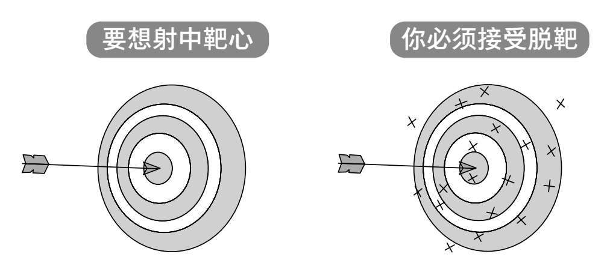

  
 

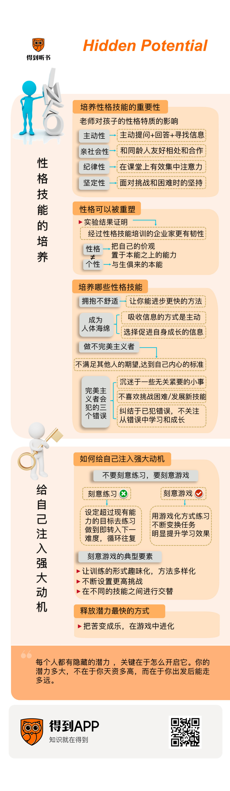
