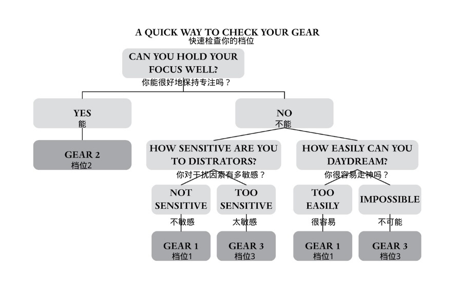
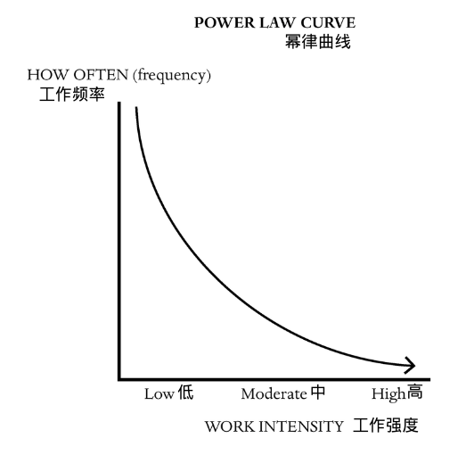
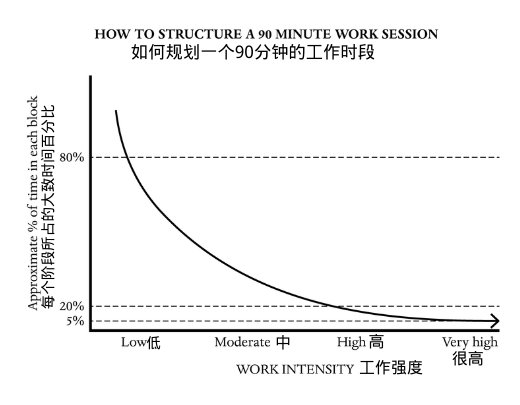
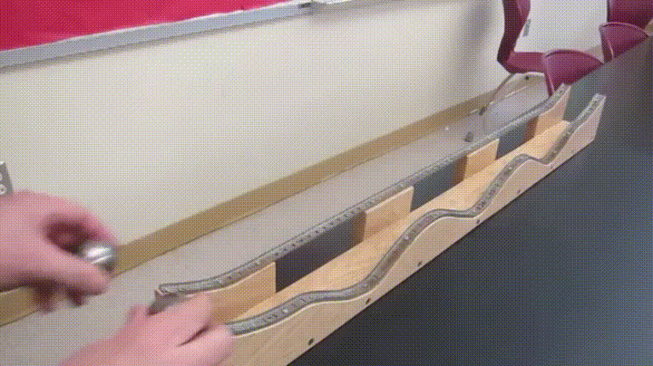
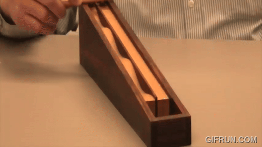

# 《超高效：通过优化大脑改变你的工作方式》

**书名**：《超高效：通过优化大脑改变你的工作方式》(*Hyper efficient: Optimize Your Brain to Transform the Way You Work*)

**作者**：米图·斯托罗尼（Mithu Storoni）

**出版时间**：2024 年 9 月 

**主要内容：**现代工作环境仍然受到工业革命时期“流水线效率”模式的深刻影响，强调数量而非质量。然而，在当今以技术为主导的知识经济中，真正重要的工作——如创造性思维、复杂问题解决和学习——无法像流水线产品一样被批量生产。斯托罗尼提出了“超高效”（Hyperefficient）的概念，即通过让工作节奏适应大脑的自然运作方式，优化注意力、创造力和决策能力，而不是强迫大脑适应外部的工作节奏。

“心理表现的巅峰不是通过强迫大脑适应工作，而是让工作适应大脑的节奏。”—— 斯托罗尼 

#### 三档模式

一档是休息状态，为创造性思维做准备；二档是高效工作状态，分低能量、核心区、高能量三个区域；三档是紧张状态，易犯错且消耗大脑能量，工作应保持在二档，休息进入一档，避免三档。

- **一档（休息状态）：**低警觉性，注意力涣散，类似白日做梦，适合放松和恢复，为创造性思维做准备，但不产生实际产出。对应脑科学中的“默认模式网络”。
- **二档（高效工作状态）：**注意力集中，适合脑力劳动。对应脑科学中的“中央执行网络”。二档又细分为三个区域：

  - **低能量二档：**注意力时断时续，适合创意工作，让想法与内心连接，产生灵感。
  - **二档核心区：**高度专注，不受内外干扰，适合纯输出、复杂但不需要创造性的工作。接近“心流状态”。
  - **高能量二档：**对注意力掌控自如，对外界信息敏感，精力旺盛，适合复杂问题推理和学习新知识。
- **三档（紧张状态）：**高度紧张，注意力被外界干扰劫持，无法自主思考，容易犯错，消耗大脑能量。对应脑科学中的“突显网络”。

目标是工作中保持在二档，休息时进入一档，尽量避免进入三档。

#### 升档和降档的方法

可通过外部环境（光线、声音）、身体调节（运动、挤压、放松、温度）、眼神（聚焦、发散）、咖啡因等方法主动升档或降档。

- **外部环境：**

  - **光线：**冷色光（蓝光）升档，暖色光降档。
  - **声音：**高频率、快节奏、大音量升档，反之降档。背景音乐应避免歌词。
- **身体调节：**

  - **运动：**任何运动都能升档，强度越大效果越好。
  - **挤压：**挤压压力球或握紧拳头可以升档。
  - **放松：**放松肌肉和缓慢呼吸（5秒吸气/5秒呼气）可以降档。“生理叹息”减压法也有类似效果。
  - **温度：**温度的突然变化（冷水澡/热水澡）可以升档。
- **眼神：**

  - **聚焦：**盯住细小目标可以升档。
  - **发散：**放宽视野，取消聚焦可以降档。闭眼或散步也有助于降档。
  - 盯住细小目标可提升注意力至二档。
  - 扬眉睁大眼睛能增加创造力，皱眉则减少。
  - 想降档放松，可短暂闭眼或散步，散步时周围景色变化有助于保持适度警觉而不紧张。
- **咖啡因：**咖啡因饮料能提神升档，但已在专注状态时饮用可能导致过度兴奋而分散注意力。

#### 幂律节奏

大脑应遵循幂律分布节奏，采用60 - 90分钟周期循环工作，前20分钟高强度，接着40 - 70分钟低强度，再休息10分钟，高强度脑力劳动每天不超4小时。

斯托罗尼认为大脑不是设计成匀速工作的，而应该遵循幂律分布的节奏，即大部分时间进行低强度工作，偶尔进行高强度工作。她建议采用 60-90 分钟的周期循环工作：

- 前 20 分钟：高强度工作（高能量二档），处理最难的任务。
- 接下来 40-70 分钟：低强度工作（低能量二档），处理较轻松的任务。
- 休息 10 分钟。

高强度脑力劳动每天不应超过 4 小时，连续用脑不应超过 90 分钟。

大部分时间做轻松的事儿，偶尔上个强度，这才是我们人类原本的设定。人的高强度工作时间如果太长，表现就会下降，感觉上就是大脑变慢了，正在不自主地前往一档休息区。这其实是个补偿机制，大脑需要休息。一个周期可以这么安排 ——

- 开始的前20分钟，用于最难的任务，是高强度工作区；
- 接下来的40到70分钟，做一些比较慢、比较轻松的工作；
- 然后休息10分钟，再进行下一个周期。

高强度脑力劳动不应该超过每天4个小时。连达尔文那样的大师也没有每天深度工作超过4小时。如果超过，休息一晚上就不够恢复了。

#### 创造性工作中的大脑使用

创造性工作需在一档和二档灵活切换，避免三档，如石黑一雄创作过程，准备和点亮验证阶段用高能量二档，孵化阶段用低能量二档或一档。

创造性工作需要在不同档位之间灵活切换：

- **一档：**清空大脑，为创造性思考做准备。
- **低能量二档：**适合自发式创造力，让灵感自然涌现。散步、做家务等活动有助于进入此状态。
- **高能量二档：**适合主动发散思维和推理，评估多种可能性。
- **避免三档：**压力和紧张感是创造力的大敌。

石黑一雄的创作过程：准备阶段（高能量二档），孵化阶段（低能量二档/一档），点亮和验证阶段（高能量二档）。

#### 如何让大脑强力输出

学习新知识新内容占比15.87%最佳，结合表演等增强学习效果，学习前后进行特定运动和刺激，将任务分解保持心流，内部和外部驱动都重要，把任务视为挑战。

斯托罗尼将高水平的脑力工作者比作运动员，他们需要对大脑状态非常敏感，并有意识地进行档位切换。她强调：

- **熟悉+意外：**学习新知识时，新内容占总内容的 15.87% 是最佳比例。
- **高能量二档学习：**结合表演、戏剧化场景、特殊环境或情感色彩来增强学习效果。
- **学习前后的刺激：**学习前进行短跑等高强度运动，学习后进行平静期和观看刺激性短视频，学习四小时后进行中等强度运动。
- **心流：**将任务分解成小挑战，每完成一个挑战都获得即时反馈，以保持动力。
- **内部驱动和外部驱动：**内部驱动（对努力的奖励）和外部驱动（功利目的）都很重要。
- **挑战与威胁：**将任务视为挑战（为了赢）而非威胁（为了避免输），以更好地发挥水平。控制感越强，越倾向于将其视为挑战。

---

1. 用注意力的使用情况，把大脑的状态分成三档：**一档是自己不愿集中注意力，二档是集中注意力，三档是外界干扰让你来不及集中注意力。** 
2. 可以主动用升档或者降档的方式换档，如**利用外部环境、身体调节、用眼神、喝咖啡**。 
3. 最佳工作状态是二档，效率高而且不会受伤。创造性工作最好是低能量二档，会议、高难度学习和推理工作最好是高能量二档；休息，比如你想睡觉，要降到一档；如果你处在三档，你应该设法降档，因为紧张会让你失误，而且对健康不好。 
4. **人的大脑不是设计成匀速做事的。**大部分时间做轻松的事儿，偶尔上个强度，这才是我们人类大脑原本设定的工作节奏。 我们应该按照一个60到90分钟的周期循环工作，结束一个周期就休息，在每个周期内部合理安排低强度和高强度工作。 高强度脑力劳动不应该超过每天4个小时，任何情况下连续用脑工作不应该超过90分钟。 
5. 在创造性工作中使用大脑，你需要合理调配一档和二档，但不要上三档。 脑力工作不应该是像生产流水线那样的匀速直线运动 —— 它应该是一种连续起伏的登山运动。想象你前方有若干座小山头，你的任务是一个一个地征服它们。 
6. 最好的动力不是来自你的意志力，而是登上每个山头的山顶往下滑的那个愉悦感。是这个工作本身让你感到有意思。 
7. 人面对威胁的时候很可能因为上了三档，发挥不出应有的水平；而在面对挑战的时候则更可能上到高能量二档，从而超水平发挥。关键在于，你是把这个事儿视为一个「挑战」，还是一个「威胁」。

  

### 使用大脑的新框架

人的大脑并不是像电灯泡那样以固定的功率往外输出。其实哪怕是稍微复杂一点的电器，都有快的时候和慢的时候。比如你家的吸尘器，可能吸地板是一种功率，吸地毯是更高的功率。汽车更如此，有若干个档位。人也是如此。当然我们身上没有换档的装置，你可能感觉不到，但是你也总会处于不同的状态。

#### 大脑的三个档位

脑科学家有时候用三个网络描写大脑的三种工作状态：**放松的「默认模式网络」、积极完成任务的「中央执行网络」、负责切换注意力的「突显网络」**。你还可以分成「发散思维」和「集中思维」。还有著名的「系统1」和「系统2」思维。我们还曾经把人的状态分成「压力模式」和「放松模式」。又或者你还可以说这个人是否进入了「心流状态」……

这些分类方法只是视角不一样。斯托罗尼是**从脑力劳动者日常工作用脑的角度，基于去甲肾上腺素的发射情况，提出了一个新的框架**，把大脑的状态分成了慢中快三个档：

1. 一档，无所事事的休息状态；
2. 二档，高效工作状态；
3. 三档，草木皆兵的紧张状态。

或者我们也可以说她这是用注意力的使用情况分类：一档是自己\*不愿\*集中注意力，二档是集中注意力，三档是外界干扰让你\*来不及\*集中注意力。

**我们的目标是在工作中上二档，在休息中上一档，尽可能少上三档。**

- 一档，相当于你慵懒地躺在一个长椅上，泛泛地看看周围的景色，有一搭无一搭，没有聚焦，没有注意任何细节，完全放松。你并不在意外界的事儿，任由自己内心的思绪游离，自在地做着白日梦。**这是一种休息状态，似乎还能清除大脑中的垃圾。**一档为创造性思维做好了准备，但是因为它不调用注意力，所以不会真的创造什么。
- 二档，最重要特点就是注意力集中，最适合脑力劳动。比如读书、思考、想象、预测、分析，做什么都需要注意力。用拍照片打比方，就是你聚焦在一点，把背景模糊化。二档细分为三个区域：

  - **低能量二档区，**靠近一档，你会时不时失去注意力，但马上能收回来。这个状态最适合让眼前的工作和内心的想法发生连接，从而灵感迸发，产生创造力想法。创意工作者应该尽量让自己处在这个位置。
  - **二档核心区，**是注意力高度集中的状态，不管是内心的想法还是外界的刺激都不能打扰你。你一门心思解决眼前的任务，特别适合做纯输出的、复杂而又不需要什么创造性的工作。心流状态应该最接近这里。
  - **高能量二档区，**则是这么一种状态，你对注意力掌控自如，同时又对外界信息非常敏感，以至于你可以随时把注意力放在一个新的信息上。这是激情、好奇和探索的状态，表现出来就是精力旺盛而自主性强。你会主动扫描，看看有什么有意思的东西闪现。你能敏锐地抓住平时注意不到的细节。高能量二档区最适合进行复杂问题推理和学习新知识。
- 三档，则是或者情况紧急，或者外界的刺激强烈，或者你感到压力巨大，整个思维被劫持，以至于不能自主地想事儿，所以无法保持注意力。比如医生正在紧急救治心脏骤停的病人，或者运动员正在比赛，什么都来不及细想，能把以前学的东西给自动发挥出来就好。因为不能冷静思考，处于三档的时候，我们面对不熟悉的局面就可能犯错误。你会容易产生误解、表现偏见，做草率的决定。而且三档会磨损大脑，产生一些垃圾，需要回到一档和在睡眠中清理。这就是为什么我们应该尽可能减少三档的时间。

整个分类可以用下面这个图描写 ——

- **只要你能保持注意力，你就在二档。**
- 如果不能保持注意力，那么如果你对外界的干扰特别不敏感、而且很容易做白日梦，你就是在一档；
- 如果你对外界干扰非常敏感，无法做白日梦，你就是在三档。

斯托罗尼这个框架的好处是可操作性强，因为你可以主动用升档或者降档的方式换档。每个人换档的难易程度可能不一样。这取决于你对刺激是否敏感。

#### **外部环境**

- 偏蓝色或者说冷色调的灯光能提高警惕性，帮你**升档**；如果你感到自己过于散漫，想要集中注意力，就上冷色光；
- 偏红或者说温暖柔和的光则有助于放松，让你**降档**。如果你过于紧张需要放松一下，或者想提升一点创造力，温暖柔和的光线会更合适。
- 声音，普遍的规律是频率越高、节奏越快、音量越大，越能**升档**，反之则可以**降档**。

  - 早上起来想要迅速清醒，可以打开电视听听新闻，早间新闻主持人的语速都很快。
  - 斯科特·亚当斯（Scott Adams）喜欢去咖啡馆之类的公共场所写作，现在看来就是因为家里太安静了，他需要一定的背景噪音帮助升到二档，从而提高注意力。
  - 播放背景音乐是个好办法。想要升档可以用快节奏的曲子，而反过来说，酒店大堂、牙科诊所和水疗中心这些地方播放的都是舒缓的音乐，希望你平静下来。
  - **不管是什么音乐，都不要有歌词 —— 因为歌词会分走你的注意力。**

#### **用身体调节**

- 任何形式的体育运动都能升档，而且运动的强度越大、持续时间越长，升档的效果就越好。这就是为什么有ADHD的人应该经常参加体育运动。升档效果会在每次运动停止之后持续一段时间。
- 比如你现在很懒散，想要集中精力工作，可以先出去适度运动半个小时，回来后能得到半个多小时的兴奋状态。
- 用手挤压一个压力球18秒钟，然后放松一分钟，如此重复几遍，就能提高注意力得分。这样说来自己握紧拳头也能升档。
- 放松肌肉能够降档。这大约就是为什么我们以前讲的「非睡眠深度休息法（NSDR）」中，有扫描全身、一步一步放松的步骤。另一个降档方式是缓慢的呼吸，用5秒吸气，再用5秒呼气，10秒一个循环。我们之前讲休伯曼推荐过一个「生理叹息」减压法，大约也是同样的道理。身体感受温度的突然变化，不管是变冷还是变热，都能升档。你早上起来想要从一档迅速进入二档，可以冲一个冷水澡或者热水澡。

#### **最方便的方法是用眼神**

- 盯住一个地方看，不管你之前是处在一档还是三档，都能把你迅速拉入二档。盯着看自然就有注意力。要点是选一个特别细小的目标。据说网球运动员要想消除比赛的焦躁不安感，迅速从三档到二档，可以盯着一个网球看一会儿，但不是看整个网球，而是看网球上某处缝线的那个小图案。
- 反过来说，如果你想降档，那就要把视野放宽，取消聚焦。有实验甚至证明，扬眉，也就是把眼睛睁大这个动作，能增加创造力，相当于是进入低能量二档区；而皱眉，则会让注意力范围缩小，乃至于降低了创造力。
- 如果想从二档进入一档休息，最直接的办法就是短暂地闭眼。

#### 散步提高创造力

进入低能量二档区提高创造力的另一个办法是散步。首先你是在走动，走路这个动作会给你带来一定的警觉，所以不会完全进入一档；与此同时，周围景色在变化，所以你的注意力不会集中在一个点上；再者，散步又不是跑步，不紧张，不会进入三档。

#### 喝咖啡升档

任何含有咖啡因的饮料，作用都是升档。

你工作的时候昏昏沉沉处于一档，咖啡能把你提到二档。但如果你已经在二档，正在很专注地工作，那就没必要喝咖啡 —— 因为搞不好你会进入三档，反而不能集中注意力从噪声中寻找信号。

特别是去一档休息之前绝对不要喝咖啡。

这个思路非常清楚：

1. 最佳工作状态是二档，效率高而且不会受伤。其中创造性工作最好是低能量二档，会议、高难度学习和推理工作最好是高能量二档；
2. 休息，比如你想睡觉，要降到一档；
3. 如果你处在三档，你应该设法降档，因为紧张会让你失误，而且对健康不好。

### 如何科学地使用大脑：幂律节奏

#### 脑力工作者

如果你说世界上有体力工作者和脑力工作者，那请问，运动员算不算体力工作者？正如大部分“体力工作者”都是以非常平庸的方式使用自己的身体，大部分脑力工作者也是以平庸的方式使用大脑。现代城市白领都在办公室里做些处理信息的工作，很多工种不需要什么创造性，都是走流程，似乎谈不上有多“用脑”。

脑力工作者中的“运动员”，比如艺术家、科学家、发明家、决策者，得对大脑的状态非常敏感才对，得有换挡意识。

如果你是一个很好的脑力工作者，你对大脑不会是平直的、匀速的用法，你应该一惊一乍，自带节奏。

#### 大脑的节奏

人的大脑不是设计成匀速做事的。按照固定速度做事是生产流水线的要求，是工业化的产物。

最早是管理学的开山祖师弗雷德里克·泰勒（Frederick Taylor）的洞见。他在工厂里观察发现，让车间工人按照各自的节奏工作，有劲儿就猛干，累了就歇一会儿，不但不利于合作，而且在很大程度上浪费了体力。科学的办法是给每个人设定标准动作，大家按照统一节奏走，都踩上点，效率又高又节省体力。

这个思想被福特汽车公司用「生产流水线」给发扬光大了：现在工人都在原地不用动，传送带会把你的活儿自动送到你面前，等于是强制所有人用同一个速度工作。

这种节奏均匀化的做法的效率对产品数量是最优的，因为它让人以固定的频率交接，取消了等待时间，取消了体力的浪费。这个方法是如此之好使，以至于成了传统。

以至于现代做办公室工作的白领们，某种意义上也成了流水线工人。只不过现在流动的是信息而已。

流水线优化的是「数量」，可脑力劳动难道不应该更加追求「质量」吗？

#### 高水平脑力工作

高水平脑力工作，一定是发生在每个人自己的头脑之中。当然也有分工合作，但归根结底，好的想法、创意、决策、推理，都是在一个人的大脑之中进行。你不需要频繁的交接，文章不是我写一句你接一句、他再写一句这么生产出来的。

脑力工作是非常个人化的，那么似乎就应该按照每个人大脑的自然节奏走才好，别管什么泰勒和福特。

自然的工作节奏是什么样的呢？

人类学家考察了很多在现代世界中遗存的采集狩猎部落，发现他们的劳动方式跟流水线工人和都市白领很不一样。他们不是匀速工作。

他们大部分时候的工作强度都很低。比如寻找食物，一般也就在自己住的地方附近找一找，基本就够了。走一走停一停，一点都不忙碌，穿插着休息，相当轻松。

只有在特别必要的情况下，他们才会去追踪猎物，干一个大活儿。这可能意味着连续追踪一个大型猎物很长时间，需要奔跑。但这种高强度的工作很不常见，而且干一次就要休息好几天。

用数学语言来说，这种工作方式叫做「**幂律（power law）分布**」，**特点是比较小的事物出现的数量特别多，比较极端的事物出现的数量比较少（但是也有）**

图中横坐标代表各种工作的工作强度，纵坐标代表频率。采集狩猎者做的大部分工作都是低强度的，高强度工作的频率很低。而调查表明，这些人的身体和精神健康状况、寿命都比都市白领明显更好。

大部分时间做轻松的事儿，偶尔上个强度，这才是我们人类原本的设定。是固定化的农业和工业生产方式异化了我们。

但我们的基因记忆还在。你看看新生儿就知道。他们大部分时候清醒的时间都很短，跟你玩一会儿就睡了，频繁地休息；如果有一段比较长的清醒时间，接下来就会睡很长时间。

最厉害的脑力工作者也是这么工作的。以前没有互联网，学者们都是用书信交流思想。有人专门研究了达尔文、弗洛伊德和爱因斯坦写信的时间分布，发现他们并不是像流水线工人那样收到一封信就回复一封信。他们从收信到回信的间隔时间大多比较短，但也有的特别长 —— 他们大多随手就回复，偶尔则是经过长时间思考才回复。

那不是办公室文员的工作模式，那是幂律分布。

当然现代职场中我们不能干一天休息几天，但是仍然应该按照比较自然的节奏工作。斯托罗尼重点建议一个小周期。

人的睡眠是有周期的，从浅睡、到快速眼动睡眠、再到深层睡眠，一个周期大约是90分钟。那么有人提出，大脑清醒的时候，其实这个周期仍然在运转。**我们应该按照这个周期循环工作，一个周期大约在60到90分钟，结束一个周期就休息，在每个周期内部合理安排低强度和高强度工作。**

这里说的高强度工作可不是三档，而是高能量二档，低强度则是低能量二档。

人的高强度工作时间如果太长，表现就会下降，感觉上就是大脑变慢了，正在不自主地前往一档休息区。这其实是个补偿机制，大脑需要休息。

斯托罗尼建议一个周期可以这么安排：

- **开始的前20分钟，用于最难的任务，是高强度工作区；**
- 接下来的40到70分钟，做一些比较慢、比较轻松的工作；
- 然后休息10分钟，再进行下一个周期。

高强度和低强度的工作时间，正好也是幂律分布 ——

暗合了采集狩猎者的自然生活，只不过这个周期比较短，每天可以进行好几次。**总的来说，高强度脑力劳动不应该超过每天4个小时。**连达尔文那样的大师也没有每天深度工作超过4小时。如果超过，休息一晚上就不够恢复了。

#### 休息的两种方式

如果你经常高强度用脑，休息对你很重要。休息有两种方式。

- 如果你只是感到很累，但并不担心什么，那直接去一档休息就好。要点是**不要集中注意力**。要是一个什么节目让你上头了，开始动脑，那就不是休息。
- 如果你明明很累了，但还是对工作中的事儿念念不忘，很担心，你就得用一些更积极的办法先换脑子。体育锻炼、电子游戏、冥想瑜伽深呼吸什么的都可以，关键是先把那个担心放下再说。

任何情况下连续用脑工作不应该超过90分钟。15分钟到20分钟的小睡能让你迅速恢复精力。

#### 如何在创造性工作中使用大脑

创造性工作的特点是你要让想法跟想法发生连接，这意味着你得有个不错的心情。你需要合理调配一档和二档，但不要上三档。一旦进入三档，你就没办法自主地想任何事，整个心智都被压力和紧张感占据，那是创造力的大敌。

- 一档，能让大脑进入一个“清空”的状态，愁情烦事别放心头，为创造性思考做好准备。一般来说早上起来的第一个状态和晚上最后一个状态，这两个时间段特别适合一档，让大脑充分放松。
- 所有工作都在二档进行，而二档又分为三个小区。

  - 低能量二档最适合「自发式」的创造力，让你的灵感突然冒出来。它的特点是你有一定的注意力，但是这个注意力很飘忽，可以随时放下又升起。你需要一定的外界刺激来保留这一点注意力。有意思的是，低能量二档的注意力并不需要用在你工作的事儿上。比如散步，你只要注意脚下就行；做家务活儿，你注意别把碗摔了就好，你的注意力都是用在不重要的地方上 —— 而恰恰在这个时候，灵感最容易自己冒出来。斯托罗尼说的一个现象正好印证了我自己的一个经验，那就是开无聊会议的时候容易出灵感。我因为工作关系经常要听报告，很多报告我并不感兴趣，又是在下午进行，那真是昏昏欲睡。可你还不敢真睡，还是要注意一下报告在讲什么，以免讨论环节没话说。这种又注意又不注意的状态，我发现特别容易产生跟报告无关的、但是又很有意思的想法。所以我有时候听报告做笔记，记的不是报告里的东西。
  - 二档的中间，也就是聚焦式二档，特别适合发挥「晶体智力」，也就是按照你已经会的知识输出。
  - 高能量二档，在创造性工作中是主动的发散思维结合推理。你必须积极考虑多种可能性，评估每个可能性好不好。你能同时考虑的元素越多，就越容易发现其中的联系，从而爆发新想法。这就是搜索：你既要扩大关注的范围，又要随时在其中某个点上聚焦。有意思的是，这时候身体上的束缚和对发散思维的束缚是一致的。
  - 如果必须正襟危坐，很不舒服，你的思想就会发散不好，想不出很多新的可能性。
  - 把房间的天花板从八英尺高提高到十英尺高，就能立竿见影地开阔思路。所以你最好有个大办公室……或者到户外去思考，毕竟天空的天花板无限高。
- 其实搞创造性工作会经常进入三档的。有时候问题无解，有时候团队内部互相指责，有时候你的提议被上面否决，更不用说别人会无情地批评你的东西，你是什么感受？你会感到紧张、压力、威胁，你人在三档。这时候应该停止工作，先降档，比如使用我们刚才说的换脑子休息法，打个游戏听个笑话都可以。

#### 诺贝尔文学奖得主的创作过程

诺贝尔文学奖得主石黑一雄，分享他是怎么写出小说《长日留痕》（The Remains of The Day）:

- 首先，他在高能量二档做了大量的**准备工作（Preparation），**主要是读书做功课。因为小说说的是英国管家的故事，石黑一雄就找来所有关于英国仆人的书研读，还广泛读了两次世界大战之间的政治、外交政策相关的书。这样他把时代背景、人物文化环境都学明白了。
- 然后，**孵化（Incubation）。**这个阶段大约是低能量二档，甚至主要是一档的状态。在整整一年中，石黑一雄一点都没有做这个项目 —— 他去参加了一些社交活动，干脆不主动想那个小说。是小说的想法、各种灵感自己冒出来。
- 等到最后动手写，是**点亮和验证（Illumination and verification）**阶段，又回到高能量二档。石黑一雄每天疯狂地写作，试验各种写法，自己头脑风暴，随着写、随着验证、随着选择留下或放弃。就这样只用四个星期就把小说写出来了。

而你可不能只看到那四个星期。**先期的大量准备工作，包括中间闲着的一年，都是创作的关键。**

真正的脑力工作者不应该为无所事事而感到内疚。我们的划水时间、摸鱼时间、社交时间和玩闹时间也应该由公司付费：没有余闲哪有高水平发挥？

### 如何让大脑强力输出：脑力运动员

要想达到“超高效”的境界，你应该设想自己不是一个普通的脑力劳动者，而是一个脑力运动员。就好像那些科学家、艺术家、职业棋手一样，你的大脑就是你唯一的法宝，必须好好温养，让它发挥最大的潜能。

所有脑力工作者做的事儿都是一样的，那就是**学习、创造和解决问题**。信息就是你的原材料，你通过学习收集必要的原材料，通过创造和解决问题，对信息进行加工，最后输出一个想法产品。

这个活动不应该是像生产流水线那样的匀速直线运动 —— 它应该是一种连续起伏的登山运动。想象你前方有若干座小山头，你的任务是一个一个地征服它们。

每登一座山都是学习、创造和解决问题的过程，比较费力，你需要在二档，有时候还得调用更高的能量猛登几步，甚至偶尔到三档。但每次到了山顶，你都会神清气爽，用一档愉快地滑下山坡。然后再登下一座山。

这个不断地上山又下坡的过程让我想起一个物理学小实验。两个小球并排走路，它们有同样的初速度。第一个小球走的是直线，第二个小球的路上却是有若干个山谷和山峰，它是起起伏伏地往前走。表面上看，第二个小球应该走得更慢，因为那些起伏让它的路线更长 —— 而事实却是它反而更快。

这是因为它每次下降的时候都获得了很大的动能。

当然脑力工作跟小球的物理学是两回事，但这里有个共同的教训：**你需要动能。**

**你不希望匀速，你希望有能量、有加速度，你得一惊一乍才有高效率。**运动员需要激情，高水平脑力工作不是什么“平平淡淡才是真”的事情。

#### 熟悉 + 意外

**拿学习来说，你得有足够的兴奋感，才能长时间留在二档。**而兴奋感来自学习内容的新鲜 —— 但又不能太新鲜，否则你会恐慌到上三档。你需要「熟悉 + 意外」，而最合理的新鲜度，是新内容占全部内容的15.87%。

对于复杂的知识，你不但要在二档，而且要在高能量二档。你需要火眼金睛地审视新知识，发现其中的要点和兴奋点，展开联想，把新知识跟旧的知识联系在一起。

为了让学生进入高能量二档，一个好老师最好有点表演天赋。学习这个事儿不能沉闷，最好戏剧化一点，弄个让人印象深刻的场景，搞个特殊环境，最好给内容加点情感色彩 —— 实在不行添加点特殊的气味也能加深记忆力。

……这些都是有共识性的学习套路。斯托罗尼这里的独特之处，**是建议在学习之前和之后，为了确保档位，要对大脑进行刻意的刺激。**我觉得仪式感有点太强了，但你不妨一试。

具体方法是这样的 ——

- 在开始学习15分钟之前，先来两组冲刺跑，每组三分钟。这是为了给大脑进入高能量二档储备能量。斯托罗尼说这种高强度脑力劳动光靠葡萄糖的能量可能不够，还需要点乳酸 —— 而之前的高强度运动能产生乳酸。的确有研究表明，**在学习新单词之前15分钟先来几轮短跑，能让学习速度提高20%。**
- 刚刚学完之后，你需要15到30分钟的平静期。这时候要把注意力投向内心，去消化所学的知识，**如果需要可以散散步，但不要做别的刺激性的活动。**
- 过了平静期，最好再来一个小刺激。斯托罗尼的建议是看一个刺激性的短视频。这是我读这么多书第一次听说看刺激性视频对学习有好处……不过这里也有实验证据：看过刺激性视频的人在第二天的测验得到了更高分数。再次证明刺激能加深记忆。
- 学习过了四小时之后，还可以来一段30分钟的中等强度运动，比如慢跑或者快走。有研究这一段运动也能提高学习成绩和记忆力。

总之是运动和刺激都对学习有好处。你不想做个只会坐着的书呆子，脑力运动员是真得运动。

#### 心流

如何在工作中保持足够的动力，最好做出愉悦感来，沉浸其中，乐此不疲，而不应该是吭哧吭哧累得不行的样子……这引出了「心流」概念。

**心流是脑力工作者的巅峰状态。**当一个人处于心流的时候，他会完全沉浸在工作里，忘记自我，忘记时间的流逝，如入无人之境，随手攻克难题……要想有超高效，必须进入心流。心流是有条件的：你需要明确的目标，你做的事情得有足够的挑战性，而你往上够一够又能恰好够得着，你会获得即时反馈等等。

为什么人在心流中能够如此愉快地连续工作呢？这里有个新知。

心流的关键在于节奏感。你解决了一个挑战，大脑会立即给你一个奖励，让你产生爽感，于是你立即迎接下一个挑战，然后是下一个奖励。正是这个「挑战 → 奖励 → 挑战 → 奖励 →……」循环的节奏感，让人不能自拔。这就是心流。

其实就像游戏和赌博一样，只不过这里只有赢没有输。

这恰恰就是我们这一讲开头说的那个小球爬过一个个小山头的意象。心流就是在工作中遇到一个个的小挑战，迎接这些挑战就如同爬山，一旦战胜挑战到达山顶，就可以享受滑行下坡的奖励；然后是下一个山头，下一次奖励。

所以要在任何工作中达到心流，最好的办法就是把一个任务分解成若干个小挑战，每完成一个你立刻收获愉悦感。编程、写文章、做设计，都可以先分段，一段一段地解决，要点是每一段都是个恰到好处的挑战，完成之后立即有个小反馈。

比如你要写一份报告，不要从开头开始写。应该先把全局看一看，从中挑选最感兴趣、最想写的部分先写。解决了这个部分的挑战，你立即就有获得感，就会很愿意迎接下一个挑战。然后再选一个最想写的……如此积累，最终完成整份报告。

那你说如果这个报告的哪个部分我都不感兴趣，怎么办呢？那就强行分段处理，每完成一段也是一个里程碑。

这里的要点在于，最好的动力不是来自你的意志力，什么自己给自己鼓劲儿“坚持就是胜利”之类 —— 最好的动力是登上每个山头的山顶往下滑的那个愉悦感。是这个工作本身让你感到有意思。

也可以说那是一种「进步感」。学会一点新东西、多掌握了一点世界的运行规律，你就多了一点掌控感和确定性。正是这个奖励让你有动力再学更多的内容。

> 一个小婴儿躺着，婴儿床的上方挂着几个玩具，他用脚踢一下玩具，玩具会动 —— 仅仅如此，而不需要任何别的东西，对他来说就是巨大的奖励！这个小婴儿意识到自己可以影响外边的世界。于是你不用引导，他自己就会继续玩下去。

这才是真正的学习。好像孙悟空跟菩提祖师学道，学到妙音处「喜得他抓耳挠腮，眉花眼笑。忍不住手之舞之，足之蹈之」才对。

#### 内部驱动

这就是「内部驱动」的效果。解决问题本身就是回报，你充满好奇心和兴趣，迫不及待地迎接下一个挑战。人之所以会如此，可能跟我们前面讲理查德·萨顿说的「强化学习」有关系。

强化学习之所以这么好使，在于它奖励的不是最终的结果，而是中间的过程：只要你走的这一步可能增加赢棋的几率，不管最后输赢如何，我都奖励你。这样训练之下，算法就会把精妙的走法本身当做乐趣，也就是内在的回报。

斯托罗尼则进一步提出，**只要你不断地对「努力」进行奖励，你就会自动把努力本身当做乐趣** ——

我们看那些职场精英，平时就算没事儿，也要去跑个马拉松，搞个攀岩之类，挑战自我。他们只是享受努力的过程。而有研究表明，公司遇到困难，前方充满不确定性的时候，最能指望得上的就是这样的人。

#### 大方向功利主义

内部驱动固然好，但外部驱动也是必不可少的。「大方向功利主义」，就是总要有点功利目的才能严肃对待一个事业，否则就只是一个业余爱好、一个养生之道，甚至是一个行为艺术。我们享受过程但也得对结果有要求，做就得做好，做得比别人强才行。

可结果都是有不确定性的，付出未必有合理回报。有时候你自己觉得挺好，可是市场就是不买账，老板不满意，同行也批评，你压力一大，大脑就进入三档，患得患失之下无法专注了。怎么应对呢？

关键在于，你是把这个事儿视为一个「挑战」，还是一个「威胁」。挑战和威胁都有可能让你上三档，但是威胁的拉力更大。

- 所谓挑战，就是你做这件事是为了「赢」：不赢也没关系，但是你想赢。
- 所谓威胁，是你做这件事是为了「避免输」：你非常怕输。

比如说，公司宣布对所有员工搞一个考核，不达标的一律辞退，这就是一个威胁。但如果说公司搞个竞赛，说前三名升职加薪，其他人的待遇都不受影响，那就是挑战。有很多研究表明，威胁给人的压力感比挑战要大得多。

人面对威胁的时候很可能因为上了三档，发挥不出应有的水平；而在面对挑战的时候则更可能上到高能量二档，从而超水平发挥。

这就是运动员比赛心态的秘密。我们经常听到运动员赛后总结，说“我们背上了想赢怕输的包袱”，这其实主要是怕输，是威胁；而如果运动员说“我们是光脚不怕穿鞋的”，那就是想赢而不怕输，是挑战。

斯托罗尼书中有个有意思的数据。在世界杯、欧洲杯和欧冠联赛的点球大战之中，你罚点球也可能面对挑战和威胁两种局面。挑战，是比如说比分已经到了4比4，而对手最后一轮没罚进，现在是你来罚：只要你罚进，这场比赛你就赢了，你罚不进的话还可以再来一轮。统计表明，这种情况下你罚进的可能性是92%。

反过来说，如果场上比分是5比4，最后一轮对手已经打进，你只要罚不进就立即输掉比赛，这就是一个威胁。威胁局面下，罚进的可能性就只有62%。

那你说我用一个什么心法，才能把威胁当成挑战呢？这取决于你对局面的控制感有多强。控制感强就是挑战，没有控制感就是威胁。也许想一想自己都会什么、已经做到了什么，找找自信，能提高一点控制感。运动员比赛之前往往会弄个小仪式，把一些小事情安排好，其实也是寻找控制感。

而对局面的塑造者来说，为了让人有良好发挥，就得给多点控制感 —— 这意味着不要增加场外的、人为的不确定性。这也是乔治·吉尔德反复说的，政府应该尽量给企业家提供一个低熵的舞台。

我们希望像超级计算机一样充分发挥算力，但人不是机器。大脑是一种碳基设备，会受到情绪的影响，能量输入也不稳定，需要主动调整档位才行……但是它也是宇宙中最神奇的设备：它比任何大语言模型都省电，它偶尔会迸发奇思妙想。

想想大脑的神奇之处，我们怎么服务和调试它都是值得的。

### 参考资料

[《超高效》上：大脑的三个档位](https://www.dedao.cn/course/article?id=92GB1my8okM5VMnePyJWgNnEe4Z73r)

[《超高效》中：幂律节奏](https://www.dedao.cn/course/article?id=5Mr9mzb36pP4JL5YQyXkWqB2EYNegL)

[《超高效》下：脑力运动员](https://www.dedao.cn/course/article?id=6EBOqDNZ27YlVdwLzyKm4bQ1odMAkg)