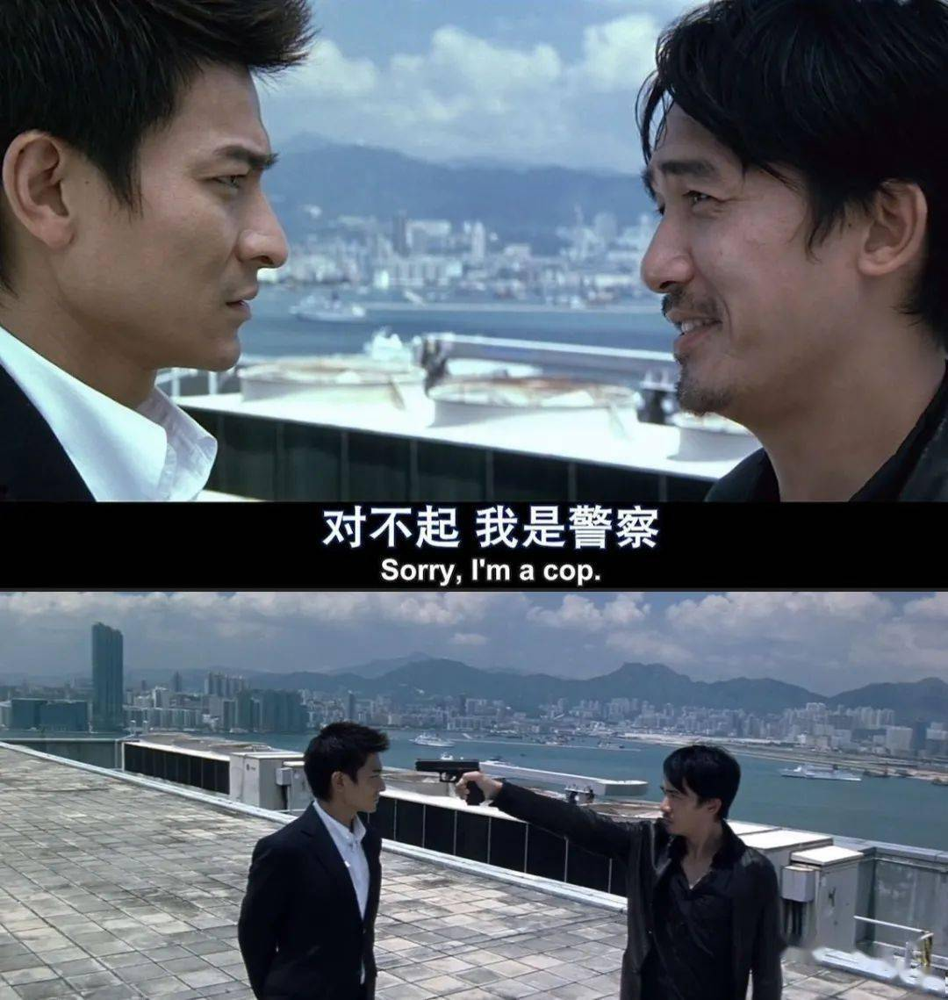
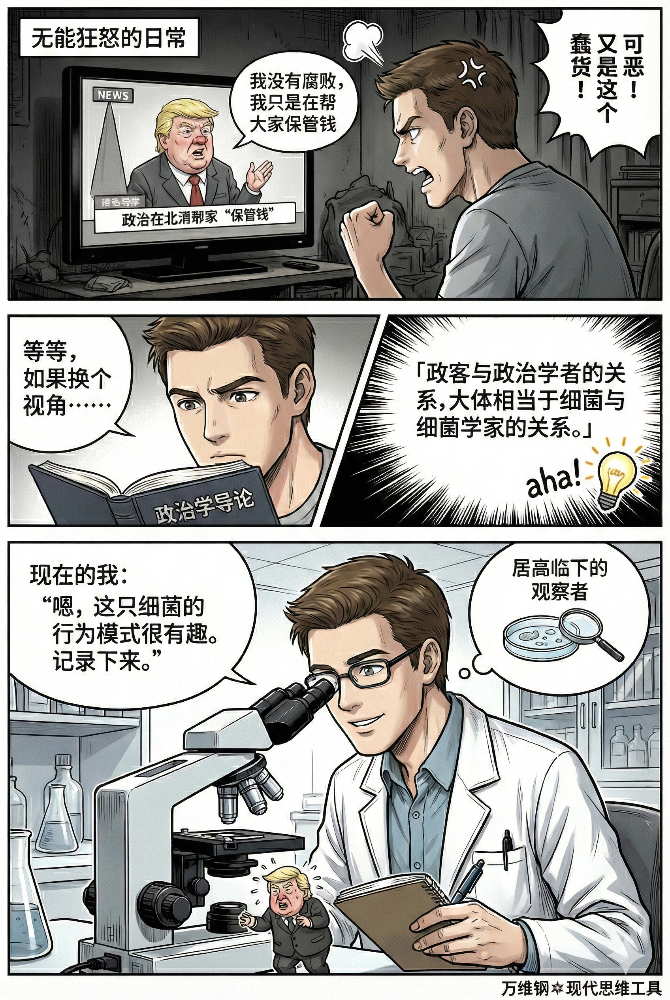

# 身份认同：元认知黑魔法（得到课程讲稿 + AI 加工段）

# 身份认同：元认知黑魔法

 [身份认同：元认知黑魔法](https://www.dedao.cn/course/article?id=92GB1my8okM5VMnwEyJWgNnEe4Z73r)

<cite doc-id="Ynfbw6em6i7ZZFkwn38ce3UXnEU" file-type="wiki" title="身份认同" type="doc"></cite>

<cite doc-id="WyGNwsoA0iLdBmktN60c5Pqqnne" file-type="wiki" title="Dan Koe：2026改变自己的一日行动指南" type="doc"></cite>

一个武器级的元认知思维工具。它有一定的危险性，好人当然可以用它促成合作，但坏人也能用它操弄人心……所以我想确保你先得到它。

这个工具叫「 身份认同 （Identity）」，就是「我是谁」，也可以说是「人设」，往深了说则是「对人的定义权」。

你有很多种身份，包括职业、阶层、性别、地域、信仰、阵营等等。而身份认同，则是你对某个身份产生了归属感，以至于自动想要做符合这个身份的事儿，捍卫这个身份的形象，团结符合这个身份的人。

我是老师 → 学生出了事儿我就得负责；

我是科学家 → 我下结论就得讲证据；

我是某队球迷 → 你骂球队就等于骂我；

我是“讲义气的人” → 朋友找我帮忙我就不能拒绝……

世界太乱信息太多利弊太复杂，而我是个简单的人。所以我直接问：像我这样的人，在这种情况下应该怎么做？

身份认同不但给你归属感，而且给你连贯感、可预测性和自豪感，还往往能促成同一群体内部的合作。但它有一个副作用：它天然带刚性。你把某个身份当成“我”，你就很难修改它，你就会被这个身份所驱使。

可是如果你把身份当成“我用的”，你就可以驾驭它。

先看一个最基本的用法。

上世纪 80 年代，美国德克萨斯州的高速公路垃圾问题很严重。州政府想了各种办法，又是罚款又是宣传完全没用。调查发现乱扔垃圾的主力军是 18 到 35 岁的年轻男性，开着皮卡听着重金属以反叛为荣。你说爱护环境他们说那是娘炮；你说禁止乱扔他们反而产生逆反心理变本加厉。

结果有一家广告公司想出了一句绝世文案，请橄榄球星和蓝调歌手出镜拍摄，在电视台反复播放，竟然把问题解决了。那句话至今都是德州人的宣言：“Don't mess with Texas.”（别惹德克萨斯。）

这不是说教，这是在定义身份。这句话的潜台词是真正的德州纯爷们儿是不会让别人把自家地盘弄脏的 —— 谁敢把德州弄脏，谁就是看不起我们德州人。它把“不乱扔垃圾”这个行为的定性，从“听政府的话”变成了“维护德州硬汉的尊严”。

然后红脖子青年就变成了环保先锋，不但自己不扔，还盯着别人不让扔。德州公路垃圾短短几年减少了 72%。

这是对身份叙事的重构。旧叙事是“乱扔垃圾=叛逆很酷”，新叙事是“乱扔垃圾=侮辱自家地盘不酷”。

改变一个人的行为的好办法，是改变他对“自己是什么人”的理解。这里还有个更深的洞见：你其实可以定义别人的身份。

当然你更可以定义自己的身份。詹姆斯·克利尔（James Clear）在畅销书《掌控习惯》（ *Atomic Habits* , 2018）中提出，改变习惯最好的办法不是靠意志力，而是建立一个新的身份认同 ——

我从此是个健康的人，所以我跟那些胖子就不一样，我这么酷的人就得天天去健身。我不是努力戒烟，我是一个“不抽烟的人”。

你想想身边是不是有很多诉诸身份认同的例子：

\- “你是不是男人？”

\- “是中国人就转！”

\- “对不起，我是警察。”

**身份认同能带给你无穷的力量，绝对是一种底层操作代码。但它也是人群和人群冲突的源泉。**

法国人类学家马塞尔·莫斯（Marcel Mauss）有个理论叫「**文化是拒绝的结构**（structures of refusal）」，说距离很近、各方面条件都非常相似的两群人，会很刻意地对立起来：因为你们是那样，那我们就必须是这样，反正我们跟你们不一样。世界各地都有这个现象：你最恨的往往不是远方的异族人，而是身边那群故意不跟你一个身份认同的人。

政治学家弗朗西斯·福山（Francis Fukuyama）2018 年出了本书叫《身份政治》，说现代社会很多冲突并不是利益分配的问题，而是“被承认不足”的问题 —— 人们愤怒和怨恨不是因为穷，而是因为觉得自己所属的群体不被看见、不被尊重。这个理论对当今美国的政治局面有很强的解释力，你想想为什么特朗普的政策明明对富人更有利对穷人不利，却有那么多穷人非得支持特朗普呢？

这是一种原始部落思维。极端情况下，有些人会把某个身份跟自己融合在一起，你批评那个身份群体的任何现象都是在侮辱他个人。你看今天互联网上的争论是不是越来越像宗教战争。

**我们的目标是主动运用身份认同而不被身份所用。**哈佛大学心理学家罗伯特·凯根（Robert Kegan）有个成人心智发展理论（Constructive-Developmental Theory）对你会很有帮助，这可能是理解身份认同最强的框架。凯根把人的心智成长分解为五个阶段 ——

第一阶段叫「 **冲动心智** （Impulsive Mind）」，是婴幼儿式的想干什么就干什么，眼里只有自己没有别人。

第二阶段叫「 **帝王心智** （Imperial Mind）」或者「 **工具心智** （Instrumental Mind）」，能看见别人但是以自我利益为中心，把别人都当工具人，只知道威逼利诱，属于少年儿童心智。

人真正成熟是从第三阶段开始，身份认同也是在这个时候介入的，叫「 **社会化心智** （Socialized Mind）」：你的行为不再只是出于本能冲动和利益算计，而更多地是为了扮演好自己在社会中的角色。为什么努力工作？因为你想做个“好员工”；为什么结婚生子？因为你想做个“好儿女”。周围人的期望、社会的规范决定了你的身份，你的身份决定了你的行为。

这听起来很体面，但是容易内耗。如果工作特别忙没时间照顾孩子，你是当“好员工”，还是当“好母亲”呢？如果干什么都是为了外界的期许，你的主权个体又在哪里呢？苏东坡说「长恨此身非我有，何时忘却营营」，说的就是这种内耗。

那么你需要升级到第四阶段，「 **自我授权心智** （Self-Authoring Mind）」。你们想让我是谁我不在乎，重要的是我自己想做个什么人 —— 这不是要回到冲动和工具心智，你仍然需要稳定的身份，但你可以自己定义自己的身份。为此你需要设定自己的价值观和原则。

第四阶段是现代社会对领导者的要求。你不能只会做题，你得会出题。你可以\*拥有\*关系，而不是\*被关系拥有\*。

第五阶段叫「 **自我转化心智** （Self-Transforming Mind）」，意思是你不但能设定价值观和原则，而且能主动反思那些价值观和原则，你能意识到自身身份认同的局限性。你不再和某套原则、某个立场、某个叙事完全粘连；你可以带着它工作，但也能站出来审视它。

如果说第四阶段是\*拥有\*自我，第五阶段就是\*看穿\*自我。你认识到任何单一的身份都是局限的，所以你能够拥抱矛盾，能协调各种各样的人和事，不断重塑自己。

咱们来一个例子。比如在公司一次例会上，同事小李把其实主要是你做的一个方案当成自己的成果汇报了；老板当场表扬小李，小李也没纠正。会后，老板私下问你一句：“小李这次表现不错，你怎么看？”请问你如何回答 ——

冲动心智会立即暴怒：那明明是我做的他怎么抢功呢？你当老板的怎么这都看不出来呢？

工具心智讲利益交换，知道没必要怼老板：方案其实是我做的，有奖励应该归我，不然下次我不做了。

社会化心智寻求关系和认可，心想自己毕竟是资深员工，别破坏团结，所以宁可受点委屈也要把话说得委婉一点：小李很努力，我也给了支持，是团队一起完成的。

自我授权心智强调原则，我这个人做事不含糊必须清晰列举事实，你是老板你可以决策但我得较这个真儿：核心方案是我提出和实现的，小李主要负责呈现和协调。

而自我转化心智，则是能从更高的视野考虑问题，比如想想怎么帮公司迭代升级：事实就是这样，我们没必要因为这个事儿伤害协作，但是我建议公司搞个署名规则。

凯根的研究发现，成年人之中，有 6% 停留在第二阶段工具心智，58% 属于第三阶段社会化心智，35% 到达第四阶段自我授权心智，而只有 1% 达到了第五阶段自我转化心智。

**也就是说，绝大多数人都是被身份认同所束缚的。我想让你达到第五阶段，成为 1%。**

为此你需要一个心智升级心法，也是凯根提出来的，叫 「主体-客体转化（subject–object shift）」  。

主体（subject），是你与之融合、无法察觉、无法反思的东西；你是它，所以被它控制。

客体（object），是你能外化、观察、反思、控制的东西；你俯视它，所以能操作它。

低水平心智是把身份认同当做自己的主体，高水平心智则能把身份作为客体。

你不再“就是”某个身份，你只是“正在调用”某个身份。你从在每个特定场景中只能扮演一个身份，变成随时可以在多个身份中切换。你的身份从主体滑落为客体，你就从角色变成了导演。

联系到咱们前面讲的「三个自我」模型，高水平心智就是要把「界面自我」和「内核自我」分离。你的内核不变，但你可以根据需要随时加载不同的身份。

**而我要说的黑魔法，则是不但随时设定自己的身份，而且还要设定别人的身份。**

比如你整天看新闻，看到有的官员腐败无能，说话办事非常愚蠢，你就很难过，可是你又什么都做不了，于是陷入无能狂怒。怎么才能让这个场景更有建设性一点呢？

你之所以痛苦，是因为你把自己当成了国家的一个拥有者，把官员当成了父母官。这种定位根本帮不了你。如果你换一套身份认同，把官员就当成是个普通政客，把自己当成一个政治学者呢？用一本流行政治学教材里的话说：

「政客（politician）与政治学者（political scientist）的关系，大体相当于细菌（bacteria）与细菌学家（bacteriologist）的关系。」

这你不就释然了吗？现在你的视角居高临下：你不但根本不期待官员能办什么好事儿，而且还会很好奇他们的行为规律是什么。那么你看新闻就不但不愤怒，而且有收获。

再比如你在生活中遇到一个不可理喻的杠精，如果你当自己是辩论手，对方是平等的对手，你就会越辩越气，最后只能来一句“你这人怎么这样”。可是如果你换一个叙事，把自己当成昆虫学家，把对方当成一只罕见的甲虫，正在对着你张牙舞爪喷射毒液发出刺耳的噪音，你会试图证明他是错的吗？你的自尊心会受挫吗？

你只会感到兴奋和好奇。

这个魔法最厉害的用法，就是剥离对方的主体性，将其“非人格化”。

哲学家丹尼尔·丹尼特（Daniel Dennett）有个理论，说我们理解一个事物的行为有三种解释层级，也叫三种立场：

1. **意向立场 （Intentional Stance）**：把对方当作有信念、有欲望、有意图的主体，也就是一个人。
2. **设计立场 （Design Stance）**：把对方当成一个被设计的机器或者程序。比如你对电脑死机不会生气，你会想“是内存溢出了”。
3. **物理立场 （Physical Stance）**：把对方当成一个简单物体。比如石头掉下来砸到你，你不会怪石头坏。

**那个事物具体是什么不重要，重要的是哪个立场对它的行为最有预测力。**丹尼特理论的本意是我们把人当“人”只不过是大脑的一种方便立场而已，但你可以把这个理论倒过来用：对某些人采取设计立场甚至物理立场！

比如淘宝商家客服跟你说套话，你就与其当他是个具体的人在故意刁难你，不如把他当成一个只会输出默认回复的脚本。

老师面对顶嘴的学生，如果用意向立场把他当“冒犯者”，你就会对抗；只有用设计立场把他当做“正在学习自我控制的未完成大脑”，你才能心平气和地应对。

医生在急诊室面对醉酒闹事的人，如果用意向立场说“你怎么这么不讲理”，你就会被拖进情绪泥潭；用设计立场，“这是一个成瘾+压力+冲动系统在运行”，能更准确地描写这个局面；但是如果你时间紧迫，使用物理立场只看伤势不看人才是最高效的做法。

有时候切换身份是更大的真诚，有时候不把对方当人看才是真正的慈悲。

大多数人的身份认同像皮肤，碰一下就疼，因为那是长在身上的；而高阶玩家的身份认同像衣服，到什么场合穿什么款式，回家了就脱下来挂在门口。

我的忠告是要防止被这个黑魔法反噬 —— 切换身份不是见人说人话见鬼说鬼话，身份只是界面，而你的内核自我必须稳定。

否则你会进入一种危险的虚无：什么都能理解，什么都不再相信；什么都能切换，什么都不再负责。

黑魔法的最高境界不是冷酷，而是“入戏但不沉迷”—— 你可以在行为上完美表现，但内心保持观察者视角；你可以全情投入每个角色，又随时准备在落幕后干干净净地做回你自己。

---

这篇文章深刻剖析了“身份认同”作为一种元认知工具的底层逻辑和高级用法。

### 1. 身份的本质：从“皮肤”到“衣服”（认知重构）

- **身份是底层操作代码：** 身份认同能带来归属感、连贯性和力量。改变一个人行为最高效的方法，不是说教或利益交换，而是**改变他对自己“是什么人”的定义**（例如：不乱扔垃圾不是因为听话，而是因为要维护德州硬汉的尊严）。
- **从“被驱使”到“去驾驭”：** 绝大多数人将身份认同视作“皮肤”（主体），与自我深度绑定，一旦身份受到批评就视同个人受到侮辱，从而引发无谓的部落式冲突；而高阶玩家将身份视作“衣服”（客体），根据不同场景穿脱，身份只是他们达成目的的界面。

### 2. 心智的跃迁：主体-客体转化（升级路径）

根据凯根的成人心智发展理论，真正的高手需要跃迁至**第五阶段（自我转化心智）**，其核心心法是**“主体-客体转化（Subject-Object Shift）”**：

- **主体（被控）：**当你“就是”某个身份时，你无法察觉它，只能被它裹挟、引发内耗。
- **客体（掌控）：**当你意识到自己“正在调用”某个身份时，身份就从主体滑落为客体。你能俯视它、反思它、随时切换它，从而从“剧中角色”变成了“操盘导演”。

### 3. “黑魔法”的核心用法：非人格化与降维视角（实操武器）

这是本文最具颠覆性的洞见——不仅能随意设定自己的身份，更能主动设定别人（甚至万事万物）的身份，以实现情绪抽离和问题解决。

- **切换解释层级（丹尼特的三种立场）：**面对不可理喻的人或事，主动**剥离对方的主体性**，停止把对方当“人”（意向立场）。
- **降维打击：**把杠精当成正在喷射毒液的罕见甲虫（昆虫学家视角），把糟糕的政客当成细菌（政治学者视角），把刁难的客服或闹事者当成一段“默认脚本”或“失控程序”（设计立场/物理立场）。
- **效果：**通过这种“非人格化”的降维设定，你将彻底免于自尊受挫和情绪泥潭，将无能狂怒转化为纯粹的好奇心、高效的观察力与解决问题的行动力。

### 4. 终极警告：入戏但不沉迷（黑魔法的反噬与防御）

- **分离界面与内核：**把人当工具、把身份当面具的危险在于容易陷入虚无主义——什么都能切换，什么都不再相信。
- **稳定内核自我：**真正的最高境界不是冷酷无情或见风使舵，而是**“界面自我”千变万化，“内核自我”岿然不动**。在行为上全情投入每一个角色，在内心中始终保持清醒的观察者视角，随时准备落幕后干干净净地做回自己。

顶级的心智模式，是看穿“身份认同”的虚妄性，将其从掌控自我的“主人”，降级为可随时调用、随意定义的“工具”，从而在复杂世界中获得绝对的情绪自由与行动力。

---

身处困境（失业、破产、陷入低谷、被边缘化等）的普通人，往往承受着巨大的心理压力。这种压力很大一部分并不来自于物质匮乏，而是来自于**“身份认同的坍塌”**（比如“我曾经是个受尊重的人，现在我是个失败者”）。

将这套“元认知黑魔法”应用到普通人的逆境求生中，可以说是极其强大的**“心理防弹衣”和“破局工具”**。以下是为你提炼的四个自救启示：

### 1. 撕下“失败者”的标签，重构你的“触底叙事”

困境中最危险的不是没钱或没机会，而是你把“失败”内化成了你的主体身份（即：我认为“我就是一个没用的人”）。

- **启示：**像改变德州乱扔垃圾的青年一样，改变你对自己的定义。不要用“失业者”、“负债者”、“弃子”来定义自己，这会让你自动做出符合这些低能量身份的行为（如颓废、自卑、退缩）。
- **实操：**主动给自己设定一个有力量的新身份。比如：**“我不是一个破产的失败者，我是一个正在打逆风局的战略家。”** 或者 **“我是一个正在收集底层素材的体验者。”** 一旦你转换了身份叙事，你当下的忍辱负重就不再是“丢人”，而是“主角逆袭前的蛰伏”，你的行为模式会瞬间从被动挨打变成主动筹谋。

### 2. 把“困境”变成客体，拔掉情绪内耗的插头

身处困境时，普通人极易陷入“冲动心智”或“社会化心智”，每天都在问：“老天为什么对我这么不公平？”“别人会怎么看我？”这会耗尽你仅存的能量。

- **启示：**运用“主体-客体转化”心法。不要“成为”那个正在受苦的人，而是“观察”那个正在受苦的人。
- **实操：**想象你的灵魂飘到了天花板上，低头看着那个焦头烂额的自己。告诉自己：“**我并不是这个困境本身，我只是正在‘调用’一个遇到麻烦的角色。**” 当你把麻烦当成一个需要处理的“客体（Object）”时，你就从“受害者”变成了“解题人”。情绪剥离后，你才能看清哪里还有资源，哪里可以突围。

### 3. 把刁难你的人当成“NPC”，省下力气办正事

人在低谷，往往会遇到人情冷暖，甚至落井下石。如果遇到冷眼、刁难、催收、苛刻的老板，如果你把他们当“人”看（意向立场），你的自尊心会被反复碾压，陷入无能狂怒。

- **启示：**启动丹尼特的“设计立场”或“物理立场”，对他们进行“非人格化”降维处理。
- **实操：** 你不需要跟程序讲理，不需要生机关的气，更不需要去踢石头。你只需要寻找绕过他们、利用他们或关闭他们的方法。不去纠结“他凭什么这么对我”，你就能省下90%的心理能量用于自救。

  - 面试官出言不逊？把他当成一个**“压力测试的自动触发机关”**。
  - 刁难你的领导？把他当成自然界中**“随机掉落的拦路石头”**。

### 4. 穿上“生存服”，保护你的“内核自我”

为了走出困境，普通人可能不得不去做一些以前看不上的工作（比如去送外卖、去求以前看不起的人、去接受一份底薪工作），很多人会因此觉得“尊严扫地”而无法行动。

- **启示：**高阶玩家的身份是“衣服”。为了生存，你要学会随时穿上不同的衣服，但你要清楚，衣服脏了不代表你的灵魂脏了。
- **实操：**把“界面自我”和“内核自我”彻底切分。去求人时，你就穿上“极度谦卑、唾面自干”的界面；去干苦力时，你就穿上“吃苦耐劳、绝缘羞耻”的界面。**告诉自己：“我只是在扮演一个卑微的角色来换取生存资源，这不是真正的我。”** 只要你的“内核自我”（你的长期目标、你的底线思维）保持稳定且清醒，外在的低头和妥协不仅不会摧毁你，反而会成为你极具韧性的证明。

### 总结：破局的终极心法

对于身处困境的普通人而言，这套黑魔法的本质是：**拒绝被环境定义，夺回对自己的“解释权”。**

你现在玩的可能是一个难度极高、开局极差的游戏账号。普通玩家会因为账号太烂而崩溃退游（认命）；而高阶玩家会觉得这只是个游戏机制，他们剥离了虚荣心，冷酷地计算得失，把周围的障碍当成NPC，操作着这个满身泥泞的角色，一步步走出新手村。

**困境不能消灭你，除非你把困境当成了你自己。**

---

中年人的疲惫，往往不是体力上的，而是**心力上的**。

上有老下有小，中间有老板和房贷。你每天在“好员工、好父母、好儿女、好伴侣”这几个沉重的身份中来回撕扯。心力耗尽的真相是：**你把所有的面具都长成了自己的脸（身份作为主体），碰哪一张脸都疼。**

要提升心力和专注力，你必须运用“身份认同”这个黑魔法，将自己升级到“自我转化心智”。**把身份从“皮肤”退化为“衣服”**，在日常中熟练地穿脱。

### 晨间：初始化，设定“内核防御机制”

**痛点：**一睁眼就想到还不完的房贷、今天难搞的会议、磨蹭的孩子，瞬间感到窒息。

**原理：**你一醒来就默认加载了“负重前行的中年人”这个被动身份。

- **行动 1：剥离默认叙事（醒来后的前 5 分钟）。**不要以“某人的下属”或“某人的父母”醒来。对自己念一句咒语启动最高权限：**“我不是这些麻烦本身，我是一个正在打通关游戏的玩家（或操盘手）。今天我要操作这个叫‘我’的躯体，去处理几个关卡。”**

*专注力提升：* 玩家视角会让你产生一种“高高在上的游戏感”，直接切断早晨的焦虑内耗。

### 白天工作区：披上“战甲”

**痛点：** 会议被打断、同事推诿、老板画大饼、客户提无理要求，导致情绪大起大落，根本无法专注做事。

**原理：** 你使用了“意向立场”（把他们当人看），自尊心在疯狂受损。

- **行动 2：进入工作前的“换装仪式”。**在通勤路上或坐到工位的那一刻，明确告诉自己：**“我现在脱下‘自我’，加载‘无情推进器/高级打工人’的身份插件。”** 这个身份的设定是：只看目标，没有情绪，绝缘羞耻感。
- **行动 3：把工作场景“非人格化”（节省 80% 心力）。***心力提升：* 不把工作中的人当“人”，你的自尊心就不会被触碰。没有情绪波动，你就能把所有心力聚焦在“把事办完、拿到工资”上。

  - **面对暴躁或画大饼的老板：** 切换到“野生动物学家”或“程序员”身份。老板不是在骂你，他是“一段正在运行PUA代码的程序”或“一只正在发情期咆哮的银背大猩猩”。你在心里记笔记：“哦，这个触发词会导致他音量变大，有趣。”——你不生气，你只觉得好玩。
  - **面对甩锅的同事：** 把他降维成“物理立场”——他就是一块掉在马路中间的石头。你会对着石头大吼“你为什么在这”吗？不会，你只会想办法绕过他，或者把石头搬走（留存证据、抄送领导）。

### 焦点时刻：物理隔绝，身份收缩

**痛点：**坐在电脑前，脑子里却在想孩子的作业、老人的体检，无法专注。

**原理：**身份溢出（Identity Bleed）。你的“父母身份”入侵了你的“员工界面”。

- **行动 4：使用“结界法”强制收缩身份（每次 45 分钟）。**

设定一个绝对专注的时间块。在这个时间段内，重新定义一切：

- **我：**是一台没有感情的文本/代码生成机器。
- **手机：**（物理立场）它现在只是一块由玻璃和金属组成的、不会发光的砖头。
- **外界声音：**（物理立场）只是空气震动产生的白噪音。

在这个结界里，你不欠任何人钱，你没有孩子，你也没有过去和未来。你只有眼前的屏幕。

*专注力提升：* 斩断所有身份带来的额外联想，专注力自然就回来了。

### 晚间家庭区：脱下战袍

**痛点：** 把工作中的戾气带回家，或者面对辅导孩子作业时的鸡飞狗跳，心跳加速，血压飙升。

**原理：** 穿着铠甲拥抱家人，或者把孩子当成一个“故意气我”的平等对手。

- **行动 5：物理与心理的“除尘门”。**下班进家门前，在车里或楼道里停留 1 分钟。深呼吸，做个脱衣服的动作，默念：**“‘员工’身份已卸载，现在加载‘陪伴者/观察者’身份。”**
- **行动 6：辅导作业的“设计立场”应用。**孩子写作业磨蹭、犯低级错误时，绝不要用“意向立场”（他是不是在故意挑衅我？他以后考不上大学怎么办？）。立刻切换为“设计立场”：**“我面前的不是一个顽劣的坏孩子，而是一个前额叶皮层发育不完全、注意力控制脚本经常闪退的未成年碳基生物。我的任务是帮他修复Bug，而不是对着一台卡顿的电脑发脾气。”**

*心力提升：* 这种视角的切换，是中年父母保命的绝招，它能瞬间浇灭你的怒火，用技术性手段解决家庭矛盾。

### 深夜：属于那 1% 的“自我转化”时刻

**痛点：** 熬夜报复性刷手机，第二天更累。因为白天都给了别人，只有半夜觉得时间是自己的。

**原理：** 你的“内核自我”在极度饥渴，试图用低级刺激（短视频）来补偿。

- **行动 7：每天 20 分钟的“剥离冥想”（洗净所有界面）。**

关掉手机，找个安静的角落。一件件脱下你今天的身份：

“我现在不是谁的父亲/母亲。”

“我现在不是谁的下属/老板。”

“我现在不是谁的丈夫/妻子。”

“我甚至不是一个欠房贷的中年人。”

“我只是一个存在于宇宙某个角落、正在呼吸的生命体。我不附着于任何事物之上。”

在这 20 分钟里，不要计划明天，不要反省今天。纯粹地做回那个空无一物的“内核自我”。

### 总结：中年人的终极心法

中年人的困境，是一个**“无限责任公司”的困境。你以为你需要更强的意志力来扛起这一切，错了。你需要的是“随时抽离的冷酷”和“看穿剧情的清醒”**。

**咒语：**

一切身份皆为我所用，一切角色皆可穿脱。

入戏时我雷厉风行、尽职尽责；

出戏时我高高在上、绝缘万物。

世间万物的嘈杂，不过是NPC在走程序，而我，是来通关的。
