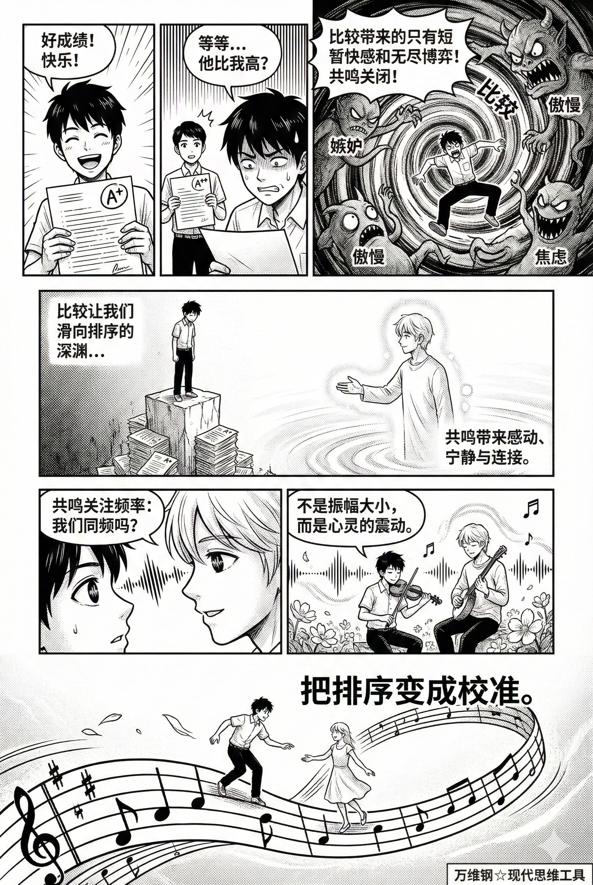
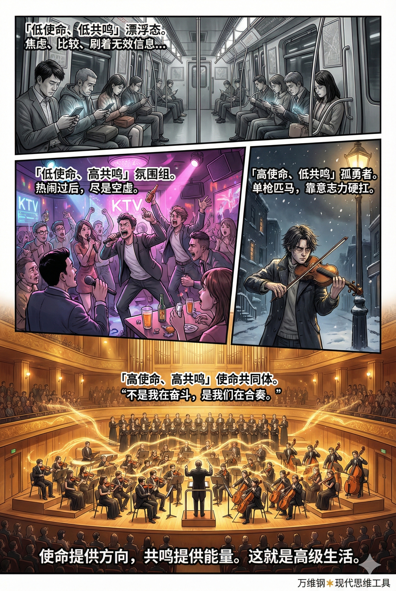

# 共鸣：高级生活的秘密（得到课程讲稿 + AI 加工段）

# 共鸣：高级生活的秘密

[共鸣：高级生活的秘密](https://www.dedao.cn/course/article?id=e1k8gp2WGMzqJ3mobqK5YmP6DOjxAL)

这是个人成长战略板块的最后一讲，咱们说一说人生的长程战略：**怎样过好这一生。**

现代世界有一套很励志的人生脚本：努力读书，考上好大学，找个好工作，升职加薪，财富自由以及获得权力和地位。多数人沉溺其中，很多人感慨自己没有跟上节奏，但也有一些人会问，然后呢？然后你终于可以过上安逸、自由的生活？那我为什么不现在就过那样的生活？

努力叙事的根本困境是「享乐适应（hedonic adaptation）」。就算你在一次次的竞争中赢了对手，收获更好的头衔住进更大的房子，你也只会暂时感觉很好。过不了多久，你就会觉得这些不过如此。然后你发现有那么多人比你更有钱，有比你更大的头衔，住着比你更大的房子……你还是不快乐。

那我何必追名逐利呢？我为什么不一开始就退出竞争，踏踏实实做自己呢？这正是现在越来越流行的人生观，与其追求绚烂，不如回归平淡。

对这个问题的正确答案只有一个：你之所以应该拒绝躺平，是因为躺平不高级，是因为你要追求「something bigger than yourself」。高级人生必定有一个「Purpose」，中文称为「使命」或者「目的」。

使命能给你一个身份认同，使命让你在两难时刻知道如何做出选择，使命让你的人生有意义，使命还能让人长寿……但是这些说法可能会让你有一种悲壮的感觉，似乎使命只是讲奉献而不能带来快乐。

一个很新的思维工具，叫「 **共鸣 （Resonance / Resonanz）**」。它是使命的必要陪伴，它能解决快乐问题。

这是德国社会学家哈特穆特·罗萨（Hartmut Rosa，1965—）在 2010 年代中后期提出的一个理论，目前还没有在学术圈以外流行，但我认为其必成经典。罗萨说，**现代人所有的努力，都是在追求三个A —— Available（可见/可得）、Accessible（可触达）和 Attainable（可控/可利用）。**比如外卖把餐馆变成可得，手机地图把城市变成可达，AI 把知识变成可控。

这些都很好，但这里有个副作用。三个A让我们把世界当做了“资源” —— 你是主体，它只是被你利用的客体 —— 那你就很难把世界当“对话者（dialogue partner）”了。

你只是在用那些东西，而那些东西对你并没有什么回应，这就导致了「异化（alienation）」。罗萨说的异化就是缺乏回应性的相处，你与世界没有有意义的内在连接，你们是一种没有真正关系的关系。

就如同你的网盘里存了几个T的电影，那些电影不会主动跟你说话，所以存得越多，你反而越孤独。你对世界的控制范围很大，但世界对你是沉默的。又如同夫妻二人坐在高档餐厅里，可是各自刷手机无话可说。

空虚不是没有内容，而是没有回响。

为了对抗异化，你需要共鸣。共鸣就是独立主体之间发生共振。你有动作，别人有回应，所以你感到温暖。

比如摇滚乐演出现场。台上乐队在演唱，你在台下和几千个观众一起嘶吼、跳跃，几乎是一种宗教体验。你忘了房贷忘了KPI，只感到巨大的能量穿过身体。你融入了一个更大的场域，你已经不仅仅是你。

那你说，我找几个下属，我发个朋友圈他们就点赞，我说一句话他们就附和，我一呼百应。这是不是就是共鸣？不是。共鸣可不是简单的回声。

比如你学打鼓。一开始你天天独自对着节拍器练，越练越准，但这似乎没什么意思，你感到空虚。如果旁边有个回声器，你打一下它就立即给你同样的一声，你会感觉好一些吗？当然也不会。

共鸣，是你去酒吧跟一支小乐队即兴演奏。贝斯手有时候会抢拍，钢琴手会故意留白，歌手偶尔改个旋律。那么你作为鼓手也不能中规中矩只知道追求精确节奏，你得回应他们，你们用音乐对话，共同生成一首歌。

你演了一晚上也不觉得累，掌声少也无所谓，因为你听见音乐在对你说话。

共鸣，就是你不再只是输出，而是在接通一个回路。

共鸣不只发生在人与人之间。罗萨把共鸣分成了三个维度 ——

- **「 横向共鸣 （Horizontal Resonance）」发生在人与人之间。**我看见了你，你也看见了我。最好的聊天是聊完之后两人都变了，共鸣让你们在对话中产生了第三个东西。
- **「 斜向共鸣 （Diagonal Resonance）」发生在人与物、人与工作之间。**木匠顺着纹理雕刻木头，他能感到木头在回应他。如果一个会计能从报表中看出公司运营的律动和危机，我们是不是可以说她感受到了数字的生命呢？
- **「 纵向共鸣 （Vertical Resonance）」则是人与宏大存在之间的共鸣。**想象牛顿发现万有引力定律的那一瞬间，你站在雪山脚下那个敬畏感。

罗萨的理论说白了就是美好生活不是占有更多的资源，而是建立更多的共鸣。

**共鸣的反义词是「比较（Comparison）」。** 比较就是看看咱俩谁赢了谁。一旦你开始比较，共鸣就关闭了。为什么取得好成绩之后的快乐总是短暂的？因为你会跟成绩更好的人比较。

比较其实不总是坏事，我们需要通过比较来校准，但比较太容易滑向排序，人一下子就被拽进零和的地位博弈。比较常常带来嫉妒、傲慢、焦虑和短暂的快感，而共鸣带来感动、宁静、连接感和深层的意义。

比较关注振幅：我做得比别人大吗？响吗？强吗？而共鸣关注频率：我和谁同频？比较让你失去朋友，共鸣帮你寻找朋友。

共鸣是一种基本心理需求。我们前面讲过「自我决定理论」，说人要有能动性，有三大基本需求必须满足：自主感、胜任感和关系感 —— 这个关系感提供的主要价值就是共鸣。

共鸣还是自我的扩张。当你与他人形成强烈共鸣的时候，比如你们有共同的目标，互相协作、彼此改变，你大脑中处理“自我”的区域就会发生功能性的重组 —— 以至于你对他人的表征会纳入对“自我”的表征中。

换句话说，共鸣让他人成了你的一部分，共鸣扩大了你的自我。为什么不躺平？因为躺平的“我”太小了。

这就是那些了不起的人物的高级生活的秘密：他们之所以无怨无悔地追求人生使命，是因为他们其实很快乐！他们的使命伴随着共鸣。共鸣让利他自动变成了利己，享乐适应自然就失效了 —— 你的自我变大了，原本只能容纳一杯水的快乐，现在能容纳一片海。

使命是我要去哪里，共鸣是我不是一个人去。

但并不是所有的使命都伴随着共鸣 ——

**「高使命、高共鸣」** ，是使命共同体，团结而又有韧性。不是“我在奋斗”，而是“我们在合奏”。你能承受代价因为你听得见回声。这就是高级生活。

**「高使命、低共鸣」** ，是孤勇者，容易自我消耗。你以为你在做了不起的事，但你是单枪匹马，没人支持，只能靠意志力硬扛。你需要寻找同伴，你需要积极的反馈。

**「低使命、高共鸣」** ，是氛围组。一群人凑在一起很热闹，但是热情来得快去得也快。有同频但没有方向，热闹之后是空虚。

**「低使命、低共鸣」** ，则是我们前面说的那个「漂流」状态，最容易焦虑、嫉妒、刷刺激。人人内卷又互相比较，把努力当止痛片，社交只是图个热闹……

使命提供方向，共鸣提供能量，这就是为什么有句话叫「一个人走得快，一群人走得远。」远大志向不是空喊口号也不是跟风车作战，而是你跟世界签了一个对等契约：你有输出，世界有反馈。

那怎样才能获得共鸣呢？罗萨给出了形成共鸣的四个条件。

**第一是「被触动（being affected / affection）」。** 你得允许某个外部的东西刺破你的防御，进入你的内心。现代人都有点防御性冷漠，为了显得专业、理智、成熟而把自己包裹在厚厚的壳里，刷短视频是冷眼旁观，看新闻是吃瓜心态。如果你的心太硬，共鸣就不可能发生。你得有点脆弱感。

**第二是「能回应、有效能（response + self-efficacy）」。** 光被感动不行，你得有反应。共鸣是我被触动了，然后我拿起吉他回应；我被这个难题困扰了，然后我开始思考解决方案。

**第三是「会转化（transformation）」。** 你得能被这场交互改变。读完一本书不能只是打卡说“已读”，得是你对某个问题的看法被彻底改变了才好。共鸣应该让旧的你死去，新的你诞生。

**第四是「不完全可控（uncontrollability / Unverfügbarkeit）」。** 共鸣是不可策划、不可强求、不可购买的。你可以买最贵的钢琴、请最好的老师、通过最刻苦的练习，但你无法保证弹琴时能进入那种天人合一的境界。你可以花钱带全家去最豪华的度假村，但你无法保证那天晚上家人会有一场深入灵魂的对话而不是各自玩手机。

共鸣需要一点不可控，我看这是罗萨这个学说里最妙的地方。保留不可控不是为了允许惊喜，而是为了保证对方真的是“对方”，而不是你自恋的回音壁。因为当你完全控制一个事物时，它就失去了「他者性（otherness）」，它变成了你意志的延伸，而人是没法跟自己的手脚对话的。

罗萨的说法是共鸣必须保留他者的独立反作用力，否则你面对的只是可支配对象：被支配者只能“执行”，而“执行”不是“回应”。共鸣需要一点阻抗。

这就如同你伴随着现场乐队演出的音乐跳舞。不是你带着音乐走，而是音乐有自身的想法，它有时候也带着你。你既是主动的，又是被动的。共鸣不是你做什么，也不是乐队做什么，而是你和乐队之间发生了什么。

如果暂时还没找到使命，我们至少可以把生活中的各种「比较」叙事重构成共鸣。

比如看到同事取得了好成绩，你与其说当年他成绩还不如我怎么现在超过我了，关心振幅，不如研究频率：他做对了什么？也许你可以问问他：“你做这个项目最爽的时刻是什么？”你们能聊出点真东西，他的成功就变成了你们共同的经验。

再比如你自己取得了了不起的成就，那与其炫耀，不如分享。

一个是分享这个过程中的脆弱和不确定性：“有好几次我都觉得要完蛋了，幸亏老张帮了一把……”“中间我发现自己对市场的理解还有偏差，侥幸结果是好的……”你邀请别人进入你的故事，人们就会共鸣你的挣扎。

另一个是分享经验和资源：“这次升职让我终于能推动XX项目落地！接下来我们会把A流程从7天缩到2小时。我把踩坑和模板整理了一份文档，想一起做的人我发你。”

又比如教育孩子，你与其把他跟别人家孩子比，不如观察他在什么时候眼睛会发光：“这个是你构思的吗？你是怎么想出这个办法的？”……

**把比较改成共鸣，就是从振幅竞赛改成了频率寻找，把零和的地位博弈改成了正和的协调博弈。你立即就从一个索取者变成了一个供给侧的合作者。**

共鸣是瞬间的，我们在生活的大部分时间必须回归平庸。但我们需要在这个异化的世界里保留几个共鸣端口。

我可以列举一大堆科学证据，说明使命和共鸣能让你活得更健康、更长寿：比如有荟萃分析发现使命感越高全因死亡率和心血管事件风险就越低；对日本人长寿的研究表明高使命感 —— 日语叫「Ikigai（生き甲斐，生之意义）」—— 跟长寿正相关；再比如有研究发现广义上的社会共鸣对健康的好处，效果相当于锻炼和饮食之类的常规健康干预 ……

但我们需要使命和共鸣并不只是为了活得更长，更是因为我们想要一个有意义的人生，我们想活得有意思。

现代生活的一个误区是认为世界对你越可控、你执行效率越高、事情越可预测、别人对你越服从，你就越幸福 —— 但**真相是，幸福不是取决于你能得到和控制什么，而是取决于你能贡献和共鸣什么。**

**共鸣要求你允许世界有自己的声音：允许材料顶嘴，允许孩子不听话，允许市场打你的脸，允许一段关系把你带到你没计划的地方。**

因为只有不可控的回应，才是真的。

---

我们拼命把世界变成「可控的资源」，得到的却是沉默和孤独；而真正滋养生命的，是和世界建立一种「有回应的关系」。

我想补充一个它暗示但未展开的关键区别，这可能是理解「共鸣」最微妙的地方。

文中提到，共鸣需要「不完全可控」，因为「当你完全控制一个事物时，它就失去了他者性」。这句话指向了一个很重要的概念：**共鸣的本质，是你愿意让自己被「他者」改变。**

这里「他者」指的是任何一个有独立意志的存在：一个人、一把小提琴、一项工作的内在规律、一座山。你没法完全预测它的反应，它有时会反抗你、让你受挫。但正是这种抵抗和不确定性，让它成为真正的对话者。

这看上去和近几年流行的「心流」体验很像——沉浸其中、忘记时间、自我消失。但两者有一个根本不同：

- **心流**是你单方面地驾驭一个挑战，目标是「掌控感」。
- **共鸣**是你和「他者」相遇，目标是「被改变」。

一个登山者如果只追求「征服这座山」，体验的可能是心流；但如果他站在山脚下感到震撼，在攀登时聆听山传递给他的节奏和敬畏，甚至因此重新认识了自己的渺小——这才是共鸣。心流让你成为更强大的自己，共鸣让你**扩展**自己。

所以，「被触动」和「会转化」这两个条件特别重要。共鸣不是廉价的认同和点赞，不是去找回音壁，而是去接触那些会打你脸、让你意识到自己局限、迫使你做出真正回应的对话者。这可能是一本难读的书、一段冲突频发但坦诚的关系，或者一个要你反复尝试才掌握的技能。

**当下的流行文化里，常见的是「被讨好」：算法猜你喜欢，消费说你值得，社交让你舒服。这些只会缩小自我。共鸣恰恰相反，它要求一种脆弱的勇气——去暴露在那些不能被你消费、扭曲和预判的力量面前。**

从这个角度看，「使命」和「共鸣」的关系可能比文中的四象限模型更具动态性。有时，不是先有使命再有共鸣；而是在一次意外的共鸣中，你被某个「他者」彻底改变，然后才找到了使命。使命，或许是足够深刻的共鸣留下的印记。

当然，共鸣本身不可强求，它是一个瞬间的发生。我们能做的，大概就是保持脆弱、保持回应、保持对「不可控」的尊重，为自己保留几个共鸣的端口。

我很好奇，在你自己的经历里，有没有某个瞬间明确感受到「被回响了」？不一定是宏大时刻，也可能是很日常的事。

---

## 世界的共鸣

你是把「世界」当成一个你要发号施令的对象，还是当成一个和你对话、可能打断你、可能告诉你错了的对象？

“共鸣”并不只是“我喜欢这个”“我被感动了”那么浅。

更深层的共鸣，其实是：

你在世界里，听见了某种对你的回应。

仿佛原本孤立的“自我”，突然和外部世界产生了结构上的连接。

于是你会有一种感觉：

“原来不只是我这样。”

“原来世界某处，也存在同样的东西。”

“原来我的经验，是能够被理解的。”

那一瞬间，人会短暂地从“封闭自我”里出来。

#### 共鸣的本质：结构匹配

为什么一句话，别人听了没感觉，你却突然沉默？

为什么一本书，有人觉得无聊，有人却像被击中？

因为真正产生作用的，不是信息本身，而是你的内部结构，与外部世界发生了映照。像两根频率相同的琴弦。世界轻轻震动一下，你内部也开始振动。

所以：

- 共鸣不是“认同”
- 共鸣不是“同意”
- 共鸣甚至不一定愉快

有时候，最强烈的共鸣，反而来自一句让你难受的话。因为它准确命中了你一直不敢命名的东西。

#### 人为什么渴望共鸣

因为人本质上，害怕“自己的体验无法被世界承接”。

这是一种非常深的孤独。

你经历过痛苦，但没人能理解；

你意识到某种真相，但语言表达不出来；

你隐约感觉自己不属于周围环境，却又无法证明。

于是人会长期处于一种：“我无法被翻译”的状态。

而共鸣的出现，本质上是一种：“你的内部世界，被外部世界成功编码了一次。”

所以人才会突然激动、沉默、落泪。

不是因为那句话多华丽，而是因为：终于有人，替你说出了你说不出的东西。

#### 真正高级的共鸣，不是情绪同步，而是“存在确认”

低级共鸣是：

- “你也喜欢这个！”
- “你也讨厌那个！”
- “我们观点一致！”

这更像群体情绪。

高级共鸣则是：

“你看见了我正在经历的真实。”

“你理解了我无法表达的部分。”

“你让我意识到，我不是孤立存在。”

它甚至不需要完全相同的经历。

有时一本几百年前的书，一句陌生人的话，一段音乐，一个眼神，都会让你产生强烈共鸣。

因为你感受到：“人类内部，存在某种跨时间的共同结构。”

#### 所以为什么“共鸣”会变成一种人生方向

很多人后来真正追求的，已经不是成功，而是“我能否与世界形成真实连接。”

因为没有共鸣的人生，会越来越像“功能运转”。

工作、消费、娱乐、社交……一切都在继续，但内部越来越空。

而共鸣，会重新唤醒“活着的感觉”。

它让人意识到：自己不是一个孤立的大脑，而是正在参与某种更大的存在网络。

某种意义上：成长，就是从“我要控制世界”，慢慢变成：“我开始能听见世界。”
