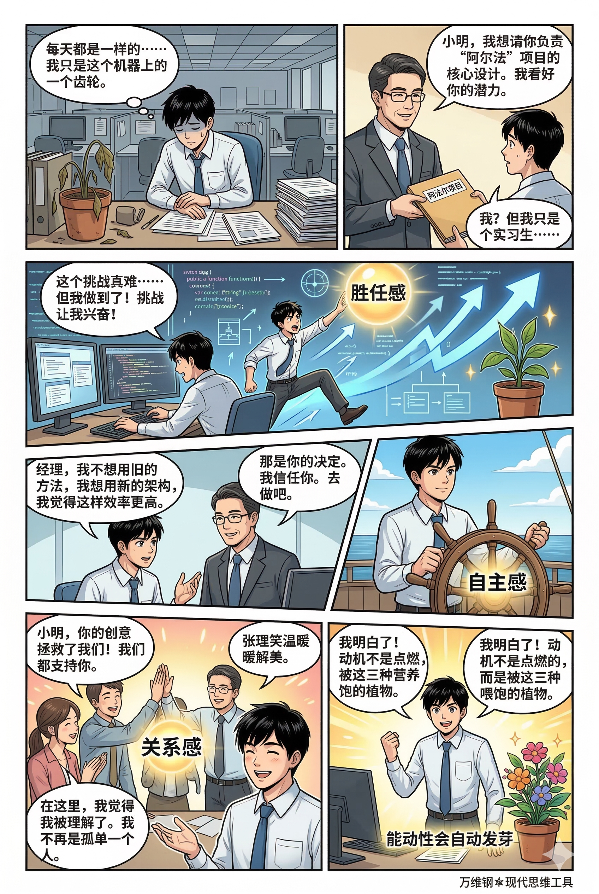
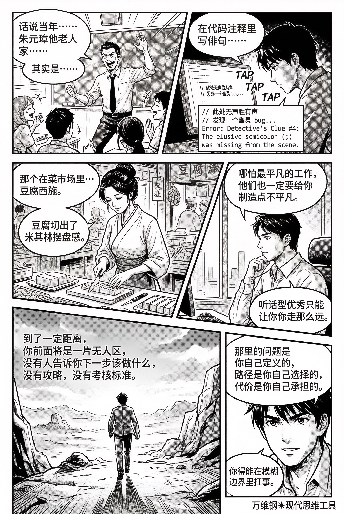

# 自我决定理论：一流人物不可能是痛苦的卷王（得到课程讲稿 + AI 加工段）

# 自我决定理论：一流人物不可能是痛苦的卷王

[自我决定理论：一流人物不可能是痛苦的卷王](https://www.dedao.cn/course/article?id=Q8dpgOa54NZMVzm8ZxKByzxkwYm2Rl)

2026-03-30 07:43

<cite doc-id="M2N7wVjaliW0Efka4I0c14oonJe" file-type="wiki" title="自我决定理论" type="doc"></cite>

老百姓对人才有个特别深的误解，那就是把“听话”当成“优秀”。你留个作业他能按时完成，你出几道题他能做对，你交代的任务他保质保量做好，你让干啥他就干啥你不让干啥他就不干你指向哪里他就打向哪里，你说这就是优秀人才。

那不是人才，那是智能工具。如果他做的什么事儿都是你发起的，真正的人才是你不是他。

听话不是一个特别值钱的品质。我们的教育系统产出了太多听话型人才，有识之士对此早就怨声载道。

我听一个教授说，她面试研究生，问你来学我这个学科，你自己对科研有什么想法？你的学术兴趣是什么？结果对方啥也说不出来。不是紧张，是脑子里真没有。一个外企高管说，中国员工吃苦耐劳也聪明，但就是推一下才动一下，你考核什么他就把什么做得漂亮，可是自己很少主动。

听话型的优秀距离一流人物很远。得有主动发挥，说这个地方不太对我要给改一改，那才是一流人物。

要我做，和我要做，区别在于「能动性（agency）」。能动性高的人能主动发起行动、做决定、对自身行为和环境施加控制：他不只是让生活发生在自己身上，更要塑造生活。

当代很多制度都是按照19世纪工厂的需求设计的，核心是行为主义的胡萝卜加大棒，讲究奖惩、KPI、排名、打卡，让人像驴子一样按照既定路线跑。但动起来不等于活起来，一味地被动会让人越来越倾向于“最低成本合规” —— 这个活儿你挑不出大毛病来，但是没有灵魂。现在很多人上班像上坟、上学像坐牢，都是没有能动性。

怎么才能有能动性？这个工具叫「 **自我决定理论** （Self-Determination Theory, 简称 SDT）」，是心理学家爱德华·德西（Edward Deci）和理查德·瑞安（Richard Ryan）最早在 1980 年代提出的框架，也是过去几十年间心理学关于动机研究的最高成就。

SDT 既不教人励志打鸡血也不劝人自律，因为它知道那些不是真正的能动性。SDT 认为动机质量（quality）比动机强度（quantity）更重要，高质量动机不但能让人愿意长期动下去，而且动得更健康。

还有的心理学家说，你的动机质量取决于你的「控制点（Locus of Control）」在哪里：在外面，你就是被动顺从；在里面，你才是主人。

一流人物一定是自我驱动，是内驱。从外边控制能买来服从，可买不到投入。

要想变被动为主动，人就必须把控制点内化。SDT 认为人的动机从完全没有动机到完全自主之间，有六种类型，构成一个从外控到内控的连续体。你也可以认为这是一个内化的过程，咱们一个一个细说。

**第一层是「无动机（Amotivation）」**：我不动，因为我觉得动也没用。这不是懒，是断电了，是认定了我做不到、这样做没用、这对我没意义。

比如一个中学生本来不是不努力，可是怎么学都学不会，屡战屡败看不到任何进步，那他就可能进入冷漠的瘫痪状态，你怎么说他都不动。这也叫「习得性无助」。

**第二层是「外部调节（External Regulation）」**：我动，是因为你让我动。这就是我们最熟悉的胡萝卜加大棒，是行为主义大师斯金纳（B.F. Skinner）的世界，你有刺激我有回应。

为什么工作？为了钱。为什么不闯红灯？怕罚款。这一层的行为完全由外部奖励、惩罚或强制驱动；只要监控一撤，行为就会停止。你不得不弄一大堆考核指标，但人们还是会偷懒。

**第三层是「内摄调节（Introjected Regulation）」**：我动，是为了不内疚。到达这一层，就算没人监督没有奖励，你也会去好好做一些事情，因为如果不干你就会感到内疚、羞耻或者焦虑。

有的人并不爱父母但也会尽孝，因为他怕愧疚；有的人并不爱运动但是要求自己每天必须健身，因为她有身材焦虑。没有人拿鞭子抽你，是你把那个鞭子长在了心里。但心里的鞭子也是鞭子，所以你会活得非常累，惊人毅力的代价是巨大的内耗。

**第四层是「认同调节（Identified Regulation）」**：我动，是因为我认同它有价值。这是进入能动性的转折点，你开始有自主和选择感（volition）了。

一个人并不喜欢背单词，但他想用外语交流，所以没有考试没有奖励他也愿意背单词。一个医学生很讨厌背药理学，但他有治病救人的职业理想，于是刻苦背。因为是你自选的价值，你没有多少内耗。但因为你并不喜欢这个行为本身，有时候你还是会感到冲突：此刻我真的很想看个中文电视剧，但为了学英语我选择看美剧。

**第五层是「整合调节（Integrated Regulation）」**：我动，因为它就是我的一部分。这是把价值跟身份认同整合在了一起。

我健身不是为了减肥，而是因为我这么酷的人本来就是天天健身的；我走向战场不是因为我不怕死，而是因为我是一个战士。这是詹姆斯·克利尔（James Clear）在《掌控习惯》（Atomic Habits, 2018）一书中最推崇的励志方法。到了这一层你的行为已经高度自主，你会感到非常协调，没有任何内心冲突，甚至充满自豪。

但那还不是最高境界。

**最高境界是第六层，「内在动机（Intrinsic Motivation）」**：我动，因为我爱动。内在动机的动力完全源自活动本身，不需要外部后果。

孩子在沙滩上堆城堡，程序员业余写开源项目，数学家解题，音乐家演奏，对他们来说这些活动本身就是目的，这是纯粹的生命力！你在这一层不但做事毫无阻力充满自发的动力，而且还可能有创造性的、超水平的发挥。你通宵达旦却不知疲倦，你沉浸在创造与探索之中，你忘了时间也忘了自己。我们精英日课专栏常说的「心流」状态，就出现在这一层。

**人最强的不是自律，而是自愿。**一流人物不可能是痛苦的卷王。

现在想起孔子那句话，「知之者不如好之者，好之者不如乐之者」，简直就是很现代的动机理论：

\- “知之者”对应外部和内摄：你知道它重要，但不一定会好好做。

\- “好之者”对应认同和整合：你认可它，你愿意投入。

\- “乐之者”才是内在动机：你干这个事儿是因为你就爱干这个。

当然现实中大量的任务是有意义但不有趣的，不可能全靠内在动机。SDT 并不是让你把所有外在动机都开除，而是让你尽可能把外部任务内化，把控制点往内移。

怎么内移呢？

这是 SDT 的关键洞见：人类有三种与生俱来的基本心理需求。如果你所处的环境能满足这三种需求，你的能动性就会\*自动\*发芽；而如果这三种需求被压制，你的动机就会枯萎。动机不是被点燃的火，而是被喂饱的植物。

这三种心理需求，也可以叫心理营养，是自主感、胜任感和关系感。

**「自主感（Autonomy）」** ，就是你拥有选择权，你的行为是出自你自己的意愿。我上这个班不是因为我\*必须\*上班，而是因为我\*选择\*来你们公司上班。

**「胜任感（Competence）」** ，就是这个事儿对你来说不是那么简单，是个挑战，但是你跳一跳又能够得着，所以你能从中获得正向反馈，你看到了进步，你就觉得有意思。这也是产生心流的必要条件。

**「关系感（Relatedness）」** ，则是被关心、被理解、归属于某个群体的感觉。我们更愿意内化我们有归属感的团体的目标。

SDT 已经积累了四十多年的实验证据，可谓是千锤百炼。最经典的一个研究是创始人德西做的：让两组人玩拼图，一组有奖励，拼完给钱，另一组纯玩。结果发现，对于那些本来就觉得拼图有趣的人，如果你给他发钱作为奖励，他玩拼图的兴趣反而下降了 —— 一旦停止发钱，这些人就不玩了。而那些一开始没拿钱的人，却是继续玩，而且连休息时间都还在玩。

这就是著名的「过度理由效应（Overjustification Effect）」：外部的控制（钱），会挤掉（crowd out）内在的动机 。金钱奖励降低了自主感。

现代脑科学也发现，当人处于自主动机的时候，大脑的多巴胺系统和那些负责深度学习、创造性解决问题的脑区更加活跃；而处于受控动机的时候，大脑更多调用的是负责压力反应和机械执行的区域。简单说，在复杂认知任务中，心情好、感觉自由会让你的脑子转得快。

这就解释了为什么谷歌早年允许工程师用 20% 的时间干自己想干的项目而诞生了 Gmail 和 AdSense。 这也解释了为什么微软日本在 2019 年尝试“做四休三”，缩短工时，给员工更多的自主安排空间，结果生产率反而提升了 40%。

自主感、胜任感和关系感不是文化奢侈品，而是人类基础需求的一部分。

很遗憾这三种需求并没有被写进基本人权。但我们可以想见，缺乏其中任何一项营养，人都不会真的幸福。在你要求别人或者自己“自律！努力！”之前，应该先问问 ——

他有选择权吗？他得到了正向反馈吗？他感到安全和被支持吗？

既然能动性来自自主感、胜任感和关系感的滋养，SDT 的核心操作就是三件事儿 ——

第一，给选择给理由：把任务从“别人要我”翻译成“我为什么认同”；

第二，给挑战给反馈：把任务从“太大”拆分成“我能先赢一小局”；

第三，给连接给支持：把任务从“孤军奋战”变成“有人看见我”。

咱们看两个应用场景。

**场景一：你是管理者、老师或家长**

千万别当控制狂，你必须想办法给人营养，哺育别人的能动性。

首先当你布置一个无聊的任务时，一定要给人解释清楚其中的意义。不要说把这100页文件复印了别问为什么。要说我们下午的客户会议非常关键，这些资料能帮助我们拿下合同，大家都指望你的协助。这就帮助对方从外部调节转化到认同调节。

其次要给选择权。不要说你必须先做数学，再做英语。要说今天的任务是数学和英语，你想先做哪个？你想用什么方式完成？哪怕是微小的选择，也能极大地提升自主感。

然后要给非控制性的反馈。反馈必须是对事不对人。不要说你「真聪明/你真笨！」，评价人就是控制人，因为人会在你的评价体系下患得患失。要说你刚才那个解题思路很有创意，特别是第二步……哪怕他别的思路都不对，他也获得了一点点胜任感。

最后还要给关系认可：我理解你觉得这个很无聊，但我相信你能做好，你对我很重要。

**场景二：你是打工人，而老板是个控制狂**

你不想辞职，那么你就要重构这场叙事。

首先是主动挖掘意义。你做这个事儿不是因为老板让你做，而是你自己的选择。搬砖是为了盖大楼，填Excel表格是为团队决策清洗数据确立真相。尽量把被迫的任务和你的个人长远价值观挂钩。如果这个活儿实在没意义，那就是为了锻炼我的耐心 —— 总比“为了不被老板骂”高级得多。

**关键是你总可以搞「微决策」。在老板看不见的地方，建立自己的秩序。你决定干活儿的节奏和交接的风格。你总可以随口开几句玩笑。你摆的砖有你的美学印记。再不济，你也可以把办公桌布置成你喜欢的样子。**

你还可以把任务游戏化。这件事儿真的很无聊，那你就给自己计时，看能不能比昨天快10分钟？强行植入挑战和反馈可以收获一点胜任感……

快乐的人都是这样的。那个把历史课讲成单口相声的中学老师；那个在代码注释里写俳句、把错误日志写成微型侦探小说的程序员；那个在菜市场里，把两块钱一块的豆腐切出了米其林摆盘感的豆腐西施。哪怕最平凡的工作，他们也一定要给你制造点不平凡。

好消息是，第一流人物也都是这样的。听话型优秀只能让人走那么远。到了一定距离，你前面将是一片无人区，没有人告诉你下一步该做什么，没有攻略，没有考核标准。

那里的问题是你自己定义的，路径是你自己选择的，代价是你自己承担的。你得能在模糊边界里扛事，而不是只在明确流程里跑。

其实自我决定理论只是把人当「人」而已。它只不过发现，当你把控制点内移，活得像个人的时候，你的发挥恰恰也是最好的。

我敢说这是我们这个世界最好的一个性质。真是谢天谢地！不然要像有些人想的那样吃得苦中苦方为人上人，先插自己两刀才能练神功，一流人物都卷得不成人形，那可就太可怕了。

**Gemini 贡献尾声小诗：**

> 莫将听话作良图，忍辱从来非正途。  
> 诱饵悬空驴转磨，心流涌处凤栖梧。  
> 无形鞭影休相逼，自有真元不可沽。  
> 踏破千山因我爱，逍遥极顶笑凡夫。

注释

[7] 这个政策后来被谷歌取消了……我听说是因为有些员工自动卷，把20%从选项变成了必须，等于工作量增加了20%，反而失了本意。

---

### 核心洞见

1. **动机的“质量”决定成就的“高度”。**“听话”和“吃苦耐劳”只是智能工具的特质。一流人物绝不是痛苦的“卷王”，而是具备极高「能动性（Agency）」的人。动机不是靠“打鸡血”点燃的，而是靠心理营养“喂养”出来的。内驱力（我要做）带来的投入度、创造力和持久性，远胜于外驱力（要我做/为了钱）和内耗力（为了不愧疚）。
2. **动机的“六层阶梯”与控制点内移。**人的动机是一个从外控到内控的连续体：**无动机 → 外部调节（图钱/怕罚） → 内摄调节（怕愧疚/焦虑） → 认同调节（认同价值） → 整合调节（融入身份） → 内在动机（纯粹热爱/心流）**。成长的终极目标，是不断将外部任务“内化”，把控制点往自己心里移。
3. **激发能动性的三大底层心理需求。**就像植物需要阳光、水分和土壤，人的能动性自发发芽需要三个条件：

   - **自主感**：我有选择权，这是我自己的意愿。
   - **胜任感**：挑战难度适中，我能看到进步和正向反馈。
   - **关系感**：我感到被理解、被支持、有归属感。
4. **警惕“过度理由效应”。**外部的强控制（如金钱奖励、严密监控）会挤掉内在动机，破坏人的自主感。用胡萝卜加大棒只能买来“最低成本合规”，买不到灵魂和创造力。

---

> 提炼这篇专栏的精彩洞见。 一个陷入深度习得性无助反复被打击的人，环境关系也非常恶劣，处境近乎一个死局。那么如何提升自我效能感呢？
> 
> 不要泛泛说要有信心，要心里有火眼里有光。有什么真正能够触发改变的行动策略吗？

先说一个让人清醒的事实：

习得性无助的核心伤害，不是"你没有能力"，而是**你的大脑学会了相信"做了也没用"**。所以任何喊话式的"你要有信心"都是无效的——因为问题不在信心，在于大脑的因果回路断了。要修的是这个回路，不是情绪。

---

### 真正能触发改变的策略

#### 第一步：把目标缩小到"必赢"

胜任感需要"跳一跳够得着"。但习得性无助的人，跳一跳也够不着，因为目标被打击到根本不想跳。

所以不是"降低目标"，是**降到不可能失败的粒度**。

不是"今天要学完这章"，是"打开书，读第一行"。 不是"整理房间"，是"把这一个杯子放回去"。

这不是心灵鸡汤，是神经科学：大脑的多巴胺回路需要真实的、可验证的"我做了，有结果"信号来重建。再小的事，只要是你**发起的**、**完成的**，就在修复那条断掉的因果回路。

**关键词：自己发起，自己完成，必须能赢。**

---

#### 第二步：从关系感里"借"一点能动性

关系感是三大心理营养之一。但恶劣环境的问题是，关系本身是毒的。

这里有个重要区分：**你不需要从你的恶劣环境里获取关系感，你只需要找到一个人，ta能真实地看见你做了什么。**

可以是陌生人组成的网络社群，可以是一个豆瓣小组，可以是每天在某个论坛打卡的人。不需要深度，不需要亲密，只需要"有人知道我今天做了这件事"。

**见证本身就是一种力量。**孤军奋战最消耗人，不是因为孤独，是因为**没有人反射你存在的意义**。

---

#### 第三步：重建"我是行动发起者"的叙事

习得性无助会扭曲归因：好事发生是运气，坏事发生是我的错，而且是永久的、全面的错。

破解它不是"正向思维"，是**刻意记录因果**。

准备一个最简陋的记录：今天我决定做了X，结果是Y。哪怕Y很微小，哪怕Y不完全符合预期，重点是建立"**我做了，世界有回应**"的证据链。

积累到一定量，你会开始在认知上重新相信自己是个"有用"的行动者，而不是被动承受的客体。这是控制点从外往内移的最笨、但最真实的路。

---

#### 第四步：保护仅存的一点自主感

恶劣的关系环境会系统性地剥夺选择权——你穿什么、说什么、做什么都被评判或控制。

文章说，哪怕是"微决策"也能维持自主感。**在对方控制不到的地方，建立属于自己的小秩序。**

你刷牙的顺序，你摆放桌上物品的方式，你选择先看哪条消息——这些事情极其微小，却在不断告诉你的神经系统：**这里有一块地方是我说了算的。**

死局之所以让人窒息，是因为感觉"哪儿都是墙"。微决策是在墙缝里种草——不是为了推倒墙，是为了让你记得自己还活着、还有手、还能动。

---

#### 第五步：解绑"改变"和"当前环境"

这是最根本的一条，也是最难说出口的：

**如果环境本身是毒源，所有在毒源里培育能动性的努力都是在漏水的桶里倒水。**

文章最后说：一流人物前面是无人区，问题自己定义，路径自己选择，代价自己承担。

对于一个在死局里的人，这句话的真实含义是：**你有没有可能开始想"如何退出这个环境"，哪怕只是在想象层面？**

退出不是逃跑，是承认：我的能动性不属于这里，我要把它带去别处生长。

---

习得性无助不是信心问题，是因果回路的损坏。修复它不靠打气，靠的是**积累小赢→重建因果→找到见证→保护自主→谋划出口**，一步一步用行动证据说服自己的大脑。

你不需要先恢复信心才能行动。你需要先行动，哪怕小到荒唐，然后让那个结果来告诉你的大脑：做了是有用的。

### 自我管理：如何让自己告别内耗，走向“一流”？

如果你当前处于厌学、倦怠或“上班如上坟”的状态，请按照以下三步重构工作与生活：

#### **赋予意义，完成身份整合（针对“认同与整合调节”）**

- **动作**：把“不得不做”的任务，翻译成“我选择做”的理由。
- **示例**：不要想“为了不被扣工资而写报告”，要转换成“为了锻炼我的逻辑表达能力”，或“因为我是一个追求专业的人（身份认同），所以我选择把报告写好”。

#### **抢夺“微决策权”，滋养自主感**

- **动作**：在无法改变大环境时，在老板/规则看不见的地方建立自己的小秩序。
- **示例**：你决定不了工作内容，但你可以决定工作的节奏、沟通的风格、交付的排版审美，甚至办公桌的布置。在夹缝中创造“自留地”。

#### **任务“游戏化”，刷出胜任感**

- **动作**：把大而无聊的任务拆解成一个个带有挑战性的小关卡，主动植入反馈机制。
- **示例**：给自己设定计时器（“看今天能不能比昨天快10分钟”）；像程序员在代码里写诗一样，在枯燥的工作中夹带一点自己的“私货”和创意，把普通任务做成艺术品。

### 赋能他人：如何带出能动性极强的人才？

如果你是领导者，请戒掉“控制狂”倾向，从“行为监督者”转型为“心理营养提供者”。核心操作三步走：

#### **给理由 + 给选择（满足自主感）**

- **动作**：永远不要说“照做就行别问为什么”。布置任务前，必须讲透背景和意义（Why）。同时，在执行层面（How）给出选择空间。
- **示例**：“这个项目对公司下半年的存亡很关键（给理由），现在的任务是A和B，你想先从哪一个切入？你想用什么方式推进？（给选择）”

#### **对事不对人的反馈（满足胜任感）**

- **动作**：停止评价人（“你真聪明/你真笨”），这种评价本质上是一种心理控制。反馈必须具体到行为和进度。
- **示例**：“你刚才汇报的第二部分数据分析非常透彻，逻辑很严密，这让我看到了项目推进的突破口。”（哪怕他其他部分做得很差，也要精准捕捉做得好的点，让他觉得自己“能行”）。

#### **托底的情感支撑（满足关系感）**

- **动作**：看见对方的辛苦和情绪，建立“我们是战友”的归属感。
- **示例**：“我知道最近每天核对这些数据非常枯燥，辛苦你了。但你的细心对团队最终的决策起到了决定性作用，我们需要你。”
