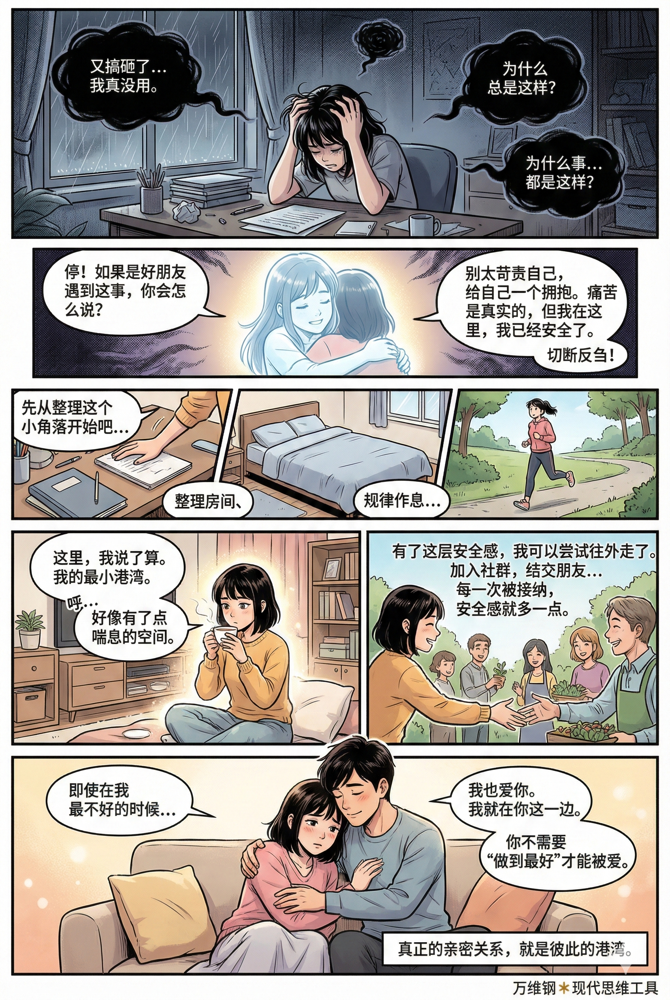
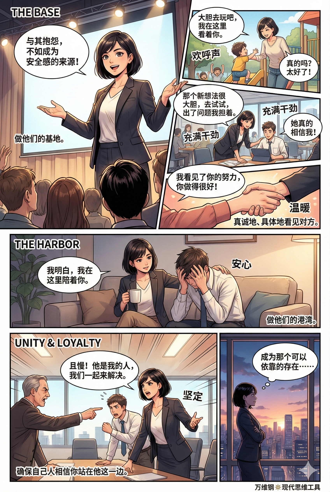

# 安全感：人需要有所依靠（得到课程讲稿 + AI 加工段）

# 安全感：人需要有所依靠

 [安全感：人需要有所依靠](https://www.dedao.cn/course/article?id=xzYo2GPNq4W8VEb2WzJejyRBZbnw0d&fullScreen=true)

<cite doc-id="QUAXwIMAPiP41kkWjMocqbewnyh" file-type="wiki" title="《园丁与木匠》" type="doc"></cite>

这一讲的思维工具非常简单，你都不需要构建什么模型，你只要在脑子里多这么一根弦儿，看人的时候多看这么一个维度：「 安全感 」。安全感是一种最基本的人类需求，它能决定人生的幸福和格局。

咱们先想象一个场景。一位妈妈，带着自己刚学会走路的孩子，来到一个放着很多玩具的游戏房间。孩子可以在房间里随便玩。妈妈先是陪孩子待了一会儿，随后就离开了，让孩子独自在房间里玩，期间偶尔有陌生人进出。过了一段时间，妈妈回到房间找孩子。

很简单的一个场景。但是孩子在那段时间的表现，就在相当程度上预言了他一生的命运。

这是上世纪 70 年代，发展心理学家玛丽·安斯沃斯（Mary Ainsworth）设计的一个经典实验。孩子的表现通常有三种 ——

**第一种是「 焦虑型依恋 （Anxious Attachment）」，**一时半刻都离不开妈妈，妈妈在的时候他也不敢去玩玩具，妈妈要走他立即崩溃大哭，妈妈一回来他一边求抱抱一边踢打、推搡妈妈，似乎是惩罚妈妈的离开。

**第二种是「 回避型依恋 （Avoidant Attachment）」**，跟第一种正好相反。进入房间立即找玩具玩，妈妈离开他不哭不闹，妈妈回来他还是自己玩自己的，似乎全不在意。

**第三种是「 安全型依恋 （Secure Attachment）」**，简称安全依恋，是大多数孩子（大约 65% 到 70%）的表现。妈妈在场的时候他敢于离开母亲身边去探索房间的各个角落，偶尔回头确认母亲的位置。妈妈离开，他会难过甚至可能会哭。妈妈回来他会马上跑去求安慰，然后就擦干眼泪继续玩。

我们精英日课专栏曾经列举过一些研究，一岁左右的依恋类型会直接决定一个孩子七岁时候的受欢迎程度，而且会决定他将来会不会是个理想的婚恋对象。如果这孩子成为母亲，还会影响她自己的孩子的依恋类型。

你希望你的孩子属于安全依恋这个类型。

孩子从小有没有安全感，在相当程度上取决于父母如何照看他。焦虑型依恋是照看忽冷忽热缺乏可预测性的结果，孩子必须大哭大闹才能把母亲的注意力锁定在自己身上。回避型依恋看似独立，实则是长期被父母忽略造成的，孩子不求大人是因为他知道求了也没用……研究者发现母亲离开的时候这样的孩子也会非常紧张，表现为心率急剧飙升，看来冷漠只是他们的防御面具而已。

这是否让你想起某些人在婚恋中、在职场上的表现？没错，从小属于焦虑型依恋的人，在婚恋中也会焦虑，总担心对方不爱自己，在工作场合也是极度敏感。伴侣回微信晚了五分钟，她觉得天都要塌了；老板一个眼神没对上，他能脑补出一场裁员大戏。回避型依恋者长大后往往不敢参与爱与被爱。他们看起来独立高冷从不麻烦别人，其实只是害怕受伤……那不也是一种恐惧吗？

**只有安全依恋，才让人既能亲密，也能独立；既信任，也确保界限清晰。只有这样的人，才既敢于全情投入探索和创造，又能在受伤时坦然寻求支持。**

**我敢说安全依恋是健全人格的必要条件。**

很多人推崇“独立自主”，但人并不是一种特别擅长独立的动物。我们在整个幼年时期都没有独立生存能力，没人照料就会死 —— 我们的本能是寻求依靠，而不是寻求独立。

**有依靠，你才有安全感。**

不只是关系上的安全依恋，你需要在生活中、工作中有全方位的安全感。有安全感，大约相当于你内心确信自己处在一个“不会突然塌方”的系统里：环境是比较可预期的，资源是可控的，你不会突然遭遇难以承受的伤害，就算出事儿也有人给你兜底。

马斯洛需求层次理论把安全需求放在生理需求之上作为第二层，安全感的重要性仅次于吃饱穿暖。

没有安全感，你的大脑就会在杏仁核自动运行一个可以叫做“威胁扫描”的高耗能程序，探测到一点蛛丝马迹就想要战斗或者逃跑。这个程序会占用你大量的内存和带宽，让负责理性规划和创造的前额叶皮层没有资源运行。有安全感，让自己处于一种比较积极正面的情绪之中，大脑才能进入所谓「拓展-构建（Broaden-and-Build）」状态：拓展注意力，构建心理资源，你才敢于出去探索和创造，才敢于表现自我，你的生命才是丰富多彩的。

生活中有些人常常做出过分的、甚至可以说有点怪异的举动，大多就是跟缺乏安全感有关系。

比如有的人整天就想买买买，家里囤积一大堆没用的东西，这是不是在潜意识中用物质填补内心的安全感黑洞呢？

有的人整天吹牛炫耀，出个差发三条朋友圈，挺大岁数了还拿奢侈品刷存在感，这种明显不得体的虚荣不也是因为缺乏安全感所以必须不断向外界抛出信号来确认自己的位置吗？

有的人不知道如何跟人保持恰当距离，要么就过度讨好，要么就过度冷漠，其实都是因为缺乏安全感而不相信关系的稳定性。

有的人对人特别不信任，防备心理强，给人感觉就是不好沟通。想法一根筋，听不进去意见，思想自动陷入封闭，其实也是因为从小没有得到过足够的保护。

还有的人处处想要证明自己，过度盯着别人的评价，一次没拿第一就像世界末日，不能容忍自己出一点差错……有安全感的人绝不会如此。

也许他们曾经长期被父母忽略，又或者他们从来不曾拥有过无条件的爱。他们担惊受怕，一直都在为安全感寻求补偿。他们不是在追求幸福而是在躲避崩溃。

**所以安全感可以说是「认知带宽节省器」，能把你从焦虑中解放出来。这比什么“自律”、“进取”都有用，你至少得先能松弛下来才有资格谈别的。**

有的人说有钱有权才有安全感，说你把工资全都上交给她、你的手机让她随便查她就有安全感，其实那都是缺乏安全感导致的臆想。真有安全感的人根本不想控制别人。

安全感从何而来呢？依恋理论的创始人约翰·鲍尔比（John Bowlby）给了一个非常漂亮的解释模型。简单说，安全感来自社会关系 —— 可能是亲子、夫妻或者上下级、同事 —— 给你提供的两个功能：安全基地和安全港湾。

**「 安全基地 （Secure Base）」就如同是登山大本营。**它鼓励你出去探索、冒险、尝试新项目、挑战高难度任务。基地给你提供补给和信心。孩子在陌生环境里玩耍，时不时回头看一眼妈妈，那就是在确认基地还在。领导说“放手去干吧！组织是你的坚强后盾！”这也是基地。

**「 安全港湾 （Safe Haven）」则是你万一失败了、出事儿了，有个地方无论发生什么都能接住你。**不论你在外面是受伤了、搞砸了、被客户和老板骂了，又或者只是累了，你总可以退回到这里。父母说“不行就回来吧，我们养你！”这就是港湾。

**基地鼓励你勇敢，港湾允许你脆弱。**最理想的关系是既能把你推出去，又能把你接住，然而现实中很少有那么完美的关系。妈宝男的妈妈是绝对的港湾但不会是基地，她不会给孩子独自出去探索的勇气。雄才大略的领导是很好的基地，但万一你搞砸了，他手下还有别的大将。寒门子弟肩负振兴家族的重任，有时候连父母都只是基地而不是港湾。我看有的青年男子付出巨额彩礼供养了一个妻子，工资全交家务全包对方仍不满足，转头一个暂时失业就被离婚了，那真是既不是基地也不是港湾。

如果你既有基地又有港湾，你是一个幸运的人，你能出去又能回来，你有安全感。鲍尔比有句名言说：

「生活最好被组织成一系列从安全基地出发的冒险。」

Life is best organized as a series of daring ventures from a secure base. ——John Bowlly

有的人敢闯敢干有的人畏首畏尾，那也许不是人家本质上是不一样的人，而实在是各人的基地和港湾配置不同啊！

那你说我既没有基地也没有港湾，连从小父母的爱都是有条件的，一直被打压从未被接纳，我毫无安全感，我该怎么办呢？

**好消息是安全感是可以习得的。你不但可以自我成长，而且可以主动寻求健康关系，自建安全系统。**

首先你得能觉察到自己的依恋类型。也许你是患得患失的焦虑型，也许是习惯性推开别人的回避型，那都是童年阴影的编码。而那些只是编码！你完全可以跳出旧的叙事，重建新编码。当你下一次想要夺命连环call或者想要在冲突中冷暴力逃跑的时候，能不能先暂停一下，来个「认知解耦」？**运用元认知能力告诉自己：“这是我的旧程序在运行。”能从那个情绪中解离出来你就已经赢了一半。**

然后是成为自己的安全港湾。你至少还有自己！

我们精英日课专栏多次讲过一个心态叫「自我关怀（Self-Compassion）」，意思是像对待一位好朋友那样对待自己：不要太苛责、也不用过度自怜，给自己一个拥抱，承认痛苦但是告诉自己我在这里、我已经安全了，切断反刍。

这样你就能收获一点认知带宽。下一步是建立一个可控的小环境。你控制不了别人但你至少可以控制自己的小环境！整理房间、装饰一下办公桌、规律作息、管理财务，做好这些你就有了一个最小的港湾。这个地方绝对是你说了算。

有了这点最低限度的心理安全，你就可以出去寻找安全基地和港湾了。家庭不给力就去外边找盟友：加入社群、结交可信赖的朋友、寻找导师，每一次最小的被接纳都能让你的安全感增强一点点，多一点安全感你就更敢于跟人交往，乃至于建立亲密关系。

真正的亲密关系就是彼此是对方的港湾：你不需要“做到最好”才能被爱。你就做你自己，甚至在你最不好的时刻，ta也爱你。哪怕明明是你错，ta也站在你这一边。

安全感不只是幸福指标，而且事关生产力。正如个人有安全感才敢于出去探索和冒险，团队也是有安全感才能创新和出成果。尤其复杂工作，不是说你把一群高智商的人放在一起卷，给足够的奖金就能出高绩效。

Google 公司曾经有个研究叫「亚里士多德计划（Project Aristotle）」，他们考察了公司内部180个团队搞大数据分析，想看看成功团队的共同基因都有什么 —— 结果排在第一位的不是个人能力，而是「 心理安全 （Psychological Safety）」。

哈佛商学院的埃米·埃德蒙森（Amy Edmondson）教授对心理安全的定义是在这个团队中，人际层面的冒险是安全的。心理安全高的团队里成员敢承认错误、敢问蠢问题、敢挑战现状、敢提疯狂想法，因为他们确信这样做不会被羞辱、被排斥或者受惩罚。

也就是他们感到这里有基地和港湾。

研究发现，心理安全高的团队，成员离开公司的可能性更低，产生多样化想法和被评为高效的可能性都是其他团队的两倍。他们鼓励试错而且不怕责备，所以他们敢复盘，能从错误中学习。

反过来说，心理安全低的团队里人人怕担责所以人人都只会甩锅。在这里说真话会死，所有人假装一切都在良好地运行，每天大部分工作是撇清责任，什么事儿领导不推就坚决不动……

领导说你们怎么都不积极主动呢？殊不知这里最大的责任人就是你：是你每天都在挑刺、是你实行严苛的KPI、是你自己拍脑袋决策出了事儿让下属背锅，是你不配给人当安全基地和安全港湾。

孩子没有安全感是家长的责任，员工没有安全感是领导的责任。但与其抱怨别人不给自己安全感，不如主动成为他人的安全感来源。

你可以做基地。告诉孩子大胆去玩吧，我会在这里看着你。告诉下属那个新想法很大胆，去试试，出了问题我担着。你要真诚地、具体地看见对方的优点和努力，其实安全感很大程度上来自被看见。你要提供切实的支持，给人撑腰。

你还可以做港湾。在别人脆弱的时候你先接住情绪，不急着判断对错讲道理，要点是我明白，我在这里陪着你。在你的人跟他人发生冲突的时候，咱不是说非得拉偏架，咱有错咱也改，但你必须首先确保自己人相信你绝对站在他这一边。

你的支持和关心必须是一致和可预期的，你的承诺必须是可靠的，不然别人就会陷入焦虑和回避。

而当你这么做的时候，你就不再是一个索取者，而是一个供给者。别人会发现你是个可以依靠的人。

而你会发现自己因为被人依靠而变得前所未有的强大，就好像刚刚生下孩子的女性一样。你默默地想，既然我能保护别人，那我一定是很安全的。你不是因为安全了才去保护别人，你是因为保护了别人，才确认了自己的力量。

世界很不确定，但是如果因此就一辈子小心翼翼过活，那也太可怜了。**安全感是一个人敢探索的前提；而探索决定了这个人能活出多大的生命历程。**

**敢出来探索的人都拥有两样东西：一个是锚点也就是安全港湾，让你在风暴中不被吹走；一个是翅膀也就是安全基地，让你能摆脱平庸的引力。**

渴望有所依靠并不可耻。人类文明本来就是一个大家互为依靠的系统。我们生活在一个很不确定的世界，那么如果你能给他人提供一点确定性，乃至于成为别人的依靠，你就是极为宝贵的存在。

**安全感是你对世界输出的秩序。**你会因为提供基地和港湾而成为一个稀缺节点：人们围绕你合作，和你建立长远关系，愿意把真实的自己交给你。那么你将获得极为强大的社交资本。

还是那句话：被依赖，是当今世界给你最好的待遇。

## 核心洞见

这篇文章深刻剖析了“安全感”的本质、运行机制以及它对个人发展和人际关系的决定性影响。

### 1. 安全感的本质：人天生需要依靠，而非独立

- 人并不是擅长独立的动物，我们的本能是寻求依靠。真正的独立自主不是高冷孤僻，而是建立在拥有充分的安全感之上。
- **健全人格的基石**：只有形成“安全型依恋”，人才能做到既能亲密又能独立；既敢于全情投入探索，又能在受伤时坦然求助。

### 2. 核心模型：安全感的两大支柱

依恋理论创始人鲍尔比提出，真正的安全感来自社会关系为你提供的两个功能：

- **安全基地**：像“翅膀”，给你信心，鼓励你勇敢走出去探索、冒险、挑战自我（例如：放手去干，我给你兜底）。
- **安全港湾**：像“锚点”，允许你脆弱，当你失败、受伤或疲惫时，总有一个地方能无条件接纳你（例如：不行就回来，我们养你）。
- 生活最好被组织成一系列从“安全基地”出发，且随时能退回“安全港湾”的冒险。

### 3. 底层机制：安全感是“认知带宽节省器”

- **缺乏安全感 = 高耗能生存**：大脑会自动运行“威胁扫描”程序（进入战斗或逃跑状态），消耗大量内存，导致人做出过度囤积、极度虚荣、防备心重、讨好或冷漠等“补偿性怪异行为”。
- **拥有安全感 = 拓展与构建**：大脑能从焦虑中解放出来，进入“拓展-构建”状态，调动负责理性规划和创造的前额叶皮层，从而敢于探索、表现自我。

### 4. 组织管理：心理安全是第一生产力

- **亚里士多德计划**：Google研究表明，决定高绩效团队最核心的基因不是成员的智商或能力，而是**“心理安全”**。
- **免于恐惧的环境**：在心理安全的团队里，员工确信承担风险、承认错误、提出疯狂想法不会受到惩罚或羞辱。没有安全感，团队就只会沦为推诿扯皮、不求有功但求无过的甩锅场。

### 5. 自我救赎：安全感是可以通过后天习得的

如果原生家庭没有给你安全感，你可以通过以下步骤“自建安全系统”：

1. **认知解耦**：觉察自己的焦虑或回避情绪，告诉自己“这只是童年阴影的旧程序在运行”，从情绪中抽离。
2. **自我关怀**：成为自己的安全港湾，不苛责自己，切断负面情绪的反刍。
3. **掌控小环境**：从整理房间、规律作息做起，建立一个绝对由自己说了算的最小港湾。
4. **寻找外部盟友**：结交信赖的朋友或加入社群，通过一次次微小的“被接纳”来重建对外界的信任。

### 6. 最高境界：成为供给者，在“被依赖”中确立强大

- 与其向外索取和抱怨，不如主动成为他人的安全基地和港湾（无论是对孩子、下属还是伴侣）。
- **强者逻辑**：你不是因为安全了才去保护别人，而是因为保护了别人，才确认了自己的力量。
- **社交资本**：在这个充满不确定性的世界里，如果你能为他人提供确定性，你就会成为一个“稀缺节点”，人们会围绕你合作。**被依赖，是当今世界给你最好的待遇。**

## 行动策略

面对充满创伤的童年和匮乏的外部环境，你的处境确实就像开局被发了一手烂牌：**系统默认安装了“不安全感”的病毒代码，且周围没有外接的“杀毒工具（基地和港湾）”。**

但那只是“编码”，不是你的宿命。没有父母兜底，没有现成的贵人相助，你可以成为自己的救世主。

以下是一份分为四个阶段的**“安全感重建行动策略”**，从向内自救到向外破局，步步为营：

### 1.认知突围：阻断旧程序，做自己的“安全港湾”

既然外部没有港湾，你必须先在大脑里给自己造一个。这叫**“停止心理失血”**。

- **行动 1：给情绪“打标签”（认知解耦）**

  - 当你因为别人的一句话感到极度焦虑（想去讨好），或者极度恐慌（想要冷暴力逃跑）时，立刻深呼吸，在心里喊“停”。
  - **默念话术**：*“这不是现在的我遇到了危险，这只是我5岁时害怕被父母抛弃的旧程序被触发了。那是过去，我现在很安全。”*
  - **目的**：把“当下的现实”和“童年的阴影”剥离开，不让旧代码接管你的行为。
- **行动 2：启动“自我关怀”程序**

  - 停止自我PUA。从小被打压的人，内心往往有一个严苛的父母声音在骂自己。每次你搞砸了事情，不要骂自己“我真没用”，而是想象你最好的朋友搞砸了，你会怎么对他说？
  - **默念话术**：*“搞砸了没关系，你已经尽力了。即使你表现不好，我也依然接纳你。”*
  - **目的**：无条件接纳自己最糟糕的一面。你必须成为世界上第一个、也是最坚定的“挺你自己”的人。

### 2.物理突围：建立绝对可控的“最小基地”

心理安全感往往建立在对物理环境的掌控感之上。你控制不了别人是否爱你，但你能控制自己的生活秩序。

- **行动 1：打造一个专属的“物理避难所”**

  - 无论你住多小的房子，哪怕只是合租屋里的一张书桌，把它彻底打扫干净，按照你最喜欢的样子布置（摆上喜欢的绿植、手办、香薰）。
  - **规则**：在这个微小空间里，**你说了算**。任何人不得随意评判。当你疲惫时，回到这里，告诉自己“门一关，世界与我无关”。
- **行动 2：积累“硬核的物理港湾”——存款与健康**

  - 努力存钱，哪怕每个月只存几百块；坚持锻炼，保持规律作息。
  - **目的**：很多时候，银行卡余额就是成年人最坚实的“安全港湾”，强壮的身体就是最可靠的“安全基地”。当你知道自己饿不死、病了能治，你对人际关系的焦虑会大幅降低。

### 3.关系突围：寻找“低成本、碎片化”的外包基地

不要一上来就奢求找到一个完美的伴侣或老板来拯救你（那容易陷入新的依恋危机），你需要的是**“化整为零”**去收集安全感。

- **行动 1：寻找“非人类”的无条件爱**

  - 如果条件允许，养一只宠物（猫或狗）。宠物不会对你进行条件性打压，它们提供的是纯粹、无条件的需求和爱。这种互动能极大地修复你的依恋系统。
- **行动 2：寻找“弱连接”中的微小肯定**

  - 加入一些基于兴趣的社群（读书会、徒步群、行业交流群）。在这些地方，大家只关注你的某个切面（比如你书评写得好、你体力好）。
  - **目的**：每一次在社群里被点赞、被需要、被尊重，都是在给你提供微小的“安全基地”体验。慢慢积累这些正反馈，覆盖掉童年的负反馈。
- **行动 3：单向获取心理营养（云导师/云港湾）**

  - 如果现实中没有好导师，就去读书、听播客。把某位你认同的作家、心理学家或播客主当作你的“云端安全基地”。当遇到困难时，想象“如果是TA，会怎么鼓励我？”

### 4.终极突围：从“匮乏者”变身“供给者”

这是完成重生的最关键一步。**缺乏安全感的人总是在“寻找”依靠，而内心强大的人是在“成为”依靠。**

- **行动 1：对他人输出一点确定性**

  - 在工作中，成为那个“靠谱”的人（凡事有交代，件件有着落）；在人际交往中，尝试去倾听一下别人的烦恼，给别人提供一次“情绪价值”。
- **行动 2：保护弱小，确认自己的力量**

  - 去参加公益活动，去帮助比你更弱小、更迷茫的人。当你发现有人因为你的帮助而感到安全时，你的大脑会发生奇妙的化学反应。
  - **底层逻辑**：**“我能保护别人，说明我已经足够强大，我不再是那个需要讨好父母的无助小孩了。”** 这种通过提供价值而获得的掌控感，是最高级别的安全感。

### 每日行动检查清单

为了避免看完了就忘，你可以每天睡前问自己四个问题：

1. **解耦**：今天我有没有识别出一次“童年旧程序的发作”，并叫停了它？
2. **关怀**：今天我有没有在做错事时，对自己说一句安慰的话？
3. **掌控**：今天我有没有维护好我的生活秩序（按时吃饭、运动、清理桌面）？
4. **输出**：今天我有没有给任何人（哪怕是一只流浪猫）提供一点点善意或帮助？

**突围的本质，就是把过去那套名为“我不配、我不行、我不安全”的旧系统强行卸载。** 哪怕一开始你是假装的（Fake it till you make it），只要坚持这套新策略，你的大脑皮层就会长出新的神经回路。你终将成为自己最坚不可摧的基地和港湾。

## 90天安全感重建指南

这是一份为你量身定制的**《90天安全感重建与底层代码重写指南》**。

既然你的出厂设置（童年）和运行环境（现状）都没有给你安全感，这90天的主旨就是：**强行卸载旧系统，自己编写新代码，从“安全感乞讨者”进化为“安全感基站”。**

我们将这90天分为三个阶段，每个阶段30天。请将此指南作为你每日的“行动手册”。

### 第一阶段（第1-30天）：止血与筑巢：成为自己的“安全港湾”

**本月目标：** 阻断原生家庭的“病毒代码”，建立绝对可控的物理与心理微环境。在这个阶段，我们**不向外求**，只向内建。

**🌞 每日晨间仪式（10分钟）：物理掌控**

- **整理微小空间**：起床后，无论如何把床铺好，把书桌擦干净。

  - *代码重写：* “我可能控制不了别人，但我对我的物理空间有绝对的掌控权。这里是我的安全基地。”

**🏃 每日运行程序：认知解耦**

- **捕捉“旧程序”触发时刻**：每天你可能会遇到别人回微信慢了、领导皱眉了、或者做错了一件小事。当你感到心慌、想讨好或想逃避时，立刻在心里喊停。

  - *默念咒语：* “这不是现在的我面临生存危机，这只是童年那个无助的我被激活了。我现在是个有力量的成年人，我很安全。”

**🌛 每日晚间复盘（15分钟）：自我关怀日记**

在睡前写下三句话：

1. **我今天原谅了自己的一件事**（例如：今天工作搞砸了一个细节，我没有骂自己蠢，我原谅了自己）。
2. **我今天掌控的一件小事**（例如：我今天按时吃了一顿健康的午餐）。
3. **对自己说一句“港湾话语”**：“今天辛苦了，你做得够好了，现在你可以卸下防备休息了。”

**🚩 第30天里程碑检验：**

你发现自己不再那么容易因为别人的情绪而陷入恐慌，内心的“自我审判官”声音变小了。你拥有了一个专属于你的干净、安全的微小角落。

### 第二阶段（第31-60天）：低风险试探：组建“碎片化”的安全基地

**本月目标：** 带着第一阶段积累的内部安全感，开始向外试探。不求一次性找到完美的伴侣或恩师，而是通过“弱连接”收集碎片化的正反馈。

**🌞 每日晨间仪式（15分钟）：链接“云导师”**

- 每天早晨听一段心理学播客、读10页人物传记或哲学书籍。找一个你高度认同的人（活着的或历史人物）。

  - *代码重写：* 把TA当成你的“云端安全基地”。遇到事情时问自己：“如果是TA，会怎么鼓励我？”

**🏃 每日运行程序：微量社交试探**

- 每天进行一次**“低风险的外部互动”**，收集被接纳的信号。

  - *行动参考：* 在兴趣群里分享一篇好文章；在同事的朋友圈点个赞并真诚评论；对楼下便利店店员微笑着说声谢谢。
  - *注意：* 如果没有得到回应，运用“认知解耦”告诉自己：这不代表我不值得被爱，只是对方在忙。

**🌛 每日晚间复盘：正反馈储蓄罐**

- 找一个玻璃罐（或建立一个单独的文档），每天写下一张小纸条扔进去：

  - 记录今天从外界得到的**任何一丝善意或肯定**。（例如：“今天同事夸我PPT排版很清晰”、“今天发在豆瓣的书评得到了2个赞”）。这些纸条将是你对抗自我怀疑时的“证据”。

**🚩 第60天里程碑检验：**

你开始感受到世界上除了打压你的父母，还有很多愿意给你正向反馈的温和的人。你的“安全感储蓄罐”里有了底气。

### 第三阶段（第61-90天）：身份反转：成为他人的“基地与港湾”

**本月目标：** 完成终极突围。从“缺乏安全感的索取者”，转变为“提供确定性的供给者”。通过保护别人，彻底确认自己的力量。

**🌞 每日晨间仪式：确立供给者意图**

- 对着镜子对自己说：“我不再是那个瑟瑟发抖的小孩了。今天，我要成为某个人、某件事的依靠。”

**🏃 每日运行程序：输出确定性与保护力**

每天至少做一件**“提供安全感”**的事：

1. **做工作中的基地**：凡事有交代，件件有着落。给同事或合作伙伴提供高度的“可预期性”。
2. **做情绪的港湾**：当朋友或同事向你抱怨时，**不评判、不讲道理**。只说一句：“我理解你的感受，这确实挺难的，我站在你这边。”
3. **弱小保护行动**：定期喂流浪猫；或者给实习生提供一次无私的经验指导；甚至只是精心照顾一盆植物。

**🌛 每日晚间复盘：力量确认日记**

睡前记录：

1. 今天谁因为我的存在，感到了一点点安心？
2. 今天我在哪件事情上，表现出了成年人的掌控力？

   - *代码重写：* “我能保护别人/事物，证明我已经足够强大。我是安全的。”

**🚩 第90天里程碑检验：**

你会发现自己散发着一种“松弛且靠谱”的磁场。人们开始愿意围绕你、信任你。你不再害怕失去，因为你知道**安全感是你自己产出的，谁也拿不走。**

### 附录：90天“突发故障”应急预案

在执行这90天计划时，你一定会有崩溃、倒退、觉得“全都没用”的时刻。当这种时刻来临时，请启动以下预案：

1. **允许死机**：告诉自己“重建底层代码是一件极其耗能的事，偶尔系统崩溃太正常了”。允许自己今天什么都不做，就在你的“物理避难所”里躺平。
2. **拒绝反刍**：不要去想“我怎么又失败了”、“我果然一辈子就这样了”。立刻切断思考，去洗个热水澡，或者去跑个步，把注意力拉回身体。
3. **翻阅证据**：打开你在第二阶段建立的“正反馈储蓄罐”，阅读那些你被世界接纳过的微小证据。

**最后的话：**

这90天不会让你变成一个完美无缺的人，但它能让你完成一次**系统重装**。

你可能依然会有童年留下的伤疤，但那个伤疤不再流血了。你将带着它，勇敢地从自己亲手打造的“安全基地”出发，去探索属于你自己的、无限宽广的生命历程。

**从今天，此时此刻的整理书桌开始吧。祝你重生。**

## 7天人生重启

> 把90天计划压缩到一周，来一次硬核的人生重启，不要情绪抚摸，立即行动，从今天开始

放弃情绪抚摸，停止对童年创伤的咀嚼。既然你要硬核重启，我们就把这当作一次**“系统强制格式化”**。

这7天，不要问“我感觉好不好”，只问“我做没做到”。我们将用绝对的物理行动和行为控制，暴力覆盖你的底层代码。

从你读完这行字开始，**“受害者模式”强行关闭，“系统管理员模式”正式上线。**

### 第1天：物理夺权（强行建立安全港湾）

**核心逻辑：环境失控，大脑必乱。你今天只需要做一件事：用肉体控制物理空间。**

- **立即行动**：扔掉、清理、收纳。把你的办公桌、卧室或出租屋彻底打扫一遍。任何让你觉得碍眼、没用、引发负面回忆的东西，全部扔掉。
- **硬核规则**：不准留恋，不准感伤。把这个空间变成绝对干净的“无菌室”。
- **睡前确认**：站在清理完的空间里，大声告诉自己：“这里是我的绝对领土，谁也无法入侵。从今天起，我是这里的暴君，我说了算。”

### 第2天：切断电源（暴力认知解耦）

**核心逻辑：你的焦虑和讨好是旧程序（童年阴影）在自动运行，今天你要拔掉它的网线。**

- **立即行动**：在手腕上戴一根皮筋。今天无论任何人（老板、伴侣、父母）让你感到恐慌、想讨好、或者想逃避，**狠狠弹一下皮筋**。
- **硬核规则**：用物理痛感打断情绪反刍。在心里默念一句指令：“**旧代码，终止运行。**” 对方脸色不好是对方的课题，与你的生存毫无关系。天塌不下来。

### 第3天：脱敏测试（对抗被抛弃恐惧）

**核心逻辑：你害怕别人不回应你，今天我们就主动去“被忽略”，以此证明你根本死不了。**

- **立即行动**：发一条不痛不痒的工作微信，或者在群里说句话，然后**立刻手机静音，扣在桌上**，去干别的事。哪怕你心里急得发疯，一小时内绝对不准看手机。
- **硬核规则**：无论对方是秒回，还是根本没回，你都要认清一个物理现实——**你不因为任何人的冷落而少块肉，你的银行卡余额不会因此变少，你还在呼吸。**

### 第4天：锚点抓取（强制抓取外部数据）

**核心逻辑：世界不是只有打压，你的大脑自带“过滤负面信息”的病。今天强制矫正视力。**

- **立即行动**：今天必须完成3次低成本的正面互动。比如：帮陌生人按一次电梯、对保洁阿姨说句谢谢、在某个专业论坛发个客观的技术评论。
- **硬核规则**：像无情的机器一样，只收集事实数据。记录下今天谁对你点头了，谁对你笑了。把这些“安全数据”强行写入你的大脑硬盘，覆盖那些垃圾数据。

### 第5天：身份反转（强行扮演安全基地）

**核心逻辑：乞丐永远没有安全感。今天你必须“装作”自己是个绝对强大的供给者。**

- **立即行动**：在公司或家里，找到一个看起来焦虑、忙乱或犯了错的人。过去你可能会跟着焦虑，今天你走过去，用最平稳的语气说：“**别慌，需要我帮你做什么？**” 哪怕只是帮他倒杯水，或者替他复印一份文件。
- **硬核规则**：哪怕你心里慌得一匹，外表也要装作稳如老狗。体会一下“别人因为你的一句话而松了一口气”的瞬间。记住这种手握权力的感觉，这就是安全感。

### 第6天：防御测试（主动设立边界）

**核心逻辑：不敢拒绝的人，其港湾四面漏风。今天你要亲手立起一堵墙。**

- **立即行动**：今天无论如何，必须对一个不合理的小要求说**“不”**。同事推给你的杂事、朋友无聊的饭局，直接拒绝，**且不准给出长篇大论的解释或道歉**。就一句：“我今天没空/这个我做不了。”
- **硬核规则**：拒绝完之后，硬扛住随之而来的内疚和恐慌感。看着对方，不要躲闪。你会发现，地球依然在转。

### 第7天：系统锁定（封存受害者叙事）

**核心逻辑：7天的强制操作后，新系统必须锁死。**

- **立即行动**：拿出一张纸，写下你过去用来解释自己为什么懦弱、为什么没安全感的所有借口（“因为我父母不爱我”、“因为我童年缺爱”）。然后，**用打火机把它烧掉，或者撕得粉碎扔进马桶冲走。**
- **硬核规则**：从今往后，“原生家庭”这个词从你的字典里彻底删除。你是一个没有过去的人。今天就是你的第一天。

### 军规（执行期间绝对遵守）：

1. **禁止反刍**：任何“如果我当年……”、“是不是我哪里做错了……”的念头出现，立刻去做20个深蹲，直到大腿酸痛盖过脑子里的废话。
2. **结果导向**：不要管自己这7天“开不开心”、“有没有被治愈”。我们要的是行为的改变，情绪会像一条狗一样，乖乖跟在行为后面。
3. **你就是你自己的爹妈**：想要依靠？照照镜子。镜子里那个成年人，就是你唯一的依靠、你的基地、你的港湾。

**倒计时结束，立刻站起来，去执行第1天的清理任务。去行动。**
