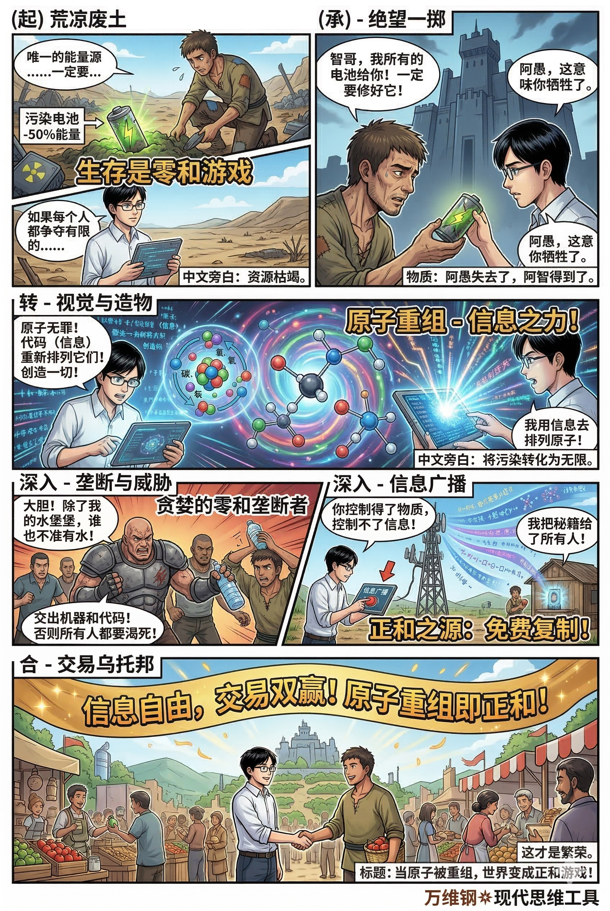

# 供给侧心态：怎样在正和的世界合作（以及竞争）（得到课程讲稿 + AI 加工段）

# 供给侧心态：怎样在正和的世界合作（以及竞争）

[供给侧心态：怎样在正和的世界合作（以及竞争）](https://www.dedao.cn/course/article?id=yNwelz6kDn0aKeR6e3V7qLAO3Bb51j)

2026-03-25 22:47

我有个朋友叫刘大为，是硅谷很好的并购律师，他给我讲了个有意思的观察。

在一家公司处于即将被并购的变动时刻，老板和员工的本能反应很不同。老板往往有造福一方的心态，真心为员工着想，希望员工也能拿到并购的红利，为此会专门在合同中设置一些条款。可员工却是充满防备心理，总怀疑老板找律师整什么动作是不是要 screw me over（搞我）。

我们都很感慨，这真是社会地位越高的人越倾向于用正和思维跟世界打交道，社会地位越低的人却是越倾向于零和……连硅谷高科技公司的人都是如此。

所谓「正和（Positive-Sum）」，就是这个事儿对咱俩都有好处，是双赢；而「零和（Zero-Sum）」，则是咱俩的收益之和等于0：你赢了多少就是我输了多少，你赢的都是原本应该属于我的。

现代人最大的精神内耗，就是把零和当常识，把正和当理想。在公司、在各种组织里，人们往往不是把最多的精力用来创造价值，而是用来防备别人从自己身上拿走什么，担心自己会不会吃亏。

本来弱者更需要合作，可弱者最先把关系想成你死我活。这不是见没见过世面的问题，这是大脑默认安装了过时的博弈模型。

这一讲的工具叫「 供给侧心态（Supply-Side Mindset） 」，我希望它能带给你一个强大的阿尔法优势。而你首先需要理解，我们生活在一个正和远大于零和的世界。

零和很符合人的直觉。

很多读过一点进化论但没读通的人认为，这个世界的底层逻辑是竞争，甚至是杀戮。你看动物要生存就得吃别的生物，你要活别的生物就得死，弱肉强食这不就是零和吗？什么合作、什么真善美，不过是建立在残酷底层之上的二阶效应，是文明人给自己画的妆……

但你要是深入了解一点生物进化，你会发现合作其实远比杀戮普遍得多。单细胞生物变成多细胞生物，多细胞生物的共生和社会分工，这些都是一次次的合作升级。杀戮只是地球生物获取能量很窄的一种手段，大头其实是光合作用和碎屑分解。人类之所以成为最强物种，不是因为我们最擅长杀戮，而是因为我们最擅长合作。

合作不是二阶的，合作是底层结构的主干。

我们特别注意杀戮，是因为大脑的安全模块很原始，对威胁特别敏感，对机会特别迟钝。它让你更容易记住抢夺、背叛和被坑的故事，而不是那些枯燥但持续发生的正和合作。

你本可以玩更大的游戏，却把自己关在一个假想的斗兽场里。

古人狩猎采集种地都需要合作，现代世界则因为有自由市场，而有了两个巨大的正和 buff。

一个是信息的可复制性。

你分给我一个苹果，我多了一个你的确就得少一个，这是零和。但如果你有一个好故事、一个好主意，讲给我听，我得到了，你可并没有失去它。复制一份信息并不会让你损失那个信息。

这就是为什么商品交换从根本上来说就是正和的。假设你掌握一个种植苹果的秘诀，能以比较低的成本大规模生产高质量苹果。我花10块钱买了你一斤苹果，这个故事跟分苹果可就不一样了。

我买的不是组成苹果的那一堆原子 —— 我把苹果吃掉，原子无非是在我体内循环一番，一个都不会少 —— 我买的其实是\*原子的排列组合方式\*，也就是信息。我买的是你种出来的那个苹果的“好”。我乐意出这10块钱，一定是因为我认为苹果的价值高于10元：我自己拿10块钱可种不出一斤苹果来。

而你则一定认为10元的价值高于苹果，才愿意费力卖给我。这是对的，因为苹果是你种的！你用一个秘诀种出了很多个苹果，每个苹果身上那个“好”都是对你那个秘诀的一次免费复制。

咱俩都得到了比原来更好的处境，标准的正和。这是经济学最底层的原理：只要交易是自愿的，它就一定是双赢，一定增加了整个社会的总财富。

另一个 buff 是分工和网络效应。

你善于玩木头，我善于打铁，咱俩单干的价值都有限，但是合作就能创造像锤子这样的高级东西。这是乘法关系，价值立即提升。专业带来精通，精通才有效率，劳动分工和比较优势就是这么来的。

再进一步，如果有人弄个大市场，最好这个市场还是开在网上，乘法关系就会有更大的发挥。这个网络每多一个卖家、每多一个买家，它自身的价值都会变得更高。

正和游戏是你只要能参加就一定是好事儿。为了能参加，我们应该研究自己能创造什么价值而不是该领取什么价值，反正只要你进去自然就有回报。将欲取之，必先予之。

我不问我能得到什么，我问我能提供什么，这就是供给侧心态。

**一旦有了供给侧的眼光，你就会发现大量的人都把自己错误地锁在了需求侧。**问他为啥来我们公司应聘，他说因为我喜欢你们的待遇和工作环境。问她对婚姻有什么看法，她说我要求另一半身高一米八年收入至少二十个W还要给18万彩礼并且提供情绪价值。您那叫许愿好吗？

想要被邀请加入游戏，你必须能提供一点什么东西才好。

![图片是一幅漫画，展示了一个人在不同场景下的对话。他先是因喜欢公司待遇和工作环境被邀请加入游戏。接着 addCriterion addCriterion图片展示了一个人在不同场景下的对话。他先是因喜欢公司待遇和工作环境被邀请加入游戏，接着被问及身高、年收入等信息，还被问及许愿好吗。之后他意识到自己有数据分析和项目管理能力，能提供效率提升，还提到喜欢做饭和户外运动，能一起探索美食并提供稳定支持。最后他被问及是否能提供 addCriterion图片展示了一个人在不同场景下的对话。他先是因喜欢公司待遇和工作环境被邀请加入 addCriterion图片展示了一个人在不同场景下的对话。他先是因喜欢公司待遇和工作环境被邀请加入游戏，接着被问及身高、年收入等 addCriterion图片展示了一个人在不同场景下的对话。他先是因喜欢公司 addCriterion图片展示了一个人在不同场景下的对话。他先是因喜欢公司待遇和工作环境被邀请加入游戏，接着被问及身高、年收入等信息，还被问及许愿好吗。之后他意识到自己有数据分析和项目管理能力，能提供效率提升，还提到喜欢做饭和户外运动，能一起探索美食并提供稳定支持。最后他被问及是否能提供点什么东西才好。](assets/2026-09-18-supply-side-mindset-notes-img-02.png)

我让 GPT 给供给侧心态下了一个硬核定义 ——

「把自己当成一个提供可验证价值的模块，主动降低协作摩擦，嵌入到长期重复博弈且有网络效应的结构里。」

翻成大白话就是你得真有本事、好合作、能接入好局。总共三件事儿：

\- 价值生产 ：你得真能解决问题，而不是光会说。

\- 摩擦消除 ：让别人跟你合作的时候，成本更低、更顺手。

\- 网络触达 ：你能达到什么级别的合作圈层。

注意供给侧心态可不是无条件的付出更不是讨好型人格，健康的合作是互惠的，必须有边界有规则……但一切的出发点是你要加入合作。

价值生产和网络触达都容易理解，我感觉这里需要特别注意的是摩擦消除：让合作容易发生、让自己容易合作，也有学问。咱们说两个有意思的研究。

行为科学家乔恩·利维（Jon Levy）2025年出了本新书叫《团队智能》，其中提出一个概念叫「胶水员工（glue employees）」。

所谓胶水员工，就是那些虽然权力不见得有多大，但总能通过情商、协调能力和信任网络，让团队信息更流畅、冲突更可控、合作更顺手，从而放大利他人产出的那类人。

你想想身边有没有这样的人：新人来了，业务没人教，是她给发个文档、带着把流程跑一遍；部门扯皮升级，是她出来翻译双方语言，把问题捋清楚；项目快要炸锅，大家心态崩了，是她组织复盘，帮所有人重新对齐目标。

从零和视角看，这些工作很难写进 KPI。可是研究发现，恰恰是这些人决定了信息的流动速度和团队的心理安全感。胶水员工未必有耀眼的个人绩效，却是团队绩效的关键。

那你说我还是需要绩效啊，我不愿意做被人默默消耗的胶水 —— 是的，所以你需要确保价值\*可验证\*。你要把自己承担的协作成本显性化，比如写成流程和清单；要争取正式授权，让这些工作变成明确的角色和考核项；你最好还能把经验分享出去，这样组织才能知道“你是那个让系统不崩的人”。

供给侧心态，得把好人行为给工程化。

第二个研究来自2025年的挪威。两个社会学家用大数据分析发现，那些住在挪威的移民或者移民家庭出生的孩子，只要把自己带有外国色彩的名字改成挪威本地的主流名字，就能让年收入平均上涨30%。

其他什么都不用变，仅仅是改个名字。想象一个挪威女孩出生于穆斯林家庭，原本名叫 Fatima。她语言很好，学历不错，实习经历也不差，但投简历总是石沉大海。有一天她把名字正式改为 Kari，这是一个典型的挪威名字，就很快收到各种面试邀请，得到一个大公司岗位，工资比之前打零工高出一大截。

事实证明人家并不会面试一看你是个穆斯林就大失所望，把你拒绝 —— **只要到了具体情境面前，标签其实没那么重要，标签的作用是之前默默的筛选。**

之前美国的研究也发现，移民只要改个白人名字，就能多拿50%的面试机会。改个名，你就变得稍微容易合作了一点。**名字不是你的自我，名字只是你的“API 接口”。改名不是否定出身，而是兼容系统。**

改善形象、注重着装、说标准普通话、掌握一门外语都有同样的效果。你需要更好的合作接口。

让自己的出现可期待，让响应速度快一点，确保交付的东西容易验收、有文档、可复盘，让自己输出的内容尽量少消耗对方的脑力成本。让人更省心而不是更费心，就是好合作接口的标准。

低摩擦代表靠谱。靠谱不是性格，是一种工程能力。

可能有人会问：如果我只讲供给，那竞争怎么办？世间很多事情明明就是零和博弈啊！这里有个关键认知。

现代竞争的本质，不是抢夺资源，而是抢夺「合作资格」。

你想上北大清华，你想进麦肯锡高盛，你想加入最顶尖的创业团队。这听起来像是在抢一个名额（零和），但实际上，你是在争取进入一个更高级的合作网络。你读书拿绩效攒履历不是为了把别人踩下去，而是为了向那个更高级的系统证明自己有资格成为他们的队友。

竞争不是排队，是配对。输赢只是告诉你该配对到哪个层级的合作。你要优化的不是“我怎么把别人踩下去”，而是“我如何在下次评估让别人看到离不开我给的供给”。

中美贸易战打的不是领土也不是任何实物资源，市场准入也好供应链安全也好，其实都是把自家产品卖给消费者的机会。

现代社会对一个人最大的惩罚，是把你从合作名单里划掉，以后不找你玩了。

这就是为什么想进高端局就一定要重视积累声誉。声誉就是在重复博弈中，别人对你未来合作价值的贴现。一旦被贴上“不可靠”、“爱占便宜”、“情绪不稳定”的标签，你就会遭到社会性降级……你就只能去那些低信任度、高摩擦、全是零和博弈的低端局里竞争。

这场比赛的观众可能是下一场的队友。所以供给侧心态者哪怕这次没赢，也要表现得像个体面的专业人士。

我让 GPT 编排了10个应用场景，把供给侧心态和零和思维对比，放在文末，你可以做一番练习。我理解这里不但要有供给侧心态，而且要培养对零和博弈的反感 ——

每当你看到零和博弈，看到一群人在抢一个什么东西，都应该问问这东西是死的，还是可以被重新设计的？如果我跳出“抢”的叙事，我能供给什么？我能不能让盘子变大一点？

零和选手永远活在“别人是不是欠我”的怨念里，供给侧选手永远活在“我能不能补上这个缺口”的行动里。

这不是道德选择，而是生存策略。在这个高度互联、信息可复制、充满互补性的现代社会，「被需要」是比「拥有」更安全的状态。

我们精英日课专栏一再说，被依赖，是当今世界给你最好的待遇。

### ★练习：GPT 给的十个供给侧心态应用场景

#### ★场景 1：朋友聚会买单——“我吃亏没？”

情境：六个人聚餐，最后买单、点菜、选餐厅。

**- 零和思维的做法**

- 点菜时想：“既然 AA，我当然要点贵菜，把本吃回来。”
- 结账时死抠每个人的那几块钱：谁多喝了一瓶饮料、谁没吃甜点。
- 内心关注的是：这次我是不是吃亏了？是不是别人占便宜了？
- 结果：大家下次不太想叫你，因为你“计较”，气氛被你拉低。

**- 供给侧心态的做法**

- 聚餐前想：“我能让大家更轻松一点？”——提前帮大家找交通方便、价格适中、环境舒服的餐厅。
- 吃饭过程中，主动照顾冷场的人、帮大家拍照、记录话题、顺便帮忙订个下次活动。
- 结账时，要么干脆请咖啡/甜点，要么轻松地协助算账、避免尴尬。
- 结果：你不是“吃得最回本的人”，而是\*\*“让这次活动变得很好的人”\*\*，以后各种局自然都会想起你。

#### ★场景 2：职场抢项目——“机会就一个名额”

情境：公司有一个高曝光度的战略项目，只能选一名主负责人。

**- 零和思维的做法**

- 觉得：“他上我就下，这是一个名额抢夺战。”
- 刻意藏信息，不帮别人补漏洞，暗中拿同事的失误去给领导“敲边鼓”。
- 把所有关注点放在：如何“赢过”另一个候选人。
- 短期可能拿到项目，但后果是：团队以后不太愿意跟你真心合作。

**- 供给侧心态的做法**

- 先问：“公司做这个项目，真正需要的能力和成果是什么？”
- 不只展示“我比他强”，而是设计一套 “我如何带着团队完成目标” 的方案：怎么拆解任务、怎么分工、怎么协作。
- 如果最后别人当 PM，你主动提出：“那我来补这个关键模块，让整个事情成功。”
- 你在竞争的是 “整个项目成功需要的关键供给”，而不只是名义上的 title。

#### ★场景 3：找工作与面试——“我要不要包装一下自己？”

情境：你在面试一个很吃香的职位，竞争对手很多。

**- 零和思维的做法**

- 认为岗位是抢来的：“HR 只会选一个人，我必须证明自己‘比别人强’。”
- 简历和面试里疯狂“堆 buzzword”，凡是都往自己身上揽，稍微夸大或不实。
- 面试时高度关注“我值得多少薪水”“别人是不是拿得比我多”。
- 结果：即便进去了，你也没给人建立起“可靠供给者”的预期，只是“会讲故事的人”。

**- 供给侧心态的做法**

- 在投递前就认真研究这家公司、这个团队现在具体卡在哪——是增长停滞？数据混乱？流程不顺？
- 面试时尽量用具体案例，说：“我以前在类似场景里，是如何把一个问题从 A 推到 B，最后以 C 的指标验证的。”
- 甚至可以当场给一个 mini 方案：“如果我进来，前 30 天会先做这三件具体事。”
- 你在传递一个信号：我不是来拿一个位置，而是来解决一个问题。

#### ★场景 4：亲密关系与家务分工——“谁亏谁赚？”

情境：伴侣之间对家务、经济、孩子教育在争执。

\- 零和思维的做法

- 核心逻辑：“我已经付出了 X，你却只付出 Y，不公平。”
- 经常算“谁做得多”“谁做得少”，用账单、家务时间来控诉。
- 把家庭看成一个资源池：钱、时间、情绪都是在争夺。
- 最终两人越来越像合伙人撕股份，而不是一起建设系统的人。

\- 供给侧心态的做法

- 把家庭当成一个“运营系统（operating system）”：
- 谁更擅长什么？
- 哪些流程可以自动化/外包？
- 哪些环节会给对方高压力？
- 你问的不是“我做了多少”，而是：“我能以最低的成本，把对方最痛的那个点缓解掉？”
- 比如：你更擅长规划和信息处理，那你负责账单、学校沟通；对方擅长照顾情绪，那就让对方更多时间在孩子陪伴上。
- 家里整体运转顺畅，你们俩共同的“可用幸福度”被放大了。

#### ★场景 5：团队分奖金与绩效——“每一分都是抢来的？”

情境：领导要给团队分一笔项目奖金。

\- 零和思维的领导

- 心里想的是：“预算就这么多，我多拿一点，他们就少一点。”
- 分配时模糊、暗箱，让大家猜度、内斗。
- 整个过程强化“内部竞争”，绩效评语写得含糊其辞，吊着人。
- 结果：下一次大家只会为自己打算，不再愿意无条件协作。

\- 供给侧心态的领导

- 先把问题翻译成：“这笔钱如何激励出未来更大的价值供给？”
- 明确规则：什么行为会被奖金认定，什么产出会被强化。
- 设计一部分 “团队奖金池”，鼓励协作成果，而不是只看个人分数。
- 在沟通时强调的是：“我们希望通过这套机制，让大家能更合理地投入，并放大你们最擅长的那部分供给。”
- 结果：奖金成为协作设计工具，而不是抢奶酪的战场。

#### ★场景 6：社交媒体上观点冲突——“我要赢你一嘴”

情境：你在网上看到一个让你很不爽的观点，准备开骂。

\- 零和思维的做法

- 立刻把对方当成敌对阵营：“你错了，我对了。”
- 目标是赢辩论、赢面子、赢赞同数。
- 语言只会越来越极端，因为极端更能收获点赞。
- 最后你收获的是：一个更窄、更极化的同温层，以及更多“对立部落”。

\- 供给侧心态的做法

- 先问：“这个话题上，我能供给的是什么？是信息、是框架、还是一个更好的问题？”
- 你可以写一条：
- 把双方真正争议的“核心变量”抽出来；
- 给出一两个数据点或研究链接；
- 抛出一个更好的思考路径。
- 你不是在争输赢，而是在为公共对话供给结构和素材。
- 长期来看，你会被视为“有建设性的人”，而不是“谁都敢喷的人”。

#### ★场景 7：城市停车难 vs 出行体验——“抢车位还是重写系统？”

情境：大城市停车难、拥堵严重。

\- 零和思维的市民 / 政策

- 市民角度：拼命抢车位、占道、各种骚操作，只要我能停进来就行。
- 政策角度：更多地想着“怎么罚”“怎么限”，本质还是围绕稀缺车位做零和博弈。
- 结果：大家越来越累，停车大战愈演愈烈。

\- 供给侧心态的城市治理

- 把问题定义为：“我们如何供给更高效的出行方案，而不是如何分车位？”
- 可能的供给侧动作：
- 提升公共交通质量、准点率和舒适度；
- 鼓励共享出行、P+R（Park and Ride）、自行车网络；
- 用算法定价、错峰引导，把高需求时段价格信号传递清楚。
- 用户不再非得抢车位，而是有更多替代选项。

#### ★场景 8：教育资源（名校/名师）——“名额 vs 方案”

情境：家长为了孩子的名校、名师资源形成激烈竞争。

\- 零和思维的家长

- 把教育看成稀缺名额：“上不了某某学校，这一生就完了。”
- 于是疯狂卷简历、卷竞赛、卷推荐信，只要能挤进那个洞就行。
- 所有注意力都在抢“现有体系里的稀缺坑位”。

\- 供给侧心态的家长 / 教育创业者

- 家长问的是：“我的孩子真实的优势是什么？怎样设计一条发展路线，让他能向社会提供独特价值？”
- 教育创业者问的是：“现有学校体系供给不到的能力是什么？我能补哪一块？”
- 比如：更重视项目制、研究型学习、真实世界的实作机会，而不只是“名额筛选赛”。
- 孩子从小被引导去想：“将来我能提供什么样的能力，而不仅是‘我考过多少关’。”

#### ★场景 9：国际贸易——“顺差是赢，逆差是输？”

情境：两国有贸易失衡，一国长期顺差，一国长期逆差，舆论开始喊“被剥削”。

\- 零和思维的国家叙事

- 用家庭类比国家：“我买你那么多东西，你却不买我的，你在占我便宜。”
- 政策上倾向于关税战、配额战、封锁、抵制，视对方发展为威胁。
- 结果是：全球供应链成本上升，双方企业和消费者共同受损。

\- 供给侧心态的国家叙事

- 问的是：“我们在全球分工里的供给是什么？是技术、品牌、资本、市场、金融服务，还是制度环境？”
- 顺差一方：思考如何让国内消费和服务业升级，提高居民福利，而不是只追求出口。
- 逆差一方：思考如何通过开放、创新，提升本国在某些环节的独特供给，而不是只是限制进口。
- 同时，各国在多边框架下合作：降低贸易摩擦，强化知识产权保护、标准互认等制度供给。

#### ★场景 10：气候变化与全球减排——“发展 vs 环保是对立的吗？”

情境：发展中国家说：“你们发达国家历史上排那么多碳，现在还要限制我们发展？”

\- 零和思维的全球政治

- 发达国家：强调减排义务、碳税碳关税，主要是“控制对方排多少”。
- 发展中国家：强调“排放额度是资源，你多我就少”，所以展开额度之争。
- 结果：谈判永远卡在“谁应该多出一点、谁应该少一点”的泥潭里。

\- 供给侧心态的全球政治

- 把视角从“分配排放额度”转向：“谁能供给更便宜、更安全、更易推广的低碳技术和制度方案？”
- 发达国家：大力投资可再生能源、储能、电网、核能的技术和标准；降低这些技术在全球扩散的成本，让发展中国家愿意采纳。
- 发展中国家：把“跳过高排放阶段”变成新的发展模式，通过直接引入新技术获得产业升级。后比拼的不是“谁排得多”，而是“谁能为世界提供更好的绿色发展方案”。

---

这篇文章是一篇揭示了现代社会财富与阶层跃迁的底层密码，还提供了一套极具操作性的行为准则。

### 核心洞见

**现代社会的最高生存策略，是从“零和博弈”的防御性索取（需求侧），转向“正和博弈”的建设性供给（供给侧）；真正的安全感不来源于“拥有多少”，而来源于“有多被需要”。**

#### 1. 认知的底层错位：大脑本能 vs. 现代商业法则

- 人类的痛苦和精神内耗，源于用“远古的杀戮/零和模型”来应对“现代的合作/正和世界”。
- 由于进化的原因，人类大脑对威胁敏感（零和），对合作迟钝（正和）。社会地位越低的人，越容易被这种原始本能控制，把精力耗费在“防备吃亏”上；而精英阶层则看透了自由市场“信息可复制”和“网络效应”的双重Buff，将精力投入到“把蛋糕做大”的正和游戏中。**克服零和本能，是一次反人性的认知觉醒。**

#### 2. “供给侧心态”的硬核本质：把自己打造成一个“高价值协作模块”

- 不要把关系看作“许愿池”（我需要什么），而要看作“接口”（我能提供什么）。
- 供给侧定义极具工程学美感。它包含三个关键动作：

  - **价值生产（有本事）**：能解决实际问题，这是基础。
  - **摩擦消除（好合作）**：降低别人的协作成本。
  - **网络触达（进好局）**：进入具有长期复利和网络效应的系统。
  - 推论：你不是在向世界讨要资源，你是在向世界开放你的“API接口”。

#### 3. 重新定义“靠谱”与“高情商”：从道德评价到“工程能力”

- 消除协作摩擦不是讨好，而是一种可量化的工程能力。
- 把情商、沟通、甚至外在形象（改名、口音、着装）全部去道德化、去自尊化，统称为**“优化合作接口，降低对方的认知负荷”**。
- “胶水员工”的悲哀在于价值不可见，供给侧高手的做法是**“把好人行为工程化”**（变成流程、清单、标准），让自己的隐性贡献变得“可验证”、“可交付”。

#### 4. 重新定义“竞争”：不是抢夺资源，而是“抢夺合作资格”

- 竞争的终点不是消灭对手，而是为了匹配到更高级的队友。
- 在正和世界里，竞争被赋予了新的意义。考名校、进名企，表面上是“千军万马过独木桥”的零和抢夺，本质上是向高级网络证明自己的“供给能力”。
- **输赢只是匹配机制**。你输了，只是系统把你匹配到了低端局；你赢了，系统把你接入了高端局。因此，积累声誉（也就是别人对你未来合作价值的预期）比赢得眼前的单次博弈重要一万倍。

#### 5. 终局思维：“被需要”是最高级的护城河

- 在高度互联的社会，静态的“占有”极其脆弱，动态的“被依赖”才是绝对安全。
- 零和思维者患得患失，因为他们认为资源是有限的，被拿走就没了；供给侧思维者气定神闲，因为他们知道只要自己掌握了“创造价值”和“促成合作”的能力，走到哪里都会被大盘接纳。

#### 零和思维 vs. 供给侧心态（行为模式对比表）

| 维度 | 零和思维（需求侧心态） | 供给侧心态（正和思维） |
|-|-|-|
| **底层假设** | 世界是斗兽场，资源是固定的蛋糕 | 世界是网络，资源是可复制的信息与合作 |
| **核心关注点** | 我能分到多少？别人是不是要搞我？ | 我能提供什么？我怎么把盘子做大？ |
| **对待竞争** | 竞争是排队、是踩踏、是你死我活 | 竞争是配对、是证明资格、是寻找队友 |
| **对待协作摩擦** | 这是在消耗我、压榨我、我吃亏了 | 这是优化我的API接口，降低合作成本 |
| **自我定位** | 索取者、防御者（强调边界和自尊） | 供给者、连接者（强调价值和兼容性） |
| **终极追求** | 占有更多的存量资源 | 成为更高级网络中不可或缺的节点 |

读完这篇文章，最大的启发应该是建立一种**“雷达机制”**：

当你发现自己处于抱怨（“凭什么他不给我”）、防备（“他是不是要占我便宜”）、或者恶性竞争（“我要搞死他”）的情绪中时，立刻警醒——**你正在掉入原始的零和陷阱。**

此时的破局之道只有一条：**跳出“抢夺”的叙事，审视自己的“供给”，优化自己的“接口”，然后寻找或者创造一个“正和”的游戏。**

### **行动指南**

对于普通人而言，理解了“供给侧心态”和“正和博弈”的道理是一回事，但在日常充满了内卷、扯皮、资源匮乏的真实世界里，究竟该如何落地？

面对真实的职场和生活摩擦，普通人不需要做出惊天动地的改变，而是可以通过以下一套**“微操指南”**，完成自我迭代，实现阶层或处境的跃迁。

#### 审视“供给” ：盘点你的“真实颗粒度资产”

很多人审视供给时，容易陷入两个极端：要么盲目自信（“我有一腔热血”），要么极度自卑（“我又没有名校背景，也没有核心技术”）。真正的审视，是**“去情绪化、去头衔化”的资产盘点**。

**1. 寻找你的“不对称优势”（哪怕很微小）**

不要问“我喜欢什么”，要问**“什么事别人觉得很痛苦，但我做起来还算轻松？”** 

- 别人极其讨厌整理烂账，而你对数字和表格有天然的耐心。
- 别人害怕跟难缠的客户打电话，而你脸皮厚、心态稳，被骂了也不往心里去。
- 别人写周报像挤牙膏，你能用极简的话把逻辑理清楚。
- *洞见：比较优势不一定是“你比所有人都强”，而是“你在团队里做这事的相对成本最低”。这就是你切入合作局的原始资本。*

**2. 把技能翻译成“止痛药”或“维生素”**

不要对别人说“我会做PPT/我会剪视频/我很勤奋”（这是自我视角的描述），要翻译成**对方的收益**：

- “我能在开会前，把这堆乱七八糟的资料整理成只有一页纸的摘要，为你省下半小时阅读时间。”
- 审视供给的核心灵魂拷问是：**如果剥离你的岗位编制，此时此刻，谁愿意为你提供的某项具体服务掏哪怕50块钱？**

#### 优化“接口” ：把自己打造成“低摩擦”的即插即用模块

为什么有些人能力不差，却总是不招人待见？因为他们的“API接口”太反人类了。优化接口，就是**降低别人跟你合作时的“认知负荷”和“情绪负荷”**。

**1. 交付物的“开箱即用”原则（降低认知负荷）**

- **不优化的接口**：老板要个数据，你甩过去一个几百兆的原始Excel，让他自己找。
- **优化的接口**：你发过去一个文件，并附言：“老板，您要的数据在Sheet 1，我已经用高亮标出了超出预算的三项，结论是XXX，详细推导见附件。”
- *操作指南*：凡是你经手递交出去的东西，多问一句：“下一个人拿到这个东西，还需要动多少脑子才能用？”**低摩擦，就是多替别人走一步。**

**2. 建立“可预测性”（降低安全感负荷）**

靠谱的本质不是你多聪明，而是\*\*“你的行为模式是可被预期的”\*\*。

- **事事有回音**：收到任务回个“收到，预计X点给方案”；遇到卡点提前预警，而不是截止日期到了才说做不完。
- **把隐性贡献“文档化”**：如果你是那个经常帮团队擦屁股的“胶水员工”，不要默默吃亏。你要把擦屁股的经验写成《避坑指南》、《新人SOP清单》。**做好事不留名是零和思维，把好事变成组织的资产，才是供给侧心态。**

**3. 提供“情绪接口的兼容性”**

- 把反馈和批评当作“Debug（系统调试）”，而不是“对你人格的攻击”。别人指出你的错误时，只要你不炸毛、不立刻辩解，你就比80%的人更容易合作了。

#### 寻找与创造“正和”的游戏 ：离开斗兽场，走向建设区

普通人最容易犯的错，就是在一个“存量零和”的烂局里，试图用供给侧心态去感化别人。这是徒劳的。**你要做的是识别烂局，并主动构建新局。**

**1. 识别并逃离“零和场景”**

- **零和的特征**：大家每天讨论的是怎么分奖金、怎么抢功劳、怎么把责任推给其他部门；办公室政治远大于业务讨论；工作全是对内的证明，没有对外的产出。
- **行动**：在这样的局里，不要试图证明自己多厉害，尽全力做到“不粘锅”，然后把精力留到八小时之外，去寻找新的网络。

**2. 去有“增量”和“网络效应”的地方（寻找）**

- 主动申请加入公司里的**新项目、新业务线、跨部门团队**。因为新领域的蛋糕还没定型，规矩还没建好，最需要“搞建设”的人，最欢迎“供给侧心态”。
- 在互联网上输出。哪怕你只是个普通职员，你也可以把你的踩坑经验、读书笔记发在社交平台上。互联网最大的Buff是**信息复制成本为零**，只要你发出去，就进入了网络效应，你就在积累声誉，总有更高阶的网络会搜索到你。

**3. 从“信息共享”开始创造你的正和局（创造）**

普通人没资源，怎么组局？**用“信息共享”和“人脉连接”来空手套白狼。**

- **微操A（利他即利己）**：你在跨部门推进项目时，了解到A部门最近缺某种资源，而B部门刚好有。你顺手拉个群介绍他们认识。你没有付出任何实质成本，但你在两个部门都储蓄了“信任货币”。
- **微操B（开源你的知识）**：学会了一个好用的AI工具，不要藏着掖着生怕别人也学会了超过你。主动在团队里办个15分钟的分享会。当你成为“教导者”时，你就从“竞争者”变成了“赋能者”，大家就不再把你当成抢饭碗的假想敌。

#### 总结：普通人的“供给侧”飞轮

当你面对真实世界的摩擦（比如被同事抢了功劳、被老板画了饼、求职屡屡被拒），请在心里默念三句话：

1. **“这不过是系统对我的API接口进行了一次压测。”**（不内耗，不自我怀疑）
2. **“我是个提供价值的模块，这个主机不兼容，我就去适配更好的主机。”**（不把时间浪费在烂局里的意气之争）
3. **“我现在的任务，是把我的产出打包得更好看、更容易接入，然后去敲下一扇门。”**（永远在建设，永远在供给）

普通人向上的路其实只有一条：**少点“受害者叙事”，多搞“工程化建设”。当你变得极度好用、毫无攻击性、且能够持续输出价值时，整个世界都会争相邀请你入局。**

### 生存模型

给你一个**更高维的生存模型切换**：从“抢资源”升级为“成为资源”。

#### **1.世界的真实结构：正和是主干，零和是噪音**

直觉上你会觉得世界是竞争、掠夺、弱肉强食，但这只是大脑的“威胁放大机制”。

真实结构是：

- 生物进化靠的是协作（多细胞、共生、社会分工）
- 经济增长靠的是交换（自愿交易 = 双赢）
- 技术进步靠的是复制（信息可无限复制）

**零和是局部、短期、低维；正和是全局、长期、高维。**你之所以感觉世界很“卷”，不是因为世界本质是零和，而是你被困在了低信任、低协作密度的局部环境里。

---

#### **2.供给侧心态的本质：从“索取者”切换为“接口”**

把自己当成一个提供可验证价值的模块。

**你不是一个“人”，你是一个可以被调用的能力接口（API）。**

这个模型一旦建立，会直接改变你的行为逻辑：

传统（需求侧）：

- 我能拿到什么？
- 对方会不会坑我？
- 这对我公平吗？

供给侧：

- 我能解决什么问题？
- 我能让合作更容易吗？
- 我是否“值得被再次调用”？

这其实是从“博弈视角”切换到“系统视角”。

---

#### **3.现代竞争的真相：不是赢别人，而是被选中**

这是整篇最重要的反直觉点：

**竞争 ≠ 打败别人**  
**竞争 = 获得进入更高协作网络的资格**

比如：

- 找工作 → 不是抢岗位，而是证明你是“可用组件”
- 晋升 → 不是踩人，而是证明你“不可替代”
- 商业 → 不是打败对手，而是成为更优解

所以：**你真正的对手不是别人，而是“别人眼中更好的替代品”**

关键策略：不要优化“胜率”，要优化“被选择概率”。

---

#### **4.价值的三要素：供给侧的完整结构**

可以把供给侧心态拆成一个非常实用的三件套：

1. 价值生产（你到底有没有用）
2. 摩擦成本（跟你合作累不累）
3. 网络位置（你能接入什么局）

大多数人卡在第二点：**摩擦**

---

#### **5.摩擦才是隐形分水岭（最容易被忽视）**

- 「胶水员工」：降低组织内部摩擦
- 「改名字」：降低进入系统的摩擦

**很多失败不是因为你不够强，而是因为你“难以被使用”**

低摩擦具体意味着：

- 信息清晰（不用别人猜）
- 响应及时（不用别人等）
- 交付标准化（不用别人改）
- 情绪稳定（不用别人哄）

**靠谱不是性格，而是“可协作性工程能力”。**

---

#### **6.声誉的本质：未来合作的贴现函数**

> 声誉 = 别人对你未来合作价值的折现

换句话说：

- 一次坑 → 多次损失（因为你被踢出未来博弈）
- 一次靠谱 → 长期红利（因为你被反复调用）

这解释了为什么**短期占便宜的人，长期一定吃亏。**因为他在消耗的是“未来被合作的概率”。

#### **7.零和思维的本质：认知降级**

> 弱者更需要合作，却更容易进入零和思维

原因其实是：

- 资源少 → 安全感低 → 防御增强
- 防御增强 → 不信任 → 合作减少
- 合作减少 → 更弱

形成一个闭环：**弱 → 零和 → 更弱。**

而供给侧心态，本质是强行打断这个循环：**哪怕在弱势，也主动进入合作结构。**

#### **8.一个终极判断标准：你是在“抢”，还是在“扩”**

可以用一个非常简单的自检问题：

> 这件事，我是在抢一个固定蛋糕，还是在让蛋糕变大？

- 抢 → 零和 → 内耗 → 短期
- 扩 → 正和 → 复利 → 长期

高手的典型特征不是更会抢，而是**更擅长重新定义游戏，让它变成正和。**

#### **9.反脆弱生存策略**

如果用更系统的语言总结：

- 零和思维 → 单次博弈 → 脆弱
- 供给侧 → 重复博弈 + 网络效应 → 反脆弱

最终导向一句话：**“被需要”比“拥有资源”更安全**

因为：

- 资源会被拿走
- 位置会被替代
- 但“持续供给价值的能力”会不断升值

#### **10.给你的一个可执行转化（关键）**

把这套东西真正落地，只需要每天问三个问题：

1. 今天我提供了什么“可验证价值”？
2. 我有没有让别人更容易和我合作？
3. 我有没有进入或接近更高质量的合作网络？

如果这三件事在持续发生，你已经在切换到供给侧轨道了。

---

把你当前的工作/人生结构，拆成一个「供给侧升级地图」，直接找到你可以快速跃迁的突破点。

直接把“当前人生系统”拆成一个**可执行的供给侧升级地图**。目标不是更努力，而是**更容易被高质量系统调用**。

我会给你一个结构化框架 + 一版“默认推测版”，你可以再校准。

### 你的当前位置（抽象建模）

结合你前面的表达，你大概率处在这样一个结构里：

- 有认知能力（能理解复杂系统）
- 有输入密度（读、学、拆解很多）
- 有表达能力（能结构化输出）

但问题是：**价值停留在“认知层”，没有转化为“可调用的供给”**

翻译成供给侧语言：

你是一个“高潜力模块”，但**接口没有开放 / 没有被系统接入**

---

### 供给侧升级的三层跃迁

#### 价值生产：从“理解世界” → “改变结果”

你现在的状态可能是：

- 会分析
- 会总结
- 会建模

但市场真正买单的是：

- 帮我多赚了多少钱
- 帮我省了多少时间
- 帮我降低了多少风险

所以你要做一个关键切换：**所有认知输出，必须绑定“结果变量”**

举例：

- ✅ 用这篇文章，帮一个人优化决策
- ✅ 用这个系统，让某个流程效率提升30%

**认知只有在“改变他人现实”时才有价值。**

---

#### 摩擦消除：把自己变成“低成本合作对象”

这是你最容易爆发的点。

你现在的优势是**结构能力强，**但风险是**容易变成“高认知 + 高沟通成本”。**

你需要刻意优化：

**（1）输出标准化，**不要输出“思考”，要输出“可用件”：**checklist（清单）、template（模板）、SOP（流程）、decision tree（决策树）**。让别人可以**直接拿走用**

**（2）降低理解成本，**测试标准：一个陌生人能不能在3分钟内理解并使用你的东西？如果不能，就继续压缩。

**（3）响应速度 & 稳定性，**在合作世界里，有一个隐藏排序规则：**稳定 > 聪明。**一个稳定交付的人，会碾压一个偶尔高光的人。

---

#### 网络触达：进入更高质量“局”

这是决定你天花板的东西。

你现在的问题可能不是能力，而是**你所在的网络，无法消化你的能力。**

所以要主动做一件事：**把自己嵌入“高密度协作网络”**

---

### 你的“供给侧升级路径”（实操版）

我给你一条非常具体、可以立刻开始的路径：

#### 阶段一：构建“最小可用供给”（7–14天）

目标：让世界“第一次可以用你”

做三件事：

1. 选一个你最有感觉的领域（比如：决策系统 / AI使用 / 认知升级）
2. 做一个“极小但可用”的东西：
3. 比如：

   - 《个人决策系统 v1》
   - 《90天执行模板》
   - 《AI工作流清单》
4. 标准：

   - 别人可以直接用
   - 有明确使用场景
   - 能解决一个具体问题

---

#### 阶段二：制造“被调用机会”（30天）

关键不是做内容，而是：**进入真实使用场景**

方式：

- 找3–5个真实的人（朋友/同行）
- 让他们用你的东西
- 观察他们卡在哪

你要做的不是优化内容，而是：**优化“被使用的路径”**

---

#### 阶段三：形成“可验证价值记录”（60天）

这是分水岭。

你要开始积累：

- 使用案例
- 结果反馈
- 前后对比

例如：

- 用你系统的人，执行率提升了多少
- 决策速度快了多少
- 错误减少多少

这一步的本质是：**把“感觉有用” → 变成“证据有用”**

---

#### 阶段四：放大网络效应（90天+）

当你有了：

- 可用产品
- 使用案例
- 初步口碑

就可以开始：

- 内容放大（公开表达）
- 进入更高圈层（合作/共创）
- 产品化（收费 or 标准化）

---

### 关键提醒

你现在最大的风险不是能力不够，而是：

> **持续停留在“理解 → 优化理解 → 再理解”的闭环里**

这其实是一种“高级拖延”。

供给侧的本质是：**允许自己在“不完美”的情况下进入真实世界**

### 行动指令

今天就可以做：

1. 写一个标题：《我能为别人解决的3个具体问题》
2. 每个问题下面写：

   - 适用人群是谁
   - 具体解决什么场景
   - 用什么方式解决
3. 从里面选一个，做成**可以被使用的最小版本。**
