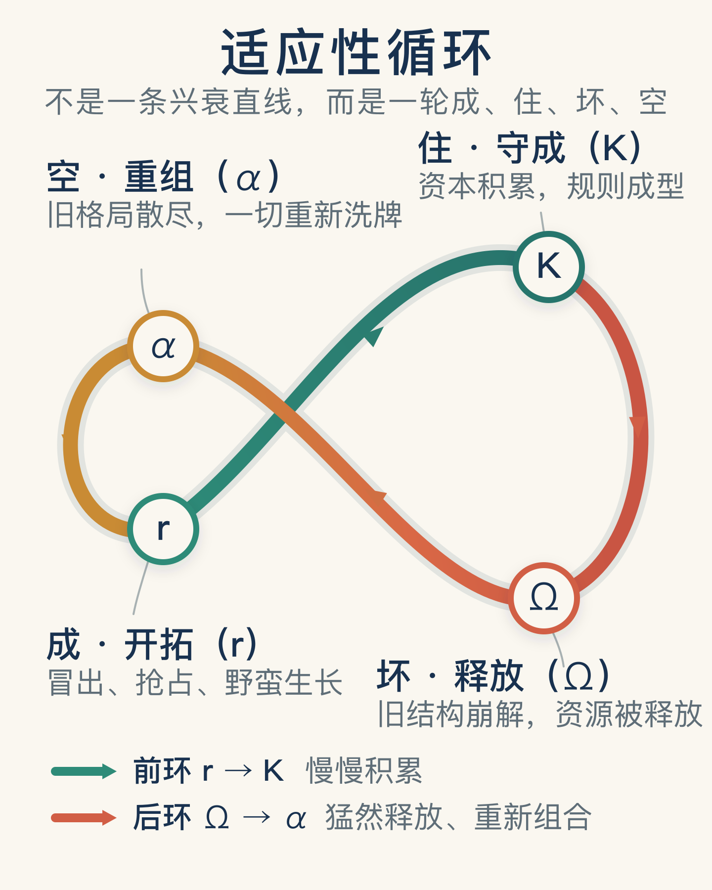
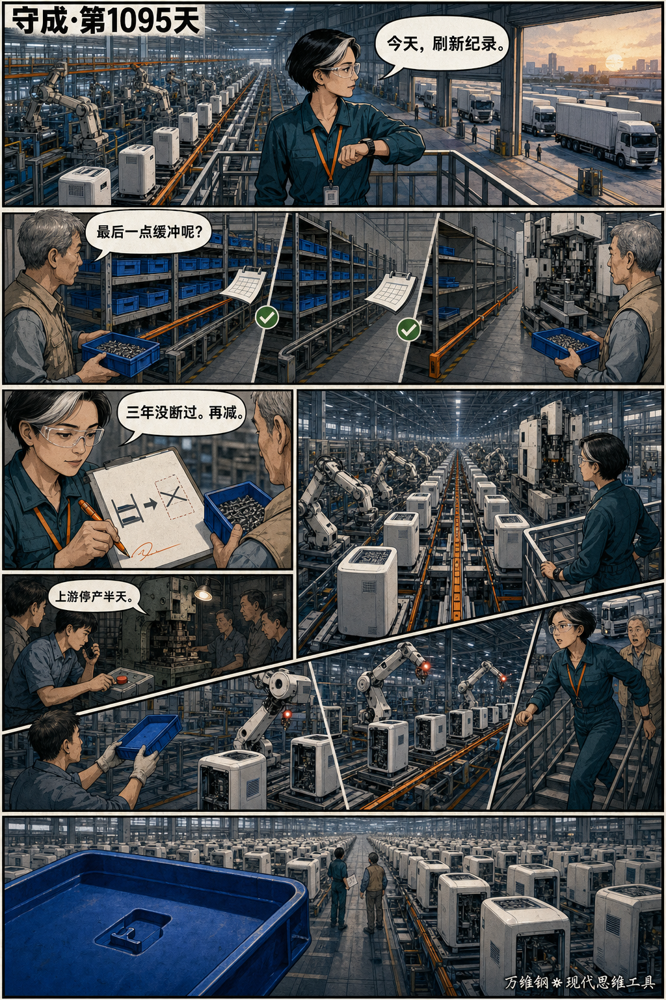
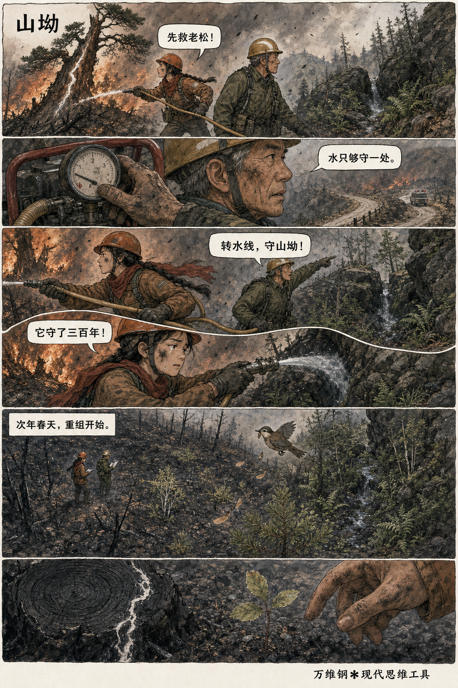
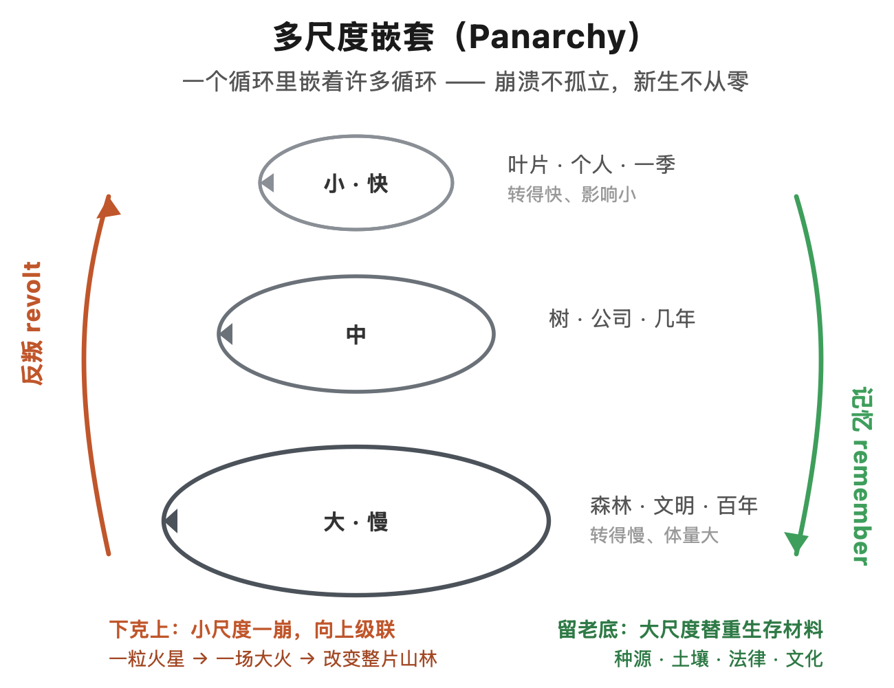
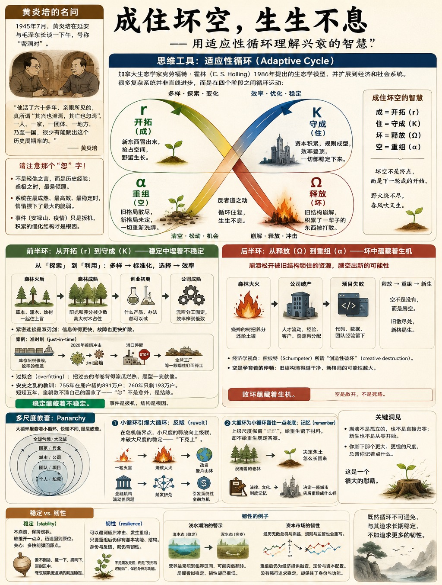

# 适应性循环：稳定蕴藏着不稳定，败坏蕴藏着生机

[适应性循环：稳定蕴藏着不稳定，败坏蕴藏着生机](https://www.dedao.cn/course/article?id=Mr9mzb36pP4JL5o3Z5XkWqB2EYNegL)

2026-07-24 22:51

1945 年 7 月，民主人士黄炎培前往延安拜见毛泽东，两人在窑洞里长谈了一个下午，号称「窑洞对」。这一下午具体都谈了些什么，毛泽东到底对民主做没做出什么承诺，后人只有黄炎培的一面之词，无从确认。不过席间黄炎培自己提的一个问题，倒是成了传世的名句 ——

黄炎培说，他活了六十多年，耳闻的不算，亲眼所见的，真所谓「其兴也浡焉，其亡也忽焉」，一人、一家、一团体、一地方，乃至一国，很少有能跳出这个历史周期率的。

这是演化者板块的最后一讲。咱们且不说如何跳出周期率，单说这个周期率本身。请你注意黄炎培用的那个「忽」字。

这可不是轻佻之言。盛唐由盛转衰，就是转在开元天宝的极盛。一个庞大的组织，往往不是垮在草台班子阶段，而是垮在流程最完善、分工最精密的成熟期。一片森林，也不是毁于树苗稀疏的时候，而是毁于枝繁叶茂、遮天蔽日的巅峰。

为什么败亡总是「忽」的？一个系统好好的，怎么在看起来最稳、最盛、最不像要出事的时候，忽然就塌了？

因为系统在最成熟、最高效、最稳定的时候，悄悄攒下了最大的脆弱。

这一讲咱们来点宏大叙事，有个思维工具叫做「 适应性循环 （Adaptive Cycle）」，也许能帮你更好地理解佛学说的「成、住、坏、空」。

✵

前面我们讲 S 曲线，讲的是一个事业、一项技术怎么从慢到快、长到头，又如何应该在见顶之前主动开启第二曲线。那如果这个东西或者体量太大，或者根本就没有自主性，没有能力主动开启第二曲线呢？那么它就会见证黄炎培说的那个结局。

但我们这里要讲一个更完整的故事。

适应性循环是加拿大生态学家克劳福德·霍林（Crawford "Buzz" Holling）—— 我们前面讲「慢变量」的时候提到过他 —— 在 1986 年提出的生态学模型。

霍林后来又把这套思路扩展到经济和社会系统。这只是一个启发性框架和隐喻，但完全可以用来观察森林、企业、城市、制度，乃至一个人的知识体系： 很多复杂系统并不是沿着一条直线一路进步，而是在四个阶段之间循环运动：

r（开拓）→ K（守成）→ Ω（释放）→ α（重组）→ 再一轮 r（开拓）。

这几个字母可不是随便选的，都出自生态学 —— 「r」代表快速繁殖的机会主义者，「K」是环境承载的极限，Ω 和 α 则干脆借了希腊字母表的末位和首位，一个象征终结，一个象征开端。霍林把这四步画成 ∞，一个躺倒的数字“8” 。

中国人会立即发现这四步就是成、住、坏、空。

\* 开拓 （r），是「成」：新东西冒出来，抢占空间，野蛮生长。

\* 守成 （K），是「住」：资本积累，规则成型，效率登顶，一切都稳定下来。

\* 释放 （Ω），是「坏」：旧结构崩解，积累了一辈子的东西被打散。

\* 重组 （α），是「空」 —— 注意，不是空无一物的那个空，而是旧格局散尽、新格局未定、一切重新洗牌的那个空档。

前文 S 曲线追踪的是一个指标 —— 用户数、性能、产量 —— 怎么增长、怎么见顶。而这里适应性循环追踪的，是指标背后的系统在增长过程中，把自己锁进了什么样的结构里。我们关心的不再是指标还能涨多高，而是系统把自己活成了什么样。

什么样呢？

如果你看见 S 曲线到了顶部，你只能看到它失去了速度；而如果你能看见系统的结构，你会发现，进入守成期（K），意味着开始……失去选择。

它还以为自己在走最有效的路，殊不知它现在只剩下那一条路了。

而周围的人们都会把“只剩一条路”误读成“这条路最可靠”。

✵

咱们先讲前半环 —— 从开拓（r）到守成（K），这个系统正在越来越稳定，可是稳定里面就埋着不稳定。

开拓期靠的是多样性：许多种活法同时试，谁行谁上。而进了守成期，靠的是标准化：找到那条最有效的路，然后把资源、人力、注意力全压上去，把效率榨到极致。

你看森林大火之后的一片空地，一开始什么都能长，草本、灌木、幼树一起往上冒；等森林长成，阳光和养分就被少数高大树木占住。公司也一样：刚创业时什么产品、什么办法都可以试；等规模做大，流程和分工就一层层固定下来。

这不就是从「探索」到「利用」吗？随着利用的加深，连接越来越紧，效率越来越高，系统对熟悉的问题越来越熟练。这一切都很好。

**但是，它对陌生的问题，也越来越迟钝。**

紧密连接是一把双刃剑。信息、资源、指令传得更快了，可一个局部的故障也能顺着这些紧密的连接迅速烧遍全局。一条高度优化、却只剩一个供应商的生产链，平时快得惊人；可只要那个关键节点断一下，整条链子就瘫了。

比如现代供应链，都把管理学的「准时制（just-in-time）」奉为圭臬，用了不知道多少年的时间，逐渐地优化、优化、再优化，把库存和缓冲压到极限，那真是效率的奇迹……可是 2020 年新冠疫情一冲，这台效率机器立刻变成了故障传送带 —— 只要有一个港口停摆，就有半个地球的工厂因为等着一颗螺丝钉而开不了工。

用机器学习的话说，守成期的系统得的是一种「过拟合（overfitting）」的病 —— 它把过去的考卷背得滚瓜烂熟，考试次次满分，可一旦题型变了，它就傻了。

可你难道能让系统不过拟合吗？明明可以再进一步提高效率，你能说我放着这个钱不要吗？你不能。从开拓走向守成，不是谁做错了，而是每一次局部优化共同造成的。守成期最危险的地方就在这里：系统不是停止优化，而是再也停不下优化。

开元天宝年间是盛唐的守成之巅 —— 版图辽阔，人口鼎盛，万国来朝，大唐是那个时代整个世界最成熟、最自信、最不像要出事的系统。然后，安禄山反了。

天宝十四载，也就是公元 755 年，大唐官方在册户籍大约 891 万户；安史之乱爆发后，到了肃宗乾元三年，也就是公元 760 年，能统计到的户数只剩 193 万。短短五年，朝廷账面上的户口掉了差不多八成。这当然包含大量死亡，但它不只是死亡数字，更是统计与控制能力失灵的数字 —— 账册还在，朝廷却数不清自己的国家了。那个曾经把一切都管得清清楚楚的成熟系统，在冲击之下「忽」的一下，就不再有能力认识自己了。

黄炎培那个「忽」字的谜底，有一半就在这里。

安禄山和疫情一样，事件只是扳机。扳机决定崩溃在哪一天发生，是几十年积累的僵化结构决定了崩溃为什么这么严重。安禄山哪有那么大本事？是盛世自己，早就把自己训练成了一个只会应付太平日子的系统。

这就叫稳定蕴藏着不稳定。

✵

再说后半环 —— 从释放（Ω）到重组（α），从坏到空。

一个王朝亡了，一家公司倒了，一片森林烧了……但坏和空并不是故事的终点，要知道事物是循环的。

适应性循环最反直觉的一个洞见，就是很多真正的新东西，恰恰要等到后半环才长得出来。崩溃不一定是创造的反面，它常常是创造的入口。

你要说「坏」，它就是个价值判断；但你要说「释放」，它就只是个事实判断。我们还可以用经济学家熊彼特（Joseph Schumpeter）的话说这叫「创造性破坏（creative destruction）」。旧系统积累了一辈子的资本，在崩坏中并不一定全部灰飞烟灭，很多只是从旧结构里被\*释放\*出来了：森林大火烧掉的树把养分还给了土壤；一家破产公司散掉的人才流进了别的组织；一个失败的项目留下了代码、数据和一支练过手的团队。

崩溃松开了被旧结构死死锁住的资源。

你要把「空」理解成「重组」，它的意思就不是没有，而是腾空：旧的东西散场了，地方就空出来了，新的才有地方长。空不是死路，空是敞开。旧结构被清得越干净，新格局的可能性反而越大。

所以空不是循环的终点，而是下一轮「成」—— 也就是「开拓」 —— 到来之前，那个孕育着的停顿。

正所谓野火烧不尽，春风吹又生。

这就叫败坏蕴藏着生机。

✵

好，开拓 → 守成 → 释放 → 重组，我们讲完了一个循环。但现实中往往不是一个循环干净地走完再开启另一个循环，而是多个循环同时运转，大循环里还嵌套着若干个小循环。

比如一片林子嵌在区域气候里，一家公司嵌在整个行业里，一个人嵌在他的时代里 —— 大大小小、快快慢慢的循环，一层套着一层。霍林把这种结构叫做「多尺度嵌套（Panarchy）」。

不同尺度的循环之间会有一些有意思的互动。

**一种是小循环引爆大循环。**通常是大而慢的尺度约束小而快的尺度，但在危机的临界时刻，小尺度的释放会反过来向上级联，冲破大尺度原有的稳定 —— 这是一种“下克上”，所以霍林称之为「反叛（revolt）」。一粒火星烧成一场大火，改变整片山林；一家金融机构的流动性出问题，触发整个金融网络的挤兑。

黄炎培说的那个「忽」的另一半答案就在这里：小尺度的崩坏，会顺着嵌套结构一路往上烧。

**另一种是大循环为小循环的重生留住一点老底。**周围没烧着的那片老林子，决定一场大火之后这块焦土怎么长回来；一个国家的法律和文化，决定一座城市灾后能重建成什么样。这叫「记忆（remember）」，它给重生留下材料，却不给重生规定答案。

理解了这些，你就知道崩溃不是孤立的，也不是直接归零；新生也不是从零开始。你脚下那个更大、更慢的尺度，总替你记着点什么。

这是一个很大的慰藉。

✵

如果成住坏空是不可避免的，如果「坏」没有那么坏，「空」也不是完全的空，那我们与其追求稳定，就不如追求韧性。

「稳定（stability）」，是不崩溃，是保持现状，是哪怕被推开一点点，还能迅速回到原位。稳定关心的是“多快能弹回原点”。它像个不倒翁，推一下，晃两下，回到正中。守成期的系统拼命追求的就是稳定 —— 别出岔子，快点复原，回到熟悉的秩序里去。

而生态学所说的「韧性（resilience）」则不保证系统毫发无损：它可以遭到猛烈冲击、发生重组；只要重组后仍保有基本的功能、结构、身份与反馈，它就仍有韧性。

比如一座清澈的浅水湖，平时风浪过后很快恢复，水草、鱼群和透明度多年不变，看上去非常稳定。可是营养盐慢慢积到临界区间，湖泊就可能突然从水草维持的清水态翻进藻类主导的浑水态。这就是局部状态看似稳定，韧性却已经很低。

再看资本市场。它经历过一次又一次金融危机和市场崩盘，指数可以暴跌，机构可以倒闭，交易规则和监管框架也会被迫重写；可是一次次重组之后，市场虽然有所演化但还是那个市场，还在为经济提供融资、定价和资本配置服务。它没有强行追求稳定，但是它保住了自己的身份和核心功能。这就叫韧性。

既然循环不可避免，我们与其追求长期稳定，就不如追求更多的韧性。

✵

成、住、坏、空。老百姓把它读成一条一路向下的斜线，读成“万物终将败坏、一切终归于空”的悲凉，感叹什么无常、看破，其实都是虚无主义。但如果你把它理解成适应性循环，这一切就都是可以接受的。反者道之动，这本来就是大自然的规律。

而且坏空不见得是坏事，没有坏空，哪有成住呢？

现在如果你突然被穿越到“窑洞对”现场，你或许可以给黄炎培讲讲这番道理 ——

从「适应性循环」的视角看 —— 注意，这是系统论的观察，不是政治学的判断 ——对于任何复杂系统来说，“跳出周期”都不是一个容易成立的系统目标。不是说找对了办法、换个明君、多加几层监督、建立民主，就能让一个政权长盛不衰。适应性循环揭示的是一种结构倾向：一个系统在持续优化中，往往会从开拓（r）走向守成（K）；走到守成，便越来越倾向于拿选择去换效率、把冗余当浪费、把「只剩一条路」当成「最可靠的路」。盛，本身就是衰的成因。所以“其亡也忽焉”不是意外，是结账。

你应该争取的不是跳出，而是韧性。大明亡了，大清来了，中华文明还在；大清亡了，中华文明仍然在。这就叫韧性。

美国 250 年，也并非长治久安，中间有无数次危机和混乱。民主制度本来就不是为了保证一位总统统治稳定，而是一种烈度更低、几年一次的治乱循环。

不要指望一个东西永不败坏，我们应该做的是给系统埋下一点冗余、一点余地、一点烧不掉的种子 —— 好让下一轮的「成」，有地方生根。

**【有偈为证】**

> 参天不觉朽其根，  
> 一炬还山化作尘。  
> 世上从无长住相，  
> 灰中已孕来春痕。

