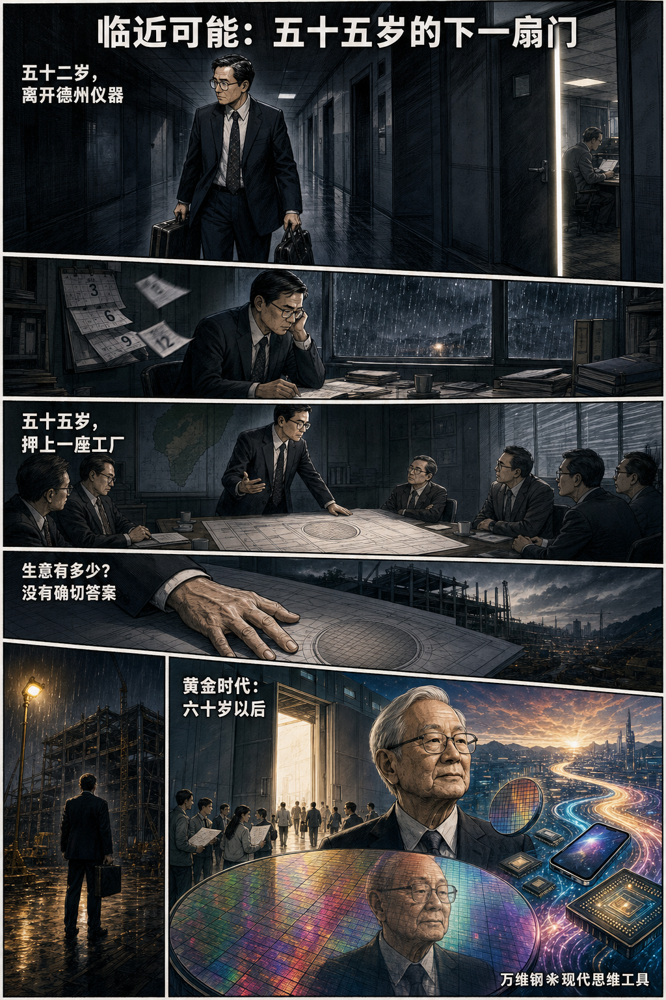
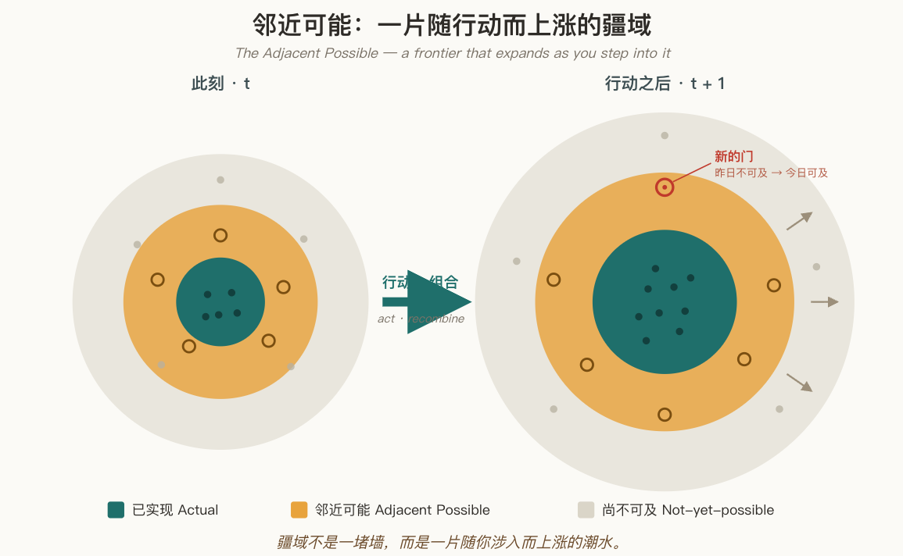
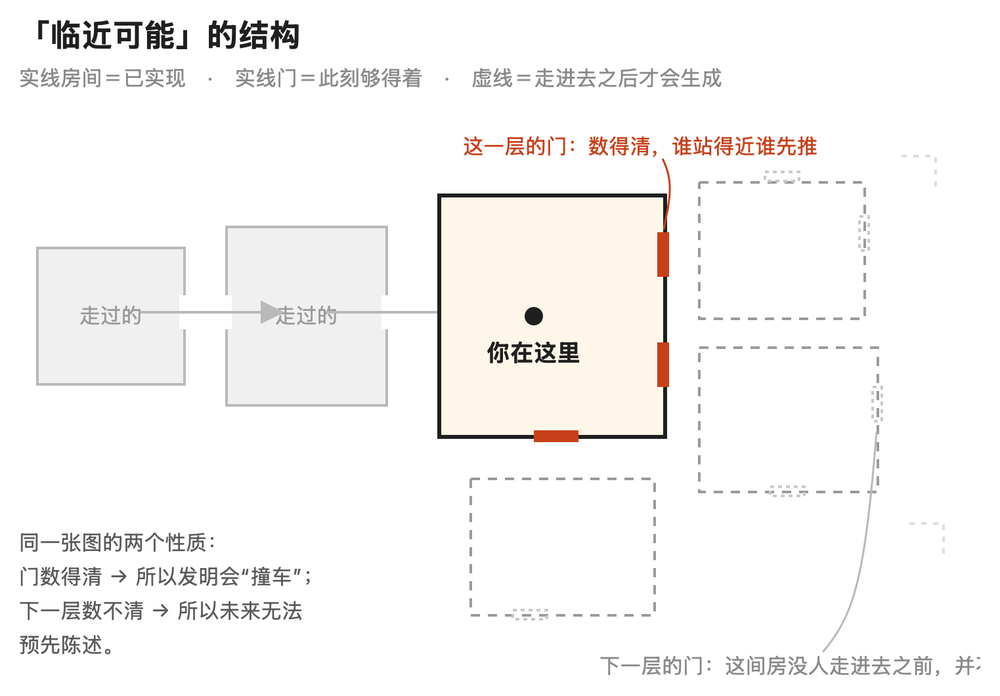
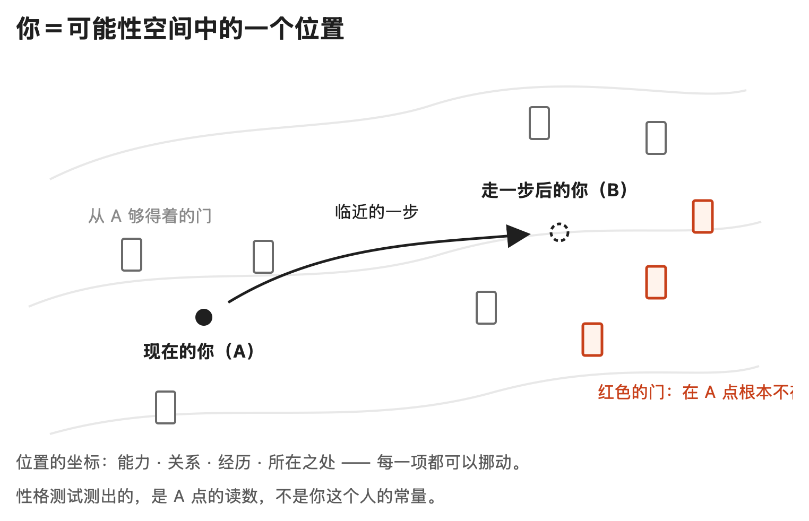

# 临近可能：如何实现无法事先想象的事情？

[临近可能：如何实现无法事先想象的事情？ ](https://www.dedao.cn/course/article?id=A5eO3NDrGk8KP0ompLK2oxp9MRBzQP)

2026-07-16 23:20

上一讲咱们说了偶然怎样冷却成命运 —— 对称性破缺，讲的是门怎么关上。那听起来有点令人沮丧。但是，即便年龄增长，在有些情况下，有些你从未想到的门会为你打开。这一讲咱们就说说门是怎么打开的。

想象有个少年，原本一心想当作家。可是 17 岁这年，父亲告诉他当作家会饿肚子，他只好改学理工。

18 岁，他幸运地获得赴美读书的机会，可能也想过当科学家。可是 24 岁这年，他在麻省理工学院两次博士资格考试中落榜，深感受挫，心想算了吧，找工作。他拿到两个机会：福特汽车月薪 479 美元，一家叫希凡尼亚的电子公司 480 美元。他本想去福特，打电话让对方多给 1 美元，竟然被拒绝了。于是去了希凡尼亚。

你看，作家不能当，科学家当不成，大厂也没进，最后去了个不那么知名的小公司。有人说人生大部分事情是三十岁以前决定的，这不就是一个最普通的好学生剧本吗？也许干个几十年退休，此生就这样了。

但此人是张忠谋。只不过他那时候还不知道自己会成为今天这样的张忠谋。

张忠谋 1958 年跳槽加入德州仪器 —— 而恰好在同一年，杰克·基尔比（Jack Kilby）就在德州仪器造出了世界上第一块可工作的集成电路。张忠谋展现了管理才能，从生产线工程师一路做到统管全球半导体业务的资深副总裁，是公司第三号人物。

然后剧本急转直下：进入七十年代，德州仪器把宝押在计算器、电子表这些消费电子上；可是张忠谋并不认同，竟被一步步挪出权力中心。张忠谋在 52 岁这一年辞职，转投的下一家公司也只干了一年上下，不欢而散。

我们能看出来张忠谋是个特别有想法的人。可是三十年美国职场，他终究没能成为任何一家公司的一号人物。现在五十多岁了，还能怎样呢？

54 岁，他去台湾出任工研院院长。本想搞搞改革，可是没啥根基，也是里外不讨好。按一般认知，这个岁数的人混几年退休算了。

可就在 55 岁这年，张忠谋创办了台积电……剩下的就是历史了。

张忠谋在自传里说：「如要我挑选我的黄金时代，我毫不犹挑选六十至八十五岁那两个半单位」。

60 岁才迎来黄金时代，而且长达 25 年，你能想象吗？人们常说要“做自己”，要找到真正的热爱，要实现自我 —— 可是 17 岁的张忠谋以为真我是作家；52 岁的他也不知道此生最重要的事业还没开始。“专业晶圆代工”这个行业，那时候根本不存在……

那是后来他发明的行业。

要理解这样的人生，你光往一个人身上看是不行的。这不是个人努力什么的所能解释的。我们必须考察一个更大的问题：一项事业、一个物种或者随便什么新东西，到底是怎么冒出来的？

这一讲的思想工具叫做「 临近可能 （the adjacent possible）」。

✵

「临近可能」是理论生物学家斯图尔特·考夫曼（Stuart Kauffman）提出并发展起来的概念。考夫曼是复杂性科学重镇圣达菲研究所（Santa Fe Institute）的元老，2000 年在《调查》（ *\*Investigations\** ）一书里系统展开了这个概念。

考夫曼说：**任何系统在任何时刻，周围都存在一圈“只差一步就能实现”的新状态 —— 用现有的零件，做一次组合、一次改动就够得着的东西。这一圈，就是这个系统此刻的临近可能。**

生命起源，就是不断把临近可能变成现实，一步步走出来的：原始地球的化学汤里本来没有 DNA 的位置，只有一些简单分子。可是简单分子能组合成稍复杂的分子，而每一种新分子一旦出现，又让一批此前根本不可能发生的化学反应变成了可能……

就这样，可能性的边界，会随着每一次对之前可能的“实现”，向外扩张。

2010 年，科普作家史蒂文·约翰逊（Steven Johnson）在《伟大创意的诞生》里用一个比喻把临近可能这个概念讲给了大众：你身处一栋魔法房子，推开一扇门，走进一个新房间 —— 而这个房间的墙上，又长着几扇你在上一个房间里根本看不见的新门。

以我之见，临近可能这个学说的根本，是把创新从「以人为本」变成了「以可能性为本」 ——

关键不在于你聪明不聪明，你必须先实现一种可能性，才能打开新的可能性。你必须先进入那个房间，才能打开那扇新门。

✵

临近可能理论立即就能解释科学史上的一个悬案：重大发明为什么总是“撞车”。

牛顿和莱布尼茨各自发明了微积分，达尔文和华莱士几乎同时想到自然选择，贝尔和格雷干脆在 1876 年 2 月 14 日同一天为电话递交了专利文件。1961 年，哥伦比亚大学社会学家罗伯特·默顿（Robert K. Merton）通过系统考察科学史，得出结论：多人独立、几乎同时做出同一个重大发现，不是例外，是常态。

如果灵感真是天才头脑里的神来之笔，怎么会这么巧，灵感同时进入两个天才的头脑呢？

我们只要把创新看成推门，一切就都合理了：大家住在同一栋房子里，走廊尽头那扇新门是房子自己长出来的 —— 那几个人恰好同时站在门口，同时发现了那扇门，这不是很正常吗？

2009 年，圣达菲研究所的经济学家布莱恩·阿瑟（W. Brian Arthur）把这个逻辑推广到一切技术，叫「组合进化（combinatorial evolution）」：新技术全都是已有技术的组合，而每一项新技术一出生，立刻变成下一项新技术的零件 —— 于是工具箱越大，创造新工具就越快，这就是技术加速的根源。

连国家的命运也是如此。2007 年，物理学家出身的塞萨尔·伊达尔戈（César Hidalgo）和哈佛大学经济学家里卡多·豪斯曼（Ricardo Hausmann）等人在《科学》杂志发表了「产品空间（product space）」研究：他们把全球贸易画成一张网络，发现国家的产业升级通常不是凭空跳跃，而是先做成跟现有能力“相邻”的产品，再从新位置去够下一个 —— 中国从纺织服装、家电制造，到手机、电子零部件和新能源汽车，也是沿着相邻能力一步步扩展过来的。

这你就明白那些所谓“美国利用外星人技术搞出 iPhone”之类的阴谋论是站不住脚的了。如果是外星人技术，你根本找不到它的演化图谱！现实是每一项新技术都是沿着一系列临近可能实现出来的。

哪有什么天降神迹？我们无非是因为去到某个房间，才能打开某一扇门罢了。

✵

我们这门课程前面讲过的几个思维工具，都跟临近可能有关系 ——

\* 「 **效果推理** 」说，创业不是先想好一个产品再去找资源，而是先看自己手里有什么，再看这些东西能组合出什么；

\* 「 **状态杠杆** 」说，做任何事都别做完就算了，要为下一步预留状态；

\* 「 **能耐寻求定理** 」说，最优策略不是追求一时回报，而是前往能给下一步打开更多可能性的地方。

它们视角不同，但都有“走一步看一步”的意思 —— 而临近可能，还有一层更激进的意思 ——

这一步走完，打开新的可能性，你心中的世界就不是原来那个世界了。

✵

2012 年，考夫曼和巴黎高等师范学院的数学家朱塞佩·隆戈（Giuseppe Longo）、生物学家马埃尔·蒙泰维尔（Maël Montévil）提出一个更强的主张：在生物演化中，不仅未来的状态不可预测，连未来可能空间里会出现哪些变量、哪些功能、哪些生态位，都无法预先完整列举。他们称之为「 不可预先陈述性 （unprestatability）」。

用我们前面讲过的概念来说，这是一种「奈特不确定性」：未来的可能性，你想象都想象不出来。用考夫曼他们的话说：演化没有运动方程（“We cannot write equations of motion for the evolving biosphere”）。

考夫曼爱举的一个例子是这样的：请你列出一把螺丝刀的全部用途。

你能想到很多：拧螺丝、撬油漆罐、抵门、当凶器、做雕塑、削铅笔……但是你绝对列不完。

这是因为“用途”不是螺丝刀的内在属性 —— 它是螺丝刀跟所有场景的组合，而未来的场景还没长出来。

比如 1960 年激光刚被发明出来的时候，研发人员都不知道这东西有什么用，还自嘲说，这是“一个寻找问题的解决方案” 。当时没有人能列出超市条形码、光纤通信和近视手术，可后来撑起激光产业的恰恰是这些用途。

把不可预先陈述性用在人身上，就是你学会一项新本领、拿出一件新作品、到达一个新身份，或者认识一群新人之前，不可能提前预测到时候你会得到什么。因为你那个新构件会跟别的东西，也许也是新东西，发生组合。

就拿现在来说，像“电竞选手”“带货主播”“智能体工程师”这些岗位，就是上一代的人连想都想不到的。

就如同张忠谋 55 岁创办台积电的时候，纯晶圆代工商业模式还不存在。当时只有几家小设计公司感兴趣。英伟达要到六年之后，也就是 1993 年才成立。

因为不可预先陈述性，张忠谋不可能预先算出来台积电能有多大生意。他等于是给一个还没出生的产业先修了一座工厂。

可是如果你不把这个工厂建起来，那个行业就不会出现。事实上张忠谋赌对了：台积电一旦真实存在，设计者从此不需要几亿美元建厂，一张图纸就能开公司，“无厂芯片公司”这个物种才得以大规模繁殖。高通、英伟达、联发科、苹果的芯片部门都在这个生态位上。

张忠谋不可能预见到智能手机和 AI 芯片，那些是临近可能的临近可能……的临近可能 —— 但是你不实现第一个可能，后面就都没可能。

不可预先陈述性说，你无法提前忠于一个还不存在的自我，你只能走过去，把它走出来。

✵

打开临近可能的操作心法很简单，你的行动要满足三个条件 ——

**第一，它必须是临近的。**

它不是一步登天，而是用你现有的知识、资源、关系，再加一次够得着的伸展，就能做成的事。你希望它足够新，才打得开新门；但它也必须足够近，才能被实现。

**第二，它必须留下一个现实的构件。**

你一次行动结束之后，这个世界上应该多出一样东西：一篇文章，一个原型，一项经过实战检验的能力，一段共同做成过事的关系，一小群真实的用户。反过来说，仅仅“学过”“想过”“认识过”“计划过”，世界不会有任何变化。

**第三，它必须能参与下一次组合。**

评价一件事，别只问“它现在给我什么回报”，要问“它做完之后，还能长出什么”。

第一条说的是「探索」，后两条说的是「利用」，或者说得直白一点：你得 commit。你得真投入进去，真下本钱，真做出个什么东西来才行。

临近可能不是一个关于「期权」的学问。保留所有选项不会给你带来新的选项。你必须 commit 到一个选项上去，为此不惜放弃别的选项，才能打开下一扇门。

这就好比有两个工程师。甲的收藏夹里存着一百个绝妙的点子。他谁也不告诉，怕被抄；也迟迟不动手，因为一旦做了这个就等于放弃了别的。乙只有一个不怎么样的点子。他花两个月把它做成一个粗糙的小工具，发布了。

那个工具招来一堆吐槽，但吐槽里藏着真需求；乙照着改了三版，有了第一批用户；用户里冒出一个懂行的，拉他合作；合作做出的第二个东西，被一家公司看中……结果三年间，乙变成了他自己原来根本想不到的样子。他现在拥有很多新的可能 —— 以前不可能的可能。

可是甲，仍然抱着之前那一百个可能。

世界不会对你的潜力作出反馈，它只对你已经做出来的东西作出反馈。而反馈，会改变你。

✵

看几个应用场景 ——

先说**学习**。最好的学习单位不是“一门课”，而是“一个略高于当前能力、几周内能做出作品的项目”—— 这句话里的三层限定，正好对应上面三个条件。上完课，世界里只多了一张描述你的证书；做完项目，世界里多了一个会替你说话的东西。

再说**职业**。比较两个 offer，大多数人比薪水、头衔、公司名气 —— 这些衡量的都是“这一步本身值多少”。你应该再加一个维度：干满三年，我手里会多出什么？

有的工作光鲜，但内容高度封闭，三年下来除了工资单什么都没留下；有的工作看似平平，却让你攒下几个能搬走的构件。中年转行最可靠的方式不是抛弃过去重新投胎，而是把过去攒下的模块搬进一个新组合。

还有**AI**。AI 让所有人面前突然多出一批变便宜的零件 —— 编程、翻译、设计、写作、调研，很多人说“AI 会不会取代我”。这其实是一个错误的问题，你问的是过去的可能性。

正确的问题是搜索临近可能：我已有的哪样本领，加上这些新零件，能组合出一个上个月还不存在的动作？你的临近可能刚刚被 AI 扩了一整圈知道吗？！你得关注新出来的领地才对啊。

✵

在临近可能的视角下，我们不妨重新审视一下相关的传统智慧。

比如说，什么叫好高骛远？什么叫脚踏实地？难道说，目标定得高，就叫好高骛远；守着自己的一亩三分地，就叫脚踏实地吗？

只要你想做的那件事在你的临近可能范围之内，哪怕听起来特别高级，它也是合理的。而如果这件事不在你的临近可能范围内，哪怕是去工地搬砖，也不能叫脚踏实地。

临近可能还进一步告诉我们：你所处的位置，比你是个什么人，要重要得多。不同地理位置对应的是不同的可能性空间。而你的能力、你的关系、你的经历，本质上也是可能性空间中的一个位置。

你要做的不是追问“我是谁”，不是去发现什么真我，也不要问我的性格是什么、我的爱好是什么，那些只不过是一个暂时的位置而已。

前往下一个位置，你会发现现在的你想象不到的可能。

**【有诗赞曰：】**

> 天下新芽近处萌，  
> 门开门后又门生。  
> 莫将此身先画定，  
> 走到无名处自成。

又曰（化用苏轼《和子由渑池怀旧》）：

> 鸿飞那复计东西，  
> 且把爪痕印雪泥。  
> 回首来时无路处，  
> 点点相连已成蹊。

