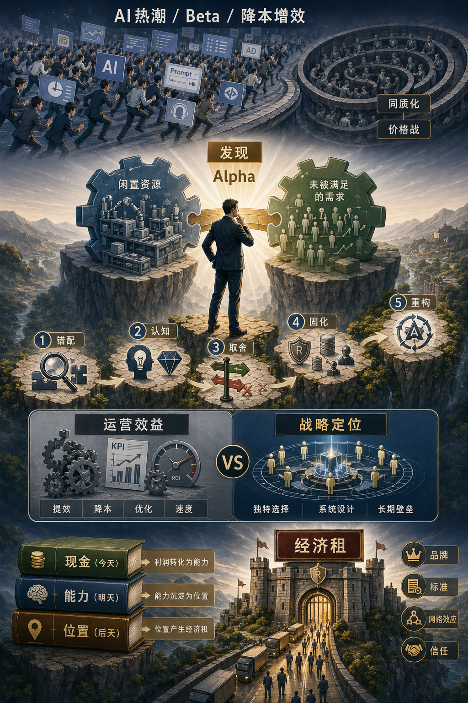

# 阿尔法：优势战略意识

[阿尔法：优势战略意识](https://www.dedao.cn/course/article?id=qzNakylrn9WVaZWMmbJ7DOop10vZwL)

2026-05-21 23:36

现在人人都在追 AI，你也没落后。别人学提示词的时候你也学提示词；别人养龙虾的时候你也养龙虾；别人把广告、周报、代码、客服都接上大模型，你也都接上了。你每天追逐各种流行趋势和最新工具，都有点 FOMO（害怕错过症）了……

这一切都很好，我也是其中一员。但是有一个根本的问题你想过没有：你只想跟别人一样吗？

又或者你也曾经梦想取得某种了不起的成就，公司能一飞冲天？那你就必须回答这个问题 ——

凭什么，是你。

你到底做了什么别人做不到的，以至于天大的好事儿能落在你头上？

我们上一讲说了，要捕获超额价值就得拿到某种「**经济租**」。当然你不是董事长的小舅子，我们也不想要那种靠关系和行政壁垒搞出来的坏租，我们想要谋求的是好的经济租 —— 你具备某种降维打击的技术优势、你享有一项无法绕开的专利保护、你拥有人气超强的品牌声望，或者你搭建了一个别人离不开的平台 —— 如果你有这些，你不需要 FOMO。

**好租不是从天上掉下来的，一定是你做了一些别人做不到的事情，而积累出来的成果。单单会用 AI 可给不了你租，因为 AI 是一种通用技术，别人也能用。你得有一个超出友商的优势才行。**

金融学里有两个概念：「Beta（贝塔）」和「Alpha（阿尔法）」。Beta 是一只基金对市场共同风险的暴露，代表它“跟着市场走”所应得的那部分回报；**Alpha 则是在扣除这部分市场因素之后，基金所获得的风险调整后超额收益。**

我们把这两个概念借用过来，简单说：Beta 是你搭市场顺风车得到的收益，Alpha 则是你超出市场共识、靠更高一层的认知、判断和动作，硬生生多拿到的那部分收益。

Beta 只能让你在市场中存活，只有 Alpha 才能给你积累经济租。

想要出类拔萃、建功立业，你得有 Alpha 意识。

这可不是特别寻常的道理。你要知道，经济学家原本不相信有 Alpha 存在。

新古典经济学倾向于假设市场是完全信息的，人是绝对理性的，所以一切事物都应该处于均衡状态。你发明一个什么新东西卖得贵，别人就会受到激励，就会迅速发明一个跟你类似的东西，卖得比你便宜 —— 这样所有信息都瞬间反映在价格上，那就谁都没有获得超额利润的空间。

如果市场是绝对均衡的，你根本就不值得费力做生意，因为你不管干什么事儿的回报率都是一样的。你之所以愿意出来做生意，就是因为你相信你的竞争优势不会被人家瞬间抹平，对吧？

1968 年，哈耶克（F.A. Hayek）提出一个洞见：「**竞争是一个发现程序**（Competition as a Discovery Procedure）」。哈耶克说现实世界里的知识是高度分散的，市场并不透明，永远都存在被低估的需求、被闲置的资源和没有被利用的机会。

换句话说，这个世界充满了「错配（Mismatch）」，所以市场是普遍\*不均衡\*的。

在哈耶克的基础上，同属奥地利学派的伊斯雷尔·柯兹纳（Israel M. Kirzner）进一步提出，企业家的任务就是纠正错配。他发明了一个说法叫「**企业家发现**（Entrepreneurial Discovery）」：市场一直都充满错配，真正的企业家都是具备高度「**警觉性**（Alertness）」的人，他们能敏锐地察觉到错配，并且通过纠正错配来赚取利润。

说白了，你赚钱是因为你发现并且利用了市场的不均衡 —— 而恰恰因为你的存在，市场变得更均衡了一点，也就是错配少了一点，效率高了一点，这就是你的贡献。

比如中国改革开放之初，一边是农村有大量的劳动力没事儿干，一边是城市里人连个电风扇都买不到，这就是错配。你办一个乡镇企业，农民找到了工作，城里人买到了便宜的电器，这就是纠正错配。那你这难道不就是最正当、最高尚的赚钱方式吗？

如果只有你在纠正错配，这就是你的 Alpha。可是如果大家都在开公司纠正类似的错配，那这就只是 Beta。志存高远的企业家不但要发现错配，而且要发现高价值错配，而且要以别人暂时做不到的方式，把这个错配纠正成自己的成果，这才叫有 Alpha。

如果你有 Alpha 意识，你会认识到公司的日常运营活动不是 Alpha —— 你必须主动搜寻机会，特事特办，专门布局才能捕捉 Alpha。

这就引出了公司的战略问题。

1996 年，哈佛商学院教授迈克尔·波特（Michael Porter）发表一篇雄文，叫《什么是战略？》（What Is Strategy?），提出： 「运营效益（Operational Effectiveness）」和「战略定位（Strategic Positioning）」是两回事。

**运营效益是说你在日常的活动上做得比对手更好，比如说搞搞管理，你们的速度更快、成本更低 —— 这些事儿原则上对手也都在做，只不过你做得稍好一些而已。**而战略定位，则是说你要么执行了一些与对手完全不同的活动，要么以完全不同的方式执行一些活动，以至于你有一个对手无法模仿的优势。

咱们就拿航空公司来说。运营效益是大家都飞同样的航线、卖同样的票，只不过你把调度做得更精、飞机周转得更快、采购压得更狠。这些当然也重要，但别人迟早也能学会。战略定位，却是你必须换一套打法。比如美国西南航空，直接改成只做短途高频航线，所有航线采用单一机型，再加上简化服务 —— 这不是一般的成本优化，这是围绕“快速周转”这个目标重新设计整套运营系统。

大多数人整天忙忙碌碌，无非是在优化运营效益，也就是完成 Beta 而已。而 Alpha，只存在于你们独特的战略定位之中。

波特的警告是：**你要搞战略定位，就一定要有痛苦的「取舍（Trade-offs）」。**你必须专注于某个错配，那么你就必须放弃其他市场。如果你这也要那也要，不敢大刀阔斧地押注方向，你凭什么取得别人没有的 Alpha？

在波特这个视角下，用 AI 降本增效根本就不是战略。裁掉一半程序员，再裁掉一半运营，看看别人有什么 best practice（最佳实践）你就模仿一下，把流程理顺建立 SOP……所有这些的确都能提高生产力，但如果你只做这些，你就会跟竞争者越来越像 —— 这是没有前途的，因为你其实是在同一个赛道上和对手比拼谁跑得更累：

竞争高度同质化 → 演变成价格战 → 利润率蒸发 → 失去健康的现金流 → 没有多余的钱研发新的 Alpha → 消费者会认为你们提供的就是个廉价产品 → 失去品牌资产和创新能力。

**低利润率是一种耻辱。降本增效不是进攻而是防守。想要 Alpha，你得进攻才行。**

我们可以把一家公司想象成三本账 ——

\- 第一本是现金账，管今天；

\- 第二本是能力账，管明天；

\- 第三本是位置账，管后天。

日常运营主要盯第一本账，所以它天然喜欢 KPI、周转率、毛利率这些数字。战略意识盯的是第二本账：我们今天这点利润，到底买回来了什么别人一时学不走的能力？等能力再沉淀成品牌、标准、默认入口、网络效应和信任，第三本位置账才会变厚。

利润是今天的结果，能力是明天的原因，位置是后天的统治 —— 如果你真的形成统治，那也就是经济租。

Alpha 是动能，经济租是势能。Alpha 是你主动出击、纠正错配的动作；而当你把这个动作的战果转化成品牌、专利和网络效应之类的防御堡垒的时候，它就凝固成了经济租。

如你所能想见，大多数公司并没有 Alpha 意识，谈不上什么战略定位。如果你们公司已经陷入价格战疲于奔命，那你当然没有资金去研发什么 Alpha。可是如果你们公司运营状况良好，资金充足，你们多数也不会想要去寻找新的 Alpha。

这里有一个我们前面讲过的「探索与利用（Explore / Exploit）的权衡」问题：当前打法我们已经很熟练了，我们已经做了很好的优化！我们为什么要放着现成的优势业务不好好利用，非得把资源挪开，去探索什么新东西呢？核心能力很容易反过来变成核心刚性，不可挑战。

这就是为什么巨头会给后来者留下机会搞「颠覆式创新」。

**如果你只想降本增效守住旧租，你早晚会被人家的 Alpha 颠覆。**咱们看几个对比案例。

今天的年轻人也许不知道，曾经有个人人皆知的品牌叫“柯达（Kodak）”，它是卖照相机胶卷的。你可能以为柯达消失是因为他们没有发明数码相机，但恰恰相反，柯达比很多竞争者更早发明了数码相机。但是他们的管理层认为传统胶卷业务才是自己的优势所在，选择把资源继续投入到对现有胶卷生产线的降本增效上 —— 他们失败是因为选择守住自己的租。

对比之下，光刻机巨头 ASML 在深紫外光刻（DUV）时代已经是赢家了，但是他们可没指望把老路再榨干一点；他们主动押注极紫外光刻（EUV）。现在 ASML 是全球唯一的 EUV 光刻系统制造商，但是他们没打算给人弯道超车的机会，正在积极推进下一代光刻技术，叫“高数值孔径极紫外光刻（High NA EUV）”。

美国曾经有两个零售巨头，一个叫 Kmart，一个叫 Sears，一度面临沃尔玛和 Target 的强烈竞争。这两家公司一看，我们不能坐以待毙啊，干脆我们合并吧，成为一个更大的巨头！合并了，我们就有更大的规模效应，我们可以削减管理费用，我们可以共享供应链，对吧？**他们并没有创造新的体验也没有研发新技术，他们只是想通过财务报表上的数字削减来赢得竞争……结果这两家老店一个就此衰败，一个直接破产。**

对比之下，英伟达当年面对巨头英特尔和 AMD 也是打不过，但人家可没想通过降本增效来应对，而是搞了个叫 CUDA 的新平台，想把学术界和工业界锁定在自己的 GPU 生态之中……在长达十几年的时间里，CUDA 是一个纯粹的投资，没有什么爆发性的财务回报 —— 但那是一个 Alpha 投资。后来 AI 爆发，CUDA 成了万亿美元帝国的租。

当 iPhone 横空出世，改变了手机市场竞争维度的时候，诺基亚心想，没事，我们有无与伦比的硬件制造效率，我们有超强的供应链成本控制能力，我们比苹果价格便宜，我们的性能更可靠！结果被时代抛弃。

对比之下，Airbnb 进军旅游业的时候，酒店早就是一个高度发达的行业，用互联网订房间也早已成熟。他们并没有想着再给你来一波降本增效。他们反而发现私人住宅闲置是一个错配，他们认为阻碍匹配的核心不是技术，而是信任。于是 Airbnb 搭建了一个租客和房东的互评体系，用创始人亲自挨家挨户敲门、免费帮房东拍摄专业高清照片的冷启动方式，人为创造了标准化信任……它硬生生地搭建了一个新的平台。

**总想把老一套做得更好，真是人的本性啊。但你所有的勤奋都会沉没到 Beta 里。**

我们把上面的拼图放在一起，总结出一套从 Alpha 到经济租的心法，分为五步 ——

第一，**错配**。别只知道说“我擅长什么”，你得问哪儿有高价值错配。是需求和供给错配，价格和价值错配，用户痛点和行业共识错配，还是技术可能性和组织能力错配？

第二，**认知**。这个错配，为什么偏偏轮到你来纠正？你到底看见了什么重要、但还没被充分定价的真相？你手上有什么独特的东西 —— 是知识、品味、渠道、资本耐心、客户理解、声誉、文化，还是对一手现实的长期贴身观察？

第三，**执行**。没有取舍就没有战略。你下决心做什么，就必须回答“我们不做什么”。你必须砍掉一些看起来很有希望的选项，你必须得罪一些人，你必须容忍一些指标暂时变得难看。正因为这是艰难的取舍，别人才无法模仿 —— 他们会被旧业务绑架，会被品牌定位限制 —— 他们即便知道你这个战略也动不了，所以才能成就你的 Alpha。

第四，**占有**。一旦取得优势地位，你如何把优势沉淀成经济租？别忘了价值创造不自动等于价值捕获。你必须占有我们上一讲说的「**互补性资产**」，把内功外化成品牌、合同、数据、标准、默认入口、人才磁场、用户习惯或者供应链控制。

第五，**重构**。任何经济租一旦过于舒适，就会腐蚀警觉。不要小看天下英雄，别人会创造他们自己的 Alpha，颠覆你的租。所以你最好有再造 Alpha 的能力，利用过一段时间、积累了资源，就要再去探索。

你立即就能看出来，**这里最关键的是第二步，也就是凭什么由你来纠正这个错配 —— 你手上一定有某种独特的东西。**这听起来是个悖论：有独特的东西才能有 Alpha，但 Alpha 不就是独特的东西吗？这不是同义反复吗？

其实不然。有一点异质性的人很多 —— 可能你会一点小众的技能，拥有一点别人没有的一手观察，懂一点跨领域的理解，又或者你在某个非常特定的场域之中，积累了一点信誉 —— 这些东西本身并不构成 Alpha：只有把它们组合起来，放到具体的错配上，才有可能形成 Alpha。

但的确，你要有点特点才好。

世间多数人能有个地方安稳地生活，领一份 Beta 收入就很满意。但是也有少数人，或者说极少数人，感觉不到自己的 Alpha 就会坐立不安。

**商业竞争也好，人生博弈也罢，我们想要的 Alpha 绝不是“我比你更努力”那种线性勤奋，而是“我比你更早站在一个尚未被社会充分定价的真相上”。**

你要找到那个真相，你要成为几项异质性特点的组合，你要大胆实施一个战略定位。如果可以选，我们选择把 Beta 留给别人。

