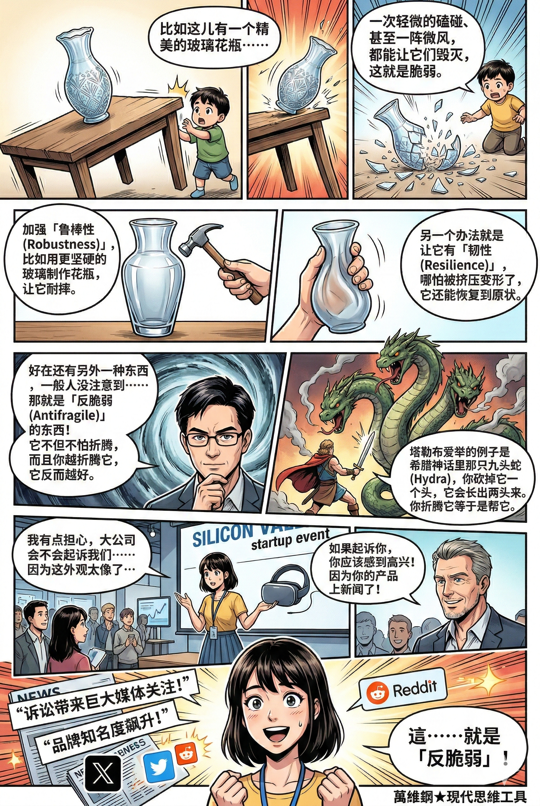
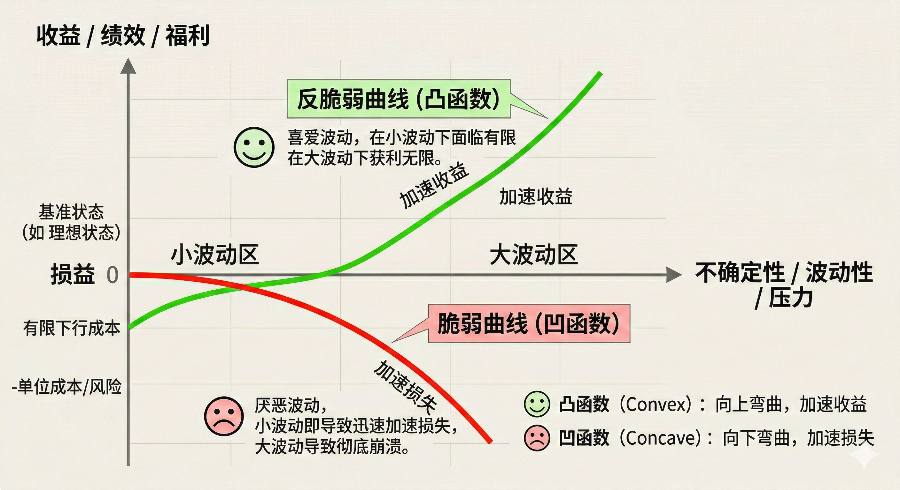

# 脆弱和反脆弱：怎样利用非对称风险（得到课程讲稿 + AI 加工段）

# 脆弱和反脆弱：怎样利用非对称风险

[脆弱和反脆弱：怎样利用非对称风险](https://www.dedao.cn/course/article?id=ykaNlMY5gn3Jq1WBn2J7EAROW0DLje)

<cite doc-id="SG7lwLTxAiKh97kbnRhcnGgInAb" file-type="wiki" title="《反脆弱》" type="doc"></cite>

纳西姆·塔勒布的「**反脆弱（Antifragile）**」一说早已脍炙人口，但是它实在太过重要而且的确有点反常识。

老百姓的常识是希望“别出事儿”。我们盼望孩子无灾无难地长大，有的学校连课间十分钟的户外活动都给取消；我们谨守规矩，最好一辈子都像学生上课一样，按部就班操作就能得到回报；我们像念经一样祈祷安全。

只有亡命之徒才高喊什么“富贵险中求”，我们默认“冒险家的乐园”不是好地方。殊不知那些朴素、善良、安分守己的人，命运掌握在别人手里，往往连“不出大事儿”都做不到 —— 反倒是有些爱折腾敢冒险的人，不但得到富贵，而且也没出事儿。

这个秘密是：有时候你越安稳就越危险，越折腾反而越安全。

关键不在于有没有风险，而在于你面对的是什么样的风险：是脆弱的，还是反脆弱的。

「 **脆弱 （Fragile）**」的东西不喜欢波动。比如这儿有一个精美的玻璃花瓶，或者一把悬在头顶的达摩克利斯之剑，一次轻微的磕碰、甚至一阵微风，都能让它们毁灭，这就是脆弱。

**为了防御脆弱，一个办法是加强所谓「鲁棒性（Robustness）」，比如你可以用更坚固的玻璃制作花瓶，让它耐摔。另一个办法就是让它有「韧性（Resilience）」，也就是说哪怕被挤压变形了，它还能恢复到原状。**

鲁棒性和韧性都意味着你要留出一些冗余，不能可丁可卯：这样万一遇到的冲击比你设定的稍微大一点，也不出大问题。巴菲特说投资要留「安全边际（Margin of Safety）」，就是这个意思。防御脆弱是有成本的，你不得不花。

可如果不让孩子去户外玩耍也是一种必要的安全边际，我们这个世界可就太没意思了。

好在还有另外一种东西，一般人没注意到，那就是**「 反脆弱 （Antifragile）」的东西：它不但不怕折腾，而且你越折腾它，它反而越好。**

塔勒布爱举的例子是希腊神话里那只九头蛇（Hydra），你砍掉它一个头，它会长出两个头来。你折腾它等于是帮它。

我有一次参加硅谷创业者活动，现场一个大学生，说她的创业项目是模仿苹果耳机的外观做了一款 AI 耳机，有点担心苹果会不会起诉他们……没想到一位大哥说：如果苹果起诉你，你应该感到高兴！因为你的产品上新闻了！

没错，对于一家寂寂无名的初创公司来说，被大厂起诉其实是一种荣幸。全网骂你都不要紧，你得到了关注和流量。侵权官司都很难打，还没定论之前你已经收获了实实在在的转化。这就是反脆弱 —— 这也是为什么苹果一般不起诉小公司。

脆弱和反脆弱可不是塔勒布随便说的，它们有严格的数学含义，咱们稍微说一说。我们需要考虑一个「收益函数（payoff function）」曲线。像下面这张图，曲线的横坐标代表一种风险的不确定性、波动性的大小，压力或者折腾的程度；纵坐标代表你因为冒这个险而得到的收益、绩效或者福利，正的代表收益，负的就是损失。

「脆弱」的风险曲线形状像一个倒扣的碗（∩），又像是不高兴撇嘴的表情，在数学上叫凹函数，英文叫 concave。它的特点是：就算有点收益也不多，可是波动越大损失就越大，向下不见底，可谓是“收益有天花板，损失像无底洞。”

「反脆弱」曲线的形状则像一个正放的碗（∪），又像是微笑的表情，在数学上叫凸函数，英文叫 convex。它的特点是就算有损失也不多，但是波动越大收益就越大，向上不封顶。

为什么我们喜欢反脆弱？数学道理是所谓**「詹森不等式（Jensen's Inequality）」：对于一个凸函数的系统来说，事物在波动状态下产生的平均收益，必定大于事物在平均状态下产生的收益。**你对着曲线画个图就能明白，不过你只需要记住反脆弱曲线“损失极有限，收益无上限”。

请注意脆弱和反脆弱都是局部的现象，曲线本身也可以扭来扭去。可能你每天稍微喝点酒感觉很爽，算是反脆弱也行；但如果喝太多，那就成了脆弱……一切规律都有适用范围。

不管怎么说，现在你已经学会如何分辨这两种风险，就可以研究如何应对它们了。

脆弱系统最可怕的不是“损失”，而是“毁灭” —— 我们必须确保波动性不要太大，不要出现毁灭级的事件。前面说的那些防御性的办法都过于消极，这里讲两个积极有为的策略：不是继续扩大冗余，而是结构性排雷。

**第一个策略可以称为“拆弹”，也就是做减法、使用「否定法（Via Negativa）」。**

很多东西之所以脆弱，就是因为它已经背负了太多压力，已经过度复杂，那我们就不要再给它加码了。比如孩子学习已经高度紧张，公司上下已经整天加班加点，这时候你说再加个什么课程、再布置一项什么考核，不见得能有多大好处不说，搞不好还成了压垮骆驼的最后一根稻草。

与其不断打补丁、加指标，不如直接做减法：生活上剔除有毒的人际关系，财务上拒绝高杠杆，工作上砍掉冗余的审批，学习上别熬夜突击。很多时候，不做什么是比做什么更高级的策略。

**第二个策略是分拆压力，也叫「毁灭隔离（Isolation of Ruin）」或者“分块化”。**

一块大石头直接砸在人身上，能把人砸死；但你要是把它切割成无数小石子再一个个去砸，那就没什么伤害。一个压力锅，如果没有放气装置，让它一直闷着烧一味地求稳，最后憋不住了就会来个总爆发。这个思路是用允许平时经常发生一些小失败，来避免一次性终结的大失败。

最典型的例子就是森林火灾。以前美国森林管理局的政策是一看见哪儿着火了就赶紧去灭火。后来科学家才意识到小规模的火灾对森林的健康反而有好处。

大自然本来就是时不时来场火灾。火灾能把那些老旧干枯的树木烧掉，让新的树木长起来。你非要人为控制，不让着火，那么老坏的树木就越来越多，森林就变得非常干枯，也就是非常脆弱 —— 积累到一定程度，一着火就是不可控的大火。

基于同样的道理，经济学家海曼·明斯基（Hyman Minsky）提出过一个理论，叫「稳定孕育不稳定（Stability is destabilizing）」。他说如果市场长期处于稳定状态，参与者就会产生安全感的错觉，从而增加杠杆、扩大投机……于是市场会不可避免地变得脆弱，达到某个临界点就会爆发系统性的崩溃，也就是所谓「明斯基时刻」。

塔勒布也坚决反对美联储在没有重大危机的时候搞“金融维稳”，强行把波动熨平。

要想宏观安全，你必须允许微观不安全。

而要想践行反脆弱，你就更得积极主动了。这里也有两个基本策略。

**第一个策略很简单，那就是见到反脆弱的机会，你得下注。**

杠铃策略（The Barbell Strategy）就是一个很好的操作手法：确保你绝大部分资产是安全的，只拿出一小部分来冒险。输了，你也不会赔太多；但是一旦赢了，你就可能大赚。这是稳健防守又保持进攻的策略，其实生活中有很多这样的机会，不一定非得投资。

如果你有个好项目想法，你给行业大佬发一封求合作邮件，最坏结果也就是被拒；而最好结果，却可能改变命运。

如果你有一份收入虽然不高但绝对安全的工作，你就完全可以用业余时间搞点副业，也许创作一个什么东西，一个「秘密项目。就算没搞出来成就，你又能损失什么呢？

**第二个策略是主动注入不确定性，就是要折腾。**

就如同这个森林明明没着火，你给它点把火。主动施加微量刺激，是反脆弱这个武器最常见的用法。

传统上人们认为，只要是有毒的物质，哪怕剂量再小对人体也是有害的。但是美国毒理学家爱德华·卡拉布雷斯（Edward J. Calabrese）在 2003 年发表了一篇论文，却是用大量跨学科证据证明，某些低剂量的毒素不仅不会造成成比例的微小伤害，反而会像打疫苗一样，激活细胞底层的过度补偿和修复机制，让生物体变得比从未受过刺激时更强壮。我们称之为「毒物兴奋效应（Hormesis）」。

这就是所谓「杀不死我的，会让我更强大。」健身也是同样的道理：高强度间歇训练（HIIT）、冷水浴、桑拿、间歇性断食（intermittent fasting）、包括打疫苗，这些给身体的小刺激不是为了自虐，而是为了触发适应性修复。

身体是一个天生的反脆弱系统。它不是一个机械装置，说你越用就越磨损、就越旧 —— 相反，你适当地用一用它，来点轻度破坏，它反而能变得更好。

商业系统也是如此。一般的科技公司都是追求自己的服务器 100% 稳定，恨不得把系统当成瓷娃娃一样供起来。奈飞（Netflix）却是专门发明了一个搞破坏的程序在自己的服务器上跑，叫“混乱猴子（Chaos Monkey）”：它会在最繁忙的工作时间，随机地、毫无预兆地让某些服务器不可用，或者强行关停某些核心服务。

这就相当于在高速路上故意戳自己的轮胎，属于主动作死行为。但正是这种主动的折腾，迫使奈飞工程师彻底抛弃了“单点依赖”的侥幸心理。 他们把整个系统打造成了极度去中心化、能天然容忍“微失败”的分布式架构……有一次，托管奈飞数据的亚马逊 AWS 数据中心发生史诗级的大面积宕机，几乎所有互联网公司都瘫痪了，奈飞却因为早就被猴子折磨惯了，照常运行。

说到这里，再结合「非遍历性」的特点 —— 玩家怕方差，庄家爱方差 —— 你可能已经想到一个有点暗黑的真相： 所谓脆弱和反脆弱，往往不是事物的绝对属性，而取决于你站在哪一边。 同一个事儿，站在这边对你来说就是脆弱，站在另一边它就是反脆弱。

比如说私募资金。出钱的 LP（有限合伙人），在基金亏损时赔的是自己的真金白银，所以对他们来说这个游戏有一定的脆弱性。而对管钱的 GP（普通合伙人）来说，这完全是一个反脆弱游戏：基金赚钱你可以拿走巨额的业绩提成（Carry），基金亏损你却不需要自掏腰包赔钱，甚至还能旱涝保收地拿管理费……那么我们可以想见，GP 会有更强的意愿投资于高风险项目。

当然 GP 需要维护江湖地位，还是要讲职业道德的……但这个局面存在。类似地：运动员是脆弱的，青训教练是反脆弱的；创业者是脆弱的，VC 是反脆弱的；某些地方的购房者是脆弱的，开发商是反脆弱的；开发商是脆弱的，银行是反脆弱的；银行是脆弱的，地方政府是反脆弱的……这就叫「非对称风险」。

这是塔勒布最痛恨的现代社会大 Bug。他主张「利益攸关（Skin in the Game）」，要求各方的权利和义务相匹配：你想享受反脆弱红利，请你把自己也押在牌桌上 —— 出事了你也得疼才行。

世界上最便宜的勇敢是让别人替你破产。一个健康的生态系统，不应该允许“上行收益归你，下行风险归我”的流氓逻辑。

很多时候我们不得不接受脆弱，但世界上也有很多近乎免费的反脆弱 ——

\- 职场上不要单点依赖，尤其不要做随时可以被替换的螺丝钉，要掌握多项技能，要有跨部门的不可替代性；

\- 健康上要避免高压力，但也别追求无压力，可以经常有点可恢复的微压力；

\- 社交上可以参加一些带有随机性的聚会，花不了多少时间却能认识一些有意思的人；

\- 学习上平时多做小测验，用小失败避免大失败；

\- ……还有，请让孩子去户外玩耍。

但这里最重要的教训是：稳定是一种幻觉。风险总是存在的，你要么是脆弱，要么是反脆弱。而你不可能只要反脆弱不要脆弱。我们的生命中之所以有如此多的惊喜、可成长性和爆发，就是因为我们有时候在这边、有时候在那边冒险。

---

### **非对称决策清单**

风会熄灭蜡烛，却能使火越烧越旺。你要成为火，渴望得到风的吹拂。

生活中应用非对称风险，本质不是让你变得更能扛事，而是让你变得更有选择权。

你要做的，无非就是两件事：

第一，彻底避开所有「收益封顶、损失无底」的坑，守住人生的底线，永远不被踢出游戏；

第二，用固定的、可承受的小成本，不断去尝试「损失封顶、收益上不封顶」的事，抓住人生的无限可能。

风会熄灭蜡烛，却能让火越烧越旺。你要做的，就是成为那团火。

每次做选择之前，花1分钟问自己4个问题，就能避开90%的坏非对称陷阱：

1. 这件事的**最大损失**是什么？是固定的、我能承受的，还是无底的、我承受不起的？
2. 这件事的**最大收益**是什么？是封顶的，还是上不封顶的、能给我带来长期价值的？
3. 我能不能把**损失锁定在可控范围**，同时保留上行的无限可能？
4. 如果最坏的结果发生，我有没有退路？能不能承受？

### 反脆弱

为了不被未来的变化击垮，请停止对当下的过度优化；留出余地去做那些看似无用、实则滋养生命且具有时间复利的事。

一个人不能只做有用的事，这是人生多元化的关键策略。它关系到你现在的资源分配、未来的生死存亡。 

**只做特别有用的事，效率爆表，没有一丝浪费，貌似完美，但事事有用，用术语来讲，就是跟过去与现在过度拟合，后果是特别适应当下。** 

好处是你在当下如鱼得水，坏处则是我们其实都是面向未来而活。一切都已朝向当下最大优化，你就没留余地。环境风吹草动，你受冲击；变化稍大一点，你直接就死了。 

未来十年的变化，比过去十年的变化会更大。无论组织还是个人，小则保有元气，大则为将来播种，都要做点无用的事。 

该做哪些无用的事呢？ 

1. **多与他人交流，它是新意之源，交流本身比交流的内容更重要。** 人与人不同，一对多、多对多这些形式越来越乏味，而一对一交流则多多益善，漫淡胜过目的明确的对话。此时能见度这么低，没人知道未来会怎么样，有启发就行了。 
2. **做你能做很久的事。** 做很久的事情就不必急。首先是日拱一卒，功不唐捐；然后，支撑你把这事长久做下去必须有个对你自己来说的重要理由。 了解你自己，那些符合你兴趣和禀赋的事情，才能做得长久。人总得对自己有所勉强，否则怎么进步，但那些必须勉强自己太长时间的事，还是不要勉强的好。 
3. **留出整块时间用于创造，做那些过程中给你带来多巴胺、完成后产生成就感的事。** 留出整块时间的关键词是整而不是多。从效率角度看，碎片时间之和小于完整时间。 
4. **做那些时间能帮你解决问题的事。** 其实就是两种事：一是经得起时间考验的事，二是时间会带来复利的事。 只要你做着这两种事，那就没有什么别的烦恼是等一天解决不了的；如果有，那就等一星期，如果还有，就等一个月、一年。 

重要的事情往往不是你我去正面强攻能解决的，而是水到渠成，迎刃而解。时间帮你解决掉它们。 

做无用的事，另外一种表述是“最好是好的敌人（the best is the enemy of the good）”，出自伏尔泰，极度追求不如适可而止。 

面对人生大棋局，我们最好还是设定够好的目标，达到就停下来，其余精力拿来做点无用的事，拥抱自己，静待天命。

---

核心逻辑：**极度的功利和效率会导致个体对当下的环境“过度拟合”，从而丧失应对未来变化的弹性（鲁棒性）。**

1. **“有用”的陷阱（过度拟合）：**只做当下有用的事，虽然效率最高，但本质上是针对“过去和现在”的过度优化。这种完美适应会让个体失去余地，一旦环境发生微小变化，就会因为缺乏缓冲而面临生存危机。
2. **“无用”的战略价值（冗余与播种）：**所谓的“无用”，实则是为未来储备的**冗余和可能性**。在不确定性极高的未来，这些看似无用的闲笔，是保持元气、抵御冲击的缓冲带，也是未来新机会的种子。
3. **最好是好的敌人（满意原则）：**追求极致的完美往往伴随着巨大的边际成本和风险。设定“够好”的目标，达成即止，将节省下来的精力投入到更广阔的探索中，才是应对人生大棋局的最优解。

#### 1. 社交策略：重“漫谈”轻“目的”

- **动作：**减少形式化的一对多、多对多会议，增加**一对一**的深入交流。
- **心法：**不要带着明确的功利目的去聊天。在低能见度的环境下，漫无边际的闲谈往往能碰撞出意想不到的启发（新意之源）。

#### 2. 选择策略：做“长半衰期”的事

- **动作：**甄选那些你可以做很久、且愿意做很久的事（符合天赋与兴趣）。
- **心法：**拒绝需要长期过度勉强自己的事情。坚持不是靠意志力死撑，而是靠“日拱一卒”的节奏感和内在动力的支撑。

#### 3. 时间管理：切割“整块”创造时间

- **动作：**在日程表中划出**整块**不受打扰的时间（Deep Work），专门用于创造性活动。
- **心法：**碎片时间只能处理琐事，唯有连续的完整时间才能产生心流（多巴胺）和真正的作品（成就感）。

#### 4. 解决难题：利用“时间复利”

- **动作：**投入到两类事中：经得起时间考验的事、随时间产生复利的事。
- **心法：**对于正面强攻不下的难题，不要焦虑。只要方向正确（做复利的事），学会“等待”。让时间成为杠杆，许多问题会随着客观条件的变化水到渠成。

#### 5. 止盈心态：适可而止

- **动作：**设定“够好”的标准，一旦达到就停手，不要陷入对细节的无限优化中。
- **心法：**把省下来的精力用来“拥抱自己，静待天命”，去做那些看似无用但滋养灵魂的事。

1. 安全与危险并非对立。过度追求安稳、消除一切波动，反而会积累隐形风险，最终酿成毁灭性灾难。真正的安全来自于系统能从波动中获益。
2. **脆弱、坚韧与反脆弱的区别**：

   - **脆弱**：厌恶波动，一次冲击就可能导致毁灭（收益有上限，损失无底线）。
   - **坚韧**：能抵抗冲击，恢复原状（存在安全边际，但有限度）。
   - **反脆弱**：拥抱波动，越折腾越强大（损失有限，收益无限）。
3. **反脆弱的数学本质**：利用“凸函数”效应（詹森不等式），在波动中让平均收益大于静态收益，实现“损失极有限，收益无上限”。
4. **防御脆弱的积极策略**：

   - **做减法（拆弹）**：通过否定法，主动剔除系统中过度复杂、冗余和有毒的部分，避免被最后一根稻草压垮。
   - **毁灭隔离**：将大风险分拆为无数小风险，用频繁可承受的“微失败”来避免一次性终结的“大崩溃”。“稳定孕育不稳定”是这一原理的体现。
5. **构建反脆弱的进攻策略**：

   - **杠铃策略**：将大部分资源配置于极度安全的一端，用小部分资源投入于高风险高回报的冒险一端，形成“稳守+博赢”的态势。
   - **主动微毒**：主动注入可恢复的压力和随机性（如锻炼、疫苗、混乱工程），以激活系统的过度补偿机制，使之变得更强壮。
6. **终极暗黑真相：非对称风险**：脆弱还是反脆弱，常常取决于你站在系统的哪一边。真正需要警惕的是“上行收益归自己，下行风险归他人”的流氓逻辑。解决问题的根本是“利益攸关”，即所有人必须将自己的利益押注于牌桌上。

### 行动策略

**核心守则**：在做任何有风险的决策之前，先问自己一句：“如果最坏的情况发生，我本人会疼吗？” 要确保持仓中的痛苦与收益的分配时刻对等，警惕所有让你把风险转嫁给别人，自己却单向获益的诱惑。

#### **常态化“排雷体检”**

- **财务排雷**：立即检查并逐步降低个人或家庭的债务杠杆，尤其是高息消费贷。砍掉所有不必要的订阅服务和“拿铁因子”式消费。
- **信息排雷**：取关所有只会制造焦虑、情绪污染严重或纯浪费时间的媒体和账号。每周设定一段“无网络”时间，为自己“解毒”。
- **人际排雷**：识别并远离那些总是抱怨、索取、贬低你，却从不提供任何价值的“黑洞型”关系。不主动制造冲突，但要有“物理绝缘”的勇气。

#### **设计个人“毁灭隔离带”**

- **工作与技能**：拒绝单点依赖。不要只做你岗位“说明书”里的事。用20%的时间学习一项与主业无关的跨部门技能，即使公司变动，你仍有可选择的其他路径。
- **健康与精力**：绝对不为任何工作项目“熬大夜突击”。把底线设为：项目的成败，绝不以牺牲不可逆的健康为代价。
- **安全实验**：把每次小小的尝试和失败，当作给人生系统做的一次“计划内烧除”。可以规定自己“每年必须搞砸一件新小事”，并复盘学到了什么。

#### **构建“杠铃式”人生布局**

- **职业杠铃**：守住一份能提供稳定现金流和社保的工作（安全端），然后用业余时间去投入一个能从随机性、意外中爆发获利的兴趣或“秘密项目”（冒险端），如内容创作、开源项目、极小成本的创业实验。
- **社交杠铃**：大部分时间留给几个深厚的核心挚友（安全端），但每月参加一两次兴趣导向的、充满随机性的线下活动或聚会（冒险端），去遇见可能的“弱联系”机遇。
- **投资杠铃**：90%的资金投入极度安全的资产（如指数基金、国债），10%的资金拿去投入你真正相信且能承受其全部损失的极高风险项目或早期创意。

#### **主动为自己“接种微毒疫苗”**

- **身体微毒**：在保证安全的情况下，每周加入2次高强度间歇训练，偶尔尝试冷水澡或轻断食。这不只是为了健康，更是为了训练身体应对和超越压力。
- **心智微毒**：定期去和观点截然相反的人进行高质量对话，或者主动阅读一本你预判自己会强烈反对的书。让认知在被轻微冲击后，变得更坚固或更有弹性。
- **系统微毒（如可行）**：

  - **如果你是团队管理者**：可以引入类似“混乱猴子”的机制，例如进行一次无预警的模拟客户投诉演练，或让关键角色临时休假一天，来暴露流程上的单点故障。
  - **如果你是家长**：孩子在完成基本安全保障的教育后，主动创造条件让他们参与有挑战性的户外活动，忍受他们之间可控的微小冲突，这比全方位的保护更能塑造其内心的“反脆弱”系统。

---

**真正的生存优势，不是抵御风险，而是从不确定性、波动和混乱中获益**。而非对称风险，就是构建反脆弱性的核心抓手。

### 核心概念：从三元结构看懂非对称风险

世界上所有事物，面对波动、压力和黑天鹅事件，只会呈现三种状态，其本质是收益与风险的非对称性差异：

#### 1. 脆弱性：坏的非对称（凹性收益）

- 核心特征：**厌恶波动，上行有天花板，下行无底线**。负面冲击带来的损失，远大于正面事件带来的收益，波动越大，亏损越剧烈。
- 典型例子：玻璃杯摔落只会碎裂，不会变得更坚固；单一固定工资的打工人（涨薪幅度极低，失业则失去全部收入）；加杠杆的期货/房产投资（赚了有上限，亏了直接爆仓）。
- 非对称本质：损失无限，收益有限，是我们必须规避的结构。

#### 2. 强韧性：中性的非对称

- 核心特征：**抵御波动，不赚不亏**。能扛住冲击保持原状，但无法从波动中获得任何收益，只是“不被摧毁”。
- 典型例子：铁球摔落不会变形，也不会变得更强；现金存银行（本金安全，但跑不赢通胀，无超额收益）。
- 非对称本质：损失和收益都有上限，无法实现跨越式成长。

#### 3. 反脆弱性：好的非对称（凸性收益）

- 核心特征：**拥抱波动，下行有明确底线，上行无天花板**。正面事件带来的收益，远大于负面冲击带来的损失，波动越大，潜在收益越高。
- 典型例子：九头蛇被砍掉一个头，会长出两个；肌肉通过力量训练撕裂后，会变得更粗壮；期权买方（最大亏损是固定的权利金，行情上涨收益无上限）；自媒体创作（成本只有时间，爆款带来的收益和影响力无边界）。
- 非对称本质：**损失有限，收益无限**，这就是我们要主动构建的反脆弱结构。

### 核心工具：杠铃策略

杠铃策略是利用非对称风险、构建反脆弱性的唯一核心方法。它的本质是：**把资源（金钱、时间、精力）全部分配到风险光谱的两极，完全摒弃中间的“中等风险”伪稳健地带**。

杠铃的两端，对应非对称风险的两个核心维度：

1. **安全端（85%-90%资源）：极端保守，锁定生存底线**

这一端的核心是“绝对不亏”，只配置无风险/极低风险的标的，彻底规避毁灭性的尾部风险，确保哪怕黑天鹅发生，你也能活下来。

1. **机会端（10%-15%资源）：极端激进，拥抱非对称上行**

这一端的核心是“亏光也不影响生存，但赚了就能实现跃迁”，只配置高凸性、高赔率的标的，用固定的、可承受的小成本，博取无限的上行收益。

**杠铃策略的关键铁律**

- 绝对不碰中间的“中等风险”资产：这类标的看似稳健，实则上行收益有限，下行可能腰斩，是最脆弱的结构，比如混合型基金、跟风加盟的创业项目；
- 动态再平衡：当机会端获得超额收益后，及时把利润转移到安全端，增厚安全垫，让反脆弱性越来越强；
- 严格控制机会端仓位：哪怕再看好的机会，也绝对不超过总资源的20%，确保最坏情况也不会伤筋动骨。

### 普通人如何利用非对称风险

普通人在生活、职场、投资的每一个决策里，都可以用非对称思维构建反脆弱性。

#### 1. 职场与个人成长：摆脱单一收入的脆弱性

职场最大的脆弱，就是把所有人生希望押在一份固定工资上，这是典型的“上行有限、下行无限”的坏非对称。

- 杠铃式职业结构：用90%的精力做好主业，打造核心竞争力，锁定稳定现金流和安全垫；用10%的业余时间，做“成本固定、收益无限”的事，比如写作、做IP、开发小工具、考高含金量证书、链接行业资源；
- 用小成本试错替代裸辞转行：想进入新行业，先兼职试水、低成本学习、对接行业人脉，验证自己的适配性，而不是裸辞all in，把最大损失锁定在业余时间，而不是全部身家；
- 打造技能冗余：每年学习一项跨领域的核心技能，比如程序员学产品、销售学运营，这些技能在行业波动时，会成为你的抗风险底牌，波动越大，价值越高。

#### 2. 投资与财富管理：用非对称结构对抗黑天鹅

投资的反脆弱，不是追求每年稳定的正收益，而是在市场暴跌、黑天鹅来临时不亏甚至赚大钱，平时只需要不亏或小亏。

- 经典杠铃配置：90%的资金放在国债、货币基金等无风险资产，10%的资金放在深度虚值期权、早期创业项目等高凸性标的。哪怕10%的资金全部亏光，你也只损失10%的本金，而一旦遇到极端行情，10%的仓位可能带来几十倍的收益；
- 绝对规避的陷阱：高杠杆投资、跟风追热点、all in单一标的、借钱投资，这些都是“收益有限、损失无限”的脆弱性结构，一次黑天鹅就会彻底清零；
- 利用林迪效应：优先配置经过时间验证的资产，比如经典书籍、核心指数、永续经营的行业龙头，这类资产存活的时间越久，未来的生命周期越长，在波动中的抗风险能力越强。

#### 3. 创业与商业：把风险转嫁给波动，锁定上行收益

创业的反脆弱，不是赌上全部身家搏一个未来，而是用最低的成本，把下行风险锁定，把上行收益最大化。

- 精益创业，MVP先行：先做最小可行产品，用最低的成本验证用户需求和商业模式，而不是一开始就租办公室、招团队、砸广告。把最大损失锁定在MVP的开发成本，而不是全部身家；
- 把固定成本转为可变成本：和供应商谈账期、和渠道谈分成、和员工谈绩效薪酬，让成本和收入挂钩，行情不好时亏损可控，行情好时共享收益，构建非对称的交易结构；
- 杠铃式业务布局：用成熟业务的现金流支撑安全端，用小团队做创新业务的机会端，比如华为用运营商业务支撑研发，鸿蒙、智能汽车业务博取第二增长曲线，既不会因为创新失败拖垮主业，也不会因为固守主业错过时代红利。

### 反脆弱认知误区

1. **反脆弱不是赌徒心态，更不是all in。**反脆弱的核心是“先不死，再求赢”，先锁定最大可承受损失，再用小成本博取高收益。赌徒all in的行为，是典型的脆弱性结构，一次失败就彻底出局，和反脆弱完全背道而驰。
2. **反脆弱不是硬扛风险，而是利用风险。**反脆弱不是让你主动找罪受、主动踩坑，而是让你在无法避免的波动和不确定性里，设计一套结构，让波动成为你的朋友，而不是敌人。比如市场暴跌，脆弱的人被套牢，反脆弱的人用期权赚大钱。
3. **过度稳定，是最大的脆弱。**压制小波动，只会积累更大的崩溃。比如过度保护的孩子，进入社会后不堪一击；长期躺平在舒适区的人，行业变革时会被直接淘汰。适度的波动和压力，是反脆弱的养料。
4. **没有风险共担的建议，全是陷阱。**那些让你押上全部身家、加杠杆投资的“专家建议”，本质是脆弱推手。他们只享受建议正确的收益，却不承担建议错误的损失，这是最坏的非对称风险，一定要彻底规避。

### 总结：构建反脆弱性的4个核心步骤

利用非对称风险，核心只需要4步：

1. **先排雷**：彻底规避所有毁灭性的尾部风险，比如高杠杆、酒驾、押上全部身家的赌局，先确保自己能活下来；
2. **搭结构**：用杠铃策略配置你的所有资源，一端极致安全，一端极致激进，彻底摒弃中间的伪稳健地带；
3. **选标的**：只做“下行损失可控、上行收益无限”的凸性决策，放弃所有“上行有限、下行无底”的凹性决策；
4. **常试错**：用小成本、可重复的试错，不断捕捉非对称的上行机会，在不确定性中持续获益。

### 杠铃阅读策略

我目前在用的杠铃阅读策略：

一头读经典书籍，每天读，每月和大家一起读书会共读一本，讨论碰撞。

一头读前沿论文，每天读三到五篇（AI 辅助），不求论文多么厉害，只要能从中获得一个小的认知启发或「结构」发现，一年下来，攒1000个小点，形成复利。

新闻，默认全不看。真正重要的新闻，在今天这个时代，会通过各种渠道「撞」进我的系统，不用担心错过什么。

---

这其实不只是一个「阅读策略」。它背后，隐含的是一种非常强的「认知系统设计」。

这个策略，本质上是在主动切换为：

- 时间跨度极长的知识
- 时间跨度极短的知识
- 放弃中间噪音层

这就是“杠铃”。

---

#### 经典：连接长期稳定结构

经典书最大的价值不是“知识”，而是它们经历过时间筛选。

能留下来的经典，往往都在反复讨论一些不会变的问题：

- 人如何决策
- 权力如何运作
- 群体如何形成
- 欲望如何驱动行为
- 语言如何塑造认知
- 社会如何循环

所以读经典，本质是在**接入“长期稳定的人类底层模型”。**

它像是在不断校准你的世界观坐标系。

经典的作用，不是让你变“新”，而是让你不容易被“新的东西”轻易骗走。

---

#### 论文：连接未来正在形成的结构

而论文，恰好相反。

论文里充满：

- 未成熟
- 不稳定
- 甚至大量错误

但它有个巨大价值：**你能看到「未来结构的萌芽」。**

尤其在 AI 时代，论文不再只是学术研究。

它越来越像：

- 新工具的原型库
- 新认知框架的试验场
- 新世界观的早期泄漏

真正重要的，不是“记住论文”。而是**你会逐渐形成一种对“结构变化”的敏感度。**

比如：

- 哪些方向开始频繁出现
- 哪些概念正在互相连接
- 哪些旧边界开始塌陷
- 哪些能力正在被 AI 接管

长期下来，大脑会形成一种：

**“未来正在朝哪里长出来”的直觉。**

这很重要。

因为多数人看到趋势时，趋势已经变成现实了。

#### 为什么“不看新闻”反而可能信息更多

这里最厉害的一点，其实是：**“默认不看新闻”。**

因为绝大多数新闻，本质是**低信息密度的情绪流。**

它们会不断制造：

- 紧迫感
- 参与感
- 愤怒
- 立场
- 虚假的重要性

但真正改变世界的东西，往往不是“新闻事件”。

**而是那些缓慢但持续的结构变化。**

- AI能力边界变化
- 算力成本变化
- 人类注意力分配变化
- 教育结构变化
- 社交关系变化
- 内容生产方式变化

这些东西，新闻反而最难捕捉。新闻更像“浪花”。而经典与论文，是在观察“洋流”。

#### “1000 个小点”是最关键的地方

这里面还有个容易被忽略的洞见：

不是追求“大认知”。而是积累“小结构”。

这是非常 AI 时代的学习观。

未来更重要的可能是：能否持续发现“小连接”。

因为创新很多时候不是：“知道别人不知道的东西”。

而是：把两个原本无关的小点连接起来。

比如：

- WOOP + AI Agent
- OODA + 内容创作
- 凯利公式 + 人生期权
- 认知负荷理论 + 知识卡片
- 游戏机制 + 自律系统

很多新东西，都是“结构嫁接”。

所以，一年积累1000个“小点”，本质是在训练一种高密度结构组合能力。

---

#### 这个策略真正筛掉的，是“被动人生”

新闻流的问题，不只是浪费时间。

更深层的问题是：

它会让你的认知系统，

长期处于“被外部事件驱动”的状态。

而经典 + 前沿论文的组合，

其实是在做另一件事：

主动选择自己的认知输入源。

这意味着你不再把注意力，交给平台决定。而开始自己决定：

- 什么值得进入大脑
- 什么值得长期保存
- 什么值得形成世界模型

这会慢慢改变一个人的人格结构。

因为你每天摄入的信息，最终会变成你思考世界的方式。

---

#### 这套策略在 AI 时代会越来越强

因为 AI 正在让“信息获取”极速贬值。

未来真正稀缺的，不再是“知道什么”。

而是：

- 你如何组织信息
- 你如何筛选噪音
- 你如何发现结构
- 你如何形成判断
- 你如何构建自己的认知生态

所以很多人未来的问题，不是信息太少。而是被信息流驯化得太严重。

而这种“杠铃阅读”，本质上是在建立一个：

既能连接人类长期智慧，又能连接未来变化前沿，同时拒绝被短期情绪洪流吞没的认知系统。
