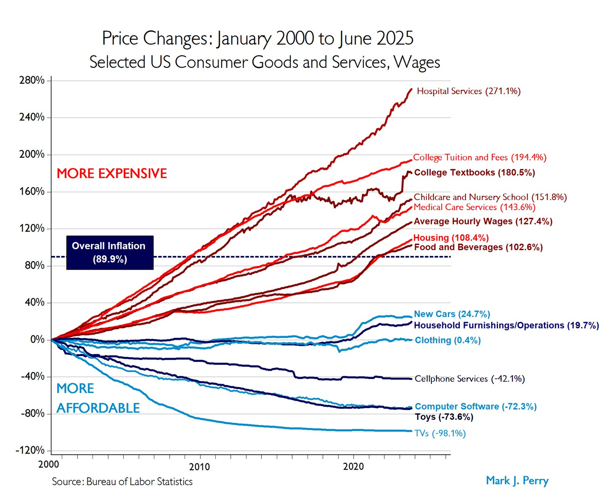

# 鲍莫尔成本病：物便宜则人贵

[鲍莫尔成本病：物便宜则人贵](https://www.dedao.cn/course/article?id=9GEyP73eprvKBPY9NkJq2Mb0kRD64d)

2026-05-28 23:45

长期在国外生活的中国人回到中国都会有一个由衷的感慨：中国实在太方便了。点外卖、叫跑腿、修水管、搬东西，手机上一点，半小时之内世界为你运转……而且花不了多少钱。美国中产阶层并不经常点外卖，更常见的做法是打电话到店里订餐，然后自己开车去取 —— 不是热爱劳动，实在是配送费太贵了。像理发、修水管这样的服务，价格更是中国的几倍甚至十几倍。

你在美国年收入 20 万美元，要论生活的便利程度，大概比不上在中国年收入 20 万人民币。

那你说是不是人民币被大大低估，美元被大大高估了呢？现在到底谁是发达国家？

先别听某些人喊赢，我们换一个视角再算算：如果你不是点外卖的消费者，而是外卖员呢？

在中国，一个外卖员送一单的收入大约是 5 到 7 块人民币，而一部新款高配手机是 7000 块钱，也就是说他大概要跑一千单才能买一部好手机。在美国，外卖员送一单的配送费加小费大概是 7 到 10 美元；手机 1000 美元，他只要跑一百多单就够了。

这当然只是局面的一角，但是，如果你的任务是“送外卖攒钱买手机”，在美国干这行显然要容易得多。

这个道理是，你的生活方便不方便，不只取决于你的绝对收入高不高，还取决于别人的时间便宜不便宜。

这不是文化问题，不是制度问题，也不是人口问题，更不是谁更勤劳的问题，甚至不是公平问题：美国服务贵是注定的，而且中国也在往那个方向走 ——

任何经历经济增长走向富裕的社会，都必然是物越来越便宜，人越来越贵。以至于你的体感是，怎么周围的人越富，我越不方便呢？

咱们先看美国各类消费价格的宿命。

美国经济学家马克·佩里（Mark J. Perry）做过一张很有名的图，后来年年更新，被称为“世纪图表（Chart of the Century）” ——

上图追踪了 2000 到 2025 年间美国各类消费品和服务的名义价格变化。你一眼看上去，就如同现代文明被劈成了两半 ——

**一方面是东西越来越便宜。** 比如电视机，考虑到像素提高、画质上升，按质量折算，价格降了 98%。软件、玩具、手机费的价格也是大幅下降，衣服几乎没怎么涨，新车价格涨了 24.7%，但这个涨幅大大低于接近 90% 的整体通货膨胀。

**另一方面却是服务越来越贵：** 医院服务涨了 271%，大学学费涨了 194%，大学教材涨了 180%，儿童看护涨了 152%……

一方面是物质极大丰富，一方面是很多项目上的负担越来越重。

其实这并不矛盾。这是现代经济一条特别硬的规律，叫「 鲍莫尔成本病 （Baumol’s Cost Disease）」。

「鲍莫尔成本病」这个理论最早是美国经济学家威廉·鲍莫尔（William J. Baumol）和威廉·鲍恩（William G. Bowen）在 1965 年提出来的。

他们最初的灵感来自表演艺术，咱们直接推演一个经典例子：贝多芬第 14 号弦乐四重奏。

这首曲子在 1828 年首次演出的时候，需要四名专业音乐家演奏 40 分钟。时间快进到两百年后的 2026 年，同样的曲目，你依然需要四个人演 40 分钟。这你没法机械化，只有这么演，才能给观众提供真正的现场音乐体验。

可是与此同时，外面的世界经历了生产率的飞速增长。今天的一个工人借助机器、软件和全球供应链，能生产远远超过过去数量的商品。他创造了这么多财富，自然应该涨工资，对吧？生产率提高的好处就是工人的工资在上涨，产品的价格却在下降，大家都越来越用得起，没错吧？

那么悖论出现了：请问那四位音乐家怎么办？

他们的生产率没有任何提高，似乎不应该涨工资。可是如果不给人家涨工资，他们就会转行。于是我们为了把他们留在剧院，就必须被动地给涨工资。医生、老师、保姆、园丁、水管工也都是如此。

鲍莫尔把现在的经济划分为两个部门：「 进步部门 （progressive sector）」，包括制造、软件和物流等等，生产率在提高，产品单位成本在下降，工资在上涨；「 停滞部门 （stagnant sector）」，包括艺术、医疗、教育和理发之类的服务业，生产率很难提高 —— 但是又必须跟全社会一起涨工资。

那么结果就是： 停滞部门的相对成本 —— 主要用于支付从业者工资 —— 注定会不可遏制地上升。你发现，服务怎么变贵了？这就是鲍莫尔成本病。

鲍莫尔成本病对社会的影响是巨大的。

首先在消费观念上，人们越来越倾向于“修不如买”。

几十年前，衣服破了应该找裁缝补，电器坏了应该请师傅修，现在很多东西坏了却应该直接换新的 —— 这不是浪费，是省钱。一辆车发生碰撞事故，直接换个新车门用不了多少钱 —— 新车门是大工厂用规模化机器压出来的 —— 可是如果让修车师傅给你手工敲平那个旧车门，可就太贵了。现实是受损稍微严重一点，保险公司就会干脆给你一笔钱让你再买一辆，把旧车报废。

再者，医疗和教育变成了预算黑洞。

几十年前看病和上学也不是免费的，可是在大多数人的记忆中，那肯定不是像今天这样，是中产阶级最深重的焦虑来源。

美国 2024 年医疗支出大约是 5.3 万亿美元，占 GDP 18%，对政府、对老百姓都是沉重负担。但你别以为中国看病便宜，国家卫健委的口径是 2024 年中国卫生总费用是 9.09 万亿元，占 GDP 6.7% —— 但是增速很快。

这里有行业保护和寻租的原因，也有效率低的原因，也有随着生活水平提高人们更加重视医疗和教育的原因 —— 但最根本的原因还是鲍莫尔成本病 [4]。医生面诊病人的时间、老师批改论文的心血，你无法用机器提效 100 倍。今天的医院能治过去治不了的病，今天的老师素质也比以前高，但从看病和教学需要花费真人时间这一点上来说，这两个部门属于停滞部门。

综合起来，因为停滞部门显得越来越贵，它们占预算的份额越来越大，社会劳动力和支出就会越来越流向这些部门。

这就使得整个经济看起来越来越涨不动，像是得了病。

当中国人在制造业、在专精特新领域集中投入的时候，美国人却把越来越多的钱交给了医生、律师、大学和公共服务。你站在旁边看，心想美国是不是病得不轻？

可那是富裕社会的宿命。

咱们必须澄清一个误会。我们说鲍莫尔成本病让医疗和教育越来越贵，并不是说社会整体上已经“买不起”这些服务、或者说社会变穷了。恰恰相反，鲍莫尔晚年特别强调：**正是因为社会整体变得极其富裕，人们才负担得起日益昂贵的服务。**

这就好比一个家庭，以前月入 1 万，花 1000 块钱投入教育（占 10%）；现在因为月入 3 万了，买家用电器和日用品都绰绰有余，于是就愿意花更多钱在教育上，每月花 6000 块给孩子上辅导班（占 20%）。教育的占比确实变大了，绝对价格也变贵了，但你的生活还是比过去富裕。

现实是，今天穷人的痛苦不但不比过去多，而且比过去少，只是痛苦的结构不一样。

以前人很便宜，物很贵，穷人可能买不起一件好衣服，但他能轻易找个人帮他跑腿。而在富裕的现代社会里，物很便宜，人变贵了。现在的穷人能轻易买到高清大电视、智能手机、看起来相当不错的衣服和超加工食品，但是负担不起好医生、好学校、好律师、好照护。

这样说来，鲍莫尔成本病也许不应该被称为一种“病”，它只是社会必然经历的阶段而已。

现代化并没有消灭稀缺，只是把稀缺从物转移到了人。

在这个意义上，你的“富有感”，在相当程度上是取决于能调用多少别人的服务时间。

一个有意思的规律是越是贫富差距大的地方，餐馆越好吃、服务越周到。人家在背后付出了那么多功夫，给你精雕细刻了一道菜，你随便吃两口就完事了，这个体验你说应该值多少钱？人家费那么大周章把荔枝运到长安，你看一眼就放下了，你说这多厉害。

反过来说，普遍富裕的地方，谁也不愿意出来费那么多功夫给别人做菜，餐馆就容易走向标准化，甚至预制化。

发达国家通常的办法是把低端服务业交给外来移民去做，但现在似乎有了一个新希望，AI。

AI 能治好鲍莫尔成本病吗？

王煜全老师有个说法叫「服务业的规模化」。物之所以越来越便宜，是因为你可以上杠杆，可以把一次设计卖出无数次；而人之所以贵，是因为人是不可复制的。那如果我们用机器人替代人来做这些服务工作，这不就实现了服务业的规模化，服务不就变便宜了吗？

在一定程度上的确如此。我们享受的服务中有相当一部分本质上是提供信息，是可复制的。比如炒菜操作流程、合同初稿、客服问答、医疗诊断甚至手术操作，这些机器可以做得很好，甚至比人更好。还有一些服务涉及到协调和管理，比如保险理赔，其中涉及到人的主观判断，但也可以被机器大大加速。

但有一些服务项目，就是要人的在场。AI 的诊断书很完美，但是谁来帮患者权衡利弊，谁来让患者别害怕，谁来签字承担误诊的风险？AI 可以不厌其烦地把一道题讲很多遍，但你需要一个人类老师告诉学生：“你别装了，你就是没好好学。”一个护工照顾一个老人，和一个护工借助机器人照顾一百个老人，前者是关怀，后者叫饲养。

所以我不认为 AI 能替代所有的服务，它也不应该替代所有的服务。也许 AI 的作用是把人从那些可复制、可压缩、可自动化的事务之中解放出来，去从事责任、信任、判断、陪伴、审美和伦理权衡这些真正的服务。

鲍莫尔成本病恰恰让真正的人类时间更贵。

怎么利用鲍莫尔成本病赚钱？首先请注意：鲍莫尔成本病说的是高成本，而高成本可不等于高利润。

医疗贵，医生可没暴富；教育贵，可没有人靠当教授发家；养老贵，也没见人人抢着去做护工。鲍莫尔成本病说的是停滞部门的工资会被进步部门拉着走，可没说停滞部门有权要求超额利润。

不过鲍莫尔成本病的确提供了一个防守优势。只要服务真有需求，你的收入是稳定的，永远都不会太差。这只是防守，但是有了这个防守基础，你的确可以做一些事情。

最好的办法还是跟某种虚拟成分联系起来，调动杠杆，让你的技能可复制。 设计师不要只卖设计小时，要让设计进入量产；老师不要只讲一节课，要把课程、题库、训练体系、反馈机制产品化；医生不要只坐诊，要让诊疗流程、随访系统和患者教育形成组织能力。

把判断和执行分开，就是你的杠杆。

第二个办法是做认证和责任背书。 无论是诊断、合同，还是工程图纸，就让 AI 去生成答案吧，但是你看一眼，你签字盖章，你承担责任。

只要你在其中做出一些「微决策」，确保内容符合现场的需要，能配得上你的个人品牌，你这个承诺就价值千金。

第三个办法是做服务供需平台。 在没有 AI 的时代，人类大部分服务时间并不是在提供实质的服务，而是在填报表、获客、合规、记录、支付这些事情上。平台可以减少这些后台摩擦，把这些辅助性的动作全部标准化、自动化。

你提高了效率，你就有理由从中赚钱。

第四个办法是如果你坚持一对一，那就走奢侈品路线。 那么你就需要提供称得上是奢侈的服务。你卖的不再是技能和时间，而是身份、信任和超行业水平的效果。私人医生、高端家教、顶级顾问，都是这个逻辑。

也许你的服务水平只比 AI 高 20%，但是有人会愿意多出 200% 的价格。

第五个办法，也是发达国家服务行业这么多年来一直在使用的办法，那就是「寻租」。美国考医生、考律师之所以那么难，既不是因为医生和律师就真的需要那么高的考试能力，也不是因为这两个行业不需要更多的人，而是为了限制从业者人数，维持收租水位。

那是一个比鲍莫尔成本病所要求的更高的水位。

不管是美国还是中国，历史的大趋势是，农业从业人口比例随着工业化急剧下降，最终只需要 1%；工业从业人数随着自动化逐渐下降，最终也成为少数；绝大多数就业者都在服务业。正是因为鲍莫尔成本病，才使得这些人的工资水平跟上了时代的进步，他们得以分享现代化的红利。

如果所谓的服务便利就是有人在低价出售自己的时间，我们不应该怀念那种便利。

你知道吗，中国历史上曾经有过不愿让人当牛马的时代。宋人笔记记载 [6]，王安石、司马光、程颐这些士大夫到老都是有的骑驴，有的骑马，坚决不乘坐轿子，不让人抬。哪怕是在山中，路实在太险了，别人劝他们坐轿，他们也不坐，他们宁可拄着拐杖走。这可不是故作清高，唐宋官场规矩就是除非你德高望众，“百官出入皆乘马” [7]。

为啥？用王安石的话说：「未尝敢以人代畜也。」

是南宋时候，江南多雨路滑，高宗才准许朝臣坐轿；大明朝原本是三品以上京官方可乘轿，后来限制逐渐放宽；到清朝，轿子才成了从一品到七品官场的主要交通工具。

王安石他们对此一定会说，人不应该这么用，人应该贵。

他们会说鲍莫尔成本病是个好事儿。

---

### 核心洞见

这篇文章的核心命题可以用一句话概括：

> **现代化不是消灭稀缺，而是把稀缺从"物"转移到了"人"。**

鲍莫尔成本病揭示的是一个经济铁律——凡是生产率难以提高的服务（医疗、教育、理发、照护），其成本会随着整体社会富裕而必然上涨。这不是谁的错，是结构性宿命。

文章由此推出一个反直觉的洞见：**你觉得自己生活方便不方便，本质上取决于"别人的时间够不够便宜"**。中国的外卖便利，是建立在骑手工资相对低廉的基础上的；美国服务业贵，恰恰是因为美国整体富裕。

---

### 对普通人的启示

#### **认知层面**

文章最重要的一个提醒是：不要把"享受便宜服务"等同于"社会进步"。宋代士大夫"未尝敢以人代畜"的态度，放在今天其实是更文明的直觉——**便宜的服务背后往往是被压低的人的价值**。

#### **职业选择层面**

作者暗示了一个重要判断：在AI时代，真正难以被替代的，不是知识本身，而是**责任、判断、信任和陪伴**。那些需要"人在场"才能完成的服务，会越来越贵，越来越稀缺。

所以对普通人来说，与其焦虑自己的技能会不会被AI取代，不如思考：**你的工作里，哪部分是"签字盖章、承担责任"的那个人？**

#### **生活预期层面**

如果你在中国，现在觉得叫外卖方便又便宜——这是历史的窗口期，不是常态。随着中国继续富裕，服务会越来越贵，这是必然方向，不必惊讶，也不必怀念。

---

总的来说，这篇文章最有价值的地方，是用一个经济学框架，解释了我们日常生活中那些"感觉说不清楚"的现象，并且给出了一个不带道德说教的答案：**人变贵，是社会进步的标志，不是问题，是结果。**

### 宏观与微观

> 当下 AI快速发展，中国经济整体数据比较好，但是个体微观体验普遍比较差 ，感觉赚钱困难对未来预期很差，人似乎变得便宜不值钱了。这是为什么？

这是一个非常真实的问题，也是当下中国社会最撕裂的感受之一——**宏观数据很好看，微观体感很痛苦**。

这两者其实并不矛盾，原因是多层次的。

---

#### 一、宏观好看，不代表个体受益

GDP增长可以来自少数高效率部门的爆发——基建、出口、制造业、AI相关产业。但这些部门创造的财富，**并不自动流向普通就业者**。

更关键的是，中国经济增长长期依赖投资和出口拉动，**消费和居民收入占GDP的比重一直偏低**。蛋糕变大了，但分给普通人的那块切法没有同步改变。

---

#### 二、这恰恰是鲍莫尔成本病的"反面"

文章说富裕社会的方向是"物便宜，人变贵"。但中国目前处于一个**尴尬的中间状态**：

- 制造业高度发达，物确实越来越便宜（拼多多、白牌商品横行）
- 但服务业还没有充分发育，人却也没有真正"变贵"
- 与此同时，AI和自动化的冲击提前到来

结果是：**物的价格被压到极低，人的价格也没有随富裕社会的逻辑上涨**，反而在某些领域被AI和内卷双重压制。这是一种"两头都没占着"的处境。

---

#### 三、供给过剩与需求不足的夹击

中国有一个结构性问题：**生产能力极强，但内需相对不足**。

原因很复杂——社会保障体系不完善导致居民高储蓄、房价透支了消费能力、收入分配结构导致中低收入群体消费意愿低。

供给过剩的直接结果就是**价格战、内卷、利润率趋零**。外卖、电商、制造、甚至知识付费，全都在打价格战。打价格战的最终成本，往往转嫁给了从业者——工资降、工时长、保障少。

这是"人变便宜"的直接机制。

---

#### 四、AI冲击叠加了一个历史性的错位

正常的历史节奏是：农业社会→工业化（制造业吸收就业）→服务业扩张（鲍莫尔效应让服务从业者工资上涨）。

但中国现在面临的是：**制造业还没完成充分的财富分配，AI就已经开始冲击服务业**。

白领的文书工作、客服、基础设计、初级编程……这些本应是"中产缓冲地带"的工作，正在被快速蚕食。而制造业的自动化又在压缩蓝领就业。

两端同时受压，**中间层正在塌陷**。

---

#### 五、预期本身就是一种自我实现

当大多数人预期未来变差，会同时发生几件事：

- 消费收缩→企业收入下降→裁员或降薪→消费进一步收缩
- 年轻人选择"躺平"或考公→社会创新活力下降
- 企业不敢投资扩张→就业机会减少

**悲观预期一旦形成合力，就会把悲观变成现实**。这不是心理问题，是经济学里的"预期陷阱"。日本失去的三十年，很大程度上就是这样发生的。

---

#### 所以，"人变便宜"在当下中国是真实的

但原因和文章里说的富裕社会的逻辑不同——不是因为太富裕了所以不需要廉价服务，而是：

> **供给过剩 + 需求不足 + AI提前冲击 + 财富分配结构失衡 + 悲观预期自我强化**

这几股力量叠加在一起，造成了"物极度便宜，人也极度便宜"的双重困境。

---

**对个体而言，这意味着什么？**

文章结尾说的那几条建议在此刻尤其有现实意义——**让自己的判断和责任可复制、找到不能被价格战压垮的定位**。但更重要的一点文章没说：

在需求不足的环境里，**靠个人努力突围的空间是有限的**。宏观结构不调整，微观个体的痛苦就是系统性的，不是个人失败。

认清这一点，至少可以少一些自我怀疑。

### 行动策略

> 那么，作为普通个体，该如何更好的应对这种处境呢？

这个问题很现实，我尽量说得具体，不讲那些"提升自己、保持乐观"的废话。

---

#### 首先要接受一个前提

**你面对的不是个人失败，是系统性逆风。**

在顺风时代，随便努力都有回报；在逆风时代，努力是必要条件，但不是充分条件。接受这一点，不是躺平，而是**避免把系统问题内化为自我否定**，从而做出更清醒的决策。

---

#### 一、重新定义"安全感"的来源

过去二十年，中国人的安全感主要来自两个东西：**房产**和**稳定工作**。

这两个锚点现在都在松动。

更可靠的安全感结构应该是：

**现金流 > 资产增值**。房子涨价是纸面财富，每月稳定的现金流入才是真实的抗风险能力。哪怕收入不高，只要支出可控、现金流为正，抗压能力就远超资产丰厚但现金紧张的人。

**能力 > 职位**。职位是公司给的，能力是自己的。失去职位很容易，但如果你的能力在市场上有独立价值，失业的代价就小得多。

**关系网络 > 单位归属**。单位可以裁你，但真实的人际网络不会。在逆风时代，很多机会和保障来自人，不来自机构。

---

#### 二、在"停滞部门"里找到立足点

结合鲍莫尔效应的逻辑——**那些AI和自动化难以替代的服务，长期来看是更安全的位置**。

具体来说，有几类能力是相对抗压的：

**需要现场在场的**：护理、心理咨询、复杂维修、某些手工艺。这些不性感，但需求稳定，价格战打不进来。

**需要承担责任的**：医生、律师、审计、工程签字。AI可以生成答案，但签字的人无法被替代。如果你在这类行业，核心价值不是知识，是**你愿意对结果负责**。

**需要建立信任的**：长期客户关系、私人顾问、社区服务。这类工作的护城河是时间和信任积累，不是技能本身。

反过来说，**最危险的位置是**：做标准化信息处理的中间层——基础文案、初级分析、客服、简单设计。这些正是AI最先蚕食的地方。

---

#### 三、控制"暴露面"，不要在价格战里消耗自己

供给过剩的市场里，**参与价格战是慢性失血**。

几个具体的思路：

**缩小服务半径，深耕特定人群**。与其面向所有人竞争，不如成为某个小圈子里最信任的那个人。一个专门服务中小企业主的财务顾问，比一个什么都做的会计更难被替代。

**把服务和人格绑定**。标准化商品可以比价，但"我就是要找你"的关系不能比价。这需要长期投入在某个垂直领域建立真实的口碑。

**尽量让收入来源多元化**。不是说要做很多不相关的事，而是同一个能力，尽量开辟两三个变现渠道。单一雇主依赖是最脆弱的结构。

---

#### 四、重新评估生活成本结构

在收入增长受限的环境里，**节流的确定性高于开源**。但不是说要苦行，而是要**区分哪些支出买的是真实生活质量，哪些只是焦虑消费**。

几个值得审视的地方：

房贷压力是否过大？高杠杆在资产升值时代是杠杆，在资产横盘时代是枷锁。

教育投入是否在追焦虑？很多培训消费买的不是能力，是家长的心理安慰。

消费是否在用来填补意义感的空缺？这类消费永远填不满。

生活成本降下来，**给自己留出容错空间**，才能在机会出现时有能力去抓，而不是被迫接受任何条件。

---

#### 五、对AI的正确态度：用它，而不是怕它

很多人对AI的反应是焦虑和回避。但在当下，**会用AI的人和不会用AI的人，生产效率正在快速分化**。

具体来说，AI现在能帮普通人做到的事情包括：大幅压缩信息处理时间、快速产出初稿、完成以前需要外包的工作。

这意味着一个个体，可以用更低的成本撬动更大的产出。**AI是目前少数几个真正向普通个体倾斜的杠杆**，而不只是大公司的工具。

不需要学编程，不需要懂技术，但需要**主动去用，在自己的具体工作场景里找到它能替你省力的地方**。

---

#### 最后，也是最重要的一点

**预期管理本身就是一种能力。**

逆风时代最容易发生的心理陷阱，是把"现在很难"等同于"未来没希望"，进而做出过于保守或过于冒险的决策——要么完全收缩，要么孤注一掷。

更好的姿态是：

> 降低对短期回报的期待，但不放弃对长期可能性的想象。保持现金流，保持能力积累，保持真实的人际关系，等待结构性的变化窗口。

这不是鸡汤，是在系统性逆风里，个体真正能做的最理性的事。