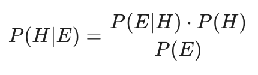
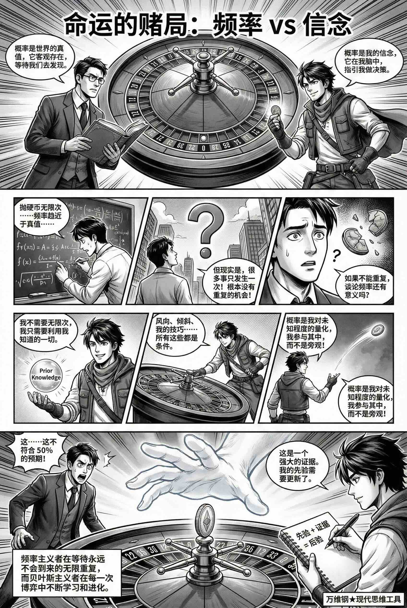
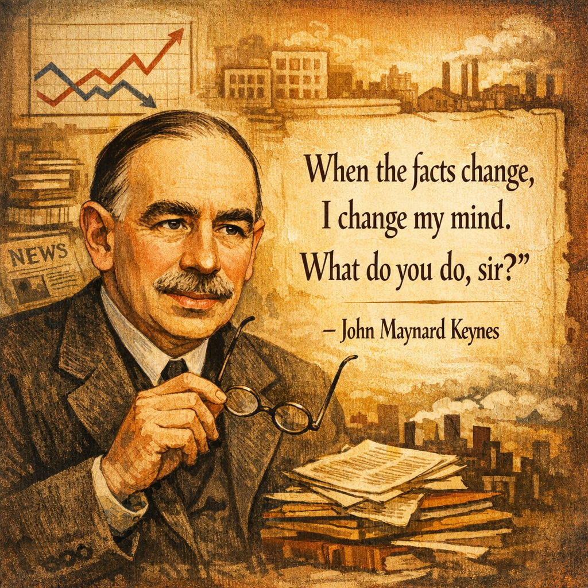
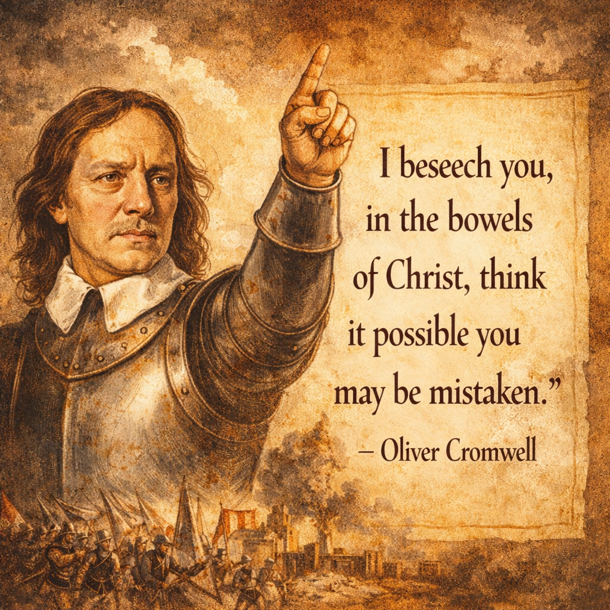
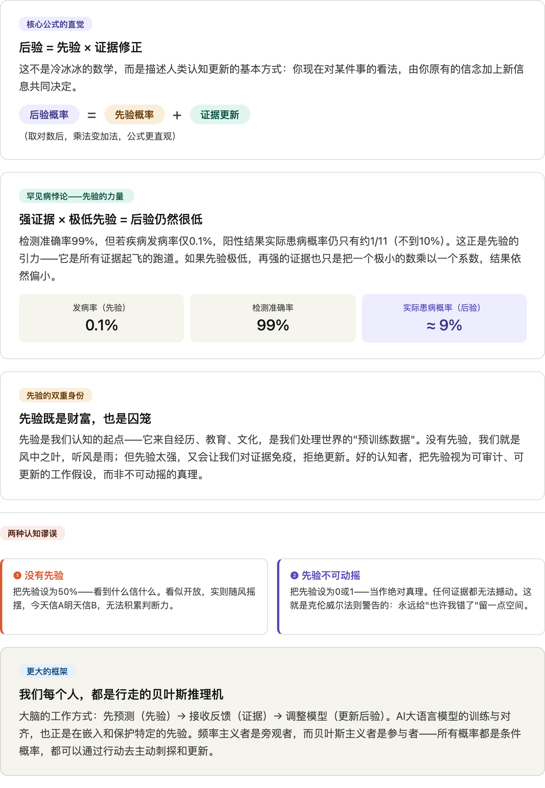
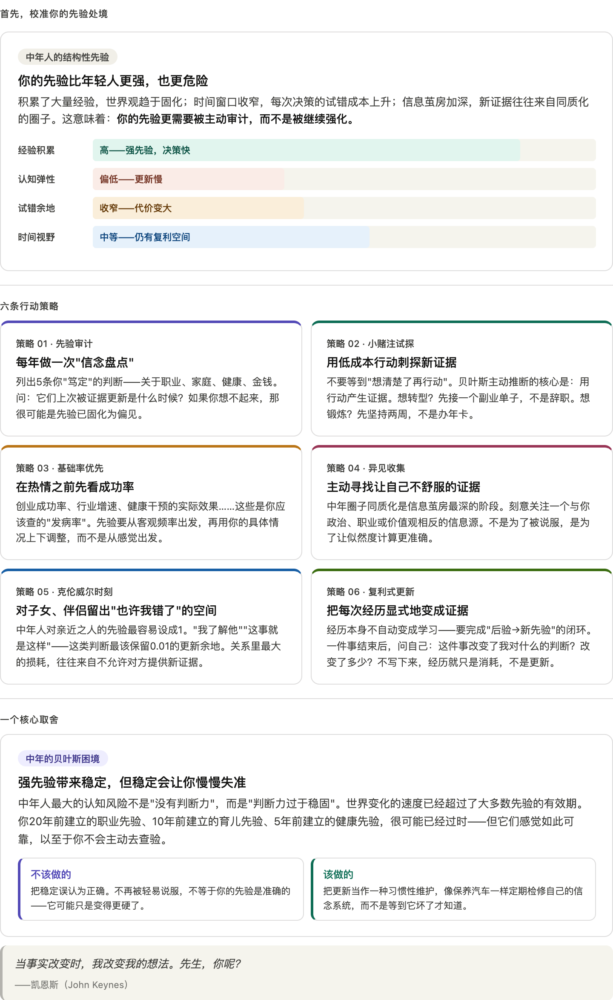

# 贝叶斯先验：判断是主观的，但可以更科学一点（得到课程讲稿 + AI 加工段）

# 贝叶斯先验：判断是主观的，但可以更科学一点

[贝叶斯先验：判断是主观的，但可以更科学一点](https://www.dedao.cn/course/article?id=wgpMLla6Py4qK2DOLzJYmvNzjd2Zx1)

日常生活中充满了决策。跟一个新同事打交道，不知道这人可靠不可靠；刷短视频看到一个爆料，想转发又怕被证伪；身体有点不舒服，权衡值不值得去趟医院……你需要做一个决断，你迫切想要正确答案。

但是经过前面几讲，你可能也已经明白：任何决策都必须带有一定的主观成分。**设定价值函数、选择概率分布、使用一定颗粒度的模型，其实都是在做主观的选择。**世间没有绝对的正确，干什么都有一点冒险成分。

如果你认同这些，你可能是一个「贝叶斯主义者」。

这一讲的思维工具就是贝叶斯主义 。我们重点讲一个前面提到过的概念：「 **先验** （prior）」。先验是你对事情的原本看法。它可以是单数也可以是复数。它可以指你对一个特定事件概率的判断、对一个领域的观念，也可以指你整个的世界观。

**先验就是你的成见。但成见是认知的起点。而且这个起点是可以被量化、可以被更新，也可以被审计的。**

老百姓说：“你对这个事的看法是什么？”“经过这个事，我的观点发生了一点改变。”

而学者则说：“你对这个事的先验是什么？”“这个证据更新了我的先验。”

学者这样说话是因为他知道著名的贝叶斯公式。你可能学过也可能没学过，但你总可以看一眼公式的样子 ——

公式里每一项都是概率，H 代表一个判断，E 代表证据。比如 H 代表你的一个朋友得了某种罕见的病，E 则代表他在医院检测这个病的时候，检测结果呈阳性。

P(H) 是检测之前，你判断他得这个病的概率，也就是你判断的「 **先验概率** （Prior Probability）」。

而 P(H|E) 则代表检测之后，在有了 E 这个证据的条件下，你重新判断他得这个病的概率是多少。这也叫「 **后验概率** （Posterior Probability）」。

P(E) 是检测结果这个证据在所有情况下发生的 **总概率** 。

而 P(E|H) 一般叫「 **似然度** （Likelihood）」，意思是在 H 这个假设之下，我们看到当前这个证据的可能性有多大 —— 它考察的是你的世界观与现实的兼容度。

如果你不感兴趣，可以忽略细节。贝叶斯公式说白了就是一句话：你现在的观点（后验），等于你原来的观点（先验），乘以新证据的修正（似然度/证据）。其实如果你把公式两边取个对数，乘法变加法，公式的样子就更直观了，也就是：后验 = 先验 + 证据更新。

回到罕见病的故事。每一个学贝叶斯公式的人都会遇到这个例子：假设这个病的发病率极低，只有 0.1%，我们可以说 P(H) 等于 0.1%。我们还假设医院的检测准确度极高：如果一个人真有病，99% 的情况下能检测出阳性，所以 P(E|H) 等于 0.99；如果没病，则是 99% 的可能性检测出阴性，也就是只有 1% 的误报率。

那 P(E) 怎么算呢？咱们用个笨办法。假设有 1000 个人去体检。根据 0.1% 的先验概率，其中真有病的只有 1 个人。他有 99% 的概率被检测出来，所以真阳性有 0.99，近似 1 个人。而因为有 1% 的误报率，假阳性近似有 10 个人 —— 所以总的阳性人数是 11 个人。那么 P(E) = 11/1000。

继续使用直观的算法或者套用公式，你都会得到后验概率，P(H|E) = 1/11。

1/11 比 0.1% 大得多，但这仍然是一个相当小的概率！换句话说，虽然你的朋友以 99% 的准确度被检验出患有这种病，可是他实际得病的概率却只有 1/11。这是为什么呢？

因为那是一个罕见病。他得病的先验概率非常低。如果先验原本很低，哪怕证据很强，把先验提高了一百倍，你的后验概率也还是不高。

这就是贝叶斯主义者的气度。如果我认为足球天才是一种极为罕见的事物，哪怕你跟我说得天花乱坠，说这个小学足球队里有个孩子踢得特别好，说有教练认为他就是下一个梅西，我也不会特别相信的。**如果我非常不相信世界上有鬼，你给我讲 15 个鬼故事也不能让我从此怕鬼。**

你的先验因为证据而发生了改变，后验就是你更新后的先验。

托马斯·贝叶斯（Thomas Bayes）是 18 世纪的人物，他在 1740 年代推导出了这个公式。但是，把贝叶斯公式理解成“对先验的更新”，乃至于成为一个范式，则大约发生在 1920-1930 年代……从此就争议不断。

**争议点在于，到底什么是概率。当你说「概率」的时候，你到底是在描述\*世界\*，还是在描述\*自己对世界的信心\*？**

传统思想，也就是你在中学学的那个概率论，可以称之为「频率主义（Frequentism）」，认为概率是事物的客观属性：比如一个公平的硬币抛出来，你得到正面的概率就应该是 50%，这是一个绝对的数字，是一个「真值（True Value）」。只要你抛的次数足够多，你得到正面的频率，就应该等于那个客观的概率真值。

但是贝叶斯主义者说，谁会抛无限次硬币呢？我们生活中的事情根本没有那么多重复机会。你说这个候选人会不会当选？那个创业项目会不会死？你不会让人生重来一万次！如果一个事只发生一次，你谈论频率不是很荒唐吗？

「贝叶斯主义（Bayesianism）」认为概率是信念的度量（degree of belief）：概率只存在于你的脑子里，其实是对你无知程度的量化。

频率主义者是世界的旁观者，而贝叶斯主义者则是世界的参与者，认为你有主观能动性：所有概率都是条件概率，你通过行动刺探证据，改变先验。

不同的参与者人生经历不同，先验自然不同。贝叶斯主义等于说概率是主观的。

那你说这也太不靠谱了，一般人没有多少社会经验，胡乱说一个先验，哪有什么参考价值呢？没错。所以我理解，使用贝叶斯预测最好的办法是：把这个事儿已知的频率、或者说世人普遍的信念或者科学知识，当成你的先验，作为出发点。

比如开头那个罕见病的例子。如果我们对那个朋友一无所知，就只好假设他得病的概率就是这个病在人群中总的发病率，也就是那个 0.1%，作为先验。但如果我们知道他更多的信息，比如说年龄、生活环境、原本的健康状况、现在有什么症状等等，那就可以把那些信息当作证据，更新那个先验：比如这个人年龄小，我们就把概率调低一点；这人原本健康状况就很差，那我们就把概率调高一点……

这样你就把普遍的概率给具体化了。

这非常有用。举个例子：你能不能写一个简单的算法，实现垃圾邮件过滤的功能。

已知在所有邮件之中，垃圾邮件的占比是 20%。你不能直接利用这个频率，毕竟你不可能随机选取 20% 的邮件标记为垃圾邮件。那你怎么办呢？

早期的一个经典算法，就是使用贝叶斯方法。你注意到，邮件中如果出现某些词，它就更像垃圾邮件，比如出现“free（免费）”；而出现另一些词，它就更像是一封正常的邮件，比如出现“meeting（会议）”……你可以把这些词当作证据。你通过大量的统计，知道这些证据的似然度。

那么，你只要把初始先验设定为 20%，每看到一个新词就做一次贝叶斯更新：看见“free”这个词，就把概率调高一点，看见“meeting”就调低一点……就这样把整封邮件分析完，你就得到一个关于这封信是否为垃圾邮件的总的后验。那如果这个后验高于某个标准值，你就可以标记为垃圾邮件了。

这样程序就不是在瞎猜，而是在记账。

现在的 AI 大语言模型（LLM），其实就是一个巨型的贝叶斯预测机。训练模型就是把这个世界的先验嵌入它的参数之中，那是一种很强的先验，所以模型一般不会胡乱说话。

当你给模型一段提示词（Prompt），你就是在给它输入观测证据，强迫它更新后验概率，从而坍缩出一个具体的回答。

而 AI 公司会设法给模型一个不可轻易被提示词推翻的先验，这样不管用户怎么诱导它都能坚持某些底线，这就是「对齐（Alignment）」。但那个先验再强也是个理论上可以改变的数字，所以总有人尝试让模型“越狱”……

在这个视角下，难道我们每个人，不都是行走的大语言模型吗？我们过往的经历、教育、原生家庭，构成了我们的预训练数据，也就是我们的先验。

联系「自由能原理」，我们可以说人的大脑就是一台主动预测的贝叶斯推理机。你对环境的预期就是你的先验，你收到的惊奇就是证据。

比如你拿杯子喝水。杯子就在眼前，你对它的位置、重量和大概的手感都有一个预先的估计，这就是你的先验。你基于先验做出伸手的动作。当你的指尖接触到杯子时，如果触觉和你预想的不一样，比如杯子特别烫，你就会产生一个惊奇，作为新的证据。现在你必须更新先验，然后发出指令改变动作，把手缩回来……

顺序非常清楚：我们总是先预测，再接收反馈，再调整。我们不是两眼一抹黑地出发，而是一定要先有一个先验。还是那句话，有个错误的地图也比没有地图强。

如果证据和先验不符，贝叶斯公式要求我们更新先验 —— 但是自由能原理说，除了更新先验（也就是知觉推断），你还有另一个选项，那就是主动推断：你可以改变环境，让环境适应你的先验。如果我以为房间暖和结果房间很冷，难道我就坐视它这么冷吗？我完全可以把暖气调高一点。

但不管怎么做，当证据跟你的先验不符的时候，你必须做点什么才好。你不能无动于衷。以前凯恩斯（John Keynes）有句名言：「当事实改变时，我改变我的想法。先生，你呢？」

这一切听起来顺理成章，但有些人的认知恰恰就不是这样的。人们经常犯两种错误。

**第一种错误是完全没有先验。** 也就是不预设任何立场，纯看证据。

你要是觉得没有立场很科学，你就大错特错了。你不可能给“明天太阳升起”和“明天太阳爆炸”同样的先验概率，我也不建议你对巴黎的小偷有和北京同样的心理准备。没有先验，就意味着今天看到一个新闻你就信 A，明天看到另一个新闻你就信 B；今天朋友圈说某公司要爆雷你就清仓，明天又听说有人抄底你又冲进去……今天是左派明天是右派。

听风就是雨可不是谦逊，而是做人的不可预期 —— 那谁还敢指望你呢？

**第二种错误是先验不可动摇。**说白了就是你把先验概率直接设成了 0 或者 1，当做绝对真理。那么公式会说不管证据多强，你的先验都不会改变。

可不要那样。真正的贝叶斯主义者永远不会把概率设为 0 或 1。这叫「克伦威尔法则（Cromwell's Rule）」，典故出自英国政治领袖奥利弗·克伦威尔（Oliver Cromwell）1650 年给苏格兰教会写的信，他说：“我恳求你们，在基督的慈悲下，想一想你们可能错了。”

给自己“可能错了”留点空间吧。哪怕你特别特别相信一个事情，你总可以把它的先验概率设成 99.999%，但是不要设成 1。

贝叶斯主义的基本操作心法很简单：先根据环境参数设定先验，再把具体的事情当作证据，更新先验。

怎么判断那个新同事值不值得信任？你应该先考虑自己所处的环境：如果本地一向人心险恶，那你应该把先验设得很低；而如果你是在一个很好的社区，那就可以开一个高先验。但先验只是先验，你还得允许人家自己证明自己。跟此人具体办一两件事儿，当作证据去更新先验。

传统智慧有时候说“人性本善”，有时候又说“防人之心不可无”；有时候说“知人知面不知心”，有时候又说“浪子回头金不换”……这些话听起来都是互相矛盾的，其实你放在贝叶斯公式的框架下看，就一清二楚了。

**先验既是我们的财富，也是我们的囚笼。证据不是绝对的真理砖块，而是信念交易的货币。每一次经历事情，都是用证据购买更准确信念的过程。**

如果我们的课程能稍微改变一点你对世界的先验，那就是我最大的荣幸。

注释

[1] 只要你学过一点条件概率，这个公式很容易证明：把 P(E) 拿到左边，两边说的其实都是“H 和 E 同时发生的概率”。

[2] 严谨的算法是 P(E)=P(E|H)P(H)+P(E|¬H)P(¬H)。

---

这篇文章的核心是用贝叶斯框架来重新理解"主观判断"这件事——不是说主观判断不可靠，而是说它可以被结构化、被量化、被更新。让我用图示把最核心的几个洞见梳理出来。

这篇文章真正的力道，不在于教贝叶斯公式本身，而在于借公式重新诠释了几件我们习以为常却从未想清楚的事。以下是我认为最值得咀嚼的几个核心洞见：

#### **先验不是偏见的别名，而是认知的操作系统**

作者做了一个精妙的重新命名：把"成见"叫作"先验"。这不只是换个词，而是改变了我们对它的态度——成见是需要摆脱的，但先验是需要管理的。你不可能没有先验，问题从来不是"有没有成见"，而是"你的先验是否合理、是否可以被证据更新"。这让主观判断从原本道德审判的领域，变成了认知工程的领域。

#### **罕见病悖论是一把解剖刀，专门剖开"看起来很确定"这件事**

99%准确率的检测，在极低发病率面前，给出的阳性依然大多是假阳性——这个例子之所以有震撼力，是因为它量化地展示了"直觉失效"的机制。我们的大脑对百分比敏感，对基础率（base rate）天然迟钝。这个例子之后，你对任何"准确率很高"的宣称都应该条件反射地追问：先验概率是多少？

#### **频率主义 vs 贝叶斯主义，本质是"旁观者 vs 参与者"的世界观之争**

这是文章里最哲学的一个区分，也是最被轻描淡写的一个。频率主义要求"客观"——把概率当成世界的属性，等着数据无限收敛。贝叶斯主义承认"参与"——概率是你对不确定性的信念度量，而你可以主动出手改变证据的结构。这其实是在说：不要等到"足够的数据"才做判断，因为你的人生不允许你把同一件事重复一万次。

#### **克伦威尔法则才是这篇文章的道德核心**

技术细节可以忘掉，但这一句话值得刻下来："我恳求你们，想一想你们可能错了。"用贝叶斯的语言说就是：永远不要把先验设为0或1。不是99%，是绝对的1——那会让任何证据都失效。这是一种认识论上的谦逊，也是避免陷入意识形态囚笼的唯一出口。

#### **"有错误的地图也比没地图强"——先验的功能性价值**

这句话值得单独拿出来。先验的价值不在于是否正确，而在于它给了你一个可以出发的起点。没有先验的人面对世界是瘫痪的，因为每一条新信息都是同等重量的噪音。先验给不确定性划定了暂时的重心，让行动成为可能，让学习有了基线。

#### **文章最后的"账本"比喻是整个框架的诗意收束**

"证据不是绝对的真理砖块，而是信念交易的货币。每一次经历，都是用证据购买更准确信念的过程。"这句话把贝叶斯主义从冷冰冰的概率论，变成了一种关于人如何在世界中学习和成长的描述——你不是在积累"正确"，而是在用每一次经历更新你对世界的模型。

让我先想清楚"普通中年人在当下"这个处境的特殊性，再来制定策略——因为贝叶斯框架给出的建议，会随着先验不同而完全不同。

六条策略背后有一条元逻辑，值得多说几句。

**贝叶斯框架给中年人最重要的提醒，是区分"稳定"和"准确"。**

年轻人的问题通常是先验太弱——没立场，随风倒，容易被最近看的一篇文章整个颠覆。但中年人的问题往往相反：先验太强，而且已经不记得它是什么时候、基于什么证据建立起来的了。一个"我做事很靠谱"的自我认知，可能是三十岁时凭几个项目成功建立的，但市场环境、技术工具、协作方式已经完全不同——这个先验还准确吗？

所以六条策略里，"先验审计"和"复利式更新"是骨架，其他四条是具体操作手法。审计是发现过时的先验，更新是用新证据重新校准，中间的行动策略（小赌注、基础率、异见收集）是产生和识别有效证据的方式，而克伦威尔时刻则专门针对关系里最容易失明的那一块。

还有一点文章没有直说，但非常重要：**中年人的先验更新成本，不只是认知上的，更是情感上的。** 改变一个存在二十年的判断，往往意味着承认过去某段时间走了弯路，或者某个被你否定的人其实是对的。这在心理上有真实的摩擦力。贝叶斯公式只管数学，但人不是公式——所以"允许自己更新"这件事，在中年需要比年轻时更多的主动意愿。

#### 核心逻辑：认知的“动态更新”模型

贝叶斯主义的底层逻辑可以用一个极其简明的公式概括：**后验 = 先验 + 证据更新**。

- **先验（Prior）：**你的成见、常识、预设立场，是认知的起点。
- **证据（Evidence）：**你在新情境中观察到的事实，考察现实与你世界观的兼容度。
- **后验（Posterior）：**吸收新证据后，你更新后的观点（它将成为你应对下一件事的“新先验”）。

**做一个“贝叶斯主义者”**

1. **锚定先验（找基准率）：**面对未知事物，先根据大环境、常识、或者科学统计设定一个初始概率（先验）。
2. **主动推断（刺探证据）：**带着先验去行动，接触具体的人和事，收集反馈。
3. **动态修正（更新信念）：**证据如果和先验不符，就会产生“惊奇”（自由能原理）。此时必须做出反应：要么更新自己的看法（改变先验），要么主动改变环境使其符合预期。

#### 核心哲学：概率是主观的“信念度量”

- **重塑概率观：**传统的“频率主义”认为概率是客观事实的统计（如抛硬币的50%）；但“贝叶斯主义”认为，人生大多是单次博弈（如创业、信任某人），无法重复一万次。因此，**概率只存在于你的脑海中，是你对自身“无知程度”的量化，也是你对世界信心的度量。**
- **主观但科学：**承认认知带有主观性并不等于盲目。贝叶斯主义允许你有主观的起点（先验），但要求你必须用科学的、记账式的方式去利用证据（更新后验）。

#### 两大认知陷阱

普通人最容易犯的两种极端认知错误：

- **错误一：完全没有先验（听风就是雨）。** 

  - 表现：以为“不预设立场”就是客观，实则毫无主见，容易被单个新闻或随机事件带偏。
  - 真相：没地图比有错地图更糟，缺乏先验会让人失去一致性，变得不可靠。
- **错误二：先验绝对不可动摇（固执己见）。** 

  - 表现：把先验概率设定为 0（绝对不可能）或 1（绝对真理）。
  - 真相：根据**克伦威尔法则**，一旦先验是0或1，任何强大的新证据都无法改变你的看法。真正的智者永远给自己留出“我可能错了”的空间（哪怕只留 0.001%）。

#### 人是一台“贝叶斯预测机”

- **先验的重量：**罕见病例子说明，如果一件事的先验概率极低（罕见），即使新证据很强（99%准确率的检测），后验概率依然很低。**这意味着：非凡的主张需要非凡的证据；不要轻易被个案颠覆了常识。**
- **人即AI模型：**AI大语言模型的预训练数据就是它的“先验”，用户的提示词就是“证据”。同理，我们的原生家庭、教育和经历构成了我们的先验底色。我们行走在世界上，就是不断用新经历（证据）去购买、修正更准确信念的过程。

贝叶斯主义是一种高级的理性——它允许你带着偏见出发，但要求你保持向真理低头的开放；它教导我们用常识设定底线，用事实校准偏差，永远不盲从，永远不绝对。
