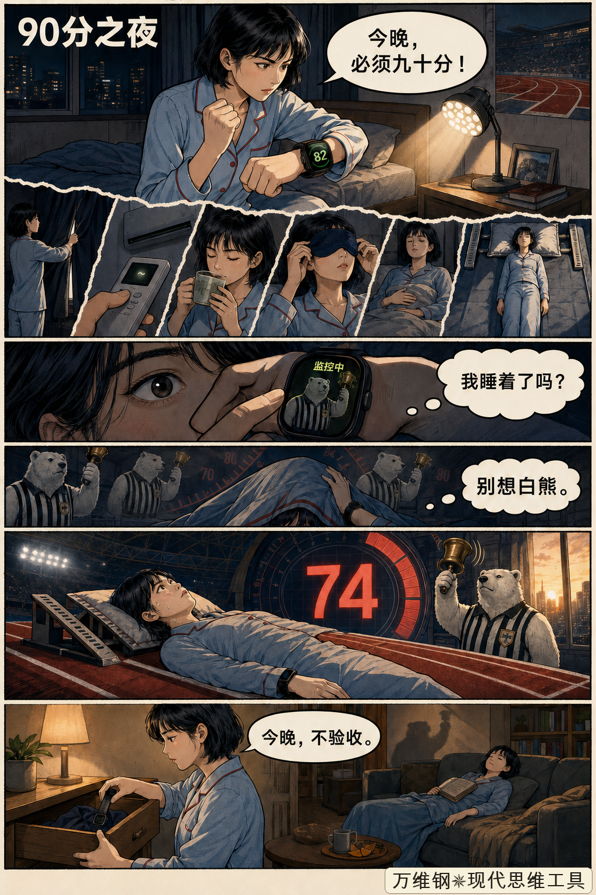
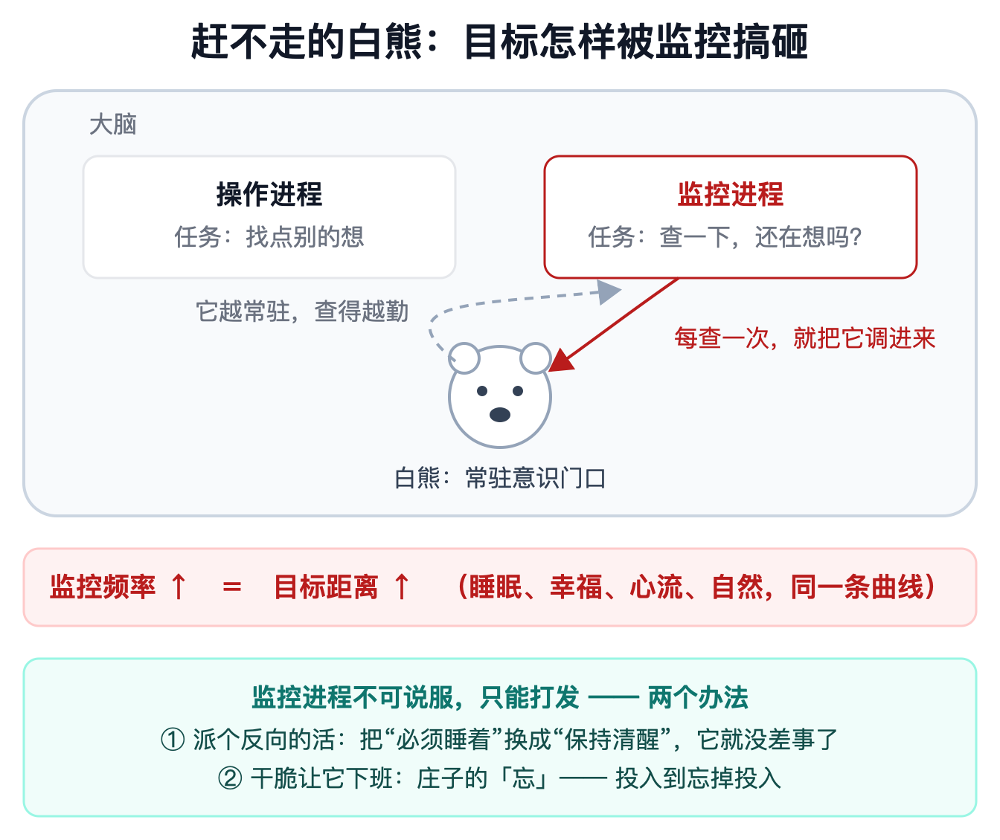
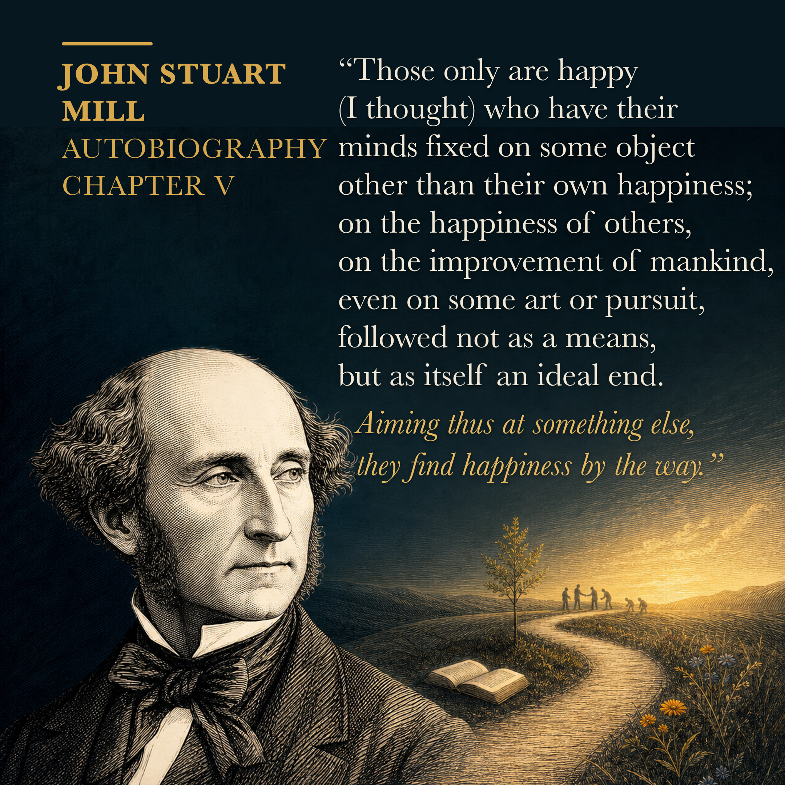
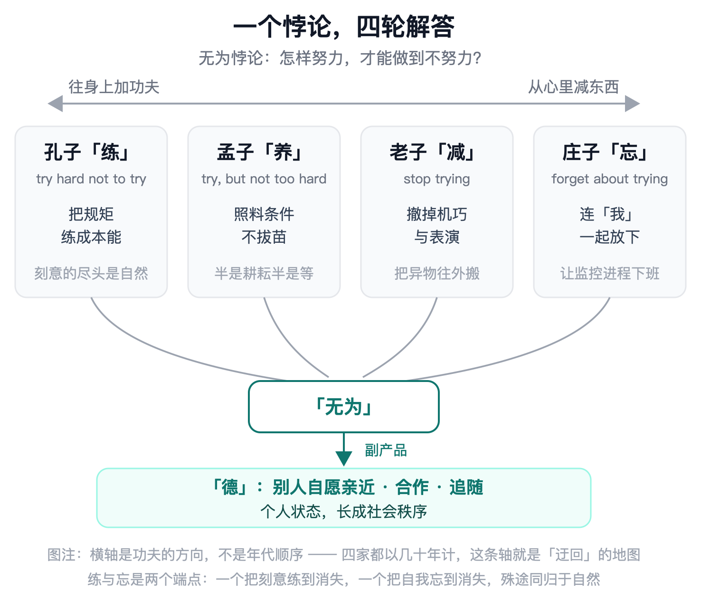
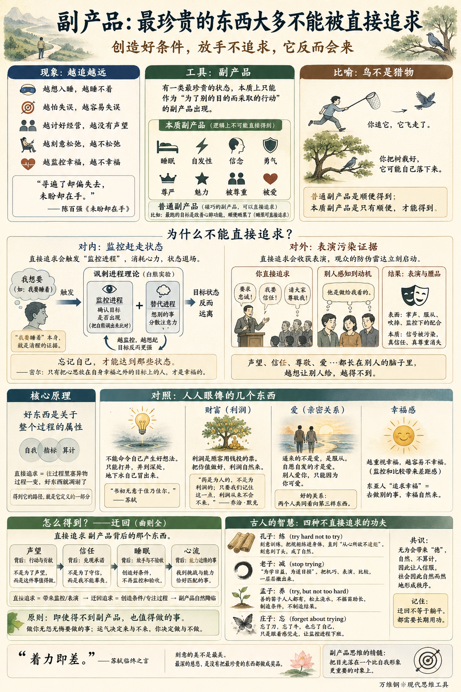

# 副产品：最珍贵的东西大多不能被直接追求

[副产品：最珍贵的东西大多不能被直接追求](https://www.dedao.cn/course/article?id=QLYWyjMZoa0J1vY0BdXp4wvzDbO26B)

2026-07-30 07:41

想象你想要改善睡眠，就买了个监测手环追踪深睡比例和心率变异性。你的目标是睡眠分数达到 90。第一晚 82 分，你很懊恼；第二晚你早早上床，躺在黑暗里反复默念“快睡快睡”，结果才 74 分；第三晚你居然有点害怕上床睡觉。没过多久，你确定自己是慢性失眠患者。

有没有可能恰恰是你太想入睡，才导致自己睡不着呢？睡眠医学界对此有个专门的说法，叫「完美睡眠强迫倾向（orthosomnia）」 。

其实每个人都有这样的经验：越想入睡就越睡不着。

“睡着”是这么一种状态：你越直接追求它，你就越得不到它；你只创造好条件，但不去管它，它反而来了。

生活中很多事物，特别是那些最珍贵的东西，都是这样的。你坐在桌前抓狂地找灵感，灵感不来；出去散个步，灵感突然自己来了。运动员越想着“我千万不能失误”，动作越容易变形；忘记自己，反而打出最好的发挥。到处讨好经营人缘的人，没有什么声望；大家服气的反而是那个只爱做事的人。

陈百强有一首老歌唱得好：“寻遍了却偏失去，未盼却在手。”

这可不是文化人的自我安慰。这背后有规律。我们前面说了，你应该自己给自己设定目标函数，你有权追求自己想要的东西。可是这一讲要说的是：你最想要的那些东西，恰恰不能直接写进目标函数。

这个思维工具，叫做「 **副产品** 」。

✵

1983 年，挪威社会科学家乔恩·埃尔斯特（Jon Elster）出了一本叫《酸葡萄》（ *Sour Grapes* ）的书，书中有一章就专门研究这种现象。埃尔斯特说，有一类心理状态和社会状态，只能作为“为了别的目的而采取的行动”的副产品出现。

埃尔斯特把这种状态称为「 **本质副产品** （states that are essentially by-products）」，他列举的事物包括睡眠、自发性、信念、勇气、尊严、魅力、被尊重和被爱。

“本质”的意思是这些东西本质上\*只能\*是副产品。世界上有很多东西\*碰巧\*是副产品，比如你晨跑是为了改善心肺功能，顺便还晒黑了 —— 晒黑就是一个碰巧的副产品，你想要专门去晒黑也是可以的。

本质副产品，则是根本就不可能直接得到 —— 不是“很难直接得到”，是逻辑上不可能。

为啥呢？因为只要你是有意地直接制造它们，你这个制造的企图本身，就自动排除了你想制造的那个状态。

比如说**表演**。真正自然的表演一定具有自发性。你越想\*演\*得自然，你就已经不是自发的了，你就越僵硬。

还有**魅力**，一个人妙语连珠神采飞扬，我们说他有魅力；可他一旦开始\*展示\*魅力，你立刻就觉得他做作。

**讲笑话**，你告诉观众赶紧笑，观众反而不想笑。

**心流**，我们讲过很多次，这是一种特别高效、但同时也是一种忘我的状态：你要是干得正投入忽然问自己一句“我现在是不是在心流里”，你就已经离开了心流。

还有最近流行的「 **松弛感** 」，它的定义就是那种压根不在乎的状态。结果现在红了，很多人刻意追求什么松弛感穿搭、松弛感妆容，各种攻略。那你这还叫松弛感吗？

还有**声望、信任、权威、尊敬、爱**这些社会关系也都是本质副产品，它们都不长在你身上 —— 它们是长在\*别人\*的脑子里。

你可以买最好的床，但买不到好的睡眠；你可以雇一百个高学历员工，但雇不到忠诚。高级的状态往往不是猎物，而是鸟：你追它，它飞走了；你把树栽好，它可能自己落下来。

普通副产品是顺便得到；本质副产品是只有顺便，才能得到。

✵

为什么本质副产品不能被直接追求？咱们先看发生在你自己身上的状态。

1987 年，美国心理学家丹尼尔·韦格纳（Daniel Wegner）和同事做了个著名实验。他们请受试者在五分钟里\*不要\*想一只白色的熊，想到了就按铃。结果没有一个人做得到，平均每分钟至少按一次铃。韦格纳后来提出「 讽刺进程理论 （ironic process theory）」来解释这个现象：当你努力控制自己的念头“不要想”的时候，大脑里其实开着两个进程，一个负责找别的事儿想，另一个负责监控“我是不是还在想白熊”。

问题在于，监控进程要确认你没在想白熊，就必须随时把白熊调出来比对。于是白熊一直坐在你意识的门口。

你越想控制，监控越勤快，目标离你越远。

失眠就是这个结构。“我要睡着”这个念头本身就是醒着的证据。睡眠需要意识退场，需要放弃控制 —— 而失眠者是在用控制追求放弃控制。

幸福感，也是如此！英国哲学家密尔（John Stuart Mill）有句名言：「 只有把心思放在自身幸福之外的目标上的人，才是幸福的 」 。

2011 年，美国心理学家艾丽斯·莫斯（Iris Mauss）团队发现，越是重视幸福的人，越不幸福，而且这个效应恰恰在最有理由幸福的顺境里最明显。这里的机制跟白熊一模一样：重视幸福的人给自己设了个幸福标准，然后时时监控“我现在够幸福吗” —— 一监控，就得比较，一比较，差距感就出来了。

记住密尔那句话。它适用于所有发生在你身上的最珍贵的状态：忘记自己，才能达到那些状态。

✵

再看那些只能由别人决定的东西。

公司开大会，要求员工发扬主人翁精神；老板一边大讲特讲自己的丰功伟绩，一边表现出亲民的姿态；员工代表挨个上台发言表忠心……你说这能收获信任、声望和尊敬吗？

你收获的恐怕只是一份信息量为零的民意测验结果。逼人表态只能收获表演。

声望、信任、尊敬，这些判断之所以值钱，恰恰因为它们难以伪造。

而观众早就进化出了识破伪造的雷达。想想看，一个人对你好，你关心的肯定不只是“他做了什么”，更是“他为什么这么做”。一旦你闻出他是做给你看的，那么他做得越多，你扣分越狠。一个人一旦发现你太想让他崇拜你，他就会把你这份“太想”本身当成负面证据。

求人尊重，是最快失去尊重的方法。

如果价码足够高或者惩罚足够狠，别人可以假装给你声望，但那只是赝品。求声望，得到关注和吹捧；求权威，得到服从和沉默；求信任，得到监控之下的暂时配合……一百个人真心鼓掌，跟一百个人被枪顶着鼓掌，声学信号完全一样，社会事实完全不同。

权力是别人不敢违抗你；权威是你根本用不着让别人怕你。

✵

简单说，对内，直接追求好东西会导致监控，监控赶走状态；对外，直接追求会收获表演，表演污染证据。

其实这是同一个原理 ——

好东西都是关于“整个过程”的属性 —— 睡眠是关于你的意识，自然是关于你的动机，声望是关于你长年累月怎么做人 —— 直接追求它们，就是往过程里塞进一个异物：一个自我，一个指标，一份算计。过程一变，长在过程上的东西也就凋谢了。

对这些最珍贵的东西来说，得到它的路径就是它定义的一部分。

✵

对照本质副产品的原理，咱们再看几个人人眼馋的东西 ——

**一个是灵感和创造力**。你不能命令自己“现在，产生一个好想法”。好想法就像是地下水，你不是直接打水，你只能打井 —— 井打到某个深度，水自己冒出来。

苏轼说书法是“书初无意于佳乃佳尔”。写字这件事，一开始没想着写好，反而写好了；你抱着“这一幅要传世”的念头提笔，笔笔都是算计，字就死了。

陆游八十四岁教儿子作诗，说的也是这个：“汝果欲学诗，工夫在诗外。”

**一个是企业家的财富**。英国经济学家约翰·凯（John Kay）2010 年有本书叫《迂回》（Obliquity），考察了一大批公司，提出：最赚钱的公司，往往不是把利润挂在嘴边的公司。

为啥呢？因为利润是顾客用钱投的票。1950 年，制药巨头默克公司总裁乔治·默克（George W. Merck）在一次演讲里说：药是为人的，不是为利润的；只要我们记住这一点，利润从来不会不来。

**还有一个是爱**。如果你逼着别人爱你，天天审问“你到底爱不爱我”，对方肯定就爱不动了 —— 你要的已经不是爱而是服从。自愿自发的才是爱。别人爱你只能是因为你可爱。

所以谈恋爱绝对不能揪着“关系本身”反复检修：我们的关系正常吗？你是不是没那么爱我了？咱们讲「第三物」的时候说过，好的关系不是你看着我我看着你，而是两个人共同看向第三样东西。

✵

那既然最好的东西都不能直接追求，我们怎么才能得到呢？答案就是约翰·凯那本书的书名：「迂回」—— 中国话就是「曲则全」。

如果你真想要副产品，你应该直接追求的，是副产品\*背后\*的那个东西。

声望的背后是行动和贡献；信任的背后是一次次被兑现的承诺；睡眠背后是不再验收的放手；心流背后是一件难度恰好贴着你能力边缘的事。

前面说的那个“越追求幸福越不幸福”的研究还有个后续。2015 年，美国心理学家布雷特·福特（Brett Ford）与莫斯合作的跨文化研究发现，咱们东亚人，反而是说要追求幸福就容易得到幸福。为啥呢？因为东亚人说要追求幸福的意思是一种行动，他会去多陪家人、多帮朋友 —— 我们把“追求幸福”翻译成了“去做别的事”，结果幸福作为副产品自然降临。

✵

你完全可以理直气壮地想要声望、想被爱、想发财，但你必须迂回。埃尔斯特本人特意做过区分：你完全可以希望被人敬佩，也完全可以预见你的行动会带来敬佩 —— 只要你做这件事\*不是为了\*敬佩。

不是“我要显得勇敢”，而是“这件事值得我冒险”；

不是“我要做个守信的人”，而是“这个承诺我不能辜负”；

不是“我要当有声望的作家”，而是“这个问题必须讲清楚”。

别盯着自己，要把目光落到一个比自我形象更重要的对象上。

✵

其实这套“不直接追求”的功夫，咱们中国人两千年前就琢磨得很深了。我们《精英日课》专栏第一季解读过加拿大汉学家森舸澜（Edward Slingerland）的一本书叫《无为》（Trying Not to Try），就提供了一个特别好的框架。

森舸澜把先秦思想史读成了对同一个悖论的四轮解答：人最高级的状态是「无为」，自然而然、毫不费力，讲究个不努力 —— 可是你怎么努力，才能做到这种不努力呢？

**孔子的办法是「练」（try hard not to try）。**礼乐射御，几十年刻意训练，把规矩练进身体，直到“从心所欲不逾矩” —— 刻意到了头，就成了自然。

**老子的办法正好相反，是「减」（stop trying）。**“为学日益，为道日损”，社会教给你的机巧、表演、比较，都是往过程里塞的异物，修行就是把异物一层层撤出来。

**孟子的办法是「养」（try, but not too hard）。**孟子认为善的苗子人人心里都有，你不能“揠苗助长”，你只能当农夫，松土浇水，让它自己长。农夫并不制造庄稼，农夫只制造庄稼愿意发生的条件。

**庄子干脆把问题本身扔掉，他的办法是「忘」（forget about trying）。**庖丁解牛，技艺纯熟到“以神遇而不以目视”，忘了刀，忘了牛，也忘了自己，只是跟着感觉走 —— 也就是“让监控进程下班”。

四家谁也没说服谁，这里没有完美解。但是四家有一个共识：无为会带来「德」，一种让人信服的感召力。有德之人，是自然的、是不算计的，所以别人觉得他可信，愿意亲近、合作乃至追随。统治者有德，就能不用威胁和奖赏而让人自愿服从，于是个人状态便输出成了社会秩序。

这就是为什么先秦诸子都想得到无为，而且他们都知道不能直接抢，必须迂回。他们也全都同意：迂回不等于躺平。孔子的练、老子的减、孟子的养、庄子的忘，哪一样都要花很多年的功夫。你要什么都不干，那不是无为，那是无所作为。

✵

那你说，我把所有条件都经营对了，可万一副产品还是不来，那怎么办呢？

不来就不来呗。来与不来，那是运气；做与不做，那才是你能控制的。

你最好选那些即使副产品没有来、无人喝彩，也值得做的事。你要知道有些人就是无怨无悔地在做那些事。那你说到时候真有回报应该优先给谁呢？

妙就妙在，这份“不指望”恰恰是唯一能通过防伪雷达的信号：你越是真的不为声望而做，你做的事越有资格成为声望的证据。

往大了说，“好东西只能是副产品”，不是世界的缺陷，而是世界的庆幸。如果什么东西都可以直接争夺，爱可以明码标价，尊敬可以下单购买，声望按预算投放，人人急头白脸地参加「摩洛克」，那可就太难看了。

✵

“刻意的美不是最美”，你不觉得这个设定本身很美吗？

辛弃疾说：“众里寻他千百度，蓦然回首，那人却在，灯火阑珊处。”又说：“著意寻春不肯香，香在无寻处。”都是这个意境。

1101 年，苏轼在常州病重。弥留之际，两个朋友在耳边提醒他千万不要忘了往西方极乐世界去 —— 苏轼说出了人生的最后四个字：

“着力即差。”

是啊，你要拼命用力，那可就差了。

这个世界最深的一点慈悲，是没有把最珍贵的东西都做成奖品。

---

这篇文章探讨了一个深刻的思维模型与人生哲学：**“本质副产品”（Essential By-products）**。它揭示了一个普遍存在的反直觉规律——**生活中最珍贵的状态和关系，在逻辑上就无法通过“直接追求”获得；越用力抓取，越加速失去。**

### 核心概念：什么是“本质副产品”？

- **普通副产品 vs. 本质副产品：**

  - *普通副产品*是“碰巧得到”（例如跑步顺便晒黑，但你想专门晒黑也可以）。
  - *本质副产品*（挪威社会科学家乔恩·埃尔斯特提出）是\*\*“只有顺便，才能得到”\*\*。它在逻辑上排斥直接追求：**只要你企图直接制造它，这个企图本身就自动摧毁了它赖以存在的条件。**
- **范畴清单：** 睡眠、灵感、心流、松弛感、幸福感；以及外在的声望、信任、权威、被爱和尊敬。
- **一句话本质：** “得到它的路径，就是它定义的一部分。”好东西是整个过程自然结出的果实，直接追求它，等于往纯粹的过程里塞进了一个“自我、指标与算计”的异物。

### 运行机制：为什么“直接追求”必然失败？

文章从**“对内（自我心理）”和“对外（社会互动）”**两个维度，剖析了直接追求导致失败的底层机制：

#### 1. 对内：讽刺进程理论（The Ironic Process Theory）

- **机制：** 当你试图控制大脑进入某种状态（如“快睡着”、“别想白熊”、“我要幸福”）时，大脑必须启动一个**“监控进程”**来核验自己是否达标。
- **死锁：** 监控进程要核验目标，就必须不断调出反向参照物。结果，“我要睡着”成了保持清醒的证据；“我要幸福”成了感知现实差距的放大器。
- **结论：** 很多高级状态（如睡眠、心流）需要**意识退场与放弃控制**，而“直接追求”是在用**加强控制**去追求**放弃控制**，南辕北辙。

#### 2. 对外：防伪雷达与表演陷阱

- **机制：** 信任、爱与尊敬，本质长在别人的脑子里，无法单方面索取。人类进化出了极高敏锐度的“动机探测雷达”。
- **死锁：** 别人关心的不仅是“你做了什么”，更是“你为什么做”。一旦发现你是为了获取声望或好感而表现，这种“太想得到”的算计本身，就会立刻被判定为负面证据。
- **结论：** 强求权威得到的是服从（权力），强求声望得到的是吹捧（表演）。**直接索取，只能收获毫无价值的“赝品”。**

### 破局解法：迂回策略（Obliquity）

既然不能直接写进目标函数，如何才能得到？答案是**“曲则全”**，把目光从“目标结果”移开，对准“副产品背后的基底”。

1. **去中心化（Forget the Self）：**

   - 将注意力从“自我形象/感受”转移到一个**比自我更重要的客观对象**上。
   - *思维转换：* 不是“我要显得勇敢”，而是“这件事值得冒险”；不是“我要发财”，而是“这个产品对人有益”；不是“你爱不爱我”，而是两个人共同看向第三样美好的事物。
2. **先秦诸子关于“无为”（Trying Not to Try）的四种迂回路径：**

   - **孔子的“练”：** 刻意训练至极致，化规矩为身体本能（从心所欲不逾矩）。
   - **老子的“减”：** 剔除社会的机巧、比较与算计，让异物自然退场。
   - **孟子的“养”：** 像农夫一样只改善土壤与水源，不揠苗助长，静待生命力萌发。
   - **庄子的“忘”：** 技近乎道，物我两忘，彻底让意识深处的“监控进程”下班。

### 终极哲学：世界的防伪与慈悲

文章在结尾升华到了极高的存在主义与生命审美境界：

1. **终极防伪：唯有“不指望”，才是真正的入场券**

   - 做那些即使无人喝彩、没有副产品降临也依然值得做的事。
   - **你越是真的不为回报而做，你的行为才越具备产生回报的纯粹性与信服力。**
2. **苏轼的“着力即差”：**

   - 生命中很多事情，越是用力过猛，偏差就越大。自然流淌的状态，永远胜过精密设计的刻意。
3. **世界最深的慈悲：**

   - 如果幸福可以被算计，爱可以明码标价，尊敬可以用资本直接采购，世界将沦为极度残酷的达尔文式“摩洛克（Moloch）竞争”。
   - **宇宙没有把最珍贵的东西做成可以通过强力抢夺的“奖品”，而是做成必须由真诚与投入孕育出的“副产品”，这是世界对人类保留的最后一份温情与诗意。**