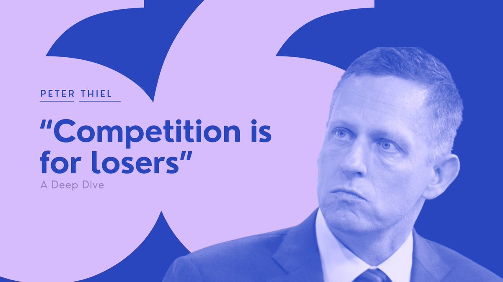

# 经济租：赚钱的秘密

[经济租：赚钱的秘密](https://www.dedao.cn/course/article?id=QLYWyjMZoa0J1vYA0dXp4wvzDbO26B)

2026-05-20 22:45

这一讲我们进入「赚钱」板块。想要赚钱，你必须创造某种价值。

主流经济学家吵了一百多年才承认，价值不是由什么“社会必要劳动时间”决定的，它没有客观的测量方法 —— **价值是一种主观的东西，它是由需求决定的。**

但人的需求并非完全不讲理，你确实得拿出真东西来才行。硅谷的创业课说得明白：要创造价值，你就得解决「用户痛点」，提出「价值主张（value proposition）」，先做一个「最小可行产品（MVP）」试水，找到「产品市场匹配（product market fit）」，要持续创新、要提高效率、要让用户增长、要有护城河、要长期主义等等等。

这些都是对的。但是这些只解释了财富是怎么\*产生\*的，却不能完全解释财富最后落在了\*谁\*的手里。

我们需要一个直指人心的洞见。

想象有一天，你参观了一家非常赚钱的私营企业。你发现他们员工管理是挺严格，但机制看起来有点土；他们的技术是有一些，但也没强到让你肃然起敬。车间墙上挂着“天道酬勤”，办公室里摆着红木家具，老板身上似乎有一股草莽气息，对科技什么的不是那么敏感。你承认他们做事有章法，也注重质量，也控制成本，也做研发，那些肯定都有用……可是你忍不住想：就这？

你自己所在的公司全是高学历人才，可赚不到人家那么高的利润。你几乎想冲进去问那个老板：你到底是怎么赚钱的？

他的秘密不在媒体报道里，也不在给员工宣讲的价值观里。我来告诉你他是怎么赚钱的：这家私企的主要业务是为一家大型国企做零部件配套；而这位老板，是那家国企的董事长的小舅子。

赚钱真正的秘密，叫做「**经济租**（Economic Rent）」。

先别着急谴责这位小舅子。**能够长期存在的超额收益，背后往往都站着某种“租”。**

经济租是指一笔收入里，超过“让这个资源继续被提供所必需的最低报酬”的那一部分。这个定义有点绕，我再说直白一点：这个事儿，本来给 5000 块钱你就能干，但因为某种原因，现实中别人必须付给你 20000 块钱 —— 这多出来的 15000 块，就是经济租。

比如说你家有个公寓楼对外出租。管理公寓当然需要成本，但那些成本很低，你完全可以雇个人替你干，而你自己坐收租金的大头。凭什么你能坐地收钱呢？

因为那个公寓楼是你的。可能是拆迁补偿，也可能是你家以前赚的钱买的……不管你是怎么拥有的，你收租是因为你\*拥有\*，而不是因为你在\*做\*什么。

你仔细品一品，这可不是寻常的认知。学校教的都是好好做事创造价值，可没教你通过拥有而收租。 然而「价值创造（value created）」和「价值捕获（value captured）」并不是一回事儿。也许你很擅长创造蛋糕，但是你未必能分到多少蛋糕 —— 现实中的创新者往往拿不到创新成果的大头，最后拿到大头的可能是那些掌握着品牌、销售、服务和支付渠道的人 —— 他们都可以收租。

如果你想赚钱，请了解下面这个心智模型 ——

**收益 = 创造的价值 × 捕获系数**

创造的价值决定你能不能上桌，捕获系数决定钱为什么留在你这里。

以前我们总说，要想赚钱就得创造某种「稀缺」的价值 —— 但我越发觉得，「稀缺」这个词不能精准地形容一个人的不可替代性：董事长的小舅子，很稀缺吗？还是「租」最为形象。

你的捕获系数之所以高，你之所以可以在这里坐收经济租，是因为你拥有一个关键卡位，以至于别人干事儿无法绕过你。

你要是觉得小舅子和收租婆这两种赚钱方式太低端，那我告诉你，在巴菲特看来，这才是真正能赚到钱的模式。巴菲特打的比方是「**收费桥**（Toll Bridge）」：两个城市之间只有这么一座桥，你们必须从我这儿过。我这个桥一旦建成，就不需要年年大规模重建，我就是坐地收钱。任何一个生意要想是好生意，它里边就得有这么一种像收费桥一样的东西。

只不过有些人的收费桥是自己创造的，是生产性的；有些人的收费桥是靠关系堵出来的，是寄生性的。

如果没有这种不可替代性，你再聪明、再努力也不行。比如你做这一单赚 50%，旁边马上就会有人说，我 45% 也干；再来一个说 15% 我都行；再过一会儿，单价就被压到只剩辛苦费，那叫打工不叫赚钱。可是如果你拥有一个卡位，让别人必须通过你，你甚至什么都不用做就可以反复收租。

学术界早就在研究“租”，越研究就越感到赚钱就得靠“租”。

早在祖师爷亚当·斯密 1776 年出版的《国富论》一书中，就已经直觉地提出，土地所有权会吸走高于正常工资和正常利润的剩余。

到了 19 世纪初，古典经济学家李嘉图（David Ricardo）把这个直觉系统化成了地租理论：我们考虑两个农民花费同样的力气种地，如果你种的是一块肥地，你的收益就会比种薄地的那个人好得多 —— 那你多出来的这些收益，难道你能白得吗？那早晚是你应该交给地主的租：因为地租只要不高于这个收益，你都会愿意交。

然后是 19 世纪末，马歇尔（Alfred Marshall）搞了个观念跃迁，把租的概念从土地推广到机器、建筑和技能，称之为「**准租**（quasi-rent）」：只要某种资源短期内搬不走、替代难，它就可能产生超额收益。

这就是经济租。至此经济学家已经意识到，超额收益最终会沉淀到某种因为稀缺而被占有的位置上。

1967 年，公共选择理论经济学家戈登·塔洛克（Gordon Tullock）提出，“有人拿到租”这件事本身未必造成多大社会危害，真正造成危害的是所有人开始为抢租而浪费资源，这就是现在常说的「**寻租**（Rent-seeking）」这个概念的起源。如果最聪明的人不去创造价值，而是去抢位置、拉关系、抢牌照，社会经济岂不就从创新竞赛滑向寻租竞赛了吗？

有人寻租就必定有人想「**设租**（Rent-creation / Rent-setting）」，也就是掌握权力或者资源优势的人，人为地制造出一种稀缺性或者行政壁垒。这正是董事长和小舅子的故事。

那么 1974 年，国际贸易与发展经济学家安妮·克鲁格（Anne O. Krueger）进一步指出，现在社会中的很多制度设计，比如说牌照、配额、限制竞争等等，其实就是在制造租和诱发寻租。

至此你可能觉得“租”就是不劳而获……但学者们在 1990 年代又有了一次观念跃迁。

1993 年，战略管理学者玛格丽特·彼得拉夫（Margaret A. Peteraf）提出，一家企业要想长期获得超额收益，就得有持续的「**竞争优势**（competitive advantage）」，包括你的资源必须有差异性，竞争者既不能轻易复制你，也不能轻易把你那个资源买走等等 —— 这不就是“租”吗？

1996 年，两个战略学者，亚当·布兰登伯格（Adam M. Brandenburger）和哈伯恩·斯图亚特（Harborne W. Stuart, Jr.）提出「**附加值**（added value）」的概念，说一个主体能赚多少钱，不是取决于你有多辛苦，而是取决于如果没有你，这个系统会坏到什么程度。如果没你人家照样达成合作，那你就只能赚个辛苦钱；反过来说，比如你是个交易平台，没你这个局就组不起来，那你就有了捕获价值的资格。说白了，就是你占住了一个别人不能轻易替代的位置，你可以收租。

总结来说，只要你拥有一个别人没有的东西，这个东西就算人家看见了也学不会、挖不走，而且也不能以公平的价格买到，这就是你的经济租。

**经济学家说“租”，战略学家说“竞争优势”和“附加值”，投资人说“护城河”、“收费桥”和“定价权”，产品人说“卡位”和“入口”**……等等等，他们说的其实都是同一件事：你是否占住了一个别人短期内绕不过去、替代不了、复制不来的位置。

我们可以大致梳理一番，捕获经济租有至少八种生态位 ——

第一是**土地**。黄金地段的铺位、核心商圈的广告位，重点港口的泊位，亦或是自然资源的开采权，这些地方即便科技再发达，也永远是稀缺的。你不管用什么手段占住了这些位置，就可以收租。

第二是**证书**。它的稀缺性来自制度的许可。出租车牌照、办学资质、某种商品的特许经营权，比如中国的烟草专卖，还有行医执照、审批名额，甚至包括专利和版权……这些都是人为制造的稀缺。政府会说搞这些是为了保护市场，但现实是至少在一定程度上，资质是为了把竞争者挡在门外。

第三是**信息**。如果你掌握一个信息或者专业知识而别人不掌握，那你就可以利用这种不对称去做一些别人没法做的生意，比如尽职调查、量化交易、资产估值、二手房、复杂合同、跨境贸易、艺术品、医疗等等。专业有天然的壁垒。

第四是**关系**。也就是“小舅子模式”。有些关系确实属于腐败，但更多时候，关系有正面的作用，因为它降低了交易中的信任成本，比如核心客户资源、特殊的采购渠道、政府关系等等。政府有一笔基金专门用于“专精特新”项目的投资，可是负责的官员根本看不懂那些项目计划书，但是他信任你的推荐——那你说这能叫腐败吗？如果有人想从中收取一笔推荐分成，又该怎么算呢？

第五是**声望**。**这个技能你不仅会干，而且只有你能干。**比如说核心人才和文体明星，他们只要出面就好使，那么他们有权收取一个品牌溢价。

第六是**接口**。这是互联网平台公司的强项，它相当于是过路费 + 广告费 + 排序费。你们公司辛辛苦苦开发了一个 App，卖软件也好卖内容也好，只要用户是在苹果手机上付款，你们就得交 30% 的“苹果税”。包括抖音的流量、百度的搜索、微信和支付宝的支付，这些都是数字时代的收费大桥。**AI 时代最大的收费桥，是英伟达。**

第七是**配套**。你是整个商业模式中的一个必经环节，没有你这个事情就跑不动。比如你是供应链的一环，或者你掌握分销网络、冷链、售后服务和维修体系、充电网络等等，你就是那个“卖铲子”的人。

第八是**资金**。钱在这个时代并不稀缺，但如果你很有钱，那的确是一项能力。你经得起非遍历性的风险，你就可以收取风险溢价、流动性溢价和利息。没有你，别人可能就等不起、扛不起、借不到、熬不过。典型例子是银行、保险、贸易融资、库存控制、危机时手握现金的人和能忍五年不盈利的耐心资本。

**你看，我们天天讲要创造价值，可是真正的赚钱靠的是“拥有”。**

那你说这也太不公平了，难道不应该让创造价值的人拿大头吗？我们不是一直讲「供给侧心态」吗？现在这不成零和博弈了吗？

咱们得从两个层面分析。首先，你要从市场上获得收入，就必须创造某种价值。就连董事长的小舅子也得开个公司，组织人把产品保质保量生产出来才行。我们还是那句话：只要交易是双方自愿发生的，它就对双方都有好处，有交易总比不交易强。**所以创造价值和供给侧心态是市场经济的第一性原理，是「零阶道理」。**

**但如果你想赚钱，你想拿比平均水平更多的回报，那你就需要在承认零阶道理的基础之上，做一点一阶的功夫。你就得在合作的基础之上有所独占才行，这就是经济租。**

我们搞高科技是不是为了造福全人类？的确是的。那我们想不想搞出一个专利来，收取一波独占的租？的确也是的。这两件事未必矛盾。我通过收租赚取一大笔钱，然后我才可以用这笔钱去做更大的冒险啊！

有时候企业家会忍不住直接说出来：**我们其实并不想整天跟人竞争 —— 我搞研发、拼市场，是为了站到那个无人可以跟我竞争的位置上去。**比如硅谷思想家彼得·蒂尔（Peter Thiel）就有句话说：「只有 losers 才竞争。」

始终保持竞争状态就意味着你没有护城河：你光做得比人好还不行，还得做得比人便宜。你本质上就是打价格战，用中国话说就是“卷”。

就连一向主张政府发挥作用的经济学家玛丽安娜·马祖卡托（Mariana Mazzucato）也认为，有些租是「好租」，比如创新租；有些租则是「坏租」，比如长期依靠制度壁垒、平台控制和政策设租固化下来的抽取型收益。

市场竞争不是要消灭一切经济租，而是要不断压低过高的租金。好市场不是没有收费桥，而是桥旁边永远允许别人修新桥；不是没有巨头，而是巨头不能勾结政府把后来者永远挡在门外。

自由市场的本意是“自由竞争”，不是“自由收租”。

还是回到个体。理解了经济租，如果你没有一个当董事长的姐夫，你该怎么办，才能捕获价值呢？

**首先，你要争取竞争优势。**它一定是一种复利，是一种能资产化的东西，而绝不是卖工时。难以替代的技能、个人声誉、信任关系、独家信息、分发渠道、行业理解，哪怕是一点点耐心资本，都是可能收取溢价的。

再者，你想要加入一家公司也好，或者想要投资一家公司也好，一定不能光看它的老板说什么，别只听什么价值观，也别只看它的产品牛不牛，**你必须知道它的“租”在哪里。**你必须发现这家公司真正用来赚钱的商业模式，找到其中的关键中介。然后你才知道该怎么办。

**还有，一定要有强烈的卡位意识。**就拿配套租来说，伯克利哈斯商学院的大卫·提斯（David Teece）有个著名理论，叫作「互补性资产（Complementary Assets）」，就是说如果你能控制渠道、售后或者平台入口之类的环节，你很可能比创新主角赚到更多的钱。这些环节没有那么酷，但它们是价值链的守门人。

卡位的人往往比干活的人赚钱多，出力的不一定得利，做局的常胜过做工的，勤奋得工资，瓶颈得分红，此事古难全。

**质疑不如理解，理解不如成为。**当然不一定成为小舅子，世界上有多种途径，但关键是你要有意识地去争取经济租。

以及批判别人霸占的那些坏租。

**【尾声小诗】**

> 聪明苦干未尝丰，  
> 厚利常藏隘口中。  
> 好租坏租皆枢纽，  
> 谁据咽喉百业通。

---

### 核心洞见

一份残酷的社会生存指南。它把“勤劳致富”的温情面纱掀开，告诉你财富分配的底层逻辑是**“卡位”而非仅仅是“创造”**。

对普通人而言，最致命的启示不是去谴责“小舅子”，而是**重新校准自己努力的方向**。

普通人的出路，是**停止在红海中拼刺刀（停止卷时间、卷价格），找到一个哪怕很小，但是别人绕不过去、学不会、挖不走的“卡位”，把一锤子买卖变成持续的复利。**

商业世界和财富分配的底层逻辑：**财富不完全取决于你有多努力，也不完全取决于你创造了多少价值，而是取决于你有多“不可替代”（捕获系数）。**

#### 1. 认知重塑：把“做事思维”升级为“占位思维”

核心公式：**收益 = 创造的价值 × 捕获系数**。

普通人受的教育让你聚焦在“创造的价值”上，但赚钱的秘密在于“捕获系数”。

- **启示：** 如果你发现自己每天只是在“卖工时”，你的收入就只是“辛苦费”，没有“租”的成分。一定要问自己：**我现在的这份努力，是一次性卖掉的，还是能沉淀下来变成未来收租的资产？**
- **行动：** 就算在公司打工，也要主动去占领那些带有“接口”或“配套”属性的环节。比如掌握客户的信任关系（关系租）、成为唯一懂那个老旧核心系统的专家（信息/声望租）、或者控制住供应链上容易被忽略但离不开的环节（配套租）。不要把事儿做完就算，要把**事儿变成关卡**。

#### 2. 赛道选择：识别并靠近“收费站”

八种经济租，普通人最可能切入的是**信息、声望、接口、配套**这四种。

- **做“卖铲子”的人（配套租）：** 如果某个行业竞争激烈不赚钱，你不要去和他们在红海里厮杀，去做他们离不开的基础设施。比如给淘金者卖水、给摆摊者提供灯光和推车、给自媒体博主提供剪辑或数据分析服务。你就是那个收“过路费”的人。
- **做“降低门槛”的人（信息租）：** 世界信息不对称永远存在。如果你能搞懂复杂的政策（如政府补贴、专精特新申报），弄明白跨境贸易的关务，或者掌握估值、二手交易的隐秘知识，你就可以凭此收租。知识本身不值钱，**知识不对称才值钱**。
- **做“缝合系统”的人（接口租）：** 哪怕是一个小社群的群主、一个业内关键信息的集散地、一个供需双方的撮合者，只要这个局没了你就散了，你就有了收租权。

#### 3. 警惕伪“租”：区分“好租”与“坏租”，别做寻租的牺牲品

生产性的“创新租”和寄生性的“关系租”。

- **警示：** 普通人最危险的行为，是拼命去挤入一个靠“坏租”（如论资排辈、极度依赖某领导关系）维持的体系。因为这种“租”不源于你的个人能力，一旦权力关系变动、牌照放开，你会瞬间跌回原点。
- **启示：** 你要建立的护城河，应当是**能够自由迁移的资产**。个人声誉、跨平台的认知、独家方法论、甚至是你写过的一本书的版权，这些是新时代你个人的“土地”，谁也拿不走。警惕那种把你驯化得离开平台就什么都不是的“寄生性租金”。

#### 4. 心态上：理解游戏规则，但不只做批判者

“质疑不如理解，理解不如成为”。

- **启示：** 看到别人靠关系获利，如果只是愤愤不平，就浪费了这次认知升级的机会。你要看透“他能赚钱是因为占据了哪个咽喉”，然后去观察，在这个生态系统里，还有没有其他可以合法、合理去占据的要塞。
- **终极策略：** **持续创造价值让你“上桌”，不断修筑护城河让你“分钱”。** 没有前者，你是骗子；没有后者，你是雷锋。两手都要抓，但重心可以向后者倾斜。

**别只埋头拉车（创造价值），要抬头看路寻找并占据那些别人绕不过去的咽喉（捕获价值）。把你的一切努力，都指向那些能变成收费站的东西，哪怕只是一个小山头。**

如果你愿意说说自己目前所在的行业或工作性质，我们可以具体分析一下，那个行业里真正的“收费站”可能藏在哪里。

### 认知觉醒：停止纯粹的“卖苦力”，思考如何“收租”

#### **1. 努力不等于赚钱，赚钱取决于“稀缺位置”**

- 普通人最大的思想误区是“天道酬勤”和“一分耕耘一分收获”。现实是，如果你所做的工作门槛极低（比如送外卖、流水线、普通的文档处理），哪怕你一天干16个小时，你也只能拿到“辛苦费”。**因为你随时可以被降价的人替代。**
- 你的目标不应该是“怎么比别人干得更辛苦”，而是“怎么让自己变得不可替代”。

#### **2. 区分“创造价值”与“捕获价值”**

- 你可能给公司完成了一个能赚100万的项目（创造价值），但老板只给你发了1万块奖金。为什么？因为平台的品牌、客户关系、支付渠道是老板的，他拥有“捕获系数”。
- 不仅要低头拉车干活，更要抬头看路，想办法把部分资源（如人脉、核心技术、客户信任）沉淀在自己手里。

### 行动指南：普通人如何建立自己的“经济租”？

普通人没有“土地”、“行政牌照”和“巨额资金”，但可以在另外5个生态位上建立自己的“收费桥”：

#### **1. 打造“信息租”：赚信息差与认知差的钱**

- 去钻研一个冷门、复杂、或者新兴的领域。当系统需要这个专业知识，而周围只有你懂时，你就有了定价权。
- 成为公司里唯一精通某种复杂软件的人；成为朋友圈里最懂某项国家补贴政策的人；或者在AI时代，成为最懂得如何用AI帮传统企业提高效率的“连接者”。

#### **2. 积累“声望租”：打造个人IP与品牌**

- 如果你的名字就代表了“靠谱”、“高质量”、“专业”，人们就会为了不确定性而向你支付溢价。
- 珍惜自己的羽毛，把每一件小事做到极致。当行业内的人遇到特定问题，第一个想到的是你时，你的“声望收费桥”就建成了。

#### **3. 编织“关系租”：成为信任的节点**

- 不要把关系仅仅理解为“走后门”。高质量的商业关系是**“降低交易的信任成本”**。
- 成为连接不同圈层的节点。比如你既懂技术又懂销售，你能把这两拨互相听不懂对方说话的人连接起来，你就是必经的“接口”，你可以从中赚取溢价。

#### **4. 占据“配套租”：做巨头身边的“卖水人”**

- 没必要非去当创新主角，主角往往风险极大且竞争惨烈。去寻找商业链条中不起眼但必须经过的“咽喉”。
- 别人都在搞大模型，你可以去做AI算力服务器的液冷散热配件；别人都在做直播带货，你可以去做专业的直播间搭建和设备维修。这些不起眼的“配套”，往往闷声发大财。

### 职场与投资抉择：看透公司的底牌

#### **1. 找工作：去有“护城河”的公司，别去纯靠“卷”的公司**

- 面试时，不要只听老板画饼讲价值观，你要默默分析这家公司靠什么赚钱。如果一家公司只能靠压榨员工加班、打价格战来维持生存，说明它没有任何“经济租”，你在这种公司只会沦为耗材。
- 加入那些有专利、有极高转换成本、掌握核心入口或牌照的公司。哪怕在里面做一颗螺丝钉，分到的汤也比在烂公司当高管多。

#### **2. 搞投资：买拥有“特许经营权”的资产**

- 如果你要买股票或做生意，用巴菲特的“收费桥”理论去筛选。只投那些“只要用户想干某事，就必须留下买路财”的企业（比如拥有垄断性IP的腾讯、控制系统生态的苹果、掌握算力命脉的英伟达、或者某种必用的基础设施）。

### 心态调整：理解现实，拥抱“好租”

#### **1. 放弃受害者心态：存在即合理**

- 看到“关系户”或者“收租婆”赚钱比你多，不要天天抱怨社会不公。要理解这是市场经济的客观规律（资源占有者的溢价）。“质疑不如理解，理解不如成为”。抱怨不能改变命运，想办法在规则之内寻找自己可以卡位的点。

#### **2. 追求“好租”，抵制“坏租”**

- 普通人没有特权，所以我们能追求的只能是**创新租、技能租、声望租**。通过持续学习、积累复利、提升不可替代性，堂堂正正地建立自己的竞争优势。