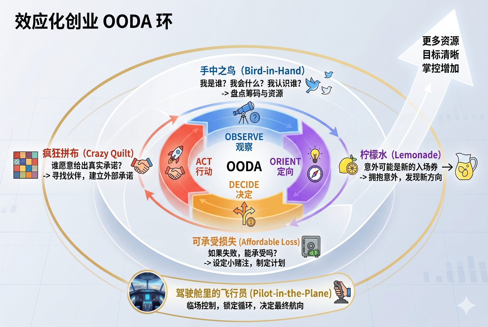

# 效果推理：不知道该干什么的时候该干什么

[效果推理：不知道该干什么的时候该干什么](https://www.dedao.cn/course/article?id=Yejy8dqoQD9JoQWBwdKR1r0xpgmWk3)

2026-05-26 22:45

有时候你感到时代大潮在召唤你。你有野心，也有时间，也有一定资源，可能还攒了点钱，还懂一些技术，甚至认识几个人，你的脑子相当可以。所以你也很想做一番事业。

问题是，你不知道该干什么。

这个风口，那个赛道，真的属于你吗？你找到自己的 Alpha 了吗？你需要一个正确方向的指引，最好有一份攻略……先看准再下注是个好习惯 —— 要严肃参与什么事业最好都有 edge。但 edge 不一定是算出来的，它更可能是干出来的，是你在跟世界的互动之中发现的。

其实你不需要等一个完美机会，也不需要先找到人生使命。也许你已有的东西，就已经可以组合起来做点事儿。你先出发，后面的事也许就会自然跟进。

我们前面讲「赛道选择」的时候提到过一个思维工具叫「**效应化（Effectuation）**」，国内一般翻译成「**效果推理**」，我看这个工具太过重要，值得专门讲一讲。

简单说， 效果推理就是：不知道该干什么的时候，先用你手里已经有的东西，干出一个会改变下一步的小结果。

对每一个想要做出一番事业却又在迷茫中原地踏步的人来说，它是一个很好的心法。

我先讲一个自己的观感：科技产品创新有两种，一种叫「憋大招创新」，一种叫「华强北创新」。

一般人想象中的创新是“憋大招”。你构思了一个伟大的产品，但是其中有若干个关键问题没有解决。于是你投入资金，组织人马，秘密研发两三年，把那些问题一个一个解决。产品一亮相就惊艳了世界，时代从此分为发布会之前和发布会之后……

乔布斯搞 iPhone 就是这样的创新。市场上原本不存在全触屏智能手机，苹果公司不得不先开发“多点触控”之类的关键技术，用好几年的时间才憋出一个大招。

我想要什么 → 这个东西面临的问题是什么 → 我解决这些问题 → 我推出产品。这就是憋大招的逻辑。

这些年我看了很多小公司的创新。特别是在像 CES（消费电子展）这样的场合，我看到了很多尚未被市场证明、还处在“进行时”状态的创新产品，我意识到大部分公司搞创新并不是对准一个需求憋大招。

他们是先看看手里有什么东西，把这些东西排列组合，弄出一个产品，就推向市场，再看看好不好卖。

我把这种创新称为「华强北创新」，因为所谓手里有什么东西，其实就是深圳华强北这个地方有什么东西：中国也好，美国也好，当今各路新硬件产品，基本上都是华强北技术的排列组合。

比如说，华强北有能够放进镜框之中的摄像头，有微型显示技术，有声音拾取和降噪技术，而现在 AI 翻译已经非常能用了 —— 那么你们公司就可以把这些组合在一起，造一个能实时翻译对面人说的话并且把字幕投射到镜片上的眼镜。这个产品叫“AI 翻译眼镜”。

你们的研发部门必须做很多工作，比如在“眼镜足够轻”和“功能足够强大”之间寻找平衡，还要考虑电池续航时间等等因素……但是，你们之所以做这个眼镜，是因为当前技术条件允许 —— 而不是因为市场真的很需要 AI 翻译眼镜。

市场能有多大？不知道。用户天天戴会不会不习惯？还有没有别的应用场景？也不知道。先做出来再说。

你做的是你\*能\*做的事儿，而不是你\*该\*做的事儿。

你多逛一逛就会发现，各种健康应用、什么可穿戴设备、AI 伴侣、情绪灯、会议总结笔、睡眠监控贴、带弓弩的无人机……都属于华强北创新。它们很多会遭遇失败。有时候你都会怀疑它们到底是在解决痛点，还是给人类生活强行增加一个痛点。

但是其中有一些会成功。而且华强北创新并不需要太多成本。做成一个产品，哪怕只卖出两万台，你也能收回投资甚至小有盈余 —— 然后看看技术变化，再做一个新的呗？也许碰到哪一个就做大了。

憋大招是乔布斯的特权。**世间大多数创新不是先有伟大愿景，而是先有一堆零件；不是从“我知道未来”开始，而是从“我手里有这些东西”开始。这就叫效果推理 。**

「效果推理（Effectuation）」这个理论是弗吉尼亚大学达顿商学院的萨拉斯·萨拉斯瓦蒂（Saras D. Sarasvathy）教授在 2001 年提出的。

我们最好把效果推理和它的反义词 —— 「 因果推理 （Causation）」，也就是「憋大招创新」 —— 放在一起理解。

因果推理是：目标已知，我来选择手段达成那个目标。比如我要做一道宫保鸡丁，那我就列菜谱，买鸡肉、花生、辣椒、葱姜蒜，然后按步骤做。

效果推理，却是手段已知，创造目标。你本来不知道要做什么菜。你打开冰箱，看见两个鸡蛋、半根胡萝卜、一点剩米饭、几片火腿……于是你决定做个蛋炒饭。

萨拉斯瓦蒂在她那篇原始论文里就用了这个厨房比喻。其实我们想想，咱们平时在家里做饭，似乎就是以效果推理居多，只有逢年过节才郑重地使用因果推理。然而我们在工作场景中的思维却都是因果推理的 —— 殊不知那未必是做事的常态。

做大项目的确得因果推理。造桥、修地铁、办奥运会、量产手机，你不可能说“我打开冰箱看看”。但如果是目标还不确定、市场还不存在、客户也说不清自己要什么的时候，你要等待因果推理就只能无限期拖延行动。现实中很多公司的做法是强行制造一种因果的幻觉，弄一份 80 页的商业计划书，预测未来五年收入曲线、市场占有率和毛利率，Excel 里一大堆数字，其实跟算命没啥区别。

萨拉斯瓦蒂跟合作者做过一个很有名的实验：找一群连续创业成功的“专家级创业者”，再找一群 MBA 学生，也就是创业新手，让他们面对同一个虚构的、极度不确定的商业场景，观察他们的决策过程。

实验发现，MBA 学生明显倾向于使用因果推理：调研、分析、预测、制定最优策略。而那些身经百战的专家们，却是大多在用效果推理。专家们没有预测未来，而是直接上手。他们问：“我现在能联系到谁？”“我能承受的最大损失是多少？”“谁愿意跟我一起干，他能带进来什么资源？”

还有一个可能有点反直觉的研究结果是：对于企业内部研发项目来说，越是创新度高的项目，效果推理和项目绩效越是正相关的；而如果是创新程度比较低、问题更明确的项目，因果推理就更有利。我们可以把效果推理和因果推理理解成搭档关系：在产品研发前期，目标模糊、市场未形成的时候，效果推理更好；一旦目标清晰、市场稳定、资源到位，那就要切换到因果推理。

**「探索」用效果推理，「利用」用因果推理。**创业早期依靠华强北，但如果你搞出了大名堂，那就得明确目标迅速上杠杆，再有闲钱了，才可以像苹果那样憋大招。

效果推理具体怎么操作呢？萨拉斯瓦蒂总结了五个原则，可以作为一套行动心法 ——

**第一个原则叫「手中之鸟（Bird-in-Hand）」** 。也就是从自己手里拥有什么出发。因果推理要问“想达到什么目标”，效果推理则要先问自己三个问题：我是谁？我会什么？我认识谁？

我是谁，就是你的性格、偏好、经验、价值观。你是喜欢跟人打交道，还是更愿意独自钻研？你能忍受慢反馈，还是必须快速看到结果？很多人创业失败不是能力不够，而是“项目人格”和本人性格冲突：你不能指望一个讨厌销售的人去做重销售的业务。

我会什么，包括你的专业技能和默会知识。你是写过代码、做过运营，还是懂供应链、做过销售，又或者有三年拍短视频经验，这些都算。

我认识谁，是你的朋友、同事、客户、社群关系……但光认识不行，得看他们愿不愿意投入一点时间、金钱、见识和信誉。

一鸟在手胜过十鸟在林。

**第二个原则叫「可承受损失（Affordable Loss）」**。因果推理问回报，但效果推理问损失。连那个市场是否存在你都不知道，你根本谈不上考虑能赚几个亿。你必须先考虑的是如果这个项目失败了，你能不能承受？

如果你的损失也就是几个周末的业余时间和一笔小钱，最多再丢一点面子，你应该立即行动。

**第三个原则叫「疯狂拼布（Crazy Quilt）」**。因果推理喜欢分析对手，效果推理必须先找伙伴。

你应该带着一个粗糙想法尽快去找人谈，比如说“我这事还没谱，但你要是愿意提供场地，将来收入分你多少多少。”看看谁愿意给出真实承诺：我愿意试用；我愿意帮你介绍客户；我愿意付一个订金；我愿意把我的渠道开放一点给你……等等等。

这就好像把布拼起来做被子一样，你手里有一块蓝布，他手里有一块红布，大家拼在一起，结果拼出了一个谁都没想到的图案。可能你还没找到市场，但是有了这些承诺，你就大概能相信你的方向是对的。

**第四个原则叫「柠檬水（Lemonade）」**。出自美国谚语：「生活给你柠檬，你就把它做成柠檬水」—— 意思是别怕意外。因果推理怕意外打乱计划，但是效果推理需要拥抱意外。意外可能是新的入场券。

用户拒绝购买你这个产品，但他们特别喜欢其中一个小功能！于是你意识到“原来真正有用的是这个功能”。你做了个科技播客节目，可是你的听众对你说的科技不感兴趣，却总爱追问你讲到的那些普通人的故事。那是不是说你的定位不该是科技评论，而是人生叙事呢？

**第五个原则叫「驾驶舱里的飞行员（Pilot-in-the-Plane）」** 。因果推理强调预测，希望有固定航线和准确的导航仪；效果推理相信临场控制。你坐在飞机的驾驶舱里，你不能控制天气，但你能控制航向、燃油、速度、沟通和迫降方案：你的行动，才是决定航向的最关键变量。

我看这五个原则连起来，正好是一个创业版「OODA 环」：**用手中之鸟\*观察（Observe）\*资源，用柠檬水原则解释意外并且重新\*定向（Orient）\*，用可承受损失原则\*决定（Decide）\*小赌注，用疯狂拼布原则\*发动（Act）\*外部承诺，同时用飞行员原则把整个循环锁定在“我能控制什么”上。**

每转一圈，你的资源池就扩大一点，你的目标就清晰一点，你对业务的掌控也增加一点。

效果推理的一个著名案例，是美国自助搬家拖车公司 U-Haul 的建立。

1945 年，二战退伍兵萨姆·肖恩（L. S. “Sam” Shoen）和妻子打算带着全部家当从洛杉矶搬家到俄勒冈州的波特兰。他们发现市面上几乎租不到可以单程异地归还的拖车。可是当时美国人口流动增加，有很多家庭都在跨州迁移，按理说这个服务应该有市场啊？肖恩就想自己开一家这样的公司。

如果是按照因果推理逻辑，肖恩得先做市场调研、弄一份详细的商业计划书、筹集巨资、招管理团队、买车队、铺全国网点、建立调度系统……但是他才 29 岁，哪有条件搞这些？

但是肖恩输得起。为了创业，肖恩跟妻子一度搬到妻子家人的牧场，以把开支压到最低。就算失败，也是肖恩的「**可承受损失**」。

肖恩有 5000 美元的积蓄和一间亲戚家的车库；他还有自己动手改装拖车的能力，有一点生活经验，还有一堆愿意帮忙的亲友。这就是肖恩的「**手中之鸟**」。

肖恩遭遇的第一个柠檬是租不到拖车，第二个柠檬是买来的拖车质量很差。但他会修车。他一边修车，一边用二手汽车底盘改装成拖车。然后他把车漆成醒目的橙色，印上 U-Haul 标识。这就是他的「**柠檬水**」。

肖恩没有自建门店，而是找各地加油站合作：加油站提供场地和管理服务，U-Haul 分享租金收入。更妙的是，他还让租客成为网络扩张者：你把拖车开到目的地，如果能说服当地加油站加盟，就获得折扣。这正是「**疯狂拼布**」：亲友、客户、加油站、服务商，每个人贡献一小块布，最后缝成了一床大被子。

U-Haul 是 1945 年夏天在洛杉矶启动的，到 1945 年底，已经有 30 辆拖车分布在波特兰、温哥华和西雅图的服务站。到 1949 年底，U-Haul 已经能在美国大部分地区实现城市到城市的单程租赁。肖恩没有对全国市场先做一番规划，但是他能一点一点往外铺：每多一个客户，目的地就多一个节点。这就是「**飞行员**」原则。

就算你不创业，效果推理也有用。

比如公司让你负责一个新业务，而你完全没有头绪，那么你可以 ——

\- 找出公司里可能对这事感兴趣的三个人（手中之鸟）；

\- 约他们出来喝咖啡，你付出的只是一点时间和咖啡钱（可承受损失）；

\- 听听他们有什么资源能加进来（疯狂拼布）。

可能你原本觉得没谱的事，三言两语就聊成了。

效果推理是一种把拥有变成资源、把关系变成承诺、把意外变成方向的能力。它本质上是一种反脆弱战略：你通过这个结构，能从与世界的互动获得信息，找到新方向。

效果推理不说“相信自己”，而说“盘点自己”；不说“梦想要大”，而说“损失要小”；不说“坚持到底”，而说“先做一小步，让现实告诉你下一步”。

效果推理是华强北宇宙的第一性原理。

**【尾声小诗】**

> 雾里没有路，  
> 但华强北可以有一步。  
> 天边没有答案，  
> 但手中已有一只鸟。  
> 先做一点，  
> 先亏得起一点，  
> 先让一个人真的加入一点。  
> 于是资源开始变形，  
> 关系开始承诺，  
> 意外开始说话。  
> 于是牌局悄悄改变，  
> 未来开始长出你的形状。

---

### 效果推理

这篇文章的核心是用「效果推理」破解"不知道该干什么"的迷茫。

1. **大多数创新不是"算"出来的，是"干"出来的。**

"憋大招创新"是乔布斯的特权，是少数派。多数人的路是华强北式的：看看手里有什么零件，组合一下，推出去，看看世界怎么反应。世界的反应，才是你下一步的原材料。

1. **效果推理的根本反转：从"要什么"变成"有什么"。**

因果推理：目标已知 → 选择手段。 效果推理：手段已知 → 创造目标。

前者像照菜谱买菜，后者像打开冰箱决定做什么。真正的反直觉在于：**后者在不确定环境下反而更有效**。MBA们做预测，老司机们直接上手——不是因为老司机懒，而是他们知道预测在雾里没用。

1. **"可承受损失"比"预期回报"更重要。**

当市场是否存在都不确定时，谈回报是算命。真正要问的问题只有一个：**如果彻底失败，我能不能承受？** 能承受，就立刻行动。这把"勇气"从一种性格特质，变成了一道简单的数学题。

1. **专家们用"承诺"来确认方向，而不是用"调研"。**

面对模糊的商业场景，有经验的创业者不问"市场有多大"，而问"谁愿意真的加入一点"。别人愿意付一个订金、愿意开放渠道、愿意提供场地——这比任何市场报告都更有信息含量，因为这是**真实皮肤在游戏里**。

1. **意外不是噪音，是信号。**

用户不买你的产品，却迷上了某个小功能——这不是失败，这是真正的方向。因果推理把意外当干扰来规避，效果推理把意外当入场券来利用。**你的枢轴点，往往藏在你最意外的那次用户反馈里。**

1. **效果推理是一个循环，不是一个决策。**

文章把五个原则对应到 OODA 环，这个类比相当精准：每转一圈，资源扩大一点，目标清晰一点。这不是"先想清楚再行动"，而是**行动本身在生产清晰度**。你不是在等一个完美起点，你是在用每一个小步骤制造下一个起点。

---

**最底层的那句话**

> 不说"相信自己"，而说"盘点自己"；不说"梦想要大"，而说"损失要小"；不说"坚持到底"，而说"先做一小步，让现实告诉你下一步"。

这三组对比，把所有励志鸡汤替换成了可操作的行动逻辑。

### 柠檬水原则

“柠檬水原则”（Lemonade Principle）通常指一种很朴素的逆境思维：

> **如果生活给你柠檬，就把它做成柠檬水。**

也就是：面对已经发生、无法改变的现实，不把主要精力耗在“为什么偏偏是我”“如果当初……”上，而是寻找其中可以被转化、利用、重新组合的价值。

它和“苦难教育”“凡事积极”不是一回事。真正有价值的地方，是它改变了一个问题：

**从“这件事为什么发生？”转向“既然已经发生，我现在还能利用什么？”**

#### 它本质上是一种“资源重构”

同一个事实，可以有完全不同的解释。

失业，可以被理解成：

> “我38岁了，职业生涯失败了。”

也可以理解成：

> “我终于拥有了一段不被公司项目牵着走的时间，可以重新学习 AI、重新定义自己的职业能力。”

当然，第二种解释不会自动让失业变成好事。

真正的“柠檬水”是：**把这个解释进一步变成行动。**

比如：

失业 → 时间增加 → 深入学习 AI Native → 做真实项目 → 形成作品 → 获得新的职业机会。

这才是完整的转换链条。

#### 它和“乐观主义”有一个重要区别

普通的乐观主义容易变成：

> “没关系，一切都会好起来的。”

柠檬水原则则更接近：

> “事情已经这样了。那我们看看手里还有什么牌。”

它甚至不要求你认为事情是好的。

你完全可以承认：

> “这是一颗很酸的柠檬。”

然后继续问：

> “除了直接吃掉，我还能拿它做什么？”

所以它实际上是一种**现实主义的积极性**。

#### 更深一层，它是在训练“剩余可能性”

很多困境真正可怕的地方，不是损失本身，而是人开始认为：

> “既然这一条路断了，就什么都没有了。”

但现实通常不是二元的。

一份工作没了，还有技能；

一个行业衰退，还有迁移能力；

一次创业失败，还有经验、人脉和认知；

年龄增长，还有判断力；

过去走错路，还有对“什么路不值得走”的认识。

所以成熟的人不是拥有更多牌，而是：

**在牌越来越少的时候，仍然能找到牌与牌之间的新组合。**

这也是我觉得“柠檬水原则”最值得借鉴的地方。

#### 它还有一个容易被忽视的前提

**不是所有柠檬都必须榨成柠檬水。**

有些事情就是损失，就是失败，就是痛苦。

如果一个人遭遇重大挫折，第一反应就说：

> “这其实是上天给我的礼物。”

反而可能是一种自我欺骗。

更好的顺序应该是：

**先承认损失 → 再接受现实 → 最后寻找可利用的部分。**

而不是跳过前两步，强行积极。

所以真正成熟的柠檬水原则不是：

> “任何坏事都是好事。”

而是：

> **“坏事就是坏事，但坏事发生以后，我仍然可以决定拿它做什么。”**

#### 放到人生里，其实就是一句话

我觉得可以把它浓缩成：

> **不要执着于让过去变得正确，而要努力让已经发生的事情产生价值。**

这句话尤其适合人生的中后段。

年轻时，我们经常追求“走对路”；年龄增长以后，会越来越发现，**人生很难保证每一步都走对。**

真正重要的能力逐渐变成：

**走错了，能不能重新利用？**  
**失去了，能不能重新组合？**  
**落后了，能不能找到新的杠杆？**  
**已经发生的事情，能不能成为下一阶段的原材料？**

这其实比单纯的“坚持”更高级。

因为坚持解决的是“不要倒下”，而柠檬水原则解决的是：

**倒下以后，怎么把废墟变成下一栋房子的材料。**

### 核心洞见

普通人真正危险的，往往不是资源少，而是因为想等一个“确定的人生”，结果长期停留在静止状态。

现实世界里的很多路，都不是看见以后才走的。而是你先走了，路才慢慢出现。

#### 普通人最容易卡住的，不是“没能力”，而是“等确定性”

这篇文章真正刺中的，其实是很多普通人的一种长期状态：“我明明不差，但我不知道该往哪走。”

于是开始：

- 看行业分析
- 刷趋势报告
- 研究风口
- 比较路径
- 等一个“确定正确”的机会

最后几年过去，认知越来越高级，行动越来越少。

而效果推理最大的价值就在于：它承认——人在真正重要的人生阶段里，往往根本不知道正确答案。

因为：

- 新行业是不确定的
- 新机会是模糊的
- 未来需求是变化的
- 你自己也在变化

所以，“先想明白再开始”，很多时候是不存在的。真正有效的人，不是看清未来的人。而是能够一边行动、一边生成未来的人。

---

#### 普通人最大的误区：总想先找到“天命”

很多人把人生想成：

> 我应该先找到真正适合自己的方向，  
> 然后全力投入，  
> 最后获得巨大成功。

但现实世界往往不是这样的。

现实更像：

- 先做一点事
- 在过程中获得反馈
- 发现自己真正擅长什么
- 发现市场真正需要什么
- 再逐渐聚焦

大多数人的“主线人生”，其实都是后验形成的。

很多创业者最开始做的东西，后来都变了。

很多作者最开始写的内容，后来都变了。

很多技术人的真正机会，也不是规划出来的，而是“做着做着冒出来”的。

你现在看到的那些“清晰人生”，很多只是事后叙事。

#### 效果推理，本质上是在对抗“高认知瘫痪”

现在这个时代特别容易出现一种状态：

认知越来越高，

行动越来越弱。

因为信息太多了。

你会知道：

- AI 会改变世界
- 大模型会重构行业
- Agent 是未来
- 自动化会淘汰很多岗位
- 创业成功率极低
- 流量红利已经结束

结果就是：

你懂得越来越多，

于是越来越不敢动。

因为你开始试图：

- 找最优解
- 找确定性
- 找长期正确
- 找不会错的方向

但现实的问题是：

世界根本不给你“完美信息”。

效果推理其实是在说：

> 别等全部地图，先走到下一个路口。

因为：

- 行动会产生信息
- 信息会改变认知
- 新认知会打开新路径

很多机会，只有人在场的时候才能看见。

#### 不是“预测未来”，而是“小步试错”

文章里有一句特别重要：

> “先亏得起一点。”

这几乎是普通人成长最重要的原则之一。

因为普通人最大的资本，不是钱，而是：

- 可重复试错能力
- 持续行动能力
- 不被一次失败打死的能力

所以普通人的正确策略，往往不是：

- All in
- 赌命
- 孤注一掷

而是：

**低成本连续实验**

比如：

**技术人**

不要一上来辞职创业。

你可以先：

- 做一个小工具
- 做一个 AI workflow
- 做一个插件
- 接几个真实用户
- 在 X、即刻、B站发内容
- 看有没有人愿意付费

这就是效果推理。

---

**内容创作者**

不要先想“个人 IP 怎么商业化”。

先持续输出。

看看：

- 什么内容你最能长期写
- 什么内容别人最有反馈
- 什么内容能自然形成关系

很多账号真正起飞的方向，跟最开始设想完全不同。

---

**普通上班族**

不要总想着：“我到底该不该转行？”

你甚至可以：

- 先接一个副业项目
- 先加入一个小团队
- 先参加一个社区
- 先做一次公开分享
- 先运营一个小号

很多时候，不是你先确定方向，而是方向在行动里筛选你。

---

#### 效果推理最厉害的一点：它会“长资源”

这是很多人没意识到的。

很多人以为：“等我资源够了再开始。”

但现实恰恰相反：资源往往是在行动中长出来的。

你不做：

- 没人认识你
- 没人愿意帮你
- 没人知道你会什么
- 没人知道你在认真做事

而你一旦开始：

- 会有人加入
- 会有人介绍资源
- 会有人给建议
- 会有人带机会
- 会有人愿意合作

这就是“疯狂拼布”。现实世界里的资源，本质上不是“拥有”，而是“流动”。很多人并不是输在能力，而是一直没有进入“互动循环”。

---

#### AI 时代，效果推理会越来越重要

因为 AI 时代最大的特点就是：

变化速度太快。

过去那种：

- 规划五年
- 深耕单一路径
- 等稳定机会

会越来越困难。

你会发现：今天有价值的技能，半年后可能被重构。

所以未来更重要的能力变成了：快速组合资源的能力

也就是：

- 发现工具
- 拼接能力
- 小步实验
- 快速迭代
- 联合他人
- 从反馈中调整方向

这其实就是“华强北创新”的底层逻辑。

未来很多普通人的机会，未必来自“原创发明”。而可能来自：

- 把 AI 和某个行业结合
- 把已有工具重新组合
- 把别人没连接的东西连接起来

这类机会，往往不是规划出来的，而是做出来的。

---

### 启示

#### 不要等“完全准备好”

很多人一生都卡在：

- 再学一点
- 再研究一下
- 再想清楚一点

结果永远没开始。**现实里很多路径，只有进入以后才会展开。**

---

#### 用“小赌注”替代“人生豪赌”

不要总想着：“一次改变命运。”

真正有效的是：

- 连续小实验
- 高频反馈
- 累积复利

**人生很多巨大转折，最开始都只是一个很小的动作。**

---

#### 先积累“在场感”

这个时代很容易旁观：

- 看别人做 AI
- 看别人创业
- 看别人做内容
- 看别人赚钱

但长期旁观会让人失去现实感。

哪怕只是：

- 发一个作品
- 做一个 demo
- 接一个真实需求
- 参加一个社区

你的人生状态都会变。因为你开始进入真实世界的反馈循环。

---

#### 真正重要的不是“方向正确”，而是“持续演化”

世界变化太快。很多时候，你不需要一开始就对。

你需要的是：

- 能动
- 能试
- 能调整
- 能继续活在牌桌上

效果推理最深层的智慧其实是：**不预测未来，而是在行动中参与未来的生成。**