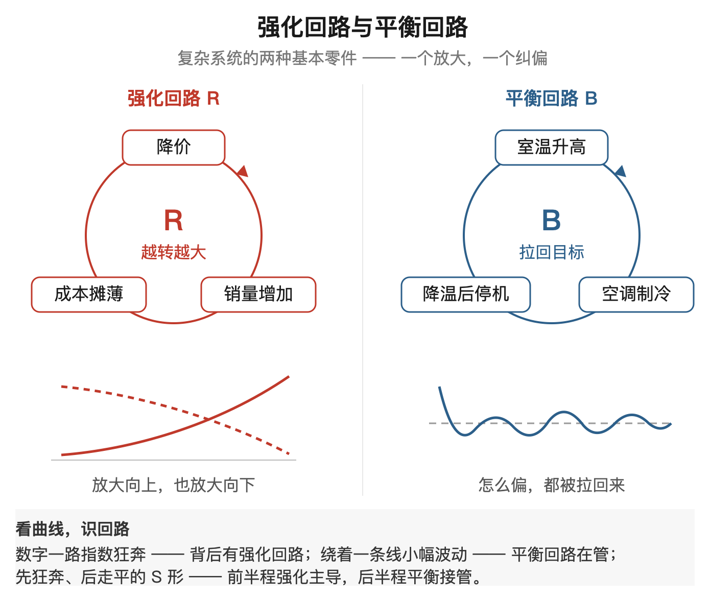
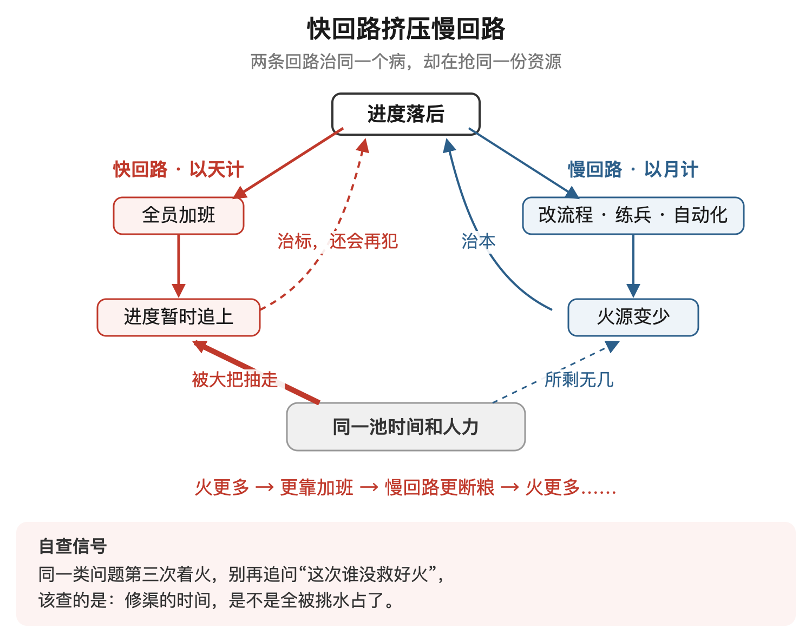
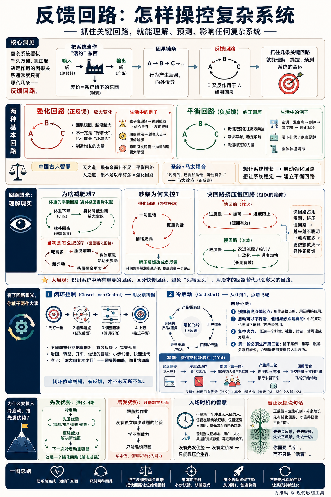

# 反馈回路：怎样操控复杂系统

[反馈回路：怎样操控复杂系统](https://www.dedao.cn/course/article?id=l12vGeNAM0YVpPWBZeVdmxjOQBP5oL)

2026-07-19 23:10

复杂系统看上去都很……复杂。你眼前就像摆着一块有上千个按钮的控制面板，你根本不知道它们都是干什么用的，甚至都不知道自己该往哪儿看。

大部分人一生只为面板上的一两个按钮服务，很少考虑整个系统是怎么运行的。领导说你这个工作很重要绝对大意不得，你连连称是，心想连我这个工作都这么重要，那些掌控全局的人，恐怕都是神人吧？

他们不是神人。而且这个系统没有那么不好理解。这一讲咱们就说说怎么迅速抓住一个系统的本质。

要点是，任何一个复杂系统，不管它是一个公司也好，一个核电站也罢，乃至于是一个国家，其中真正起决定性作用的因果关系通常就只有那么几条。

抓住这几条，你就能理解它、操控它、预测它的命运。

这几条，叫做「 反馈回路 （feedback loop）」。

✵

不管你面对的是一个大系统，还是你想理解一个大系统中的子系统，都不要把它看成是一台静止的机器。你要把它想象成一个有「输入」、有「输出」的、“活的”东西。比如说一家工厂，它会输入原材料，输出产品 —— 但原材料是用钱买的，产品会卖成钱，所以这个工厂本质上输入的是钱，输出的也是钱。输入跟输出之间的差价，系统留下的东西，就是它赚到的钱。简单吧？

那么，从输入到输出，会经过一连串因果关系：A 导致 B，B 导致 C……行为产生后果，向外传导。

所谓反馈回路，就是因果绕了一个圈，又回来了：A 导致 B，B 导致 C，C 又反过来作用于 A。

比如你把产品（输出）降价，销量就增加；销量增加，固定成本（输入）就摊薄；成本摊薄，你就还能进一步把产品降价。这就是一个 「正反馈（positive feedback）」回路，也就是反馈会加强你最初的那个动作，把整体的变化放大。

生活中有很多正反馈现象 ——

一个孩子表现好，得到鼓励 → 鼓励提高信心 → 信心又让他表现得更好。股价越涨，越多人买 → 越多人买，股价越涨。

但是请注意，正反馈的意思可不一定就是“正增长”。股市暴跌也是正反馈：恐慌引发抛售，抛售制造更大的恐慌 —— 这是在放大“恐慌”这个东西。正反馈是一种放大的力量，不管放大的是好东西还是坏东西。

真正的「负反馈（negative feedback）」，意思是反馈会把最初的那个动作往反方向拉。比如你家的空调，室温一旦高过设定值，它就开机制冷；等温度降回设定值附近，它就停止。最初的作用是制冷，反馈回来的动作是停止制冷。负反馈是一种纠正偏差、寻求平衡的力量。

因为“正”“负”这两个字太容易让人联想好坏，系统动力学家干脆给它们换了名字：正反馈叫「 **强化回路** （reinforcing loop）」，负反馈叫「 **平衡回路** （balancing loop）」。

强化回路制造增长 —— 不管是好东西的增长还是坏东西的增长：复利、病毒传播、债务滚雪球等等。平衡回路制造稳定：恒温器、超市补货、家庭预算控制、身体的体温调节等等。

中国人说“天之道，损有余而补不足”—— 这其实就是平衡回路。“人之道，损不足以奉有余”—— 这就是强化回路。《圣经·马太福音》里有句话叫“凡有的，还要加给他，叫他有余”，说的是一样的意思，以至于现在我们一提到什么机制是正反馈，就说那是「马太效应」。

一个强化回路，一个平衡回路。想要控制好系统，你只需要抓住这两个东西：你想让它增长，就得启动它的强化回路；你想让它稳定，就必须建立负反馈。

✵

反馈回路能让我们理解很多事情。

比如为啥减肥难呢？因为你的身体里装着一条平衡回路，而它保卫的是你当前的体重：你一少吃，它就降低消耗、放大食欲，千方百计把缺口给你找补回来。你不是在跟脂肪作战，而是在跟负反馈作战。

那当初是怎么肥的呢？有一条常见的强化回路：吃得多，脂肪增加 → 身体越沉，活动越费劲 → 于是人越少动 → 越少动，热量盈余越大，脂肪就继续增加。到这一步，脂肪已经不只是变胖的结果，它还成了下一轮变胖的原因。

你要不想让什么事情失控，就必须把正反馈改成负反馈。比如吵架，一句重话招来一句更重的话，冲突就会自我放大，后果不堪设想。所以有经验的夫妻会让升级的信号自动触发降温动作：只要有人提高音量，双方就暂停；情绪越高，反而越少说话。

一个比较麻烦的情况是，局面由不止一条反馈回路控制。比如你们公司项目进度落后了，老板要求全员加班，进度追回来了。进度慢 → 加班 → 进度跟上，这是一条很有效的平衡回路，但这是一条“快”回路。可是改善进度还有一条慢回路：

进度慢 → 改进流程、培训员工、推进自动化 → 进度加快，这才是更根本的解决方案啊！如果加班不断占用原本用于复盘、培训和流程改进的资源，快回路就会挤压慢回路。

2001 年，麻省理工学院斯隆管理学院的两位管理学家尼尔森·雷彭宁（Nelson Repenning）和约翰·斯特曼（John Sterman）研究企业的流程改进，就发现一个普遍的陷阱：压力越大，“更努力地工作”这条快回路，就越是挤压“更聪明地工作”这条慢回路。

这样的组织会越来越不聪明，于是他们会出越来越多的毛病，到处着火。于是他们就会越来越依赖于救火，等于说是进入了一个恶性正反馈循环，最终公司就会变成一片只能靠救火维持的森林。

同样道理，情绪化减肥也是快回路挤压慢回路。今天重一斤就绝食，明天轻半斤就奖励自己；每天都在纠正数字，却没有建立长期的饮食和运动习惯……快回路越忙，慢回路越转不起来。

这才叫大局观。好，现在有了回路眼光，你能干两件大事。

✵

**第一件事叫做「 闭环控制 （closed-loop control）」。**

这个很简单。给你一把你从来没用过的枪，让你打一百米外的靶子。你不懂弹道学，不知道风速风向，这把枪的准星说不定还是歪的。你怎么办呢？你先打一枪。

打完看看弹着点：如果偏左，你下一枪往右瞄一点；偏上，你就往下压一点。每次调一调，几枪之内你就能上靶。你用一个平衡回路就找准了靶心。你不需要任何细节知识，你只需要有效的反馈。

其实治国也是这样的，比如中国的改革开放。大国怎么转型搞市场经济，没有人知道。邓小平的智慧就是搞闭环控制，这打一枪那打一枪看看反馈。今天给个政策，明天弄个特区，后天开个股市。效果行，就继续；不行，再调回来。这就如同开车一样，只要能得到有效的反馈，你就可以写意式地把握好舵，而不必在意经济学原理的细节。

老子说「治大国若烹小鲜」，也是这个意思：治国没有那么复杂，操控复杂度跟做饭差不多。当然这句话更重要的一层意思是国家经济就如同小鱼一样脆弱，不能来回胡乱翻动 —— 这里需要的是慢回路而不是快回路 —— 治大国不能像烙大饼。

与闭环控制相对的是「开环控制（open-loop control）」：事先做好各种测算，预判行动的后果，然后找一个最佳的力度，发出命令、执行 —— 但不会根据反馈结果对行动进行微调。理解了闭环控制，你会觉得这种开环控制是非常奇怪的。系统这么复杂，你怎么可能做好精确的计算呢？

然而生活中大量的事情恰恰就是开环控制。比如说有的部门发布政策，有的顾问提交方案，有的品牌制作广告都不看任何反馈。包括现在绝大多数医院给病人治病，都是开了药、出了院，病人就回家了 —— 极少有医生会在几个月之后回访，看看这个病人是好了，还是没好去别的医院了，还是已经去世了。这么重要的工作竟然没有一个正式的反馈机制，你不觉得很荒唐吗？

开环依赖圣明，闭环依赖纠错 —— 有反馈，你才不必无所不知。

✵

**你能干的第二件大事是「 冷启动 （cold start）」。**

任何一个事业发展壮大都需要经历正反馈的过程，创业者称之为「增长飞轮」。可是正反馈只能把“有”放大，不能把“无”变成“有”。比如你想靠写作成名，那么你需要有人帮你转发文章 —— 可是你没有读者，所以没人转发 → 没人转发，你就更没有读者。怎么让这个飞轮转起来呢？

冷启动就是要提供最初的那个从 0 到 1：请个大佬推荐也好，花钱做广告也好，你都需要第一波无中生有的种子。

启动机制不同于运行机制。一家成熟的公司会相当自动化：用户自发传播它的产品，各路商家自动找上门合作 —— 但它的启动阶段，完全可以是手工的、低效的、被补贴的、创始人一个一个求人的。

冷启动的心法，我们大致可以总结四条 ——

**第一，别照着终点做起点。**用户、名气和资本都是大回路转起来以后的产物，不是第一圈的燃料。第一圈真正的产物是一个说得通的原型，是拿得出手的作品。用作品换来证明，用证明换来信用。

**第二，启动可以不好看，但结果必须是真的。**第一批用户不能是假流量数字，而是对你感兴趣的真人；第一份成功哪怕很小，也得给你留下证据、方法和信用。否则再大的声势也只是在给一个死系统化妆。

**第三，集中火力。**十个种子散在全国，只是十个孤点；压进一个科室、一个社群、一个时刻，才可能成为爆点。

**第四，第一轮必须生产第二轮。**一次交付要留下案例，一次服务要留下推荐，一次交易要留下数据、关系或现金。否则每一轮都得重新花钱求人，那不叫飞轮，叫人工呼吸。

这四条用一个案例就能看全。2014 年，腾讯要推微信支付，最大的障碍是没人绑银行卡 —— 绑卡这件事支付宝做了十年，你怎么追得上呢？微信的冷启动是“过年发红包”。

它没有拿“推广支付”这个终点当起点，它把火力集中到了春节这个高密度时刻。结果从除夕到大年初一下午，五百多万人参与抢红包。抢到的钱想提现，就得绑卡。红包抢完，银行卡却留下来：在社交回路里，春节的人情关系是输入，几百万人抢红包是输出；到了支付回路，这些完成绑卡的人又成了第一批输入……环就这样闭合。马云都被打懵了，事后把腾讯此番操作称为“珍珠港偷袭”。

其实腾讯这把冷启动之所以这么有效，关键还是因为微信本来就是一个社交工具，这是他们已有的先发优势。而且即便如此，也得用真金白银点火。微信支付真正进入全民级规模，是等到第二年春晚“摇一摇”之后。当时腾讯光是买央视春晚独家新媒体互动资格就花了 5303 万元，“摇一摇”的现金红包池更是超过 5 亿元，由多家企业赞助商提供，才换来全国观众十分钟摇出一亿两千万个红包。

冷启动成本高、用力大，而且还不一定能成功。所以人们每一次都会问：值得吗？

✵

我们为什么非得自己投入资源做冷启动，去搞一个先发优势？为什么不等别人做好了从 0 到 1，我们直接做从 1 到 N 呢？

比如上世纪 90 年代，摩托罗拉搞了个豪气冲天的“铱星计划”，烧了五十多亿美元建成全球卫星电话网，……结果终端设备太重，通话费太高，用户根本负担不起，最终在 1999 年申请破产保护。那我们何不等着有人已经证明了这条路走得通，我们再上，以更低的成本、更高的效率去执行计划，抢占他的市场呢？

很多人认为过去四十年中国制造的发展，就是所谓「后发优势」的成功学：家电、高铁、手机、光伏、电动汽车，都是引进消化吸收再创新，别人开路、我们提速。你看中国经济的吹鼓手林毅夫，就对“后发优势”大唱赞歌 —— 但是经济学家杨小凯先生曾经专门警告过，后发你不能光想着优势，你还会有“后发劣势” 。

这个道理是这样的：人家先发冷启动，的确有很大的风险，会遭遇到各种困难，不得不首先解决各种难题 —— 但在解决这些难题的过程中，他们会学到一些宝贵的东西 —— 包括制度、投资环境和原创精神 —— 这些东西会让他们有能力解决新的难题，所以他们有可能继续保持领先。而你跟在后面抄作业，固然成本低，可是你没有独自解决过那些难题，你就学不到解决难题的能力，就只能继续跟在后面……

从冷启动 → 先发优势 → 有能力做下一次冷启动，这本身也是一个强化回路。

那你说，可是先发的确容易“前浪死在沙滩上”啊 —— 我们前面讲「**机会窗口**」的时候不是说吗？入场时机应该在主导类别出现之后。没错，但真正的先发优势不是第一个冲进无人区，而是在路线刚被证明、位置还没被占满的时候，率先闭合自己的回路。你可以不做第一个试错的人，但不能等别人把标准、用户、人才和渠道都变成他的存量之后再进场。

为什么中国制造能占领人家那么大的市场，却只能要一个很低的利润？因为你没有先发优势就没有定价权，你只能靠对外压价格对内压成本生存。

哪有放着大好江山不抢的道理？先发优势才是真正的优势，后发是没有办法的办法。

✵

这里我特别想替正反馈说几句话。正反馈是不稳定的，可能会失控，预示着危险和麻烦，总跟泡沫、挤兑之类的词联系在一起。对比之下，负反馈是调控机制，它稳定、理性、懂得纠错，管理者爱它，养生的人也爱它。

**但只有正反馈才能带来增长。正反馈是生发的机制。你调控是调控不出什么新东西的。先有强化回路，才值得搭建一个平衡回路。**

不是说我们不应该养生，但是人要想蓬勃向上，就得至少有一条强化回路：永远有下一件想干的事，并且让干成的这一件，变成下一件的燃料。

套用一个著名的句式 —— 失去负反馈，失去很多；失去正反馈，失去一切。

你需要「活」，而不只是「活着」。

