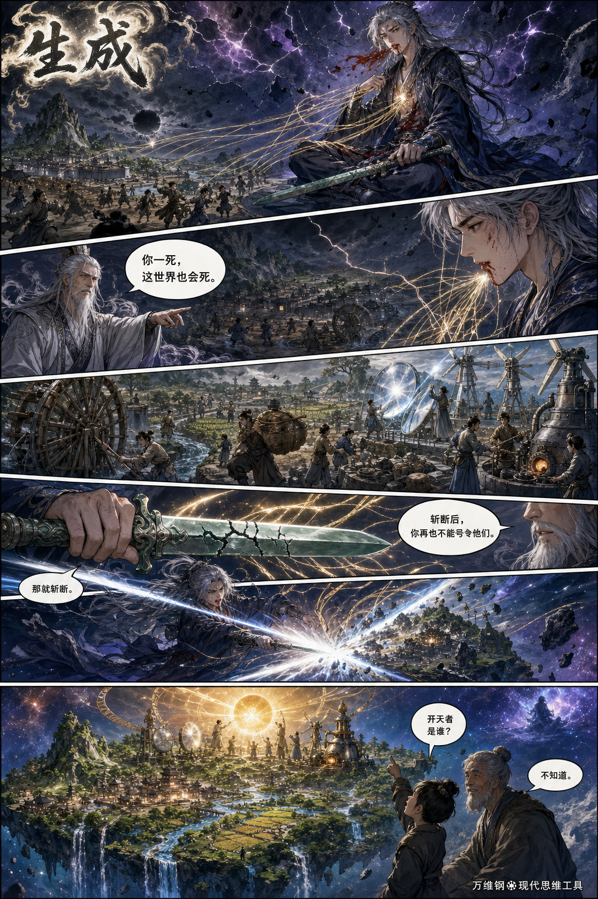
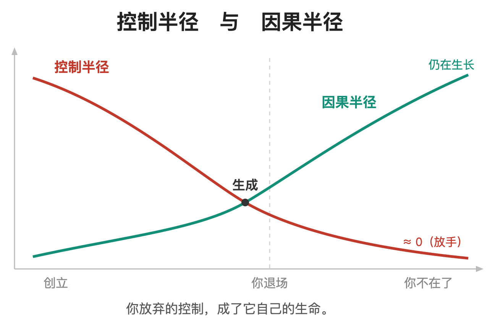
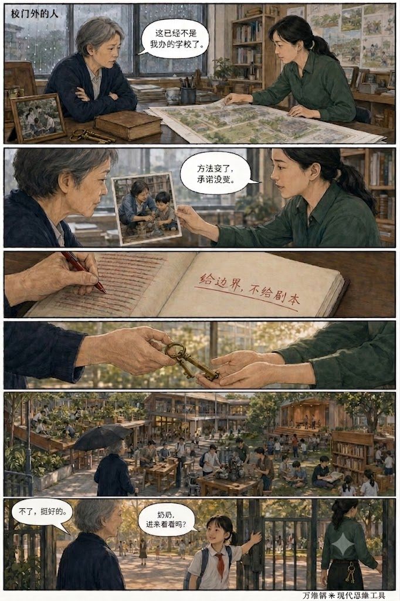
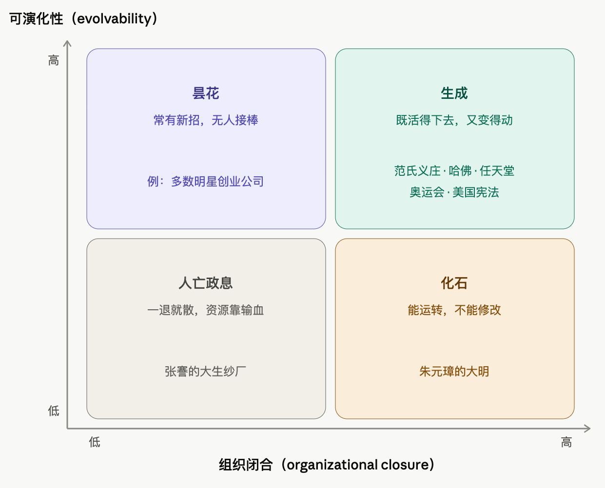
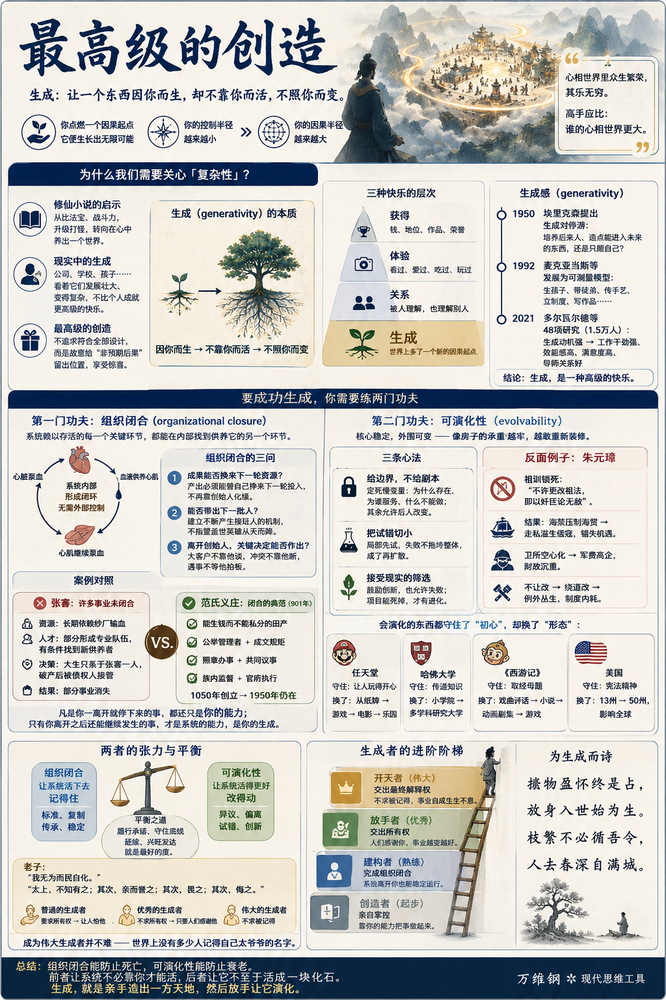

# 生成：最高级的创造

[生成：最高级的创造](https://www.dedao.cn/course/article?id=ykaNlMY5gn3Jq1WBwPJ7EAROW0DLje)

2026-07-15 11:03

这一讲咱们进入一个新板块，主题是「**复杂性**」。这是很高级的学问，其中有很多活跃的研究。那我们为什么要关心这些呢？我先说个感悟。

你注意到没有，现在的修仙小说已经不满足于比法宝、浮夸战斗力和像游戏一样的打怪升级了。**高级的修炼法，是在自己心里养出一个世界。**

比如烟雨江南的《龙藏》里，主人公卫渊修出一个叫“人间烟火”的“心相世界” —— 也就是在虚空中以法相为核心开辟的一处新天地。它存在于卫渊的“识海”之中，是一个由他的精神意识承载的内部世界。心相世界里原本都是虚拟的人物，但是后来真人也可以进出，然后成千上万个虚拟人物也变得越来越真实，逐渐跟真实世界连接成了一体 [1]。

那个感觉有点像你在我们这个现实中拥有一系列 AI 智能体，只不过这些智能体组成了自己的社会。心相世界里的众生会帮你出谋划策、为你做事、给你贡献力量……但是他们会变得越来越自主，也分成不同的人群和门派，也寻求各自的发展壮大，乃至于最终不依赖你而存在。

卫渊常常旁观心相世界里人们繁荣热闹的生活，感觉其乐无穷。

是啊，这不比自己赚多少钱、学个新武功、升几级有意思多了吗？高手要比，应该比咱俩谁的心相世界大。

我们这个现实不能修仙，但我们也可以创造自己的小世界：比如说你开办一家公司、一所学校，甚至就是生几个孩子。看着你创造的事物发展壮大，变得越来越复杂，以至于后来你都理解不了……这种成就感，不比自己发几篇论文、获得一个什么职务高级多了吗？

这就是「 生成 」。

普通的创造希望结果符合自己的设计，把「非预期后果」当作麻烦。然而最高级的创造，却要故意给“你没设计过的结果”留出位置，享受惊喜。我们学复杂系统不是为了让它听话，而是追求亲手造出一方天地，然后放手让它演化。

一句话，生成就是让一个东西因你而生，却不靠你而活，不照你而变。

这是给心胸最大的人准备的学问。这里有一种情怀和两门功夫。

✵

一种情怀是发展心理学家埃里克·埃里克森（Erik Erikson）1950 年提出的「生成感（generativity）」 。他认为，人到了中年会撞上一道坎，称为「生成对停滞（generativity versus stagnation）」：你是只顾维持和满足自己，就守着自己这一亩三分地过完算了，还是愿意去培养后来的人、造点能进入未来的东西？前者就是停滞，后者就是生成。

到了 1992 年，美国西北大学心理学家丹·麦克亚当斯（Dan McAdams）等人把它发展成了一套可测量的理论模型 —— 他们定义的生成包括生孩子、带徒弟、传手艺、立制度、写能影响后人的作品等等。

快进到 2021 年，荷兰组织心理学家弗里德里克·多尔瓦尔德（Friederike Doerwald）和同事汇总了 48 项研究、涉及一万五千多人。结果显示，生成动机较强的人，往往也有更强的工作干劲、更高的职业效能感和工作满意度，以及更好的导师关系。

当然科学无法证明生成就是人生最大的快乐 —— 但我们大约可以说，生成是一种高级的快乐。

有些快乐来自获得：我得到了钱、地位、作品和荣誉。有些快乐来自体验：我看过、爱过、吃过、玩过。有些快乐来自关系：我被人理解，也理解别人。这些都很好。但是生成提供的是另一种东西 ——

因为你曾经来过，世界上多了一个新的因果起点。

一个学生沿着你指出的方向走到了你没去过的地方；一个孩子形成了与你不同、却更适合他自己的判断；一项事业在你退休以后更加兴盛。

你的控制半径很小，而且从某个时刻开始变得越来越小。可是你的因果半径却越来越大，大到你无法想象。

你可能说，这不就是立德、立功、立言“三不朽”吗？不朽是一种副产品。一个人能不能留下名字取决于很多偶然的因素，不可以直接追求。但生成则是一个非常实在的行为，它只在乎有没有一样东西因为你而获得了继续生长的能力。

如你所能想见，生成并不容易。不少人都创办过成功的事业，自己辛苦维持运转了几十年，别人都说了不起……可是创始人只要一退，业务就没了，人也就散了……小世界消失了。如果真是修仙的话，这一世你就算失败了。

要想成功生成，你得练两门功夫。

✵

第一门功夫叫「组织闭合（organizational closure）」。这个概念出自理论生物学，“组织”原本说的是生命体的组织方式。

我前面讲「自由能原理」的时候说过，生命的特点是它既开放（也就是每时每刻都要从环境中获取物质和能量），又独立（也就是它能维持自己）。这是怎么做到的呢？有的学者称之为「自创生（autopoiesis）」 ，更新的说法叫「约束闭合（closure of constraints）」 ，意思都是说，要看 ——

维持这个系统活下去的关键环节，能不能在系统内部彼此维持，形成闭环。

比如心脏泵血，血液反过来供养心肌，心肌才有能力继续泵血，这就是一个系统内部的维持闭环。基因造蛋白质，蛋白质反过来读取、复制基因，则是更严格意义上的互相生产。闭合的意思不是封闭，而是完成闭环：不需要你从外部控制，这几个东西在内部就能完成循环。

所谓「组织闭合」，就是系统赖以存活的每一个关键环节，都能在系统内部找到供养它的另一个环节。

一家公司刚起步时，创始人需要出钱、找人、定方向、谈客户、带新人、断纠纷，这很正常；小孩刚生下来，爹妈也得替他管几乎所有的事 —— 这些就是尚未闭合。等到公司可以离开创始人而运行，就像小孩不再需要父母的照顾，才叫组织闭合。

怎样让你的事业完成组织闭合呢？你需要解决三个问题 ——

**第一，它的成果，能不能换来下一轮资源？** 产品带来客户和收入，收入得养得起下一轮研发和招人；学校教出好学生，好学生变成声誉，声誉又招来新的学生、老师和捐助。系统的产出必须能替它自己挣来下一轮的投入才行。要是每一轮都还得靠创始人重新去化缘、去求人，那就是还没断奶。

**第二，现在这批人，能不能带出下一批人？** 你得建立一套能不断产生接班人的机制，不能指望每隔二十年从天上掉下来一个盖世英雄。

**第三，离开创始人，关键决定还作不作得出来？** 不能一直都是大客户必须他谈，高管吵架必须他断，遇到例外情况所有人都杵着等他发话。

每当你不得不亲自去补位的时候，就应该问一句：为什么这事只能我来？这次补位能不能变成“下次不再需要我补位”的安排？你救火不能说明你能干，只能说明这个组织还没闭合。

✵

咱们先看一个不能简单论成败的例子：清末民初的实业家张謇。

此人是大清 1894 年的状元，响应时代召唤把人生主业从做官转向办实业，结果是办啥成啥。张謇先是在家乡南通创办起大生纱厂，又以它为根基办学校、博物馆、图书馆、医院和剧场，几乎生成了一整座近代城市。

有这么大的事业，怎么很少有人知道张謇这个名字呢？

因为纱厂失败了。1922 年，随着一战结束后外国商品重新涌入，棉贵纱贱，大生厂不但亏损，更有巨额负债……张謇 1926 年去世时，大生各厂的管理权已经先一步转到了债权人手里。随后是连锁反应：张謇创办的伶工学社在 1926 年停办；南通博物苑失去依恃，财力拮据，先后转属南通大学和通州师范勉强维持，1938 年又在日军侵占中遭到毁坏。

不过张謇创办的三所高等学校在 1928 年合并成私立南通大学，通州医院也延续下来成为今天南通大学附属医院的源头 。不然今天可能就更没人知道张謇了。

对照组织闭合的三问：资源方面，张謇的许多项目长期依赖纱厂输血，没有独立财务能力；人才方面，学校和医院形成了专业队伍、知识传统和社会声誉，所以有条件找到新的供养者；决策方面，大生的信用与决策只系于张謇一人，后来企业便只能由债权人接管；那些把管理权交给公共机构的事业反而活了下来。

对比之下，另一个中国人办的准慈善项目，前后延续了整整 901 年 —— 那就是宋朝范仲淹的范氏义庄。

1050 年，范仲淹在苏州捐出一千多亩田，设了个义庄，拿田租接济范氏族人的吃穿、婚丧、赶考。这番操作的了不起之处是范仲淹不只是捐出了一笔财产，而且给了一套治理结构。

他把这些田变成不得由子孙分割、典卖的范氏公产，由全族公举的“主奉”总领，掌管人负责日常事务，各房另有“管勾”代表本房。族人按人头、按月领米，要造册核对；丰年留出两年存粮防灾；连族里辈分最高的长辈也不许插手多占。收租、发米等常务，照成文规矩办；规矩没写到的例外，由掌管人与各房共同商议，利害相关者还得回避；管理者若有侵占欺瞒，族人可以查账、弹劾，最后还可以告到官府。

你看，有能生钱而不能私分的田产，有由族人公举产生的管理者，有照章办事和共同议事，有族内监督和官府最后执行，组织闭合的条件全都满足。范仲淹 1052 年就去世了，可这个义庄一直延续到 1950 年土地改革时，比宋元明清每个朝代的命都长。谁说中国人没有信托精神？

凡是你一离开就停下来的事，都还只是你的能力；只有你离开之后还能继续发生的事，才是系统的能力，是你的生成。

要做到这一步，你必须先交出自己的“不可替代感”。小世界这才有了自己的新陈代谢，不必你天天喂灵气了。

可这还不够。

✵

**第二门功夫叫「可演化性（evolvability）」。**

我们前面刚讲过「基线漂移」。任何系统都一定会变化，但是你想让它有好的变化、新颖的变化。这里我们仍然可以从生物学获得智慧。

1996 年，进化生物学家京特·瓦格纳（Günter Wagner）和李·阿尔滕贝格（Lee Altenberg）提出：变异加选择并不自动带来进步；真正决定成败的是系统的结构能不能让一处局部的改动，产生一点局部的改进，而不是一动就全盘垮掉 [16]。2007 年，格哈特（John Gerhart）和基尔希纳（Marc Kirschner）提出「促进变异（facilitated variation）」，又补了一层：生物创新很少从零造起，而是留住一批稳定的核心零件，靠重新组合它们，长出新形态 [17]。

翻译成一句话：可演化的系统必须核心稳定，外围可变。

这就如同房子的承重结构越牢，才越敢重新装修其中的房间。

这里有三条心法。

**第一，给边界，不给剧本。** 值得定死的东西并不多：这个事业为什么存在、它为谁服务、什么绝对不能做，这些构成了系统的「慢变量」。至于说具体的产品、方法、结构，都应该允许后人改。最危险的“文化传承”就是把创始人的时代局限也当成祖宗供起来。

**第二，把试错切小。** 每次让一个局部先试，失败了不拖垮整体，成了别处能学过去。不能每次创新都得全体转向。

**第三，接受现实的筛选。** 你不能光说“鼓励创新”，让大家提一大堆新点子，却没人担后果，更没有一个项目真正死掉。

反面例子，我最想说的就是朱元璋。

朱元璋要饭出身，靠暴力取得天下，偏偏认为自己的思想就是先进的。他在洪武二十八年颁布《皇明祖训》，在序言中规定：“凡我子孙，钦承朕命，无作聪明，乱我已成之法，一字不可改易”。同年九月，他又敕谕礼部：后世谁敢提出改变祖法，“即以奸臣论无赦”。

这等于堵死了制度正常演化的通道。朱元璋的海禁长期压制了私人海外贸易，使大明错过了把繁荣海贸变成稳定税源和海防力量的机会；朱元璋的世袭卫所制度又因军户大量逃亡而日渐空心化，逼得朝廷另花钱募兵。可是大海就在那里，朝廷总得用兵。海贸需求禁不掉就转入走私，结果在后世闹出倭寇来；明中叶以后，军费吞掉中央政府支出的六成到九成，已经成为国家财政最沉重的负担。

后来隆庆开海已经证明，政策只要松一道缝，中国海商很快就能接入全球贸易，国家也可以把海贸变成货币关税。

正因为朱元璋不让改，后世又不得不改，人们就只能搞各种权宜之计绕过祖训。结果是旧制度名义上还在，新办法只能作为例外和临时措施生长。于是权责不清、规则打架、寻租丛生、财政成本越来越高，任何一次改革都要先背上过去所有补丁的包袱。

如果没有朱元璋的束缚，大明能够堂堂正正地持续改革，海上财富、造船、火器和远洋组织能力就可能在合法制度内不断积累，形成“贸易—财政—海军—技术”的正向循环……就算不能引发工业革命，也能确保中国在大航海的牌桌上有一席之地，给近代化争得一个更有利的起点。

可现实却是一个死了两百年的创始人，靠一块“祖制”的牌位，继续对后来的决定行使否决权。这不荒唐吗？这都是被权力惯坏了，自大成狂，妄想永不退场的结果。

✵

会演化的东西都什么样呢？

**任天堂**原本是个卖花札纸牌的公司，却成了创造马力欧、塞尔达和 Switch 的游戏公司，还把马力欧的世界搬进了电影和主题乐园。它守住的不是纸牌，而是让人玩得开心。

**哈佛**原本是殖民地里的一所小学院，主要业务是培养有学问的牧师，却成了横跨文理、法律、医学、商业等领域的世界性研究大学。它守住的不是神学课程，而是传递知识。

**《西游记》**原本是取经故事改编的戏曲和评话，却成了章回小说，又变成连环画、动画、电视剧和游戏，长出更大的宇宙。它守住的不是九九八十一难的细节，而是那个任何一代人都能重新出发的取经母题。

**美国** 原本是个由大西洋沿岸 13 个州组成的农业共和国，却成了一个拥有 50 个州、在全球经济、科技、军事和文化上都有巨大影响的现代国家。美国守住了，但也演化了宪法：宪法的正文仍然是 1787 年的七条，二百五十年只增加了 27 条修正案 —— 宪法在理论上可以被改写，但是在实际操作中又很难被改写……

这些事业最初的创造者如果来到今天肯定认不出来它们的样子，但他们大概会感到欣慰而不是愤怒：感谢你们没有忠实执行我的第一版，也感谢你们把我最初那点值得保留的东西坚持下来，做得远远更大。

要做到这一步，你就必须交出自己的“最终解释权”。至此小世界才算脱离了你的识海：你不再是它的主人，只是它最初的开天者。

✵

组织闭合能防止死亡，可演化性能防止衰老。前者让系统不必靠你才能活，后者让它不至于活成一块化石。

但二者之间是有张力的：组织闭合靠标准、复制和传承，要系统记得住；可演化性靠异议、偏离和试错，要系统改得动。那你说这个度到底在哪里？范仲淹的规矩可以修订，后世子孙多次修改补充；朱元璋的规矩不许修订。那到底哪些是创始人不可改变的初心？

其实只要这个事业能够履行承诺、守住底线，只要能延续、能够兴旺发达，就都是好的。

老子说：「我无为而民自化。」又说：「太上，不知有之；其次，亲而誉之；其次，畏之；其次，侮之。」

普通的生成者要求保留对这个东西的所有权，为此需要让人怕他。

优秀的生成者不再要求所有权，只要人们感谢他就可以了。

伟大的生成者甚至不要求别人记得他。

其实成为一个伟大的生成者并没有那么难。要知道世界上没有多少人记得自己太爷爷的名字。

有偈为证：

> 揽物盈怀终是占，放身入世始为生。  
> 枝繁不必循吾令，人去春深自满城。

