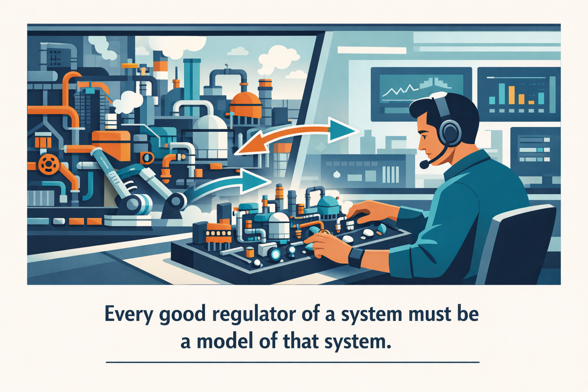
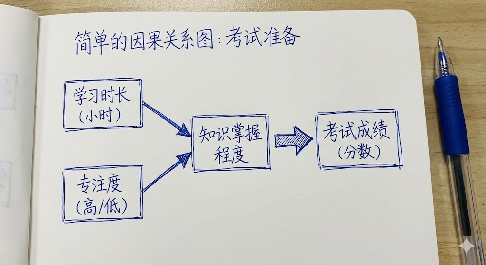

# 颗粒度和因果中介：用模型思考（得到课程讲稿 + AI 加工段）

# 颗粒度和因果中介：用模型思考

[颗粒度和因果中介：用模型思考](https://www.dedao.cn/course/article?id=D4vE8rn63yN5JA52NOJOpoPzG0MdqB)

**正确的决策要求你对事物有正确的认识。**

先从一个错误的认识说起。

网上流传一种市侩哲学：“如果想不得癌，……就一定要放开，内心要强大到混蛋……你别憋着……不要自己心里太拧巴，这是减少癌症发生的方法！”

很多人相信癌症是“气出来的”，但我不得不说，那是伪科学。

美国癌症协会（American Cancer Society, ACS）专门有个科普页面，直接说研究显示人的个性、想法和情绪既不会导致癌症，也不会影响癌症是否复发。美国国家癌症研究所（NCI）说得更保守一点，说压力和癌症之间“没有清晰链条”。

其实这里早就有一系列大规模跟踪研究。比如一项对超过 10 万英国女性的研究发现压力频度和不良生活事件与乳腺癌风险无关。一项针对超过 11 万人的大规模荟萃分析显示，在排除了吸烟、饮酒等因素后，所谓“工作压力”与任何主要癌症的风险都没有关联。更有研究发现，愤怒控制、负面情绪与癌症风险总体无显著关联。

那你说不对啊，《精英日课》专栏不是经常讲压力对健康的各种坏处吗？怎么压力偏偏不会导致癌症呢？

科学家对此说得很明白。那些研究说的是压力不会\*直接\*导致癌症 —— 但压力可能与癌症有\*间接\*的关系。比如说，压力可能会让你产生不健康的生活习惯，比如吸烟、喝酒、暴饮暴食，而这些习惯有可能增加癌症的风险。

这是两个非常不同的故事。理解这两个故事的区别，你才能学会控制复杂事物。简单说，要想操控一个事物，你必须在头脑中建立这个事物的「 模型 」。

先看看没有模型是什么状况。

想象一个大学宿舍楼的管理员，他最反感每天晚上过了熄灯时间楼里还有吵闹声。如果对宿舍楼的情况一无所知，他就只能一听见吵闹声就出去大喊大叫让大家不要吵了，甚至不得不挨个屋子敲门。

可是如果宿管员脑子里有个宿舍楼的模型，他知道比如说 305 房间有个低音炮、117 房间有个学生最爱在熄灯以后打联网对战游戏、这几天二楼的水泵坏了大家洗漱慢……他就不必无能狂怒，而能够根据噪音的类型精准干预。

其实生活中很多人就像是那个宿管员，体检指标差了就喝枸杞，一看项目延期就要求员工加班，听说孩子成绩下滑就疯狂打骂……你都不知道事情是怎么回事儿，但是你必须做点大动作。

模型，是事物在你头脑中的一个结构镜像，能帮你看清楚它运行的底层机制。没有模型，你就如同面对黑箱，只能对输入信号做冲动的反应；有了模型，你才知道按钮在哪儿。

控制论领域有个极其深刻的说法，叫「 好调节器定理 （Good Regulator Theorem）」，是 1970 年由罗杰·科南特（Roger C. Conant）和 W·罗斯·阿什比（W. Ross Ashby）提出来的，意思非常简单：「系统的每一个好调节器，都必须是该系统的一个模型。」

这个定理等于是从数学上证明了，你的认知结构必须同构于你想要控制的那个事物。如果你的模型比现实世界简单太多 —— 比如用“癌症是气出来的”解释复杂的生物学 —— 你就一定会丢失关键信息，你的决策就一定是错的。

说白了，你能理解到什么程度，才能控制到什么程度。

那好的模型该是什么样呢？我们至少有两个要求。

**第一个要求是模型的复杂度 —— 也就是职场白领爱说的「 颗粒度 （Granularity）」 —— 必须恰到好处。**

太简单粗糙固然不好，但是太复杂也不好。说我就像《三体》里的智子一样，要把世界上每个粒子都跟踪起来，那你的算力根本受不了，而且反而会让你把注意力放在没有用的地方。

模型一定是对真实世界的某种压缩，而这个压缩要恰到好处才好。你早就听说过所谓「奥卡姆剃刀（Occam's razor）」，也就是「如无必要，勿增实体」 —— 信息论里有个理论相当于是把奥卡姆剃刀变成了可计算的准则，叫做「 最小描述长度 （Minimum Description Length, MDL）」。简单说，最小描述长度准则要求，最好的模型应该是使得以下两项之和最小的那个模型：

1. 模型的长度：描述这个模型本身所需要的比特数，也就是你这个模型本身有多复杂；

2. 数据补丁的长度：如果别人用你这个模型解释现实，还要补充多少例外说明。

**说白了就是最好的模型，是那个能用最短的代码长度，解释最多数据的模型。**

比如人家问你本地的天气怎么样。你要是把过去一年每天的天气都给描述一遍，那就太长了，没有压缩谈不上理解，这叫「过拟合」。你要是就回答一句“这地方总下雨”，那就太短了，是「欠拟合」……

一个恰到好处的描述是：“这里属于温带海洋性气候，受西风带控制，全年温和湿润，虽然阴雨天多，但多是毛毛雨，很少有暴雨。”才几十个字，有规律、有机制、能代表很多数据，别人一听就知道是怎么回事，这就是好模型。

用模型思考，要善于丢掉细节直达本质。有时候与事物保持一定的心理距离，你的解释水平反而更高，因为你更能把问题抽象化、原则化。

为什么最近股市在跌？你要是考察网上舆论能列举出来 100 个理由：中央银行加息、地缘政治、某公司财报、某大V的言论……堆一大堆噪音还是一脸困惑。高手的模型一定是高压缩的：“流动性收紧导致风险资产重估。”这一句话就能解释 80% 的波动。

有一句格言叫「**理解即压缩（Understanding is Compression）**」。练成这个功夫，你就是那个传说中所谓“花半秒钟就看透事物本质的人”。

**好模型的第二个要求是其中包含因果关系。有因果关系，你才能讲清楚事情的机制。**

咱们这里不谈哲学 —— 要是从纯粹哲学角度讲，这个世界上有没有真正的因果关系还两说。我们使用图灵奖得主朱迪亚·珀尔（Judea Pearl）在《为什么：关于因果关系的新科学》（ *The Book of Why* ）一书里那个洞见：我们不是想要彻底说清楚绝对的因果，我们其实想知道的是：我做什么事儿能\*干预（intervene）\*这件事的发生。

经常一起发生的两件事之间未必有因果关系，可能只是相关性。但是，如果我是\*强行介入\*（珀尔的术语叫 do-operator），在保持其他所有因素不变的情况下\*单方面\*让事件 X 发生，而这时候事件 Y 发生的概率增加了，那么我就可以说 X 对 Y 有因果效应，或者说 X 至少是导致 Y 的一个原因，标记为 X → Y。

比如说，公鸡每天早上一打鸣，太阳就出来，这是一个相关性。要知道这里有没有因果，你必须做一个干预：有一天你强行介入，把公鸡的嘴堵上，看看太阳还会不会出来。如果太阳照样升起，那就说明公鸡打鸣和太阳出来之间没有因果关系。

反过来，你走进一个黑暗的房间，完全出于自由意志单方面突然行动，按一个开关，灯就亮了，那我们就可以说这里有因果关系：开关 → 灯亮。

你的模型中应该包含若干个因果关系，最好把各个变量用因果关系箭头串联起来画成图，清晰展示整个事情的机制。

现在关键的洞见来了： 任何模型都不可能穷尽一个事物中所有的因果关系，多了也不好少了也不好，达到最小描述长度才好。

比如我们前面说了，大量的研究都指出生气和癌症之间的相关性是很小的：很多人经常生气也不得癌症，很多人不生气却得了癌症……但你要是强行找相关性，的确也有一些研究显示，生气的人比不生气的人，患癌概率要稍微高那么一点点。可如果你据此就说“生气 → 癌症”，那就太不负责任了。

这个链条过于粗糙而且效应太脆弱。负责任的做法是看看这里面还有没有间接效应，也就是所谓「中介变量（Mediator）」：生气导致了什么，然后那个什么又导致了癌症？

美国国家癌症研究所直接点名，长期心理压力可能让人更容易有不良生活习惯，包括暴饮暴食、不运动、吸烟、酗酒，而这些，才是更明确的癌症风险因素。所以更精确的因果链条是

**生气 → 不良生活习惯 → 癌症**

那些研究说，如果排除这些不良生活习惯的影响，生气和癌症之间就没有什么关系。

找到“不良生活习惯”这个中介，事情就好操作了：如果你虽然情绪不佳，但依然能坚持锻炼并控制饮食，那么你就不会因为“生气”而得癌症。

**有个好模型，你才能抓住控制点。**

咱们看一个经典案例，出自迈克尔·刘易斯（Michael Lewis）的《点球成金》（ *Moneyball* ）一书。

棒球这个运动在美国已经流行了很多很多年，但是长期以来，棒球人的“模型”是非常粗糙的。球探认为球星 → 赢球：得买那些能打出全垒打、长得帅、姿势优美的球员……而这就使得符合那个形象的球员极其昂贵。

大约是 2002 年，奥克兰运动家队总经理比利·比恩（Billy Beane）因为没钱，被迫领悟到了一个新的棒球模型：赢球需要得分，而得分需要上垒！

**（击球 + 选球眼光） → 上垒 → 得分 → 赢球**

上垒是被人忽视的关键中介变量：不管你是打出去的、跑出去的，还是被球砸中身体保送的，只要你能上垒，你就能制造得分机会 —— 而市场上，那些“长得丑、姿势怪、不会打全垒打但特别能蹭上垒”的球员，价格像白菜一样便宜。

于是比恩买了这样一群被传统球探鄙视的球员……结果是以极低的薪资总额创下了 20 连胜的纪录。

很多人说这是“大数据”的胜利 —— 可什么叫大数据？没有模型哪知道怎么分析数据？这是因果模型对直觉的降维打击。

好，现在我们把《点球成金》这个思维用在足球上，你猜一猜，足球比赛中的“上垒”是什么？你可能想到“助攻”，也就是进球之前的最后一脚传球。但这个模型太简单了，解说员和球迷早就知道助攻的价值，助攻都有自己的排行榜……那里没有溢价。

现代足球专家使用的模型是，真正的杀招往往不是射门也不是最后一脚传球 —— 而是倒数第二脚、第三脚传球或者带球突破：是那个撕开防线，改变了场上的\*概率结构\*的动作。

本来攻守双方是平衡的，人群之中有个球员看似随意地传了一脚球，把球从低威胁区域送到了高威胁区域，进球概率一下子就从 2% 提升到了 30%。模型说，这一脚提高了「期望威胁（Expected Threat）」。

别盯终点，盯中介。

咱们来几个小应用案例，帮你找找手感。

比如说买手机。有的人说“我就要苹果新出的最贵的那款”，或者“我买个便宜的就行”，这都是过短的模型。也有人花好几天研究各种手机参数，又是比价又是看评测，最后还没买成，那你用的模型就太长了。

最小描述长度准则要求信息刚好够用。你先想好买手机干什么：你是只需随便拍个娃，还是经常要拍夜景？你是要打游戏，还是只看看短视频？只考虑几个关键变量，把模型压缩到最简，才能准确决策。

再比如学习。孩子成绩不好家长就大喊大叫，说你怎么不努力。可是学习有很多环节，到底哪个环节出了问题？你得有模型才能分析。我们搞个最简单的模型：

**（时间 + 注意力）→ 记忆编码 → 提取 → 成绩**

如果是时间和注意力投入不足，那的确是孩子不努力；如果是记忆编码有问题，那就是老师没教好或者学习材料不对；如果是提取问题，那就是练习不充分。有些家长只知道盯着孩子学习时间，那是因为他们只能看懂时间。

还有公司管理。有些老板喜欢搞长模型，各种场景事无巨细都有详细规定，员工根本执行不了。有些老板喜欢短模型，甚至说我只要结果，你们看着办……

好的管理，应该首先设定几条核心价值观，尽量覆盖复杂场景；然后要对公司的核心业务建立因果关系：如果终点是收入，那么中介可能是留存、转化率、渠道质量、产品体验、交付速度；再往前还有团队协作、决策效率、信息流等等。

只盯收入，你就会专门做短期促销，属于欠拟合；要是对以上所有中介变量全都盯住每天做日报，你就无所适从，陷入过拟合。

最小描述长度准则要求你找到一两个最关键中介进行干预，那些才是上垒和威胁传球。

**高水平决策者知道自己该看什么。他会以最小描述长度，把事情压缩成一个模型。**他会洞察其中的机制，描绘因果关系图，确保自己发现关键中介。

其实没有绝对标准的颗粒度。到底模型要细致到什么程度才好，是由你的主观需求决定。而且你到现场总会遭遇意外。

有句格言说：**「地图不是疆域。」（The map is not the territory.）**把世界变成模型总是有危险的，但如果你连地图都没有，你连路都上不了。

---

### 核心洞见

这篇文章深刻地探讨了**认知深度与控制力**之间的关系。提供了一套关于“如何从混沌中提取秩序”的方法论。

#### 调节器的同构性：你理解的上限是控制的上限

**好调节器定理是控制论的核心。简单来说，如果你想管理一个复杂的项目（比如一个庞大的前端架构或是一个家庭），你的大脑中必须有一个与该系统同构**的模型。

- **黑箱反应：** 看到指标下跌就催进度，看到孩子调皮就打骂。这是“刺激-反应”模式，没有模型。
- **模型干预：** 知道“进度延迟”是因为“底层代码重构导致的回归测试成本增加”，从而在测试阶段加力。

#### 颗粒度的权衡：最小描述长度（MDL）

“理解即压缩”是信息论中最性感的定义之一。在处理海量信息（如股市波动或技术文档）时，高手并不是记住所有细节，而是寻找**最小描述长度（Minimum Description Length）**。

其数学表达可以简化为：$\min [L(M) + L(D|M)]$

其中：

- $L(M)$ 是**模型的长度**（复杂度）。
- $L(D|M)$ 是使用该模型后，**剩下的无法解释的数据（残差）的长度**。

欠拟合 vs. 过拟合

- **欠拟合（模型太短）：** “股市跌是因为大家没信心。”（废话，缺乏解释力）
- **过拟合（模型太长）：** 试图解释每一根 K 线的抖动，把噪音当成了信号。（无法外推，预测力为零）

#### 因果阶梯：从相关性到干预（do-算子）

因果关系分为三个层级，核心在于第二层：**干预（Intervention）**。

单纯的观察（公鸡打鸣）只是相关性。只有当你执行了 $do$ 操作——比如人为干扰某个变量，而结果依然发生或改变——你才真正掌握了因果。

- **观察：** 看到 A 发生，B 往往也发生。
- **干预：** 我强行让 A 发生，看 B 是否随之改变。

这是区分“市侩哲学”与“科学决策”的关键。所谓的“性格导致癌症”在观察层面可能有微弱相关，但在干预层面（强行改变性格并不能显著降低患癌率）则无法通过因果检验。

#### 寻找“中介变量”：杠杆点在哪里？

这是全文最具实操价值的部分：**别盯着终点，盯着中介（Mediator）**。

在因果链条 $X \to M \to Y$ 中，M 往往才是那个“白菜价”的溢价区。

<sheet sheet-id="lMcXFI" token="T3U9s7mvSh8PF3tvGYucPwjenib"></sheet>

一个高水平的思维模型应该像一张**分辨率适中**的地图：

1. **足够抽象：** 让你能一眼看出“流动性收紧”或“上垒率”这些本质。
2. **足够具体：** 包含明确的因果箭头，让你知道按哪个按钮（干预哪个中介）能改变结局。

正如文中最后所说，“地图不是疆域”，但没有地图，我们只是在黑暗中盲目摸索的“宿管员”。

面对一个你一直想解决却无从下手的问题，试着写出它的因果链条：中间那个被你忽略的 M（中介变量）可能是什么？

#### 如何建立自己的“最小描述长度”模型？

当你面对一个复杂问题时，可以问自己三个问题：

1. **我现在的模型是不是太简单了？**（比如是否只看到了 X 和 Y，忽略了中间复杂的机制？）
2. **我关注的数据是不是太多太乱了？**（哪些是噪音，哪些是信号？能不能用一句话概括底层逻辑？）
3. **真正的“上垒率”在哪里？**（如果我只能改变一个变量，哪个变量对结果的影响最大？）

你最近在处理哪个棘手的问题？我们可以试着一起为它建一个“最小描述长度”的模型。

### 应用案例

用颗粒度和因果中介的模型来审视日常工作和生活，你会发现很多原以为无解的问题，只是因为我们在错误的地方按了开关。

用“颗粒度”和“因果中介”来建模，本质上是在纷繁复杂的现象中，找到那个**最值得干预的点**（控制点）。

这里为你梳理常见场景的应用案例，带你寻找隐藏在表象下的“控制点”：

#### 软件性能优化：从“加服务器”到“优化关键路径”

- 在技术开发中，当一个应用运行缓慢时，初级模型（欠拟合）往往认为“性能差 = 硬件不够”，导致无脑加配置。
- **因果模型：** X (增加内存/带宽) → M (**关键路径延迟**) → Y (用户感知的响应速度)
- **颗粒度控制：**

  - **太粗：** 只看“应用快不快”，那是黑箱。
  - **太细：** 跟踪每一个 CPU 寄存器的状态变化，那是噪音，会让你淹没在数据中。
  - **恰到好处（MDL）：** 关注**核心资源瓶颈**。如果瓶颈在数据库查询，M 就是“慢查询语句”。
- **精准干预：** 不必重写整个应用，只需给特定的字段加一个索引。这就是找到了“上垒率”。

#### 早期教育：从“买高端绘图”到“互动质量”

- 很多家长在教育孩子时，模型非常粗糙：认为投入的金钱直接决定了孩子的成长。
- **因果模型：** X (购买昂贵教材/教具) → M (**联合注意力和反馈频率**) → Y (认知与语言发展)
- **颗粒度控制：**

  - **太粗：** “只要孩子在听就行。”（忽略了孩子是否真正吸收）
  - **太细：** 记录孩子每天说的每一个单词，这种“过拟合”会导致家长极度焦虑。
  - **恰到好处（MDL）：** 关注**互动深度**。比如在读绘本时，孩子是否有提问、是否有眼神交流。
- **精准干预：** 如果中介变量是“互动频率”，那么比起买 100 本新书，不如把 1 本书通过“对话式阅读”讲 10 遍。

#### 个人理财：从“预测涨跌”到“资产配置”

- 投资领域充满了各种“过拟合”的噪音（各种技术指标、消息面）。
- **因果模型：** X (每日盯盘/短线操作) → M (**长期风险敞口/资产相关性**) → Y (投资组合净值增长)
- **颗粒度控制：**

  - **太粗：** “这支股一定会涨。”（这是典型的无因果直觉）
  - **太细：** 研究过去 20 年每一根 1 分钟 K 线的走势，试图找到万能公式。
  - **恰到好处（MDL）：** 将模型压缩为“资产类别 + 波动率控制”。
- **精准干预：** 别盯着每天的盈亏波动，去干预你的**资产比例**。当某种资产过热时自动减仓，回流到低估值资产，这才是最稳健的“控制点”。

#### 减脂与健康：从“拼命运动”到“热量缺口”

- 很多人减肥失败，是因为他们的模型只有两个变量：运动 = 瘦。
- **因果模型：** X (高强度运动) → M (**能量摄入与消耗的净差值**) → Y (体脂率下降)
- **颗粒度控制：**

  - **太粗：** “多出汗就能瘦。”（出汗多可能只是脱水）
  - **太细：** 斤斤计较每一克盐、每一口水的重量。
  - **恰到好处（MDL）：** 记录主要的三大营养素比例和总热量。
- **精准干预：** 发现 M（热量缺口）才是关键后，你会意识到：如果运动后因为补偿心理多喝了一杯奶茶，那么 X 的干预就被中和了。控制饮食（抓中介）比盲目增加运动量更高效。

#### 跨部门协作：从“要求配合”到“共同利益点”

- 在组织中，项目延期时，领导者往往只会“施压”。
- **因果模型：** X (开会施压/催办) → M (**信息同步率与激励相容性**) → Y (项目按时交付)
- **颗粒度控制：**

  - **太粗：** “大家辛苦一下，必须按时完成。”（无效调节器）
  - **太细：** 要求员工每小时汇报进度，这会导致管理成本激增，效率反而下降。
  - **恰到好处（MDL）：** 找到影响进度的**关键路径上的核心依赖项**。
- **精准干预：** 发现对方部门不配合是因为“资源冲突”，那么干预点就不在“催促”，而在于“高层协调资源优先级”。

#### **调试前端代码的玄学**

- 发现页面渲染卡顿，就到处加 `console.log`，或者盲目重写组件代码，甚至去搜“为什么网页这么卡”。
- **因果模型：** 盲目修改代码 → **触发了不必要的虚拟 DOM 重绘（Re-render）** → 页面卡顿。
- **模型思考：** 颗粒度太粗是把整个框架当黑箱，太细是去读底层的 V8 引擎源码。恰到好处的颗粒度是利用性能工具（如 React Profiler）定位具体的组件生命周期。这里的“上垒”中介是**减少非必要的重绘次数**，干预这个变量，性能问题迎刃而解。

#### **辅导三岁半儿童学外语**

- 给孩子买成堆的英文原版绘本，或者每天在家里循环播放英语儿歌当背景音，指望孩子自然吸收。
- **因果模型：** 播放英语音频 → **基于情境的可理解性输入** → 语言输出。
- **模型思考：** 纯粹的背景音是欠拟合（噪音），强迫三岁孩子背单词是过拟合。真正的中介变量是“互动与理解”。与其放一天儿歌，不如在递给她一个苹果时，眼神交流并清晰地说一句“Apple”。抓住有效互动的颗粒度，才是语言启蒙的杠杆点。

#### **筹备并运营 Vlog 频道**

- 觉得视频没人看，就去买更贵的微单相机、学习极其复杂的转场特效，把精力全花在设备和包装上。
- **因果模型：** 砸钱买高级设备 → **前 5 秒的完播率与故事的情绪起伏** → 平台算法推荐与播放量。
- **模型思考：** 设备只是个工具（太外围的变量）。决定系统是否给你流量的关键中介是观众的“留存率”。你要干预的不是画质，而是怎么在前 5 秒给观众一个悬念，并在中途设置情绪转折。盯住故事结构这个中介，才是真正的“威胁传球”。

#### **消化硬核非虚构类书籍**

- 读书时拿荧光笔疯狂划线，或者把书里的金句原封不动地抄写在笔记本上，读完感觉自己学富五车，几天后全忘了。
- **因果模型：** 划线和摘抄 → **用自己的语言重构并建立卡片链接** → 知识内化与应用。
- **模型思考：** 划线是一种“懂得”的错觉（模型太短）。最好的颗粒度是原子化的卡片笔记：每张卡片只用自己的话解释一个核心概念（如费曼技巧），并打上标签。你干预的不是“阅读量”，而是“概念重构的次数”。

#### **职场空窗期后的求职突破**

- 面对就业市场的压力，每天在招聘软件上盲投几百份通用简历，期待概率能带来面试机会。
- **因果模型：** 海量投递简历 → **展示解决特定业务痛点的直接证据** → 获得面试与 Offer。
- **模型思考：** 机械海投的转化率极低。用最小描述长度来看，企业招人本质上是“**购买问题解决方案**”。关键中介是“**证明你能干活的作品**”。针对目标岗位的核心技术栈，写一个能直接运行的开源小项目或分析报告放在附历里，这种高浓度的干预比投 100 份简历更有效。

#### **执行每日的高效生产力**

- 每天早上列一个长达 20 项的待办事项清单，然后按照顺序从早肝到晚，经常因为突发事件被打断而焦虑。
- **因果模型：** 列超长清单 → **高精力时段与核心任务的匹配度（时间箱）** → 产出高质量成果。
- **模型思考：** 20 项清单是过拟合，会导致精力溃散。真正的好模型是日历上的时间块（Timeboxing）。你不需要管理“任务”，你需要干预的是“精力”。把最消耗认知资源的任务锁定在早上不被打扰的时间箱里，这就是生产力的控制点。

#### **面对股市指数的剧烈波动**

- 盯着 A 股或恒生科技指数的每日分时图，试图根据小道消息、财经大 V 的言论去预测明天的涨跌进行波段操作。
- **因果模型：** 每天盯盘看新闻 → **宏观流动性周期与企业核心利润率** → 资产长期回报。
- **模型思考：** 试图解释每一根 K 线是徒劳的。高手的颗粒度是看宏观周期。影响股市长期走向的因果中介往往只有两个：央行水龙头（流动性）松不松，以及这门生意的底层逻辑（赚钱能力）变没变。屏蔽每日噪音，只在这两个中介变量发生根本变化时才做动作。

#### **驾驭 AI 工具与提示词工程**

-  像和人类聊天一样对 AI 说“帮我写个好点的方案”，结果 AI 给出的内容空洞乏味；或者写了三页纸极其复杂的逻辑，把 AI 绕晕。
- **因果模型：** 模糊输入或过度限制 → **清晰的上下文 + 具体的约束条件 + 优秀的少量样本（Few-shot）** → 高质量输出。
- **模型思考：** 好的提示词（Prompt）完美体现了最小描述长度。你不需要给 AI 讲一堆废话，你只需要提供优质的“样本（中介）”。只要样本的颗粒度足够精准，AI 就能自己对齐你的意图，输出极其惊艳的结果。

#### **改善长期的睡眠质量**

- 觉得没睡好，就去买昂贵的褪黑激素保健品，或者换几千块的乳胶枕头，依然觉得越睡越累。
- **因果模型：** 吃保健品换枕头 → **核心体温的降低与早晨光照时间的锚定** → 深度睡眠比例。
- **模型思考：** 睡眠是个生物学黑箱，但控制点并不在枕头。现代睡眠科学指出，入睡的关键中介是体温下降。干预动作很简单：睡前一小时洗个热水澡（促使毛细血管散热，降低核心体温），以及早晨起床立刻去接触阳光。控制了这两个中介，睡眠系统就会自动调节。

#### **解决家庭内部的日常争吵**

- 伴侣抱怨你“总是把衣服乱扔”，你觉得委屈，开始反驳“我昨天明明洗了碗”，最后升级为人身攻击。
- **因果模型：** 争论谁干的活多 → **未被看见的隐性付出与情绪价值的缺失** → 家庭关系的和谐度。
- **模型思考：** 如果你们的模型停留在“谁扔了衣服”这种具体的事件上（颗粒度太细），这架永远吵不完。跳出来看因果，抱怨乱扔衣服的中介变量往往是“我为这个家付出了这么多，你却没有看到和感激”。停止在事件表层辩论，直接对中介变量进行干预——给伴侣一个拥抱并肯定对方的付出，矛盾瞬间瓦解。
