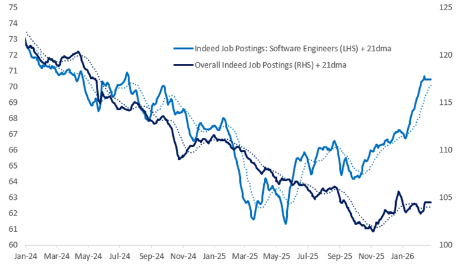
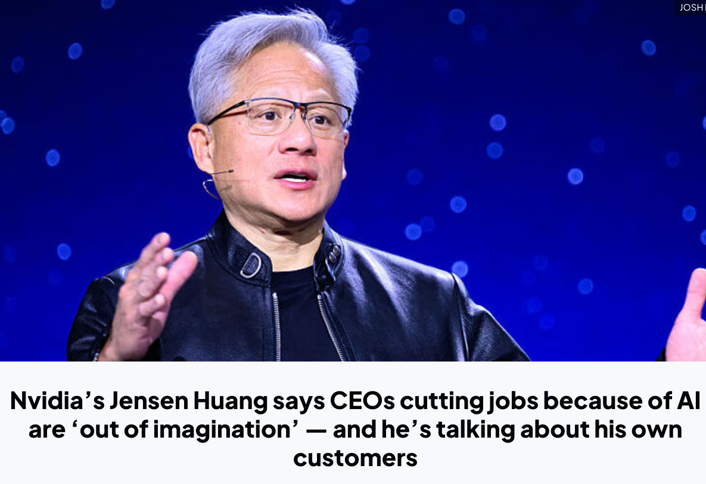

# 杰文斯悖论：AI 会增加人的工作岗位

[杰文斯悖论：AI 会增加人的工作岗位](https://www.dedao.cn/course/article?id=m845Ln7q69yKOOoW7YKrkebvGDYjgl)

2026-05-31 23:12

在我写这期文章的时候（2026 年 5 月），硅谷正弥漫着一股末世之感。虽然 AI 带动经济火热，街头歌舞升平，但很多有识之士相信这一切都是暂时的……因为他们认为 AI 会很快干掉大量的人类工作岗位。

Anthropic 的 CEO 达里奥·阿莫迪（Dario Amodei）最近就像个末日先知。他在几个场合表示，AI 将在一到五年内消灭\*一半\*初级白领岗位，把失业率推到 10%—20%；科技、金融、法律、咨询，尤其是其中的入门级岗位，都会中招。阿莫迪还像为民请命一般呼吁：AI 公司和政府不要再继续粉饰太平了！

而你对此可能也有些体感。过去两年间，硅谷连续有几家大厂打着 AI 的名义裁员。有美国名校计算机专业的大学生，毕业没找着工作。有人认为初级程序员岗位已经都消失了……

但是这一讲，我要说一个暴论：**AI 不但不会减少，而且会大大增加人的就业岗位。**

事实上，现在已经出现了早期信号。请看下面这张图，出自城堡证券（Citadel Securities）发表于 2026 年 2 月的一份报告 ——

图中用 Indeed 岗位发布数据比较了软件工程师和整体招聘岗位的走势，其中最显眼的是，**软件工程师岗位在 2025 年五、六月间，已经实现了触底反弹。**

当然，新岗位发布的数目仍然比疫情前、比 2021—2022 年的科技泡沫高点都低一些，但是，这是一个很好的迹象。不是说 AI 最先干掉的就是编程这项工作吗？怎么软件工程师的岗位反而最先反弹了呢？

这很可能不是反常，而是一个经济学规律的一次完美展示，叫做「 杰文斯悖论 （Jevons Paradox）」。

要理解其中的逻辑，咱们先回到 1865 年的英国。

英国正处于工业革命的巅峰，可是当时的人也有一种末日焦虑：支撑帝国心跳的是煤炭，蒸汽机、铁路、工厂、轮船，全都吃煤。那煤炭要是挖完了怎么办？各路天才想方设法改进技术，把蒸汽机效率提高了好几倍，都比以前省煤，于是人们设想，煤炭总消耗量肯定会降下来。

可是就在此时，一个叫威廉·斯坦利·杰文斯（William Stanley Jevons）的 30 岁经济学家出了一本书，叫《煤炭问题》（ *The Coal Question* ），说，你们想得太简单了。

杰文斯的判断是：蒸汽机越省煤，煤动力就越便宜 → 煤动力越便宜，更多行业就会用它 → 更多行业用它，英国总煤耗反而会\*上升\*。

这就是杰文斯悖论。而历史上事实果然如此。

而且这是一个普遍规律。咱们说一个发生在中国新疆的类似的事儿。

你知道新疆很多地方是干旱的。在上世纪 90 年代，天山地区推广了农业“滴灌”技术。过去浇一亩地需要用很多水，现在省了不少。那你说，总用水量是不是就应该下降了？并没有。

农民一看既然每亩用水少了，那我为什么不多种一点？而且既然滴灌提高了单产，那我能不能再种点更赚钱的经济作物？既然收益上来了，我是不是应该多开垦一些耕地？

结果是天山地区从 1996 年推广滴灌以来，20 年间用水反弹超过 115%。也就是说总用水量是以前的两倍还多。

现在 AI 消耗电力不也是同样的逻辑吗？AI 公司的算法越来越高效，英伟达的芯片一代比一代省电，单次推理越来越便宜 —— 可是数据中心的总耗电量却在疯狂飙升。

**这些故事的结局应该都会很好，毕竟人没有那么容易被资源限制死。但这个道理是，原来效率不是刹车，而是油门。**

一旦你有了杰文斯悖论这个眼光，你会发现生活中到处都是它的影子。

比如说写作。十年前没有 AI，我自己调研、有时候甚至是读纸质书，用铅笔画大纲，然后纯手打输入，再用眼睛盯着屏幕逐行修改……如果我这一天能保持很好的工作纪律，大约要花 6—7 个小时才能写好一篇文章。那你说现在有了 AI，我可以用 AI 调研、跟 AI 讨论、用语音输入、用 AI 审稿，每一步都能省下时间，我能不能用 4 个小时写篇文章呢？

**结果是出一篇文章的时间一点都没缩短，往往是更长。这是因为 AI 让我对文章有了更多的要求**：我会探索更多的想法，调研更多的文献，可选的案例更丰富，文章逻辑密度更高，篇幅也更长了，我变得更计较遣词造句，偶尔还要加入插图和漫画。

如果你也用 AI 做过自己以前做的工作，你会有同感。老板不会因为 AI 帮你提速了，就说太好了，早做完早休息！老板只会说既然十分钟就能出一版，那我们先做三版看看……你左一个需求右一个想法，最终把所有工作时间填满还不够。

别的事情不也是如此吗？你用上了一个购物就返现的省钱 App，每笔消费的确都能给你省钱……结果因为购买门槛降低，你更想买买买，总花费反而增加了不少。

再比如说，现在有微信、飞书、AI 会议纪要这些应用，人与人之间的沟通成本大大降低了，那我们的会议时间是不是应该减少呢？也没有。又是拉群，又是同步，又是对齐，发起会议的门槛近乎为 0，使得会议数量反而比以前多了。

这个洞见是： 当你提高效率、降低了单位资源消耗的时候，你同时降低了行动的门槛。门槛一降，原本被抑制的、甚至你都想不到的需求就会像洪水一样释放出来。

杰文斯悖论原本说的是效率越高就越消耗资源 —— 但你只要把“提高效率”改成“自动化”，把“资源”改成“人的工作”，这个悖论就变成了： 自动化会增加人的工作。

历史已经一再验证了这个规律 ——

19 世纪纺织机械刚出现的时候，有所谓“卢德分子”担心织布工要失业，就去砸机器。哪里想到布料价格暴跌的结果是普通人从只有一套衣服变成了有十几套，纺织工的数量反而大大增加了。

1970 年代，自动取款机（ATM）普及，大家都预测银行柜员将会消失。事实上单个网点需要的柜员人数的确减少了，但是因为运营成本降低，银行开始在每个街角疯狂开设新分行，柜员的总数不降反升。更重要的是，柜员不再只是“数钱的机器”，他们被解放出来去处理更复杂、更有价值的像开户、理财咨询这些工作。

快进到几年前，计算机视觉刚刚普及的时候，有学者断言放射科医生要失业了。后来的现实却是因为 AI 让看片成本大幅下降，医院开始给患者开出大量的预防性核磁共振和 CT 检查，导致扫描量激增。AI 帮医生筛选了 90% 的正常片子，而剩下的 10% 疑难杂症和最终的签字担责依然需要人类。于是现在全球范围内的放射科医生不是失业了，而是严重短缺。

类似地，电子表格没有消灭会计，而是让财务分析、预算管理、商业建模的业务扩张。搜索引擎没有消灭研究员，反而制造了 SEO、内容运营、数据分析和数字营销这些新岗位……等等等。

一个最新的例子来自中国。有个美术外包平台叫“米画师”，运作模式是需求方发布订单，比如说“我想要一个头像”“我想要一个什么样的动漫人物”，然后由画师在平台上接单。你说现在每个人都可以用 AI 画画了，是不是这门业务就不存在了呢？

恰恰相反。2022 年 10 月，因为一次知名的 AI 绘图模型泄露事件，几乎免费的 AI 绘画能力突然降临到大众手中，导致米画师上的单张图像平均价格下降了 64% —— 但是订单数量，却增加了 121%，结果是总收入增加了 56%。原有的创作者没有被挤走，他们保留了大部分的市场份额，增长则主要来自过去“不值得做”的低端个人订单。

这个规律不只是「**价格下降 → 订单增加 → 总市场变大**」，还有一个重要特点是「 **任务改变** 」。

**一个岗位不是一个动作，岗位是一组任务的组合。**会计不是“输入数字”，医生不是“看化验单”，律师不是“查法条”，程序员不是“敲代码”……这些岗位都包含判断、审美、责任等等不可被 AI 取代的任务，还可以包含各种因为 AI 而产生的新任务。

**AI 干掉的是任务，而不是岗位。**劳动经济学里早就有个「**任务模型**（task-based model）」，说自动化确实有「**替代效应**（displacement effect）」，会把某些原来由人做的任务交给机器 —— 但新技术也会创造新任务，让劳动重新进入生产过程，这叫「**复职效应**（reinstatement effect）」。

就在 2025 年，世界经济论坛（World Economic Forum）发布一份就业报告，认为到 2030 年，全球宏观趋势预计创造 1.7 亿个新岗位、替代 9200 万个旧岗位，等于净增加 7800 万个岗位。美国劳工统计局（Bureau of Labor Statistics）也明确说，AI 可能降低软件产品价格、从而增加软件开发、AI 商业解决方案和维护 AI 系统的需求，所以预测美国软件开发人员 2023—2033 年就业增长 17.9%。

当然我们还要拭目以待。但是，站在此刻看，AI 的确在改变世界，也很有可能带来奇点 —— 但是，经济学理论和过往的历史经验并不支持“AI 会导致大失业”这个末日假说。

**如果要顺应杰文斯悖论的历史大势，我们就不能站在旧任务那一边，而要站在新需求这一边。**咱们不妨大胆畅想一下，AI 会创造哪些新岗位。

历史经验仍然可以帮我们。简单说，当新技术把门槛降下来之后，那些过去不会做、做不起和不值得做的任务，就成了新的生意。

**第一类是直接与 AI 相关的岗位 ——**

比如「**AI 工作流架构师**」：不只是写提示词，而是把一个公司的销售、客服、数据、法务、财务流程改造成 AI 可执行、可审计、可追责的系统。

比如「**智能体监督员**」：管理一群 AI agents，让它们分工、协作、升级、复盘，像以前管理实习生一样管理机器员工。

比如「**模型评测师**」和「**红队测试员**」：专门找 AI 的幻觉、偏见、越权、漏洞和危险行为。未来模型越多，验收模型的人越值钱。

比如「**知识库园丁**」：维护企业内部数据、权限、语义结构、版本和来源。AI 吃数据，数据就需要厨师，还需要食品安全检查员。

比如「**机器人舰队管家**」：当清洁机器人、配送机器人、巡检机器人、护理机器人进入城市，总要有人负责调度、维修、异常处理和人机冲突调解。

**第二类是生活增强岗位 ——**

比如「**个人学习导演**」：这不是传统家教，而是用 AI 给一个学生定制长期学习路径、每日反馈、错题追踪和项目挑战。

比如「**老人生活增强师**」：用 AI、传感器和机器人帮老人管理用药、运动、社交、家庭联系和紧急响应。不是替代亲情，而是让亲情少一点鸡飞狗跳。

比如「**微型体验策划人**」：给一个家庭、一场生日、一段旅行、一个社区节日生成剧本、音乐、视觉、路线和互动游戏。过去只有大活动才值得策划，未来小生活也值得定制。

比如「**个人数字档案馆员**」：帮人整理照片、视频、聊天记录、文章、家族故事，做成可搜索、可传承、可展示的数字生命档案。

比如「**一人电影制片人**」：普通人不但可以拍电影，而且可以被拍电影。一个人带着 AI 做分镜、角色、配音、剪辑、特效，直接为一小群人、一个小家庭、一个小教育场景拍一部电影。

**第三类是信任与责任岗位，**这些任务以前就是必须的，但是现在变得更重要，以至于值得升级成专门的岗位 ——

比如「**AI 输出审计师**」：专门检查 AI 写出的法律文本、医疗建议、财务报告、科研摘要有没有错，错在哪里，风险归谁。

比如「**人类责任签署人**」：在医疗、金融、法律、教育等高风险场景里，AI 可以给建议，但最后要有一个懂业务的人签字、解释和担责。

比如「**首席审美官**」：AI 可以生成一万张图，但选出那张最有灵魂、最能触动人心的一张，只能靠你。

当能力变便宜，需求就会变复杂。当任务被自动化，责任就会被人格化。

杰文斯悖论和鲍莫尔成本病都告诉我们现代化是个好消息。提高效率是好消息；别人提高效率你没提高，对你也是好消息。人们总会有些担心，但即便是你担心的那事儿，终究也是好消息。

杰文斯悖论更深刻的洞见是，人类社会不是爱节约的机器 —— 人类社会更像一台欲望发动机。当技术把一个门槛降低，人类不会说“够了”，人类会说“那我们还想要这个、这个和那个”。

就在 2026 年 GTC 大会期间，英伟达 CEO 黄仁勋接受采访说：「**那些为了 AI 裁员的公司都缺乏想象力（out of imagination）。真正有想象力的公司应该用 AI 扩张，而不是收缩（do more with more）。**」

杰文斯会完全同意他的说法。**AI 是对人的解放，而不是对人的限制。只有想象力是我们的限制。**

---

> 关于 AI是否导致大规模失业，这两年不断出现各种论断，时不时就有相关文章引爆互联网各个角落，这些是噪声还是信号。普通人确实普遍对未来悲观，虽然未来很美好，财富大爆炸，但是与我个人似乎无关。 作为个人，悲观绝望没有意义，阻碍了行动的脚步。同时，我们当然需要预测趋势，基于趋势进行决策与行动。 那么，普通个体究竟应该如何有效行动呢？

这个问题问得很好，而且问的是"有效行动"，不是"怎么焦虑"。

先说一个底层判断：文章的核心逻辑——杰文斯悖论——是有历史支撑的，值得认真对待。但它也有一个重要的隐含前提：**总量增加，不代表你个人不会被替代。** 纺织工总数增加了，但某一个手工织布工人，他的命运取决于他有没有转型。所以宏观乐观，不等于个人可以躺平。

#### **先做一个思维框架的切换**

大多数人问的是："我的工作会不会消失？"这是一个被动的、防御性的问题。

更有效的问法是："在效率提升、门槛降低之后，**哪些新需求被释放出来，我能不能站在那一侧？**"

这不是文字游戏。**前者让你盯着要失去的东西，后者让你搜索可以得到的东西。**行动方向完全不同。

#### **具体怎么做，有三个层次**

**第一层：把AI当工具用熟，但不要止步于此**

用AI提效是门槛，不是护城河。人人都会用之后，这只是基础能力。真正的价值在于：你能用AI做出**以前做不了、不值得做、或者没人想到可以做**的事情。

比如一个设计师，不是"用AI帮我修图"，而是"我现在可以一个人给一个小品牌从品牌定位到视觉到推广素材全包了"——这才是门槛降低后释放出来的新需求。

**第二层：强化那些AI很难替代的能力**

文章里点到了：判断、审美、责任、人际信任。但这些说起来很虚，落地的方式是问自己：

- **我对某个领域的判断，有没有形成自己的标准？** 不是靠AI问出来的标准，是靠大量实践磨出来的直觉。
- **我能不能为某个结果签字担责？** 能签字的人，永远比只能执行的人稳。
- **我有没有真实的人际关系网络？** AI能写邮件，但不能替你建立信任。

**第三层：主动靠近"需求被释放"的地方**

杰文斯悖论最大的机会不在于"干AI相关的工作"，而在于**找到那些因为AI而突然变得"做得起"的事情**，然后去做。

比如，过去一个小县城的餐厅请不起专业的品牌策划，现在可能请得起了——如果你能做这件事，你的市场从一线城市的大客户，变成了全国几十万个小生意主。规模完全不同。

#### **一个最实用的自问**

与其每天看关于AI失业的文章，不如定期问自己这一个问题：

**"在我熟悉的领域里，AI让哪些过去做不了或不值得做的事情，现在变得可能了？"**

把答案写下来，然后找一件事开始做。

---

悲观来自于把自己想象成一个被动的变量，等着趋势来决定命运。但实际上，每一次技术革命，最先受益的不是最聪明的人，而是**最快调整行动方向的人**。宏观趋势你改变不了，但你站在哪一侧，是你自己选的。

---

Q: 你目前的职业方向是？ A: 技术与内容

Q: 你现在用AI工具的程度？ A: 每天用，但只是基础问答

Q: 你最大的焦虑来源是？ A: 不知道该往哪个方向转

这个组合很有意思——技术背景 + 内容能力 + 每天用AI但还停在表面。这恰恰是当下最值钱的交叉点，只是还没被你自己充分激活。

**焦虑"不知道往哪转"，往往不是因为没有方向，而是因为选项太多、标准不清。**下面这套策略，就是帮你建立标准、然后收窄到一个方向上行动。

---

### 核心判断：你的处境比你想的要好

中年男性的真实资产往往被低估：

- **技术背景**：你能看懂AI在做什么，不会被糊弄
- **内容能力**：你知道怎么把复杂的事说清楚
- **行业积累**：你在某个领域有10年以上的真实判断力

AI削弱的是**执行层**——写代码、画图、写初稿。  
AI放大的是**判断层**——什么值得做、做到什么标准、结果对不对。

你的年龄恰好让你站在判断层。问题不是"怎么转"，而是"怎么把判断力变现"。

---

### 行动策略：三个阶段，18个月

#### 第一阶段：激活期（0—3个月）

**目标：把AI从问答工具变成工作伙伴**

你现在每天用AI，但停在"问—答"模式。这相当于有一台跑车，只用来买菜。需要做的不是学更多工具，而是**换一种使用姿势**：

具体做法是选你工作中一件真实的、有输出物的任务，比如写一份报告、做一个方案、整理一套流程，然后让AI全程参与：帮你搭框架、找漏洞、生成初稿、提出反驳意见。你的角色从"执行者"变成"导演"。

做完之后问自己：**这件事以前要多久，现在要多久？省下的时间，我可以多做什么？**

这个问题的答案，就是你的杰文斯悖论红利所在。

---

#### 第二阶段：定位期（3—9个月）

**目标：找到你的"一平方公里"**

这个阶段最重要的不是学技能，而是**回答一个问题**：

> 在我熟悉的领域里，AI让什么事情"做得起"了，但还没人系统地做？

技术+内容的组合，有几个方向值得认真评估：

**方向A：技术内容的翻译者**  
 把AI工具、技术产品、工程方案翻译成业务决策者能听懂的语言。这个角色在每家公司都缺，因为技术人不擅长说人话，业务人看不懂技术。你两边都懂，天然是桥梁。

**方向B：垂直领域的AI工作流设计师**  
 不是做通用AI培训，而是针对你熟悉的某个行业（哪怕是你待过的一个细分领域），帮他们把现有工作流用AI重构。做成可复用的方案，可以咨询、可以课程、可以SaaS。

**方向C：有判断力的内容生产者**  
 不是AI批量生产内容，而是用AI提升你自己的内容密度和速度，产出有真实判断的专栏、报告或分析。你的技术背景让你的内容有别人没有的可信度。

评估标准只有三个：你有没有真实的行业判断、能不能找到第一批付钱的人、你愿不愿意在这个方向上持续三年。

---

#### 第三阶段：杠杆期（9—18个月）

**目标：让积累产生复利，而不是靠时间换钱**

中年最大的风险不是失业，而是**继续用线性方式积累**——多干一小时多得一小时的钱。AI时代的机会是把你的判断力做成可复用的东西：

- 一套方法论，可以教给别人
- 一个内容账号，沉淀你的判断和案例
- 一个小工具或模板，解决你熟悉的那个领域的一个具体问题

不需要做大，**做小而准**。服务100个真实需要你的人，比站在广场上喊话给10万人更有价值，也更稳。

---

### 一个最小行动

策略可以很长，但启动只需要一件事。

这周找一件你工作中真实存在的任务，把AI完全拉进来，当成一个初级同事来用——分配任务、检查输出、给反馈、迭代结果。

做完之后你会发现两件事：AI比你想的能干，以及它在哪里靠不住。

**靠不住的那个地方，就是你的价值所在。**

---

方向焦虑的本质，是还没有足够多的真实试错。选一个方向开始动，三个月后你会有完全不同的感知。到时候再调整，比现在空想更有效。