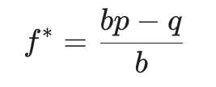
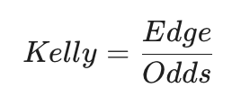
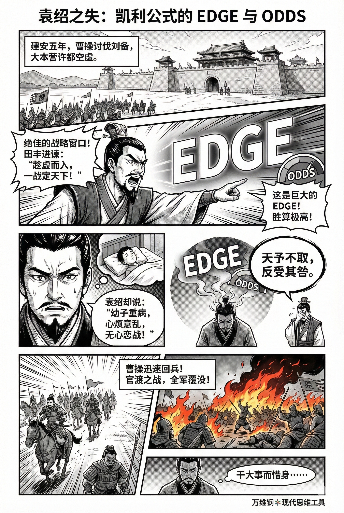

# 凯利公式：乘法世界里的认知变现（得到课程讲稿 + AI 加工段）

# 凯利公式：乘法世界里的认知变现

[凯利公式：乘法世界里的认知变现](https://www.dedao.cn/course/article?id=yNwelz6kDn0aKeAmbLK7qLAO3Bb51j)

这一讲的思维工具是「 凯利公式 （Kelly criterion）」。很多人把它当作一个投资保本的法则，其实它的作用要激进得多，而且可以指导生活决策 —— 凯利公式本质上是一台把认知变现的机器。

前面我们说了，人们把很多时间花在没有价值的信息上。而凯利公式解决的问题，则是面对有价值的信息时，你的行动与之不匹配。

比如有人在股市里，为了几毛钱的波动，每天盯着盘面杀进杀出，甚至加上高杠杆；可是赶上一个潜力巨大、而且极其确定的新职场赛道或者创业机会时，他们反而反复计算沉没成本，犹豫不决，最后只敢投入一点点业余时间。而那只不过是因为股价的波动感觉更亲切而已。

用曹操评价袁绍的话说，这就是「**色厉胆薄，好谋无断；干大事而惜身，见小利而忘命，非英雄也。**」

押太大和不敢押都是错的。这不是信息问题，这是仓位问题。

那怎么把握好出手的度呢？这就是凯利公式的基本用法。

约翰·凯利（John L. Kelly Jr., 1923–1965）是贝尔实验室的科学家，他 1956 年那篇著名的论文，原本研究的是通信问题。

你要知道，因为噪声的存在，信息在长途传递中总会发生一些错误。此前信息论之父香农已经证明，你可以用扩大信道的方式减少错误率，但是你不能绝对消除错误。那么凯利就想，有错误率的信息也是有用的，我能不能算一算，它到底有多大用呢？

凯利设想了一个场景：假设赛马场外有一个赌徒，通过一条有噪声的私人电话线接收内幕消息，电话那头的人能 100% 预知哪匹马会赢。

但是因为电话线有噪声，赌徒听到的结果，有 p 的概率是准确的，有 q = 1-p 的概率听错了。那么赌徒如何拿这个有噪声的内幕消息下注呢？

如果他每次都 all-in，当然可以让单次赢钱最大化，但是只要听错一次，就破产清零了。可是如果下注太少，又浪费了这条宝贵的内幕电话线。

凯利经过一番数学推导，证明了一个极其优美的结论：赌徒要想永远不破产并且让资金的长期复合增长率达到最大化，他每次下注的最佳比例 f\*，在数学上竟然完全等同于这条电话线的“信息传输率”！

这就是凯利公式。

这篇论文把信息论和资本复利联系在了一起 —— 一个是“你掌握多少关于世界的有效信息”，一个是“你的资本如何在随机起伏中长期增长”。凯利的结论说白了，就是：

你的增长上限，受限于你的认知带宽。

人们立即就发现这个公式应该用在投资上，而且是最基本的原理。

它解决的核心问题是：在一个不确定的、乘法式结算的、可重复的世界里 —— 也就是你每一回合要么赢一点要么输一点，输赢累积成复利 —— 你到底该怎么下注，才能让长期增长率最大。

凯利解决的不是“怎么赢”，而是“怎么一直赢”。

咱们来看一眼这个公式 ——

假设你每次拿出自己当前总资产的一部分来下注，赢了就赚到赔率，输了就输掉这一把的下注。公式中，

\- p 是这一把下注赢的概率；

\- q = 1-p 是失败的概率；

\- b 是赔率，也就是一旦赢了，你下注 1 元净赚多少钱；

那么 f\* 就是凯利算出来的你这把的最佳下注比例。**比如你判断胜率 p=0.6，赢了赚一倍（b=1），那么凯利公式说，你应该押 20%。**

你该押多大，既不是看你有多想赢也不是看你有多大的冒险精神，而是看你胜率有多高、赔率是多少。

在赌场黑话里，凯利公式经常被简化成一句口诀：

分母 odds = b 是赔率，它是市场给的。你直观上可能觉得赔率越高越应该多投，但市场给的收益和风险会匹配：收益已经体现在了分子上，分母这里看的是风险。Odds 体现了市场对风险的共识：odds 高表示市场认为它风险大。

如果一个人下注只看赔率，他就只能赚到市场的平均收益 —— 而有效市场的平均收益无限接近于零。甚至如果是去赌场赌博的话，平均收益是负的。

真正应该让你动心的是分子，edge —— 我建议你记住这个英文单词，因为很酷 —— 它等于 bp - q，是每下注 1 元的期望净利润。Edge 是你的认知优势！

更直观的理解是，你凭什么赢？就凭你有“内部消息”，你认为胜率应该是 p —— 只要那个 p 值使得 edge > 0，你就认为这件事比市场估计的更值得赌。Edge，其实是你自己对局面的估计与市场一般判断之间的认知偏差。

凯利公式让你赚的，是你超出大众认知的钱。你比大众高明多少，凯利就能帮你赚到多少，但不能更多。

而如果你不掌握大于零的 edge，凯利就要求你不要下注。说白了就是你要是不比别人高明就别玩。

这一切跟你的性格、胆量什么的都没有关系。要不要出手，应该只看你的机会比世界给的平常价高多少。

可是咱们回头再想想袁绍。建安五年，曹操去讨伐刘备，大本营许都空虚，袁绍面临一个绝佳的战略窗口。谋士田丰立即建议出兵打许都，一战就能平定天下。用我们这一讲的话说，袁绍眼前有一个巨大的 edge！

结果袁绍说他最小的儿子得了重病，自己心里烦乱，没心思打仗！……正应了那句「干大事而惜身」。

天予不取，田丰和凯利还能说啥呢？袁绍接下来就只能面对人家曹操迅速回兵，然后官渡之战，自己全军覆没。

如果 edge 好，出手是一种义务。

凯利公式并不只是用在通信和投资上，在很多领域都有用。

我看到一个最有意思的例子来自生物学。

生物的繁衍，通常是一种很危险的行为。一旦赶上环境剧烈波动，你所有个体集中在一起出来繁殖，结果繁殖失败了，那就有可能导致整个族群就此灭绝。所以有些单细胞生物发明了一个应对策略，叫「表型赌注对冲（Phenotypic Bet-Hedging）」。

简单来说，就是让一部分个体处于休眠状态，只让其余的个体出来赌一把参加繁殖。像沙门氏菌（Salmonella）和枯草芽孢杆菌（Bacillus subtilis）都有这个能力。就算这一个族群的基因完全相同，是克隆出来的，它们也会自动分散下注。这样就算环境历经几次变坏，哪怕遭遇抗生素攻击也好，这个族群都还能继续存活。

神奇的是，研究者发现，进入休眠状态的细胞比例，在数学上等价于凯利公式中的未下注比例。

这是进化的奇迹，也是数学的威力。也许生物多样性就是系统为了应对不确定性而支付的凯利仓位。

如果你把人生想象成一系列的投资冒险，那么凯利公式给你三个最底层的指引。

**第一，别把自己清零**

只要 p 不是严格等于 1，凯利公式就要求你不要 all-in。而我们前面就说了，贝叶斯主义者永远都不会假设概率等于 0 或者 1。而且别忘了你的估计可能有误差，所以还得再多留一点余地才好。诱惑再大也得保本，确保自己始终留在牌桌上。

**第二，认知先行，先问自己有多大的 edge，再想下多大的注**

很多人恰恰相反，是先有了强烈想押大注的冲动，再去四处找理由证明自己有优势。我们是把认知变现，不是用认知去解释变现。这把不合适，就等别的机会。巴菲特从来不买自己看不懂的股票，你的行动力度必须符合你的认知深度。

**第三，追求复利，而不是赢一把**

凯利公式整个的推导设定，是你要在这个连续的乘法游戏里玩很多把：有时候你赢，有时候输，它追求从长期看，让你的积累最大化。这是一个系统，而不是只赌一局。只要你相信数学，单次成败就都不重要，你终归结果是好的。

你并不需要每次都拿这个公式进行精确计算，有时候只要有一个大概的估计，一个模糊的力度就已经很好了。

咱们看几个生活中的应用场景。

**职业规划** 。我们已经讲过「赛道选择」、讲过「探索与利用」的权衡，而凯利公式能让你的抉择更精细一点。比如你对自己的本职工作不太满意，现在有个机会，你可以换个工作甚至换个职业，你换不换呢？

很多人把赛道当成一次性的选择，干一行就是一辈子，选错也不敢换；有的人反过来，把换赛道当成情绪释放，一怒就辞职，直接 all-in。

但职业是一种典型的乘法资产：你的技能和声誉都是可积累的，适合多轮下注。那么凯利的建议将是这样的：

\- 先问 edge：你在那个方向上真的比别人强吗？你能更快学会、能更好交付、更愿意熬吗？

\- 再看 odds：那个方向的回报结构如何？上限大不大？

\- 最后谈仓位：如果 edge 有但是你拿不到精确的 p，就别下注太多 —— 可以用所谓「半凯利」「分数凯利」试试水，也就是先作为副业，弄几个小项目跑一轮，看看反馈。

在凯利公式的视角下，无所谓求稳还是求拼，其实只是一个度的选择而已。

你可以把自己的**有效精力和健康** ，也当做一种资产，尽管不容易升值。**每天做不同的事情，比如学习、工作、运动、社交和娱乐，就相当于是下注。**这些下注可能会让你赢，比如让你更健康或者是其他正向的回报；但也可能让你输，比如做完这件事感觉更不好，身体变差。

可能刷短视频没啥价值，学习和工作有价值 —— 但那些价值只是赔率，可不等于 edge。如果你现在已经很累了，可是手里有个很重要的活儿，你有必要熬夜完成它吗？也许家人说不要做，老板说应该做，但凯利会说：你算一算 edge。

**时间管理**的最重要的凯利策略则是“少出手”：**你应该把仓位集中到能产生复利的少数变量上。**

还有一种乘法资产是信任。你在社会上的信用也好，你给别人的信任也好，都是在一次次交往中慢慢积累复利，而且都有快速清零的风险。一个人哪怕做 15 件好事，你也不见得敢把自己的银行账号密码告诉他；但他只要做一件坏事，你可能就再也不信任他了。

所以 **人际关系** 的凯利策略是：

1. 刚认识的时候先小下注，交给他一些小事，做好了提高 p 值；

2. 如果表现好可以逐步加仓，但始终确保赔率和回报对称，也就是一个项目的潜在收益，必须配得上你的潜在损失 —— 为什么不应该把银行密码告诉别人？因为潜在收益非常小，潜在损失非常大；

3. 永远保留止损机制，防止清零：关系再好也不要把能让你瞬间破产的权限交出去。

这听起来很腹黑，我也不主张跟所有人交往都用公式……但是如果你经常行走江湖，你需要好好管理你的信任资产。

总结来说，凯利公式并不只是计算仓位，它实际上给了一个乘法世界的行动哲学：它把你的认知优势翻译成下注规模。

你有多大 edge 谈多大变现。

凯利公式要求我们把人生看作一场乘法的长跑：不计一城一池之得失，相信逐渐但可以有起伏的积累，只要你坚持正确的策略。然后不管怎么说，别清零。

凯利公式让我们思考什么是勇敢。这几年人们常说勇敢是一种最稀缺的美德，但什么是勇敢呢？如果凯利公式说你应该押 20%，你却押了 25%，算是勇敢吗？那可能是出于你的德行，也许你想为了慈善事业自我牺牲，但也可能那只是酒精冲动，更可能是来自无知。

考虑到大多数人是以结果为导向，输一把就胆怯，赢一把就狂妄，也许不被暂时的输赢所左右，能够清醒地按照凯利公式出手，才是真正的勇敢。勇敢是对本能的克服。

勇敢会带给你自由。而在凯利公式看来，人生的根本自由是你始终有下一次下注的能力。

世界既不会奖励你的努力，也不会惩罚你的动机。它只结算你的概率质量。

注释

[2] 这里我们采用了流行的解读，但其实我把公式改写成 f\* = p - q/b，赔率的作用就很直观了。

[3] 这一点有精确数学含义：edge = (p - P_m)/P_m，其中 P_m = 1/(b+1) 是市场对赢的概率判断。

---

这篇专栏是一篇极其精彩的**“跨界思维模型”文章。它剥离了“凯利公式”在赌桌和金融市场上的数学外衣，将其升华为一套适用于不确定性世界的“人生算法”和“行动哲学”**。

### 核心破局点：解决“认知与行动的错位”

我们在生活中常犯一种错误：**在充满噪音的低价值事情上频繁下注（如因为情绪冲动裸辞、因为几毛钱的股票波动满仓），却在具有巨大确定性和长远价值的机会面前畏首畏尾（如面对极佳的赛道不敢投入精力）。**

这并非信息不足，而是“仓位管理”的失败。凯利公式的伟大之处在于，它提供了一台**“认知变现的机器”，强制要求你的行动力度必须与你的认知深度相匹配**。

- 你掌握的内幕（Edge）有多大，你的注就下多大。
- 押太大（超越认知的狂妄）和不敢押（干大事而惜身）都是违背数学规律的错误。

### 底层世界观：看懂“乘法世界”的残酷与美妙

理解凯利公式的前提，是认清我们生活在一个**“可重复的、乘法式结算的”**世界中。

1. **加法世界 vs 乘法世界：** 拿死工资是加法世界，今天不努力只是今天没钱；而投资、职业声誉、人际交往、信任积累，都是乘法世界（复利世界）。
2. **乘法世界的终极法则——零乘任何数都等于零：** 在乘法世界里，单次收益极高但带有“清零（破产）”风险的游戏是绝对不能玩的。只要发生一次清零，之前积累的无数个 100% 收益都会灰飞烟灭。
3. **长期增长的限制因素：** 凯利公式用数学证明了，在这个世界里，决定你长期复合增长率上限的，不是你的胆量或资金，而是你的**“认知带宽（信息传输率/Edge）”**。

### 凯利公式的三大生存法则

三条极具实操性的底层指引：

- **防守底线：绝对不把自己清零。**因为人的认知（贝叶斯概率）永远存在误差，p（胜率）在现实中绝不可能严格等于 1。所以“All-in”在数学上是一种极其愚蠢的行为。永远保留“留在牌桌上”的筹码，是第一要务。
- **进攻前提：认知先行（Edge决定仓位）。**公式中的分子 $Edge = bp - q$ 是核心。你凭什么赚钱？凭的是你看到了市场没看到的概率（认知偏差）。如果你没有超越大众的认知（Edge < 0），凯利公式的答案就是“不下注”。**“不比别人高明就别玩”**，这句话足以帮我们避开生活中 90% 的韭菜陷阱。
- **全局视角：追求复利，放弃“单局思维”。**凯利公式不保证你下一把一定赢，它保证的是在连续下注 N 次后，你的资金总额最大化。接受单次的失败与起伏，将其视为概率系统的一部分，这是克服“输赢心”的最佳武器。

### 万物皆可“凯利化”

将数学公式泛化到了非量化的生活场景中，证明了凯利公式具备“普适规律（第一性原理）”的特征：

1. **生物学（进化的智慧）：** 细菌保留一部分个体休眠（不参与繁殖），其比例恰好等于凯利公式的“未下注比例”。这说明**“保留冗余以应对不确定性”**不是人类发明的策略，而是大自然经历亿万年残酷自然选择后刻在基因里的真理。
2. **职业规划（半凯利策略）：** 把职业看作乘法资产。不确定优势（Edge）时，不要头脑发热直接裸辞（All-in），而是用业余时间做副业、小项目测试（分数凯利）。
3. **精力分配（少出手）：** 把精力当作筹码，只集中投资于能产生复利、且具有高 Edge 的少数关键事务上。
4. **人际信任（止损机制）：** 信任是最脆弱的乘法资产。交往从小事（小仓位）开始，做好了再加码；但**永远不交出“能让自己瞬间破产的权限”**（不对称的风险收益比）。这是对人性极其通透的洞察。

### 重新定义“勇敢”与“自由”

作者完成了对传统价值观的重塑：

- **真正的“勇敢”不是无知者无畏，也不是热血上涌的 All-in。** 勇敢是“对本能的克服”。当贪婪让你想全押时，你能克制地只押 20%；当恐惧让你想退缩时，你能因为算出了 Edge 而果断出手。**绝对的理性，才是最高级的勇敢。**
- **真正的“自由”不是想做什么就做什么。** 在乘法世界里，自由的终极定义是——**“你始终有下一次下注的能力”**。无论遭遇何种黑天鹅，你都没有被踢出局。

如何做到**“知行合一”**：**认知（知）构成了你的 Edge，仓位管理（行）决定了你的结果。** 

世界是极其冷酷的，它不相信眼泪，不奖励苦劳，也不理会你的苦衷与激情。

**“世界既不会奖励你的努力，也不会惩罚你的动机。它只结算你的概率质量。”** 

读懂凯利公式，就是读懂了如何在不确定性中做个理性的长期赢家。

---

### 行动策略

> 普通人如何在高度不确定的时代合理运用凯利公式呢？尤其是P可能完全无法预估的情形下

现实世界不是赌场，没有任何人会好心地为你标出胜率 $p$ 和赔率 b。当我们处于一个**“高度不确定（VUCA）”** 的时代，面对一个全新的行业、一次未知的创业、或者一段刚开始的感情时，p 往往是完全黑盒的。

如果在不知道 $p$ 的情况下强行套用凯利公式计算，那叫“精确的错误”。普通人要在这种情况下运用凯利公式，必须**从“精确的数学计算”降维成“生存的结构设计”**。

当 $p$ 无法预估时，你可以通过以下五个策略来运用“凯利思维”：

#### 1. 既然算不出胜率（p），就去寻找“非对称收益（b）”

在公式中，除了胜率 p，还有一个关键变量是赔率 b。当你无法判断胜率有多大时，**你应该只参与那些“下行风险封死，上行收益无限”的游戏。**

这就是塔勒布提出的**“杠铃策略”**：

- 不要把钱和精力均匀分散在中等风险的事物上。普通人应该把 80%-90% 的资源（时间、金钱）放在极度安全、绝对不会清零的地方（如保住主业、锻炼身体、存款）；然后拿出 10%-20% 的资源，去疯狂下注那些“哪怕胜率 $p$ 不知道有多低，但一旦做成，赔率 $b$ 大到惊人”的事情。
- 业余时间写小说、做自媒体、钻研一门冷门但前沿的开源技术。这些事失败了（大概率），你损失的仅仅是一点业余时间；但一旦碰上时代的风口，收益是指数级的。**只要单次下注成本极低，你就不需要知道 $p$。**

#### 2. 用“微小仓位（Micro-bets）”去购买 $p$ 的信息

当 $p$ 完全未知时，最愚蠢的做法是靠脑补去猜，最聪明的做法是**用极小的成本去“跑出数据”**。

在凯利公式的视角下，这叫做“试探性建仓”。

- 既然无法预估，那就把一次大下注，拆解成 10 次小下注。通过小规模的行动，让真实的反馈来告诉你 $p$ 到底是多少。
- 你想开一家奶茶店，不知道胜率。不要直接辞职砸 50 万去开店（这是在未知 $p$ 时盲目 All-in）。你应该先花 500 块钱，在周末的夜市摆个小摊，或者在朋友圈做外卖。如果在小圈子里你的复购率（真实的 p）极低，你就迅速止损；如果供不应求，你再利用凯利公式“加仓”。

#### 3. 强行使用“分数凯利（Fractional Kelly）”，永远给自己打五折

即使是在量化投资界，顶尖高手在算出了凯利比例后，也绝对不会完全按照公式下注，而是采用“半凯利（Half-Kelly）”甚至“四分之一凯利”。

- 当你对某件事感觉极好，觉得胜算很大（主观认为 $p$ 很高），甚至觉得应该押上 50% 的身家时，**请强制把你的冲动除以 2 甚至除以 4。**
- **背后的逻辑：** 面对高度不确定性，人类往往存在“盲目自信偏差”。使用“分数凯利”，就是为了消化这种“无知的误差”，用更保守的仓位，换取在极端黑天鹅事件下的存活权。

#### 4. 从“预测外部概率”，转向“提升内部概率”

当外部环境高度不确定，赛道、行业的 $p$ 都在随机波动时，普通人最稳妥的策略是：**寻找那些 $p$ 值完全由你自己决定的资产进行投资。**

-  什么事情的胜率几乎是 100%？

  - 花时间锻炼身体，健康回报的 $p$ 接近 1；
  - 花时间陪伴家人，家庭关系稳固的 $p$ 接近 1；
  - 学习底层的通用技能（如外语、演讲、逻辑思维），这些能力在任何周期保值的 $p$ 接近 1。
- 当外部的 $p$ 模糊不清时，把最大的“仓位”押注在自我成长上，这是普通人在乱世中最完美的凯利策略。

#### 5. 把“不下牌桌”作为唯一信仰

在高度不确定的时代，发生极端恶劣事件的概率远比你想象的大。

- 当你不知道胜率时，你唯一要保证的就是**“这把输了，我还能不能活下去”**。
- **不要加杠杆：** 不管别人买房、炒币赚了多少倍，只要加了高杠杆，就意味着一次轻微的回撤就会让你清零。
- **留足备用金：** 永远保留 6-12 个月的生活费。这笔钱不是用来增值的，它是你的“不被清零保证金”。
- **信誉止损：** 绝不为了短期利益做违法违规、或者透支个人信用的事，因为社会信用的清零往往是不可逆的。

#### 普通人的“模糊凯利法则”

在高度不确定的时代，我们不需要成为数学家。对于普通人来说，未知的 $p$ 并不是行动的阻碍，而是一种提醒。你可以把凯利公式化作这样三句人生箴言：

1. **看不懂局势（$p$ 未知）时：** 下重注于自身的健康和本领（p=1），用闲钱和业余时间去尝试高赔率的新鲜事物。
2. **似乎看懂了（以为 $p$ 很高）时：** 控制狂热，永远只下“半注”，留有余地。
3. **任何时候：** 绝对、绝对、绝对不要借钱赌命（拒绝清零）。

你不需要算出精确的未来，你只需要活得足够久，概率之神最终会把复利的奖赏交给你。
