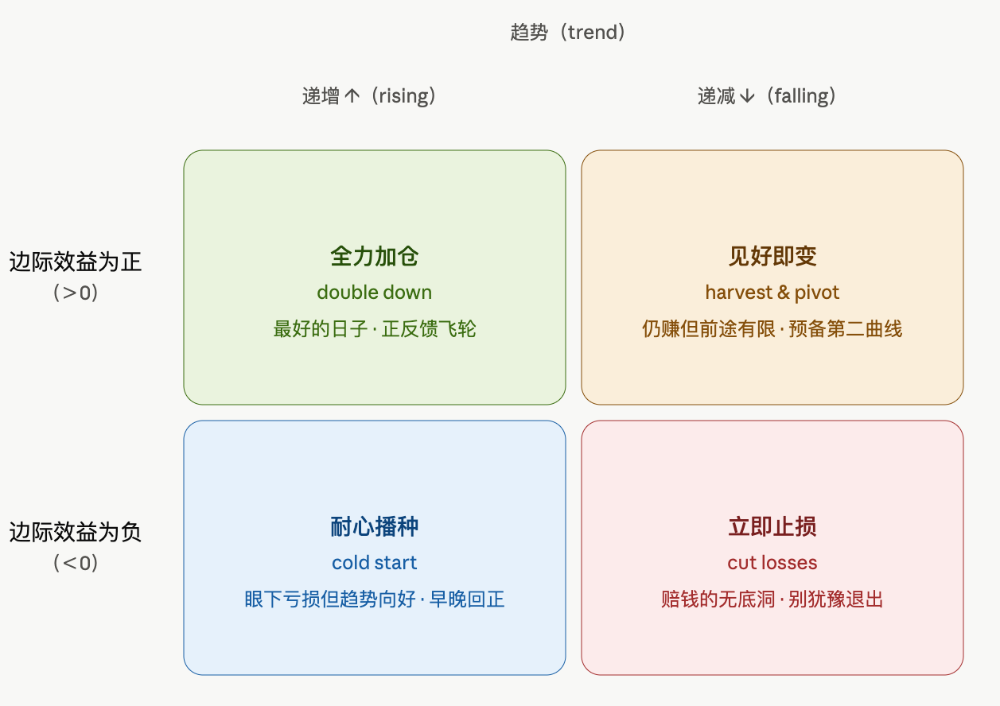
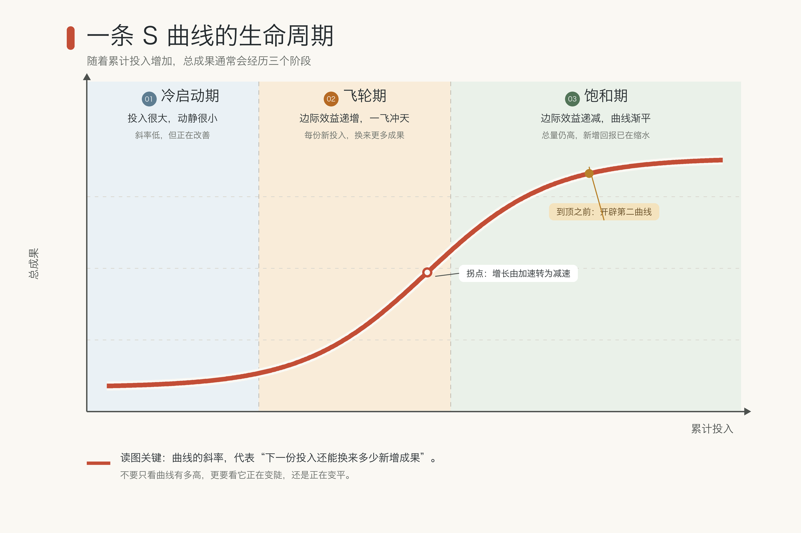
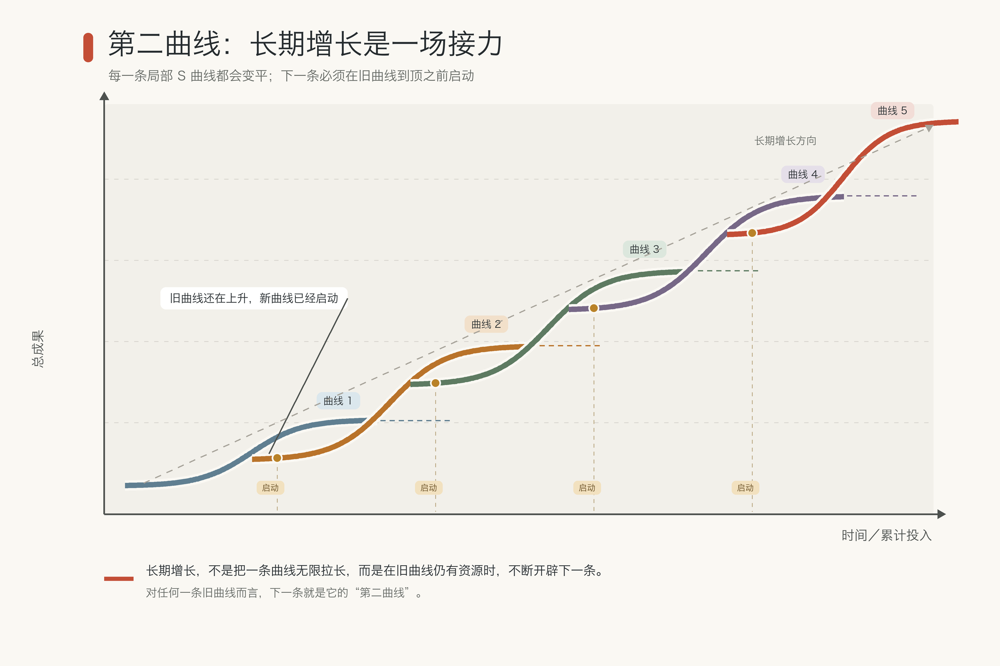
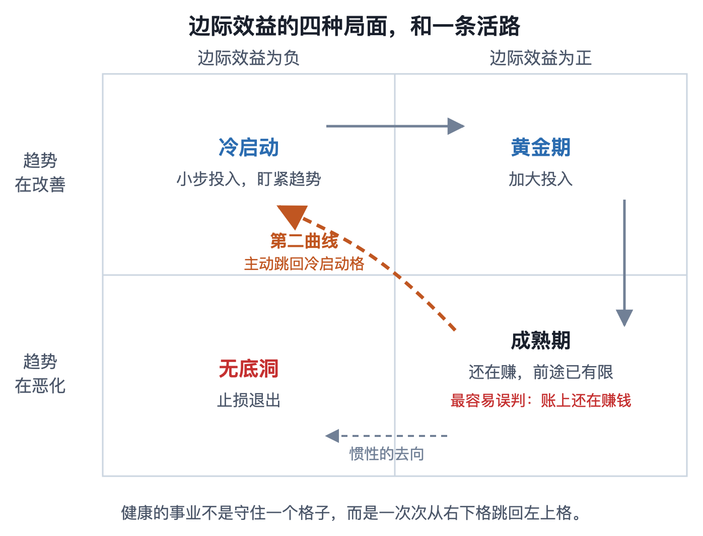
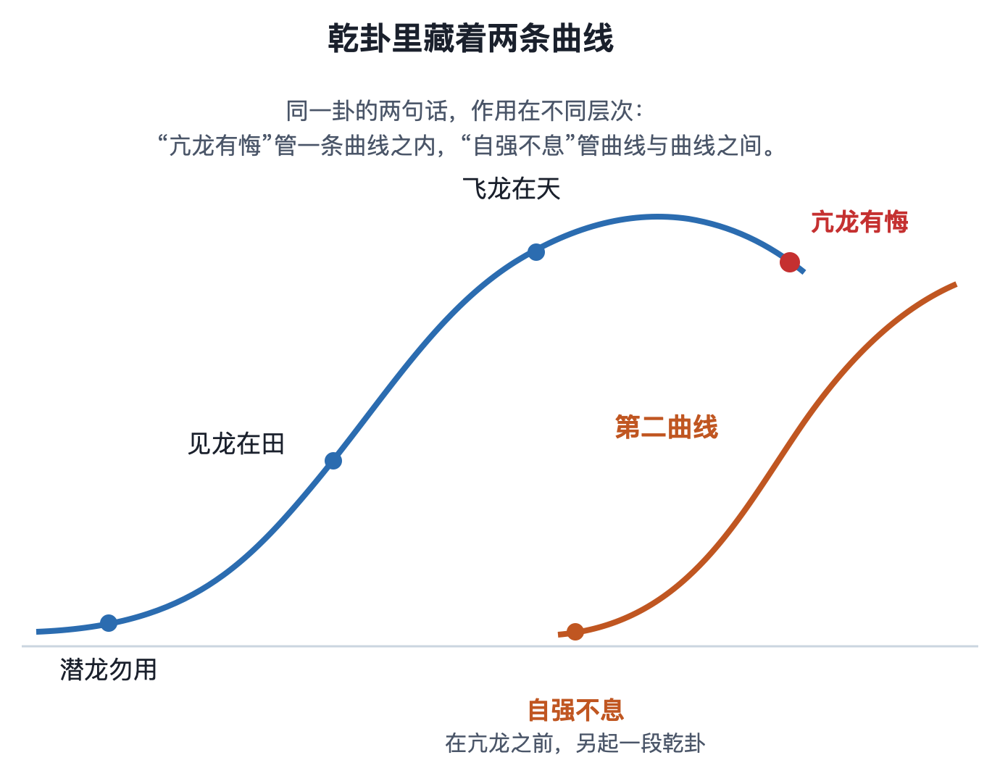
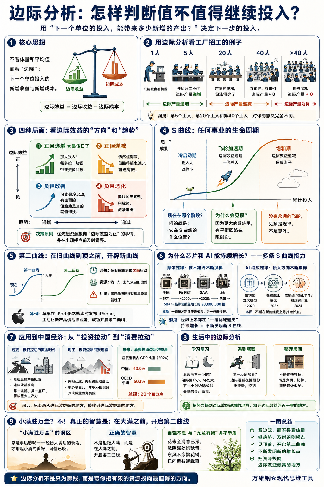

# 边际分析：怎样判断值不值得继续投入？

[边际分析：怎样判断值不值得继续投入？ ](https://www.dedao.cn/course/article?id=Nwelz6kDn0aKeRWMoLV7qLAO3Bb51j)

2026-07-23 00:07

这一讲咱们说一个被很多经济学家认为是经济学里最重要的智慧，叫「 边际分析 （marginal analysis）」。

它能帮你分析一个事业 —— 任何事业 —— 是应该坚持，还是应该放弃，还是应该加大投入。

比如创业者说的那个增长飞轮。世界上没有永远存在的正反馈，那你怎么知道这个飞轮是刚刚启动，还是已经快转到头了呢？

边际分析可以被用成一种反馈式的决策法，它能让你根据输出的变化决定你下一轮的输入。好处是你不必先把系统的所有细节都搞清楚，就能得到一个决策信号。

我认为边际分析是一个被大大低估了的思维工具。它原本应该像“不为已甚”“亢龙有悔”那些成语一样尽人皆知才对。

不懂行的人观察一个事物，本能反应是看它的体量：这家公司资本真雄厚，这个组织成员真多，厉害！但是大并不等于健康。可能这家公司经营不善，都快要资不抵债了；那个组织人心已经散了。利益相关者至少会关注一下平均值，比如这家公司的效率怎么样、利润率怎么样。

但那些说的都只是过去和现在，而决策必须面向未来。

要问这个事物有没有发展前途、值不值得追加投入，经济学家的眼光是看「边际」：下一个单位的投入，能带来多少新增的产出。

比如你新开了一家工厂。你前期砸进去一大笔钱购买厂房和设备，这些都是固定成本。请问接下来应该招多少工人呢？第 1 个工人只能独自看机器；第 5 个工人来了就可以分工，你管上料我管质检；第 10 个工人来了，流水线真正转起来 —— 人手越多分工越细，每多招一个人，带来的新增产量就越大，这就叫边际产量递增。产量上去了，摊到每件产品上的固定成本也越来越薄，这都是好消息，你应该继续招人。

但这个过程不是无限的。车间就那么大，设备就那么几台。招到第 20 个工人的时候，日产量还在涨，但涨得就有点少了；招到第 40 个，工人开始互相等设备、互相挡道，多一个人带来的新增产量已经是零。要是再招，车间里就像春运候车厅，产量反而会往下掉。

如果不对工厂做大手术，你就会从边际产量递增变成边际产量递减，最终变成边际产量是负的。

你看，工人并不是越多越好：第 5 个工人、第 20 个工人和第 40 个工人，他们对你的意义很不同。这就是边际分析的洞见。

现在咱们说得稍微正规一点，不管你做的是什么事，都会有一个边际收益和边际成本。我们不妨定义：

边际效益 ＝ 边际收益 － 边际成本

边际效益可以是正的，也可以是负的；它的趋势可以是递增，也可以是递减。把这两个维度组合起来，你面临的局面总共有四种 ——

- **边际效益为正，而且还在递增，**这是最好的日子，一定要加大投入 **！** 你每多投一块钱都会给你带来更多的钱。
- **边际效益为正，但是在递减，**这件事仍然值得做 —— 每多做一件仍然是赚的 —— 可是赚的越来越少。那么你需要担心了，这件事的前途非常有限，过不了多久就不赚钱了。
- **如果眼前的边际效益暂时为负，但趋势在改善**，这可能是上一讲说的冷启动：现在投入可能有点冒险，但是只要这个趋势是真的，你就值得投，将来早晚有赚钱的一天。
- **而如果是边际效益为负，而且越来越负**，那这就是个赔钱的无底洞，别犹豫赶紧退出。

「边际效益递增」大约是世界上最值得大力投入的东西：你每次追加投入都会带来新的产出，而且产出比以前的更多！你正在搭载正反馈飞轮，根本停不下来，你甚至感觉连睡觉都是浪费时间。

我们前面为什么说「平台」是现代世界最厉害的商业模式？就因为它是一个边际效益递增的结构：用户越多，平台对每个用户就越有用，下一个用户就来得越容易、也越值钱。平台还享受数据飞轮：用户越多数据越多，产品越聪明，又吸引来更多用户。

边际效益递增也是工业化赚钱的秘密：你前期的固定成本是不变的，每多生产一件产品，分摊的成本就越少，你的收益就越大；而且你生产的产品越多，你就越熟练，成本还能进一步下降，收益还能进一步增加。

其实只要边际效益不降低，这个事业就不但值得持续投入，而且应该使用商业杠杆把它不断放大。你只要把收益再投进去变成复利，增长本身就能带来新的增长 —— 你得到的就是人们梦寐以求的指数增长……

用投资人的行话说这叫「可扩展性（scalability）」，也就是这个事业可以被不断地放大。

但我们不得不说， 世界上没有永远的边际效益递增。

每一个强化回路都活在一个更大的系统里，那个系统里总会有个平衡回路正等着要限制它。

你产品卖得好，对手就会进场，跟你抢用户抢供应商打价格战。梅西球踢得再好，球迷再多，他每年也只能踢这么多场比赛，而且他终究会衰老。更多的情况是明星自己还充满干劲儿，粉丝已经看腻了……就算这些你全躲过去了，还有一条最硬的天花板：市场总量。等你的市场占有率到了 50%，你就不可能再增长一倍了。

你终究会迎来边际效益递减。

资本市场每隔几年就要用真金白银重新学一遍这个道理。当年共享单车大战，资本以为投放量就是飞轮：车越多越方便，越方便用户越多。故事的前半段倒是对的；可是超过有效密度之后，新增的车带来的便利趋近于零，调度、维修、丢损的成本却继续上升……项目最终玩不下去，变成一座座单车坟场。

所以世间再好的产品也不会给你无限的指数增长，它们的故事一般是一条「S 曲线」 ——

随着累计投入，总成果的变化趋势是前期冷启动，投入很大动静很小；中期飞轮转起来，边际递增，一飞冲天；后期饱和，边际递减，曲线渐渐变平。

你想知道一个产品现在处于生命周期的哪一个阶段，你问的就是它在 S 曲线上的位置。

其实这个“总量还在高处，边际已经转弱”的局面，中国人早就很有感触了。《易经》的乾卦一路从“潜龙勿用”“见龙在田”走到“飞龙在天”，最后一爻却是“亢龙有悔”，说的不就是 S 曲线吗？《象传》解释得更直白：盈不可久也。

那你说，如果我赖以发展壮大的那个产品现在已经到了 S 曲线的顶部，边际效益已经成了零，我亢龙有悔了，我该怎么办呢？难道就此消亡吗？那不至于。你完全可以再开发一个新产品。

1994 年，英国管理思想家查尔斯·汉迪（Charles Handy）提出了一个办法，叫 「第二曲线（the second curve）」：要想突破旧曲线的天花板，就得在第一条曲线到顶之前，再画出一条新的 S 曲线。一条接一条 S 曲线连起来，就形成了一个持久的增长。

请注意这个时机 —— 第二曲线的启动必须是在旧曲线到顶之前。这是因为开辟新曲线需要钱、需要人、需要士气，这三样东西只有在旧曲线还在上升的时候你才有。等到旧曲线的新增回报连新探索都供养不起，人、钱和士气开始收缩，再换棒可就晚了。

当初苹果在 iPod 仍然热卖的时候发布 iPhone，主动让新产品侵蚀自己的明星业务，就是开发第二曲线。我很想知道苹果的下一条 S 曲线是什么。

过去几十年间，人类见证了两个奇迹般的持续增长。

**一个是摩尔定律，** 它说集成电路上能容纳的晶体管数量，大约每两年翻一番。

从 1971 年英特尔的第一块微处理器 Intel 4004 有 2300 个晶体管，到 2024 年英伟达 Blackwell GPU 有 2080 亿个晶体管，晶体管数量在五十多年里增加了约九千万倍。

**一个是近几年 AI 的「缩放定律（Scaling Law）」** 。2020 年，OpenAI 研究员贾里德·卡普兰（Jared Kaplan）等人发现，大语言模型的交叉熵损失（也就是猜下一个词有多不准）会随着参数、数据和训练算力的增加而持续减少。这基本上就是说，你对模型投入越多，模型就越聪明。

幸运的是，缩放定律至今有效。每隔一段时间就有人猜测缩放定律是不是已经停止了，但它仍然有效。正因为缩放定律有效，我们才可以期待 AI 会越来越聪明，以至于实现 AGI 和 ASI。

那你说，芯片和 AI 为什么就能持续增长，而不陷入边际效益递减呢？答案是你看到的宏观增长，其实是很多个 S 曲线连起来形成的。

摩尔定律并不是一项芯片技术从头跑到尾，而是经历了好几次换棒：从平面晶体管到 FinFET，再到 GAA，一条技术路线接近极限，另一条就来接班。

AI 这边，缩放定律也在不断换棒。一开始，大家主要在预训练上加码，把模型做得越来越大；后来发现许多模型是“脑子造得很大，书却读得太少”，于是重新调整模型规模和训练数据的配比。再后来，投入又转向后训练、强化学习和推理时计算：不只让模型读更多书，还要教它怎样解题，并让它在回答前多想一会儿；o1 和 DeepSeek-R1 都属于这条新曲线。

这个道理是世界上不存在“一招鲜吃遍天”、还能让你一直吃的好事儿。你必须不断地发明新的增长点，才能让一个事业长久地进行下去。

边际分析、S 曲线和第二曲线告诉我们，一个打法就算再好，它到一定时候也必须改变。改变旧打法不是因为旧打法不好，而只是因为它不再适合新的局面。

就拿中国经济来说，过去四十年的高速增长，很大程度上是一条投资拉动的曲线：修路、建厂、盖楼，资本砸下去，增长就出来。在基础设施严重短缺的年代，许多项目都有很高的边际效益：第一条高速公路、第一座现代工厂，能一下释放一大片生产力。

但是投资会遇到边际回报递减。白重恩（Chong-En Bai）和张琼（Qiong Zhang）2014 年用多种口径估算中国的资本回报率，发现趋势是 2008 年以后明显下行。是啊，两个城市之间的第一条高速公路修好，立即就能带动这两个城市的经济发展；可是等大城市之间的高速公路网已经建成，你再把公路铺到边远地区、铺到山区，那就可能几十年都收不回投资。

但是因为基建投资是政府的业绩，能立即变成 GDP，地方政府非常迷恋这种投资。殊不知这些投资现在已经变成了沉重的债务负担。世界银行 2026 年《中国经济简报》说得很准确：公共投资“在许多领域”面临收益递减，应该把支出再配置到回报更高的用途上去。

比如说把钱留给老百姓消费。到 2025 年，中国居民消费占 GDP 的比重仍然只有 40.0%。你要体会这个数字有多低，可以看世界银行最新可比的 2024 年数据：中国是 40.0%，OECD 成员平均是 60.1%，整整差了二十个百分点。中国老百姓嗷嗷待哺，用消费拉动增长现在有很大的边际效益。

边际效益递减是一个魔咒，任何招式用到老就必定会遭遇它。所以我们一定要对它保持敏感，这样才能在 S 曲线见顶之前采取行动寻找新办法。

比如说人们心目中的“努力”，就值得边际分析。

一个学生复习到深夜，再多学习一小时带来的提升早已越来越小，坏处越来越大，那还学什么？下一小时边际效益最高的选择是睡觉。

遇到瓶颈，大多数人的第一反应是加量 —— 殊不知你应该变招才对。

比如家里总是很乱，你的第一反应是周末再多打扫一小时。刚开始有用，可是东西多到一定程度以后，你再勤快，也只是在把杂物从一个角落搬到另一个角落。边际递减是在提醒你：瓶颈已经不是打扫速度而是东西太多。正确的动作不是天天整理，而是换变量 —— 少买、扔掉、重新设计收纳。

你得把努力从边际效益趋向于零的地方挪到边际效益递增的地方。

最近几年流行一个民间智慧叫“小满胜万全”，意思是事物如果发展到特别圆满的状态，就像月盈则亏一样，走向反面。这其实就是对边际效益递减和 S 曲线的一种感叹。

既然辉煌过后必定是暗淡，那我何不一直留在 S 曲线顶部之前的那个位置呢？我干脆不要大满，我只要小满就好了。有些人就说了，要功成身退，不要追求大富大贵，还有什么“身后有余忘缩手，眼前无路想回头”云云。

理解了这一讲的边际分析，你立即就能看出来那个见识之浅陋。

人家马斯克早就是世界首富，现在还在接二连三地干大事，你说他是小满还是大满呢？“小满胜万全”总是在事后感叹 —— 你只有经历了大满之后的衰落，才想起来珍惜当初那个小满的状态，可是有啥用呢？

真正的解法不是拒绝大满，而是在大满之前开启第二曲线。

自强不息和“亢龙有悔”并不是矛盾的。

**【有诗为证】**

> 花未全凋春已深，  
> 浓阴深处辨秋音。  
> 东风不恋繁花树，  
> 已向新枝递绿荫。

