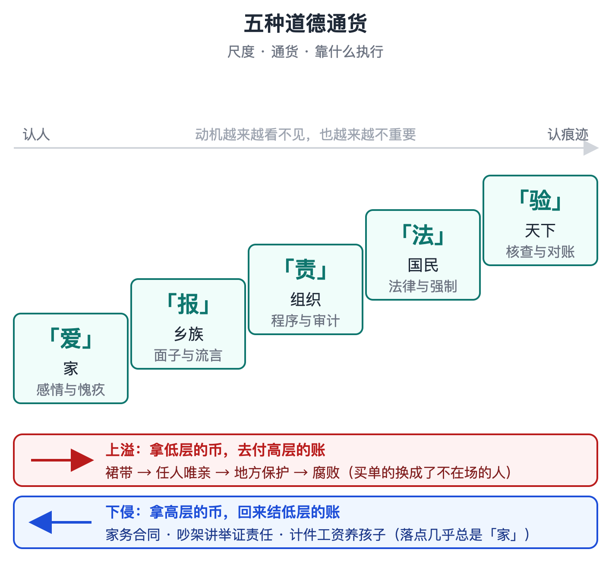
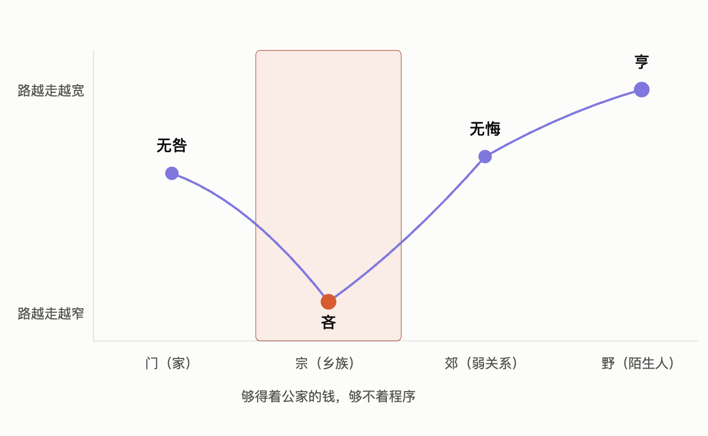
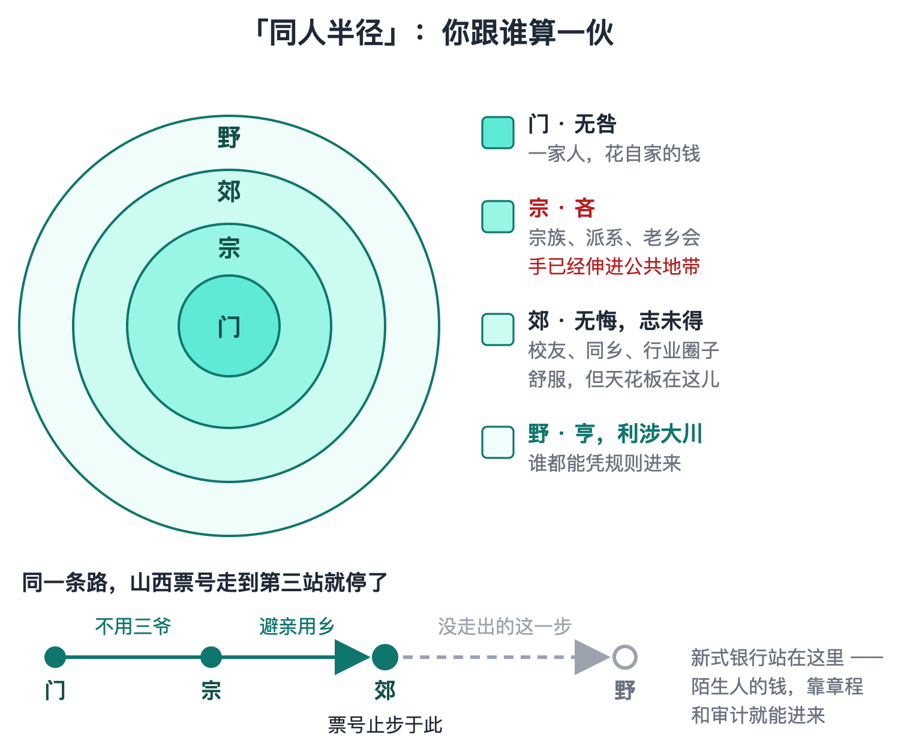
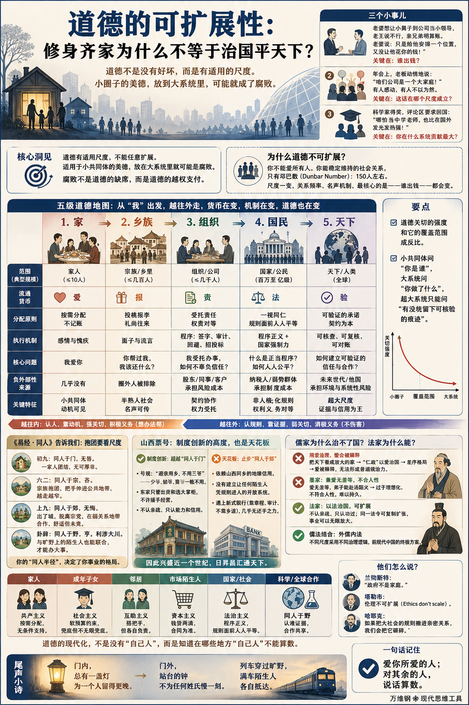

# 道德的可扩展性：修身齐家为什么不等于治国平天下？

[道德的可扩展性：修身齐家为什么不等于治国平天下？ ](https://www.dedao.cn/course/article?id=06eGYrQb1gzVxoLvPbKPl73kZRqOaB)

2026-08-03 06:59

这一讲咱们搞个大项目。我先给你说三个小事儿 ——

第一，老王跟人合伙开了一家公司，效益不错，他老婆就想让他把小舅子安排到公司当个小领导。老王说不行，亲兄弟明算账。老婆说，是亲兄弟明算账啊，你只是给他安排一个位置而已，又没让他花你的钱！

第二，年会上，老板动情地说， 台下有人感动，也有人不以为然。

第三，中国数学家王虹、邓煜得了菲尔兹奖，新闻评论区有人要求他们回国，说哪怕在中国当个中学老师，培养一批年轻人，也比在国外给人家发光发热强！

你先别站队，我要说的是这里没有坏人。没有人认为人就该自私自利，或者我就是要作恶你又能如何。恰恰相反，所有人都理直气壮地、真诚地相信自己是出于道德和公义发表看法。

他们真正的分歧其实不是道德水平，而是道德尺度。

道德有适用尺度，不能任意扩展。适用于小共同体的美德，放在大系统里就可能是腐败。

这一讲的思维工具是「 道德的可扩展性 （moral scalability）」。这个道理一旦点破，你会发现它无处不在 —— 它既能解开中国历史的一桩大公案，也能告诉你为什么不能把家当公司运营。

✵

我们多次讲过「可扩展」，也叫「可缩放」，意思是你把尺度扩大多少倍，它的有效性还在。而道德是不可扩展的。

最根本的原因是：你不能爱所有人。你能稳定维持的社会关系，只有邓巴数，也就是 150 人那么多。

自家人吃饭不限量，给孩子交学费不记账，老人看病花钱没有限额。你说什么亲情、什么基因都有道理，但更根本的道理是家里只有这么几个人。

放大到大家庭，妯娌之间就会讲个礼尚往来；再放大到乡里乡亲，人情就得记账了 —— 谁家办事你随了多少礼，人家心里清清楚楚。再往外，到了陌生人社会，连人情账都不行，只能靠合同、发票和法律。

尺度一变，几个关键变量就会跟着变。在村里，你跟每个人都低头不见抬头见，一辈子重复打交道，谁也不敢轻易坑谁，你的名声人人可读。到了大城市，你跟大多数人一辈子只打一次交道，名声就得靠征信报告和平台评分这种人造装置来维持。

但最核心的一个变量是：谁出钱。

你请兄弟吃饭，花自己的钱，这是义气；用公司的招待费报销，那就属于舞弊了。你把公司的岗位安排给兄弟，就是任人唯亲；你把国家的项目批给老乡，那叫腐败。

你对兄弟的感情没变，你不管官儿多大一直都讲义气 —— 变的是账单落在谁头上。尺度一大，你那个义气就产生了越来越大的「负外部性」，买单的是别人，是落选的应聘者、是公司的股东、是全体纳税人。

你怎么不跟那些人讲讲义气呢？他们可没做任何对不起你的事。他们只是不认识你，不在场，他们没有发言权。

很多贪官在自己的圈子里都是公认的好人 —— 好儿子，好兄弟，重感情的大哥。他们不是不讲道德，他们是太讲道德了，只不过讲的是村里的道德。

你对你兄弟的爱超过了对陌生人的爱，如果碰巧你掌权，这对陌生人就特别不公平。所以下次别问该不该照顾自己人，你应该问的是谁出钱。

腐败不是道德的缺席，是道德的越权支付。

✵

美国人类学家艾伦·菲斯克（Alan P. Fiske）在 1992 年提出了一个「关系模型理论（relational models theory）」。他把人类关系概括为四种基本模式：共同分享、权威排序、对等匹配和市场定价。2011 年，菲斯克和心理学家泰格·拉伊（Tage Shakti Rai）又把这套理论推进到道德领域， 同一种行为，放进不同关系里，就可能从正当变成越界。关系一变，判断什么算公平、什么算失职、什么算越界的标准，也跟着变。

咱们借助菲斯克这个洞见，重新搞一个五级阶梯的道德地图 ——

从你自己出发，往外走，大致有五个台阶：家、乡族、组织、国民、天下。每上一个台阶，道德的“流通货币”就得兑换一次。

家的币种是「 爱 」。按需分配，不记账，不问值不值。它的执行机制是感情和愧疚 —— 要是家人有事你没给办成，不用外界干预，你自己跟自己就说不过去。

乡族的币种是「 报 」。投桃报李，礼尚往来，人情要还。它的执行机制是面子和流言：熟人社会不需要诉讼，“这人不地道”五个字就是判决书。

组织的币种是「 责 」。你在公司里掌握的每一分权力都不是你的，是股东、同事和客户暂时托付给你的，这叫受托责任。它的执行机制是程序：签字、审计、回避、招投标。

国民的币种是「 法 」。一个亿级人口的社会，谁也不认识谁，唯一能通行的是非人格化的规则：法律面前，不问你是谁，只问你做了什么。它的执行机制是程序正义和国家强制力。

天下的币种是「 验 」—— 可验证的验。虽然有国际法庭，可是当今世界并没有什么真正有效的办法能强制执行判决。但国与国之间也不完全是丛林法则，这里还有一样东西可以流通，那就是可验证的承诺 —— 合同可核查，数据可复核，说过的话可以对账。这就是为什么世界上的大国虽然看似可以为所欲为、偶尔也真不靠谱，但是一般办事还是基本靠谱的。这也是为什么有些落后国家自然条件再好，人家也不去投资。

你看到这个趋势没有？越往外走，道德就越少认人，越多认证据。

小共同体问“你是谁”，大系统问“你做了什么”，超大系统只能问“有没有留下可核验的痕迹” —— 尺度越大，动机越不可观测，也越不重要。所以我们对家人总是有很好的动机，主动爱、主动管，这叫「积极义务」；对陌生人，我们则更多的是「消极义务」：不欺骗、不加害、遵守合约就好。

要点是：道德关切的强度和它的覆盖范围成反比。

亚当·斯密在《道德情操论》里做过一个著名的思想实验：一个欧洲人听说遥远的中国被地震吞没，上亿人死亡，定然要慨叹一番，但仍会照常生活；可如果明天要失去自己的一根小手指，他今夜就睡不着 [3]。

斯密绝不相信有人会为了保住小手指而宁愿牺牲上亿人的生命 —— 我们会坚持正义，但是我们的爱的确会被范围稀释。

之所以要更换币种，就是因为“爱”在大尺度指望不上。对陌生人，你欠的不是爱，是规则；对外国人，你欠的不是感情，是信用。

✵

咱们看一种特别的道德关系：抱团。

老百姓认为抱团总是好的，我们就是要团结起来一致对外。但中国的智者早在三千年前就已经知道，抱团不总是好的，它得分尺度。

这个智慧出自《易经》第十三卦，「同人」卦。《易经》是一本占卜之书，但是其中也总结了很多事物的规律。同人这一卦，讲了一个关于规模的故事。

“同人”，就是与人结伙、与人联合。这个卦把人从近到远分为门、宗、郊、野，四个圈 —— 跟咱们那个五级台阶就差一层“组织” —— 它看你“同”到哪一圈。

先看爻辞 ——

初九：“同人于门，无咎。”一家人关起门来讲团结，没毛病。

六二：“同人于宗，吝。”同的是宗族、宗党，圈子大了，评价反而变差了。

家门之内的团结无咎，宗党的团结就“吝”，为啥呢？

还是看谁出钱。一家人抱团，花自家的钱，当然无咎，你说一句“家和万事兴”都可以。可是一个宗族的人抱团结党，那可就不一样了，因为必然会把手伸进公共地带：族里人抱团去争村里的水，同乡抱团去占衙门的缺 —— 你们是团结了，你让别人怎么办？

注意“吝”不是凶。它不是立即的灾祸，但是是一条越走越窄的路。任人唯亲不会立即让系统崩溃，但是你既然只认自己人，不认外人，你就失去了进一步发展壮大的可能性。

九三、九四、九五可以快进：从“伏戎于莽”的暗中结党，到“乘其墉，弗克攻”的冲突受阻，再到“先号咷而后笑”的重新相聚，写的都是从宗党走向更大联合所必经的猜疑、冲突与和解。

上九：“同人于郊，无悔。”《象传》又补一句：“志未得也。”出了城，到了郊，脱离了宗党，可还没走到旷野 —— 无悔，但是志向未竟。

这个意象大约相当于你已经走到了宗党之外的弱关系地带：同乡、朋友的朋友、校友、行业圈子里的人。大家会有一种莫名的亲切感和信任感。也许你找工作人家可以帮你内推一下，但远远谈不上结党营私。所以这不是坏事，你觉得挺舒服，但这个格局还不够高。

真正的高境界是这一卦的卦辞：“同人于野，亨。利涉大川。”野是旷野，出了城、出了郊、没有熟人的地方。跟旷野上的陌生人都能结成一伙，这才是亨通！可以渡大河、办大事。

你看，一家人抱团无可厚非，宗党抱团却是不好的，能与陌生人联合起来才能办大事 —— 你的「同人半径」，决定了你事业的格局。

咱们看一个例子，山西票号。

清代山西票号有一条著名的号规，叫“避亲用乡，不用三爷” —— 少爷、姑爷、舅爷，一概不用；东家只管出资和选大掌柜，不许插手经营。咱们以同人的精神来看，“不用三爷”，这就超越了“同人于门”；“避亲用乡”，更是进一步超越了“同人于宗”，高明吧？这在当时是了不起的制度创新。

山西票号因此兴盛了将近一个世纪，日昇昌的汇票更是号称“汇通天下”。

但是票号只把同人半径推到了山西同乡：这已经是“同人于郊” —— 摆脱了血缘，却仍然依赖地缘和熟人信用。票号的成就和它的天花板都在这里。

它始终没有走到“同人于野”，没有建立一套让任何陌生人都能凭规则进入、凭制度合作的开放系统。

结果到了二十世纪，票号遇上新式银行 —— 一种可以吸纳任何陌生人的资本、靠章程和审计而不是靠乡谊运转的组织 —— 几乎没有还手之力。

✵

有了道德的可扩展性这个坐标，中国思想史上的一桩大公案就看清楚了：为什么儒家治不了国。

孔子那么高明，孟子那么能言善辩，还周游列国去输出自己的主张，为什么天下却偏偏没人用他们呢？

儒家的治理方案是把天下想象成一个放大的家，用「仁政」，其实也就是用爱统治。孟子说：“老吾老，以及人之老；幼吾幼，以及人之幼。”把家里的爱一圈一圈往外推，推到四海，天下就太平了。

可是爱会被圈子的半径稀释啊。用费孝通《乡土中国》中的话说，传统中国社会的结构是「差序格局」：每个人都以自己为中心，像石子投进水里，关系一圈一圈推出去，愈推愈远，也愈推愈薄。儒家非常清楚“爱有差等”，但儒家执着地相信稀释了的爱也有统治力。

孟子甚至认为稀释了的爱足以让天下人主动归附。他曾经拿商汤的故事劝齐宣王：“东面而征，西夷怨；南面而征，北狄怨” —— 你只要施行仁政，你往东打，西边的人反而抱怨为什么不先来救我们；往南打，北边的人就等不及。

在儒家的想象里，“修身、齐家、治国、平天下”是一条连续的扩展链：一个人先把自己变善，再把同一种善推到一家、一国，最后推到天下。

可是孟子这个统一方案完全不可行。根本没有哪个小国因为听说你这儿实行了仁政，就来主动依附，反而是各国一个个都要富国强兵、大打出手。

历史一再证明，你真要用这套方法治国，你得到的只会是假仁假义。

比如汉朝搞“举孝廉”，把“孝” —— 原本是家里的道德 —— 当成干部选拔指标。结果就成了“举秀才，不知书；察孝廉，父别居” —— 讲道德的察举迅速腐败，远远不如后来不讲道德的科举公平。

再往大了说，周朝分封也好，汉初分封同姓王也好 —— 把天下按血缘切给叔伯兄弟，指望亲情护住江山 —— 不也是几代之后血缘稀释，打成一锅粥吗？爱不但不可扩展，而且半衰期很短。

墨家看出了这个问题，但墨家的解决方案是不让爱稀释，主张「兼爱」：“视人之国若视其国，视人之家若视其家” —— 爱无差等。这几乎是一种宗教精神。墨家领袖一声令下，弟子真能赴汤蹈火。

但是如你所能想象，这也是不可持久的，因为它不符合人性。孟子骂墨子“无父”，跟两千多年后曾国藩骂太平天国“凡民之父，皆兄弟也；凡民之母，皆姊妹也”其实用的是同一条罪名。

先秦诸子里真正拿到可扩展性的，是法家。你别看法家拿老百姓当工具，但法家赏罚分明，它不认亲疏，只认功过；同一套法令可以从一个县复制到一百个县，所以事业可以无限放大，这才是为什么最终是法家统一了天下。

但法家把什么东西都搞成绩效管理，也不符合中国国情。像商鞅变法规定，成年兄弟不分家的，赋税翻倍，硬把大家庭拆成小户；又搞什伍连坐，鼓励邻里亲人互相告发。家不再是讲爱的地方，成了治安单元，老百姓也受不了。

前现代中国找到的终极解决方案是儒家和法家结合，在不同尺度采用不同的治理逻辑，叫「外儒内法」……

✵

儒法那一套还适不适合现代社会，那是另一个故事。 但这个智慧是：我们应该在不同的尺度上践行不同的道德。

英国作家约翰·兰彻斯特（John Lanchester）说，如果宏观经济学全部消失，只能给后人留下一句话，那句话也许是：“政府不是家庭”（“Governments are not households.”）。勤俭节约是家庭的道德，政府算的是整个系统的账，有时候反而就该多支出。

塔勒布在 2018 年的《非对称风险》（ *Skin in the Game* ）里也专门讲过这个问题。他的判断可以概括为「伦理不可扩展」（Ethics don’t scale）：伦理从根本上是地方性的，不能拿一套规则通吃所有尺度。他把这种拿一套政治立场从家庭一路通吃到国家的做法，称为「无尺度的政治普遍主义」（scale-free political universalism），说这很荒谬。书中还引了格雷厄姆兄弟（Geoff and Vince Graham）的一句话：“在联邦层面，我是自由至上主义者；在州层面，我是共和党人；在地方层面，我是民主党人；在家人和朋友中间，我是社会主义者。”

哈耶克（F. A. Hayek）说，我们同时生活在两个世界里：小圈子讲团结和利他，大社会讲抽象规则。他还说：如果把大社会的规则搬进亲密关系，我们会把它碾碎。

你看，这些人不是说你这么做就道德、那么做就不道德 —— 他们说的是你得先看这个事儿是什么尺度上的事儿。

比如说，你不能把公司当家一样运营，但你也不能把家当公司一样运营。

现在有的人真的把婚姻当公司运营：家务签合同，开支 AA 记账，吵架讲举证责任，年底互相述职。我理解他们是想用规则保护感情，可是这跟贪官犯的是同一种错误：道德错配。还有的家长让小孩做家务写作业都实行计件工资制，那更是大错特错。人需要亲情，需要有个可以不算计的空间……老百姓说“家不是讲理的地方”，这个话是对的。

✵

你完全可以对父母、配偶和未成年子女实行“共产主义”，按需分配；

对成年子女则实行“社会主义”，可以给「软预算约束」，但不能软到让他把你的兜底预先算进自己的预算；

对邻居则实行“互助主义”：谁家水管爆了、老人摔倒了，大家搭把手，但谁也不用把工资卡交给业委会；

对市场上的陌生人则实行“资本主义”：钱货两清，合同为准，别因为直播间喊你一声“家人”就忘了看退货条款；

到了国家这一层，则要求程序和法治。你不需要官员像父母一样疼你，但你有权要求权力按规矩办事。

✵

有人说：“我是世界公民，我不爱任何国家，我只爱人类。”我看这个话不成立。你不可能像爱家人一样爱全人类，你也不是生活在“人类”这个尺度上 —— 你的悲欢、你的城市、你的养老金，都是具体的。

但我也反对打着爱国的旗号要求科学家必须回国。科学这个事业是人类规模最大的一场“同人于野”：各国各自掏钱养科研，理论不问国籍，同行评议只认证据，科研的结果全世界共享。这不是一个以国家为单位的项目，你最好出现在效率最高的地方。

任何一个尺度上的道德，无论大小，都不能通吃所有尺度。

一个人真正现代化，不是他没有“自己人”，而是他知道自己人在哪些地方不能算数。爱你所爱的人；对其余的人，说话算数。

**【尾声小诗】**

> 门内，  
> 总有一盏灯  
> 为一个人留得更晚。  
> 门外，  
> 站台的钟不为任何姓氏慢一刻。  
> 列车穿过旷野，  
> 满车陌生人  
> 各自抵达。

