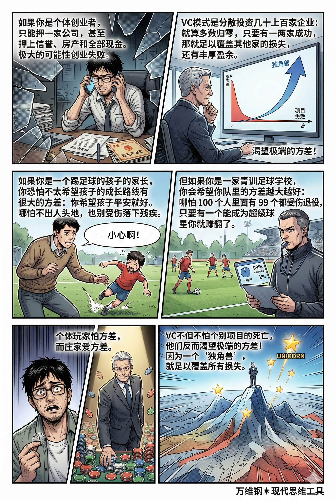

# 非遍历性：玩家怕方差，庄家爱方差（得到课程讲稿 + AI 加工段）

# 非遍历性：玩家怕方差，庄家爱方差

[非遍历性：玩家怕方差，庄家爱方差](https://www.dedao.cn/course/article?id=y7GQpR6ndOgX6kYA2jK8eBvPzMN4lw)

我们已经讲过很多关于复利的原理和方法，这一讲咱们说一个反鸡汤：积累复利不是你懂道理就行。

我曾经拥有过 16 个比特币。那是在 2013 年买的，我记得当时是 700 多美元一个。如果我能拿到 2025 年，单价超过了 10 万美元，那可就是 160 万美元……

但正如你能想到，我没拿住。我拿了可能不到一个月，它不但没涨反而跌了一点点，我就直接给卖了。我选择了更刺激的游戏，拿那笔钱去买了股票期权，结果又失败，最后直接清零了。

我跟好几个人说过这番经历，并没有人笑话我。因为大家都有同感：没有人能拿住。

2015 年底，比特币大约才 300 美元。如果你那时候买下，拿到今天的确是一笔巨款。但你经历的是什么呢？

\- 2017 年底，比特币就已经到了 19,000 美元。你能面对 60 倍的收益不卖吗？

\- 2018 年底，比特币暴跌到 3,200 美元。如果你前一年真没卖，这时候能不后悔吗？

\- 2021 年底，价格达到 69,000 美元。如果你曾经为没卖而后悔，现在又是什么滋味呢？

\- 2022 年底，价格又跌回到了 15,000 多美元……然后就这样涨涨跌跌：2025 年 10 万美元、2026 年又跌回到 6 万多美元……

只有两种人能拿住这么长时间：一种是被关进监狱没有办法交易的人，另一种是自己钱太多、根本用不上那笔钱所以毫不在意的人。

这一讲说的思维工具叫「 非遍历性 （non‑ergodicity）」。它告诉你为什么后一种人最适合做投资 —— 以及适合应对其他乘法风险 —— 以及如果你不是那种人，你该怎么办。

很多炒股高手的年化收益率都超过 15%，但是世界上没有任何一个基金敢向你承诺每年至少 15% 的收益率。长期看也许涨了这么多，但中间的过程是有时候涨、有时候跌。用概率论的语言说，收益率有很大的「方差」。

阻碍你积累复利的因素只有两个：一个是最初的本钱，一个是方差。

要理解这一点，咱们做一个思想游戏。

这是一个简单的掷硬币赌局，硬币正反面的概率都是50%，游戏要求玩 100 把：每一把如果掷出正面，你的总财富就增加50%；如果是反面，你的总财富就减少40%。请问你要不要玩？

简单的概率论告诉你每一把的数学期望是 0.5 × (+50%) + 0.5 × (-40%) = +5%。这是一个正的收益，谁能说不玩呢？

好，现在你带着100万进场了。我们假设你的运气不好也不坏，正好有一半时候掷出正面，一半反面：

第一次，正面，你的钱变成了 100 × 1.5 = 150万。

第二次，反面，你的钱变成了 150 × 0.6 = 90万。

第三次，又是正面，90 × 1.5 = 135万。

第四次，反面，135 × 0.6 = 81万。

……你一看不对啊！每次经历一正一反，你的财富就变成了原来的 1.5 × 0.6 = 0.9 倍，也就是缩水了10%！这样连玩100次，你的100万本金会变成不到1万块。你破产了。

可你仔细想，还是不对！这明明是一个每次期望值都是 +5% 的游戏，按理说赌场也是输钱的，那到底谁赢钱了呢？

答案是那些运气特别好的人。

想象有10万人同时玩这个游戏，第一把之后，有5万人的财富变成了150万，有5万人变成了60万。这10万人的总财富确实增加了5% —— 这个 +5% 的期望值，是这10万人的「 集合平均 (ensemble average)」，有时候翻译成「系综平均」。很多轮下来，10万人中会有一些运气特别好的人，赢了很多次、输了很少次。这些人将拥有天量的财富，所以集合平均总是在增长。

但不幸的是，作为一个运气一般的普通人，你的财富却是不涨反降。这是因为个体所经历的是「 时间平均 (time average)」。从数学上来讲，你的成长系数是涨跌次数的几何平均值。也就是 1.5 × 0.6，再开根号 —— 很遗憾这个数小于 1。

**作为个体，你在这个乘法游戏中沿着时间线一步一步往下走，只要偶尔出现几次连续的亏损，你的本金就会遭到毁灭性打击，可能账户直接就清零退出游戏了……这叫遭遇「吸收壁（absorbing barrier）」。**

你的作用是给「集合平均」增加了一个分母，而分子上的贡献是由那些运气特别好的人提供的。

简单说， 如果一个系统的集合平均等于个体的时间平均，我们就说这个系统具备「遍历性（ergodicity）」；而如果整体的期望值不能代表个体的长期命运，那就是「非遍历性（non-ergodic）」系统。

比如你每天上班的路上有时候会遭遇大堵车，有时候却是一路绿灯，但只要经历的次数多，你的经历跟其他人的经历都差不多，这就是「遍历性」系统。这个城市的平均通勤时间对你是个很有意义的数字。

而对于像投资那样的非遍历性系统，平均值可就意义不大了 —— 你没必要跟马斯克一起算平均财富。

遍历性这个概念在统计学上早就不新了，但是在经济学上的应用却绝非常识。就在 2016 年，伦敦数学实验室的物理学家奥勒·彼得斯（Ole Peters）还专门提出，**传统经济学常常未经证明就默认人类经济活动是遍历的，使得很多人可能过分乐观，盲目上场，殊不知一个期望值为正的游戏里，却有很多单一玩家必然走向破产。**

纳西姆·塔勒布（Nassim Taleb）也专门在《非对称风险》（ *Skin in the Game: Hidden Asymmetries in Daily Life* ）一书中，对非遍历性风险提出过警告。简单说，数学期望值是上帝视角的平均；时间平均才是凡人视角的命运。

可能这些警告听起来有点抽象，我跟你说个现实的事儿。无论哪个国家的股市里，绝大多数散户的长期收益，都跑不过大盘指数。不仅个体跑不赢大盘，就连很多华尔街的专业投资基金，都很难打败标准普尔指数。

有些股评家会说这是因为散户不懂技术分析、不懂价值投资、心态不好云云 —— 但真正的机制是数学：股市是一个典型的非遍历系统。大盘指数，比如标普500，是个集合，它享受所有重要股票的集合平均，而且它还有一个定期剔除垃圾股、纳入优质股的机制。而散户手里只有那么几只股票，你经历的是时间平均。

这是一个相当反直觉的现象，但它与前面那个掷硬币实验是一个道理。

那作为个体，我们怎么应对非遍历性风险呢？咱们说四个策略。

**第一，减少交易次数**

这就是那个监狱里的比特币持有者的策略。如果你真有信心，要想锁定长期收益，你就得把它拿住别动。

加州大学的金融学家布拉德·巴伯（Brad Barber）和特兰斯·奥迪恩（Terrance Odean）分析了六万多个散户账户，发现交易越频繁的散户，收益率越低。而那些买入之后就因为各种原因（比如忘了密码）再也没看过账户的人，反而平均收益最好。

这背后有心理上的因素：频繁交易的人特别容易因为情绪波动而追涨杀跌。这里还有股市涨落自身特点的原因：大部分股票的长期收益，其实是由极其稀少的几个暴涨日贡献的，要想锁定那几天的收益，你就得一直拿着……

但在最根本上，这还是因为股市的非遍历性。你每多交易一次，就是多投掷了一次硬币：你交易的次数越多，你的结局就越接近于时间平均，你就是在增加撞向吸收壁的概率；还不如交易次数少，没准儿真蒙对了。

江湖险恶，本钱小没有资格乱折腾。看准了就赌定，用时间磨平剧烈的方差，是穷人的生存智慧 —— 这大约就是长期主义的数学原理，也是「忠诚」作为一种美德的适用范围。

**第二，塔勒布著名的「杠铃策略（barbell strategy）」** 

也就是把 90% 的资产放在风险极低的领域，比如现金、国债和无杠杆的不动产；把 10% 放在激进的高风险领域捕捉重尾红利。

杠铃策略主张忽略那些中等风险的项目，只要两端：要么低风险，要么高风险。它的好处是既保留了暴富的可能性又确保永远不触碰吸收壁。

你可能问，这个策略的科学性在哪里？其实杠铃策略就是我们上一讲说的「凯利公式」的一种变体。

前面说的那个掷硬币思想实验，最大的问题就是每一次你都 all-in。杠铃策略要求你每次只下注一个微小的比例，凯利公式也恰恰是反对 all-in。咱们不妨算一算：这个游戏中概率 p = 0.5，赔率 b = 50 / 40 = 1.25，套入凯利公式，最佳下注比例是 f\* = 10% —— 完全符合杠铃策略。

你猜怎么着？2011 年，前面提到的那个奥勒·彼得斯在理论上证明，如果你每一把都采用凯利公式下注，你就可以打败非遍历性！

听着挺简单，那可是学术界的一件大事。但咱们直观理解，其实杠铃策略和凯利公式的数学作用，都是把交易的方差缩小。只要你下注比例小、不 all-in，就有类似的效果。比如你可以每个月从工资里拿出固定的一小笔钱来投入股市，塔勒布和凯利都不会反对。

**第三，成为庄家**

既然大多数散户都跑不赢大盘指数，那你为什么不做大盘指数呢？你为什么不享受集合平均呢？

当然自己布局的前提是你很有钱。咱们想想风险投资人（VC）和创业者的关系。

创业公司是个高度非遍历性的领域。如果你是个个体创业者，只能押一家公司，甚至押上信誉、房产和全部现金，而你会有极大的可能性创业失败。但 VC 的模式是分散投资几十上百家企业：就算多数归零，只要有一两家成功乃至于成为“独角兽”，那就足以覆盖其他家的损失，还有丰厚盈余。

VC 不但不怕个别项目的死亡，他们反而渴望极端的方差！他们希望你冒险。平庸的公司对 VC 毫无意义。

这就如同你是一个踢足球的孩子的家长，你恐怕不太希望孩子的成长路线有很大的方差：你希望孩子平安就好。哪怕不出人头地，也别受伤落下残疾。但如果你是一家青训足球学校，你会希望你队里的方差越大越好：哪怕 100 个人里面有 99 个都受伤退役，只要有一个能成为超级球星你就赚翻了。

个体玩家怕方差，而庄家爱方差。

这是巨大的不对称性。不过作为普通人，你可以用定投指数基金的方法选择跟庄家站在一起。

**第四，「风险共担（Risk Pooling）」** 

既然个体从非遍历性中吃亏，而庄家能从非遍历性中受益，那我们为什么不把个体联合起来，成立一个集体的庄家呢？

这其实就是保险。对于保险公司来说，你房屋着火的数学期望肯定比它收的保费要少，所以保险生意是赚钱的。那你为什么还是买保险？根本原因就在于：房屋着火这种事对你个人来说，是一个 all-in 的风险。

重大灾难是非遍历性的，这就是保险公司存在的合理性。

其实风险投资也可以理解成一种保险。创业者大胆地去做生意，赔钱赔的也是 VC 的钱，相当于庄家在为你兜底。

这也正是「有限责任公司」这种制度的伟大之处！生意人大胆去闯，赢了大家分钱；输了，你只要承担有限责任就行，不用牵连家人不必倾家荡产，更不至于去当奴隶……

再往深了说，人类社会中的**家庭、宗族、各种互助网络**都可以理解为用合作把世界“强行遍历化”。

乘法世界中充满了非遍历性风险，它对个体很不利但是对庄家很有利，于是个体就必须少投入、少操作、尽量控制方差，最好能联合起来用结构对抗命运，用规模换稳定。

最后请允许我吐槽一句。因为非遍历性风险的高度不对称性，成熟的社会都是尽量保护个体，让机构去承担风险。

比如在有些国家，你买房，是等房子先盖好、你住进去之后才开始还贷款。如果在还贷期间房价暴跌，而你因为失业之类的原因实在还不起了，你还可以申请个人破产，直接走人，获得一个重新开始的机会。

可是有的地方，却是保护银行和开发商，把风险下移给老百姓：房子还没盖好你就得开始还贷，万一房子烂尾了你还得继续还贷；而且不管未来发生什么，这笔债永远跟着你……我知道的现代思维工具里可没有主张这么干的。

---

## 非遍历性：为什么"懂道理"还是会破产

复利对有钱人有利，对穷人危险；方差对庄家是机会，对散户是绞索。普通人的理性策略不是"更努力地玩"，而是**少动、分散、联合，尽量用结构换命运**。

### 核心洞见：期望值是上帝视角，时间平均才是你的命运

这篇文章最深刻的地方，是揭示了一个数学上的残酷真相：**一个对集体有利的游戏，可以同时对每个个体有害。**

掷硬币那个例子值得细品。期望值 +5%，听起来是好游戏。但普通人参与的不是"集体的平均结果"，而是沿时间线一步一步走的"个人序列"。一旦遭遇连续亏损，本金被侵蚀，复利就反过来吃人——而这个过程不可逆。

这就是为什么无数人"知道道理"却还是亏损的根本原因：**不是认知不够，是数学结构决定了大多数人必然输。**

---

这个看似“正期望必赚”的赌局，最终却必然破产，核心矛盾只有一句话：**你算的是「单次算术期望」，但真实长期玩的是「复利几何收益」，二者完全不是一回事。**

#### 真相：涨跌幅不对称，一正一反必缩水

- 正面：财富 ×1.5（涨50%）
- 反面：财富 ×0.6（跌40%）

**先涨50%再跌40% = 先跌40%再涨50% = 1.5×0.6 = 0.9**

不管顺序如何，**每经历一次“一正一反”，本金直接缩水10%**。

更直白的算账：100万 → 跌40%剩60万 → 再涨50%是90万

涨50%的幅度，完全填不满跌40%的坑。

100局正好50正50反，就是**50组“一正一反”**：最终财富 = 100万 × 0.9⁵⁰ ≈ **5154元**

这就是你破产的直接原因。

**数学期望为正会骗人**

你算的期望：0.5×(+50%) + 0.5×(-40%) = **+5%**

这个期望本身没错，但它是**算术平均期望**，只适用于两种场景：

1. **只玩一把**，不重复；
2. **每次用极小比例的钱下注**，不影响本金基数。

但你做的是：**每次全押、连续复利、乘性增长**。

复利世界里，决定长期生死的不是**算术平均**，而是**几何平均**。

**几何平均才是长期真实收益率**

50%概率乘1.5，50%概率乘0.6，每轮几何平均收益 = √(1.5×0.6) = √0.9 ≈ **0.9487**

也就是**每轮亏约5.13%**。

只要长期重复，结果一定向几何平均收敛，而不是算术期望。

#### 群体平均 ≠ 个人时间平均（遍历性问题）

这是经济学和概率论里的经典坑：**ensemble average（群体平均）≠ time average（时间平均）**

- **群体视角（期望成立）**：找100万人各玩100局，最后所有人的平均财富，确实是按+5%期望增长的，因为会有极少数人连续开出极多正面，变成超级富豪，拉高整体均值。
- **个人视角（你必死）**：你一个人连续玩100局，几乎不可能靠运气逆天，只会被**50正50反的最大概率结果**收割，财富一路缩水。

**期望是“一群人平均赚”，不是“你一个人长期赚”。**

#### 用对数效用一看就懂：这个局本质是负和

对财富增长来说，更理性的是看**对数收益**（反映真实财富变化）：0.5×ln1.5 + 0.5×ln0.6 ≈ -0.0527

**对数期望为负**，意味着长期财富必然指数级衰减。

用凯利公式也能算出：这个赌局**最优下注比例为0**，也就是**根本不该玩**。

#### 总结：要不要玩？

1. **只玩1把，小赌怡情**：可以玩，单次期望确实为正；
2. **连续玩、全押玩、多局玩**：**绝对不能玩**，必破产；
3. 核心教训：**正算术期望 ≠ 正复利收益，乘性增长的游戏里，几何平均才是唯一真理。**

这个例子也完美解释了：为什么股市里很多“单次胜率高、盈亏比看似不错”的策略，长期执行下来却大多亏光——本质都是踩了**涨跌幅不对称、复利负几何收益**的坑。

结合“看似正期望、实则必亏”的赌局，我给你一套**能直接用在生活、投资、工作、副业**里的避坑原则，对应这个悖论的现实解法。

### 核心判断：凡是“复利式放大结果”的事，都要警惕

现实里和掷硬币一模一样的陷阱：

- 投资：高波动、高杠杆、满仓梭哈
- 创业：all in 一个项目，成了翻倍，败了归零
- 赌博/合约/炒币：赚时暴赚，亏时腰斩
- 甚至人生选择：孤注一掷、不留退路

它们共同特点：**单次看有正收益，长期复利必被波动吃掉。**

### 一个被忽视的深层逻辑

文章结尾提到的保险、有限责任公司、乃至家族互助网络，本质上都是同一件事：**把个体的非遍历性风险，转化为集体的遍历性风险**。

有限责任制度是人类最伟大的制度发明之一，原因正在于此——它人为地给个体创业者设置了一个"吸收壁保护层"：输了最多赔有限的钱，不至于被一次失败彻底清零，从而可以继续参与这个乘法游戏。

反过来，那些把风险强制下移给个人（比如文末提到的烂尾楼困局）的制度设计，不只是不公平，而是在数学上对社会财富创造有害的——它消灭了普通人重新进入游戏的能力。

### 对普通人最重要的三个启示

#### **1.频繁操作是在和概率作对**

很多人以为"勤劳"是优点，频繁看盘、频繁交易，感觉在"努力管理"。但非遍历性告诉你，每多交易一次，就是多掷一次那枚不对称的硬币，就是多一次撞上"吸收壁"（账户清零）的机会。

巴伯和奥迪恩对六万多个账户的研究证实了这一点：忘了密码、压根没操作的人，平均收益反而最好。

**启示：在没有压倒性优势的情况下，"不动"本身就是一种高水平操作。**

#### **2.你买的不是资产，是角色——而角色决定命运**

文章最精彩的比喻是家长与青训学校。同样关注一个孩子踢球，家长怕受伤（怕方差），学校盼出明星（爱方差）——因为他们承担风险的结构完全不同。

VC投一百家公司，99家归零也无所谓，一家独角兽就赢了。你ALL-IN一家公司，没有纠错机会。

**启示：在参与任何高风险活动之前，先问自己：我是那个"一次性玩家"，还是有多次试错机会的"庄家"？如果是前者，就必须大幅降低单次投入比例。**

#### **3.分散不是"鸡蛋放多个篮子"，而是改变你的数学身份**

普通人理解的分散投资，往往只是"多买几只股票，降低单只暴跌的损失"。但这篇文章揭示的是更深一层的道理：

当你买指数基金，你不再是"时间平均"的受害者，而是享受"集合平均"的受益者——你换了一个数学身份，从玩家变成了庄家。

这也解释了为什么绝大多数主动选股的基金，长期跑不赢指数。不是基金经理不聪明，是游戏规则本来就对单一序列的主动选择不利。

### 避坑法则

#### 1. 永远不要“全押”，用凯利公式管住手

刚才那个赌局，凯利公式算出来**最优下注比例是 0**，也就是一分钱都不该下。

- 任何高风险项目，投入不超过总资产的 **10%～20%**
- 绝不借贷、绝不加杠杆
- 绝不把全部时间、全部人脉、全部积蓄压在一件事上

只要不全押，波动就杀不死你。

#### 2. 别只看“平均收益”，要看“最坏路径”

很多骗局、坑人的项目都只给你看**最好情况**：

- 年化收益 20%
- 成功率 80%
- 只要坚持就能赚

你要反过来问：**如果运气一般，甚至运气中等偏下，我会怎样？**

就像硬币局：

- 期望：+5%
- 中等运气（50正50反）：直接破产

现实里，**中等运气才是你的人生常态**。只看期望不看中位数，就是送财童子。

#### 3. 识别“涨得快、跌得更狠”的不对称收益

硬币局的致命点：**涨 50%，跌 40% → 一正一反亏 10%**

现实里大量这种结构：

- 赚时小赚，亏时大亏
- 成功收益有限，失败代价巨大
- 赢了锦上添花，输了伤筋动骨

判断口诀：

**收益有限、风险无限 → 直接拒绝**

**收益巨大、风险可控 → 可以小试**

#### 4. 复利世界，看“几何平均”，不看“算术平均”

简单判断法：如果一件事是**乘来乘去**（投资、复利、连续决策），别算平均收益，算**连续亏几次会不会死**。

只要连续几次坏结果就能让你出局，哪怕期望再高，也是死亡游戏。

#### 5. 拒绝“遍历性陷阱”：别人的平均≠你的人生

很多人被忽悠：

- “这么多人都赚了，你也可以”
- “长期持有一定赚钱”

真相是：

- 一群人的平均收益很好
- 但单个个体长期走下去，大概率被洗掉

你不是统计样本，你是**一条单行道人生**。

别人暴富的概率，跟你没关系。

#### 6. 保留“重新入场权”，比单次赚多少更重要

硬币局最狠的是：一旦财富缩水，后面再赢也救不回来。

生活里最重要的策略：**永远保留东山再起的本钱。**

- 不裸辞创业
- 不掏空家底投资
- 不把所有技能押在一个行业
- 不把感情人生绑死在一个人身上

只要能一直留在牌桌上，时间站在你这边；一旦出局，再高期望都跟你无关。

**总结**

1. **不all in，不杠杆，不全押**
2. **不只看期望，要看中等运气下的结果**
3. **优先保生存，再谈高收益**
