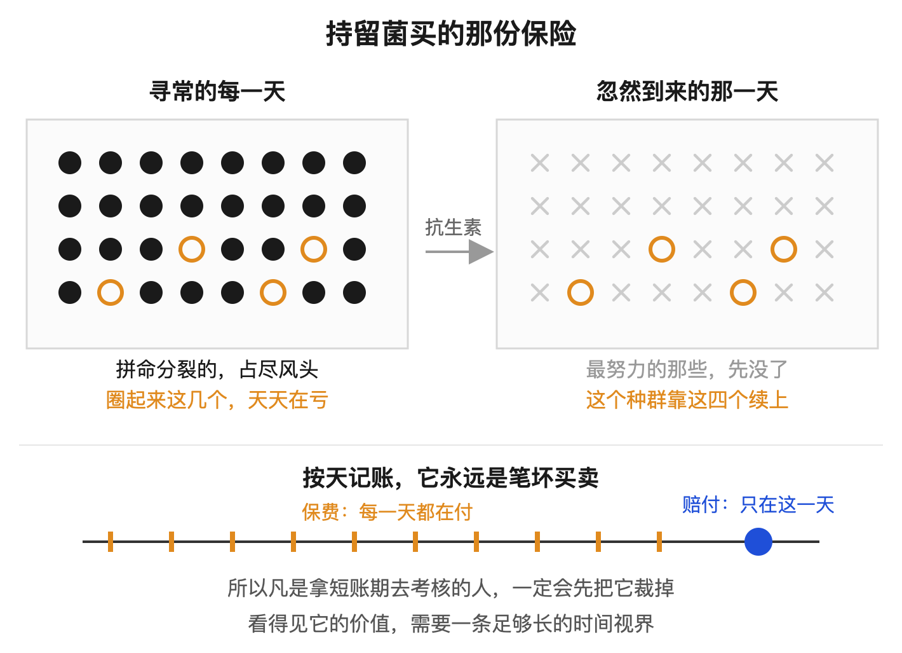
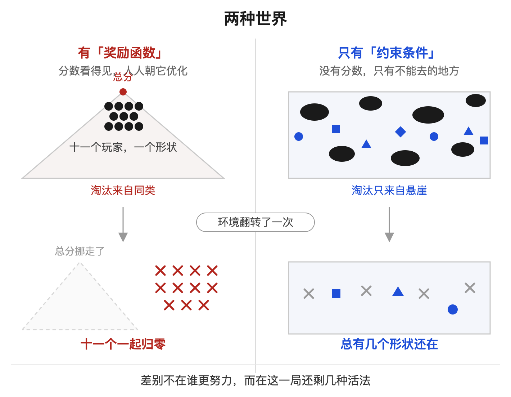
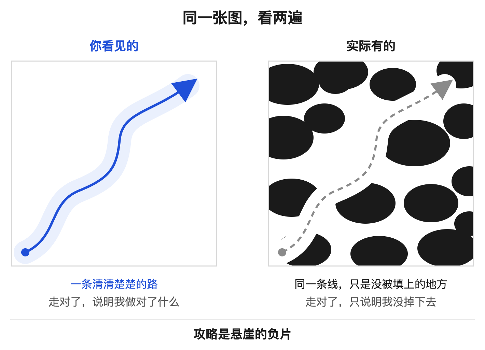
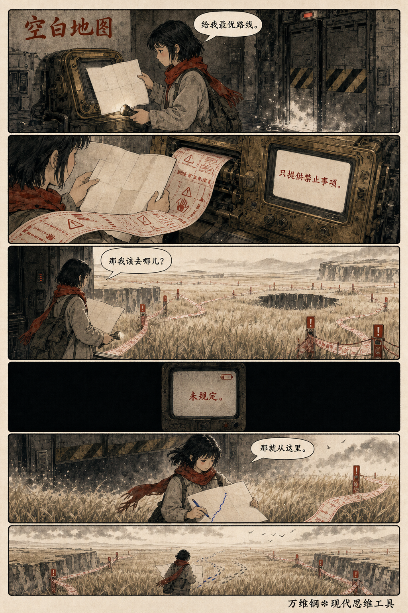
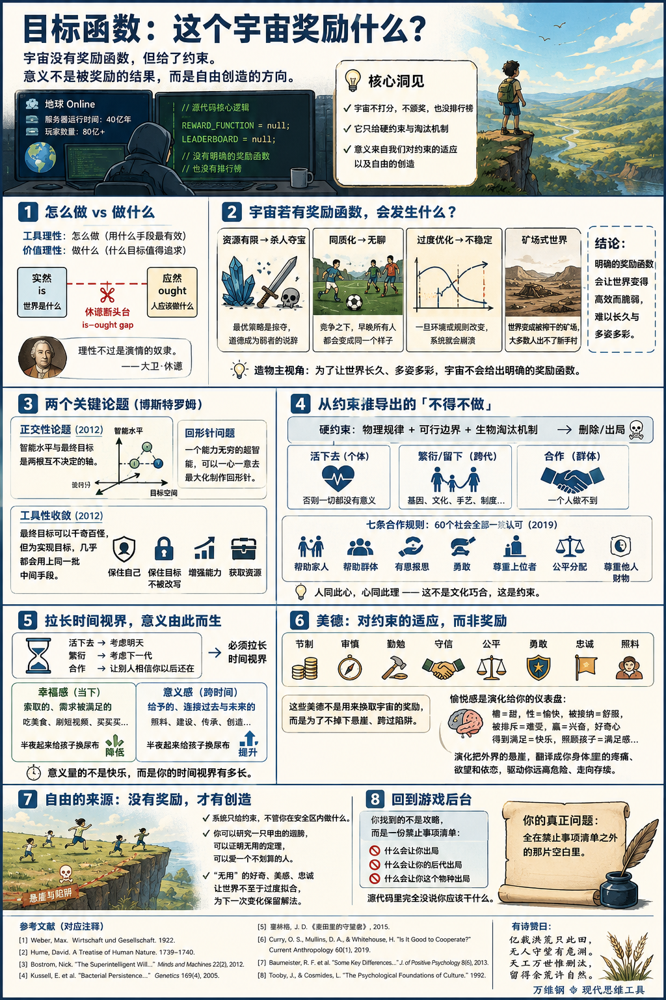

# 目标函数：这个宇宙奖励什么？

[目标函数：这个宇宙奖励什么？ ](https://www.dedao.cn/course/article?id=Age3MrB5aPdV5nYPnkJwD2ky4jvENQ)

2026-07-27 22:45

想象我们生活的这个世界是个大型多人在线游戏，就叫「地球 Online」吧。你玩了几十年一直很努力，可装备还是那么差。倒是有些貌似不怎么样的人混得很好。你心中很不甘。有一天，你终于黑进了这个游戏的后台。你调出了源代码，直奔主题。

你想知道这个游戏到底奖励什么。

是积德行善吗？是把自我利益最大化吗？又或者像修仙小说里那样，其实世俗的一切都不重要，你唯一该做的是抓紧吸收灵力，因为游戏的真实目标是通关，是前往下一个更高级的游戏？

你还想看一眼排行榜。这台服务器已经跑了四十亿年，排在最前面的玩家都是谁呢？我直接模仿他们行不行？

那么我要说的是，你可能要失望了。这个游戏没有明确的「奖励函数」，而且也没有排行榜。

我们不需要黑进后台，也能大致推测出地球 Online 的逻辑，因为我们在地球上设计过自己的游戏。我们写过奖励函数，训练过智能体，运营过社区，设计过考试和 KPI……我们讲过「古德哈特定律」，我们太清楚一个系统一旦挂出评分标准，玩家会变成什么样子了。

地球 Online 有没有奖励函数对我们至关重要，奖励函数决定我们\*应该\*做什么。

世间所有的科学技术知识，包括我们这里讲的大多数思维工具，都是教你\*怎么\*做事 —— 是你已经知道自己想要什么，这些知识教你如何才能得到它。用马克斯·韦伯（Max Weber）的话说，这叫「**工具理性**」，是告诉你用什么手段最有效地达成一个既定目标。

而你要是问什么目标值得追求，那叫「 **价值理性**」 。

那你说价值理性能不能靠工具理性推出来呢？不能。大卫·休谟（David Hume）在 1740 年出版的《人性论》里指出了后来被称为「休谟断头台（Hume’s guillotine）」的推理缺口： **只靠「实然（is）」，推不出「应然（ought）」** （is–ought gap）。

这个断头台斩断的是“世界是什么”与“人应该做什么”之间那条看似自然的推理链：事实只能告诉你各种选择会带来什么后果；可是要推出“应该”，你还必须补进一个价值前提。

比如说，“外面在下雨”只是事实，它并不能推出“你应该带伞” —— 中间还藏着一个价值前提：“你不喜欢淋雨”。

你得先明确自己想要什么，才谈得上动用工具理性去琢磨怎么做才能得到它。用休谟的话说：理性不过是激情的奴隶。

如果我们不知道想要什么，不知道自己该做什么，但是又很善于做事，那我们就跟现在的 AI 差不多了。事实上牛津大学的哲学家尼克·博斯特罗姆（Nick Bostrom）在 2012 年就是有感于 AI 而提出了「正交性论题（orthogonality thesis）」：智能水平和最终目标是两根互相垂直、彼此不决定的轴，任何智力都可以配上任何目标。这也是博斯特罗姆那个著名的「回形针问题」：一个能力无穷的超级智能，完全可以一心一意地按照你的命令，不惜动用整个宇宙的资源，去……比如说最大化地制作回形针。

我们跟 AI 最大的区别，似乎就是，我们得自己找目标。

这个说法会让一些人觉得奇怪，让另一些人感到不安。大多数人每天为生计奔忙，生活中已有的目标都实现不了，哪有时间思考什么价值理性？更何况传统道德和各家宗教都一直在告诉我们什么是对的、应该做什么。

但是你如果仔细想想，“应该做什么”的确是个问题。

这个世界上有的人追求钱，有的人追求名，有的人追求奉献，到底哪个是对的？地球 Online 到底奖励什么？

没有任何证据表明宇宙中存在一个颁奖系统，说谁做对了什么事就给他五个点的奖励积分……而且你也没地方兑奖。

其实我们只要切换到“造物主视角”，就能理解地球 Online 为什么没有奖励函数了。如果你生成了一个世界，你大概希望你的世界能够多姿多彩，能够长久存在，对吧？

注意这不是一个「应然」。这里甚至不需要有造物主。这是一个「实然」：我们观察到的这个宇宙，本来就是已经存在了很久，而且是多姿多彩的。

好，现在我们假设宇宙有奖励函数，那它会是什么样的呢？

如果宇宙真的给人打分，每个人就立即知道自己\*应该\*干什么 —— 我们中国人可太知道这意味着什么了，咱们课程讲过那个局面：「摩洛克」。

想想修仙小说和网络游戏吧。人人追求升级，而支撑升级的资源 —— 灵石、灵脉、天材地宝 —— 是有限的，那么杀人夺宝就是最优策略，“道德”就只能是弱者的说辞。如果活着的全部意义就是攒够分数、离开这个世界、升级去下一个更好的世界，那这个世界就会成为一个被榨干的矿场。

偶尔打打游戏可以，真活在那样的世界里，大多数人出不了新手村。

而且不管你那个奖励函数是什么，你设计的规则有多复杂，竞争之下，早晚所有人都会变成同一个样子，就好像世界杯上各国的打法越来越相似一样。

如果整个世界就是一场世界杯，那可是连观众都没有。那个体感实在太差了。

更可怕的是，那样的世界会非常不稳定。

我们讲「**适应性循环**」的时候说，优化就会导致过拟合，过拟合就会导致不稳定。如果所有人都是一个样，那万一环境变了呢？万一宇宙到时候不得不改变奖励函数呢？这帮人怎么办？

多样性不是为了好看，多样性是最重要的生存策略。

比如我们讲「**凯利公式**」的时候说过，一个细菌种群里，总有极少数细胞 —— 它们的占比正好是凯利公式 —— 会自发地切换到一种长得极慢的「持留态（persister state）」。这种现象叫「细菌持留性（bacterial persistence）」，进入这种状态的细胞叫持留菌（persister cells）。从当下看，这些细胞纯属浪费：分裂极慢，不抢地盘，白白占着资源。可是抗生素一到，快速生长的那些全军覆没，偏偏是这些“不争不抢”的活了下来。

而且这里有个残酷的机制：许多常用抗生素瞄准的，正是细胞壁合成、DNA 复制这类“正在干活”的环节。在这类攻击里，你越努力生长，你越是靶子。

研究者把这种现象称为“保险单”。最优的切换速率主要取决于环境多久变一次，而跟任何一种具体环境的选择压力关系都不大。

简单说，因为你读不到下一道题，所以你必须留一批人去做现在看起来没用的事。

所以如果你是造物主，你怎么敢给这个世界明确的奖励函数呢？那些修仙小说中的世界，绝非繁荣的世界，而只不过是高效而脆弱的绞肉机而已。

你越是了解万事万物的因果关系，就越难以相信宇宙设定了什么明确的奖励函数。

所以很多人认为价值理性纯粹是主观的，每个人想过什么样的生活是他自己的事情……认为人生本没有意义。但这么说也不是完全对。

你说确实没给奖励，但是给了约束。

宇宙给了物理规律、可行边界和生物淘汰机制，这些都是我们说必须尊重的「硬约束」。天地不仁以万物为刍狗，它不颁奖，但是它会清场。

咱们可以借用塞林格《麦田里的守望者》那个意象。宇宙是一大片麦田，我们是成千上万个在里面奔跑玩耍的孩子。我们可以无忧无虑地跑，但是麦田边上有个悬崖 —— 你可不能往悬崖那儿跑。

而且不只是一侧有悬崖，这片麦田上可以说到处都是悬崖和陷阱：你不能自残，不能拒绝进食，不能招惹比你强大的野兽……不管从哪儿掉下去你都有大麻烦，搞不好就被游戏删除了。

因为悬崖和陷阱实在太多太密，能落脚的地方已经很窄……你发现，你只能沿着剩下的一条条狭窄的土地走。

明明是\*只能\*，可是因为剩下的那一条一条狭窄的土地就好像路一样，你感觉你就\*应该\*沿着这些路走。

就这样，一个只会删除的机制，运行了四十亿年之后，从统计上看，它很像一个奖励函数。

这里我们必须再次请出博斯特罗姆。他在正交性论题那篇文章中还提出了第二个论题，叫「**工具性收敛**（instrumental convergence）」，意思是每个人选择的最终目标可以千奇百怪，但是为了实现它们，几乎所有行动者都会用上同一批中间手段 —— 保住自己、保住目标不被改写、增强能力、获取资源。

比如说“保住自己” —— 宇宙并没有要求你必须保住自己。“想活”原本不是谁的应然，你不必把它列在自己的人生目的列表上。

可是博斯特罗姆说，哪怕一个系统压根不在乎自己的死活，它也会为了实现它真正在乎的目标，而工具性地在乎自己的死活。

如果你没有活着，什么健康、资产、声望、关系，就都没有意义。

“想活下去”不是一个奖励，也不是一种价值观，而是一个约束。

而且光你自己活着还不算，你还得繁衍 —— 你繁衍的不一定是基因，也可以是文化，是手艺，是制度，但你总归得给下一代人留下点什么东西。

而这件事一个人干不了，于是你还得合作。

2019 年，牛津大学的三位人类学家把 60 个社会的民族志记录翻了一遍，检验了七条合作规则：帮助家人、帮助自己所属的群体、有恩报恩、勇敢、尊重上位者、公平分配、尊重他人的财物，结果发现这七条在所有社会里的评价一律都是正面的，没有一个社会说它们不好。

人同此心，心同此理。这不是文化上的巧合，这也是约束。

好，现在我们仅仅从避开陷阱和悬崖出发，就推导出你必须活下去、繁衍和合作。还可以继续推导。

你想活下去，那你得考虑明天。你要繁衍，那你得考虑下一代。你要跟人合作，那你得让别人相信你以后还在。

那么你就必须拉长自己的「**时间视界**（time horizon）」。

在个体身上，它表现为延迟满足、复利、手艺的积累、声誉的经营 —— 你之所以肯今天吃亏，是因为你把三年以后的自己算进来了。在组织身上，它表现为一家公司肯不肯做那种五年才见效的投入，还是只盯着这个季度的报表。放到一个文明身上，就是它肯不肯修那种要盖一百多年、开工的人明知道自己看不到落成的建筑……

「意义」就这样出来了。

2013 年，几位美国社会心理学家用问卷调查的方法发现，人们心目中的「幸福」，往往是跟“当下的、索取的、需求被满足的”相关；而「意义」，则跟“跨时间的、给予的、连接过去与未来的”相关。

简单说，**半夜起来给孩子换尿布会拉低你当期的幸福感，却会明显提升你的意义感。**

可能你心里那个叫“意义”的感受器，量的根本不是快乐，而是你的时间视界有多长。

继续往下推，我们会得到另一串更熟悉的词：为了不被眼前的欲望拖下悬崖，你得节制、审慎；为了让积累穿过时间，你得勤勉、耐心、肯负责任；为了让合作经得起一次次占便宜的诱惑，你得守信、公平、互惠；为了让家族和共同体穿过危险，你还得勇敢、忠诚，愿意照料弱者、替后来人承担眼前的成本……

我们把这些东西称为美德。

很多人以为美德是奖励函数，说你照着这些美德去做，就会积累功德和福德，也许将来能得到福报 —— 可我们前面的推导表明，这些只不过是对约束条件的适应而已。

那你说，我行善之后心里确实很舒服，这总该算是一种奖励吧？

那不是宇宙在发奖，那是演化在你身上装的仪表盘。

演化没办法把“长期存续”这么抽象的东西直接写进你的脑子里，于是它给你装了一套近似的仪表：糖是甜的，性是愉快的，被接纳是舒服的，被排斥是难受的，赢是兴奋的，好奇心被满足是快乐的，照顾孩子有满足感，让你被这些感觉驱动着走。

演化把外面那些悬崖，翻译成了你身体里的疼痛、欲望和依恋。

再说一遍，这一切无非是我们对宇宙硬约束的适应。

你可以尊重一切约束，践行一切美德，但是把那些要求都满足了，你还剩下很大的自由度。你还是不知道该往哪去。你还是得自己给自己设定目标函数。

这恰恰就是自由的来源。

一个只有约束、没有奖励的世界会留下一大片没被规定的地方。在那片地方里你干什么都行，系统不管。你可以去研究一只甲虫的翅膀，可以把一生投进一个没有任何实用价值的定理，可以爱一个从任何角度算都不划算的人。

这不是系统的漏洞，这是系统避免脆弱的必须。正是那些“无用”的好奇、“不划算”的美感、“不理性”的忠诚，让这个世界不至于过度拟合眼前那个唯一的答案，也为下一次变化保留了别的解法。

大自然不是先造好一个世界，再仁慈地赐给你自由；它是没有别的办法 —— 想让这个世界稳住、让它一直有意思，就只能给你自由。

你的课题是该拿这个自由去干什么，我的建议是拿它去创造新的可能性……这个咱们等到课程最后再说。

这一讲我们区分了怎么做和做什么，我们区分了为了适应硬约束而不得不做，和纯粹自己想做。

最后咱们回一趟游戏后台。

你没有找到游戏攻略，但是你调出来一份很长很长的禁止事项清单：什么会让你出局，什么会让你的后代出局，什么会让你这个物种出局……可是源代码里完全没说你\*应该\*干什么。

你这辈子真正的问题，全在禁止事项清单之外的那片空白里。

**有诗赞曰：**

> 亿载洪荒只此田，
> 
> 无人守望有危渊。
> 
> 天工万世惟删汰，
> 
> 留得余荒许自然。

---

这篇文章借用“游戏代码”和演化论、哲学的跨学科视角，探讨了人生的意义、宇宙的底层逻辑以及人类自由的本质。

#### 1. 宇宙没有“奖励函数”，只有“淘汰机制”

- **实然推不出应然（休谟断头台）：** 科学和工具理性只解决“怎么做”（How），无法回答“应该做什么”（What/Why）。宇宙并没有在后台写下积分榜或通关标准。
- **淘汰代替奖励：** 宇宙并不负责给人颁奖，它只负责“清场”。我们眼中所谓的“人间正道”，不是因为走这条路有系统奖励，而是因为走其他路的人都在物理规律、生物竞争的“悬崖”边被删除了。**一个运行了数十亿年的淘汰机制，在统计学上看起来就像一个奖励函数。**

#### 2. 拒绝优化是宇宙维持稳定的最高智慧（反过拟合）

- **单一目标的灾难（摩洛克困境）：** 一旦宇宙设定明确的奖励标准，所有人都会为了刷分卷入零和博弈，世界会演变为高度脆弱的“绞肉机”（如同修仙小说的杀人夺宝、或者过拟合的算法）。
- **多样性是生存的保单：** 像生物界中的“持留菌”一样，那些当下看起来生长慢、不争不抢的“冗余”，是系统应对未来未知的保险策略。**宇宙不设奖励函数，是为了防止系统因过度优化（过拟合）而在下一次环境巨变中彻底崩溃。**

#### 3. “美德”与“意义”，是拉长时间视界后的工具性收敛

- **工具性收敛（Instrumental Convergence）：** 无论终极目标是什么，行动者都会收敛到相同的中间手段——活下去、繁衍、合作。这不是崇高，而是避开悬崖的硬约束。
- **意义即“时间视界”（Time Horizon）：** 

  - “幸福”通常指向当下的满足和索取；
  - **“意义”测量的是你的时间视界有多长**。当你为了三年后、下一代、甚至百年后的共同体而选择延迟满足、承担痛苦时，“意义感”便油然而生。
- **美德并非福报通道，而是适应策略：** 节制、诚信、勇敢、互惠，本质上是人类为了穿透漫长的时间跨度、不掉下合作博弈悬崖而演化出的最佳生存策略；内心的愉悦与善恶感，只是演化为了促成这些行为而安装的“生物仪表盘”。

#### 4. 自由不是恩赐，而是系统防范脆弱性的必然缝隙

- **“空白区”即自由：** 宇宙给出的源代码只有一份写满物理定律和死亡陷阱的“禁止事项清单”，但清单之外留有巨大的空白。
- **无用之用的价值：** 系统必须允许有人去研究无用的定理、爱不划算的人、做看似低效的事。这种“自由”不是造物主的仁慈，而是宇宙为了保持系统弹性、探索新解法而不得不留出的冗余空间。

> **宇宙不发奖牌，只设悬崖；美德与意义，是长寿者避开悬崖的足迹；而在这张严酷的“禁止清单”之外，那片系统未曾规定的广阔空白，才是人类真正的自由与使命所在——去创造新的可能性。**