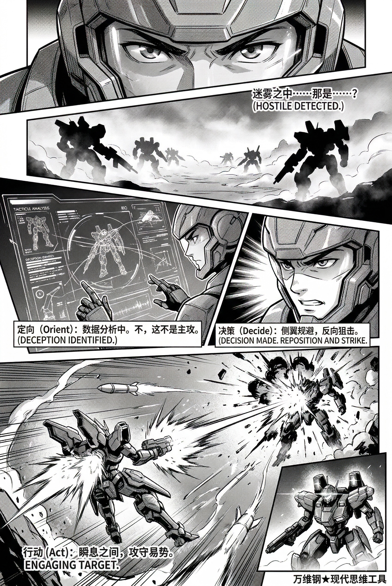
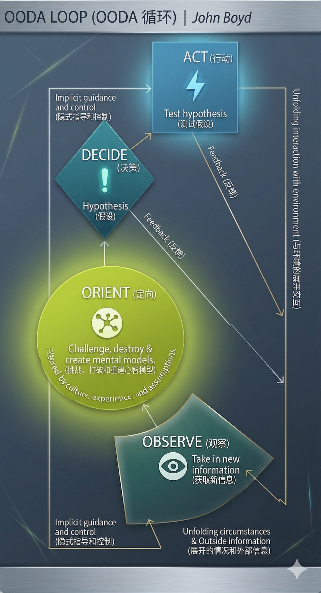

# OODA 环：不是反应快，而是换脑快（得到课程讲稿 + AI 加工段）

# OODA 环：不是反应快，而是换脑快

[OODA 环：不是反应快，而是换脑快](https://www.dedao.cn/course/article?id=zYo2GPNq4W8VEbwm6mJejyRBZbnw0d)

我们已经讲了很多个关于决策和判断的心法，作为这个板块的最后一讲，咱们说说怎么把决策判断和行动结合起来。

实战场合不会给你留下很多时间做调研，你不能指望你的决策一上来就是正确的……而且你必须迅速做出反应。就好比你是个急诊室医生，救护车推进来一个满身是血、意识模糊的病人。家属在旁边尖叫，心电监护仪疯狂报警。你该怎么操作？又或者，股市突然崩盘，你卖不卖？竞争对手发了一个颠覆性的产品，你跟不跟？

算好了再决策，根本就没有时间，因为你并不掌握全部的信息。手忙脚乱是大忌，可是不反应也不对。怎样才是有章法的应对呢？

这一讲的思维工具叫「 OODA 环 （OODA Loop）」，意思是「观察—定向—决策—行动（Observe–Orient–Decide–Act）」这四个动作的循环。

你可能在别的场合听说过 OODA，很多人把它理解成反应快 —— 但 OODA 的精髓其实是「换脑快」：把你抛到任何一个情境之中，你能不能迅速判断这是什么局、对方要干什么、什么是重点什么是噪音，建立你的认知地图？每循环一轮，就是把地图刷新一遍。谁的地图刷新率更高，谁就更能在混乱里保持主动。

不是快手赢慢手，而是新脑子赢旧脑子。

OODA 最早是美国空军传奇战斗机飞行员、被誉为“整整一代军官的战术导师”的博伊德（John R. Boyd）在 1970 年代提出来的。

博伊德是在空战教学中悟出的这番道理。他喜欢跟人打 40 美元的赌，说自己能从劣势位置开始，在 40 秒钟之内翻到对手后方完成反杀。OODA 就是博伊德的战术秘诀，不过博伊德想的可不只是空战，而是一般意义上，人在对抗中如何持续修正理解、争夺主动权。

简单说，OODA 把对抗性博弈拆解成了四个循环往复的步骤 ——

1. 观察（Observe）：看到对手在哪，环境发生了什么变化；

2. 定向（Orient）：搞明白“刚才看到的这些信息意味着什么”；

3. 决策（Decide）：基于刚才的判断，我决定下一步怎么做；

4. 行动（Act）：拉操纵杆、开火、或者转向。

就拿拳击比赛来说：一个最基本的 OODA 环就是你看到对手左肩微微一沉（观察）→ 你的大脑迅速匹配经验，判断他要出左勾拳（定向）→ 你决定下潜躲避并打他右肋（决策）→ 最后你弯腰出拳（行动）。

那你说这也太简单了，无非就是“看一看、想一想、做一做”，以快打慢呗？没这么简单。要点并不在于你的循环比对方快，而在于你的循环有效 —— 最好你还能误导对方的循环。

想象两个拳击手，甲出拳很快，乙没那么快，但他很会“改写对方的判断”。前几次试探里，乙总是假装想打左侧肋部，让甲形成一个稳定预期。等甲的注意力和重心都往左偏，乙突然换节奏，一步切进中线，直接打头！

乙不是赢在了最后那一拳，而是赢在他误导了甲的 OODA 中的“定向”那一步。乙把甲的脑子带进了错误地图。

这就是为什么一轮 OODA 不够，必须反复循环 —— 就算之前的判断是对的，下一秒可能就不对了。

用现代认知科学的视角看，OODA 环简直是再自然不过。

我们前面讲过「预测加工（predictive processing）」理论，你知道大脑本质上是一个预测机器，我们不是被动地接收世界的信息，而是在脑子里先有一个关于世界的模型，然后用这个模型去预测会发生什么。当现实和预测不符时，我们就必须更新模型 —— 这不就是一轮一轮的「观察」和「定向」吗？

我们还讲过自由能原理中的「主动推断（active inference）」，你知道行动不是感知之后的附属品，行动本身就是获取证据、减少预测误差的方式：不是先把世界看清楚再行动，而是带着模型行动，用行动去采样世界 —— 这不就是「决策—行动」，再开启下一轮「观察—定向」吗？

OODA 的深意，不是要做一次决策采取一次正确行动，而是面对时刻都在变化的局面，我们要边行动、边学习、边修正。

博伊德后来升级了 OODA 学说，把其中的 D（决策）更多地解释成「假设（Hypothesis）」，把 A（行动）更多地解释成对世界进行一次「压力测试（Stress Test）」。

博伊德的完整版本是一个带着前馈、反馈、隐性引导和环境互动的开放系统，我们简化一下，广义的 OODA 环其实是在不确定中连续地下小注、做实验、收反馈、改地图 ——

1. Observe： 不是多看几眼堆信息，而是抓变化、抓异常，抓那些一旦看见就会改变下一步动作的信号；

2. Orient： 不是转个身找方向，而是重新判断“眼前这到底是什么局”；

3. Decide： 不是宣布真理，而是选一个当前最值得下注验证的假设；

4. Act： 不是结局，而是逼现实表态。

外行以为高手的每个行动都是为了取得什么进展，但 OODA 提倡很多行动只是“拨弄”一下现实。你打出一拳，看看对手是格挡还是后退；你向市场投放一个 MVP（最小可行性产品），看看消费者的反馈。这种“拨弄感”，才是 OODA 高手的作风。

咱们来看一个经典案例：中途岛海战。

1942 年春天的太平洋战场，美军破译了日本通信，知道对方要袭击一个代号为 “AF” 的目标，这是「 **观察** 」。

尼米兹猜测 AF 有可能是中途岛，但是他不敢确定，这是「 **定向** 」。

于是尼米兹接受部下建议，决定验证一下，这是「 **决策** 」。

中途岛发出一份明码电报，说岛上的淡水设备坏了，缺水，这是「 **行动** 」。这个行动引发了下一轮 OODA ——

日军发电报：AF 缺水。看来 AF 就是中途岛，这是美军的新「 **观察** 」。

尼米兹明确了日军要打中途岛，这是「 **定向** 」。

尼米兹决定准备伏击日军，这是「 **决策** 」。

美军航母被提前部署到中途岛东北方向，这是「 **行动** 」。

再看战斗当天的日军。南云忠一命令舰载机发起空袭，目标是中途岛机场和设施。他根本没想到美军航母就在附近。

第一波攻击后，有报告说中途岛尚未被彻底压制，需要第二波，这是南云的第一个「 **观察** 」。

南云并没有改变对局面的理解，认为应该继续压制中途岛，这是「 **定向」** 。

南云下令准备第二波攻击，这是「 **决策** 」。

日军飞机返回航母加油，再次挂载对陆地攻击炸弹，准备出发，这是「 **行动** 」。

就在这时候，日军侦察机报告发现美军战舰，然后又说对方可能有航母，这是第二轮「 **观察** 」。

南云犹豫不决：如果专心对付美军航母，就得让战机把挂载的对地攻击炸弹换成反舰的鱼雷和穿甲弹，这会很麻烦，这是失败的「 **定向」** 。

南云来回摇摆，一会儿想坚持打中途岛，一会儿想优先打航母，这是「 **决策** 」。

日军航母甲板上一团混乱，有的飞机在改挂载，有的刚回来，有的在等待起飞窗口，这是「 **行动** 」。

这就让美军有时间侦察到日本航母位置，开启下一轮 OODA，全力攻击航母……剩下的就是历史了。

一个积极刷新地图，让行动产生新信息；一个把自己困在旧地图里，让行动制造负担，最后的胜负不是很合理吗？

在现代指挥控制体系中，OODA 环已经不再仅仅是对一个飞行员或者指挥官的战术要求，而是上升成了对全局的综合性要求 —— 用美军的话说就是要争取「决策优势（Decision Advantage）」：谁能在这个循环里不断提出更好的假设、做更猛的压力测试、然后更快地重塑对战场的认知，谁就掌握了战争的制高点。

OODA 环是一个组织把经验变成更新速度的能力。过去比的是个人能不能快速换脑，今天比的是传感器、数据、通信链、算法、授权机制和前线反馈这些能不能一起快速换脑。

咱们说一个最新的例子，乌克兰战场。

乌军和俄军的很多对抗都围绕无人机展开，而乌克兰把战场变成了一个通过 OODA 对无人机技术进行升级的平台。根据截至 2026 年 3 月的报道，乌克兰正通过一个安全平台向盟友开放战场数据，用来训练无人机的 AI 系统。

前线每一次被干扰、每一次轰炸和射击偏离，都变成了后方机房里的预测误差，这就是「观察」。通过分析数以百万的图像，AI 更新了对俄罗斯电子战环境的理解，这就是「定向」。基于这种高频的定向，后方的工程师和指挥官会迅速做出技术路线的「决策」。然后乌克兰的前线小队带着刚刚刷入新固件、更新了算法的无人机，在真实的战火中进行测试和微调，又把反馈数据直接传给厂商，这是「行动」……并且开启下一轮 OODA。

现代战争中，决策速度本身就是一种武器系统。而在 AI 时代，赢家恐怕是学习链最短的一方。

你大约能看出来， OODA 四个字母里，最关键的是第二个 O，也就是「定向（Orientation）」。 博伊德早在 1987 年就说过：「定向是整个 OODA 循环的“阵眼”。」（Orientation is the Schwerpunkt.）

在我看来，这个「定向」绝不是简单的找方向，或者产生一个什么明悟 —— 而是「改叙事」，改叙事才是真正的换脑子。定向是你意识到局面不是你之前想的那样，原来你应该使用的是这个模型！定向给了你「归纳偏置」，你才有接下来的决策和行动。

博伊德说，定向是由四股力量共同塑造的：遗传背景（genetic heritage）、文化传统（cultural tradition）、既往经验（previous experiences）和正在展开的情境（unfolding circumstances）。

换句话说，同样一条信息，落到不同人脑子里，会长出完全不同的意义。

或者你也可以说，定向就是给事件定性。比如职场上一个项目延期，你把它定向成“同事不努力”，和你把它定向成“这个需求本身就有问题”，你后面的决策和行动会截然不同。

定向是指挥官最高级的本事。

咱们再看一个商业上的案例。

服装销售商 Zara，被认为是快时尚的巨头，仿佛能预测潮流一般。但与其说它是一家服装公司，还不如说它是一家披着时尚外衣的高频数据处理与物流响应公司。Zara 在自家门店获得顾客反馈之后，三周之内就能完成从重新设计到新品上架，靠的正是 OODA。

它的一个典型循环是这样的 ——

Zara 推出一款春季短夹克。上架一周后，信号传回总部，有的门店卖得还可以，有的门店不行，说顾客主要嫌弃版型和长度，这是「观察」。

别的公司对此的「定向」可能是把数据压缩成一句话：这款卖得一般。但 Zara 的定向保持了有效的颗粒度：不是这款不行，而是它在不同气候、不同穿搭习惯的门店顾客群里，意义不一样。

那么接下来的「决策」和「行动」就不会是盲目砍掉或者胡乱补货，而是让设计准备一个更贴合寒冷地区需求的变体 —— 原本卖得好的门店，继续卖原版；找几个更适合卖变体的门店，卖变体。这就是一次低成本的市场实验。

第二轮反馈回来，变体在原先疲软的门店开始动了，而原版在另一批门店仍然卖得更好，这是新的「观察」。

看来分版本是对的，这是新「定向」。于是「决策」和「行动」是让不同门店铺不同版本。

而且还有第三轮 OODA：等 Zara 发现这款夹克的销量有一点下降，就会快速撤场，让它在趋势变坏之前优雅地退出。

完美预测是不可能的。但 Zara 能控制自己脑子的刷新速度。

我们在日常生活中也可以使用 OODA，关键还是「定向」 ——

在应试教育中学习，别一观察到考差了就“我再多刷两百道题！”应该先定向：自己做错的题到底是审题错、概念错，还是时间分配崩了。

工作上，别一看到数据下滑就是“加班”“加功能”“加汇报”。先做一个最小探针，看问题到底出在产品、流程、叙事，还是组织协同。很多团队不是缺执行，而是缺一次能逼真相现形的小行动。

夫妻吵架，最有用的 OODA 不是立刻反击，而是先问一句：对方眼里现在到底是个什么事儿？可能你以为你们在争事实，对方觉得你们在争关系。

个人健康可以每周来一次 OODA 小循环：观察睡眠、饮食和精力；定向出最关键的单一变量；只改这一个；做七天。下周也许换成别的变量。

总结来说，OODA 环 ——

**不是反应快，而是换脑快。**

**不是永远对，而是及时改。**

**不是求定论，而是先下小注。**

**不是做完一步，而是让每一步都带回下一步的情报。**

大部分人只是闷头走路，有些人偶尔抬头看天；而有极少数人，却是始终都在密切观察，努力重新审视地图。他们会用各种方法主动刺探，以期抓住微小的机会，把局面带入自己的节奏。

---

通过“OODA环（观察-定向-决策-行动）”这一思维工具，深刻拆解了人在复杂和不确定环境中该如何进行动态决策。

#### 1. OODA 的本质：不是“反应快”，而是“换脑快”

- **认知地图刷新率**：OODA 不是单纯的“以快打慢”或条件反射，而是面对变化的环境，能迅速抛弃旧假设、建立新认知，谁的“地图”刷新率高，谁就能在混乱中掌握主动权。
- **边做边学**：实战中没有时间掌握全部信息，OODA 的精髓不在于憋大招“做一次完美的正确决策”，而是**边行动、边学习、边修正**。

#### 2. OODA 闭环的重新定义（基于现代认知科学）

文章打破了字面意思，赋予了这四个动作更实战的内涵：

- **观察（Observe）**：不是堆砌信息，而是**抓变量和异常**，寻找能改变下一步动作的关键信号。
- **定向（Orient）**：不是找方向，而是**改叙事/定性**，搞清楚“眼前到底是个什么局”。
- **决策（Decide）**：不是宣布绝对真理，而是选定一个当前最值得下注验证的**假设**。
- **行动（Act）**：不是最终结局，而是对世界进行一次**压力测试（拨弄/试探）**，逼现实表态，从而获取新情报。

#### 3. OODA 的阵眼（核心）：定向（Orient）

- **最高级的本事是定性**：同一个信息，由于遗传、文化、经验和情境的不同，会产生完全不同的意义。“定向”决定了你使用什么认知模型去应对局面。
- **战术博弈的高阶玩法**：在对抗中，不仅要让自己的循环有效，还要设法**误导对手的“定向”**，把对手的脑子带入错误的地图（如拳击假动作、中途岛海战中的美军）。

#### 4. 行动的新视角：行动本身就是获取情报的方式

- **主动推断**：行动不是感知和思考结束后的附属品，而是带着模型去“采样世界”。
- **最小可行性探针**：打出一拳、投放一个MVP、改变一个单一变量，这些“小注”和“小行动”是为了让真相现形，从而开启下一轮更高质量的 OODA。

#### 5. 时代演进：从个人换脑，到系统换脑

- 在现代战争（如俄乌无人机战）和商业竞争（如 Zara 的快时尚物流响应）中，OODA 已经成为组织级的能力要求。
- **决策优势/学习链**：谁能利用数据、AI、前线反馈将“学习链”缩到最短，谁就能赢得竞争。

---

### OODA 在日常生活中的应用

OODA 环是普通人打破生活僵局、解决日常难题的极佳思维工具。

核心心法：**不要僵死在“旧剧本”里，遇到阻力先换个角度给事情“定性”（定向），然后做一个“小试探”（行动），看看现实的反馈（观察）。**

#### 场景一：亲密关系（夫妻/情侣吵架）

**旧反应**：对方指责你，你立刻反击（本能反应，陷入证明自己对的死循环）。

**OODA 循环**：

- **观察（Observe）**：你发现伴侣虽然在抱怨“你总是不做家务”，但其实地已经被ta拖过了，而且ta说话的声音很大，情绪激动。
- **定向（Orient - 核心阵眼）**：重新给局面定性。这不是一个“谁做家务多”的**事实辩论局**，这是一个“ta觉得付出没被看见”的**情绪安抚局**。
- **决策（Decide）**：假设只要我肯定ta的付出，情绪就会降温。
- **行动（Act）**：进行一次“小试探”。放弃辩解，过去抱一下ta说：“这阵子你确实太辛苦了，家里多亏了你，今晚你想吃什么我来做。” 
- **下一轮观察**：看对方是态度软化，还是继续发火。如果是软化，说明定向正确；如果继续发火，进入下一轮 OODA，寻找真正的原因。

#### 场景二：职场工作（客户/老板微信“已读不回”）

**旧反应**：内心戏爆炸（“他是不是对我不满？”“方案是不是搞砸了？”），要么疯狂催促，要么焦虑等待。

**OODA 循环**：

- **观察（Observe）**：方案发给客户三天了，对方没回复。但之前沟通时对方态度很好，且近期他们公司在搞大促活动。
- **定向（Orient）**：改变叙事。对方不回复，大概率不是“否定”，而是“阻力”。可能是方案太长他没空看，也可能是他没法直接做主。定性为：**这是一个缺乏低成本下一步的“卡点局”**。
- **决策（Decide）**：假设我给他提供一个极简的台阶或最小行动，他就会回复。
- **行动（Act）**：发一条探针消息：“王总，知道您最近大促忙，方案您先不着急细看。如有需要，我可以先提炼一个200字的摘要发您用于内部汇报。或者下周我再跟进？”
- **下一轮观察**：看客户是否顺着台阶回复“好的发摘要来”或“下周再说”。

#### 场景三：个人成长（减肥遇到瓶颈期，怎么都不掉秤）

**旧反应**：觉得是自己不够拼，于是盲目增加一倍运动量（容易受伤），或者自暴自弃暴饮暴食。

**OODA 循环**：

- **观察（Observe）**：体重连续两周没变。每天跑步5公里，但最近下午总是特别容易饿，而且睡眠质量变差了。
- **定向（Orient）**：打破“不够努力”的旧归因。这不是“毅力问题”，这是一个“系统平衡问题”。很可能是运动量过大导致皮质醇升高或代偿性进食。
- **决策（Decide）**：挑选一个单一变量进行测试。假设问题出在“隐性碳水摄入”上。
- **行动（Act）**：下注一个最小实验。接下来三天，运动量不变，但不改变饭量的前提下，把下午的零食换成坚果，并记录饮食。
- **下一轮观察**：三天后观察体重和精神状态。如果没变，下一轮再换一个变量测试（比如调整睡眠或换成力量训练）。

#### 场景四：家庭教育（辅导孩子写作业，孩子崩溃大哭）

**旧反应**：家长也跟着崩溃，大吼大叫：“这么简单的题你怎么就不会！”

**OODA 循环**：

- **观察（Observe）**：孩子做语文很快，一到数学应用题就发脾气、咬铅笔，甚至哭泣。
- **定向（Orient）**：给行为重新定性。孩子不是在“故意对抗”或“态度不端正”，他是在表达“我害怕/我没能力解决”。这是一个**“畏难情绪局”**。
- **决策（Decide）**：假设只要把任务拆解到极小，他的大脑警报就会解除。
- **行动（Act）**：试探性干预。把书本合上，说：“我们现在不写这道题。你只用眼睛找一找，题目里有哪三个数字？找出来我们就算过关。”
- **下一轮观察**：看孩子的呼吸是否平稳下来，是否愿意配合找出数字。如果有效果，再顺势进入下一步。

#### 总结：日常生活 OODA 的精髓

在生活中运用 OODA，其实就是把自己当成一个**生活黑客**：

1. **停止情绪内耗**：遇到不顺，先停下来（Observe）。
2. **多准备几套剧本**：遇到死胡同，换个角度解释问题（Orient）。
3. **低成本试错**：别一上来就做大决定，而是抛出一个“小探针”（Act），让现实给你答案。
