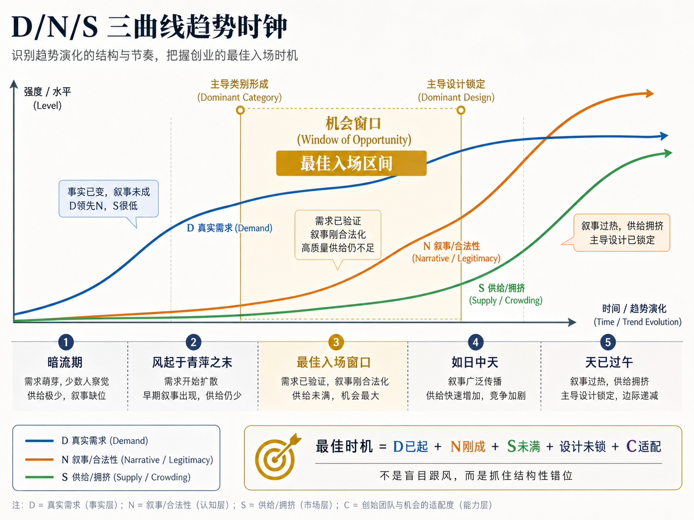
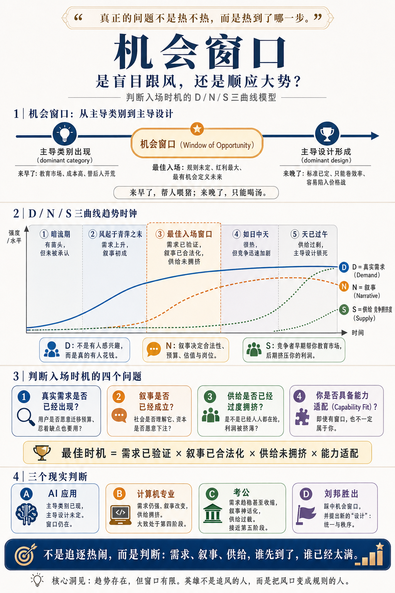

# 机会窗口：是盲目跟风，还是顺应大势？

[机会窗口：是盲目跟风，还是顺应大势？](https://www.dedao.cn/course/article?id=ykaNlMY5gn3Jq1WByeJ7EAROW0DLje)

2026-05-26 06:32

现在 AI 这么热，人家都说是大势所趋，你也很想入场干点什么。但你又总担心，自己到底是真的顺应大势，还是盲目跟风呢？从古至今任何想要大展身手的人都会面临这个灵魂拷问。

传说曾国藩有句话叫“久利之事勿为，众争之地勿往”。如果这个事儿已经如此之热，街头巷尾都在讨论，这时候参与岂不是纯属凑热闹？难道我们不应该找一片属于自己的蓝海吗？但这话得看你怎么说。

我们设想 2018 年，中国房地产还相当火热的时候，有个高中生说大学想报考建筑学专业。如果你那时候冷静判断，告诉他建筑业已经太热了，我看早晚变成夕阳产业，久利勿为！那你是帮了人家。但是咱们再想想，计算机专业早在三十年前就是热门，一直都是最难报考的专业之一。如果二十年前，你跟一个特别聪明的高中生说，计算机太热了，众争勿往！你这不坑人吗？

现在还是同样的问题。AI 编程兴起，很多刚毕业的计算机专业大学生不好找工作，那你敢说计算机专业就没有前途了吗？现在社会上有这么多人考公，你敢跟他们说一句“众争勿往”吗？

该不该进入一个领域，跟它看起来有多热，没有太大关系。曾国藩那句格言属于选择偏差。

这一讲咱们说说怎么判断入场时机。你不可能精准预测未来，但是你总可以有比“反内卷”更高级的心法。

首先我们要有一个底层信念，一个先验：**趋势，是存在的。**

你但凡敢出来做事，就得相信趋势的存在。

我看聪明人特别容易犯的一个错误，就是过度相信市场的有效性。你可能会觉得，如果一个问题是可以解决的，它一定早已经被别人解决了；如果一个行业真能赚钱，早就有无数人才和资本涌入，互相竞争之下利润迅速就会降到零……如果你相信有价值的信息都会被瞬间吸收，任何局部优势都会被立刻抹平，每一个错配都会被很快纠正，那你就等于说相信干什么都是一样的。

现实绝非如此。

金融市场大概是最接近“有效市场”的地方，毕竟交易太方便了。我们可以设想，如果一家公司有一个基本面意义上的好消息，市场得知这个消息就会提高对它的估值。有这么多交易员盯着，好消息应该会在一天之内被 priced in（定价），以至于普通股民看到的股价应该都大致反映了公司的价值。对吗？

如果股市是这样的，今天的股价上涨就只是今天的事儿；明天有别的消息出来，那就是另一个走法。如果金融市场是有效的，股价应该呈现某种随机游走的状态 —— 对吧？

那么你需要读一读 2012 年，芝加哥大学的托比亚斯·莫斯科维茨（Tobias J. Moskowitz）等人发表的一篇经典论文，题目叫《时间序列动量》（Time Series Momentum）。他们分析了股票指数、货币、商品、债券期货等等 58 种高流动性合约，发现过去 1 到 12 个月的收益，对未来收益有一定正向预测力，然后才在更长的周期上会有部分反转。

翻译成人话就是：如果一个东西一直往一个方向走，它常常还会继续走一段。

换句话说，如果股市过去半年涨得挺好，它下个月大概率还会涨。

这不是说应该追涨杀跌，因为这里研究的是长期的统计规律……但是，这篇论文证明了市场的趋势是存在的。

行为金融学对此早就有说法：市场短期内会对消息反应不足，慢慢才反应过来，这样趋势就形成了；到了一定程度，跟风的人越来越多，市场才会反应过度。

金融市场如此，其他市场就更是如此。信息不会瞬间被世界承认，价格不是一次性反映真相 —— 人群对事物的认识是逐渐的。

真正的问题不是“热不热”，而是热到了哪一步。

这就引出了我们重点要说的思维工具，战略管理学家费尔南多·苏亚雷斯（Fernando F. Suarez）等人在 2015 年提出的「**机会窗口**（window of opportunity）」理论。

这个理论说，比如你想进入一个领域，这里有别的玩家，有各种各样已经出现和可能出现的产品，那你怎么知道自己是来早了、来晚了，还是来得恰到好处呢？

答案是一句话： 你入场的机会窗口，是从「主导类别（dominant category）」出现时打开，到「主导设计（dominant design）」出现时关闭。

所谓类别，就是大家给这个新事物取的名字。比如曾几何时，人们对那种能上网的手机有很多称呼：PDA、掌上电脑、多媒体电话……这就是没有形成主导类别。等到大家统一称之为“智能手机”的时候，才算是主导类别形成：投资人和客户都不需要再问“这是个什么玩意儿”，而开始问“这个赛道谁领先”；招聘市场出现相关岗位，媒体从猎奇报道转向行业分析。

如果主导类别还没形成，你就进场，你就必须得花费巨大的成本去教育市场。客户、资本、媒体和监管部门都不懂你在干什么，你等于是在替后人开荒，岂不是费力不讨好吗？

而所谓主导设计出现，就是行业已经基本定下来这种东西该怎么做了。人们对“好产品该长什么样”已经达成共识，架构、界面、标准、渠道、采购规则全都固定，连头部玩家的位置也固定了。

那个时候你再入场就太晚了。你错过了规则的制定，现在只能在人家的规则里寻找一点缝隙。你几乎不可能给出一个石破天惊的创新，就只能打价格战、卷加班，挣点辛苦钱。

来早了，你是帮人家喂猪；来晚了，只能喝汤。只有在从“主导类别出现”到“主导设计出现”之间的那个机会窗口期入场，你才能赶上吃肉。

那是规则的构建期，更是创造的红利期。

咱们看三个经典案例。

**第一是智能手机和苹果。**

苹果既不是第一个做手机的也不是第一个做移动计算设备的。在 iPhone 之前，市场上已经有 PDA 手机、商务手机、拍照手机、音乐手机、黑莓、诺基亚、微软的移动系统。诺基亚从通信出发，黑莓从商务邮件出发，微软从桌面电脑出发，各个大厂都在用自己的优势定义手机。

但当时没有人明确知道手机到底是该干什么用的。后来手机上网变得普遍，「智能手机」这个主导类别才算形成。

在这之后，而恰恰又在“智能手机到底应该是什么样”还没有定论的时候，苹果推出了 iPhone —— 一举确定多点触控大屏、移动操作系统、应用商店和开发者生态这一整套主导设计。主导设计一旦形成，别人就很难再进来竞争了。

安卓生态之所以存在，是因为苹果卖得太贵而且不自由，给它留下了一点空间。更后来的竞争者就只能打价格战了。

**第二是电动汽车和小米。**

那你说，小米造汽车的时候，电动汽车这个主导类别早就存在，而且主导设计也定型了：特斯拉已经稳了，蔚小理都很有存在感，你这时候进来不是盲目跟风吗？

小米赌的是电动汽车的主导设计还没有完全锁死：它深化了“软件定义汽车（software-defined vehicle）”，搞了个“人车家生态”，说汽车的座舱是第三空间。而小米在智能生态和软件上有优势。

**第三是 MP3 播放器和微软。**

你可能都不知道，微软公司曾经在 2006 年推出过一款 MP3 播放器，叫 Zune，正面对标苹果 iPod。

其实它的硬件设计还不错，有些功能也挺有想法，比如支持无线分享和订阅模式。但它最终惨遭失败。

关键是当时早就有了 iPod，MP3 市场的主导设计已经定型了。你没有真正打响差异化，那这就不是你的机会窗口。再加上后来智能手机崛起，连 MP3 这个产品类别都不复存在，连想跟人打价格战都已经不可能。

要想光荣地入场，你必须借势主导类别，定义主导设计。

我们用机会窗口分析，现在 AI 就处在“智能体应用”这个主导类别已经存在，但是“个人具体应该怎么用”这个主导设计还没有定型的时刻。如果有一家大厂，比如苹果或者字节跳动，搞出一款专门的 AI 电脑或者 AI 手机，让消费者一看真好用，它就有可能定义主导设计……但这不是我们的主题。

机会窗口理论似乎对大玩家特别有用 —— 那你说我是个普通人，我就想在哈尔滨开个小店，我怎么能知道我该不该入场呢？我们需要一个更通用的工具。

咱们先综合一下前人的智慧。

罗杰斯（Everett M. Rogers）的「**创新扩散**（diffusion of innovations）」理论告诉我们，新事物不是均匀扩散的，而是从创新者、早期采用者，到早期大众、晚期大众，走一条 S 形曲线。巴斯（Frank M. Bass）的**扩散模型**进一步说明，消费者采用新产品，既受创新吸引，也受模仿影响。

希勒（Robert J. Shiller）的「**叙事经济学**（narrative economics）」又说，叙事很重要：经济叙事会像病毒一样传播，影响投资、消费和创业。

不同阶段的企业应对方法也不一样。汉南（Michael T. Hannan）和卡罗尔（Glenn R. Carroll）的**组织生态学**认为，一个新组织类型早期数量少，合法性低；中期同类组织增加，能帮你证明类别的合法性；后期同行密度过高，就会发生竞争吞噬资源。厄特巴克（James M. Utterback）和阿伯纳西（William J. Abernathy）的**产业生命周期理论** 也说，行业早期拼产品创新，后期拼流程、规模和效率……

我让 AI（GPT-5.5 Pro）把所有这些学说综合起来，加以简化，给一套直指人心的心法，它提出一个心智模型叫「 D/N/S 三曲线趋势时钟 」，像下面图中这样 ——

D/N/S 就是需求、叙事和供给。我想知道入场的最佳时机，就要看看这三条曲线各自走到了什么位置。

**D 曲线是「真实需求（Demand）」**。不是有人感兴趣，而是有人真花钱。人们真的会把预算从旧方案迁移过来，把新东西嵌入工作流，哪怕这个产品很烂他们也忍着用……这是最底层的动力。

**N 曲线是「叙事（Narrative）」。**我们这个课程反复说叙事的重要性，叙事是社会对你这个东西的认可，叙事决定这门生意的合法性。名不正则言不顺，有了叙事才有了资本，有了估值、预算和岗位。

**S 曲线是「供给（Supply）」。**也就是有多少人跟你抢生意。这条曲线代表了竞争的拥挤程度和资源的锁定程度。早期竞争者能帮你证明需求和教育市场，晚期竞争者则会抢夺你的利润。

这三条曲线合起来，一个机会大概分五个阶段。

**第一，暗流期：需求有苗头，但没有叙事也没有供给。**这里充满风险。你以为你发明了一个能解决痛点的东西，但搞不好它可能只是一个小众的癖好。

**第二，风起于青萍之末：需求开始上升，叙事刚刚出现，供给非常少。**高手这时候可以悄悄积累能力和关系了，因为窗口就在眼前。

**第三就是最佳入场窗口：需求已经验证，叙事已经合法化，供给尚未拥挤，主导设计还没锁定。**此时不出手更待何时？

**第四，如日中天：需求和叙事都很强，供给快速上升。**行业很热闹，人也多钱也多。这时候入场已经有点晚了，但如果你有超强能力、强渠道、强差异化，你还可以进。

**第五，则是天已过午：需求增速下降，叙事已经吹成了神话，供给过剩，主导设计锁死。**这时候正面入场就是打价格战。

而且别忘了，你还需要有「**能力适配**（Capability Fit）」 —— 没有这个 C，D/N/S 再怎么样也跟你没关系。

根据这个框架，如果你想在哈尔滨开一家剧本杀店，你就需要考虑：旅游业是否给哈尔滨带来了更多的需求？剧本杀这种玩法是否已经得到了大众的认可？哈尔滨现在已经有多少家剧本杀店？你有没有能力做出差异化来？

这些没有精确的量化标准，但这个心法是有用的。

今天还要不要学计算机专业？需求还在，数据、安全、自动化仍然很热，各行各业都数字化。叙事变了，以前是会写代码就行，现在你必须是一个跟 AI 协同工作的工程师。供给方面，因为 AI 参与，确实已经相当拥挤。**综合判断，我认为计算机专业仍然处在第四阶段，甚至如果你考虑到叙事改变，新窗口还有可能打开，并没有到“天已过午”的地步。**

那要不要考公呢？需求早已趋稳，而且在收缩。随着各地政府财政能力下降，公务员岗位会减少。2026 年国考计划招录人数已经比上一年减少了 4.3%。叙事方面，考公已经不只是“寻求一份体制内工作”，而是变成了一个社会避险神话。供给更是严重过载：2026 年通过国考资格审查的人数达到 371.8 万，比上一年增加了 30.2 万，竞争比高达 98:1……**综合而论，我看现在花时间备战考公就如同在 2020 年高价买房。**

我们还可以用这个框架分析一个更有意思的故事：秦朝末年那么多人起义，为什么最后是刘邦胜出呢？

陈胜、吴广开创了造反这门业务的「主导类别」，他们用一句“王侯将相宁有种乎”向天下人证明反秦是个合法的叙事。但是他们入场太早，投资人和用户还没搞明白这门业务应该怎么干，所以他们的主要作用是教育市场……最终成了悲壮的开路先锋。

项羽组织了有效的供给，但他提供的是一套过时的设计，分封制，对渴望稳定的民众缺乏吸引力。但是反秦叙事至此已经深入人心。

刘邦，不但入场正好踩在「机会窗口」上，而且提供了两项新设计 —— 一是统一秩序，二是用“约法三章”化解秦制高压带来的民怨 —— 这就组织起更强劲的供给，一举胜出。

而刘邦之后，像什么韩王信、彭越这些人又想造反，可是刘邦的设计已经是主导，机会窗口已经关闭了。

有了机会窗口理论和 D/N/S 这套心法，你就不用整天空谈什么“时势造英雄”，感叹风口了。

一项事业够不够热，有没有很多人在追求，这些都不是本质。本质在于需求、叙事和供给的互动，在于这里有没有主导类别和主导设计。

我们必须尊重时间窗口这个硬约束。如果你想干的那个事儿现在没有多少真实需求，连主导类别都不成立，那你最好先干别的。

**【有诗赞曰】**

> 暗潮先动众声迟，叙事初成风始开。  
> 类别已明门半启，定式未锁局新裁。  
> 早来每被荒原噬，晚到空随市井埃。  
> 能把潮声铸成制，方知英雄造势来。

