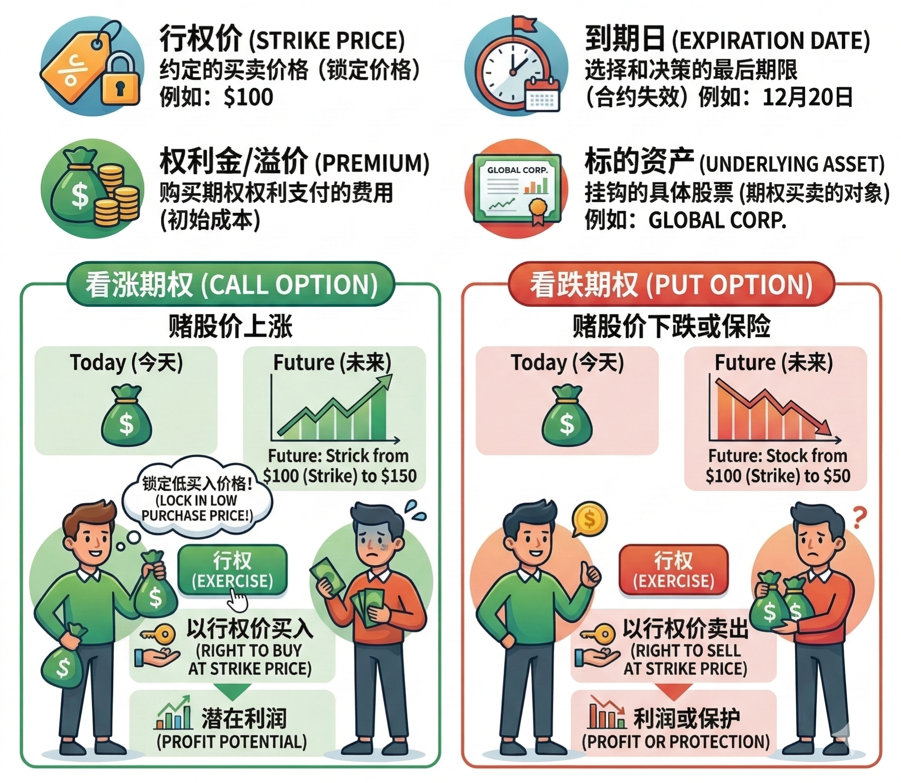
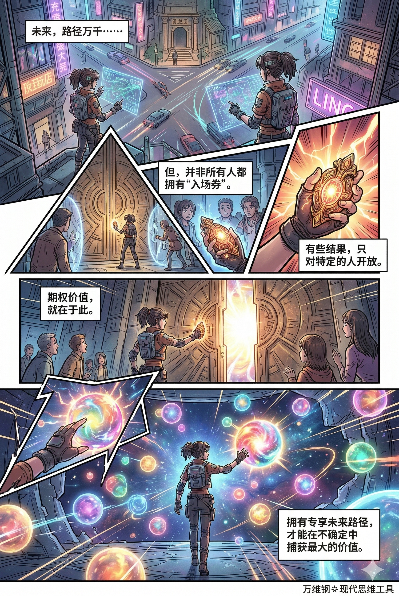

# 期权：保留可选项的特权（得到课程讲稿 + AI 加工段）

# 期权：保留可选项的特权

[期权：保留可选项的特权](https://www.dedao.cn/course/article?id=YB83z6N9dqxVyPnBzdK7ZMvy0GQDO5)

想象一个新开发的商业区里有个位置特别好的商铺正在招租，老张想租下来开家餐馆。一问，租金很贵，而且房东要求起租就是五年。

大环境变幻莫测，老张担心万一干不好，五年租金岂不是打了水漂？有个朋友就说：“不然你让房东降降价吧？”

结果老张跟房东谈了半天，非但没降价，反而还把租金提高了 20% —— 条件是一年后，老张有权以一个预先锁定的价格续租四年，房东不得拒绝也不得涨价；而如果到时候老张不续租，则可以直接走人而没有违约金。

房东感觉没吃亏，毕竟多得了 20% 的租金，而且一年后想必也不愁再把铺面租给别人。老张则说：“我买了一个期权。”

如果局面你拿不准，有些事最好不要过早**锁定（commit）** —— 你可以给自己留一张「 **期权** （Option）」。

期权本来是个金融概念，意思是你有权在一定期限内，以约定价格买入或者卖出某个标的，但你没有义务必须这么做。

假设你看好某只股票，但又不很确定它未来三个月的走势。于是你买入一张看涨期权（Call Option）：它允许你在3 个月后（到期日，Expiration Date），以每股 100 美元（执行价，Strike Price）的价格，买入100 股股票（标的资产，Underlying Asset）。而为获得这个权利，你现在需要支付一笔小费用，比如 5 美元一股，也就是期权费（Premium）。

如果三个月后股价涨到 150 美元，那太好了，你仍然可以按 100 美元的执行价买入，立即享受 50 美元的差价；而如果到时候股价跌到 80 美元，你就选择不行权（not Exercise），放弃这笔交易，你损失的只是当初那 5 美元的期权费。

还有看跌期权（Put）的玩法，也就是买一个在未来价格暴跌时，依然能以约定高价卖出的保底权利，不必细说。

但期权不只是华尔街的东西，它在很多领域都有应用，我们完全可以把它当做一个决策思维工具。简单说， 期权就是你的一个可选项：它只是权利，不是义务。

请注意，可不是所有的“留着以后再说”，都能叫期权。

你有权立即去注册一家公司当老板，可是有什么意义呢？市场经济人人都可以开公司。期权的价值不在于自由，而在于它给你提供了一种\*稀缺\*的特权，别人想要也没有。

美国战略管理学者丽塔·麦格拉思（Rita Gunther McGrath） —— 她是“真实期权战略（real options strategy）”研究的重要推动者 —— 跟合作者在 2004 年发表的一篇论文中提出： 期权价值要成立，得满足两个条件 —— 第一，未来存在多个可能路径；第二，你对其中某个结果拥有专有进入权。

别人被挡在了门外，只有你有资格进场，而你还可以选择不进场，这才叫期权。

比如你提前和一个客户建立了信任；你虽然离职但是保留了一段可以回来的职业关系；你拿下了独家代理；你锁定了一个好价格；你争取到了一个别人没有的名额……期权是被制度、资源、关系、时间窗口封装起来的可能性。

既然是特权，就不能没有代价。所以你得经营才行。咱们看几个听起来不像是期权，但其实是期权的场景。

科学家做实验，商人研发最小可行产品（Minimum Viable Product，MVP），都相当于购买看涨期权。

你需要投入资金、时间和精力作为期权费，但你的投入是有限的，你的失败是可承受的：跟真正的商业活动和大规模量产相比，研发人员在实验室里的那点折腾根本就不叫事儿。可是一旦成功，你就有权大干特干，专享利润。

现代软件工程有个方法论叫「敏捷开发（Agile Development）」，其实就是把实验给系统化。

传统项目管理是所谓「瀑布式开发（Waterfall）」，一开始就制定一个完整计划：需求写清楚、架构定下来、时间表排好，然后按步骤推进执行 —— 像瀑布一样从上游一层一层往下流，仿佛未来只是等着被落实。这等于是一上来就把所有决策都锁死。那万一真实世界不配合你的 PPT 呢？需求会变，技术会变，客户会变，竞品会变。终于发现方向错了就只好推倒重来，代价极高。

敏捷开发的逻辑，则是把一个大项目，先拆成一串短周期的小步骤：比如先做一个最小可行版本，快速发布，观察用户反应，再根据反馈调整下一步。

敏捷开发鼓励你把每个步骤的决策推迟到每一轮的「最后负责时刻（last responsible moment）」[2]。

敏捷开发是先学习，再锁定，是不断做小实验，用小成本购买信息……对比之下，瀑布式开发可以说是先锁定，再祈祷。

试错并不贵，最贵的是在无知时重仓。实验不是优柔寡断，甚至不是为了证明你对，而是为了便宜地发现你错。

还有一种看涨期权叫「 **优先受让权** （Right of First Refusal）」。

比如你作为投资人看中了一家小创业公司，觉得很有潜力，但估值有点不确定。现在就收购吧，他们要价太高；可是你又担心它万一真被证明是个好公司，被别人买走了岂不可惜？

那么你可以先投资一笔不太大的数目，换取一定的股权，但是要求自己享有「优先受让权」。意思是如果将来有人要收购你们公司的话，你必须先问我 —— 只要我愿意出跟别人一样的条件，你就必须优先卖给我 —— 当然，我也可以拒绝你，我不要你再卖给别人。

作家和艺术家经常会被要求签这种优先受让权条款：你的下一部作品在同等条件下，必须优先给我们。

一个更简单的场景是租房。房东想先把房子租出去，但又考虑到房价将来可能上涨，希望保留卖房的自由；租客暂时出不起首付，但是也不想未来麻烦搬家。那么双方可以约定：如果将来房东真要卖房，而且已经拿到了第三方报价，租客有权先看这个报价，决定自己要不要按同样条件接手。租客掌握了一点主动权，房东也没有失去自由。

「 **最佳替代方案（BATNA）** 」，全称叫「谈判破裂时的最佳替代方案（Best Alternative to a Negotiated Agreement）」，则相当于是一种看跌期权。

比如说你想跟老板谈加薪，如果你毫无准备就这么去，局面其实对你有点不利：万一谈不成，你为了证明自己的威胁有效就只能辞职，完了还得现找工作……但如果你手里已经有另一家公司的正式 offer，哪怕工资没给那么高，那也是你的 BATNA。

BATNA 是你的退路。谈不成没关系，我这还有别的选项。BATNA 让你从“求对方给价”变成“比较两个可执行方案”，它给了你议价能力和起身离场的底气，对方就没法拿捏你了。

没有 BATNA 的谈判不叫谈判，叫求情。

如果你手里有 BATNA，就要让对方感受到你有退路，但不要把细节全部暴露出去。谈判最忌讳的就是把所有真相一次性说完 ——

\- 不要说：“我手里还有两家 offer，分别是多少多少钱。”

\- 要说：“我现在也在同步评估几个选择，所以这次我比较关注整体 package 和长期发展空间。”

BATNA 这个名词是哈佛大学谈判项目（Harvard Negotiation Project）发明的。他们的一个忠告是：不要虚张声势。如果那个外部选项不真实，你就太危险了。

「 **对赌协议** （contingent contract）」，则可以说是另一种期权，它把一方的权利变成另一方的义务，适用于双方对未来的看法有很大分歧的局面：一方看涨一方看跌。

创始人说我这公司明年营收能翻三倍，所以估值必须高！投资人说你那纯属热血动漫，估值得打对折！两边谁也说服不了谁，那么可以签对赌：先投资一笔不是那么多的钱 —— 如果明年营收过线，就按高估值补偿你；过不了，就按低估值来。

职业经理人把自己的收入和公司利润挂钩，建筑工程合同中通常有条款规定如果按时完工，承包商可以拿到奖励，平台和内容方按照“首付款 + 里程碑付款 + 销售提成”签合作协议……这些本质上都是对赌协议。

我们双方的观点不必今天就达成一致，但我们仍然可以合作，我们可以各自为自己的判断下注。

期权的价值就是保留了可选项。在高不确定局面里，可选项本身就是一种力量。说到这里你肯定想到了我们前面说的「能耐寻求定理」—— 涨能耐就是获得更多期权。

我说个比较极端的例子。现在世界上有些国家，比如日本，早就拥有了制造核武器的能力，技术、材料、设施全有，也许几个月就能把原子弹拼装出来，但他们就是不搭上最后一根引线，这是为什么呢？

因为一旦你跨过了那条线（commit），你就不但会面临国际制裁，而且把外交回旋余地也堵死了。保持这个“我随时能造出来，但我今天就是没造”的状态，你仍然享受核威慑权，而且拥有谈判空间。在国际政治里，这叫「核潜伏（nuclear latency）」。

模糊也是一种态度。有选项你就有杠杆。 走到门口，和迈进去，不是一回事。

所以有期权的人可以不着急表态。但如果你没有期权，你最好快速给自己买个期权。

2015年，贝佐斯在致亚马逊股东的信中提出，决策要分成两类：一类是「**双向门**（Two-way doors）」，也就是可逆的选择；另一类是「**单向门**（One-way doors）」，也就是不可逆的选择。他的洞见是：对于双向门，一定要快过：你需要快速知道这件事行不行，不行还可以马上撤回来；而对于单向门，因为你没有反悔的权利，就必须三思而行。

用我们这一讲的话说，过双向门就等于买期权。给网页换个颜色、用一个新工具、试一个渠道、做一个副业，这些都是双向门，应该允许基层员工快速试错。你要非得按部就班一层一层审批，组织就会变慢，人就会变怂，创新就会萎缩。

但是对于单向门，我们就得很慎重，而且一旦过了，也就是 commit 了，那就不要天天再回头看那个门。结婚、创业、合伙人和核心职业赛道选择，你不能动不动就改主意。有些事儿就得把路径先锁死，长期经营才能收获复利。

人们发明了很多把单向门变成双向门的办法。结婚之前先恋爱，长期职业合同之前先实习，大宗消费之前先试用，说白了都是先买一个 option，再决定要不要 commit。

但期权可不一定是越多越好，更不一定能拿着永远不动 —— 很多期权是有持有成本的，而且会过期。金融理论告诉我们： 市场的波动性越大，期权的价值就越高；到期时间越短，期权的价值就越低。

如果一件事只有两个结果，其中一个结果是你无论如何都不能接受的，那你就别想了，直接 commit 到你能接受的那个方向去，全力以赴拼一把。这就是「**破釜沉舟**」的智慧：主动砍掉自己的选项，放弃期权，彰显下定决心，才好让自己的承诺可信，协调众人合作。

然而生活中有些人却是太想保留期权了，为此宁愿支付很高的费用。比如年龄已经不小了，却还在只谈恋爱不结婚，拿了一个学位又一个学位就是不能接受上班工作……他们想做个永远不坍缩的波函数永远保持可能性，而殊不知期权已经过期了。

现实是人们常常分不清「**期权价值**」和「**实际价值**」。为什么上学时候班里最聪明的人，后来未必有很好的成就，反倒是那些成绩未必顶级，但是人缘很好的同学，后来发展的都不错呢？因为聪明只是一种期权。

聪明给你发了一张入场券，让你拥有比别人更快理解事物、更早看到机会的可能性 —— 但那只是一个可能性。**但如果聪明不能与执行力、情绪稳定、协作能力以及运气相结合，去转化为真实的交付和信用，这张期权就无法兑现。**

反过来说，良好的社会关系能让我们身心健康，本身就是一种实际价值，甚至可以说是一种终极价值。

但是从风险管理角度，社会关系也有期权的性质。熟人是你的看跌期权：万一你遭遇不幸，他们可以给你托底。陌生人则是看涨期权：新朋友可能给你带来新的、也许是更好的合作机会。所以这两种关系都应该维护好。

很多人到了一定年纪就只愿意跟熟人打交道，因为退休了确实不打算再开创什么新事业。而有的人对熟人都特别苛刻，面对陌生人却总是笑脸相迎……他们是不是把自己太过看涨了？

**【收束小诗】**

> 愿你是个有期权的人。  
> 答案变明显之前，  
> 你不急着交卷。  
> 你在风里走路，  
> 口袋里装着几种可能。  
> 涨潮，  
> 你可以扬帆远行；  
> 退潮，  
> 你也能安然上岸。  
> 有些门你推开，  
> 有些门你先记住方向。  
> 等到尘埃落定，  
> 世界把价码说清 ——  
> 你不慌不忙，  
> 从容行权。

---

这篇文章将金融领域的“期权”概念跨界应用到了个人决策、商业管理和人际交往中。

#### **核心定义：期权是一种“保留可选项的稀缺特权”**

- **本质：** 期权是**权利而非义务**。它让你在未来有权做某事，但如果不划算，你也可以随时放弃，损失的仅仅是极小的“期权费”（试错成本）。
- **成立条件：** 并非所有的“以后再说”都是期权。真正的期权必须具备**稀缺性**：未来有多条路径，且你对某个结果拥有别人没有的“专属入场券”（如信任关系、独家代理、预留名额等）。

#### **常见形态：生活与商业中的期权思维**

- **看涨期权（博取无限收益）：**科学实验、商业中的最小可行性产品（MVP）、敏捷开发、优先受让权。它们都是用极小的试错成本（买期权），换取一旦成功就能大干一场的特权，能便宜地发现错误，避免重仓盲注。
- **看跌期权（守住底线退路）：**谈判中的“最佳替代方案（BATNA）”。手里有备用的Offer或退路，能赋予你议价能力和离场的底气，免于被对方拿捏。
- **对赌协议（弥合分歧）：**把一方的权利变成另一方的义务，让看涨与看跌双方各自为自己的判断下注，从而促成合作。

#### **决策策略：利用期权应对不确定性**

- **推迟锁定（Commit）：**在高不确定的局面里，可选项本身就是杠杆。不尽早表态、保持模糊，能让你拥有更多的回旋余地和谈判空间。
- **区分“单向门”与“双向门”：** 

  - **双向门（可逆选择）：**相当于买期权，应该快速试错，不行就撤（如试用新工具、做副业）。
  - **单向门（不可逆选择）：**需要慎重承诺（Commit），一旦决定就全力以赴（如结婚、选核心赛道）。聪明人会尽量把单向门变成双向门（如婚前恋爱、入职前实习）。

#### **认知警惕：期权的局限与代价**

- **期权有成本且会过期：**不要为了保留选项而永远不作决定（如永远在上学逃避工作）。市场波动越大期权越有价值，但随着时间推移，期权价值会流失。
- **懂得放弃期权（破釜沉舟）：**当必须促成某件事时，主动砍掉退路（放弃期权）反而能彰显决心，建立信任，协调各方合作。
- **区分“期权价值”与“实际价值”：**“聪明”只是一种期权（可能性），如果不能配合执行力、情绪稳定去交付结果，期权就无法兑现。同样，人际关系也是期权，熟人是兜底的看跌期权，陌生人是带来机会的看涨期权，需要用心经营。

在一个充满变数的世界里，最高级的决策智慧是：**主动支付小额成本去获取“期权”（试错与退路），在看清局势前不轻易“锁定”（Commit）；但同时也要清醒地知道期权会过期，在关键时刻必须具备将“可能性”变现为“实际价值”的决断力。**

---

### 应用场景

“期权思维”不仅仅是华尔街精英的赚钱工具，更是**普通人对抗生活不确定性、实现人生跃迁的顶级战略。**

对于普通人来说，试错成本高、抗风险能力弱，需要学会用“期权思维”来规划生活、职业和人际关系。

#### 1. 职业与副业：用极低的成本，为自己买“看涨期权”

普通人最怕“在无知时重仓”（比如倾家荡产去开个奶茶店）。你应该用“敏捷开发”的思维去试错。

- **启示：**把副业、小投资、学新技能当作你的“看涨期权”。
- **行动：**想开店？先去别人的店里周末兼职（买期权），或者摆个路边摊（MVP测试）。想转行？先利用下班时间做几个相关的小项目。这些投入（期权费）很少，失败了无伤大雅；但一旦发现是一个蓝海，你就有权“大干特干”，获得极高的收益。

#### 2. 职场与谈判：永远给自己准备一个“BATNA（看跌期权）”

普通人在职场或生活中，往往容易处于弱势（比如被老板压榨、被房东涨租）。没有退路的谈判，只能叫求情。

- **启示：**在做任何重要博弈前，先给自己找好退路（看跌期权）。
- **行动：**提离职或要求加薪前，先去面试拿到至少一个备用Offer；租房到期前，先去附近看好另一套房子。即使备选方案不如现在的完美，它也能给你掀桌子的底气，让你从“被动接受”变成“主动选择”。

#### 3. 日常决策：把“单向门”努力改造成“双向门”

面对结婚、买房、换城市等不可逆的重大人生决定（单向门），普通人容易陷入“选择困难症”。

- **启示：**在彻底绑定（Commit）之前，先花一点小钱/时间买个期权，把大决策拆解成小实验。
- **行动：** 

  - **买房前：**在想买的小区先租住半年，考察邻居和通勤。
  - **结婚前：**一起进行一次长途穷游，或者同居一段时间。
  - **买大件前：**先花几十块钱租一个试用一星期。
  - 发现不对立刻撤退，这叫“行使不跟进的权利”。

#### 4. 人际关系管理：构建你的“人生期权池”

人脉不是简单的利益交换，它具有强烈的期权属性。

- **启示：**既要防范人生风险，也要拥抱未来机遇。
- **行动：** 

  - **经营“看跌期权”：**对待家人、发小、老同学要真诚。当你人生跌入谷底时，他们是为你兜底的网。
  - **拓展“看涨期权”：**多参加跨界活动，结识弱连接的陌生人。你不知道哪次闲聊、哪个新朋友，会在未来为你推开一扇意想不到的财富或职场大门。

#### 5. 认知清醒：警惕“期权过期”，别做只囤不用的仓鼠

这是对普通人最重要的一记警钟。很多人错把“可能性”当成了“真实力”。

- **启示：**不要为了保留所有的可能性，而拒绝做出任何承诺。期权是有持有成本的，而且会过期。
- **行动：** 

  - **拒绝逃避：**不要因为害怕进入社会，就考完硕士考博士，永远当个学生；不要因为害怕承担家庭责任，就永远只恋爱不结婚。
  - **将聪明变现：**你的学历、天赋、甚至年轻的资本，都只是“入场券（期权）”。如果迟迟不与执行力、情绪稳定结合去“行权”（交付实际成果），这些期权到期后将变成废纸一张。

**在看不清局势时，多花小钱和业余时间去“买期权”（试错、留退路）；在看准目标或期权快过期时，要有“放弃其他选项、破釜沉舟”去（Commit）的勇气。**
