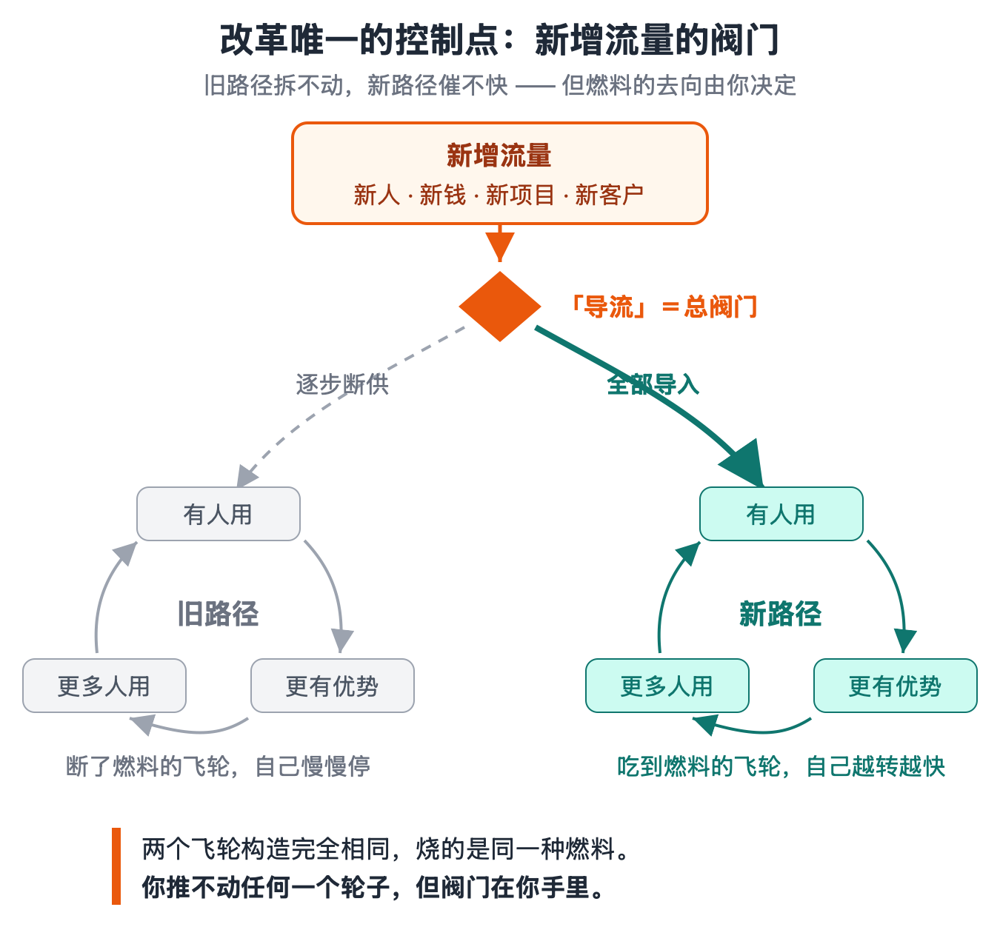
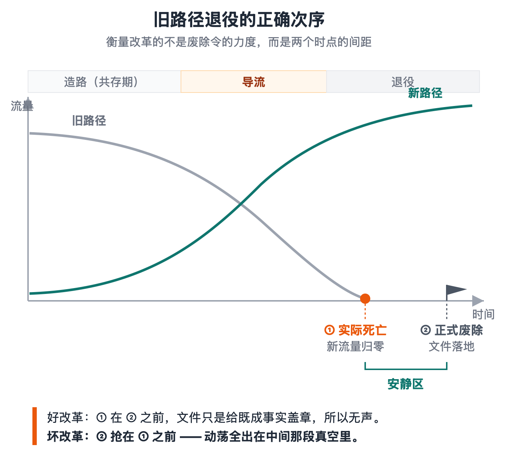
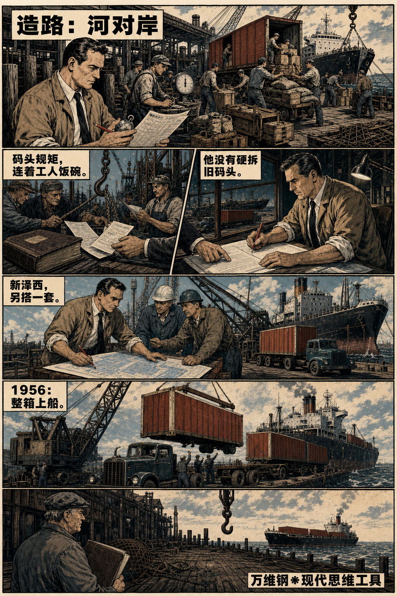
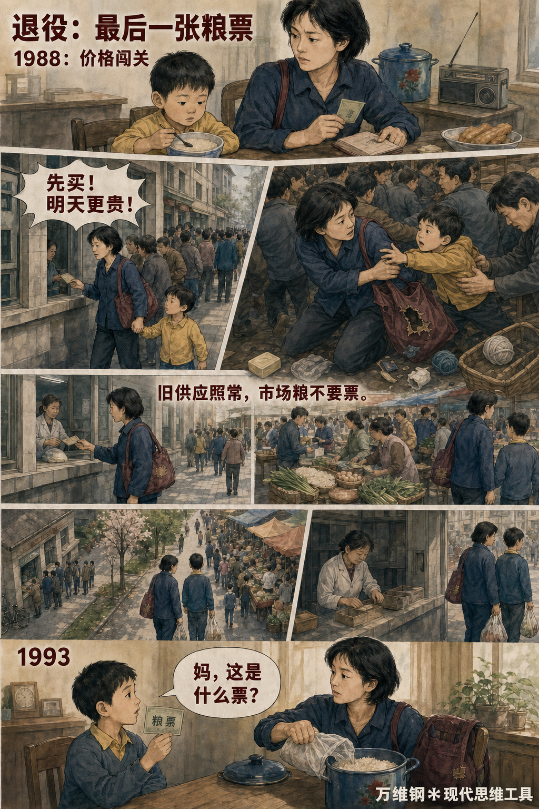
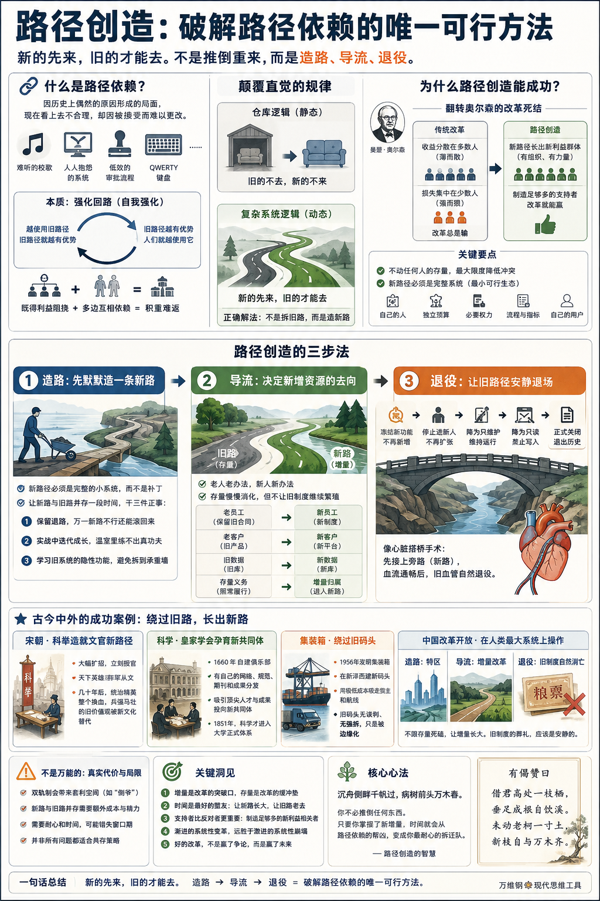

# 路径创造：破解路径依赖的唯一可行方法

[路径创造：破解路径依赖的唯一可行方法](https://www.dedao.cn/course/article?id=gpMLla6Py4qK25YAvzXYmvNzjd2Zx1)

2026-07-23 00:09

有个现象叫「**路径依赖**（path dependence）」，咱们前面讲「**对称性破缺**」的时候提到过，意思是因为历史上可能很偶然的原因形成的一个局面，现在看上去非常不合理，但是因为已经被众人接受而无法更改。

比如你们大学那首特别难听的校歌，公司里那套人人抱怨的系统，组织里效率极低的审批流程，还有那个经常被当作路径依赖案例、但优劣至今仍有争论的 QWERTY 键盘……它们未必同样糟糕，却同样很难更换。

我们本能的想法是推倒重来：正所谓“旧的不去，新的不来”，干脆壮士断腕！

但那是整理仓库的逻辑 —— 旧沙发不扔，新沙发确实进不来。可是公司、家庭、社会不是仓库，是运行中的复杂系统。复杂系统的规律恰恰相反 ——

新的先来，旧的才能去。

这一讲的思想工具叫「 路径创造 （path creation）」。它可能是破解路径依赖的唯一可行方法。

还是用反馈回路分析。不是所有历史遗留问题都叫路径依赖。有些事儿只是普通的惯性，领导一句话就能改。真正的路径依赖都是一个「**强化回路**」——

越使用旧路径，旧路径就越有优势；旧路径越有优势，人们就越使用它。

强化来自两个方面。一方面自然是既得利益集团：人家靠旧路径吃饭，你要改，他们当然反对。另一方面，是人们对旧路径已经形成了互相依赖。

比如你们公司的软件系统非常糟糕，大家天天骂，那为什么不换掉呢？你去挨个部门问问 ——

财务部说，我们当然想换，可采购的单据全在旧系统里，他们不换，我们换了也是白换。采购部说，我们倒是想换，可几百家供应商都按旧系统的格式对接，人家凭什么陪你折腾？IT 部说，新系统我们早就选好了，可业务部门不敢停机切换，出了事谁负责？

这里没有一个人拥护旧路径，可这是一个「多边」的局面，你没有办法协调所有人一起换。

坏事的长期存在甚至不是因为坏人，这才叫积重难返。

然后新员工入职，培训的是旧系统；新项目立项，走的是旧流程；新预算下来，投的是旧线路；新客户签约，签的是旧合同。只要这些新流量每天还在流进旧路径，你们就必须一天比一天更加依赖它。

正确的解法不是拆旧路，而是造新路。

「**路径创造**」这个词出自两位管理学者，宾夕法尼亚州立大学斯米尔商学院的拉古·加鲁德（Raghu Garud）和哥本哈根商学院的彼得·卡尔诺（Peter Karnøe）主编的一本 2001 年的书，书名就叫《路径依赖与创造》。这本书的目的就是跟路径依赖的宿命论版本唱对台戏。

加鲁德和卡尔诺认为**人不是历史的囚徒：身在旧结构中的行动者，完全可以进行「有意识的偏离（mindful deviation）」 —— 一边借用旧系统的资源，一边偏离旧系统的逻辑，拉上同伙，反复试验，给新事物争取长大的时间，硬生生养出一条新路。**

加鲁德和卡尔诺解释了新路径怎样从无到有。后来的组织研究进一步提出，要实现「路径打破（path breaking）」，也就是解除旧路径的锁定，最低标准，是动摇自我强化机制、把一度被锁死的选择空间重新打开。2023 年的这一项实证研究又证明了创造新路径可以打破旧路径。

我们把这个原理变成一套可操作的方法，具体是三个动作：造路，导流，退役。

**第一步，「造路」。不要招惹旧路径，先默默地造一条新路。**

新路径必须是一个完整的小系统，而不是旧系统上的一个补丁，这样它才能独立发展壮大。

我们要让新路跟旧路共存一段时间。这不是妥协，这是要干三件正事儿：一个是保留退路，万一新路不行还能滚回来；一个是让新路有机会在实战中迭代成长，因为温室里练不出真功夫；最重要的，则是学习 —— 旧系统往往看着愚蠢，却暗中承担着许多没人说得清的功能，你直接拆搞不好就拆到承重墙，并行运转一段才知道承重墙在哪儿。

**第二步，也是最核心的一步，是「导流」。**

改革首先争夺的不是旧资源，而是新增资源的去向。

简单说就是老人老办法，新人新办法。老员工可以保留旧合同，但新员工一律用新制度。老客户可以继续用旧产品，但新客户全部进新平台。旧数据留在旧库，新数据一律写新库。存量可以慢慢消化，但不允许旧制度继续繁殖。

**第三步，「退役」。等人们对新路径已经形成依赖，旧路径就可以逐项关闭了。**

这个次序是先冻结新功能，再停止进新人，然后降为只维护，再降为只读，最后才正式关闭。

整个过程很像心脏搭桥手术。冠状动脉堵了，医生不会把旧血管拆掉，他会先接上一条旁路，让血绕过堵点，继续流向心肌。其实人体自己也会这么做。如果冠状动脉是慢慢变窄的，周围那些原本很细的小血管就可能会逐渐变粗，提前分担供血，这就叫「侧支循环」。

只要新的能成功建立起来，旧的什么时候去已经不重要了。

为什么说路径创造的关键是导流呢？因为你没有动任何人的存量 —— 旧路照常运行，你甚至不必宣布它是错的。这就能最大限度地降低冲突。

我们前面提到过的美国经济学家曼瑟·奥尔森（Mancur Olson）在《集体行动的逻辑》一书中讲过改革的死结：改革的收益是分散在多数人身上，但是收益摊到每个人头上只有薄薄的一层，谁也不会为它冲锋 —— 可是改革的损失，却是集中在少数人身上。那些既得利益者组织严密，会拼死抵抗。

支持的人多而散，反对的人少而狠，所以改革总是输。

而路径创造翻转了这个不对称！新路径一旦运行起来，它就有了自己的员工、客户、供应商和投资人 —— 这是一批新的、有组织的、利益攸关的受益者。改革就有了自己的“既得利益集团”。

你不需要说服所有反对者，你只要制造足够多的支持者就行。

路径创造的另一个要点是，新路径必须是个完整的系统，是一个「最小可行生态（minimum viable ecosystem）」：有自己的人，有必要的权力，有独立的预算，有自己的流程和指标。

很多组织都搞过各种“试点”：创新中心、改革试验区、青年突击队 —— 可是新团队还接受旧指标考核，用旧审批流程，靠旧部门拨资源，没有自己的预算和用户。旧系统一断供就死掉，那怎么能行呢？

咱们看几个古今中外的成功案例。

先看**宋朝**。五代乱世的游戏规则是兵强马壮者为天子，赵匡胤本人就靠兵变上台的，他比谁都清楚路不能再这么走了。“杯酒释兵权”是用富贵赎买老将的既得利益，那将来新人怎么办呢？如果国家还是武将说了算，皇帝照样做不稳。

赵家的解决办法是给天下英雄创造一个新的上升路径：科举。

科举不是宋朝的新发明，但是宋太宗把科举从每科取士二三十人扩到几百人，其中太平兴国二年（977 年）一榜就取了五百多人，而且立刻授官。天下最有野心的人从此改变押注方向，弃军从文。

于是几十年后统治精英整个换血。五代时崇尚“兵强马壮”的价值观，已经被“东华门外以状元唱出者乃好儿”的新格言替代……而读书人能对国家有啥威胁呢？

再看**现代科学的出生。** 你可能以为科学革命应该发生在大学里，但一直到 17 世纪，牛津剑桥都还在注释亚里士多德，根本不教什么科学实验。

是 1660 年，一群实验爱好者在伦敦自建了一个叫皇家学会（Royal Society）的俱乐部，才有了第一个科学共同体。他们有自己的网络，建立了实验规范，出版了期刊，吸引到欧洲最好的头脑把最好的成果投给它而不是大学……

一直到 1851 年，自然科学才进入剑桥的正式考试体系。

还有**集装箱的故事**。1956 年，卡车商人麦克莱恩（Malcom McLean）搞出来了第一套用于航运的集装箱。集装箱运输的便利太明显了：货物装进统一铁箱，卡车拉到岸边，吊上船就走。当时人工散装一吨货要 5.83 美元，而用集装箱只要 0.16 美元。

但是码头工人有既得利益。纽约码头有上百年积下来的工种、行规和利益关系，你想跟人谈改革是谈不成的。

麦克莱恩的做法是在新泽西另建一套完全按照集装箱设计的码头。旧码头继续照旧……新码头则用低得惊人的成本，把货主和航线一点点吸走。

纽约的旧码头没有输掉一场谈判，也没有被谁强行关闭；它只是眼看着船越来越少，自己失去了存在的理由。

集装箱革命不是改造旧码头改出来的，而是绕过旧码头长出来的。

还有一个案例是**中国的改革开放** 。这是一套教科书级的路径改造，而且是在人类历史上最大的系统上操作的。

计划经济是那个年代地球上最深的路径依赖之一。它不是一项政策，而是一整套互相咬死的齿轮：统购统销咬着粮票，粮票咬着户口，户口咬着单位，单位咬着你的就业、住房、医疗、子女。每个零件都锁着别的零件，你动哪一个，都得先动另外五个。你怎么改？

苏联和东欧的做法是「休克疗法」：其实就是推倒重来，一夜放开 —— 结果大家都看到了。

中国没那么干。咱们回头看，人民公社、统购统销、粮票、计划价格，这些庞然大物没有一个是被正面攻克的 —— 它们后来确实都废除了，但每一个都是废在自己已经被抽空之后。

变化，全部发生在增量上。

**先看造路。**1979 年，广东省委提出想办出口加工区，邓小平说，可以划出一块地方，叫特区，“中央没有钱，可以给些政策，你们自己去搞，杀出一条血路来”。你看啊：不是杀进旧城，是杀出去 —— 到旧体制的边界之外建一座新城。深圳是个有一整套新规则的边界清楚的小空间。

**再看导流。**农村大包干是怎么搞的呢？“交够国家的，留足集体的，剩下都是自己的。”前两句是存量义务：计划轨道的征购一粒米不少。第三句是增量归属：超出计划的产量进入市场，归农民自己。没有废除统购统销，没有对抗国家计划，只是给增量换了个去向 —— 于是几亿农民干劲的闸门开了。

然后乡镇企业纯粹就是计划外长出来的：它不在国家计划里，不占国家投资，可是十几年间吸纳了上亿农村劳动力。连邓小平都说，乡镇企业异军突起，是“我们完全没有预料到的最大收获”。

在很长时间内，城市工业用的是「价格双轨制」：计划内的钢材还是平价，保证旧体系不断粮；计划外的增量按市场价交易。这个做法被经济学家认为是“没有输家的改革”。

连改革者自己也一度觉得，双轨制是不是太慢了？1988 年夏天，决策层决定长痛不如短痛，一步并轨放开价格，这就是“价格闯关” —— 结果是全国抢购成风，老百姓到银行门口排队把存款取出来抢购毛线、火柴、肥皂等一切东西……国务院迅速承认闯关失败。于是退回到增量渐进的路子接着熬 —— 一直到 90 年代初，市场轨的份额已经长到让计划轨无足轻重，才在 1992 年前后实现价格并轨……这一次几乎没有任何动静。

改革操作得好，旧制度的退役就是这样悄无声息。1993 年，全国各地相继取消粮票 —— 这可是运行了 38 年、每个城里人贴身携带的东西 —— 结果举国波澜不惊。

因为粮票早就已经没有流量了。

旧制度的葬礼应该是安静的，因为葬礼从来都在死亡之后。

人们把改革开放的智慧总结为“摸着石头过河”。其实更精确的总结是不跟存量死磕，让增量长大。

如果鸡飞狗跳，就不是好改革。邓小平甚至连意识形态的仗都不打，他说：“不争论，是我的一个发明。不争论，是为了争取时间干。”

路径创造不是万能的，它有真实的代价：比如中国实行价格双轨制期间，计划和市场两套规则之间就是权力的套利空间 —— 80 年代的“倒爷”就是双轨制的影子。旧路径退役是必须的，而且我们希望它越早越好，但这总比直接推倒重来好得多。

带着毛病改总比不改强，更比革命强。**革命会制造秩序真空，而真空里最先长出来的往往不是最好的东西，而是最狠的东西。**

沉舟侧畔千帆过，病树前头万木春。这个世界好就好在它允许旧事物消亡，这样新事物才能不断产生。

你不必推倒任何东西。只要你掌握了新增量，时间就会从路径依赖的帮凶，变成你最耐心的拆迁队。

**【有偈赞曰】**

> 借君高处一枝栖，  
> 垂足成根自饮溪。  
> 未动老柯一寸土，  
> 新枝自与万木齐。

