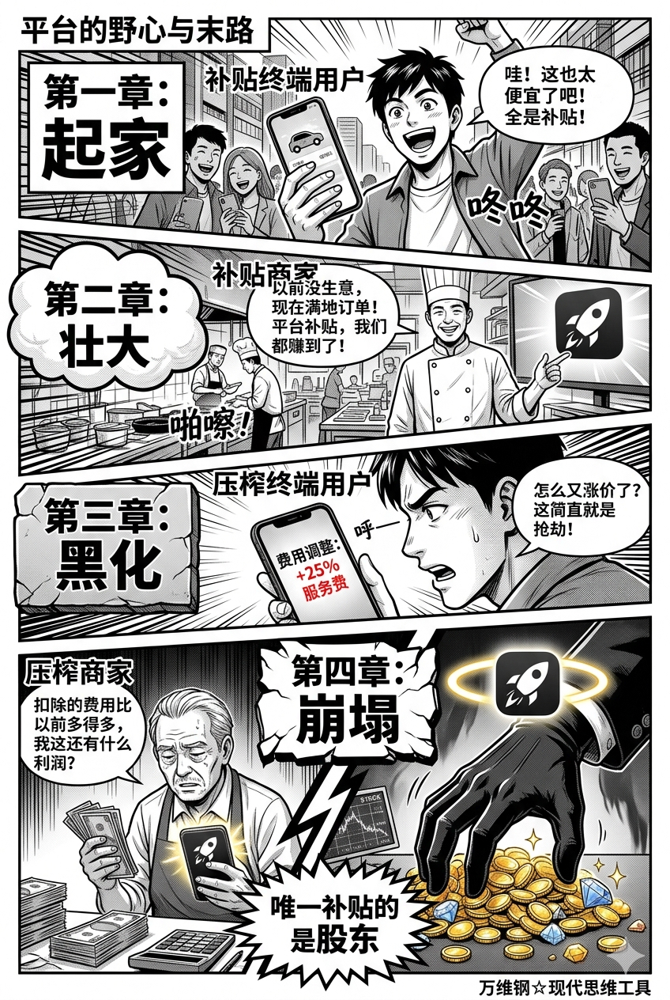
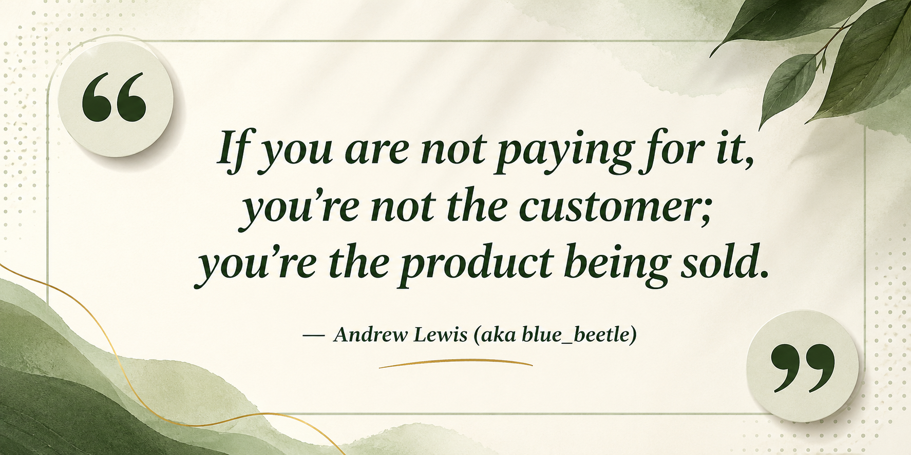
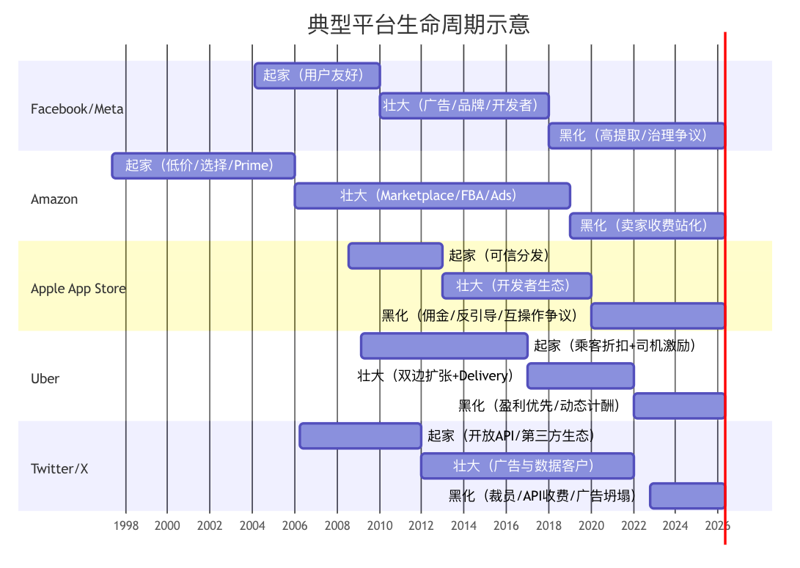

# 平台：现代世界最厉害的商业模式

[平台：现代世界最厉害的商业模式](https://www.dedao.cn/course/article?id=zk8vQM4oYjrXm1WMa1Xw6bEOLl5GPx)

2026-06-02 00:12

我们已经讲了很多赚钱的原则和方法，但有一个事实你可能没意识到：**传统意义上那种“我开个店、做个产品、摆到市场上直接卖给顾客”的赚钱模式，现在已经非常罕见了。**

现在你是淘宝开店也好，抖音带货也罢，甚至哪怕在街头开一家普普通通的餐馆想要连接顾客提供点餐外卖服务，都需要通过某个「平台」。

**起初，这一切就像是个科技乌托邦。**平台说它是来消灭中间商的！咱不但不让中间商赚差价，而且让你免费使用服务，还给你发红包，还有各种补贴！你只要把自己的商品做好就行，平台替你操心物流和库存！你只要专注于服务用户就好，平台帮你匹配用户！它提供了搜索、广告、信任评分甚至社交，它让信息变得史无前例的高效。

你心想，这可真是新商业文明，天下哪还有难做的生意？

……但是这几年，人们对平台的观感变了。商家抱怨抽成越来越高，买家发现搜出来的全是广告，外卖小哥被困在算法里。

以前的中间商是倒买倒卖，可今天的平台管入口、管排序、管评价、管流量……乃至于管生死。它赚的的确不叫差价 —— 得叫秩序。

这一讲要说的是：**平台不是一种普通的生意，而是现代商业史上的终极捕食者：它把“市场本身”变成了自己的商品。平台通过算法决定谁能被谁看见，这原本是不该属于商业玩家的权力。**

平台之所以这么厉害，是因为它是一个「**双边市场**（two-sided market）」。

传统生意都是单边的。比如说你开个面包店，你只需要面对买面包的顾客就可以了。但平台，却是要同时面对两边、甚至多边：卖家和买家，司机和乘客，餐馆、骑手和消费者，开发者和用户，内容创作者、广告商和观众……

这使得平台生意特别难以启动。你说我这是个卖货平台，可是如果没有商家，消费者就不会来；没有消费者，商家也不会来。你必须动员两边才行。但也正是因为这个特点，平台生意只要做大了，别人就很难跟你竞争了，你就可以独大。

难启动怎么启动呢？最常见的打法是先提供完全免费的服务，甚至给新用户发补贴 —— 说白了就是烧钱获客。

你可能还记得十多年前移动互联网经济刚开始时候的种种美好景象：叫个滴滴专车，打车费比出租车都便宜；几毛钱就能扫一辆共享单车。一直到今天，有时候几个外卖平台爆发战争，还会疯狂给消费者补贴，搞个什么免费奶茶。

VC 会说烧钱是值得的，因为这里有个「**间接网络效应**（indirect network effects）」。买家越多，卖家越愿意来；卖家越多，买家越愿意来；司机越多，乘客越容易打到车；乘客越多，司机越愿意上线 —— 这是一个边际效益递\*增\*的过程：商家也好消费者也好，每多一个用户，平均每个用户的价值就越高，新用户就越值得来，老用户就越不愿意离开。

**所以补贴不是做慈善，而是解决“先有鸡还是先有蛋”的问题。**

等到商家和消费者都来了，平台还会得到第二个边际效益递增过程，那就是「**数据—算法反馈飞轮**（data-algorithm feedback loop）」：用户越多，数据越多 → 数据越多，算法越准 → 算法越准，匹配越好 → 匹配越好，用户更多。

我们前面说了，赚钱一定要有杠杆，要规模化 —— **间接网络效应和数据—算法反馈飞轮就是平台最强的杠杆**。平台的规模化是个自己喂养自己的正反馈过程，是指数增长……它唯一的限制就是全国、或者全世界人口总数。

这就是为什么硅谷也好，中国也好，那些科技大厂能雇佣那么多的高学历人才，还能给每个人发那么高的工资。

**平台，是人类历史上新出现的超级赚钱组织。**

你说行吧。平台一旦有了最多的用户、最好的数据和最强的算法，别人就难以与之竞争了。那你们就好好做个现代商业的基础设施，也不用再补贴了，就好好收取一个公正的利润，服务大众呗？

现实可没有这么简单。**如果你拥有那么大的力量，你不会满足于好好做个基础设施。**

你会开始收割。

加拿大科技思想家科里·多克托罗（Cory Doctorow）专门发明了一个词，叫「**Enshittification**」，形容平台从起家到堕落，从服务用户到收割用户的过程。这个词后来被美国方言学会选为 2023 年年度词汇，我们翻译得文雅一点，姑且称之为「**衰败化**」。

一个这么新的商业模式，一开始人人都喜欢，怎么这么快就人人喊打了呢？多克托罗专门写了本书讲这个过程：先讨好终端用户；然后牺牲终端用户、讨好商业客户；最后牺牲商业客户，把价值收回给自己。

**第一阶段是起家，主要打法是补贴终端用户。**

凭借巨额风险投资，平台为了发挥间接网络效应，会不惜代价地为终端用户提供远远低于成本、甚至经常是完全免费的优质服务。

当初 Facebook 还在跟 MySpace 竞争的时候，它不但没有广告，而且不监控用户隐私，在时间线上只展示你主动订阅的信息，没有任何作恶的迹象。亚马逊卖的书比书店便宜得多，而且只要每年花 79 美元成为会员，就给你全年免运费。早期的 Twitter 是个完全开放的应用程序接口，第三方开发者可以随意访问它的数据，很多用户把 Twitter 当成自己的东西，帮它发明新功能……

起家期的平台就如同新到占领区的统治者：修路、免税、发补贴、微笑服务。只要你们愿意来就行……最好把你们的社交关系、购物习惯、支付记录、内容资产和工作流全都搬来。

**第二阶段是壮大，主要打法是补贴商家。**

不是有那么句话吗？「**如果你没有付费，你不是消费者，你其实是产品。**」

锁定了足够多的用户以后，平台就开始把用户当资产卖给商家：我这里有海量用户，你们要不要来？你们来，我不但只收取很低的抽成，而且我还给免费流量！于是卖家、广告主、APP开发者和主播们都来了。

私下里，平台正在对终端用户做手脚。Facebook 向广告商提供精准的定向广告服务，并且允许一些未经订阅的媒体文章出现在用户的时间线上。苹果默许了第三方应用的商业监控行为。Twitter 为了配合一些国家的审查要求，牺牲了当地用户的言论自由和隐私安全……

但平台的形象仍然非常正面。它给小商家机会，给创作者舞台，让消费者继续享受低价，同时投资人看着股价接连往上涨，每个人都很高兴。

可是谁买单呢？

**这就迎来了第三阶段，黑化。平台开始压榨买卖双方，现在享受补贴的只有股东。**

消费者看到的是更多的广告、更差的搜索体验和更少的真实选择；商家面对更高的抽成、更贵的广告费和更复杂的规则；创作者发现如果不买流量，连自己的粉丝都看不见自己；开发者感觉自己是在给应用商店打工……

但是平台的网络效应已成。曾经的竞争对手要么已死，要么达成了平衡：消费者和商家都已经很难逃走了。

下面这张图是 GPT 按照多克托罗书中口径展现的美国五个大平台，从起家到壮大、再到黑化的时间历程 ——

**我们曾经以为互联网的精神是自由和免费，现在我们得到的是控制和压榨。**

别误会，平台对人的控制和压榨跟古代官府可不一样。这里不涉及任何暴力，平台没有权力强迫你做任何事，你任何时候都有选择 —— 但是它会默默地影响你的选择。

平台的武器是算法。平常不会派一个真人来管你，而且也不在意你这个具体的人接不接受它的管理 —— 它只需要在宏观概率上影响群体的选择，就够了。

比如外卖小哥和网约车司机。他们被包裹在一种叫做「**零工经济**（Gig economy）」的灵活性幻觉里。你不需要上班打卡，你想什么时候开工就什么时候开工，想什么时候收工就什么时候收工，对吧？

可是算法正在监控你的每一秒钟，它会计算你的路径，会给你倒计时，会根据你的表现决定你的派单权重。如果你超时或者用户评分低，你会被罚款；如果你完成的单数多，你会得到奖励，而奖励是给你更多、更值钱的订单。

一个最极端的做法，是比如 Uber，会根据你的接单情况判断你有多么迫切地需要钱：一旦你被认定“什么单子都接”，算法就会自动把利润最低的单子扔给你。这难道不是对弱者的打压吗？

对消费者，平台更不会手软。首先是价格歧视，也就是所谓「大数据杀熟」：经常有老用户说看到的价格比新用户更贵；有人说你搜索机票的次数越多，得到的价格反而会越高，因为算法认为你的支付意愿强。

另一个办法是压缩你的选择。同样的搜索，平台想让你看见的会放在第一排，不想让你看见的会排到很后边。默认选项是什么，取消按钮藏在哪里，优惠券怎么设计，这些都是操控。而你还以为那是你自己的偏好。

对商家，平台更是连装都不装，直接理性对话。不但抽成明明白白提高，而且你要想被消费者看见，还得交广告费、服务费和活动费，你必须购买流量 —— 你的存在感，现在是一个收费项目。

而就在控制和压榨的同时，平台甚至不需要给外卖小哥交退休金、买保险，更不需要承担商家的盈亏 —— 它说它只是在提供一个“撮合服务”，它卖的只是信息。可是它默默地拿走了你们劳动成果的大头。

我们讲真正赚钱都得收「**经济租**」，请问还有比平台更厉害的租吗？

如今我们已经离不开平台。

**你必须承认，平台创造了巨大的价值。**它让小商家能把一种非常小众的商品卖到哪怕是非常偏远的地区，它让独立开发者触达全球用户，它提供了巨量的就业。而且我们至今找个信息、用个地图，仍然是免费的。**平台是现代经济的基础设施。**

但平台也是下场跟服务对象争利的基础设施，而且它对服务对象有相当的控制权。这已经不是纯粹的市场经济，也不是资本主义，这等于是占山为王！所以有人称之为「**技术封建主义**（technofeudalism）」。

那怎么办呢？法律和政府监管肯定很重要，特别是反垄断。以前我们对垄断的定义是你占领了市场之后提高价格。但对于平台，我们必须重新理解价格 —— 消费者不花钱，不代表消费者没有付出成本。欧盟的《数字市场法》（Digital Markets Act, DMA）把大型数字平台称为「**守门人**（gatekeepers）」，关键思路就是限制入口权力被滥用 。中国也在通过《个人信息保护法》和《互联网平台价格行为规则》监管平台。

多克托罗和其他学者特别推崇的一招，是「**互操作性**（interoperability）」。简单说就相当于手机的“携号转网”：为了确保平台不能把用户关在自己的城堡里，应该立法规定如果用户选择离开一个平台，他可以带上自己所有的数据，包括社交关系、购买记录和内容资产离开，可以带着自己的用户和粉丝关系迁移到这个平台的对手那里。说白了就是要“拆墙”，促进平台之间的竞争。

有的网约车司机同时开几部手机，在几个平台上一起接单，这就对了。**平台从来没有忠于你，它自然没有权利要求你忠诚于它。**

算法不是自然规律，而是人写出来的制度。人不是数据接口，更不是算法的奴隶。

当前的空气是越来越多的人开始对平台警觉，这是一个好消息，说明人不是那么好摆弄的，自由市场还有希望。

平台是当今世界最可怕的赚钱机器。我们必须确保它只是一个好用的工具，而不能是一个特别会算账的主人。

---

> AI 会不会成为新一种的 “平台”？

**现在一切都很难说，但已经有迹象表明，AI 时代在一定程度上可以让消费者越过平台，直接跟商家对话。**

举个例子：

1. 各个航空公司在官网设置 API，直接实时更新机票价格
2. 政府规定航空公司机票在任何一个时间，必须对所有人同价 — 但是允许你的价格随时间波动

**以前你需要一个平台把所有价格组织在一起，现在可以由 AI 直接到各家官网去抓取价格，为你制定旅行计划。这样平台就没有意义了，在这件事上直接绕过了平台，回归生意的本质：货比三家。**

---

我觉得 Cory Doctorow 的 enshittification 最有解释力的地方，不只是把平台衰败分成三段，而是点出了一个更冷的机制：**当各方都跑不掉以后，收割就会变成理性选择。**

平台一开始对用户好，用低价、免费、方便、好体验，把用户的数据、关系和习惯都吸进去。后来它把这些用户变成资产，拿去吸引商家、广告主和创作者。等两边都被锁住以后，平台才开始真正抽水：用户看到更多广告、更差搜索，商家必须买流量才能被看见，创作者甚至连自己的粉丝都触达不了。

所以**问题不只是平台老板变坏了，而是约束慢慢失效了。**竞争少了，监管跟不上，互操作性被掐断，用户的数据和关系带不走，商家的客户也不真正属于自己。到了这个阶段，平台要做的不是把你服务好，而是精确计算：给你留下多少价值，刚好让你骂归骂，却还不离开。

用平台当然必要，今天几乎没人能完全绕开。危险的是另一件事：把客户关系、内容资产、支付路径和品牌入口，全部交给平台保管。那一开始看起来省力。省下的是眼前的力，押上的却是以后某一天，平台一翻脸，你得花钱把自己的顾客重新买回来。

——常觉不在

---

平台用算法研究我们、影响我们、诱导我们形成习惯，但我们完全可以反过来理解算法，不轻易把自己的选择权交出去。

我平时买菜会同时打开几个 App 比价，挑便宜、优惠多的下单。但我不会轻易成为某个平台的会员，也不会因为看了一次就立刻下单。有时候，我连续几次只浏览不购买。过一段时间，平台为了把我拉回来，就会发一个金额较大的红包，这时我再用优惠下单。用完之后，我又回到比较和观望的状态，等待下一轮 “对我的引诱” 出现。

支付环节也类似。有的平台会提供一个诱人的默认支付选项，比如立减 2 元。我会接受这个优惠，但支付完成后，会立即取消它的优先地位。等过一段时间，平台为了重新争取我的支付习惯，又会推送新的折扣，我再按需选择。

单车会员同样如此。例如连续包月原价 30 元，第一个月优惠到 21 元，我先开通享受优惠，然后及时取消续费。会员到期几天后，平台通常会推送新的续费优惠。这样做不是为了占平台便宜，而是提醒自己：不要被 “自动续费” 和默认选项牵着走。

**普通用户的反抗，不在于完全不用平台，而在于不要被平台绑定。能比价就比价，能取消自动续费就取消，能保留选择权就保留选择权。平台把我当数据，我把平台当工具。**

——左星星

---

我的手机下单买任何衣食住行的产品都比我娃的贵，平台像长了一只后眼睛时刻盯着我的后脑门，它知道下单不比价，秒速支付秒速离开，所以，杀熟就是活该。

这要是以前小卖铺老板这样干，我肯定不去他家。

然而，现在没得选，你出了 A 的坑又进了 B 的窝。谁让人家承载了你的衣食住行。

我有时候想过这个问题，多看看，可一不小心个把小时过去了，买个 30 块钱的东西收割了我的时间成本，更贵。

算了吧，努力去多赚点钱更实在。话说平台欺负我确实可恨，而我，没有反抗的本事，最后卷自己当更累的牛马。

——孟华静 Meng Huajing

---

平台走向黑化几乎是必然的，这不能怪罪于某个企业管理者品德败坏，这是平台经济的商业模式所决定的。

在平台发展的早期，平台的成功取决于用户数的增长和满意度，在这个阶段，平台会不遗余力地讨好用户。

等到平台的增长见顶，平台就需要从每个用户身上攫取广告费、佣金和抽成。此时他不需要讨好你，他只需要算计你。

他拿捏你的原因就在于网络效应和转移成本。当你把社交关系，购物习惯，内容资产，甚至工作流都搬到了平台上，你只能任人宰割。

当然，抑制平台黑化不是要抑制平台发展，而是要防止它用现有的市场地位来扼杀未来的竞争者，以及剥夺用户的基本权利。

**在政治学上，对任何掌握巨大权力或资源的人，与其寄希望于他的道德自觉，不如建立有效的制衡和监督机制更为可靠。**

——李盈

---

土地对于农民而言，算不算也是一种平台呢？《人类简史》里说，人类种植了小麦，但小麦也驯化了人类，其实就是土地用粮食把人类锁死在同一片土地上，前期的翻土、种植，都是已经投入的成本，要迁移出去就变成了沉没成本。

土地、粮食不是主动构建的平台，只是人类对确定性、舒适感的依赖，锁死了很多迁移的可能性。

——橘子同学