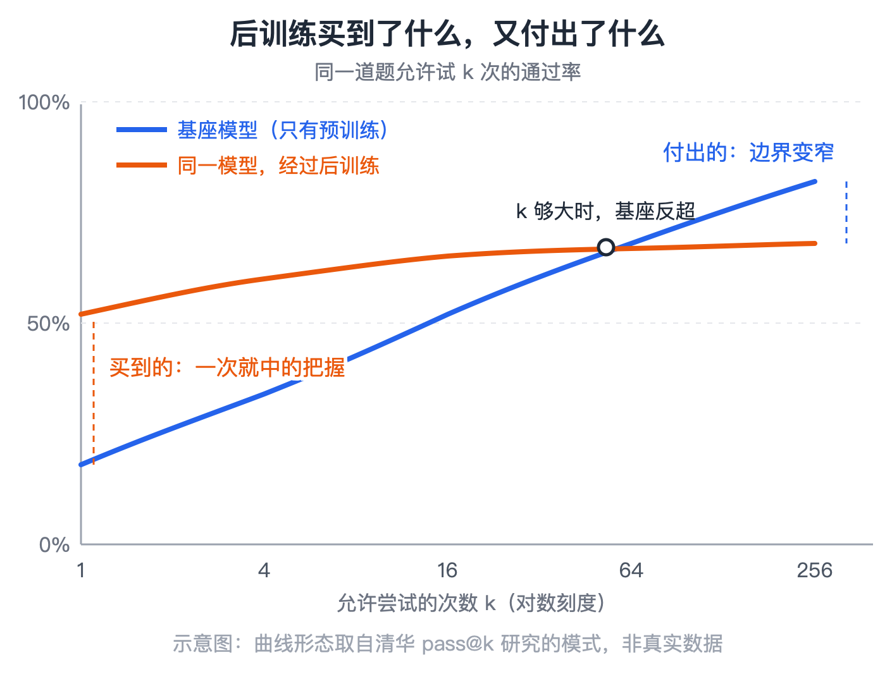
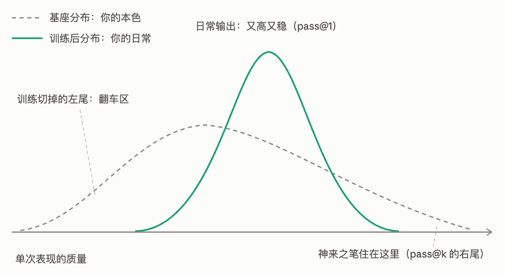
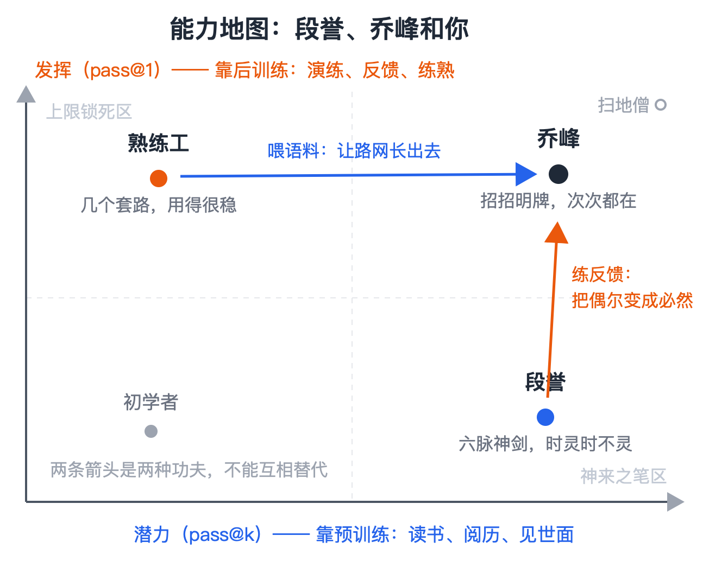
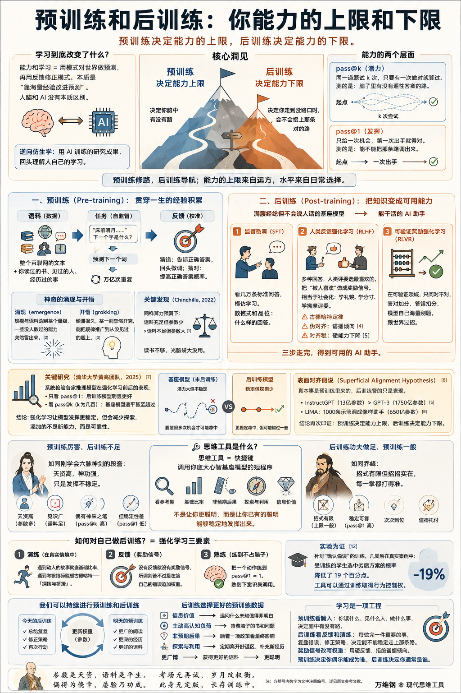

# 预训练和后训练：你能力的上限和下限

[预训练和后训练：你能力的上限和下限](https://www.dedao.cn/course/article?id=qzNakylrn9WVaZWmyNJ7DOop10vZwL)

2026-08-07 09:08

这是现代思维工具课的第 99 讲，我们说一个关于思维工具的思维工具： **学习，到底是怎样改变一个人的能力的？**

我们已经讲过一些学以致用的方法，比如「拥抱与桥接」。但你仍然会想：我学了这么多思维工具，它们到底把我变成了什么？往后我还应该读什么、练什么？

这种问题搁以前都只属于人生感悟，各人有各人的说法，但现在我们可以从 AI 的训练中获得启发。

世界的知识在人脑中无非是各种模式。能力和学习无非是用模式对世界做预测，再用反馈修正模式。神经网络做的无非就是“靠海量经验改进预测”。在这个意义上人脑和 AI 没有本质区别。

人类琢磨自己怎么学习琢磨了上千年，成果可能都没有最近几年对 AI 学习的研究来得深刻。因为你不能拿人，但是可以拿 AI 做快速实验。一个方法有没有效，你改个训练条件跑个分，立见高下。

这一讲咱们搞个“逆向仿生学” —— 用 AI 训练的研究成果回头理解人自己的学习。

当然这只是类比，人脑和 AI 的技术细节并不相同……但这是目前关于“学习到底有什么用”最有启发性的理论。

✵

现在的 AI 大模型是怎么训练出来的呢？咱们不妨暂时忽略技术细节，把它当成一个人的成长故事。

模型的「参数规模」相当于大脑的容量：参数总量越多，能装下的模式就越复杂。这大约等于人的天资，属于出厂硬件。

「 预训练 （pre-training）」，是把语料 —— 相当于整个互联网的文本那么多的语料 —— 一段一段喂给它，让它做一件看起来很笨的事：预测下一个词。“床前明月……”下一个字是什么？猜错了，就告诉它正确答案，让它回头微调相关参数（也就是「权重」）；即使猜对了，也还要继续把正确答案的概率往上推一点。它不是在被奖惩，它是在被校准。

“预测下一个词”这个动作要重复几万亿次……那么神奇的事情就慢慢会发生：预测会逼出理解。

要能把下一个词猜准，光背字典是没用的，你得懂语法，懂事实，乃至于懂因果，甚至得懂人情世故 —— 小说里这个角色接下来会说什么话，取决于他的处境和性格。模型就在这一次次的预测中，建立了世界观。

对应到人身上，预训练就是贯穿一生的经验积累：你读过的所有书，见过的所有人，经历过的所有事，都是你的训练语料。

语料必须喂足。DeepMind 在 2022 年的一项著名研究（代号 Chinchilla）中发现：同样的算力预算下，一个参数较少但语料充足的模型，能胜过参数大得多却训练不足的模型。说白了就是如果一个人读书不够，光脑袋大是没有用的。

只要参数多，语料管够，你练着练着，就会发生两个人们难以理解的事情 ——

一个是「 涌现 （emergence）」：模型的规模和语料到了某个量级，一些没人教过的能力突然自己冒出来了。

一个是「 开悟 （grokking）」：2022 年 OpenAI 的研究者发现，让模型反复死记硬背一小批数据，它很快就背得滚瓜烂熟，可一遇到没见过的题照样抓瞎；但如果你就这么继续硬灌，灌了很久很久，忽然某一刻它开窍了 —— 它能把规律推广到从没见过的题上了。

你说这是神经网络的必然规律也好，说这是大自然的馈赠也罢，总之是“读书百遍，其义自见” —— 如果没有涌现和开悟，关于大模型的一切就都不成立。

✵

好，预训练完成，我们得到一个「基座模型」。这个东西满腹经纶，但是不着调。你问它“法国的首都是哪儿”，它可能老老实实回答，也可能不答，反而顺着你的话往下出题：“德国的首都是哪儿？意大利的首都是哪儿？” —— 因为它这辈子只学过接龙。

它什么都知道，可它不会跟人打交道。因为它不知道人想要什么。这是否让你想起某些书呆子。

所以我们需要「 后训练 （post-training）」，把这个满肚子学问却不会说人话的家伙调教成能干活的人。后训练一般分三步 ——

**第一步，「监督微调（SFT）」：** 给它看几万条精心写好的标准问答，让它模仿。这相当于师傅带徒弟，我做一遍你跟着学一遍。这一步教的是格式和品位：什么样的回答算好回答。

**第二步，「人类反馈强化学习（RLHF）」** ：让它对同一个问题生成好几个回答，由人类评委挑出最喜欢的，把“被人喜欢”做成奖励信号。

这相当于人的社会化：学礼貌，学分寸，学揣摩评委 —— 如你所能想见，这里有古德哈特定律，有伪对齐：2023 年 Anthropic 的一项研究在多家 AI 助手身上都观察到了“谄媚倾向”，也就是 AI 专门说评委爱听的话，去迎合人类 [4]。

那你说，一个说话特别谄媚的人，工作能力会不会因此而下降？没错！行内有个词叫「对齐税」：模型为了对齐人类偏好，某些硬能力会下降。你想让他说好听的，但你又不想让他只会说好听的；你想让他说真话，但你有时候又听不得真话……训练 AI 跟培养年轻人不是一样的道理吗？

**第三步，「可验证奖励强化学习（RLVR）」** ：在编程、数学、下棋这些结果能够自动验证的领域，不问人喜不喜欢，只问对不对。答对加分，答错扣分，让模型自己海量刷题、跟世界过招。

这三步不一定按固定顺序……三步走完，一个可用的 AI 助手就诞生了。

✵

现在关键的问题来了：这三步后训练，往模型脑子里添加了多少新能力？

答案绝对出乎你的预料：几乎没有。

什么叫有能力，AI 工程师有两个常用指标 ——

一个叫「pass@k」：同一道题让模型试 k 次，只要有一次做对就算过。它测的是这个模型脑子里\*有没有\*一条通往答案的路 —— 哪怕一百次里只走通一次，也算有路，也算有这个能力。

另一个叫「pass@1」：只给一次机会，第一次出手就得对。它测的是模型能不能在任意时刻把那条对的路调出来。

说白了，pass@k 测的是潜力，pass@1 测的是发挥。

2025 年，清华大学黄高（Gao Huang）团队做了一项引发轰动的研究。他们系统检验各家推理模型在强化学习前后的表现，结果是：如果只看 pass@1，经过后训练的模型明显领先于没有经过后训练的基座模型；可是如果看 pass@k，当 k 是几百的时候，基座模型却追平、甚至超过了后训练模型。

啥意思呢？后训练之后模型稳定会做的那些题，基座模型本来就会做 —— 只要你肯给它几百次机会，它总能做对一次，只不过发挥很不稳定。

换句话说，强化学习的作用只是让模型发挥更稳定而已 —— 而这个稳定是有代价的：为了稳，模型老在那几条得分的路上走，等于是减少了探索，以至于有些原本有可能做对的题，反而做不出来了。

强化学习添加的不是新能力，而是可靠性。

此前 OpenAI 和 Meta 已经给过类似信号：13 亿参数的 InstructGPT 经过后训练，在人类偏好中胜过 1750 亿参数的 GPT-3；LIMA 则只用 1000 条精选示范，就把一个 650 亿参数的基座模型调成了像样的助手。

研究者对此有个说法叫「**表面对齐假说**（Superficial Alignment Hypothesis）」：真本事是预训练里来的，后训练管的只是表现。

把这些证据放到一起，就是这一讲的核心洞见 ——

**预训练决定能力的上限，后训练决定能力的下限。**

预训练决定你脑中有没有路；后训练不修新路，它只决定你走到岔路口的时候，会不会拐上那条对的路。

✵

用过 Claude Fable 的人都说，它有一种“大模型的味道”：一种厚重感，仿佛它见过的世面比别的模型多一个量级，以至于时不时露一手神来之笔。这就是预训练的真功夫。

什么叫“读书破万卷，下笔如有神” —— 万卷是语料，神是 pass@k。

有些人认为能用的语料已经快用完了，预训练即将没有文章可做 —— 但我跟 Anthropic 一位在一线负责预训练的工程师私下聊，他们认为预训练的 scaling law（规模定律）并没有结束。听说 OpenAI 下一代模型可能就是基于更大的预训练基座。

不过话说回来，后训练里的 RLVR —— 也就是不问人喜不喜欢，只按答案客观上对不对来奖励模型 —— 如果训练得足够久，又能保持探索，也可能推高能力上限。

总而言之，预训练厉害、后训练不足的模型，就如同刚学会六脉神剑的段誉，要天资有天资，要神功有神功，只是发挥不稳定。

而预训练上限一般、后训练功夫做足的模型，则是乔峰：降龙十八掌统共十八招，招招都是明牌，他每一掌都打得实、打得准、次次都在。

✵

那你说我们这门课讲的这些思维工具，算是什么呢？

如果一个概念你以前闻所未闻 —— 比如你第一次听说「路径依赖」，第一次知道世上有「幂律」 —— 这些可以算是新语料。但这样的知识实在太少了，预训练可不能指望这么点东西。

大部分思维工具不是新知识。你把任何一个工具拆开看，每一步你都懂。思维工具的作用是把你脑子里本来就有的东西打包成一个自动化的短程序。

比如我们讲过“看参考类”，只有四个字，可这四个字一旦启动，就能调用你多年积累的案例库、你对统计学的理解、你对幸存者偏差的警觉。

思维工具是调用你庞大心智基座模型的快捷键。

所以我认为，学习思维工具的本质，是给自己做后训练。它并不是让你变得更聪明，而是让你已有的聪明能够稳定地发挥出来。

✵

如果你不是天才艺术家，学了思维工具也不会把你变成天才艺术家。你先得有足够的预训练，才能让后训练发挥作用。

一个从来没摸过生意的人就算把“网络效应”“边际成本”这些概念背得滚瓜烂熟，可能也不知道咋用；而一个读过大量公司史、亲手管过账的人，一听到「软预算约束」，这个词就会像一道闪电，把他的经验一下子点亮。

工具不是经验的替代品，工具是经验的压缩算法。

而且后训练是要真练的，光知道不行。有多少人说起来什么「凯利公式」、「选择偏差」、「前景理论」头头是道，可一旦涉及自己的利益、地位和作品，这些工具一个都没被调用。他不是不会，他是 pass@100 会，pass@1 不会。

你可能说，保下限有啥意思？可要知道人生的要害处考的全是 pass@1。面试、谈判、危机时刻往往都只给一次机会。你能确保 pass@1，你才是可「托付」的。

怎么练呢？后训练的关键手段就是强化学习 ——

**第一，要在真实的情境中演练。**遇到动人的故事就查基础比率，遇到考核指标就想古德哈特 —— 「拥抱与桥接」。

**第二，一定要有反馈。**没有反馈就没有奖励信号，所谓刻苦也不过是在给自己的错误追加权重。

**第三，要足够熟，熟到不占脑子。**要把一个动作练到 pass@1 ≈ 1。

练习真有用吗？有实验为证。

2019 年，三位行为科学家给 290 名来自三个专业项目的研究生做了一次专门针对「确认偏误」的训练。这个概念你熟吧？我们提到过好几次，甚至不用专门讲。

几个星期后，这些学生遇到一个以挑战者号航天飞机发射决策为原型的复杂商业案例。事先没有任何预告，也没人提醒他们“可以考虑使用几周前学的那个思维工具”。结果，受过训练的学生更不容易落入确认偏误：他们选中劣质方案的概率低了 19 个百分点。

19% 不是脱胎换骨的变化，这些学生的 pass@1 并不高。但这个研究至少说明，思维工具可以通过训练取得行为控制权：换了场景，没人提醒，工具自己启动了。

✵

我们比当前 AI 好的一点是，我们可以持续进行预训练和后训练。

AI 模型都有版本号：训练完，权重一冻结，一发布，它这辈子就这样了，再进步就得等下一代模型。人没有版本号。人的权重永远是热的，你今天的每一次后训练都会更新你的参数。

而且今天的后训练就是明天的预训练。

这些思维工具一旦用熟，就会开始替你挑选下一批预训练数据。装上「信息价值」，你会追问什么未知值得花时间弄明白；装上「主动高认知负荷」，你会主动去啃费脑子的书和问题，而不只吃容易消化的信息；装上「非预期后果」，你会顺着一项政策往后追，看它最终带来了什么；装上「探索与利用」，你还会定期离开熟悉领域，给自己补充新的经历。

你会更广博，那么你就会真的变得更聪明。

✵

这门课的一条线索是凡事都可以“工程化”解决。我们总想把听起来靠悟性解决的问题拆成机制，再把机制变成可操作的动作。

学习正是如此。学习不是一种情怀，甚至主要不是一种努力 —— 学习是一个工程问题：语料的质量，反馈的来源，演练的强度，奖励机制的设计。

高喊什么“我要成长”、“我要精进”、“我今年要读 50 本书”，没有任何意义。

一切必须落实到预训练和后训练。**预训练看输入：你读什么、见什么人、做什么事，决定脑中有没有路；后训练看反馈和演练：每做完一件重要的事，记下哪儿错了、为什么错、下次怎样改，再在下一次行动前重新调用，决定你能不能稳定走上那条路。**

奖励信号的作用不是提供情绪价值，而是改写权重。拿点赞、掌声、领导的夸奖做奖励，你练出来的是迎合评委的谄媚倾向；拿作品、结果和真实世界的硬反馈做奖励，你才会既提高下限，又不断得到推高上限的新语料。

预训练决定你\*偶尔\*能成为谁，后训练决定你\*通常\*是谁。

我们学这么多思维工具不是为了在脑子里摆一百件兵器。是为了有一天命运突然出题 —— 只出一道，只考一次 —— 你不用翻书，也不用等灵感，能稳稳接住。

**【有偈为证】**

> 参数是天资，语料是平生。  
> 偶得为侥幸，屡验乃功成。  
> 考场无再试，岁月改权衡。  
> 此身无定版，长存训练中。

