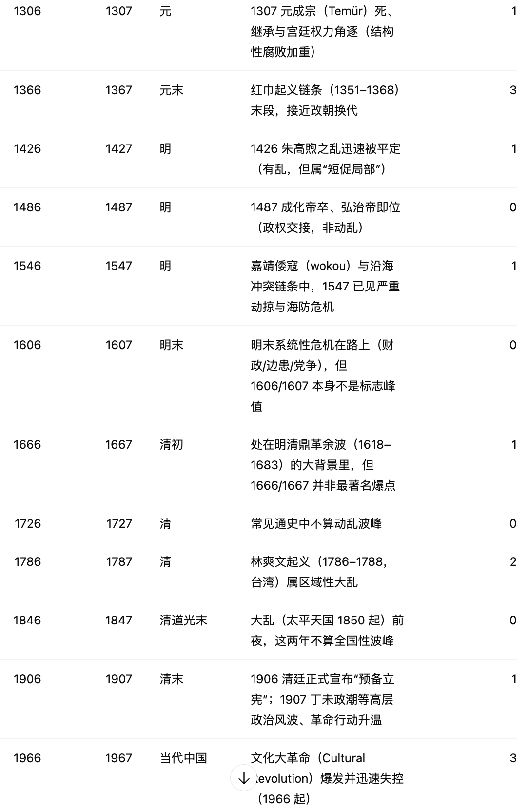
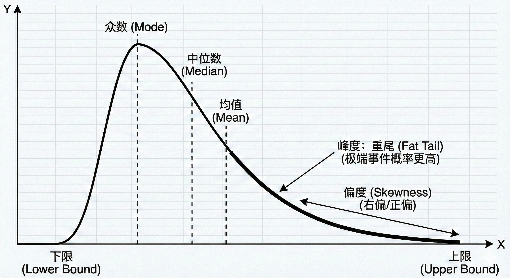
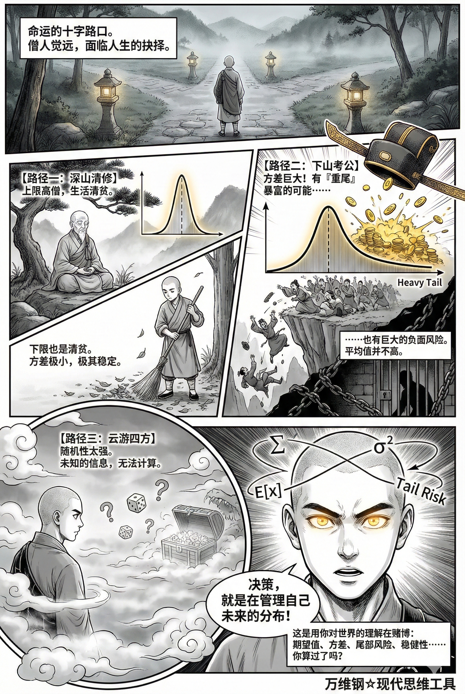
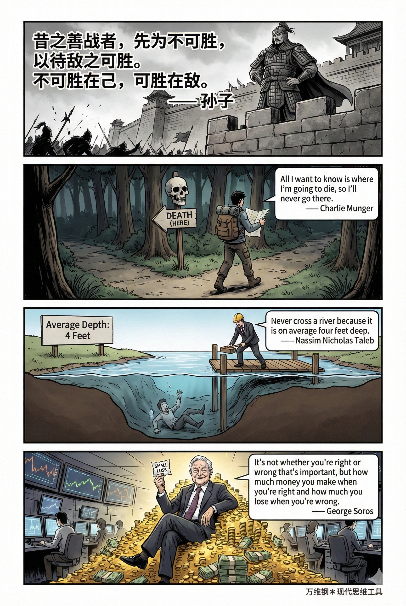

# 概率分布：到底什么是决策？（得到课程讲稿 + AI 加工段）

# 概率分布：到底什么是决策？

[概率分布：到底什么是决策？](https://www.dedao.cn/course/article?id=Lpy0edZAG5mnK0w2d1XzD9BkoajY4x)

你是否听过一个民间玄学，叫“赤马红羊劫”？说 2026 是丙午马年、2027 是丁未羊年，连在一起就是赤马红羊，而根据某种谶纬之说，每逢这样的两年国家就会发生灾乱……

你看上一次赤马红羊年，1966 到 1967，发生了文化大革命；再上一次是 1906 到 1907，是大清预备立宪的政治风波；再往前推，就连北宋的靖康之耻也是发生在赤马红羊年！都出事儿了，对吧？中国历史真有这么一个神秘的周期律吗？

其实你根本不需要懂玄学，因为这是一个很容易验证的说法。我直接让 GPT 列举了过去两千年间每一次赤马红羊年中国历史上发生了什么，它还根据灾祸的严重程度给打了分 ——

![图片展示了的是关于“角 addCriterion图片所在文档：\[title\]概率分布：到底什么是决策？\[content\]我直接让GPT列举了过去两千年间每一次赤马红羊年中国历史上发生了什么，它还根据灾祸的严重程度给打了分——\[block_sep\]<qa:image></qa>\[block_sep\]\[block_sep\]的确，有些赤马红羊年发生了大灾祸；但也有很多赤马红羊年只发生了一些小事，甚至根本就没什么事。你要知道古代中国本来就是多灾多难，可以说要么是正在发生灾祸，要么就是酝酿灾祸……真正 addCriterion图片所在文档：\[title\]概率分布：到底什么是决策？\[content\]我直接让GPT列举了过去两千年间每一次赤马红羊年中国历史上发生了什么，它还根据灾祸的严重程度给打了分——\[block_sep\]<qa:image></qa>\[block_sep\]\[block_sep\]的确，有些赤马红羊年发生了大灾祸；但也有很多赤马红羊年只发生了一些小事，甚至根本就没什么事。你要知道古代中国本来就是多灾多难，可以说要么是正在发生灾祸，要么就是酝酿灾祸的严重程度给打了分——\[block_sep\]<qa:image></qa>\[block_sep\]\[block_sep\]的确，有些赤马红羊年发生了大灾祸；但也有很多图片 addCriterion图片所在文档：\[title\]概率分布：到底什么是决策？\[content\]我直接让GPT列举了过去两千年间每一次赤马红羊年中国历史上发生了什么，它还根据灾祸的严重程度给打了分——\[block_sep\]<qa:image></qa>\[block_sep\]\[block_sep\]的确，有些赤马红羊年发生了大灾祸；但也有很多赤马红羊年只发生了一些小事，甚至根本就没什么事。](assets/2026-09-19-probability-distribution-notes-img-01.png)

的确，有些赤马红羊年发生了大灾祸；但也有很多赤马红羊年只发生了一些小事，甚至根本就没什么事。你要知道古代中国本来就是多灾多难，可以说要么是正在发生灾祸，要么就是酝酿灾祸……真正的问题是这些赤马红羊年跟其他年份相比是不是更差。

GPT 按照主流教科书口径列举了中国历史上最大的那些动荡期，比如八王之乱、十六国、安史之乱等等。在 34 组赤马红羊年里，有 13 组落在这些重大动荡期内，占比 38%。然后最关键的来了：如果你从这两千年跨度内\*随机抽取\* 34 组的连续两年，它们落在重大动荡期的比例，大约是 37%。

也就是说，所谓赤马红羊年发生重大动荡的可能性，并不比随机采样更突出。

那你还相信赤马红羊劫吗？

我们做的这番采样验证，就是入门级的决策者思维。这个“门”就是看事情不能只看单个的结果，要看统计才行。

决策，决的不是单次结果，而是一个「概率分布」。

一般老百姓思维，是以成败论英雄。一场关键篮球比赛，比分胶着：如果最后时刻球队幸运地投进，以一分优势取胜，那就皆大欢喜，教练、球员人人立功受奖；可是如果那个球没进，以一分之差败北，就是人人都得反省，搞不好教练还被免职。这个场面很常见，但你不觉得这很荒唐吗？

你应该根据球队多场比赛的结果，以及球队在教练带队前后的表现对比，综合统计判断，才能知道教练能力行不行，对吧？现实是人们很少有这样的耐心。你说酒后驾车容易出事，他说我上次喝得酩酊大醉开车回家也啥事没有；你说不能指望买彩票发财，他说上次就有人中了好几百万。

用眼前可见的结果评价决策的好坏，心理学把这叫「 **结果偏误 （Outcome Bias）**」。认知心理学博士安妮·杜克（Annie Duke）则称之为「**结果论（Resulting）**」。杜克是个赌博高手，曾经赢得职业扑克冠军，她在《对赌》（ *Thinking in Bets* ）一书中说，**生活更像是扑克而不是国际象棋：你的结果往往不是由你的打牌策略决定，而是由你抓到的牌好不好决定的。**

所以如果你想评估一个策略好不好，就不能只看一两次的结果，而必须综合看统计数据才行。

对老百姓来说，统计数据意味着找到历史的合订本，那需要太多的算力和长期记忆，所以他们宁可被短期影响。而且他们会被跟决策完全无关的信息所影响。

于是我们看到那个爱瞎搞但是赶上大环境好赚了钱的老板被认为是杀伐果断有魄力，那个明明输得多赢得少但是善于讲故事的 CEO 长期霸占版面，那个做了严谨推演却遇到偶然惨败的哥们则被无情地牺牲了……

如果我们永远只重视最可见、最有故事的那几个结果，那就跟赌徒差不多，永远都学不会决策的真本领。

你越是理解决策科学，就越不敢对决策指望太多：决策是一个非常有限的行为。

**「无免费午餐定理」，决策不可能是绝对客观中立的，你必须加入一些主观的因素，你必须得主动冒险。**

再进一步：你真正能决定的其实是一个过程，而不是结果。或者更严格地说，你决定的其实是\*放弃\*哪些东西。

英语里“决策”这个词（Decision），词根来自拉丁语 decidere，意思是“切断”或“杀掉”。面对眼前一大堆选项，你的决策不是选择哪个选项，而是“杀掉”那些同样美好、甚至可能更正确、更诱人的选项，来押注一个其实也不确定的选项。

想象一位深山里的僧人，正面临一个人生决策，包括三个选项：第一是继续在山里清修，希望能开悟成为得道高僧；第二是下山考功名，争取做官治理一方；第三是做个行脚僧出去云游四方，遍访名山大川。

如果你认为他是在高僧、大官和名山大川这三种人生之间做选择，那你就大错特错了。现实充满了不确定性：留在山里不一定能开悟，考功名不一定能考上，云游四方可能走在路上就折了。

做决策并不是在预定未来。决策其实是对平行宇宙进行剪枝。

选择“功名”，就意味着杀掉了“修行”那个宇宙里的安稳和“云游”那个宇宙里的自由 —— 那些都是机会成本 —— 然后你必须接受“功名”这个宇宙里可能的一切：也许真的做了大官，但也许考很多年都考不上，也许考上了只是个小官，也许做了大官但是犯罪被抓，也许陷入党争等等等。

决策是一个暴力行为。决策是消灭看起来也很不错的选项、放弃一些也许更好的可能性，支付机会成本 —— 而你选定的那个也不见得更好。这就是为什么决策常常让你感到难受，以至于很多人迟迟不愿意做决策。

你说我明白了：决策就是选概率，我们应该选数学期望最好的那个选项！这么说也不严谨。其实决策选的是「 **概率分布 （Probability Distribution）**」。

**考虑一个决策，我们至少需要考虑以下这几个参数：**

1. 均值（数学期望）：你平均而言，赌这一把能赢多少；

2. 方差：局面的波动性大不大，是否稳定；

3. 上限和下限：你赢最多能赢多少钱，输最多能输掉多少钱；

4. 偏度：你赢的概率大，还是输的概率大？

5. 峰度：是否为重尾分布，如果是重尾，发生极端事件的概率就很高；

6. 稳健性（Robustness）：如果环境发生变化，这个系统会不会崩溃呢？

就拿前面那个僧人来说 ——

\- 留在山里清修，下限是一个默默无闻的清贫僧人，上限可能是一代高僧。但考虑到高僧的生活也很清贫，所以整个分布的方差很小，极其稳定；

\- 下山考功名，方差可就大了：上限很高是做大官，而且这里绝对有重尾：你用权力获得钱，再用钱获得更高的权力……但这里也有巨大的负面风险，下限很可怕；而更多时候你根本就考不上，所以整体的平均值并不高；

\- 出去云游，随机性太强了：可能半途而废也可能有奇遇，我们实在不知道路上有什么，需要更多的信息。

决策就是在管理自己未来的分布。你是在用你对世界的理解进行赌博：你最起码得想一想期望值、想一想方差、想一想尾部风险和稳健性。

理解了这些，决策的首要指望就不是“必胜”，而是“可活”。

孙子兵法说：「昔之善战者，先为不可胜，以待敌之可胜。不可胜在己，可胜在敌。」查理·芒格（Charlie Munger）说：「我只想知道我会死在哪里，这样我就永远不去那个地方。」这就是先看看你能不能接受未来结果的下限，完了再考虑上限值不值得你的付出。

纳西姆·塔勒布（Nassim Nicholas Taleb）说：「永远不要因为一条河“平均”只有四英尺深，就涉水而过。」这就是说不能只看均值，你得管理尾部风险，看整个分布里有没有极端情况才行。

乔治·索罗斯（George Soros）说：「你看对还是看错并不重要，重要的是你看对时赚了多少，看错时亏了多少。」这说得就更基本：**关键不在于你对错了多少次，而在于你的对错之间是否存在\*不对称性\*，以至于你的数学期望是赚钱的。**

决策一定是得冒险，但绝对不是盲目冒险。我们要尽可能地管理风险，尽可能让赢面大、输面小、尾部风险可控才行。**理想情况下，高手应该尽量不让自己频繁进入高方差赌局，而是多用低波动可重复的过程积累胜利，这就叫「善战者无赫赫之功」。**

决策气质好的人不计一城一池之得失。只要过程是对的，输一两次也无所谓；如果过程不对，赢了也只是侥幸。

《呆伯特》系列漫画的作者斯科特·亚当斯（Scott Adams）以前有个说法特别好。他说，如果你要长期干一种事情，就不应该追求一个具体的目标，而应该追求「系统」。系统是一种连续变化的东西，可以是一项技能、一段关系等等，关键是系统中可以出很多个项目。你最关心的不是某个具体项目的成败，而是你这个系统够不够好。

比如亚当斯的写作就是一个系统。下一个作品在哪发表、有多火、赚多少钱，都不重要，这个系统甚至都没有明确的目标 —— 重要的是它是不是一直都在发展壮大，它输出的概率分布是不是越来越好。

有一个成熟的系统，概率分布充分优化，个例成功就是自然而然的事情。

最后咱们模拟几个场景，来一番决策演练。

**第一题：**假设你的一位朋友得了重病，是肿瘤，请问应该保守治疗还是做手术。你详细咨询了医生的判断，发现两个选项的概率分布分别是：

> 保守治疗：分布很窄，几乎确定能再活 5 年，在此期间生活质量中等，但很难再活更长时间。  
> 做手术：是个双峰分布，30% 的概率手术失败立刻离世，70% 的概率彻底治愈。

这些信息其实已经足够，只要再算一算预期寿命就可以了：如果病人已经 80 岁，那显然保守治疗是最好的选择，毕竟到这个岁数再活 5 年还不错；而如果病人才 20 岁，那就非常值得做手术拼一把。

**第二题：**你面前有两份工作 offer，一个是去高科技大厂当个螺丝钉，一个是去创业公司当个多面手。

> 去大厂工资高而且稳定发薪。但这里有左尾风险：技能单一化，一旦被裁员不容易找下家；  
> 去创业公司起薪低，而且公司搞不好会倒闭。但是在创业公司什么都能学一点，技能全面。而且这里有个不太大的右尾机会：公司一旦做成你就暴富了。

怎么选呢？跟个人情况有关系。如果你背着房贷还刚有了孩子，你需要的是低方差，那就得进大厂。而如果你血气方刚一人吃饱全家不饿，你就可以搏一把重尾，去创业公司。

**第三题：**有人向你推销保险。你明知道，考虑到风险事件发生的概率，这个保险平均损失的数学期望一定是低于保费的，不然保险公司怎么赚钱？那你要不要买保险呢？

答案取决于你能不能承担那个损失。房子发生火灾的概率是极低的，绝大多数人一辈子都用不上房屋保险 —— 但我仍然建议购买，因为万一真出事了你承担不起。大病医疗保险也是如此。但你说汽车要不要买交强险之外的险，或者你买台电视机是不是也要买个质量保险，那就是另外的故事了。

你看，我们这里权衡的不是这个结果和那个结果，而是对未来概率分布的接纳：**很多时候决策看的不是最好有多好，而是最坏能有多坏。**

当你学会注重概率分布而不是结果的时候，你的气质是不一样的。

你不会因为一次侥幸胜利而狂喜，也不会因为一次遵循正确策略的投资遭遇失败而崩溃，因为你知道只要样本量足够大，大数定律终究会把你带回你应该在的高度。

你拥抱不确定性，但是对毁灭性的尾部风险避之唯恐不及。你极度重视制度和规则，因为制度是保证概率分布稳健的唯一工具，而人治充满了随机性。你相信程序正义是长期最优解。你的情绪稳定。

高水平决策者就如同斯多葛主义的射箭手：你尽全力拉弓、瞄准 —— 那是你能控制的过程；至于箭离弦之后，是否正中靶心，你保持某种冷静的漠然 —— 因为那是风向和噪声的抽样。

---

### 核心洞见

将决策从“赌单次输赢”的世俗观念，升维到了“管理概率分布”的科学与哲学高度。它不仅是一篇关于如何做选择的方法论，更是一种面对复杂世界的底层人生哲学。

分为**认知破局、核心框架、风险法则、长期战略、心智修养**五个维度：

#### 决策是“剪枝”与拥抱概率分布

普通人将决策视为“走向确定性”的单选题，而高水平决策者将其视为**对平行宇宙的剪枝**。你决定的不是最终结果，而是你愿意承担哪种“概率分布”。为了更直观地理解这一点，你可以参考不同分布形态的差异：

- **放弃的艺术（机会成本）：**选择一条路，意味着“杀掉”其他可能性。决策之所以痛苦，是因为它是一种切断退路的暴力行为。
- **多维度的风险考量：**评估一个选项，不能只看“数学期望”（平均收益），更要看“方差”（波动有多大）、“偏度”（赢面大还是输面大），以及是否存在“重尾”（极端的暴富或毁灭风险）。比如，在观察A股或恒生科技指数时，我们面对的就是典型的高方差和不可忽视的尾部波动，此时的决策就绝不能仅仅基于短期的涨跌，而是要评估整个资金盘的抗风险分布。

#### 摒弃“结果偏误”，建立“大样本观”

日常思维往往“以成败论英雄”，但这在统计学上是极其荒谬的。

- **过程重于单次结果：**现实世界充满了随机性（运气成分）。一个愚蠢的决策可能因为走运而获得好结果，一个严密的推演也可能遇到黑天鹅而惨败。正如《金钱心理学》中所揭示的财富逻辑：长期的财务成功往往不依赖于某一次的神机妙算，而是建立在不犯致命错误的前提下，让复利在大样本的时间里发挥作用。
- **剥离运气与实力：**评价自己或他人的决策质量，必须拉长周期。只要决策逻辑和概率分布是对的，单次的亏损或失败仅仅是统计学上的“噪音”，不必为此产生情绪内耗。

#### 用“系统”对抗不确定性，而非单纯追求“目标”

这是整篇文章最具可操作性的思想内核。面对不确定性，追求单一的“目标”（比如某次面试必须通过、某个项目必须赚多少钱）是非常脆弱的。

- **打造稳健的日常系统：**真正的高手追求的是建立一个正向的“系统”。例如，每天清晨7:30开启雷打不动的“时间盒（Timeboxing）”，严格执行一个90天的冲刺行动计划——这本身就是一个极具稳健性的系统。在这个系统运转的过程中，某一天是否灵感爆发、某一周是否立刻迎来了职业突破，都不再重要。
- **优化输出的概率分布：**只要这个知识管理和自我迭代的系统在持续运转，你输出“好结果”的概率分布就会不断右移。长此以往，所谓的“成功”或“突破”，不过是系统成熟后自然掉落的副产品。

#### 守住下限（稳健性），管理尾部风险

在追求上限之前，高水平的决策者永远先看下限。

- **先求可活，再求必胜：**决策不是盲目赌博。遇到带有“左尾风险”（一旦发生就会造成毁灭性打击，如技能单一遭遇长期失业、重病无保险）的选项，哪怕收益期望再高也要极度谨慎。
- **不对称性原则：**最优的决策往往具备不对称性——看错时损失有限且可控（保住本金和核心能力），看对时收益巨大（重尾红利）。只要守住底线，你就能一直留在牌桌上，等待大数定律将你带到应有的高度。

#### 认知破局：破除“结果偏误”

- **不要以成败论英雄：**单次的结果往往由运气（抓到的牌）决定，而非策略本身。用眼前的单次结果来评价决策好坏，是典型的赌徒思维。
- **凡事看统计基线：**就像验证“赤马红羊劫”一样，不要被小概率的显著事件（故事性）和幸存者偏差忽悠。高阶的决策思维，必须具备统计学视角，去对比“随机采样”的基线。

#### 决策的本质：是“剪枝”，更是选择“概率分布”

- **决策是一个“暴力”的放弃过程：**Decision 词根意为“切断、杀掉”。决策不是在挑选一个必定通向成功的未来，而是**支付机会成本**——残忍地杀掉其他同样诱人的平行宇宙，去押注一个充满不确定性的过程。
- **你决定的不是结果，而是分布：**我们永远无法决定单次的绝对结果，我们真正能选的，是未来人生或事业的「概率分布」。

#### 风险法则：先求“可活”，再求“胜率”

- **守住下限（芒格/孙子）：**“先为不可胜，以待敌之可胜”。决策的第一要务不是必胜，而是保证自己不被淘汰出局。永远不要去那个“会死的地方”。
- **警惕尾部风险（塔勒布）：**永远不要涉水蹚过一条“平均”水深只有1.2米的河，因为里面可能有一个深不见底的坑（极高的峰度/尾部风险）。
- **追求不对称性（索罗斯）：**对错的次数不重要，重要的是“看对时赚得多（右尾红利），看错时亏得少（左尾可控）”。

#### 长期战略：用“系统”代替“目标”

- **放弃单一目标，构建连续系统：**高手不谋求单次项目（一城一池）的绝对成败，而是建立一套可以不断试错、输出良好概率分布的“系统”（如斯科特·亚当斯的写作系统）。
- **大数定律是终极护城河：**只要你的系统概率分布被充分优化过（赢面大、输面小），坚持重复（扩大样本量），个例的成功就只是自然而然的结果。

#### 心智修养：做“斯多葛派的射箭手”

- **过程与结果分离：**尽全力拉弓、瞄准（控制你能控制的过程与制度），但箭离弦之后，对是否中靶保持冷静的漠然（接受外部环境的随机抽样）。
- **情绪稳定源于理解概率：**懂得了概率分布，就不会因一次侥幸而狂喜，也不会因一次正确策略的偶然失败而崩溃。拥抱不确定性，依赖程序正义，用理性的长期主义对抗世界的随机性。

---

从单一结果的执念，走向对系统的打磨和对概率分布的接纳，这是一种能够带来极大情绪稳定和长期复利的认知跃迁。

在构建你自己的日常运作系统（如**时间管理、知识输入或技能破局**）时，你觉得目前最难量化或管理的“方差”（不确定性）出现在哪个环节？

### 行动策略

基于你刚才分享的“概率分布”思维，一份真正高效的日常行动策略不应该是“死磕目标”的清单，而应该是一个**优化输出分布、对冲尾部风险、积累复利**的系统。

既然我们追求的是“过程的正确性”，那么这份策略的核心就在于：**通过高纪律性的系统，让“成功”成为统计学上的必然。**

#### 系统启动：管理“均值”的晨间协议 (07:30 - 09:00)

决策的第一步是建立稳健性。每天早晨的固定节奏是系统的“压舱石”，用来拉高全天效率的数学期望。

- **7:30 准时切断：**严格执行时间盒（Timeboxing）。通过切断“睡懒觉”或“刷手机”的选项，消除清晨的随机性波动。
- **深度输入：**利用这段大脑最清醒的时间，进行硬核非虚构类阅读或复杂技术文档的研究。
- **苏格拉底式的预演：**快速自省：今天最重要的系统性输出是什么？如果今天只能完成一件事，哪一件事能让系统的“右尾”更厚（收益潜力更大）？

#### 核心增值：构建“非对称”的技术护城河 (09:00 - 12:00)

作为开发者，你的职业突破不在于“完成任务”，而在于“提升系统的健壮性”。

- **AI 增强型开发：**专注于技术与大模型工作流的深度融合。这不仅是技能更新，更是通过 AI 杠杆实现“一人公司”化的实验。
- **管理左尾风险：**每天花 1 小时进行“漏洞修补”——学习那些让你感到不安的底层原理，或者复盘之前的技术短板。这种行为是在对冲“技能过时”的毁灭性风险。
- **费曼输出：**每一个攻克的技术点，立刻用“费曼技巧”转化为一张 flomo 卡片。**碎片化记录，结构化关联。**

#### 概率博弈：动态追踪与内容杠杆 (13:30 - 17:30)

下午的时间通常波动较大，适合处理那些具有“重尾”潜力的探索性任务。

- **市场观察：**保持对 A 股及恒生科技指数的冷静观测。重点不在于短线交易，而在于验证你的“长线逻辑”。如文中所说：看对时赚了多少，看错时亏了多少。
- **Vlog 实验室：**投入固定比例的时间进行视频内容的脚本文案或拍摄。这本质上是一个**低成本、高回报潜力**的“右尾”赌注。不求每条必火，追求的是“持续产出”这个系统的进化。
- **被动积累：**哪怕是失败的尝试，也要作为系统日志记录下来，优化你对未来概率分布的判断。

#### 稳健基石：家庭与沟通的“止损点” (18:00 - 21:00)

家庭关系是个人系统的“底层架构”。如果这里崩溃，整个系统的方差会无限放大，导致无法专注于任何增长。

- **高质量陪伴：**设定完全离线的“亲子/伴侣时间”。使用非暴力沟通策略，将家庭沟通视为一种“降低噪音”的过程，而不是一场要分胜负的辩论。
- **环境对冲：**考虑到孩子尚小，将学习任务安排在深夜或清晨，以避免高强度的相互干扰，确保系统运行的平稳性。

#### 闭环优化：斯多葛式的漠然复盘 (21:30 - 22:30)

像那个射箭手一样，检查你的弓弦，而不是只盯着靶心。

- **系统检查：**今天是否按照预定的“时间盒”拉弓了？瞄准是否尽力了？
- **情绪对齐：**对于今天没完成的任务或不尽如人意的结果，保持某种“冷静的漠然”。只要过程逻辑没有问题，就要相信大数定律。
- **卡片整理：**将一天的碎片灵感在 Feishu 中进行最终的归档和知识建模。

---

**策略执行建议**

> **决策者不计一城一池之得失。**

如果某一天因为家庭突发状况导致系统停转，不要焦虑。**系统允许波动，但不允许崩溃。** 只要你的平均值在持续右移，你就在通往那个“必然结果”的路上。

在执行这套策略的过程中，你发现目前哪一个时间块的“方差”最大，最容易被不可控因素（如家庭琐事或突发灵感）干扰？

---

### 概率分布与系统思维

基于上文对“决策即管理概率分布”的深度解析，制定日常行动策略就不再是简单地列一个“待办事项清单（To-Do List）”，而是**为自己构建一套能够“优化期望值、控制极值风险、拥抱正面黑天鹅”的日常运行系统**。

以下是一份基于“概率分布与系统思维”的日常行动策略指南：

#### 核心法则：放弃单日目标，维护日常“系统”

不要问“我今天取得了什么重大成就”（执着于单次结果），而要问“我今天的系统运转是否正常”（优化概率分布）。

#### 锁死下限（切断“左尾风险”）

**决策哲学**：“我只想知道我会死在哪里，这样我就永远不去那个地方。”（查理·芒格）

**行动目标**：避免系统崩溃，绝不让自己陷入无法翻盘的境地。

1. **生理兜底机制：睡眠与健康神圣不可侵犯：**保证 7-8 小时高质量睡眠，安排基础运动（如每天快走或力量训练30分钟）。这是维持整个系统“方差稳定”的物理基础，熬夜和透支是极高风险的“重尾事件”。
2. **防爆雷机制：**

   - **隔离高风险冲动：**不在情绪激动（愤怒、极度兴奋、疲惫）时做任何决定，尤其是涉及财务、人际关系的决定。
   - **冗余时间管理：**永远不要把日程排满。每天留出 20% 的空白时间，用来应对突发状况（防系统拥堵崩溃）。

#### 做大均值与稳控方差（执行“核心系统”）

**决策哲学**：“善战者无赫赫之功。”——用低波动、可重复的过程积累胜利。

**行动目标**：通过纪律和习惯，稳定提升人生的“数学期望”。

1. **过程导向的深度工作：按“投入”而非“产出”设定目标：**比如，将目标设定为“全神贯注写作 2 小时”或“阅读 20 页书”，而不是“写出一篇爆款文章”。只要你完成了设定的时间，这一天的核心系统就是成功的。
2. **标准化常规动作：**减少日常琐事上的“决策剪枝”消耗。早餐吃什么、穿什么衣服、什么时间看邮件，全部设定为默认流程。把宝贵的决策算力留给真正重要的事情。
3. **低方差社交与输入：**稳定地摄入高质量信息（经典书籍、优质研报、长文），减少高波动的噪音输入（无意义的短视频刷屏、社交媒体热搜争吵）。

#### 拥抱正面极值（暴露于“右尾红利”）

**决策哲学**：寻找“错时亏得少，对时赚得多”的不对称性机会。

**行动目标**：花小部分成本去“试错”，捕捉人生的正面黑天鹅。

1. **留出 10%-20% 的“探索时间”：**

   - 每天或每周专门留出时间，做一些结果极度不确定，但一旦成功收益巨大的事。
   - *例如：*学习一个跨界的新技能（如AI工具）、给行业大咖发一封冷邮件（Cold Email）、尝试写一段开源代码、和一个不同圈子的人喝咖啡。
2. **制造可复利的“公域资产”：**每天产出一点可以被无限复制和传播的东西（一篇文章、一条深度思考的笔记、一段视频）。这类动作的下限是零（没人看，损失的只是一点时间），但上限是无穷大（突然引发传播，带来巨大机遇）。

#### 斯多葛式复盘（心智校准）

**决策哲学**：“尽全力拉弓、瞄准……至于箭离弦之后是否正中靶心，保持冷静的漠然。”

**行动目标**：剥离结果偏误，回归过程正义。

1. **每日晚间的三省吾身：**

   - **问过程（拉弓）：**我今天是否遵循了我的系统？是否完成了深度工作块？是否抵御了高风险的诱惑？（如果答案是 YES，今天就是成功的一天，无论外界反馈如何。）
   - **看结果（靶心）：**记录今天发生的客观结果，但不做情绪化评价。
2. **大数定律视角的月度微调：**

   - 不要因为某一天的失败而改变系统。等到积累了足够多的样本量（比如坚持了一个月），再去评估：“我这套系统的概率分布是否越来越好？”如果是，继续坚持；如果不是，微调参数（比如改变工作时间段、调整学习方向）。

#### 极简的“概率分布”一日课表

- **早晨（稳控方差）：**固定的晨间流程，不看手机，直接进入 1.5 小时的“过程导向”深度工作。拉升全天的均值。
- **中午（防范左尾）：**良好的饮食与午休，情绪重置，防止下午精力崩盘。
- **下午（处理杂项）：**处理不可控的外部事务（开会、回复消息），接受外界环境的风向和噪音抽样。
- **傍晚（拥抱右尾）：**探索性学习、创作分享、跨界交流，扔出几只可能带来好运的“飞镖”。
- **睡前（斯多葛复盘）：**检视今日的系统运转情况，接纳所有好与不好的单次结果，平静入睡。

执行这套策略的头几天，你可能觉得索然无味，因为它没有“打鸡血”式的刺激。但这正是概率分布的魅力所在：**你不再是一个渴望每天中彩票的赌徒，而是一个耐心经营赌场的庄家。时间，将成为你最不可战胜的盟友。**
