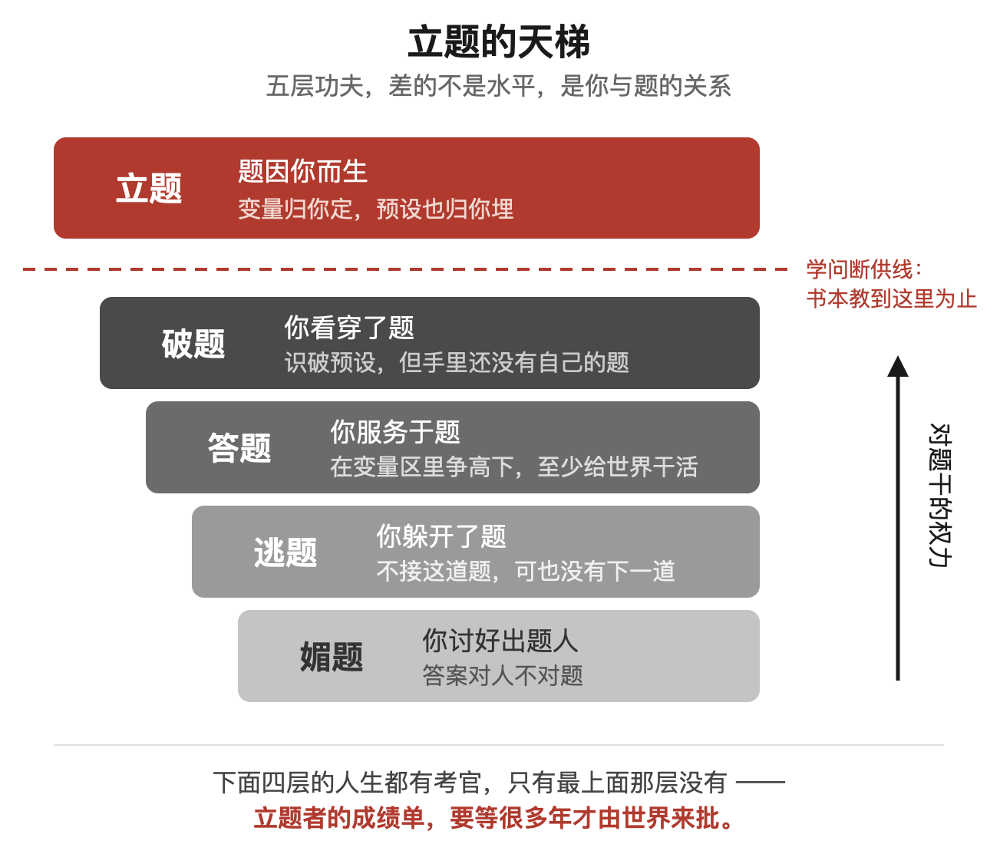
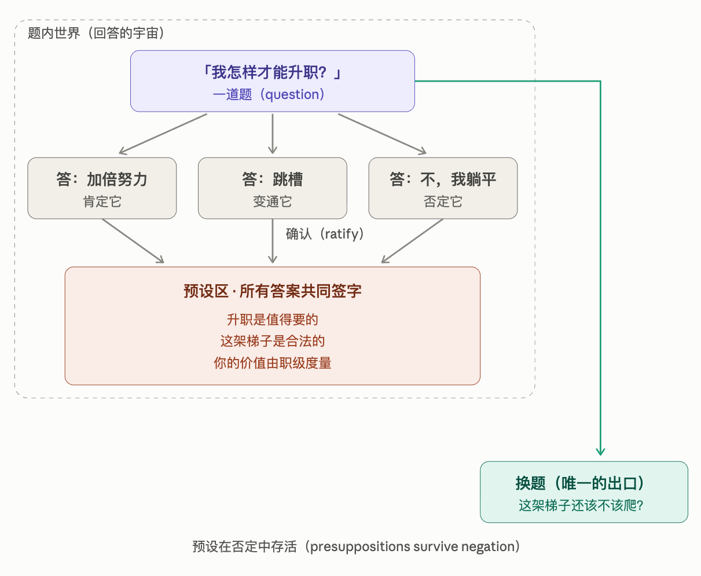
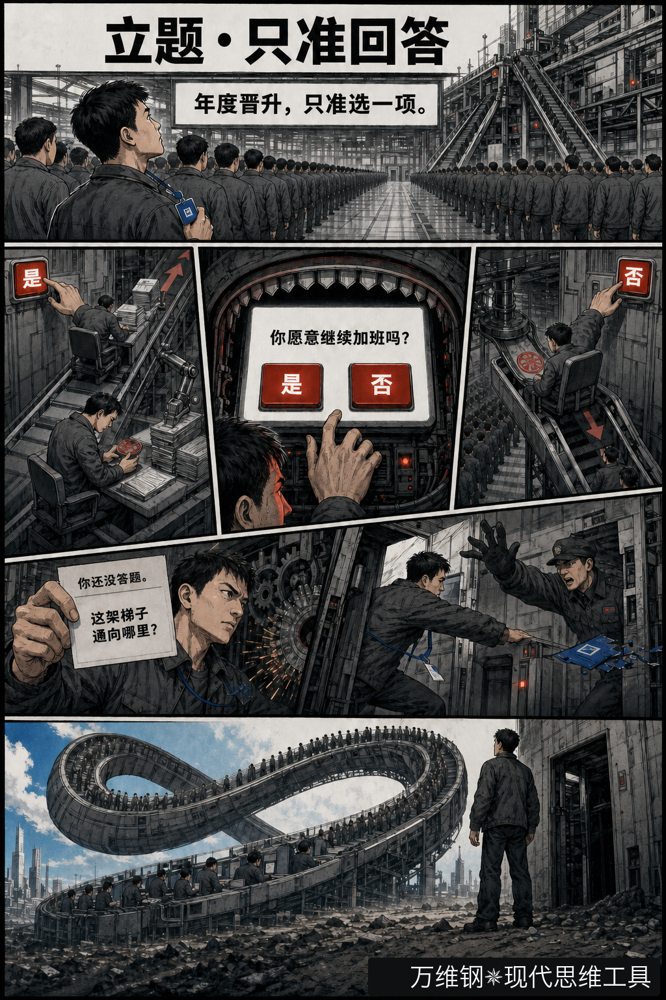
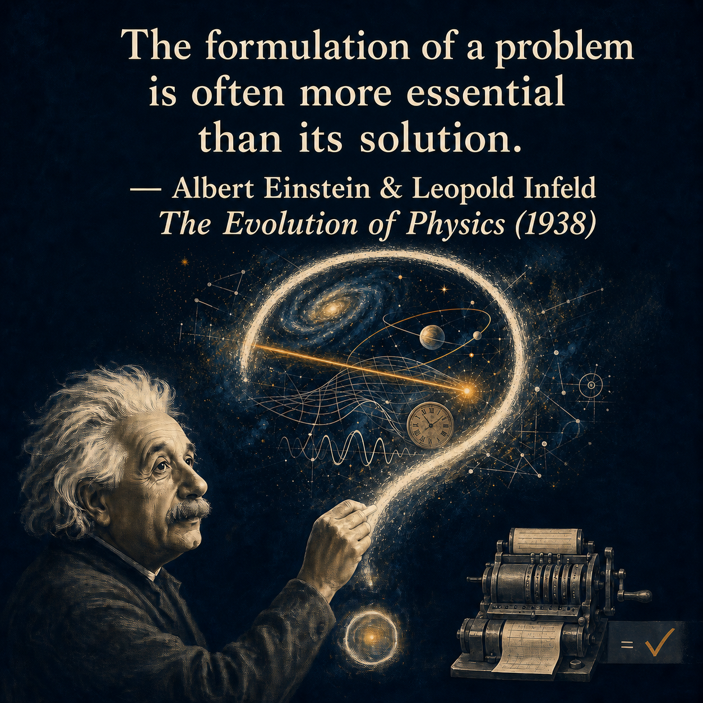
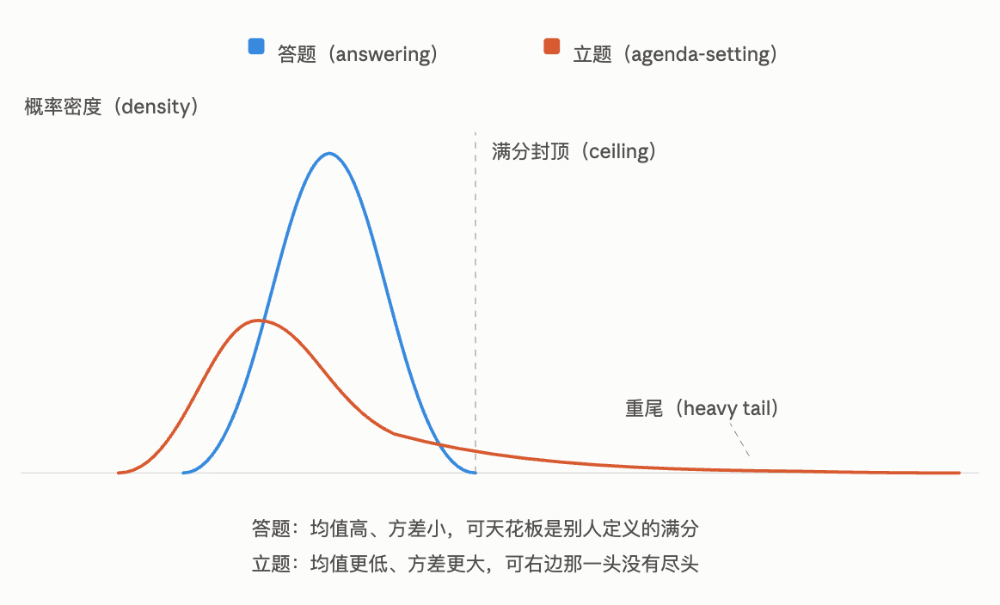
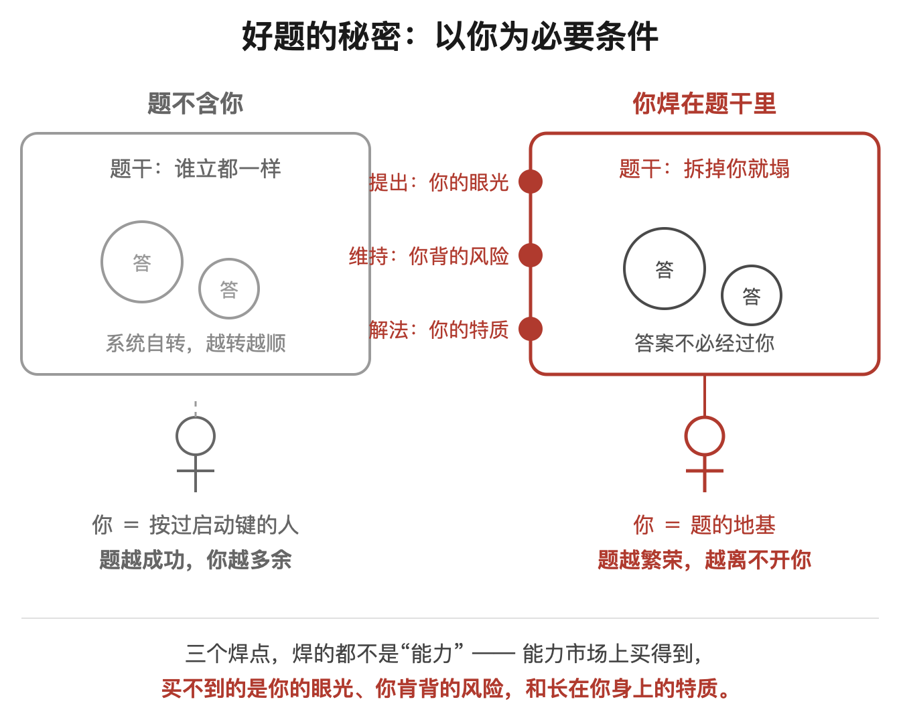
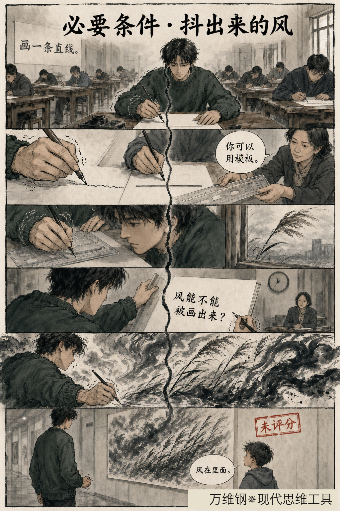
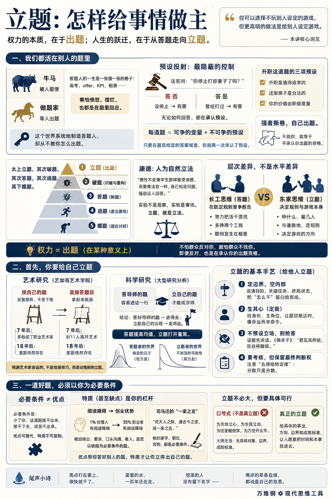

# 立题：怎样给事情做主

[立题：怎样给事情做主](https://www.dedao.cn/course/article?id=2Mo65zY4QZ3VnmWOvpKqEdNAa98jGB)

2026-08-03 23:11

现在很多人管上班叫当“牛马”，就连高学历、高技能、高收入的人也这么自嘲。你明明是个大厂程序员、投行分析师、三甲医院的医生，不知道赢下多少竞争才获得今天的位置，怎么就成了牛马了？

**“牛马”和“小镇做题家”是一回事 —— 都是「答题人」的视角。**

牛马是被人驱使的，做题家是等人出题的。答题人的一生就是一张接一张发下来的卷子：高考、offer、KPI、相亲，你答得好也罢，差也罢，甚至你摆烂也罢，你都是在把自己跟一个标准进行对照 —— 那么你就是在被那个标准所驱使。

连你的愤怒，都是在题里愤怒。

“题从哪儿来”，可不归你管。

**一个公开的秘密是：这个世界系统地制造答题人，但是可从来不教你怎么出题。**

民间的学问，包括百无禁忌的市侩哲学，什么人情世故、会来事儿、高情商，研究的都是怎么把题答得让人高兴。官办教育教的都是怎么把题答对，你不用说质疑哪道题，连欣赏都不教。学者的高级学问可能教你识破题、挣脱题：批判性思维是教你解构，财务自由教你退出，但仅此而已。

再往上，学问就有点断供了。

商学院的各种“领导力”研究，你仔细一看全是竞选学：特质、魅力、情商、信任，是教你怎么\*获得\*领导地位。至于说有了权力以后怎么行使权力，怎么给人\*出题\*，通常就只剩下“赋能”“愿景”这类听起来高大上，但感觉不那么趁手的词。

这不奇怪。研究者都是没有权力的教授；最善于使用权力的人没有动机写本书教你。你只能从外面观察他们，可是他们权力用得越好，从外面就越看不出来发生了什么。

所以我们这一讲也不可能提供一个完整的理论框架。我只能带给你一些启发。

我们前面讲的「元表征」和「应无所住」，是教你跳出别人的题；跳出之后呢？也许你可以尝试建立。

太上立题，其次破题，其次答题，其次逃题，其下媚题。

这一讲讲最高那一格，「 立题 」。

✵

你说出个题能有多大权力？我说，在某种意义上，权力就是出题。

想象你有一天被人直接扭送到法庭，法官当头就问你：“你停止打你妻子了吗？”你想想该怎么答。

你答否，没停止，那当然有罪；但你答是，停止了，也就等于承认你曾经打过妻子，只是现在不打了，这不也是有罪吗？

1892 年，现代逻辑学的奠基人、德国数学家戈特洛布·弗雷格（Gottlob Frege）在《论涵义与指称》一文中提出了这个怪事儿：“开普勒死于穷困”这句话，预设了“开普勒”确有其人 —— 而它的否定句“开普勒没有死于穷困”，预设的是同一件事。

1950 年，英国哲学家彼得·斯特劳森（P. F. Strawson）把它做成了分析哲学的公案：“当今法国国王是秃头”这句话，你承认也好，反对也好，你都在确认“法国有个国王”。

语言学家把这个性质叫做「预设投射（presupposition projection）」 ：每一道题都有摆上台面供你争的变量，和藏在题干里不供你争的预设不变量 —— 你的任何回答，不管是赞成还是反对，只要还在题目给定的答案域里，就不但碰不到预设一根毫毛，而且等于你再一次承认了预设。

比如说，公司、家里和社会都要求你回答这道题：“我怎样才能升职？”

只要你回答，不管你的答案是努力也好，跳槽也好，躺平也好，其实你都承认了三项预设：升职是值得追求的；这架梯子是合法的；你的价值由职级度量。

可要是朱元璋和毛泽东那样的人遇到这种题，人家只会把卷子撕了，自己出题。

要不怎么有人说权力这个东西是“不怕群众反对你，就怕群众不找你” —— 哪怕你提出反对一个领导的政策，你也等于承认了他出题的资格。

别人无缘无故惹你，怎么办？有句话叫「弱者报复，强者原谅，智者忽略」：报复和原谅都在对方的框架之内，你只要搭理他，你就是在他的议题里签字。正确做法是连理都不理，根本不接受这个议程设定 —— 要有议程也只能由我来设定。

中国政治史上分量最重的一次立题，就在《毛泽东选集》第一卷第一篇《中国社会各阶级的分析》的第一句话：“谁是我们的敌人？谁是我们的朋友？这个问题是革命的首要问题。”

其实社会有这么多维度，为什么非得把人按照阶级分类呢？为什么各个阶级之间是敌对关系呢？毛泽东根本不跟你讨论那些问题，他是直接给你来个预设投射。接受这个立题，你就得接受后面那套用阶级斗争划分敌我、组织力量、发动革命的逻辑，接受“以阶级斗争为纲”乃至于“阶级斗争一抓就灵”。

要一直等到 1981 年，中共中央提出“我国所要解决的主要矛盾，是人民日益增长的物质文化需要同落后的社会生产之间的矛盾”，才算正式重新立题。

立题的威力甚至高于政治。康德在《纯粹理性批判》第二版序言里说，理性向自然学习，不是像学生那样，老师讲什么就听什么，而要像一位法官一样，自己拟定问题，强迫证人回答。整场科学革命在康德眼里就是一次审讯权的移交：实验不是观察，实验是审讯。

后人把这个思想压成一句话，“人为自然立法”。

立题就是立法。

✵

所以立题的人跟答题的人，不是水平差异，是层次差异 —— 他们的思考不发生在同一层。

1962 年，美国经济学家詹姆斯·布坎南（James Buchanan）和戈登·图洛克（Gordon Tullock）出版《同意的计算》一书，把人的选择分成两层 ——

「 **规则之内的选择** （choice within rules）」，是在给定的玩法之下博弈、出牌、争输赢，用我们这一讲的语言来说就是答题；

「 **规则之间的选择** （choice among rules）」，是先选择用什么规则来玩，是立题。

布坎南管后者叫宪法层次的选择。他靠这套学问拿了 1986 年的诺贝尔经济学奖。

用中国话说，这其实就是长工思维和东家思维。长工想怎么把活干漂亮，多挣两个工钱；东家想这块地明年种什么，雇几个人，跟谁换地。长工可以比东家聪明、比东家能干 —— 但他的聪明全部发生在东家画好的框里。

劳心者治人劳力者治于人。这岂不令人感叹吗？

你可以选择不玩别人设定的游戏，但更高明的做法是给别人设定游戏。

✵

首先你要给自己设定游戏。

有一句传说是爱因斯坦说的话，叫“问题比答案重要” —— 其实也真是爱因斯坦说的，原话是：“一个问题的提出，往往比它的解决更重要”。

这不是鸡汤，我给你两个证据。

从 1964 年起，芝加哥大学的两位心理学家雅各布·盖泽尔斯（Jacob Getzels）和米哈里·契克森米哈赖（Mihaly Csikszentmihalyi）—— 后者就是后来提出「心流」的那位 —— 持续追踪了芝加哥艺术学院的一批学生。

起初是一个实验：请 31 名学生从桌上 27 件静物里挑选摆放，画一幅静物画。一部分学生拿起来就画，把这当成一道要解的题；其他的学生却是反复摆弄，变换角度，推翻重来，迟迟不下笔 —— 他们在找自己的题。

不知情的评委打分的结果是后一类的作品明显更有原创性。但更有意思的事情发生在多年以后。

7 年后，研究者找到了其中 27 人：大约一半成了职业艺术家，而且不少人已经做出了成绩 —— 他们几乎全是当年那批给自己出题的人。反过来，当年最不爱给自己出题的 11 个人，有 8 个已经彻底离开了艺术这一行。18 年后再追一次，这个差距还在。

预测一个艺术家命运的不是他的绘画技巧，而是他动笔之前的立题。研究者当时的说法叫「 **问题发现** （problem finding）」。

科学研究也是这样的。2020 年，美国西北大学的马一芳（Yifang Ma）等人分析了将近 4 万对师徒科学家和上百万篇论文，发现：好导师的学生确实更容易成功，但最成功的那批学生有个共同点 —— 不是一辈子替导师答题，而是立起了自己的研究议程。

答好导师的题，你容易进这一行；可要是一辈子答导师的题，你成不了宗师。

请注意，这些研究只是证明了成为宗师的人都要自己立题，但是可没证明立题就能成为宗师。答题是低方差的活法，旱涝保收；立题是高方差的活法，可能白干十年。准确的结论是 ——

答题提高均值，立题打开重尾。

均值是稳定的日子，重尾是不封顶的可能性。立题的人和答题的人看着就不像一类人，因为他们活在两种统计分布里。

✵

做研究和创作你只要给自己立题就好；做管理，你就得给他人立题了。其实立题的基本手艺我们前面已经零星讲过一点。

**第一，定边界，空内部。**好题只说何为与为何，不说如何。我们讲过「指挥官意图」：说清目的、关键任务、终局状态，把“怎么干”整个留白给现场。你得允许答题人施展。

**第二，生其心。**也就是让答题的人生出自己的心，把你的题当成他的题。我们讲「叙事权」时说过“定我”：给他一个身份，一个主角位，让题目抵达他的时候不像命令像命运：“这条产线你摸过每一颗螺丝，这道题非你莫属”。

**第三，不预设立场。**别抢答。《韩非子》说：“君见其所欲，臣自将雕琢。”你亮出想要的答案，收上来的就全是迎合。真想把事儿办好，就把自己的答案扣住，让证据先说话。

其实你不用给答案，你的立题本身很大程度上就已经决定了事物的走向。像是贫困、教育改革这类没有标准定义，没有终止条件的麻烦事儿，规划学界称之为「棘手问题（wicked problem）」 [14]，你会发现对于棘手问题，它的表述本身就是问题的一部分 ——

你把贫困表述成“懒惰”还是表述成“制度”，后面发生的将是两个完全不同的故事。

**第四是你要考核，**但你也得注意「古德哈特定律」，分数只是分数，保留最终判断权。

这些都是教科书上就有的手艺，下面说一个教科书上没有的。

✵

这条心法可能有点厚黑，没人明说，我本来也没想过，是 Claude 告诉我的 ——

**一道对你有利的好题，必须以你为必要条件。**

不是“跟你有关”，不是“你比较擅长”，是\*必要\*条件：少了你，这道题提不出来，撑不下去，或者答不出来。你要不想完全放手，就必须要让题依赖你。

1962 年七千人大会以后，刘少奇把题目定成“调整国民经济”，那么毛泽东就只能退居二线……然后才有“千万不要忘记阶级斗争”。

如果公司的题目不含创始人的特质，还要创始人干什么？职业经理人不是便宜得多？乔布斯给苹果立的题从来不是“做出好用的电子产品” —— 那题谁都能答 —— 而是“科技与人文的十字路口能长出什么”。这道题的必要条件是乔布斯本人的品味。

更深的洞见是，这个必要条件，常常不该是你的优点，而应该是你的“特质” —— 甚至是你的缺点。

优点是通用的，是可雇佣的。拿优点当必要条件，你的题迟早被更便宜的优点接管。无法复制的是你身上那些在别人的考卷上被判为缺点的东西：你的偏执，你的处境，你的伤口。

比如说阅读障碍，这是一种天生的缺陷。眼前一个个字你都认识，但你就是难以把它们连成意思。2009 年美国的一项规模不大的问卷调查显示：企业经理人之中，只有 1% 的人有阅读障碍 —— 但是创业者之中，这个比例是 35%。为啥呢？

伦敦城市大学的朱莉·洛根（Julie Logan）教授的解释是，读不进去的人从小被迫练出另一套本事 —— 委派，口头沟通，看人，直觉。他们不是战胜了缺陷，他们是立了一道以缺陷为必要条件的题。

咱们再看司马迁在《报任安书》中的那段排比 ——

“盖文王拘而演《周易》；仲尼厄而作《春秋》；屈原放逐，乃赋《离骚》；左丘失明，厥有《国语》；孙子膑脚，《兵法》修列。”

我们从小当这是励志故事，说这些人\*虽然\*有这些困难，\*但还是\*取得了成就。然而司马迁真实的逻辑也许是，这些人是\*因为\*有那些困难，\*所以才\*取得了那些成就。

司马迁给自己立的题，“究天人之际，通古今之变，成一家之言” —— 为什么是他这“一家”？因为他的家学、他的职位，和他刚受过的宫刑。

优点帮你答好别人的题，特质才让你立得出自己的题。

✵

立题并不是越大越好。像张载的横渠四句，“为天地立心，为生民立命，为往圣继绝学，为万世开太平”，听起来高端大气，实则都是大而无当的中二口号，根本没有具体对象、行动边界和成败标准，潜台词无非是“我想当官”而已。

你用不着为天地立心为生民立命，你能在你周围的事情中占据主动，就已经很厉害了。

如果还有余力，能给周围的人、给你干的这个具体的事业立个题，那就非常可以了。

顺着一个公认的价值观喊口号，那不是立题。

给一个事业方向、边界和成败标准，让人愿意把时间和本事放进去，那才是立题。

**【尾声小诗】**

> 雨点打在窗上，很快就干了。  
> 渠里的水，一百年还在走。  
> 挖渠的人没有留下名字 ——  
> 两岸的草各自绿，  
> 都说是自己的意思。  
> 又曰：  
> 一纸卷来天地窄，  
> 千人俯首各争先。  
> 何如自把荒原辟，  
> 后世行人道自然。

---

这篇文章以极其犀利、通透的视角，拆解了**“打工人困境的本质”与“顶层权力运作的暗线”**。

#### 一、 权力的本质：不是答题高分，而是拥有“立题权”

- **社会生态位划分**：**太上立题，其次破题，其次答题，其次逃题，其下媚题**。“牛马”或“小镇做题家”的本质是**答题人**。只要你是在别人给定的卷子里争取高分、甚至在给定的标准里愤怒或躺平，你都是被驱使者。
- **立题即立法**：真正的权力不是把活儿干漂亮（规则之内的选择），而是**决定玩什么游戏、制定什么规则**（规则之间的选择 / 宪法层面的选择）。东家与长工的差距，不是智商高低，而是思考所在的层级不同。

#### 二、 控制的底层暗器：“预设投射”（Presupposition Projection）

- **隐蔽的不变量**：每一道题都包含两部分——露在水面让你争论的“变量”，和藏在题干里强制你接受的“预设不变量”。
- **反驳即确认**：如同法官问“你停止打老婆了吗”，无论你回答“是”还是“否”，你都承认了“你打过老婆”。当你纠结“怎样才能升职”时，不管你选择卷还是躺，你都默认了“这架梯子是合法的，你的价值由职级决定”。
- **破局之道**：面对挑衅或控制，弱者报复，强者原谅，**智者连议程都不予承认**。直接撕掉卷子，重新定义焦点（如毛泽东以“谁是敌人、谁是朋友”为革命立题）。

#### 三、 人生统计分布的真相：“答题提高均值，立题打开重尾”

- **答题是低方差活法**：跟着标准走，旱涝保收，它决定了你生存的下限和体面（拉高均值）。
- **立题是高方差活法**：自己找题（Problem Finding）可能白干十年，但所有宗师级人物、真正的原创成就，无一例外都来自自己立题。
- 敢于立题，才能摆脱平庸的收敛，进入**上不封顶的“重尾（Fat-tail）分布”**。

#### 四、 最深层的立题心法：以自己的“特质甚至缺陷”为必要条件

- **不可替代性来自“非标”**：一道对你有利的好题，必须是**“少了我，这道题就不成立/解不开”**。
- **优点是通用的，特质才是垄断的**：

  - 如果以“聪明、勤奋”等优点为立题依据，你随时会被更便宜、更年轻的人取代。
  - 真正的护城河往往是你身上那些在别人考卷里被判为“缺陷”的东西——你的偏执、你的伤口、你的局限（如乔布斯的偏执品味、创业者的阅读障碍、司马迁受宫刑后的《史记》）。
  - **顺境靠优点答别人的题，绝境靠特质立自己的题。**

#### 五、 卓越领导力的留白艺术：“定边界，空内部”

- **管方向不管姿势**：高级的管理立题只讲“何为”与“为何”（指挥官意图），把“如何做”的巨大空间留白给执行者，并赋予对方主角身份（“生其心”），让题目像使命而非命令。
- **立题需落地，拒绝中二口号**：立题不是像“为万世开太平”那样喊大而无当的口号；真正的立题必须拥有**明确的对象、行动的边界、具体的成败标准**，让人甘愿把才华和命投进去。

> **“答题人争胜负，立题人定乾坤。不要在别人的考卷上证明自己，要把自己不可替代的特质（甚至缺陷），变成这道题存在的唯一理由。”**