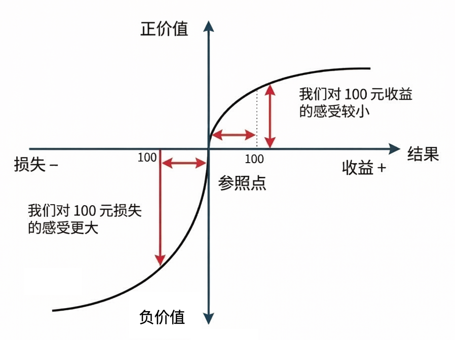
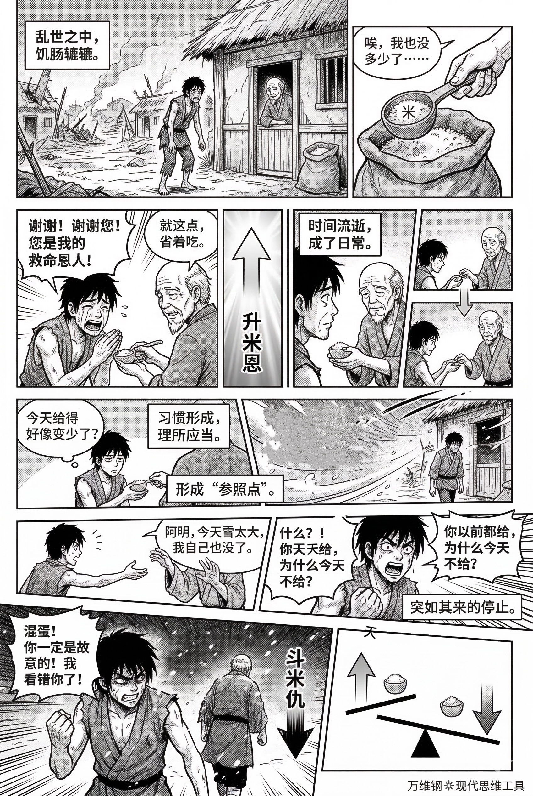

# 前景理论：让人铤而走险的不是贪婪，而是不甘（得到课程讲稿 + AI 加工段）

# 前景理论：让人铤而走险的不是贪婪，而是不甘

[前景理论：让人铤而走险的不是贪婪，而是不甘](https://www.dedao.cn/course/article?id=M30m4na5NkyKQQomeGKjvDg7Eowd2G)

我们都听说过这样的故事：一个人在赌场里输了钱，或者炒股、炒币被套牢，非但没有认赔离场，反而拼命加注。他会把积蓄都赌上，甚至没钱也要到处借钱加杠杆……结果越输越多，最后倾家荡产，甚至成了亡命之徒。

人们常说“利令智昏”，但是你想过没有，正常人是不会为了那种不靠谱的收益下那么大赌注的。

我们前面讲过凯利公式。面对一个机会你是否下注，应该只跟你在这里有没有 edge 有关，你的下注比例应该根据 edge 和 odds 的大小由公式决定……事实上大多数人最常犯的错误，不是过于冒险，而是不敢冒险。

那到底是什么，让那些赌徒近乎疯狂地铤而走险呢？

是心态。是输红了眼。是对之前损失的不甘。

人们冒险往往不是为了贪图更多，而是为了“回本”；反过来说，要是还没亏钱，人面对真正的获利机会反而容易缩手缩脚，生怕把到手的东西再吐出去。

这一讲的思维工具叫「 **前景理论** （Prospect Theory）」，它能解释一大堆决策偏误。

前景理论，有时候翻译成「**展望理论**」，是丹尼尔·卡尼曼（Daniel Kahneman）和阿莫斯·特沃斯基（Amos Tversky）1979 年提出来的，正是这个理论后来给卡尼曼带来了诺贝尔奖。

传统经济学认为，人决定要不要去做一件事、去冒一个险，应该由这件事带给你的「**预期效用**（Expected Utility）」决定，而效用取决于最终的财富值。

但前景理论说不是的 —— 人决定做不做一件事不是看预期效用 —— 而是看相对于我心里这个「**参照点**（Reference Point）」，我是赚还是亏。

参照点通常是你对现状的心理预期，也可以理解成是心理零点。通过参照点，前景理论画了一条非对称的 S 型曲线，如下面图中所示 ——

曲线的横坐标是相对于参照点，你赚到或者损失了多少钱；纵坐标是这个结果给你带来的心理价值。我们看在参照点的右边，也就是收益区，曲线是缓慢地上升；在参照点的左边，也就是损失区，曲线却是快速地下降。

什么意思呢？同样是 100 块钱，损失 100 块的痛苦，比赚 100 块的快乐大得多。

这就是著名的「 **损失厌恶** （Loss Aversion）」。学术界常见的说法是痛苦大约有快乐的两倍……其实这个比例因人因事而异，但重点是得与失的“不对称”。

参照点是你对现状的\*心理预期\*，而你的现状可不一定正好在参照点上。

如果你的现状正好在参照点上，或者在参照点的右侧 —— 你此刻对现状满意，甚至现状已经超出了你的预期 —— 请问你会想要冒险吗？你不会。因为只要是冒险，就有可能改变现状，就既有可能赢钱也有可能输钱。而根据这个曲线，赢钱带来的快乐远小于输钱带来的痛苦，那你何必冒这个险呢？

可如果你此刻站在参照点的左边呢？你对现状很不满意，你本来应该拥有比现在好得多的境遇！你已经是亏钱的状况，就算再多亏一点不也是痛苦吗？而一旦有机会回到零点，那个感觉可是太好了。所以你当然想赌一把。

这就是「光脚不怕穿鞋的」。古人说「哀兵必胜」，现在运动员说「我们要把包袱甩给对方，我们不能保赢怕输」，意思都是如果你的现状不及你的心理预期，你会有更大的冒险意愿，你的打法会更激进。

人不是为贪婪而疯狂，而是为不认输而疯狂。

**抓住「参照点」，行为经济学里很多五花八门的“认知偏误”，你都可以用前景理论解释。**咱们看最经典的四个 ——

**第一就是「 损失厌恶 （Loss Aversion）」**。S 曲线的不对称性告诉我们，人对失去一样东西的恐惧，远大于对得到同一样东西的渴望。

这就是为什么有人为了不承认亏本宁愿被套牢十几年，为什么有人为一段错误的关系搭上自己半辈子，为什么有人在每平米好几万的居住空间里堆满破烂，为什么花 20 元运费很心疼，但是改成包邮再把价格提高 20 元，大家都接受了……

**第二是「 现状偏见 （Status Quo Bias）」**。人们通常会把现状当作参照点，所以倾向于维持现状。

就算大城市的条件明显更好，很多人还是宁愿待在老家。就算工作干得很不开心也不愿意跳槽。明知当前的银行卡套餐不划算，人们也懒得换，连自动续费都没取消。公司流程明显是低效的，大家也还是按老办法做，因为改革让人感到不安。你说这叫“稳定压倒一切”，其实你只是习惯了。

**第三是「 禀赋效应 （Endowment Effect）」**，一件东西一旦归你所有，它的心理价格就立刻上涨 —— “拥有它”已经成了你的参照点，卖掉它就成了一种损失。

卡尼曼等人做过一个著名的“杯子实验”：让一群受试者抽奖，有的人中奖得到了杯子，有的人没有。实验人员问那些没得到杯子的人愿意花多少钱买这个杯子，大家最多出价 3 美元 —— 可是你再问那些中奖得到杯子的人愿意多少钱卖掉这个杯子，人家说给 7 美元都不卖。

这就是为什么卖自家车的人跟买车的人特别难以达成一致。卖家卖的是跟了我这么多年的老伙计，买家买的是一辆旧车。

**第四是「 框架效应 （Framing Effect）」**。所谓框架就是你的叙事方式 —— 它能决定别人的参照点，从而操纵别人的选择。这里的著名案例可太多了。

比如「默认选项效应（Default Option Effect）」，人们倾向于服从表格上的默认选项……你肯定早就知道。

再比如卡尼曼和特沃斯基设计的「亚洲疾病问题（Asian Disease Problem）」：面对一场预计导致600人死亡的疫情，现在有两个治疗方案，请问您选哪一个？

关于这两个方案，一部分受试者收到的描述是 ——

方案A：确定救活200人。

方案B：赌一把，1/3概率救活600人，2/3概率一个也救不了。

结果 72% 的人选了方案 A，我们不冒险，我们要确保救活这些人。

另一部分受试者看到的描述是 ——

方案A：确定死400人。

方案B：赌一把，1/3概率一个也不死，2/3概率600人全死。

结果就成了 78% 的人选择方案 B，我们哪能看着这么多人确定死亡呢？

可是你想想，这两种描述在数学上其实是完全等价的！同一件事儿，框架诱导你考虑存活，你就保守；诱导你考虑死亡，你就冒险。

你还别不信，在医疗场景中就有研究发现，给患者选择肺癌的治疗方案，如果医生说“手术后一个月内的存活率是 90%”，绝大多数患者会选择做手术；可医生要是说“手术后一个月内的死亡率是 10%”，很多人就会吓得拒绝手术。

生死攸关的重大决策，居然取决于一句话的表述方式，叙事的魔力竟至于此。

这可不只是心理上感觉舒不舒服，要知道错误的决策会给你带来损失。

一个我特别喜欢的研究，是关于纽约市的出租车司机。

按理说，下雨天打车的人多，生意好，司机应该趁机多拉活多赚钱；晴天生意差，可以早点收工休息 —— 可是调查发现司机们不是这么干的。他们在下雨天早早收车回家，晴天却反而在街上苦苦转悠十几个小时。为啥呢？因为司机都给自己设定了一个“每日目标收入”，作为参照点。下雨天很容易达到参照点，司机认为完成任务了，再多干也不值得；晴天达不到目标，是男人就别回家！

回头再看炒股，这里有个最经典的散户作风，叫「处置效应（disposition effect）」。

按理说，一只股票该不该卖，应该只由对它的期望决定，而跟你当初的买入价毫无关系。可是在现实中，买入价就是散户最强烈的参照点。

股价刚涨了一点，为了体验“我在赚钱”的确定性，散户赶紧卖出，锁定利润；股价跌了，散户心想只要我不卖就不算真正的亏损；股价已经暴跌，散户反而被激发了冒险精神，果断加仓！这就是为什么散户总是抓不住大涨，却总能全程经历大跌。

还有一个有意思的应用是公关危机。

比如你是个公众人物，犯了个小错被人家曝光了。按理说你就直接认栽，也不会有什么太大的问题，过两天这事就过去了。可你的参照点是你有一个完美形象，所以你会想把这个事遮掩过去 —— 殊不知遮掩是一种非常冒险的动作。

人们通常不会编造自己做过什么好人好事，但是常常会掩盖自己犯的错误。然而像尼克松水门事件、克林顿拉链门事件那样，公众会认为你的遮掩行为比当初那个错误更可恶，你连带的损失将是巨大的。

归根结底，那个参照点纯粹是你的主观想象。它是个叙事！一千万输成二十万，有的人会跳楼；可是你让另一个人拥有二十万，人家高兴还来不及。

高手应该自由设置自己的参照点。它不一定非得是现状，也不一定是你过去曾经达到过的高点，它完全也可以是你的长期目标，或者任意什么东西。它应该是激励而不应该是枷锁。

有一个好办法叫「 **心理账户 （Mental Accounting）**」。比如你买了一张价值一百元的电影票，走到门口发现票丢了。在这种情况下，你会不会再买一张呢？很多人不会。可是我们换个角度想：你会因为刚刚弄丢了钱包里一百元，而不看这场电影吗？实验中多数人选择仍然买票。

这个区别的根本原因就在于，你把“看电影”和“总钱包”记成了两笔心理账 —— 而其实那都是你的钱。

既然如此，我们为什么不设置一个每年两千元的“风险探索账户”或者叫“交学费账户”呢？平时遇到任何意外损失，都从这个账户里扣，年底如果还有剩余就捐出去。反正这也不是“你的钱”，那么遭遇任何损失对你来说就都无所谓了。

你还可以给别人设置参照点。

今年公司利润好，老板说要给每人年薪涨 5 万块钱……HR 说这可不行。这笔钱算成涨薪，员工就会认为这是本来就该拿的参照点 —— 那万一明年公司业绩不好，你不能继续涨薪，员工就不但不会感谢你今年的慷慨，反而会有停滞感甚至剥夺感，搞不好会产生离职倾向。正确的做法是：把 2 万元作为涨薪，3 万元算作绩效奖金。

老百姓说的「升米恩，斗米仇」，其实也是参照点问题：前者是本来不该给，但是你给了，是个惊喜；后者是因为你总给，人家当成你就该给，结果你有一次不方便没给，就被怨恨。

市侩哲学会说那我们就不要帮助无关的人……但这里其实是有解的。还是管理参照点：一个是以工代赈，想要得到好处必须付出代价；一个是把丑话说在前面降低预期；一个是把固定底薪改成偶尔的奖励 —— 这叫施恩去规律化。

最后我再说个大的。

北宋的宣和北伐，也就是趁着金国打辽国，搞“联金抗辽”，堪称是中国历史上最大的战略灾难之一。宋徽宗君臣首鼠两端，一会儿要打一会儿又犹豫退缩，又想收复燕云又不敢承担全面战争的代价……最后引狼入室，终成靖康之耻。这帮人到底怎么想的呢？

吉林大学的于海洋和沈朝永有一篇论文认为，关键是大宋有不是一个，而是\*两个\*参照点 ——

一个是“现实安全参照点”。宋辽之间已经和平了一百多年，保持现状，每年花点岁币买平安，不挺好吗？主和派说好好的何必冒险？

还有一个是“历史领土参照点”。燕云十六州是汉唐故土！我们只要一天不收回来，何以面对祖宗？为了弥补这个巨大的历史亏损，现在有机会为什么不博一下呢？

这两个参照点让朝廷没有清晰的目标函数。一边把国家推向冒险，一边又死死拽住不许真拼命。下面将士到底该怎么执行？你既拿不出亡命徒的胆量去赢，又守不住老实人的本分去熬，结果必然是既打不疼敌人也保不住自己，是最糟糕的局面。

前景理论把“人是追求利益的动物”改写成了“人是守卫参照点的动物”，从来都没有什么绝对理性。处在参照点右侧，我们就守成；处在左侧，我们就押注。

你的勇敢和怯懦往往不是出自品格，而是出自坐标。

这在某种意义上是合理的。一只非洲草原上觅食的动物，难道不应该像纽约出租车司机那样，每天吃饱了就停止折腾吗？反正食物也不能长期储存。

只是今天有些游戏的规则改变了。那我们就得把参照点从默认改为主动选择才行。

---

扑克界有句俗语叫“任何两张底牌都能赢”，意思是即使摸到一手“烂牌”，只要坚持到底，无论机会多么渺茫，也总有一丝赢牌的希望。可惜，这句话后面还有一句，“……但没有足够的时间获得盈利”。

决定哪几手牌适合下注、哪几手牌必须放弃，是玩家做出的第一个选择，也是最重要的选择。职业德州扑克选手在这方面表现得更好，在拿到两张底牌后，他们继续玩牌的概率只有15%～25%。相比之下，业余玩家拿到底牌后坚持玩牌的概率超过50%。

亏损时，我们就会成为风险偏好者。我们想坚持下去，希望能规避实际损失。丹尼尔·卡尼曼将其描述为“确认损失厌恶”。

换言之，我们喜欢在落后的情况下坚持。

**展望理论的一个重要发现是损失厌恶**，即损失所带来的情感冲击要大于同等收益所带来的情感冲击。

---

**框架效应：**指对同一个问题在两种逻辑意义上相似的说法却导致了不同的决策判断。也就是说我们的思维会受到不同框架（例如表达方式不同）的影响，从而做出不一样的选择。

- 窄框架（narrow framing），遇到一个东西做一次决策，一事一议；
- 宽框架（broad framing），把所有东西都摆在桌面上集中选择。

---

## 真正驱动人的，不是“追求收益”，而是“逃离损失”

这篇关于“前景理论”的文章，不只是解释了赌徒、散户和普通人的行为偏误，而是揭示了一个更深的现实：

**很多时候，真正驱动人的，不是“追求收益”，而是“逃离损失”。**

人并不是天然热爱风险。

恰恰相反，大多数人本能上是厌恶风险的。

真正让人突然变得激进、孤注一掷、近乎疯狂的，往往是：

“我不能接受自己已经输了。”

这就是前景理论最锋利的洞见。

### 前景理论最核心的一句话

传统经济学认为：人会根据“最终财富”做理性决策。

但前景理论发现：**人并不是围绕“绝对财富”行动，而是围绕“心理参照点”行动。**

也就是说：你是否觉得自己“亏了”，比你实际上拥有多少，更重要。

于是，人类决策的底层逻辑，从：“我现在有多少钱”

变成了：“我和我认为自己本该拥有的状态相比，差了多少。”

这个“本该拥有”，就是参照点。

而人一旦跌到参照点以下，整个风险偏好会发生剧烈变化。

### 为什么人亏钱后反而更敢赌

这是前景理论最反直觉、但也最真实的地方。

正常情况下，人是风险厌恶的。

比如：

- 你已经赚到 100 万
- 现在有人让你赌一把
- 有 50% 概率赚 20 万
- 50% 概率亏 20 万

大多数人不会赌。

因为：失去 20 万的痛苦，远大于得到 20 万的快乐。这叫“损失厌恶”。

但如果场景换一下：

- 你原本有 100 万
- 现在已经亏到 20 万

这时候，你对“继续亏损”的感受会变钝，对“回到原点”的渴望会极度放大。

于是你会突然变得愿意冒险。所以赌场里真正危险的人，从来不是赢钱的人。

而是想回本的人。很多金融灾难、创业崩盘、婚姻纠缠、人生失控，都不是因为“贪婪”，而是因为“不甘心。”

### 人最危险的时候，不是贫穷，而是“落差感”

这是前景理论特别深刻的地方。

决定你是否痛苦的，很多时候不是现实本身，而是现实和参照点之间的距离。

同样是月薪 1 万：

- 一个人从 3000 涨到 1 万，会觉得人生腾飞
- 一个人从 5 万跌到 1 万，会觉得生不如死

财富是一样的。痛苦程度完全不同。

因为人的大脑不记录“绝对值”，只记录“变化”。

所以真正让人崩溃的，往往不是贫穷，而是“失去”。

这也是为什么：

- 牛市亏钱比熊市更痛
- 离婚比单身更痛
- 公司降薪比低薪更痛
- 中产返贫比底层贫穷更容易绝望

因为参照点已经被抬高了。

### 为什么很多人会被“套牢一生”

前景理论几乎可以解释所有“舍不得”。

#### 股票不肯止损

因为一卖“亏损”就从浮亏变成了真实亏损。于是人会产生一种荒谬的心理：“只要我不卖，我就没输。”这本质上是在保护参照点。

#### 错误关系无法离开

因为你已经投入了时间、情感、青春。离开意味着承认这些都损失了。所以很多人宁愿继续沉没，也不愿面对损失。这就是“沉没成本效应”背后的心理基础。

#### 老人囤积破烂

因为“拥有”已经成了参照点。失去任何东西，都会被感知为损失。于是丢东西会痛，哪怕那东西根本没价值。

### 框架效应：语言可以操控人的风险偏好

前景理论最可怕的一点在于：

人的选择，会被“叙事方式”严重影响。

同样的数学结果：

- “确定救活 200 人”
- “确定死 400 人”

本质完全一样。

但前者让人保守，后者让人冒险。

因为：

“救活”对应收益区，

“死亡”对应损失区。

而人进入损失区后，

会天然提高风险偏好。

这意味着：

语言不是描述现实，

而是在重塑参照点。

所以：

- 媒体
- 广告
- 政治宣传
- 商业营销
- 社交媒体

本质上都在争夺：“你的参照点定义权”。

### 很多人一生都被困在“错误参照点”里

这是全文最值得深思的地方。

参照点其实是主观的。

它不是现实。

它是：

你脑中的叙事。

比如：

一个人亏到只剩 20 万想跳楼，

另一个人得到 20 万开心得睡不着。

现实一样。

参照点不同。

所以真正决定人生体验的，

并不只是资源，

而是：

你如何定义“正常”。

很多人的痛苦，

不是来自现实太差，

而是：

参照点太高、太死、太僵化。

比如：

- 必须年薪百万才算成功
- 必须结婚才算完整
- 必须孩子优秀才算体面
- 必须持续上升才算正常

于是人生会进入一种危险状态：

你不再是在生活，而是在“守卫参照点”。

### 高手真正厉害的能力：主动重设参照点

这可能是前景理论最重要的实践价值。

成熟的人，不是没有欲望的人。

而是能主动管理参照点的人。

因为参照点决定：

- 你的满足感
- 你的风险偏好
- 你的情绪波动
- 你的决策质量

真正高级的人，会刻意设计自己的心理坐标系。

#### 用长期主义替代短期波动

如果你的参照点是：

“今天不能亏”

你会极度短视。

但如果参照点变成：

“十年后整体变强”

你对暂时损失的承受力会大很多。

#### 建立“风险账户”

这是非常实用的方法。

每年固定拿出一部分钱：

- 学习
- 试错
- 投资
- 探索新机会

这部分钱默认允许亏损。

于是：

亏损不再意味着“失败”，而只是“预算内支出”。

你是在主动重构参照点。

#### 把“成长”设为参照点

很多人：

赚到钱也焦虑，获得成功也空虚。

因为参照点永远是“别人”。

但如果参照点变成：

“我是否比过去更强”

整个心理结构会稳定很多。

### 前景理论最后指向的，其实是“自由”

“你的勇敢和怯懦往往不是出自品格，而是出自坐标。”

很多人以为：自己突然变勇敢了，或者突然变懦弱了。

其实往往只是：

**你在参照点的位置变了。**

**站在收益区，人会保守。**

**站在损失区，人会激进。**

所以真正的自由，不是永远理性。而是**你能意识到，自己正在被哪个参照点支配。**

---

### 禀赋效应

对于你已经拥有的东西，你会高估其价值，远超过你没有拥有它时愿意支付的价格，从而更不愿意放弃或交换。

禀赋效应是退出的阻碍，因为当我们非理性地评价自己拥有的东西时，会错估它们的期望值。我们会认为自己创办的公司、设计的项目或拥有的信念在价值上高于其实际价值。

禀赋效应的原始基础是**损失厌恶**。简单地说，**如果我们权衡之下发现损失大于收益，就会更担心失去已经拥有的东西，而不是渴望得到相同的东西。**

我们舍不得扔掉的，从来不是那些破东西，而是那个有破毛病的自己。大脑给万物刻下“我的”名字，便都成了舍不得拆的人格废墟。

> 最大的难点在于，**人的自我系统和价值判断系统在大脑中是高度重叠的。所以我们会自动高估一切属于自己的东西。**
> 
> 比如丹尼尔·卡尼曼（Daniel Kahneman）和丹·艾瑞里（Dan Ariely）的书里都讲过一个「**禀赋效应（Endowment Effect）**」：同样一个随机发放的杯子，如果先发给你让你卖，你会要价比如说20块钱；而如果没法给你，问你愿意花多少钱买，你会认为它只值10块钱。
> 
> 这就解释了为什么很多人什么破东西都舍不得扔。大到一堆没用的旅游纪念品，小到自己小时候用过的练习本，非得留着 —— 不是为了节省，只是因为那些是“我的东西”。
> 
> **那如果一个人连破烂都舍不得扔，他又怎么可能轻易放弃自己性格里的毛病呢？**

这个观点非常深刻，直指人类心理和行为的核心困境。您完美地将行为经济学中的一个经典概念（禀赋效应）与更复杂、更内在的自我成长问题联系了起来。

我们难以放弃性格毛病，其深层心理机制和我们舍不得扔破烂是完全相通的。

#### **“我的”意味着“我的一部分”**

当我们说“我的杯子”、“我的旧书”时，我们指的不仅仅是物品的所有权，在心理层面上，这些物品已经成为**自我延伸（Self-Extension）**的一部分。它们承载着我们的记忆、经历和身份认同。

同样地，性格特质——无论是好是坏——更是构成了“我是谁”的核心。一个“急性子”的人可能会认为“没耐心”就是他个性的一部分；一个“习惯性拖延”的人可能会将拖延与他的创作过程或抗压方式联系起来。**要放弃这些毛病，在感觉上无异于要否定和切割掉一部分自我**，这会引发巨大的心理不适和抗拒。

禀赋效应的底层原理是卡尼曼前景理论中的“损失厌恶”：**人们对失去的痛苦感，远远大于得到同等东西的快乐感。**

- **对于破烂**：扔掉它，你感受到的是“损失”一个属于你的东西的痛苦。而保留它，你几乎感觉不到成本（除了空间和整理的成本，但这些成本是隐性的、未来的）。两相比较，大脑自然选择避免即时的痛苦。
- **对于性格毛病**：改变一个毛病，意味着你要“失去”一个你熟悉、依赖多年的行为模式或思维习惯。即使这个模式有害，但失去它依然是痛苦的、令人恐惧的。而新习惯带来的好处（比如更高效、人际关系更好）是未来的、不确定的。因此，大脑同样会抗拒这种“损失”。

#### **认知失调的自我辩护**

我们的大脑天生追求一致性。如果一个人内心隐隐知道“保留破烂”和“不改变毛病”是不合理的，他就会为自己找理由，以使自己的认知和行为达成一致。

- **对于破烂**：“这个以后可能用得上”、“这是有纪念意义的”、“扔了太浪费了”。这些理由是为了合理化“不扔”的行为，消除“我知道该扔但没扔”的认知失调。
- **对于性格毛病**：“我说话直，说明我真诚”、“我拖延是因为我在压力下才能爆发”、“我敏感是因为我洞察力强”。**我们将毛病重新包装，甚至美化为一种特点或优势**，从而避免了承认“我需要改变”所带来的自我否定感。

认识到这只是一种**心理错觉**，是我们踏上真正自我解放之路的第一步。改变不是对自我的否定，而是对自我的升级和优化。

禀赋效应并非简单的“敝帚自珍”，在认知心理学中，它被精确定义为**支付意愿（WTP）与接受意愿（WTA）的非对称性缺口**。个体一旦获得某物品的所有权（哪怕仅仅是名义上的持有），其愿意放弃该物品的最低价格（WTA），显著高于其在未拥有该物品时愿意支付的最高价格（WTP）。通常，WTA/WTP的比率在 2:1 左右。这种估值差异**并非**源于买卖双方的信息不对称或财富差异，而是纯粹由“所有权状态”诱发的认知偏差。

#### 核心机制：参照点依赖与损失厌恶

这是前景理论的解释框架。

- **参照点移动**：人类对价值的判断不是基于绝对值，而是基于相对于“当前状态”（Reference Point）的变化。

  - **非拥有者**：参照点是“无杯子”，获得杯子被编码为“收益（Gain）”。
  - **拥有者**：参照点是“有杯子”，放弃杯子被编码为“损失（Loss）”。
- **不对称权重**：心理物理学函数显示，损失曲线比收益曲线更陡峭。失去一个杯子的心理效用损失，绝对值上大于获得一个杯子的效用收益。

#### 认知机制：动机性推理与注意聚焦

现代认知心理学提出了更精细的解释模型——**查询理论**。

- **记忆提取偏差**：当作为卖家时，个体的注意力会先入为主地聚焦于“该物品的优点”以及“放弃它的坏处”；而买家则聚焦于“现金的价值”或“物品的缺陷”。
- **所有权作为一种启发式线索**：所有权不仅是法律状态，更是一种认知框架，它引导大脑优先处理与物品相关的积极信息。

#### 神经基础：大脑如何计算价值

功能性磁共振成像（fMRI）研究揭示了其神经相关物：

- **损失的痛苦**：当拥有者考虑出售物品且价格低于预期时，**脑岛（Insula）**（与痛觉、厌恶感相关）和**杏仁核**（与恐惧、威胁相关）会被激活。这证实了“出售”在生理上确实引发了负面唤醒。
- **自我关联**：**内侧前额叶皮层（mPFC）**与自我表征密切相关。一旦确立所有权，物品便被纳入“扩展自我（Extended Self）”的神经表征中。放弃物品引发的神经活动，类似于某种程度的“自我损伤”。

#### 边界条件：效应何时消失？

禀赋效应并非牢不可破，以下调节变量会削弱甚至消除它：

1. **交易经验**：经验丰富的交易员几乎不表现出禀赋效应。他们的神经回路已经通过训练，将物品编码为“交易媒介”而非“消费品”。
2. **物品属性**：对于**交换性商品**，只要其预期用途是交换，禀赋效应就会减弱。只有对于**享乐性或身份象征性商品**，效应才最显著。
3. **期望理论**：如果你预期自己会卖出该物品，参照点会提前调整，从而降低损失厌恶。

#### 现实扭曲场：应用与陷阱

- **市场失灵**：在二手房或二手车市场，卖方的高估值导致大量互利交易流产，降低了市场流动性。
- **伪所有权策略**：

  - **试用期与退货权**：商家通过“免费试用”赋予消费者临时的心理所有权。退货不再是“恢复原状”，而是“遭受损失”。
  - **触觉营销**：研究表明，仅仅触摸商品就能增强心理所有权感，提高支付意愿。
- **默认选项（Defaults）**：在器官捐献或401k养老计划中，默认选项被视为“禀赋”。改变默认选项被视为放弃现有状态，因此人们倾向于维持现状。

#### 认知干预：反制策略

要克服这种根植于进化的认知偏差，仅靠意志力是不够的，需要通过认知重构切断触发机制。

1. 强制视角切换：不要问“我想要卖多少钱”，而是进行反事实模拟：

   - **严格测试**：“假设我现在手里只有等值的现金，而没有这个物品，我会用手里的钱买下它吗？”
   - **原理**：此问题强制将大脑的参照点从“拥有者（防守态）”重置为“非拥有者（获取态）”，中和损失厌恶。
2. 制造心理距离

   - **语言剥离**：在决策时，强迫自己使用第三人称描述资产（例如，称“这只股票”而非“我的股票”）。
   - **物理隔离**：对于犹豫不决的闲置物品，将其打包放入不可视空间（如地下室）。
   - **原理**：减少感官输入对mPFC（自我相关脑区）的刺激，削弱“物品即自我”的神经联结。
3. 将“机会成本”具象化

   - **操作**：不要把保留物品看作“零成本”。必须明确计算保留物品意味着放弃了什么具体的快乐（例如：“如果不卖这个旧相机，我就没钱去听那场演唱会”）。
   - **原理**：禀赋效应源于过度关注“失去物品”的痛苦，而忽略了“未获得资金”的损失（机会成本）。具象化机会成本，是利用一种损失（没去演唱会）去对抗另一种损失（卖相机）。
4. 预承诺机制

   - **操作**：在持有物品或股票之前，设定明确的退出条件（止损点或清理时间）。
   - **原理**：在“冷认知”状态下由前额叶（PFC）制定规则，防止在决策时刻被由杏仁核主导的“热情绪”劫持。

禀赋效应是人类进化过程中为了应对资源稀缺而保留的“守成本能”。在现代经济社会中，它常沦为非理性决策的推手。理解其背后的**参照点机制**与**神经自我卷入**，我们才能将被动的“所有权感觉”转化为主动的“价值评估”。

### **损失厌恶**

当面对“机遇与风险并存”的局面时，我们对损失的厌恶超过对获得的喜悦。它甚至可以被推广到更一般的情况：**我们对失败的恐惧超过对成功的渴望。**

人类内心最深处的恐惧是损失。因为改变不可避免地会带来损失和收益，即使我们希望取得积极的结果。损失总是在我们的脑海中反复出现，我们的大脑就像一个被设定好的程序，要求给予损失最大的关注。

人们厌恶确定的损失，甚至不惜去冒巨大的风险来避免它。

损失厌恶的本质，远不止于对物质得失的计较，它更深层地表现为一种情感和动机上的不对称——**我们对负面结果的规避动力，远远强于对正面结果的追求动力。**

这可以从一个简单的心理天平来解释：

- **一边是“可能的获得”**：成功、收益、喜悦。这些是增益，是“锦上添花”。
- **一边是“可能的损失”**：失败、亏损、痛苦、尴尬。这些是损耗，是“动了他的根基”。

由于进化压力，我们的大脑天生被设定为更关注后者。因为对祖先来说，一次“损失”（比如食物被抢、受伤）可能意味着死亡，而一次“获得”（找到更多食物）只是活得更好。这种深植于基因的偏好，在今天依然主导着我们的许多决策。

**“对失败的恐惧超过对成功的渴望”** 是一个极其重要的洞察，它解释了现实生活中大量的“停滞”与“不作为”：

1. **职业发展**：许多人宁愿呆在一个不满意但安稳的岗位上，也不愿去追求一个更有发展但存在不确定性的新机会。因为“害怕失去现有的安稳”远大于“渴望可能获得的成就”。
2. **创新与投资**：企业家和投资者在决策时，“避免亏损”往往是比“追求利润”更优先的考量。这导致了有时会过于保守，错失良机。
3. **个人成长与学习**：人们不愿意学习新技能（如公开演讲、一门新语言），往往不是因为不渴望变得更好，而是**极度害怕在过程中出丑、暴露自己的笨拙和失败**。对“社交形象损失”的恐惧，压倒了“自我提升”的渴望。
4. **人际关系**：在一段不尽人意的关系中，人们常常选择维持现状。因为“害怕失去现有的陪伴和习惯”所带来的孤独与不确定性，超过了“渴望获得更高质量关系”的幸福预期。

认识到这一点是战胜它的第一步。

- **重构框架（Reframing）**：将“追求成功”的目标，转变为“避免失败”的目标。例如，减肥时，不要想“我要变瘦”（追求获得），而是想“我绝不能让自己再胖回去”（避免损失）。后者往往能提供更强的动力。
- **缩小尝试的成本**：让第一步的“潜在损失”变得极小化。比如想尝试新事业，先用业余时间做个小项目；想学新东西，先免费上一节体验课。这降低了启动的心理门槛。
- **专注于“不改变”的长期损失**：理性地分析，维持现状虽然避免了短期风险，但可能导致更大的长期损失（如职业生涯停滞、健康恶化）。让“不作为的损失”变得清晰可见，从而激发行动。

损失厌恶揭示了人类一种深层的动机不对称。它不仅是经济行为的法则，更是一面镜子，照出了我们为何常常困于现状、畏惧前行——**因为我们的大脑，天生就是一个更出色的“损失预防学家”，而非“收益优化大师”。**

### 断舍离

克服因禀赋效应导致的“舍不得扔”旧物问题，需要结合认知调整和行为策略，核心是**降低心理所有权带来的价值高估、缓解损失厌恶、并找到替代性满足**。

#### **认知层面：重塑思维**

1. **认清“虚假价值”：**

   - 提醒自己：**“拥有≠高价值”**。物品的价值在于使用，而非占有。问问自己：“如果现在商店里卖这个，我会花钱买它吗？”（答案通常是否定的）。
   - **区分“情感价值”与“实用价值”：** 承认某些物品承载记忆（如旧情书、孩子第一幅画），但绝大多数旧衣服/物件只是“占地方的垃圾”。对后者要狠心。
2. **理解“沉没成本”：**你付出的金钱、时间、精力是**沉没成本**，无法收回。保留无用物品并不能挽回损失，反而持续消耗空间、时间和精力（整理、搬运、看着心烦）。
3. **计算“持有成本”：**

   - **空间成本：** 房价/租金高昂，每平米都在花钱。堆满杂物的空间就是浪费的金钱。
   - **时间成本：** 整理、寻找物品、搬家时打包搬运耗费的时间。
   - **心理成本：** 杂乱环境增加焦虑、降低效率、影响心情。“眼不见心不烦”是真理。
4. **转换视角：想象“无物一身轻”：**想象扔掉后清爽的空间、轻松的搬家、不再需要整理的便利。将“扔掉”视为**获得空间、时间和宁静的收益**，而非损失。
5. **接受“不完美”：**“万一以后用得上呢？”是最大的借口。接受未来可能有极小的使用概率，但为这小概率事件长期付出高昂的持有成本不值得。真需要时，租/借/买新的可能更划算高效。

#### **行为层面：实战策略**

1. **设定明确、可执行的标准 (关键！)：**

   - **使用频率法：** “过去一年内用过吗？” 没用的，除非有极强纪念意义或季节性物品（如滑雪服），果断处理。
   - **破损/过时标准：** 有无法修复的破损、严重污渍、明显过时且不会再穿的衣物？扔掉或回收。
   - **“心动”法 ：** 拿起每件物品，感受它是否还让你“怦然心动”？没有就放手。
   - **“一进一出”原则：** 买一件新衣服/物品，必须处理掉一件旧的。强制循环。
2. **分阶段处理，降低决策压力：**

   - **不要试图一天搞定所有！** 按区域（如一个衣柜、一个抽屉）或类别（如所有T恤、所有旧书）分批处理。
   - **设置“犹豫箱/袋”：** 对实在难以决定的物品，放入一个箱子，写上日期（如3个月或6个月后）。到期后没打开用过，直接处理掉（不看内容）。
3. **提供替代性“获得感”，缓解损失厌恶：**

   - **捐赠/转赠：** 把还能用的物品捐给慈善机构、旧衣回收箱，或送给需要的朋友/邻居。想着物品在别人手中发挥作用，能产生\*\*积极情绪（助人愉悦感）\*\*，抵消“失去感”。拍照记录捐赠过程，强化正面感受。
   - **二手出售：**在闲鱼等平台出售较有价值的物品。虽然麻烦，但换来的现金是实实在在的收益，让“失去”变得可接受。
   - **环保回收：**对于破旧无法使用的衣物（可做工业抹布/再生纤维）、电子垃圾等，找到正规回收渠道。赋予“扔掉”环保意义。
4. **创造仪式感，切断情感联结：**

   - 对确实有纪念意义但已无实用价值的物品（如旧门票、有回忆但不会再穿的衣服）：
   
     - **拍照留念：** 高清拍照，存入电子相册或云盘。保留记忆，舍弃实体。
     - **制作纪念册/剪贴簿：** 将小件纪念品（票根、明信片）整理成册，体积大大缩小。
     - **保留核心象征物：** 只保留最能代表那段记忆的一两件小物（如一枚徽章、一张照片），处理掉其他关联度低的。
5. **改变存储方式，增加获取难度：**

   - **“藏起来”测试：** 把不确定是否要扔的物品打包封箱，放到储物间/床底等不易拿到的地方。如果半年/一年都想不起用它，证明不需要。
   - **可视化收纳：** 使用透明收纳盒，让物品一目了然。杂乱的堆积更容易让人忽视和遗忘，透明化增加“看见即使用”的可能，也更容易发现哪些是冗余。

#### **习惯养成：防患于未然**

1. **谨慎购买：** 源头控制最重要！购物前三思：

   - “我真的需要吗？”
   - “家里有地方放吗？”
   - “使用频率会高吗？”
   - 遵循“延迟满足”：喜欢的东西放购物车几天，冲动消退后往往就不想买了。
2. **定期审视（季度/半年）：** 设定固定时间（如换季时）整理特定区域，及时清理不再需要的东西。形成习惯后，负担会越来越小。
3. **拥抱极简/精简生活理念：** 了解极简主义的核心是聚焦真正重要的事物（而非物品数量），减少物品带来的负担。阅读相关书籍/博客（如《怦然心动的人生整理魔法》《断舍离》）获得持续动力。

**关键心法：**

- **行动比完美重要：** 不要追求一次性完美清理，从小处着手，迈出第一步。
- **聚焦“收益”：** 时刻提醒自己清理带来的空间、时间和心灵上的解放。
- **“物品是为人服务的”：** 你不是物品的保管员。无用的物品，就是在消耗你的生命能量。

**克服禀赋效应是一个与本能对抗的过程，需要持续练习。** 每一次成功的清理，都是对“损失厌恶”的一次胜利，你会越来越清晰地感受到“少物”带来的自由和力量。开始行动吧，从一个抽屉或一个衣柜做起！

#### **断舍离5步行动法**

1. **📍 集中清空**  

   - 将**同一类物品**（如全部T恤/全部旧书）一次性堆在眼前（如床上/空地）。  
   - **⚠️ 关键：必须全部可见！**
2. **⚖️ 快速筛选（3秒1件）**每件物品只问 **3个问题**，任一答案为“否”立刻处理：  

   - **过去1年用过吗？**  
   - **未来半年会用吗？**  
   - **现在看见它还心动吗？***（破损/过时/闲置的直接归入处理堆）*
3. **♻️ 分类处理（当日完成）**  

   - **捐赠**：干净完好的→装袋→搜本地捐赠点/旧衣回收箱（当天送走）。  
   - **二手**：高价值品→挂闲鱼（标价低于市场价，7天未出自动捐赠）。  
   - **回收**：破旧衣物/电子废品→投指定回收箱（地图APP搜“旧衣回收”）。  
   - **丢弃**：无法再利用的→直接扔垃圾桶。  
4. **📦 设置“犹豫箱”（防后悔）**  

   - 实在难抉择的物品→放入1个箱子，贴标签：**“犹豫箱-到期日（3个月后）”** 。  
   - 到期未开箱→**整箱丢弃/捐赠（不打开看！）** 。
5. **🚫 源头控制（防复发）**  

   - 处理完立刻执行：**买1件新=扔1件旧** 。  
   - 每季度检查1次：衣柜/储物区超10分钟未用物品→回归步骤1。

✨ **核心原则**

- **快刀斩乱麻**：单次整理≤1小时，避免纠结。  
- **眼不见为净**：处理品立刻移出视线。  
- **空间即金钱**：每清空1㎡=赚回千元租金/房价。  

**✅ 立即行动：今天就从1个抽屉或1个衣柜开始！**

### 处置效应

**处置效应是**人们倾向于过早卖出盈利资产、长期死扛亏损资产的一种系统性非理性行为。

投资者在投资决策中，倾向于**过早地卖出盈利的股票（即“落袋为安”），而长期持有亏损的股票（即“不愿割肉”）** 的一种系统性认知偏差。简单来说，就是 **“持亏惜售，盈利早抛”**。

假设你买了两只股票：

- **股票A**：买入价10元，现在涨到了15元（盈利50%）。
- **股票B**：买入价10元，现在跌到了5元（亏损50%）。

你现在急需用钱，必须卖出一只股票。你会选择卖哪一只？

- **受处置效应影响的投资者**：很可能会选择卖出**盈利的股票A**。因为卖出盈利的股票能带来成就感（“看，我赚钱了！”），并锁定利润，避免未来价格下跌导致利润回吐。而持有亏损的股票B，可以避免将“账面亏损”变为“实际亏损”所带来的痛苦和后悔（“只要我不卖，我就没真亏”），同时幻想未来股价能涨回来。
- **理性的投资者**：会基于对两只股票未来前景的判断来做决定。如果认为股票A已经涨到顶、未来会跌，而股票B只是短期调整、基本面依然良好，那么卖出A是理性的。反之，如果认为股票A还有上涨空间，而股票B基本面恶化、会继续下跌，那么理性的选择是**卖出亏损的股票B**，及时止损，并将资金投入到更有潜力的机会中。

处置效应描述的正是大多数投资者会不自觉地选择前一种非理性的行为模式。

#### 产生原因：前景理论

处置效应的根源可以用诺贝尔经济学奖得主丹尼尔·卡尼曼和阿莫斯·特沃斯基提出的**前景理论**来解释。该理论的核心观点是：

1. **参考点依赖**：人们做决策时，不是看最终的绝对财富，而是看相对于某个参考点（通常是买入价）的收益或损失。
2. **损失厌恶**：人们对损失的痛苦感远大于同等收益带来的快乐感（研究表明，损失的痛苦感大约是盈利快乐感的2倍）。
3. **效用函数形状**：

   - 在**盈利区域**，函数是**凹的**，表明人们是风险厌恶者。赚了5000元很高兴，再赚5000元带来的额外快乐会递减。因此，他们倾向于“落袋为安”，锁定确定的利润，避免风险。
   - 在**亏损区域**，函数是**凸的**，表明人们是**风险寻求者**。已经亏损了5000元很痛苦，再亏损5000元的额外痛苦也相对较小。因此，他们宁愿“赌一把”，冒着更大的风险持有亏损头寸，希望回本，而不愿接受确定的损失。

面对盈利时，投资者变得风险厌恶，急于卖出；面对亏损时，投资者变得风险偏好，死守不放。这就直接导致了处置效应。

#### 问题与危害

1. **降低整体投资回报**：过早卖出赢家，意味着你放弃了未来继续上涨的潜力（“放跑了牛股”）。而长期持有输家，不仅占用资金，还可能面临持续下跌的风险，导致亏损扩大（“炒成了股东”）。
2. **增加机会成本**：被套牢在亏损股票里的资金，无法用于投资其他更有前景的资产，错失了赚钱的机会。
3. **违背投资基本原则**：理性的投资原则是“**截断亏损，让利润奔跑**”（Cut loss short, let profit run）。处置效应恰恰与此相反，是“**锁定利润，让亏损奔跑**”。

#### 如何克服

意识到自身存在这种偏见是克服它的第一步。以下是一些策略：

1. **制定并遵守投资纪律**：在买入前就设定好**止盈点**和**止损点**。例如，设定股价下跌10%就坚决卖出止损，上涨30%时可以考虑分批止盈。让规则而不是情绪主导你的决策。
2. **忘记参考点（买入成本）**：不要总盯着“我的成本价是多少”。应该问自己：“如果我现在没有持有这只股票，以当前的价格，我是否会买入它？”如果答案是否定的，那就应该卖出， regardless of whether it's at a gain or a loss.
3. **定期复盘**：定期检查自己的投资组合，分析每一笔卖出决策。看看自己是否因为处置效应而犯了错误。
4. **分散投资**：建立一个分散的投资组合，可以避免对单一只股票的盈亏产生过度的情绪 attachment。
5. **逆向思维**：当你有强烈的“卖出盈利股、保留亏损股”的冲动时，停下来想一想，这是不是处置效应在作祟？有时反其道而行之可能是更优的选择。

处置效应是投资者最常见、也最有害的心理偏差之一，它源于人性中的损失厌恶和心理账户。成功的投资者并非没有情绪，而是能更好地认识到这些情绪陷阱，并通过严格的纪律和系统化的方法来规避它们，从而做出更理性、更有利的决策。

### 盈亏同源

盈亏同源，一体两面。盈亏同源是投资和交易领域一个非常深刻且重要的哲学理念。

**盈亏同源是指盈利和亏损来源于同一个根本原因。**你无法在享受其带来的盈利的同时，完全规避掉它所带来的亏损。你接受了一套逻辑、一种策略或一个系统，就意味着你必须同时接受它所带来的所有结果——无论是盈利还是亏损。

1. **策略同源**：你的交易或投资策略本身，其优点和缺点是一体两面的。你采用“趋势跟踪”策略。它的核心思想是“让利润奔跑，截断亏损”。当一个大趋势（如牛市）来临时，这个策略能让你抓住整个趋势，获得巨大盈利（**盈的来源**）。但当市场进入震荡盘整期时，趋势策略会频繁发出假信号，导致你连续多次小额亏损（**亏的来源**）。你不可能只要趋势带来的大盈利，而不要盘整期的小亏损，因为它们都源于“趋势跟踪”这个策略本身。
2. **风险同源**：你为了获取潜在高回报而承担的那类风险，也正是亏损的来源。你投资高成长性的科技股（高风险资产）。这些公司可能因为技术突破、市场扩张而股价飙升，给你带来远超市场平均的回报（**盈的来源**）。但也正因为它们的不确定性高、估值波动大，在市场转差或公司业绩不及预期时，其股价跌幅也远大于稳健的蓝筹股（**亏的来源**）。高回报和高波动性（风险）源于同一个“源”——你选择了高风险资产。
3. **认知同源**：你的认知、性格和决策模式决定了你的投资结果。你是一个极其有耐心、坚信价值投资的长期主义者。你的“源”是“深入研究并长期持有被市场低估的优秀公司”。在市场非理性下跌，别人恐慌抛售时，你能坚定持有甚至加仓，最终在价值回归时获得丰厚回报（**盈的来源**）。但这个过程可能非常漫长和痛苦，你可能要承受长达数年的账面亏损和市场的不理解（**亏的来源**）。你的盈利和期间承受的煎熬，都源于你那“坚定长期持有”的认知和性格。

**为什么理解“盈亏同源”如此重要？**

1. **避免“圣杯”幻觉**：世界上不存在一种只有盈利没有亏损的策略。理解了盈亏同源，就能摆脱寻找“完美交易圣杯”的幻想，接受亏损是交易必不可少的一部分这个事实。
2. **保持策略的一致性**：很多交易者的失败不在于策略不好，而在于无法坚持。当策略进入不可避免的“亏损期”（也称为策略的“衰退期”）时，他们会怀疑策略，并频繁切换。结果往往是：刚放弃旧策略，旧策略就开始盈利；刚采用新策略，新策略就开始亏损。理解盈亏同源，能让你在逆境中保持冷静，坚持执行经过验证的、具有正期望值的策略。
3. **理性评估策略和自我**：在选择一种投资风格或策略前，你必须问自己：“我能否接受这个策略所带来的最大回撤和痛苦？” 如果你无法承受其“亏”的一面，那你就不配享受其“盈”的一面。这有助于你找到真正适合自己的投资方式。
4. **平和投资心态**：当亏损发生时，你不会再简单地归咎于运气不好或外部环境，而是能清醒地认识到：“这是我为了抓住那种盈利机会而必须付出的成本。” 这种心态能让你更加理性地看待波动，减少情绪化操作。

**盈亏同源**揭示了一个核心真相：**收益是对你承担风险的补偿，而亏损则是你为获取补偿所支付的成本。**它告诫投资者要系统性、整体性地看待投资，而不是孤立地、割裂地看待每一次的盈利和亏损。

接受它，你才能在纷繁复杂、充满不确定性的市场中，找到属于自己的那份宁静和坚持。

### 认知偏差

在心理学学术界，**认知偏差**并不仅仅是“犯错”，它们是大脑为了处理海量信息、节省认知资源而进化出的“捷径”，或者是大脑受到情感、记忆局限和社会压力影响后的系统性产物。

#### 信息处理与记忆偏误

这一类偏误揭示了人类大脑在筛选、编码和提取信息时的局限性。

1. **确认偏误**：个体在决策或判断过程中，倾向于寻找、解释、关注和记忆那些能证实自己既有信念或假设的信息，同时系统性地忽略、贬低或遗忘那些与既有信念相悖的信息的认知倾向。
2. **可得性启发法**：一种心理捷径，指个体在评估特定事件发生的概率或频率时，依赖于该事件在记忆中被提取的难易程度（即“心理可得性”）。通常，情绪强烈、近期发生或生动具体的事件更容易被提取，从而导致个体高估其发生概率。
3. **幸存者偏差**：一种逻辑谬误，指在统计或观察过程中，仅关注那些经历了某种筛选过程并“幸存”下来的样本（显性数据），而忽略了那些未能通过筛选的样本（隐性数据），从而导致结论出现系统性偏差。
4. **峰终定律**：一种记忆偏差，指人们对过往体验的回顾性评价，主要取决于体验过程中最强烈的时刻（“峰”）和结束时的时刻（“终”）的感受，而不是基于整个体验过程中每一刻感受的总和或平均值。

#### 决策与判断偏误

这一类偏误解释了为什么人类的决策往往不符合“理性经济人”的假设。

1. **锚定效应**：指个体在进行判断或量化评估时，过度依赖最初接收到的信息（“锚点”）。即使该信息与决策内容无关，个体后续的判断也会围绕该锚点进行调整，但这种调整往往是不充分的，导致最终结果偏向锚点。
2. **框架效应**：指人们对本质相同的信息，会因为其描述方式（框架）是强调“收益/获利”还是强调“损失/亏损”，而产生不同的风险偏好和决策结果。通常表现为：在获利框架下厌恶风险，在损失框架下寻求风险。
3. **损失厌恶**：行为经济学的核心概念，指人们面对同样数量的收益和损失时，损失带来的心理负效用（痛苦）显著大于收益带来的正效用（快乐）。研究表明，损失的心理冲击力约是收益的2倍以上。
4. **沉没成本谬误**：指个体在决定是否继续进行某项活动时，错误地将被纳入考虑的已经发生且不可回收的成本（时间、金钱、努力），而非仅关注未来的成本与收益。这导致个体为了避免承认过去的损失而持续投入，造成更大的损失。
5. **现状偏误**：指个体在面对选项时，表现出一种非理性的、维持当前基准状态的强烈偏好。任何对现状的改变都被视为一种潜在的损失或风险，因此个体倾向于不作为。
6. **零风险偏误**：指个体在风险决策中，倾向于过度追求将某一特定风险彻底消除（降至0%），即使这种做法在整体上带来的收益小于将更大范围的风险降低一定比例。这是对确定性的非理性偏好。

#### 自我认知偏误

这一类偏误涉及元认知（Metacognition），即我们如何思考“自己的思考”。

1. **达克效应**：一种元认知障碍，指能力欠缺的个体由于缺乏区分“能力”与“无能”所需的元认知能力，从而错误地高估自己的实际水平；相对地，能力极高的个体倾向于错误地假设他人也具备同等的能力，从而低估自己的相对优势。
2. **过度自信效应**：指个体对自己判断的准确性、知识的广度或能力的水平的主观信心，系统性地超过了客观准确性的心理现象。这是一种校准误差（Calibration Error）。
3. **自我服务偏误**：一种归因偏差，指个体倾向于将成功归因于内部因素（如自己的能力、性格、努力），而将失败归因于外部不可控因素（如运气、环境困难），以此来维护自尊和自我形象。
4. **虚假共识效应** ：指个体倾向于高估他人与自己持有相同观点、信念、偏好或行为习惯的程度。人们倾向于将自己的思维模式投射到群体中，认为自己的观点是“常规”或“大多数”的。
5. **后见之明偏误**：又称“视后偏见”，指在事件结果揭晓后，个体倾向于错误地重构记忆，认为自己早已预测到了该结果，并高估了事件的可预测性，忽视了当时决策时的不确定性。

#### 社会认知偏误

*这一类偏误影响我们在社会互动中如何构建他人的模型和群体动力学。*

1. **光环效应**：一种认知延伸偏差，指对一个人或事物在某一特定维度（如外貌、知名度）的正面评价，无意识地扩散并影响到对其性格、能力等其他无关维度的评价，形成一种整体性的积极印象。
2. **基本归因谬误**：社会心理学的基石概念，指在观察和解释他人的行为时，倾向于高估特质性因素（性格、意图）的影响，而低估情境性因素（环境、社会压力）的影响。**我们倾向把自己的行为归因于环境，把他人的行为归因于品格。**
3. **群体思维** ：指在凝聚力极高的群体中，成员为了维持群体的一致性、和谐与忠诚，不知不觉地抑制异见、忽视外部警告并放弃批判性思考，从而导致群体做出非理性或功能失调的决策模式。
4. **群体极化**：指群体成员在经过讨论和互动后，所形成的群体共识倾向于比成员个人的初始立场更为极端的现象。如果初始倾向冒险，讨论后会更冒险；如果初始倾向保守，讨论后会更保守。

#### 概率与统计偏误 (Probability & Statistics Biases)

这一类偏误源于人类直觉与数学逻辑之间的冲突。

1. **赌徒谬误**：指错误地认为在一个独立的随机序列中，过去的事件会影响未来事件发生的概率。具体表现为认为如果某结果频繁出现，接下来它出现的概率会降低（“自我修正”），尽管每次随机事件在统计上都是独立的。
2. **合取谬误**：指在评估概率时，违反逻辑学的基本法则（子集的概率不可能大于全集的概率），错误地认为两个特定事件同时发生（A且B）的概率高于其中一个单独事件（A）发生的概率。这通常是因为“A且B”的描述更具代表性或细节更丰富。
