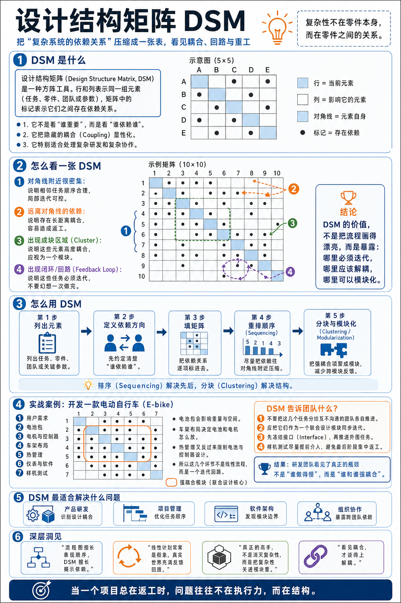
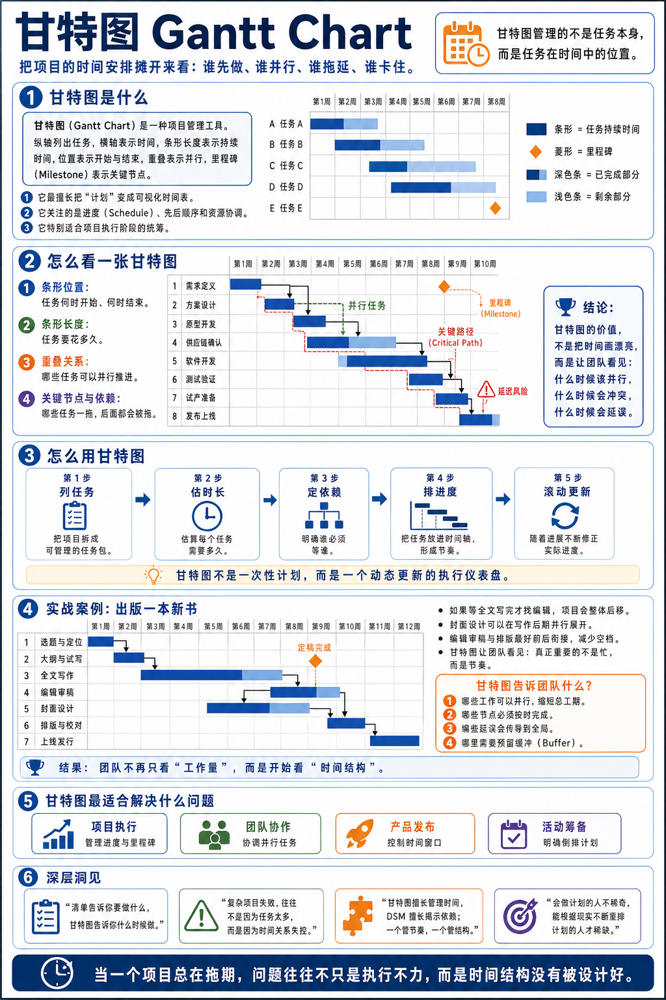

# 问答：设计结构矩阵和甘特图的区别是什么？（得到课程讲稿 + AI 加工段）

# 问答：设计结构矩阵和甘特图的区别是什么？

[问答：设计结构矩阵和甘特图的区别是什么？](https://www.dedao.cn/course/article?id=qzNakylrn9WVaZWMjGJ7DOop10vZwL)

### 《脆弱和反脆弱：怎样利用非对称风险》

> 请教万老师：每个月五天禁食，只喝水，这个事情是属于反脆弱，激活好细胞吗？

给身体一个可承受的小压力，然后能恢复回来，并且整个系统因此而升级，这才叫反脆弱。如果给的压力太大，恢复回来都很勉强，甚至干脆都没恢复回来，那就不好了。就你说的这个「禁食」来说，我发现有两个点特别有意思：一个是反脆弱的具体实现机制，一个是实现反脆弱的这个度的把握。

首先，禁食并不是简单地激活“好细胞”或者清除“坏细胞”。在微观层面上，禁食能激活细胞的压力应答机制，并且开启细胞自噬过程，让细胞能够回收受损的蛋白、线粒体和一部分无用的结构。在宏观层面上，禁食的目的是实现从葡萄糖提供能量，转向用酮体提供能量，这是一种代谢转换。它可以改善胰岛素抵抗、血脂异常、高血压和炎症这些指标。

更有意思的是，身体的再生不是发生在禁食的进行中、你饿着的那个时候，而是发生在你重新吃东西的时候：前者是拆迁，后者是重建。所以禁食之后吃什么、怎么吃，这也很重要。这都需要专业指导。

这个洞见是禁食并不是说打击身体一下、让身体组织抵抗；而是通过剥夺能量输入，迫使身体进行自我整理。

站在外面看，你可能会说人体作为一个生物组织，它必定是反脆弱的，所以禁食对人有好处！那只是哲学。你得先等科学家确认身体确实有这个能力，再决定尝试禁食。我们不能单纯用哲学指导健康。

所以具体怎么做，还得看科研的结论。

现实是，禁食不一定非得除了水之外什么都不能吃，也不是说非得每个月禁食五天。如果什么都不吃是反脆弱，那少吃点难道就不是反脆弱吗？

比如现在有一种方法叫「禁食模拟饮食（Fasting-Mimicking Diet）」，也就是低热量、植物性、低蛋白、低糖、较高不饱和脂肪的饮食，目的是模拟水断食的部分内分泌和代谢效果，同时提供少量热量和必要营养。

我调研结果，目前有两种禁食疗法似乎有最强的科学证据证明有效。但也不是说绝对有效，只能说目前的证据还不错。

一个是「间歇性禁食」，也就是每周五到六天，每天只保留 8 到 10 个小时的吃饭窗口，比如说从早上 8 点到下午 4 点，在这段时间之内可以吃东西，其他时间就只喝水。它要求早餐越早越好，晚餐不能晚于下午 6 点。有一些研究证明，它对减肥、缓解压力、对情绪指标都有一定的好处。

另一个就是刚才说的「禁食模拟饮食」。这个做法强度比较高，每个周期需要连续 5 天只吃低热量、植物性、低蛋白、低糖的食物：

\- 第一天：只摄入 1100 大卡的食物

\- 第二天到第五天：每天只摄入 700 大卡的食物

\- 五天结束后：恢复正常进食

建议是每个月一个周期。根据 2024 到 2025 年的一些最新研究证明，连续三个月完成三个周期后，对身体有诸多好处：胰岛素抵抗下降、糖尿病前期指标得到改善、肝脂肪下降等等。据说综合而论，能让生物年龄的中位数下降 2.5 岁。

那么一个可行的方案是：任何人都可以日常践行周期性禁食；而对自己身体指标不满意的人，可以来一轮三个周期的禁食模拟饮食。这可能是当前科学理解所能提供的最佳方案。

我还听说过一种连续饿自己三天的方案，是一个更激进的方法，据说也有疗效。但是，那需要医生在旁边指导，有一定的危险性。

### 《状态杠杆：你不是不努力，你是没做在点子上》

> 在做复杂项目前，需要一个“设计结构矩阵”。请问万Sir，这个工具与我们熟知的甘特图相比，是甘特图的升级版吗？它们的核心区别在哪里？

设计结构矩阵（Design Structure Matrix, DSM）是用来协调一项工作的各个步骤之间相互依赖关系的工具。比如你要开发一辆电动自行车，整个工程可以分为若干步骤：用户需求、电池包、电机和控制器、车架布局……等等。这些步骤你先干哪个，后干哪个，让谁等谁呢？DSM 的作用就是帮你合理设计先后步骤和上下游关系。

具体操作，我们可以先大致弄一个初步的排序，比如分成 A、B、C……总共 10 步。你要这些步骤同时列在一张矩阵表格的横坐标和纵坐标上。

接下来是填表：只要两个步骤之间存在互相依赖关系，不管是谁依赖谁，就在它们交叉的坐标位置点一个点。我们通过观察矩阵中这些点的分布，就能看出来你当前的步骤有哪些问题 ——

如果点阵密集地分布在对角线附近，那就是非常理想的情况。这意味着正好是邻近步骤之间互相依赖，关系清晰容易推进。

但如果在表格的边缘有很多点，那就说明当前的步骤排序不合理。你应该重新调整排序，让依赖关系尽量靠近对角线。

再者，如果发现某几个步骤之间的点阵特别密集，那就说明这几个步骤是高度互相依赖的 —— 这就意味着应该把它们视为一个整体，就别分步了，作为一个独立的模块来管理。

还有，如果点阵出现了回环，比如 A 依赖 C, C 依赖 E, E 依赖 F，F 又依赖 A，这就说明这并不是一个线性的流程。当你改动 A 的时候，最终会改动 F；可是你改动 F 之后，又要回来再次重新考虑 A：这是一个迭代过程。

我用 ChatGPT 画了一幅图，你一看图就明白了 ——

甘特图（Gantt chart），是一个任务管理工具。它也会涉及依赖关系，但它的作用是在步骤已经确定之后，布置和监督各个步骤的推进情况，甘特图关心的是每个步骤进行的时间长短，要求不要因为这一个步骤拖延而耽误了后面依赖它的步骤。

简单说， DSM 是根据各个步骤之间的依赖关系合理安排这些步骤，负责的是结构；而甘特图则是当步骤安排已经确定之后，看怎么排时间，负责的是节奏。所以我的理解是应该先画 DSM 布局，再画甘特图推进。

顺便说一句，ChatGPT 新出的 GPT-Image 2.0 特别擅长用一张图给你解释清楚一件事，关键词叫「 infographic」。我顺手给甘特图也画了一张，你也可以自己就任何课题让他画图。

不需要复杂的提示语，你只要输入：「给甘特图画一个 infographic」就可以了。我们可以充分依靠高级 AI 自身的能力。

我认为 infographic 是比 PPT 更好的信息表现方式。

### 《选择偏差：就算无人说谎，你看到的也不是真实世界》

> 如果一个人长期生活在某种强选择偏差的环境里，比如只接触同一圈层、同一种价值观的人，久而久之甚至会把偏差当成常识。那这种情况下，普通人最有效的“自我校准”方式是什么？是主动接触不同样本，还是更重要的是训练自己质疑第一直觉的习惯？

更重要的是有对真实信息的需求。 大部分人并不怎么需要真实信息。生活在“信息茧房”之中，跟同一圈层的人相处，谈论一些错误的、但是是共同的观念，并不会对这些人的生活造成任何坏影响。

如果一个人从来都不出国，他完全可以相信地球是平的。只有当他有一天到了国外，跟国内的亲友打电话，发现大家一个在白天、一个在黑夜，他才需要用“地球是球形的”这个知识来解释时差。

人需要真实信息并不是因为爱好真实信息。人可能更爱好虚假的信息，因为虚假信息更能建立身份认同，更能解释生活的合理性，让人感觉良好。如果你不投资不买房，而且你的工作非常稳定，你不太需要了解宏观经济，你相信“风景这边独好”就完事儿了。

我们需要真实信息是因为必须跟真实世界打交道。比如说：你要求学、找工作、投资、做事，甚至要领导一个组织，你会影响其他人的生活，只有在这些情况下，你才需要用到真实信息。

可是即便真有用，信息的反馈还有个滞后效应、还常常是不明确的。可能这个草药其实无效，但你喝了却真的感觉到疼痛被缓解了。

尤其在过去，大部分人都生活在自己周边的一个很小的环境之中，个人的影响圈非常小，稀里糊涂一辈子就过去了。只有在现代社会，而且只有一部分人，是生活在更大的环境之中，需要「决策」，才需要真实的信息。

所以求真的前提是有反馈。不撞南墙不回头，也得先有南墙可撞才行，你的活动范围必须超出墙的范围。

主动接触不同样本也行，质疑自己的第一直觉也对，但更关键的还是寻求反馈。

一个简单的练习是针对一个自己生活圈以外的事情，先思考一个答案，然后把自己的说法告诉 AI，让 AI 点评。

更有用的办法是把你对大事件的预测写下来，存档，等结果出来了回头再看。我们下周会讲到一个叫「超级预测」的心法，其中就提到，对自己的预测打分是提高预测能力最好的办法。

### 《回归均值：不要大惊小怪，要有点定力》

> 我怎么知道是真的趋势变了，还是一个随机波动？除了看更多、更全面的数据，没有办法。因为一个极端值才开始注意，我看到的是一个点，还是多期数据？我什么都不做，它会不会自己缓回来一点？

如果我们看到了一个非常值得关注的异常事件，怎么知道它只是一个随机的波动，将来会回归均值，还是说它真的代表了某种趋势呢？如果我们没有时间去观察更多的数据，其实对这个单个事件也可以做一番分析。

关键是看导致这个事件发生的原因，是普通原因还是系统性的原因。比如说你是公司的领导，有一天某个员工犯了一个大错，造成重大损失。那么你需要分析他为什么犯这个错。

如果他那天是因为身体不好或者情绪不佳而犯错，而这个员工平时表现良好，公司其他人也不经常犯这种错误，那这就是一个随机波动事件，只要是人多的公司都可能遇到，什么都不用管。

但如果员工犯错是因为他不熟悉公司刚刚部署的新机器，那你就需要重视了：是不是新机器的操作流程没有跟员工讲清楚？是不是需要搞一次培训？又或者说这个机器自身是不是有问题？

在统计学上，前者叫「普通原因变异」，是系统的正常波动；后者叫「特殊原因变异」，是正常运行被某个异常机制打断了。

老板管的是公司，而不是这一群人：家长里短的事儿就算影响到公司也不值得你操心，你只关心公司层面的事儿就好。

---

这是一篇非常高质量的科普短文（从文风推测，可能出自万维钢老师的专栏）。这篇文章不仅没有陷入“盲目断食”的伪科学陷阱，而且准确地抓住了过去十年特别是**截至2024-2025年最新医学界关于“禁食与长寿”研究的核心结论**。

以下是对文中提到的核心观点进行的**深度事实核查与科学原理解析**：

### 总体核查结论：高度准确，符合当前主流科学共识。

文章巧妙地将塔勒布的“反脆弱”哲学概念与生物学中的“毒物兴奋效应（Hormesis）”结合，且对具体禁食疗法的数据、机制、最新研究成果的引用极为精确。

### 详细逐点事实核查：

#### 1. 机制核查：细胞自噬与代谢转换

- **文中的说法**：“禁食能激活细胞压力应答机制开启自噬……目的是实现从葡萄糖提供能量，转向用酮体提供能量（代谢转换）。”
- **事实核查：完全准确。**

  - **细胞自噬（Autophagy）**：2016年诺贝尔生理学或医学奖得主大隅良典的研究正是关于细胞自噬。当身体处于饥饿状态时，细胞会主动分解体内受损的蛋白质、衰老的细胞器（如线粒体）来获取能量，这相当于细胞级别的“大扫除”。
  - **代谢转换（Metabolic Switch）**：这是约翰·霍普金斯大学神经科学教授马克·马特森（Mark Mattson）提出的著名理论。人体通常在禁食12-36小时后，肝脏中的糖原耗尽，身体开始燃烧脂肪，产生“酮体（Ketones）”供能。大量研究证实，酮体不仅是燃料，更是信号分子，能抗炎、改善胰岛素敏感性。

#### 2. 洞见核查：重建发生在“重新进食”时

- **文中的说法**：“身体的再生不是发生在禁食的进行中……而是发生在你重新吃东西的时候：前者是拆迁，后者是重建。”
- **事实核查：极为精准，这是近年来禁食研究的重大突破。**

  - 美国南加州大学（USC）长寿研究所所长瓦尔特·隆戈（Valter Longo）教授的研究表明，禁食期间干细胞处于“待机并清理残骸”状态；而**重新进食（Refeeding）才是触发干细胞大量增殖、重建受损免疫系统和组织的开关**。因此，禁食后第一顿吃什么（避免高糖高脂引起胰岛素剧烈波动和再进食综合征）在医学上确实非常关键。

#### 3. 疗法核查一：间歇性禁食（早时限饮食法）

- **文中的说法**：“每天保留8-10小时吃饭窗口……早餐越早越好，晚餐不能晚于下午6点。”
- **事实核查：符合最新“时间生物学”饮食共识。**

  - 这种方法在医学上被称为 **eTRF（早期限制时间进食，Early Time-Restricted Feeding）**。多项随机对照试验（RCT）表明，将进食时间与人体的昼夜节律（生物钟）对齐，把热量摄入集中在白天，比把进食窗口放在深夜（比如中午12点到晚上8点）对改善代谢、降血糖和减肥的效果更好。

#### 4. 疗法核查二：禁食模拟饮食（FMD）及 2024 年最新数据

- **文中的说法**：“第一天1100大卡，第2-5天700大卡……植物性、低蛋白、低糖……2024到2025年最新研究证明，连续三个周期能让生物年龄中位数下降2.5岁。”
- **事实核查：数据极其精确，引用了最新的顶刊论文。**

  - **FMD（Fasting-Mimicking Diet）**：正是前文提到的瓦尔特·隆戈（Valter Longo）教授研发的疗法。其卡路里设定确实是第一天约1100千卡，后四天约725千卡。
  - **2.5岁生物年龄下降**：这个数据直接来源于 **2024年2月20日** 发表在国际顶级期刊《自然-通讯》（\*Nature Communications\*）上的一项重磅临床试验。Longo的团队分析了多个临床试验数据，发现受试者每个月进行5天FMD，连续3个月（即三个周期）后，胰岛素抵抗和肝脏脂肪明显减少，**基于血液标志物计算出的“生物学年龄（Biological Age）”中位数刚好下降了2.5岁**。文章的作者显然阅读并准确引用了这篇最新文献。

#### 5. 风险提示核查：连续三天纯水断食

- **文中的说法**：“连续饿自己三天……更激进，有一定危险性，需要医生指导。”
- **事实核查：非常负责任的健康建议。**

  - 超过48-72小时的纯水断食（Water Fasting）虽然能最大程度激发自噬，但有严重的潜在风险，包括：电解质紊乱、心律失常、肌肉流失（瘦体重下降）、胆结石风险增加以及尿酸激增（引发痛风）。医学界普遍共识是，长时期纯水禁食绝对不能在家自行尝试，必须在有医疗监控（验血、测血压）的环境下进行。

### 唯一需要补充的微小“医学免责”细节

文章中提到“**任何人**都可以日常践行周期性禁食”，在严谨的医学语境下，这个“任何人”需要稍微打个折扣。间歇性禁食或FMD**不适用**于以下人群：

1. 孕妇和哺乳期女性。
2. 有进食障碍（如厌食症、暴食症）病史的人。
3. 1型糖尿病患者或正在使用降糖药/胰岛素的2型糖尿病患者（有严重低血糖风险，必须遵医嘱）。
4. 身体极度虚弱、BMI过低（营养不良）或未成年人。

### 总结

这是一篇**含金量极高、科学性极强**的文章。它成功地把前沿的细胞生物学（自噬机制）、代谢科学（酮体转换）、时间营养学（eTRF）和2024年最新的抗衰老临床数据（FMD降低生物年龄2.5岁）融合在一起，并且给出了循序渐进、安全可行的操作建议。文中的观点完全经得起当前科学界的事实核查。

---

针对39岁、**偏瘦**的男性，制定禁食指南的核心原则是：**获取细胞自噬和抗衰老的好处，但绝对不能掉肌肉，也不能造成热量缺口。** 

偏瘦人群的脂肪储备少，如果禁食时间过长，身体会分解宝贵的肌肉来供能。因此，不建议采用激进的16:8（饿16小时）或长时间断食。

以下为你量身定制的**“12-14小时昼夜节律微禁食”**日常实践指南，主打安全、无痛、易坚持：

### 🌟 核心心法：只缩短时间，不减少饭量

你是为了“系统升级（清理细胞）”，不是为了减肥。在能吃东西的时间段里，**必须吃够平时的总热量**。

### 📅 第一步：设定进食时间表（建议 14:10 法则）

将每天的进食时间压缩在 **10-12个小时** 内，剩下的 12-14 个小时让肠胃休息，配合生物钟。

- **理想作息参考：**

  - **早上 07:30 - 08:00**：吃丰盛的早餐（开启进食窗口）。
  - **中午 12:00**：正常午餐。
  - **晚上 17:30 - 18:00**：吃晚餐（结束进食窗口）。
  - **晚上 18:00 到次日早 08:00**：**【禁食期：14小时】**，只喝水。
- *注：如果14小时觉得难，退回到 12小时（晚8点吃完，早8点吃早饭）同样有基础效果。最重要的是****晚餐要早吃，睡前3小时绝对不进食****。*

### 🥩 第二步：吃什么？（偏瘦男性的“保肌肉”策略）

因为进食时间缩短了，为了避免越来越瘦，你需要提高饮食的“质量”和“密度”：

1. **首抓蛋白质**：39岁男性面临肌肉流失风险。每天确保吃到足量肉类、鱼虾、鸡蛋或奶制品。（每公斤体重建议摄入 1.2-1.5克蛋白质）。
2. **增加优质脂肪**：脂肪热量高且不占胃口，是偏瘦人群维持体重的神器。多吃牛油果、坚果、橄榄油、深海鱼。这也利于维持雄性激素水平。
3. **吃碳水，但不吃劣质糖**：不要因为禁食就戒碳水。燕麦、红薯、糙米、米饭正常吃，但尽量戒掉奶茶、甜点等添加糖。

### 💧 第三步：禁食期间怎么做？

晚上6点吃完晚饭后到第二天早餐前：

1. **能吃什么**：白开水、矿泉水、原味气泡水。早上如果饿，可以喝一杯纯黑咖啡或纯茶。
2. **绝对不碰**：任何有热量的东西，包括牛奶、蜂蜜水、水果、含糖口香糖。
3. **早点睡觉**：细胞的“拆迁清理”和“重建”大部分在你深度睡眠时完成。

### 🏋️ 第四步：配合力量训练（关键加分项）

偏瘦人群如果光禁食不运动，容易流失瘦体重。

- **做法**：每周安排2-3次力量训练（如俯卧撑、深蹲、引体向上或举铁）。
- **时机**：**最好安排在吃完饭的窗口期内**，或者在早上训练完立刻吃一顿高蛋白早餐。不建议在长达十几个小时空腹的末期去剧烈运动。

### ⚠️ 身体红灯警告（出现以下情况，立即停止或放宽时间）：

1. **体重持续下降**：如果坚持两周发现变轻了，说明你吃得不够，请马上增加饭量或把禁食窗口缩短到12小时。
2. **睡眠变差/白天极度疲惫**：这说明身体感受到的是“生存危机”而不是“良性压力”。
3. **头晕手抖（低血糖）**：偏瘦人群调节血糖能力可能较弱，如果出现心慌手抖，立刻吃东西，不要硬扛。

**一句话总结你的日常操作：**

**“晚饭早点吃，睡前不加餐，早起喝杯水，三餐吃够肉。”** 这就是最适合偏瘦男性的反脆弱实践。
