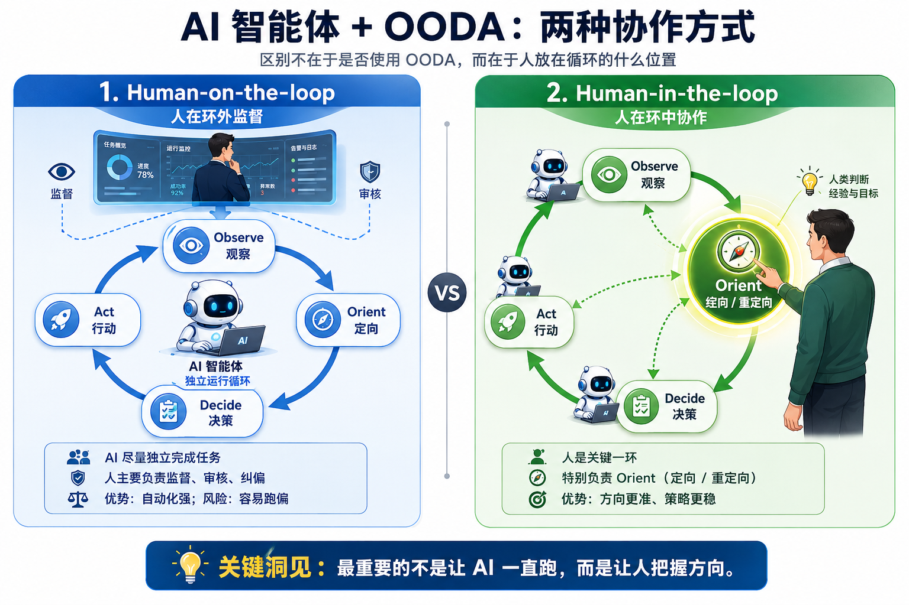
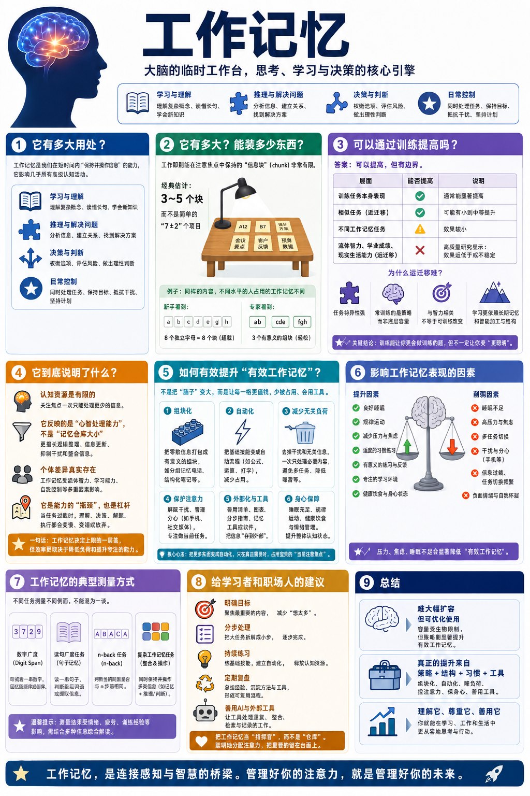

# 问答：我们能不能加大自己的「内存」？（得到课程问答）

# 问答：我们能不能加大自己的「内存」？

[问答：我们能不能加大自己的「内存」？ ](https://www.dedao.cn/course/article?id=mPqglk6GzZwKr5yB8YXMLBEO3ba2AR)

#### 《前景理论：让人铤而走险的不是贪婪，而是不甘》

> 万老师，文章结尾的北宋案例，本质是“两个参照点同时撕扯”导致的灾难。但在现实生活中，我们常常不是只有一个错误的参照点，而是同时被“历史高点”“社会比较”“自我预期”等多重参照点撕扯，就像散户既盯着买入价、又盯着别人的收益率、还盯着自己曾赚到过的最高点。当多个参照点同时存在时，“自由设置”常常失效，因为无论你怎么设，总有另一个参照点在刺痛你。面对这种多重参照点困境，您会给出什么不同于“各自设置心理账户”的解法？

像社会比较、历史高点这些由外界给出的参照点，是我们最自然的一种比较心理。这种比较其实是有用的，它能让我们看见现状，知道自己大概处于什么位置。就如同学生考试，你最好知道自己在班上排第几，这次考试比上次是进步了还是退步了。当然不好的一面是，它会带来焦虑，可是比较心理是不可遏制的。

关键在于，你能不能跳出这些表面上的比较，主动选择把一些更本质的东西作为参照点。

就拿写文章来说，读者的反应肯定是重要的，但是其中有很多偶然性。可能正好赶上一个流行话题，文章就成了爆款；也可能这个话题只有小众感兴趣，写出来就没什么反响。但是不管外界的反应怎样，这篇文章相对于你自己来说水平怎么样，其实你是知道的。比如：这里面是否有更深入的思考、更重要的信息？你是否做了足够好的调研？相对于过去，现在的写法有没有进步？这些内在的评价会更可控。

简单说，你希望把可以积累复利的资产，而不是偶然性更大的果实，当作参照点。

但是果实也很重要，因为内部资产往往是难以测量的 —— 你不能明明水平不行还以为自己很行。这还是卡尼曼说的内部视角和外部视角的问题。现实是，人既需要内部视角，也需要外部视角。

如果一个没有经历过什么风浪的人说：“我根本不看外界评价，我只在乎我自己内心的评价。”他一定是站着说话不腰疼。现实是，哪怕是有一定社会经验的人，也会非常在意各种指标和评价。

理想的状态，是你经历过风浪，好的坏的被评价很多次，以至于锻炼出一个特别强大的自我内核，你的心态超越了那些外在的参照点：指标和评价对你来说只是可供参考的信号，而且只是各种参考信号中的一小部分 —— 它们不是你的目标，不是你的指引，更不是诱饵。

#### 《超级预测：给不确定性命名，给自己打分》

> 我感觉有时外部信息挺难搜集，个人力量有限，就拿例子里说的找工作问同行师兄师姐这种，没认识一定的人也不行，作为力量有限的个人该如何搜集外部样本，用好参考类预测这个工具呢？

找参考类的关键并不是要找跟你相似的“人”，而是找相似的机制，或者说叫相似的结构。你真正想问的问题是：过去那些跟你有相似结构的人、项目、产品或者选择之中，有多少比例走到了你想要的结果？现在你有什么证据，足以让你偏离那个比例？

如果你非要问，像我这个年龄、背景、所在地区、拥有这些技能的人，如果做这么一个产品，成功的可能性有多高，那显然你很难找到参考类。但你真正想知道的是“现在市面上用 AI 编辑短视频的 App 是否已经足够成熟，如果做出来，能不能好卖”这样的问题。

一旦你把一个关于人的问题变成一个关于机制的问题，你就把它给一般化了。这样你就可以利用公开信息，比如用 AI 直接帮你从各种行业报告、学术数据中获取信息，还可以观察各个平台的公开数据，比如直接在淘宝这样的平台搜索，看看你感兴趣的商品销量。这些公开的信息总能告诉你一些事情。

如果你想知道自己所在大学、所在专业的毕业生就业前景，最好的办法当然是问问已经毕业的师兄师姐，或者问辅导员老师。但那个信息对你来说也许并不是那么重要。一切分类都是主观的，你完全可以把自己放到另外一个参考类里。也许你的志向并不是你现在所在的专业，你想知道的是另外某个行业在未来几年的总体需求，那这就又是一个公开信息。

有些人问：“如果我是这个参考类里的特例怎么办？”那你就是选错了参考类。也许你的参考类不在本地，在远方；不在同龄人中，而在古往今来跟你有共同志向和爱好的人里。

#### 《OODA 环：不是反应快，而是换脑快》

> 请问万老师，AI现在的学习机制符合OODA的逻辑吗？或者我要改进自己的智能体助手，可以让它用OODA方式来优化自己的工作流吗？

是的，AI 智能体应该用 OODA。如果 AI 只是按照你定好的动作，第一步、第二步、第三步干什么，把事情做完，那它只能说是一个自动化脚本。真正的智能体应该体现 OODA，也就是说，在它开动之后，能根据观察到的结果进行重定向，现场自己决定该怎么办，然后采取下一步行动。

从 OpenAI 的 o3 这个模型开始，AI 就有这个意思了。

最早的时候，你问模型一个问题，它只是凭直觉给回答；后来它有了思考模式，会先想一想，把语言组织组织再给你答案。但 o3 完全不同。o3 是自己先去做一番调研，它会根据自己调研的结果加以判断，然后再想一想下一步：是做一番计算，还是给你画个示意图，或者怎么办。然后它再重新组织语言，给你生成一个答案。它最后生成的答案，是根据现场调研出来的结果决定的。

OODA 的精神就是：我们不能在自己的心内世界中完成闭环 —— 你必须接触现实。通过问讯、收到反馈、重新定向、然后再决定你怎么办，并且反复做这个循环。

这就引出了一个问题：在智能体 OODA 环之中，人的位置在哪里？

我最近跟硅谷一些在一线做 AI 智能体应用的工程师有些交流，我感觉整个硅谷的氛围是把人排除在循环之外 —— 人只起到一个监督的作用，尽量让 AI 从头做到尾，这叫「Human-on-the-Loop」。

有些工程师认为当前模型的能力已经够用了：如果你发现某个工作任务模型还做不好，那不是模型的问题，而是你的问题 —— 是你没有把智能体安排好！

我感觉这些工程师的想法非常激进，就是尽可能让 AI 承担所有的事情，最好人就一点都不参与，甚至可以说叫「Human-out-of-the-Loop」。

当前空气就是这样，但我对此充满疑虑。

我觉得现在的智能体应用，包括龙虾在内，都是用 AI 在计算机上频繁操作一些小事，而不是做少数的大动作。我很难相信应该把大动作也完全交给 AI。

就拿写作来说，不用说整个写作过程，就单纯是调研这一步，也不可能完全 Human-on-the-Loop，而是要「Human-in-the-Loop」，让人的参与成为循环中的一个关键步骤。

第一轮调研可以让 AI 自己去发现什么东西有意思、什么重要、当前的科学理解是什么。等结果返回之后，你会发现其中对你来说更重要、更有意思的东西，然后你会让它发起第二轮、第三轮调研。也就是说，每一轮循环都是一个小的 OODA，AI 可以自行完成 —— 但是，这些循环之上还有一个大循环，人在这个大循环中的作用就是第二个 O，定向。

这个道理听起来很明白，但当前硅谷的精神是：不管你说人应该在哪儿起作用，最终都应该把那个作用交给 AI。

我赞赏这个激进的态度，但我的确希望人仍然有用。

#### 《认知负荷理论：因为文具多，所以是差生》

> 有没有研究说，可以加大我们的“内存”？

这是一个非常有意思的问题，我这次又专门做了一番调研，结果可以说是既在情理之中，又很让人无奈。

首先，工作记忆确实是一个很重要的头脑指标，不同的人工作记忆的大小确实有差别。它跟一个人的流体智力（特别是智商）有将近 0.5 的相关性。工作记忆容量大的人，也更容易排除干扰、集中注意力。它确实有好处。

工作记忆落实到脑神经科学上，是由若干个脑区共同协调决定的。但是它是可以测量的，你把这个人请过来，做一番测试，你大概就可以测量出来他的工作记忆水平怎么样。测量的方法有多种：比如给你一组数字，让你短时间扫一眼，然后尝试复述，看能复述出来几个；再比如让你一边处理某些任务，一边给你一些干扰，看你的抗干扰能力怎么样；还有在你面前播放一组信号，看你能不能听出来新信号是之前的第几步信号，等等等等。

那你说，这个工作记忆能不能通过训练提高呢？有意思的事情发生了：以上所有这些测试任务都可以通过训练提高 —— 但问题是，你训练的是哪个任务，你提高的就是做那个任务的水平。如果你换一个没训练过的任务，你的迁移能力非常小。而且我们前面刚说工作记忆跟智商有比较强的相关性，可是你通过做那些训练任务，并不能提高智商。

换句话说， 训练提高的只是做特定任务的水平，而不是大脑的硬件本身。

这是怎么回事呢？研究者的推测是，人们在训练过程中其实是发现了解题技巧，也就是把它“分块” —— 说白了，也就是增加了大脑里的「图式」。

所以我们《精英日课》专栏讲过好几次：智力游戏不能真正提高智力水平。但这并不是一个非常坏的消息，这里的好消息是：做每个具体的任务的水平都可以提高，只要你进行有针对性的训练。

所以练习真的很有效，但是我们也真的不能不服天赋。

我理解，这是因为大脑是一个软硬结合的东西：你希望练硬件，也就是绝对脑力，但其实你是在练软件，也就是解题方法；但你说是练软件吧，这个软件其实又是用硬件实现的。

> 万sir，您的课程里面会有很多漫画配图，结合着漫画看文章，就会觉得内容好理解一些。您在内容中介绍一些教学动漫会增加孩子们的认知负荷，请问这为啥不会增加认知负荷呢？

请把这理解成一种“艺术”，而不是严格的工程。有时候，女老师打扮得漂亮一点，可能会影响同学的注意力，但我们不能剥夺女老师打扮得漂亮一点的权利。

其实我在文稿里加了更多的漫画和插图，但有时候主编认为画得不是那么好，或者会干扰读者阅读，就给砍掉了一些。但最终还是保留了不少。这些插图也许会对有些人有用，也许对有些读者来说是个干扰，我们双方互相试错而已。

这就如同拍电影。有些导演的画面中没有一个元素是多余的，所有的事物都跟剧情密切相关。但也有一些导演，会一边描写一场激烈的街头打斗，一边还有闲情逸致拿出几秒钟，去描写路边一只鸟在如何喝水。

那个画面跟剧情没啥关系，但是会让你有一种更身临其境的感觉，仿佛自己也穿越到了那个历史现场。这只是风格而已。有些观众会有更多的闲情逸致，有些观众则更愿意把注意力集中在主线上。
