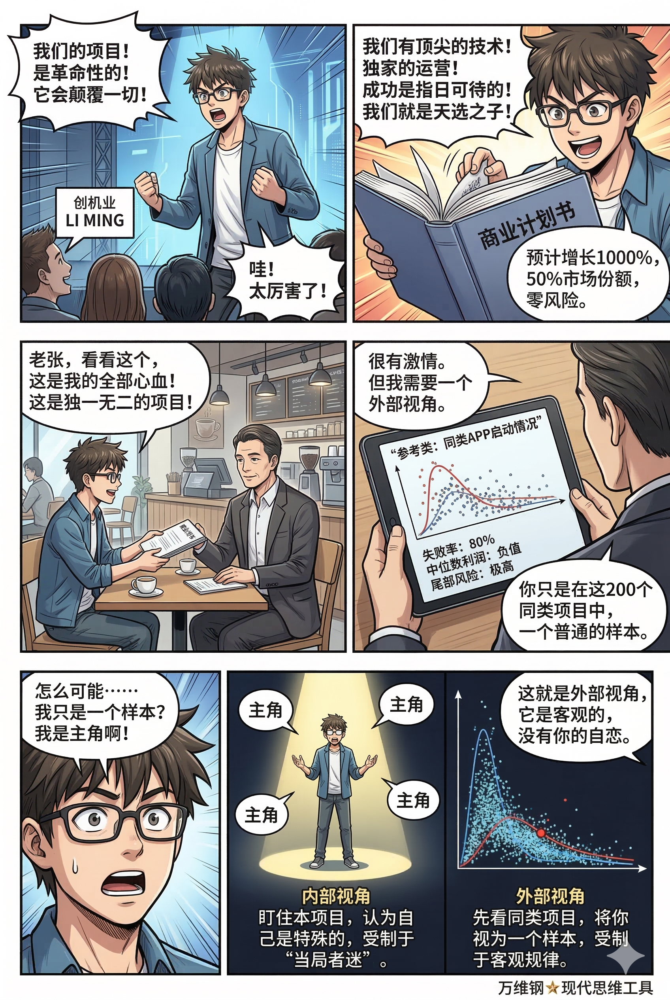
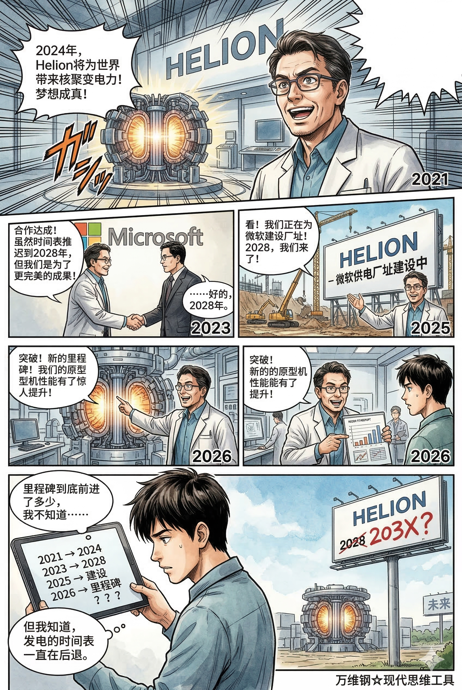

# 参考类：当局者迷，旁观者清，你不特殊（得到课程讲稿 + AI 加工段）

# 参考类：当局者迷，旁观者清，你不特殊

[参考类：当局者迷，旁观者清，你不特殊](https://www.dedao.cn/course/article?id=zYo2GPNq4W8VEbwmLaJejyRBZbnw0d)

一个高中生每天刷题到深夜，常被自己流下的汗水感动。父母都说他一定行，他也认定只要这么拼命，就一定能考上清华。

一个都市女性坚信自己只要不将就，一定能等到那位身披金甲圣衣脚踏七彩祥云非她不娶的盖世英雄。

一个创业者刚刚想出了一个产品雏形，就已经在脑子里把用户增长曲线画成了火箭。

这些都是非常可爱的人。他们身上有一种真诚的英雄主义，他们是生活的主角，世界因为他们而精彩。但是他们都活在梦中。

我们说了，这个宇宙的第一性原理是叙事。人需要叙事给自己意义。我们都最好有一点热情，有一点想象，甚至有一点自我感动。可你要想科学计划，对未来做出靠谱预测，最有效的指导可不是你梦中的叙事，而是同类人、同类事已经发生过的经验。

这一讲的思维工具叫「 **参考类预测** （Reference Class Forecasting, 简称 **RCF**）」。它本是一个预测算法，但在我看来，它更像是一个“反自恋装置”。如果你认为“我很特殊”、“我这次一定不一样”，你最好先用一下这个工具。

关于梦想和现实的差距，有个现成的规律，叫「规划谬误（Planning Fallacy）」。

心理学家罗杰·比勒（Roger Buehler）等人的一个研究是这样的。让一群学生估算他们各自完成毕业论文还需要多少天，学生们平均给出的预期是 33.9 天。比勒说不行，你们太乐观了，你们来一个最悲观的估计！这回平均是 48.6 天。

你猜他们实际上用了多少天？55.5 天。

规划谬误说的就是人一做计划，就会系统性地低估时间、成本和风险，同时还高估收益。现实往往比你最悲观的估计还要悲观。

那你说是不是只有普通人这样，要是做正规大项目人们就会准确估计呢？不是。我们前面提到过的丹麦经济学家傅以斌（Bent Flyvbjerg）是大型项目专家，他跟合作者研究了 258 个交通基础设施项目，发现普遍存在延期和成本超支 —— 其中铁路项目平均超支 45%，桥梁和隧道 34%，公路 20%。傅以斌专门写了本书谈论大项目规划失败问题，其中最著名的例子是悉尼歌剧院：原本预算 700 万美元，计划 4 年完工，结果花到 1.02 亿美元，14 年才完工。

规划谬误是「一厢情愿」这个成语的现代版，它是大脑里一系列幻觉生成器共同造就的 ——

「乐观偏差（Optimism Bias）」告诉你“这次一定顺”；

「确认偏误（Confirmation Bias）」让你只搜集利好证据；

「控制错觉（Illusion of Control）」让你以为世界井井有条、意外情况都在掌控之中；

「自利归因（Self-Serving Attribution）」让你把上次翻车怪到天气、队友和甲方头上；

「幸存者偏差（Survivor Bias）」和「可得性偏差（Availability Bias）」让你只看见成功故事而看不见沉在水底的尸体……

最后「叙事谬误（Narrative Fallacy）」则负责把这些碎片拼成一部热血电影。

**你脑子里排练的是剧本，而不是真实世界。**

而你之所以用剧本思考，是因为你使用的是「 内部视角 （inside view）」。你自己看自己，就只知道盯着这一件事的细节、你的努力、你的诚意、你的资源配置 —— 你心想这还能有啥问题？

当局者迷旁观者清，你需要外部视角。

「 外部视角 （Outside View）」和参考类预测都起源于卡尼曼，后来则是由傅以斌把参考类预测从心理学推广到了工程实践。

简单说，内部视角看的是你的个案信息（singular information），而外部视角看的则是分布信息（distributional information）：在别人眼里，你只是一个受制于客观规律的统计学数据点，你并不特殊。

外部观察者关心的是跟你条件差不多的同类事情 —— 也就是你的「参考类（Reference Class）」 —— 的分布：平均水平如何、中位数是什么、尾部风险是怎样、失败率是多少，并且以这些统计数据来推测你会如何。

内部视角盯住本项目，外部视角先看同类项目，这就是「当局者迷，旁观者清」的现代认知科学版本。旁观者未必比你聪明，但旁观者的好处是没有你那么多自恋情结：人家把你当成样本，而不是当主角。

这里有个最经典的故事，来自卡尼曼本人，收录在《思考，快与慢》一书中。

1970 年代，卡尼曼带队编写一本给高中生的决策学教材。团队第一次开会，卡尼曼问，我们多长时间能把这本书编完？大家群情激昂，信誓旦旦地说：两年！最多两年就能搞定！但卡尼曼留了个心眼，转头问团队里一位教育专家：“你认识的、跟我们条件差不多的团队，编这样一本书通常要几年？”

专家说大概 7 到 10 年，而且有 40% 的团队最后干脆放弃了。

卡尼曼很震惊，但他想我们团队肯定不至于，我们效率更高。

……结果卡尼曼团队花了整整 8 年才把书搞出来。而那时候教育部已经取消了这门课的教学需求。

你以为你们不一样，其实每个人都觉得自己不一样。现实是，在统计学意义上大家都一样。

傅以斌把参考类预测标准化成了三个步骤：

第一步，找一个数量足够多的、包含和你类似的项目的「参考类」 —— 不是你喜欢的榜样，而是找一组和你足够相似、而且已经结束的案例；

第二步，看看这个参考类的分布，找到它的基准线，包括平均成本、时间、失败率等等；

第三步，把你自己的项目放进去对比，根据客观情况做微调：我更像是中位数，还是应该更保守一点？

第三步是最考验人的一步。其实最简单的办法就是直接用参考类里的中位数来预测自己。傅以斌再三强调，如果你非要说你跟别人不一样，那你就必须有非常强硬的证据才行 —— 不然你就是在把偏见又偷偷放回来。

有些现代机器学习算法的底层逻辑就是参考类预测。一切归结于你的“训练集（参考类数据）”有多大，以及你的“相似性度量（similarity metric）”抓得准不准，说白了就是把“找同类”这个动作给工业化了。

要知道自己做这件事会怎样，你最该考察的是和你相似的人、在做相似的事情时，最后都怎么样了。

参考类预测（ RCF）就是强迫你从“我是一个故事”切换到“我是一个样本” —— 故事负责解释你是谁，参考类负责预测你会怎样。

每个自命不凡的项目都会被 RCF 教训。咱们看几个比较耀眼的应用。

一个是**大型工程和公共投资**，这是 RCF 的主战场。傅以斌看过那么多项目之后的结论是：如果不用 RCF 强制纠偏，你的工程几乎一定会超期和超支。怎么纠偏呢？香港政府给了一个范例。

2012 年，香港开始把参考类预测引入道路工程评估。他们把自己的 25 个道路项目，跟 863 个国际同类项目做比较，先看同类工程过去通常会怎么超支、怎么拖期，再反过来修正自己的计划。结果发现，在项目的筹备论证（Category C）阶段，因为方案还比较粗、不确定性大，如果你希望把风险控制到各自 P80 —— 也就是有 80% 的把握不超预算、不拖工期 —— 那么一开始报上来的数字就不能照单全收，而是要做「上调（uplift）」：成本要上调 44%，工期要上调 75%。

越是项目刚起步，大家最有激情、最容易拍胸脯的时候，你越不能信内部视角。工程界最贵的一句话，就是“我们这次能控制得住。”

一个是**企业并购**。每个 CEO 都喜欢收购别人的公司，因为这能让你的权力扩大，属于开疆拓土。CEO 说并购会带来协同效应，我们战略互补必能整合市场……但你只要看一看参考类就知道，平均而言，收购方公司的业绩并不会因为并购而改善，甚至会受到轻微负面影响。

CEO 对此会说：“别的公司并购失败是因为他们整合能力不行，我们公司这次不一样，我们的企业文化天下无敌！”学者们不得不想出更先进的办法，用机器学习把 RCF 自动化，提高预测准确率 —— 从历史上找一批和这次高度相似的并购，把它们的结局摆出来，完了再听 CEO 解释为什么这次不会翻车。

一个是**电影票房**。如果你要投巨资拍一部大片，你最好先有效预测一下它能不能火。而以前好莱坞的火是一种玄学：2008 到 2012 年美国上映的电影里，超过一半都没有盈利，而前 10% 的电影却能吃掉将近 70% 的票房收入……可是没人知道谁能进前 10%。

与其讲情怀，不如看 RCF。2023 年发表的研究中，有人用基于 RCF的“随机森林（Random Forest）”模型，使用更细的颗粒度把电影进行分类，把“能否覆盖成本”预测准确度提高到了 90%。

还有一个是现在进行时，**核聚变**。现在 AI 算力中心导致美国电力不堪重负，科技巨头纷纷考虑用核聚变发电。我以前就是研究核聚变的，我非常不相信十年之内核聚变有商业化的可能性，可是巨头们明显要乐观得多。

OpenAI CEO 山姆·奥特曼（Sam Altman）自己就投了一家核聚变公司，叫 Helion。2021 年的时候，Helion 曾经宣称要在 2024 年发电。可是等到 2023 年跟微软签约时，电力交付的时间表被推迟到了 2028 年。2025 年 Helion 才开始建设面向微软供电的厂址。到 2026 年，Helion 说他们的原型机取得了“新的里程碑”……我不知道里程碑到底前进了多少，但我知道发电时间表一直在后退。

因为现在还没有一家核聚变设施能发电，我们没有现成的参考类，但是我们可以参考类似高复杂度的项目。有研究 用相似高难度项目估算，聚变的上调大约是 118%；如果你用国际级大型科研基础设施做参考类，上调甚至可能达到 220%。

简单说就是，如果一个核聚变项目说要多少投资，你最好准备三倍以上的钱。

就连号称整天思考「第一性原理」的马斯克，也逃不掉规划谬误。他承诺的特斯拉全自动驾驶（FSD）几乎每年都说“明年就能实现”，拖了将近十年。当年创办 SpaceX，马斯克用内部视角做预算，认为 1 亿美元足够发射 3 次火箭，怎么也成功了 —— 结果三次全部爆炸，公司濒临破产，最后靠砸锅卖铁凑出来的第 4 次发射才侥幸成功。最近马斯克又说 xAI 将很快大幅度领先所有 AI 公司，请问你信吗？

当你开始学习一门新技能，认为自己一个月就能精通，两个月就能靠它赚到钱的时候，当你准备周末搬家，认为半天就能打完包的时候，当你给新房装修设定 30 万元预算和三个月时间的时候，请你想一想前面这几个案例，和卡尼曼当年那个故事。

豪情万丈的愿望不是预测，下决心努力不是预测，基于需求的计划表更不是预测。你最好先想想自己过去那三次学习新技能，都是在第几天放弃的；看看别人家搬家平均会出几次幺蛾子；问问同小区、同户型，装修平均拖几天，超多少钱。

把自己只当个样本，会让你的计划精确很多，而且可以让你更有底气。

很多求职者，尤其刚毕业的大学生，对钱没有概念，不知道该要多少工资。有些人倾向于多要，但也有很多人是要少了。你应该考虑的不是你每月房租和生活开销需要多少钱，而是参考类。到各大招聘网站调研一番，找师兄师姐问一问，像你这样的学历和技能，在相应的城市大概值多少钱。别忘了，招聘方可是早就把你这样的人给研究得明明白白。

这就如同找对象，如果你想的是“像我这么优秀的人，必须配什么什么样的人”这种内部叙事，靠谱的婚介服务给你的推荐就一定会让你失望 —— 因为它用的是 RCF。

当然不是每个人都应该活成中位数。很多人都在某一方面与大多数人不同 —— 但如果你找对了参考类，你会发现你跟不在少数的人很相似。

每个人都是特殊的。但你的天赋、资源和方法论，是否特殊到让你不属于当前这个参考类呢？如果是那样的话，你还是不能听从内部叙事 —— 你属于下一个参考类。

每个进京赶考的读书人都觉得自己会拯救中国，打算主导改革匡扶正义。殊不知主考官看到的不是热血，而是你的门路、师承、年龄和品性 —— 他们太知道像你这样开局的人最后都去了哪里了……

具体做事，不妨用内部叙事给自己打气；决策，却必须用外部参考类给自己泼冷水。

---

## 成渝铁路

> 万老师，您好：
> 
> 读了您关于「参考类预测（RCF）」的专栏，我立刻联想到新中国修建的第一条铁路 —— 成渝铁路。它全长 505 公里，1950 年 6 月动工，1952 年 7 月就全线通车了，实际工期刚好两年。
> 
> 如果按照您在文章中引用的傅以斌数据，铁路项目平均超支 45%，而同体量的西南山区铁路，外部基准线很可能是十年起步。这根 “RCF 曲线” 对成渝铁路完全失效了。
> 
> 更让我感到困惑的是，民间一直流传着这样一个故事片段，仿佛就是对 “内部视角” 的一次豪赌：
> 
> 据说，当年筹划成渝铁路时，邓小平找来总工程师询问工期。
> 
> 工程师清醒时坦言：“至少需要 15 年。”
> 
> 邓小平摆摆手：“先不谈这个，喝酒。”
> 
> 酒过三巡，工程师松了口：“10 年，或许可以一试。”
> 
> 邓小平继续斟酒。喝到半醉，工程师终于交了底：“如果能调来一个师的兵力支援……”
> 
> 邓小平立刻说：“我给你一个军。”
> 
> 工程师狠下心：“那 5 年。”
> 
> 最后，邓小平喝得大醉，走出房间时对众人说：“成了，两年建成。” 全场大惊。而事实是，成渝铁路果真在两年后全线通车。
> 
> 我知道这大概率是一段被传奇化的演义，但它恰如其分地展现了您说的那种 “我的热血能改写基准线” 的内部叙事。而它偏偏又赢了。
> 
> 我的问题是：用 RCF 的逻辑来复盘，我们究竟该如何安放像成渝铁路这样的 “奇迹样本”？当面对一个几乎注定会被 RCF 判定为 “需要大幅上调工期” 的项目时，决策者该如何分辨 —— 这到底是一种需要被外部视角修正的致命自恋，还是一个真有机会打破规律的历史级机遇？
> 
> 期待您的解读。

如何看到成渝铁路这个现象

---

你把一个充满了革命浪漫主义色彩的工程叙事，放到了傅以斌冷冰冰的"参考类别预测（RCF）"手术台上，这个提问本身就非常精彩。它恰好触及了项目管理学中一个深层的张力：**基于大样本的统计规律，在何种情况下会屈服于极端的、非常规的系统力量？**

你说得对，这大概率是一段被传奇化的演义，但"演义"之所以能流传，是因为它凝聚了某种真实的历史逻辑。我们不妨就拿着傅以斌的逻辑，来认真解剖一下这只"黑天鹅"，看看它到底是如何飞起来的。

我的核心观点是：**成渝铁路不是RCF逻辑的"失效"，而是一个被极度特殊的外部条件强行扭曲了成本-时间函数的"例外样本"。** 它没有推翻规律，而是因为它的"输入变量"已经跳出了常规铁路工程的参考类别。

我们可以从以下几个层面来"安放"这个奇迹：

### 1. 解构奇迹：将"内部视角的豪赌"翻译为"外部条件的剧变"

那个喝酒定工期的故事，戏剧化地展现了一个看似草率的决策过程。但如果用傅以斌推崇的"外部视角"来重新编码，这个故事其实是在短时间内，以一种高度集权的方式，完成了对项目"基准线"的暴力修改。

- **"至少需要15年"**：这是工程师基于**常规外部基准**（和平时期、市场经济、平均劳动力成本、标准物料供应、常规组织协调难度）下的专业判断。这符合RCF，是他脑子里针对"在西南山区修一条500公里铁路"这个类别的历史数据。
- **"我给你一个军"**：这是改写一切的关键变量。邓小平这句话，不是简单的增派人手，而是从根本上改变了项目的**执行模式**。

  - **劳动力成本归零？** 一个军的兵力，其人力成本不是按市场工资计算的。他们的组织性、纪律性和牺牲精神，是无法纳入常规铁路成本模型的。
  - **行政协调成本骤降？** 和平时期修路，征地、拆迁、跨部门协调会消耗天量时间和资源。但在"一个军"和压倒性的政治任务面前，这些阻力被压到了最低。
  - **供应链体系的切换？** 常规项目要通过市场招标采购。而成渝铁路，背后是全国性的物资调配和爱国捐献运动，是"举国之力"的供应链。

所以，邓小平并没有用"热血"去盲目对抗规律。他做的，其实是看清了自己手中拥有常规铁路建设者们做梦都不敢想的**超规格输入变量**，并据此判断：常规的"15年"基准线已经作废，我们必须，也**可能**，建立一条新的、极端激进的基准线。

### 2. 重新"归类"：把它放进正确的参照系

傅以斌反复强调，找对"同类"至关重要。如果你把成渝铁路放在"20世纪50年代，在西南山区修建的约500公里商业铁路"这个类别里，它无疑是个偏离均值14倍的超级离群值。

但如果为它建立一个更精确的类别呢？比如：

> **"共产党领导下的、以军事动员为核心执行力、承载着巨大民族情感与政治象征意义的首条战略级基础设施"**

这个类别的项目（如果存在的话），其工期和成本分布会是另一条完全不同的"肥尾曲线"。在这个类别里，你可以找到鞍钢的恢复、大庆油田的会战、红旗渠的修建……它们的共同特征就是：**通过非经济手段，高强度注入组织能量和情感能量，以实现常规经济模型下不可能的速度。**

成渝铁路，恰恰是这一类别的开创者。

### 3. 回答你的核心问题：如何分辨致命的自恋与历史的机遇？

这个问题是项目决策者的终极之问。答案是，你必须诚实且冷酷地拷问自己以下几个问题，这也是对那段"喝酒传奇"的现实甄别：

**第一，你手中的底牌，是可复制的还是传说中的？**

- **致命的自恋**："我们有最棒的团队，我们采取敏捷开发，我们将打破行业惯例。"——这些是每个项目都会说的空话。
- **历史的机遇**："我能调集一个建制军，这个军的司令直接向我汇报，沿途地方政府的第一要务是配合我们，全国铁路系统优先保障我们的物资。"——这是具体到可以写进命令的、其他人无法复用的**实在特权与资源**。

成渝铁路的决策者手里握着的，是后者。现实中，绝大多数喊"我们能创造奇迹"的人，手里只有前者。

**第二，你所冒的风险，是不可挽回的"唯一赌注"，还是可选择的"可靠押注"？**

傅以斌告诫我们要保持"可选择性"。

- **致命的自恋**：我的企业生死、我的政治生涯，全押在这个单一项目上，如果失败，我将失去一切。这会加剧"承诺升级"，导致不敢止损。
- **历史的机遇**：成渝铁路对于新政权，虽然举足轻重，但并非孤注一掷。即使延期，政权也不会崩溃。恰恰是这种**战略上的从容**，允许他们在战术上敢于设定一个极其激进的目标去"冲一冲"。他们有底牌承受失败，这反而增加了成功的概率。

**第三，也是傅以斌方法的核心：你的"慢思考"用在了哪里？**

那个喝酒故事最大的误导，是让人觉得决策是拍脑门。事实上，项目背后的规划、勘测早在解放前就反复进行，许多路基桥涵在旧中国就已开工又废弃。邓小平的"两年"，不是一个随口的醉话，而是一个基于已有物理准备工作、并已看透自身最大优势（组织力）后，定下的一个**政治动员令和压倒一切的目标**。他思考的不是技术细节，而是"我们新的组织模式，其效能边界到底在哪里？" 这是一种更高维度的"外部视角"。

所以，如何安放这个奇迹？

成渝铁路不是RCF的反证，它是RCF的一个**高阶应用警示**。它告诉我们，当你决定打破统计规律时，不要是因为"无知无畏"的乐观偏差，而是因为你对**手中超常规变量的捕捉和运用能力**，已经达到了可以自信地宣布："我的项目，已经不属于那个我据以出发的旧类别了。"

它要求决策者进行的，不是一次简单的工期压缩，而是一次彻底的**项目类别转换**。你必须清晰地认识到，并敢于承担：你是在用战争时期的动员效率，来完成一项和平时期的建设任务，这种模式的可持续性和在其他项目上的可移植性，需要极其审慎的评估。

用傅以斌的话来说，成渝铁路的成功，恰恰提醒了我们一个更深刻的道理：**在启动前，若能极其清醒地定义清楚"我们究竟是谁，我们究竟拥有什么"，这本身就是最深度的"慢思考"。** 而这一点，绝大多数沉迷于自己独一无二幻想中的项目经理，从未做到。他们只学会了邓小平的豪气，却没看到他手里的兵权。

---

## 思想实验

> 请教万老师一个问题： 看完问答之后，有一个感受：很多得到同学提问都带着自己的故事和案例，而我读概念时常常是 “概念归概念”，能理解、能解释，但不一定能马上拿出自己的经历来说明。
> 
> 我这几年生活方式比较偏独处，更多是自己琢磨学习、思考、做项目，有目的的社交会选择参与，但会有意减少很多没有明确目的的社交。所以我常常会担心：是不是因为现实接触少，导致我缺少故事和案例？
> 
> 但我今天试着观察日常，发现一些很小的现场也能成为案例：比如瑜伽老师的说话方式让我看到自己的投射；烧饼摊排队让我看到不同人的时间压力和秩序感；保洁阿姨问我 “放假怎么还工作”，让我意识到自我驱动工作和传统上班制的区别；看讲述宝岛纪录片又让我想到普通人在时代变化中如果不能掌握新技能，会不会被工资停滞和物价挤压。
> 
> 我想请教：像我这样，怎样训练自己把日常观察变成真正的案例库？这种 “从小现场里提炼概念” 的能力，算不算也是一种让概念进入现实的方式？它和多社交、多经历之间应该怎么平衡？

这个问题我们下一个模块讲 “学习与教育” 的时候还会专门讲。

一方面是你要从现实中多观察、多思考；但是更快的办法、更有效的办法，是从学到的理论出发，主动想象它的各种应用场景，在头脑里进行模拟训练。

这就如同商学院教学生模拟一个创业场景、模拟一个谈判场景一样，这种模拟训练会很有用。个人也可以这么干，比如说你学会了一个道理，你可以给它大套特套地想象若干个场景。其实以前古人读书也是这样的。

---

## 参考类预测：你不是主角，你只是统计学上的一个样本

一个人为什么总会高估自己？

因为人在做计划时，天然会把自己活成一部电影。

高三学生相信自己“再拼一年就能逆天改命”；创业者觉得自己的产品会像火箭一样增长；很多人坚信自己一定能遇到“命中注定”的爱情；装修时觉得“三个月肯定装完”；学新技能时认为“一个月足够入门变现”。

这些想法并不愚蠢，甚至很动人。

问题在于：它们几乎都不是预测，而是叙事。

而现实世界，往往不按叙事运行。

### 你以为自己在预测，其实你只是在讲故事

心理学里有个经典概念，叫「规划谬误（Planning Fallacy）」。

人们在做计划时，会系统性地：

- 低估时间
- 低估成本
- 低估风险
- 高估收益
- 高估自己的控制能力

最有意思的是：

即使人已经意识到自己可能太乐观了，也依然会继续乐观。

心理学家做过一个实验。

让大学生预测完成毕业论文需要多久。

平均答案是：

- 正常估计：33.9 天
- “最悲观”估计：48.6 天

结果真实完成时间：

- 55.5 天

也就是说：

现实比人们“最悲观的估计”还要悲观。

因为人的大脑，本质上不是一个统计机器，而是一个意义生成机器。

它会自动调用各种认知偏差：

- 乐观偏差：这次一定顺
- 确认偏误：只看支持自己的证据
- 控制错觉：觉得一切尽在掌控
- 幸存者偏差：只看见成功者
- 叙事谬误：把所有碎片拼成热血故事

于是你脑子里演的是《当幸福来敲门》。现实世界运行的是概率分布。

---

### 什么叫“参考类预测”？

卡尼曼提出了一个极其重要的方法：「参考类预测（Reference Class Forecasting，RCF）」

核心只有一句话：

不要问“我觉得会怎样”，而要问：“和我类似的人，过去通常会怎样？”

这就是从“内部视角（Inside View）”切换到“外部视角（Outside View）”。

内部视角会让你盯着：

- 我的努力
- 我的诚意
- 我的热情
- 我的方案
- 我的天赋

而外部视角只看：

- 同类人的平均结果
- 中位数
- 失败率
- 尾部风险
- 历史分布

内部视角认为：

> “我是主角。”

外部视角认为：

> “你只是样本。”

这就是“当局者迷，旁观者清”的现代认知科学版本。

---

### 卡尼曼亲自被自己打脸

《思考，快与慢》里有个特别经典的故事。

1970 年代，卡尼曼团队要编一本给高中生的教材。第一次开会时，所有人都很兴奋：“两年一定完成。”卡尼曼后来问团队里的教育专家：“和我们类似的团队，通常多久完成？”

专家说：“通常需要 7～10 年，40% 最后直接放弃。”

结果呢？卡尼曼团队最后用了：8 年，而且教材出版时，市场需求已经没了。

最有意思的是：卡尼曼明明知道“参考类预测”是对的，但当时依然觉得：

> “别人不行，我们团队不一样。”

这几乎是所有人共同的人性。每个人都觉得自己特殊。于是每个人都重复别人犯过的错误。

---

### RCF 本质上是一个“反自恋工具”

参考类预测最残酷的一点在于：

它强迫你承认：

> 你的故事，并没有你想象得那么特殊。

所以它其实是一个：

「反自恋装置」。

它逼迫你停止沉迷：

- “我很努力”
- “我很真诚”
- “我这次一定不一样”

而开始面对：

- 历史规律
- 统计分布
- 群体命运

很多时候，人并不是败给能力。

而是败给：

“我和别人不一样”这种幻觉。

---

### 大型工程为什么几乎都会翻车？

RCF 在大型工程里特别有名。

因为大项目几乎一定：

- 超预算
- 超工期
- 超复杂度

经济学家 Bent Flyvbjerg 研究了大量基础设施项目后发现：

- 铁路平均超支 45%
- 桥梁和隧道超支 34%
- 公路超支 20%

最经典案例是 Sydney Opera House：

- 原计划：4 年、700 万美元
- 实际结果：14 年、1.02 亿美元

后来香港政府开始强制引入 RCF。

他们发现：

如果想让道路工程有 80% 概率不翻车，那么项目初期：

- 预算平均要上调 44%
- 工期平均要上调 75%

也就是说：

人在最激情澎湃的时候，往往最不可信。

---

### 为什么 CEO 总爱高估并购？

因为权力会放大内部叙事。

每个 CEO 都觉得：

- “我们企业文化更强”
- “我们整合能力更好”
- “别人失败，我们不会”

但历史统计却显示：

大多数企业并购，对收购方并没有明显好处。很多甚至会拖累业绩。

因为企业家看到的是：“我们的战略故事”。

RCF 看到的是：“历史死亡率”。

---

### 为什么马斯克总说“明年实现”？

因为再聪明的人，也逃不掉规划谬误。

Elon Musk 的自动驾驶承诺，几乎年年推迟。

早年做 SpaceX 时，他也严重低估了火箭研发成本。

前三次发射全部失败。

公司差点破产。

问题不在于他不聪明。

而在于：

所有创业者的大脑，都天然倾向于使用“内部视角”。

否则很多项目一开始根本不会启动。

---

### RCF 对普通人最大的价值

参考类预测最重要的用途，不是打击梦想。而是让你获得更接近现实的决策能力。

比如：

#### 学技能

不要问：

> “我多久能学会 AI / 编程 / 英语？”

先问：

- 和我年龄接近的人
- 每天投入相似时间的人
- 平均多久放弃
- 真正做到能赚钱的比例是多少

#### 装修

不要只看设计图。

先看：

- 同小区平均延期多久
- 平均超支多少
- 最常见翻车点是什么

#### 创业

不要只研究成功案例。

更重要的是：

- 同类项目死亡率
- 平均现金流周期
- 多久开始真正盈利

#### 求职

不要根据“我觉得我值多少钱”报价。

应该看：

- 同学历
- 同城市
- 同经验
- 同行业

市场中位数是多少。因为公司研究“你这种人”，往往比你研究自己还透彻。

---

### 真正成熟的人，会同时拥有两套系统

人不能没有内部叙事，否则你会失去热情。

但如果只有内部叙事，你会失去现实感。

所以成熟的人，通常会同时拥有两套系统：

对内，用故事鼓舞自己。

对外，用统计约束自己。

也就是说：

- 行动时，可以热血
- 决策时，必须冷静

具体做事时，你可以相信：

> “我也许能创造奇迹。”

但做计划时，你最好默认：

> “我大概率和历史上的大多数人差不多。”

---

### 真正厉害的人，不是觉得自己特殊

而是知道：

自己到底属于哪个参考类。

很多人说：

“可我确实和别人不一样。”

这当然可能。

问题是：

你到底特殊到什么程度？

如果你真的比普通人强很多，那也不是“脱离统计”。

而是你属于另一个统计分布。

你只是从“普通样本”，变成了“更高层参考类里的样本”。

真正清醒的人，不会沉迷：“我是天选之子”。

他们更关心：

- 我所在的分布是什么
- 我的真实位置在哪里
- 历史上像我这样的人，最后通常会怎样

因为世界从来不是按“主角光环”运行的。世界按概率运行。
