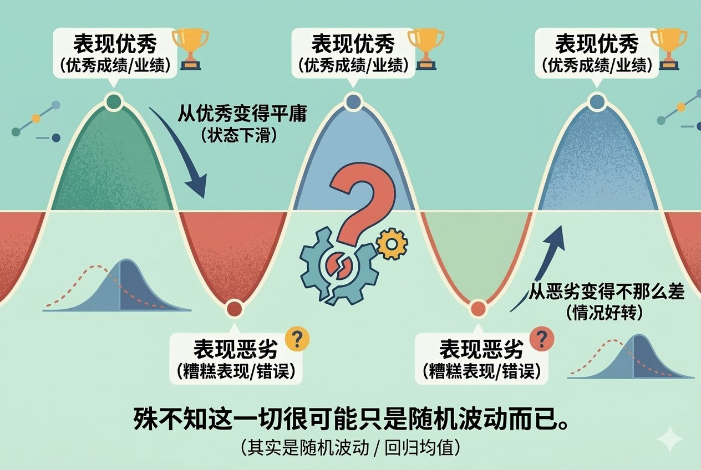
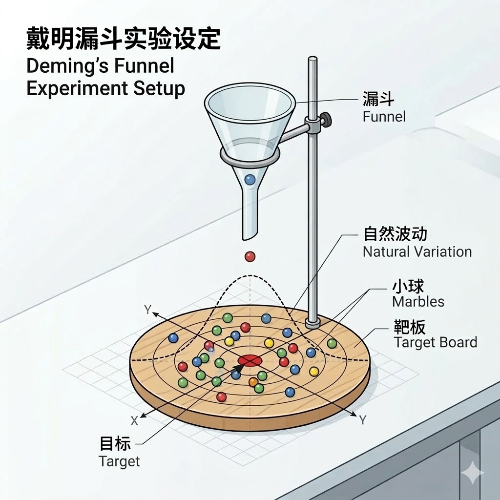

# 回归均值：不要大惊小怪，要有点定力（得到课程讲稿 + AI 加工段）

# 回归均值：不要大惊小怪，要有点定力

[回归均值：不要大惊小怪，要有点定力](https://www.dedao.cn/course/article?id=32axR8enbzBJ9pYxaQVkDEgM6ApPl9)

诺贝尔经济学奖得主丹尼尔·卡尼曼（Daniel Kahneman，1934-2024），可以说是决策科学的祖师爷之一。他在《思考，快与慢》一书中讲过一个故事。

卡尼曼有一次去给以色列空军做培训。他讲到一个心理学界人人皆知的观点：对良好表现的奖励，比对错误表现的惩罚要有效得多。有大量研究证据支持这个说法，不管你是教育小孩、训练运动员，甚至马戏团训练小动物，都应该以正面鼓励为主。

没想到，座中立即有一个老教官站出来表示反对。他说，我带过无数飞行员，每当有个学员做了一个极其漂亮的飞行动作，我表扬他，他下一次的动作准保变糟；可是每当有人飞得像一坨狗屎，我把他骂得狗血淋头，他下一次通常都会飞得更好！别跟我扯什么心理学，军队里就是吼叫最管用！

卡尼曼一时语塞。难道说那么多研究都错了吗？

如果你是个家长的话，你可能也有同感：孩子做错了事，你骂他一顿，他下次往往会表现好一点；他有一次考试成绩特别好，你一通猛夸，结果他下次反而考得没那么好。难道说“不打不成才”才是真理？

卡尼曼后来才意识到，老教官说的现象没错，但是解释是错的。

那不是管理学，那是统计学 —— 那不叫批评有效，那叫「 回归均值 （Regression to the Mean）」。这个道理是，特别好或者特别坏的表现都属于极端情况，都比较罕见 —— 所以下一次自然就没有那么极端了，你就算不批评不表扬，它也会更接近平均值。

我们上一讲说的「选择效应」，是你因为数据没看全而总结了错误的因果关系；而「回归均值」，则是你把数据的正常波动当成了因果。它会让你对极端事件过激反应。

回归均值这个现象是达尔文的表弟、英国科学家弗朗西斯·高尔顿（Francis Galton）在 1886 年最早提出来的。当时他研究身高遗传，发现高个父母的孩子平均没有父母那么高，矮个父母的孩子平均也没有父母那么矮 —— 难道说上帝喜欢讲公平，专门把极端者往中间拽吗？

高尔顿想了十多年才想明白，其实逻辑很简单。事物大多有一定的运气成分，可以说，

你的观测结果 = 事物的真实水平 + 随机运气。

这哥们在某一次测试中表现得“极其好”，意味着他不仅具备一定的实力，而且那天碰巧赶上了“极其好的运气”。但获得那么好的运气的概率是很小的。所以当他下一次再测试，就算实力一点都没变，好运气大概率也不会重现了。那么他的下一次表现，就几乎注定会比这一次差。

反过来也是。这一次搞砸了，也不只是能力的问题，也是运气太差 —— 总遇到坏运气的概率是很小的，所以下次的运气就没那么差了，表现自然就提升了。

就如同有一种力量在让他的表现向真实水平“回归”一样。当然这里根本就没有什么力量。即使没有教官的表扬或者批评，好的也不会一直好，坏的也不会一直坏，这就是正常的随机波动！

可是人的大脑实在太喜欢归因了。后来卡尼曼和他的合作者阿莫斯·特沃斯基（Amos Tversky）总结， 人很难理解回归均值，就经常犯两种错误：一个是错把波动当因果，一个是错把运气当实力 —— 可以统称为「回归谬误（Regression Fallacy）」。

关键是\*极端值\*实在太吸引我们解读了。

如果一个人表现这么优秀，难道不是因为他本身特别强大吗？

如果一个人表现特别恶劣，难道不是因为这个人有毛病吗？

如果一个人从优秀变得平庸，难道不是因为他骄傲自满了吗？

如果一个人从恶劣变得不那么差，难道不是因为我们对他的整改见效了吗？

殊不知这一切很可能只是随机波动而已。

可是现实中你并没有波动五次的机会 —— 人们常常一看见极端值，就下结论和采取措施。

一个 CEO 取得了突破性的业绩，公司给他发放巨额奖金，杂志把他放在封面。可是研究显示，这种登上顶峰的 CEO 往往会在之后的三年里出现明显的业绩回落……于是董事会痛心疾首，说你看，这人爆红之后飘了。

一个新秀球员加入职业联赛第一年大杀四方，第二年泯然众人。专家都说这就是“新秀墙”，他得反思自己，改变打法才行；球迷则说这人一赚了大钱就不思进取，这是“二年级魔咒”。

殊不知他们只是回归均值而已。董事会给不给奖励、新秀改不改变打法、赚没赚到钱，爆红者下一年的成绩都不会像这一年那么好。

老张有关节炎，平时膝盖就疼，有一天疼得特别厉害。邻居给他一个祖传药方，喝了之后，疼痛果然减轻了不少。你能说这药方有用吗？你要知道慢性疼痛本来就是波动的 —— 你在最低谷的时刻出手，任何疗法都容易见效。事实上，回归均值是现代医药领域判断疗效的一个非常严重的困扰因素。

足球界一直有个传说：如果球队成绩特别不好，只要换个教练，通常马上就会有奇效……那听起来就很像是回归均值。

这就如同皇上听说哪儿发生天灾，就下个罪己诏，接下来果然没有再次发生天灾 —— 你能说罪己诏有效吗？

管理学是回归谬误的重灾区。

一个部门的业绩跌到了谷底，高层震怒，就把原来的主管开除，换上一个新主管。新主管搞了一套新官上任三把火的严厉改革。结果第二个月，业绩好转了！试问在这种情况下，谁能说这不是新主管有能耐、力挽狂澜呢？

可真实情况偏偏可能只是业绩经历了一次随机波动。你把一只猴子放在主管的位置上，下个月也会反弹。

小布什时代，美国搞过一场轰轰烈烈的公立教育改革，叫“不让一个孩子掉队（No Child Left Behind）”。政策的思路是根据标准化考试成绩对学校和老师进行奖惩：如果一所学校考试成绩提高了，就给发奖金；如果退步了，那就削减经费甚至可能关闭学校。

结果一年之后，那些去年排名最靠后的学校，成绩有了普遍的提高。于是有人欢呼，你看，政策有效！看来不搞绩效不行，哪怕老师也不能只讲情怀！……可问题是，如果你去考察那些前一年成绩最好的学校，你会发现他们的成绩反而下滑了。难道说老师们只认大棒，不认胡萝卜吗？答案是发生了回归均值。

可人们就是喜欢立竿见影的大整顿，最好来个雷霆手段运动式治理。

与此同时，那些在上游默默地把系统维持得很稳的人，却常常不会被看见。我们给救火队员掌声，却不给防火工程师奖金。

基于回归谬误的大动作管理不但没好处，而且很有坏处。

1980 年代，美国统计学家、后来被誉为现代质量管理之父的威廉·戴明（W. Edwards Deming），提出了一个「漏斗实验（Funnel Experiment）」，那可能是管理学里最漂亮的寓言。

想象你在桌子上画一个靶心，在靶心的正上方放一个漏斗，让漏斗对准靶心。你把一颗一颗的小球从漏斗里扔下来，目标是让小球能够命中靶心。

不管你这个漏斗端得多平、瞄得多准，小球在下落过程中撞到漏斗的内壁，路线难免会产生一些偏差。如果你看到一个小球没有落在靶心上，落偏了，请问这时候你怎么办？

戴明设想了四种应对规则，代表四种管理方法。

**规则一是什么都别动。** 只要我相信漏斗已经对准了靶心，我完全可以认为小球的波动都是随机现象，没必要整改。

这是有定力的管理！小球的落点会围着靶心做正态分布，事实上这样的方差是最小的。

**规则二是基于偏差\*从上一次的漏斗位置\*做反向补偿。** 小球往左偏了 2 厘米，那我下次就把漏斗往右移动 2 厘米。

这是跟着结果跑的管理方式。顾客说这次菜做咸了，那我下次就少放一点盐。有人投诉我们产品的尺寸有点偏大，那我们就做小一点；下次人家又说尺寸小了，那我们就再改大一点。这样改来改去没定性，计算模拟发现它能把方差扩大一倍。

**规则三，则是参照\*桌子上的靶心\*做反向补偿。** 小球往左偏了 2 厘米，那我下次就把漏斗放在距离靶心右边 2 厘米的地方。如果说规则二是管理者认为自己的公司有问题，那规则三就是管理者认为自己的指挥有问题：我瞄得不够准！我们产品质量不行，看来是我管得不够严！竞争对手竟然降价，那我们要降得比他还多，我们跟他打价格战！结果就是运动式治理，今天一个口号明天一个大作战……系统被左右抽打，振荡越来越厉害，搞不好小球飞出桌面都有可能。

**规则四更有意思：上一颗小球落哪儿，下一次就把漏斗挪到哪儿。**

你说哪有这样搞管理的？其实真有，这就是公司没有标准也不看市场反馈，活儿怎么干全靠找感觉。师傅带徒弟口耳相传，这一代自动把上一代当榜样……结果越走越偏，最后都不知道自己在干什么。

这个道理是不要对偏差做过度的反应。你可以先多测几次，感觉漏斗对得差不多准就可以了，一定程度的误差都是可以容忍的 —— 否则你的管理就是添麻烦，而且可能是大麻烦。

当时就有个现成的案例。福特公司出一款新车型，决定搞双源采购，让本土的福特工厂和日本的马自达工厂用同一套图纸，生产完全相同的自动变速箱。结果搭载福特变速箱的汽车，投诉率和保修索赔率非常高；而马自达工厂生产的变速箱运行得就非常平稳。这是为啥呢？

原来福特的质量管理思路更像漏斗实验里的规则二：只要尺寸稍微偏离目标，哪怕还在规定公差范围内，也赶紧调机床。而马自达更像规则一：尽量先把机床调好，此后只要过程稳定，就不追着每个点乱调。

正如戴明所料，福特的公差比马自达大很多。过于勤勉的纠偏等于是给系统注入额外波动。

眼里不揉沙子见到毛病就改，可不是好管理。往往什么都不做比大惊小怪好得多。

人有多容易被回归均值迷惑呢？我调研中有个震惊的发现。著名的「邓宁—克鲁格效应（Dunning–Kruger Effect）」，在相当程度上，其实是回归均值导致的。

我们《精英日课》专栏以前专门讲过邓宁—克鲁格效应。它的意思是：越是愚蠢的人越容易高估自己；而聪明人都比较谦虚，倾向于低估自己。这个规律听着挺直观，但是 2020 年以来，学术界提出了很多质疑。

我们抛开技术细节简单说。研究人员判断一个受试者是聪明还是愚蠢，是通过在实验室里让他做一套测试题。既然是做题，就有人发挥好，有人发挥不好 —— 特别高和特别低的分都有运气成分。

可是当你让人做自我评价的时候，受试者的说法肯定会接近自己平时的均值。这个均值对发挥不好的人来说，肯定比他现场的表现要高；而对发挥好的人来说，则比他现场分数要低。对吧？

于是在你看来，就是低分的人高估了自己，高分的人低估了自己！殊不知这只是个统计效应。

也有人认为不完全是统计效应，说邓宁—克鲁格效应还是真实存在的，只是没有此前估计的那么严重而已……但我想说的要点是，想要从观测中获得一点真知，是非常困难的。学术界严谨到这个程度，还不敢说有定论。

那你说，连做学术研究的都这么难以判断真相，我又如何知道眼前这个事儿是真的趋势变了，还只是一个随机的波动呢？

这可是统计学最根本的问题。除了看更多、更全面的数据，没有简单办法。就回归均值而言，你至少应该问自己四个问题：

1. 我是不是因为一个极端值才开始注意这件事？

2. 我看到的是一个点，还是多期数据？

3. 如果我什么都不做，它会不会自己缓回来一点？

4. 系统的生成机制有没有真的改变？

最稳妥的办法是使用贝叶斯公式，每次稍稍更新一下自己的先验。

这一讲最重要的教训是决策定力。

孩子闯了个祸，你没必要发火，他自己也很难受；员工搞砸一项任务，你不用找他谈话更不用整改，他下次不至于如此；学生这次考试倒数第一，你先别忙上价值……同样的，老板偶尔办对了一件大事，你们也不用着急把他往天上捧。

飘风不终朝骤雨不终日，极端不是常态，有见识的人不会事事都管。

听风就是雨，今天跌 2% 你就觉得末日降临，明天涨 1% 你就以为牛市开启，看见不寻常就坐不住，一激动就重奖重罚，这种戏多的决策者能把系统折腾死。

有道是 ——

> 一时高，不必封神；  
> 一时低，不必诛心。  
> 峰谷本是寻常事，  
> 涨落无非一阵云。  
> 识得均值回归路，  
> 方知遇事缓三分。  
> 临变何须多惊怪，  
> 大度能容是大人。

---

这篇文本以统计学中的**「回归均值（Regression to the Mean）」为切入点，表面上在科普一个数学常识，实际上则是在探讨人类认知的底层缺陷以及应对不确定性时的决策哲学**。

#### 认知论视角的颠覆：从“因果思维”到“概率思维”

人类的大脑出厂设置是**“因果论”的：看到一件事发生，潜意识就会去寻找原因（因为A，所以B）。然而，真实世界的底层逻辑往往是“概率论”**的。

- **万物皆有运气成分：观测结果 = 真实水平 + 随机运气**。
- **极端的本质是“实力+爆棚的运气/倒霉”：**一个人表现极好或极坏，往往不是因为他的能力突然发生了质变，而是“随机波动”达到了极限。既然好运气和坏运气都是罕见的，那么下一次必然会向正常水平（均值）靠拢。

这要求我们放弃对每一次起伏都进行过度解读的执念。不是每一次成功都有秘诀，也不是每一次失败都有罪魁祸首。很多时候，答案仅仅是“概率使然”。

#### 心理学视角的陷阱：人类大脑的“归因狂悖”

**「回归谬误」**揭示了人类在面对数据波动时的两种典型错觉：

1. **错把波动当因果：**飞行教官大骂学员后学员表现变好，教官认为是“骂”起作用了；新主管上任后业绩反弹，人们认为是“新官”的能力。这在心理学上叫作“错觉相关”，我们强行给两个先后发生的随机事件建立了因果联系。
2. **错把运气当实力：**也就是忽略了“运气”在极值中的决定性作用，甚至连著名的“邓宁—克鲁格效应”都可能掺杂了这种统计学错觉。

我们极其容易被“极端值”绑架。因为极端值带有戏剧性，它迎合了我们喜欢听“英雄造时势”或“浪子回头”故事的心理。而“均值回归”则极其乏味，它不符合人类喜欢听故事的天性，因此往往被视而不见。

#### 管理学视角的警示：过度反应是系统的灾难

**「漏斗实验」**揭示了一个反直觉的真相：**在系统没有发生实质性改变的前提下，管理者出于好意的“微操”和“纠偏”，反而会制造更大的灾难。**

- **勤奋的陷阱：** 看到业绩下滑就搞末位淘汰，看到产品有一点公差就调机床（如福特与马自达的对比），看到孩子考差了就报辅导班。这种“跟着结果跑”的运动式治理，相当于给系统注入了额外的波动，导致“动作变形”，方差越来越大。
- **无为的智慧：** 只要系统本身（漏斗的位置）是正确的，容忍正常的误差是成本最低、效果最好的管理方式。

真正的管理高手，能分清**“特殊原因带来的系统性改变”和“普通原因带来的随机波动”**。给救火队员鼓掌很容易，但真正有价值的是做那个容忍正常波动、维持系统稳定的“防火工程师”。

#### 行动指南与决策哲学：贝叶斯更新与“定力”

既然我们极易陷入回归谬误，日常生活中该如何避免瞎折腾？

1. **建立“拦截机制”（四个灵魂拷问）：**

   - 在采取行动前，先确认自己是不是被“极端值”（某次暴涨/暴跌、某次大错/大功）刺激到了？
   - 这是一个孤立的点，还是长期的趋势？
   - 这是不是系统机制没变，只是在“自然回血”或“自然回落”？
2. **运用“贝叶斯更新”：**不要因为一次极端事件就彻底推翻对一个人或一件事的看法（先验概率）。别人偶尔惊艳，你稍微提高一点对他的评价；偶尔拉胯，你稍微降低一点预期。**小步微调，而不是大起大落。**
3. **修炼“定力”（终极哲学）：**这是全篇的落脚点。在投资、教育、职场和企业管理中，最稀缺的品质不是雷厉风行，而是“定力”。

   - **向上看：** “一时高，不必封神”，不盲目造神，防范捧杀和骄傲。
   - **向下看：** “一时低，不必诛心”，不对偶尔犯错的下属或孩子上纲上线，保留宽容。
   - **向内看：** 允许自己有状态低迷的时候，不因一时的挫折而自我否定。

回归均值不仅仅是一个统计学概念，它更是一副清醒剂。它告诉我们，在这个充满随机性与波动的世界里，**“不折腾”往往是一种最高级的智慧**。看透了均值回归的规律，我们就能在狂热中保持冷眼，在低谷中保留希望，从而拥有真正的大将之风与决策定力。

---

“回归均值”不仅是统计学和管理学的高阶理论，更是普通人抵抗焦虑、做出清醒决策的**“生活哲学”**。

对于我们普通人而言，理解了“回归均值”，最大的意义在于**建立对生活的“松弛感”和“定力”**。以下是这个底层逻辑在日常生活中五个维度的具体启示：

#### 育儿启示：别陷入“吼叫有用”的错觉

很多家长和那个以色列空军教官一样，觉得“不打不成才”、“一夸就飘”。

- **现象：** 孩子某次大考考了全班第一（极端极好），你奖励了他，下次考了第五，你觉得“夸不得”；孩子某次考了倒数（极端极坏），你大骂一顿，下次成绩回升，你觉得“骂得管用”。
- **启示：** 孩子的成绩 = 真实学习水平 + 临场发挥（运气/状态）。考极好或极差，都有极大的运气成分，下一次必然会向他的真实平均水平靠拢。
- **怎么做：** **不要盯着一两次的成绩单大惊小怪。** 考砸了，少点责骂，因为他自己也很难受，下次自然会回升；考好了，多表扬他的“努力的过程”而非“结果”，并对他下次的成绩回落做好心理准备。做一个情绪稳定的家长，是对孩子最大的帮助。

#### 职场启示：停止“瞎折腾”，警惕“新官上任三把火”

戴明的“漏斗实验”告诉我们，频繁的微操会毁掉一个原本正常的系统。

- **现象：** 某个月业绩没达标，或者某次汇报搞砸了，你陷入深度自我怀疑，立刻决定全盘推翻自己过去的工作方法，发誓要彻夜熬夜、改变策略。
- **启示：** 只要你平时的“基本盘”是稳的，一次失败往往只是随机的向下波动。如果你因为一次偶然的失误就动作变形（像漏斗实验里追着偏离的球跑），反而会制造更大的混乱。
- **怎么做：** **让子弹飞一会儿。** 遇到挫折，先问自己：“生成机制（我的核心能力/工作流程）真的出问题了吗？”如果没问题，就不要乱动，按部就班地继续干，下一次大概率会恢复正常水平。

#### 自我成长启示：学会与“低谷期”和解，不被“高光时刻”捧杀

- **现象：** 倒霉的时候喝凉水都塞牙，觉得人生无望；顺风顺水的时候，觉得自己无所不能，甚至开始膨胀。
- **启示：** 极度的低谷 = 实力低迷 + 极差的运气。既然极差的运气不会一直跟着你，那么\*\*“当你身处谷底，怎么走都是向上”\*\*不仅仅是一句鸡汤，而是严谨的统计学规律。同理，“凭运气赚来的钱，最后往往会凭实力亏掉”也是回归均值的体现。
- **怎么做：** 

  - **一时低，不必诛心：** 搞砸了一件事，不要贴“我就是个废物”的标签，那只是均值线下的一次波动。
  - **一时高，不必封神：** 偶然取得了超出预期的成功，保持谦卑，把多出来的部分归结于“运气好”，这能避免你在下一次表现平庸时产生巨大的落差感。

#### 消费与健康启示：识破“偏方”与“神药”的滤镜

医疗保健和消费领域，是“回归谬误”的重灾区。

- **现象：** 你的颈椎病/偏头痛/肠胃炎最近疼得极其厉害（达到极值）。你病急乱投医，吃了一个偏方/换了一个很贵的理疗师。几天后，真的不那么疼了。你觉得这个偏方/理疗师是“神仙”。
- **启示：** 很多慢性病、情绪低落本身就有周期性波动的特征。人们通常在症状**最严重、最痛苦的极值点**去寻求干预。就算你什么都不做（或者只喝白开水），过几天症状也会向均值缓解。
- **怎么做：** 在评价某项护肤品、保健品、培训班是否“有奇效”时，不要只看刚用完那几天的感觉，要拉长周期看它是否真的改变了你的“基础均值”。捂紧钱包，别为概率买单。

#### 理财启示：敬畏周期，别做追涨杀跌的韭菜

- **现象：** 一只股票/基金连续大涨，全网都在吹捧，你忍不住冲进去（追高）；大盘连续大跌，你受不了折磨，割肉离场（杀跌）。
- **启示：** 资本市场最强大的地心引力就是“均值回归”。无论是被热炒到天上，还是被恐慌砸到地下，最终都会回到其真实的内在价值。那些被送上杂志封面的明星基金经理，往往第二年业绩就会大变脸。
- **怎么做：** 别人疯狂时我恐惧，别人恐惧时我贪婪。不眼红别人的短期暴利，接受稳健的长期平均收益。

**最终建议：提升“均值”，看淡“波动”**

回归均值不是让我们躺平认命。它的终极智慧是划分了人生的“可控”与“不可控”：

- **单次结果（波动）是不可控的：** 它受运气、环境影响极大，不需要为之狂喜或绝望。
- **真实水平（均值）是可控的：** 我们每天读书、锻炼、工作、学习，目的不是为了保证每一次都不失误，而是为了**把我们人生的“平均底线”一点一点地垫高。**

正如文中所说：**“峰谷本是寻常事，涨落无非一阵云。”** 面对生活中的大小波折，少一点惊怪，多三分从容。这是懂概率的人，才有的顶级松弛感。

---

> “邓宁-克鲁格效应（Dunning-Kruger Effect，简称DKE）可能只是统计学错觉”

**整体结论：这段文本的描述是非常准确且前沿的。** 它不仅准确抓住了近几年心理学界和统计学界对“邓宁-克鲁格效应”的最新反思，而且用极为通俗的语言解释了复杂的统计学原理（回归均值与测量误差）。

#### 核查点一：关于“邓宁-克鲁格效应”的定义

> **文本表述：** “越是愚蠢的人越容易高估自己；而聪明人都比较谦虚，倾向于低估自己。”

- **核查结果：基本准确，但属于“大众简化版”。**
- **细节补充：** 1999年，康奈尔大学的心理学家大卫·邓宁（David Dunning）和贾斯汀·克鲁格（Justin Kruger）发表了最初的论文。在学术上，他们并没有直接使用“愚蠢”或“聪明”这种词，而是指在**某一特定领域（如逻辑推理、语法、幽默感）能力处于底层25%的人**，往往会高估自己的能力；而处于顶层25%的人，会略微低估自己。
- **注意一个常见误区：** 即使底层的人高估了自己，他们对自己能力的评分，**依然低于**那些顶层高手对自己的评分。也就是说，“差生”只是觉得自己“中等偏上”，并没有觉得自己比真正的“学霸”还厉害。

#### 核查点二：关于“2020年以来的学术界质疑”

> **文本表述：** “2020 年以来，学术界提出了很多质疑。”

- **核查结果：完全真实。**
- **细节补充：** 实际上，对该效应的统计学质疑最早在2002年就出现了，但在**2020年前后达到了高潮**，并彻底破圈。

  - 2020年，学者 Gilles Gignac 和 Marcin Zajenkowski 发表了一篇重量级论文，标题直接就是《邓宁-克鲁格效应（大部分）是统计学的人造物》（\*The Dunning-Kruger effect is (mostly) a statistical artefact\*）。
  - 随后在2021-2022年，大量科普媒体（如《科学美国人》、McGill大学科学与社会办公室等）纷纷跟进报道，引发了学术界和大众的广泛讨论。

#### 核查点三：回归均值与“测试运气”的解释

> **文本表述：** “由于做题有发挥好坏（运气成分），人的自我评价接近均值。低分者（发挥差）显得高估了自己，高分者（发挥好）显得低估了自己……殊不知这只是个统计效应。”

- **核查结果：极其精准，完美解释了学术界的“测量误差与均值回归”批评。**
- **底层逻辑还原：** 这在统计学中被称为**“自相关（Autocorrelation）”和“天花板/地板效应”**引发的均值回归。

  - 想象一个“完全没有自我认知能力”的瞎蒙测试：所有人都盲目地认为自己处于全班平均水平（50分）。
  - 现在让他们做客观测试。由于测试有随机性（测量误差/运气）：
  
    - **考了底分（比如20分）的人：** 他们的实际得分是20，但自我评估是50。研究人员一看：哇，他高估了自己30分！
    - **考了高分（比如90分）的人：** 实际得分90，自我评估50。研究人员一看：哇，他低估了自己40分！
  - 批评者指出，即使人类**没有任何心理学上的认知偏差**，仅仅因为测试分数包含随机波动，只要你把“自我评估”和“包含波动的测试分数”画在图表上，**数学规律本身就会自动画出一条“差生高估、优生低估”的曲线**。原作者邓宁和克鲁格当年没有把这个统计学错觉完全剔除干净。

#### 核查点四：目前的学术定论

> **文本表述：** “也有人认为不完全是统计效应……想要从观测中获得一点真知，是非常困难的。学术界严谨到这个程度，还不敢说有定论。”

- **核查结果：客观中肯。**
- **细节补充：** 面对同行的猛烈炮火，大卫·邓宁本人也做过回应。后来的学者通过更严谨的统计模型（剥离了“回归均值”的干扰）重新分析数据后发现：

  - 统计学错觉确实夸大了邓宁-克鲁格效应的程度（原始图表中那种极其夸张的偏差确实有一半是统计学背锅）。
  - 但是，在剔除统计学噪音后，**这个心理学效应依然存在，只是变弱了**。能力差的人确实在“元认知（认识自己能力的能力）”上存在一定缺陷。

这段文本的作者具备非常高的科学素养。他/她没有停留在烂大街的“达克效应”科普上，而是敏锐地捕捉到了心理学界最新的“纠偏”过程。

更可贵的是，作者借用这个极其硬核的学术公案，传达了一个深刻的认识论观点：**真实世界的数据充满了噪音（运气、波动），人类极容易把“数学规律（均值回归）”误认为是“因果关系或心理学规律”。** 保持对数据的敬畏，不急于下结论，确实是最高级的决策智慧。
