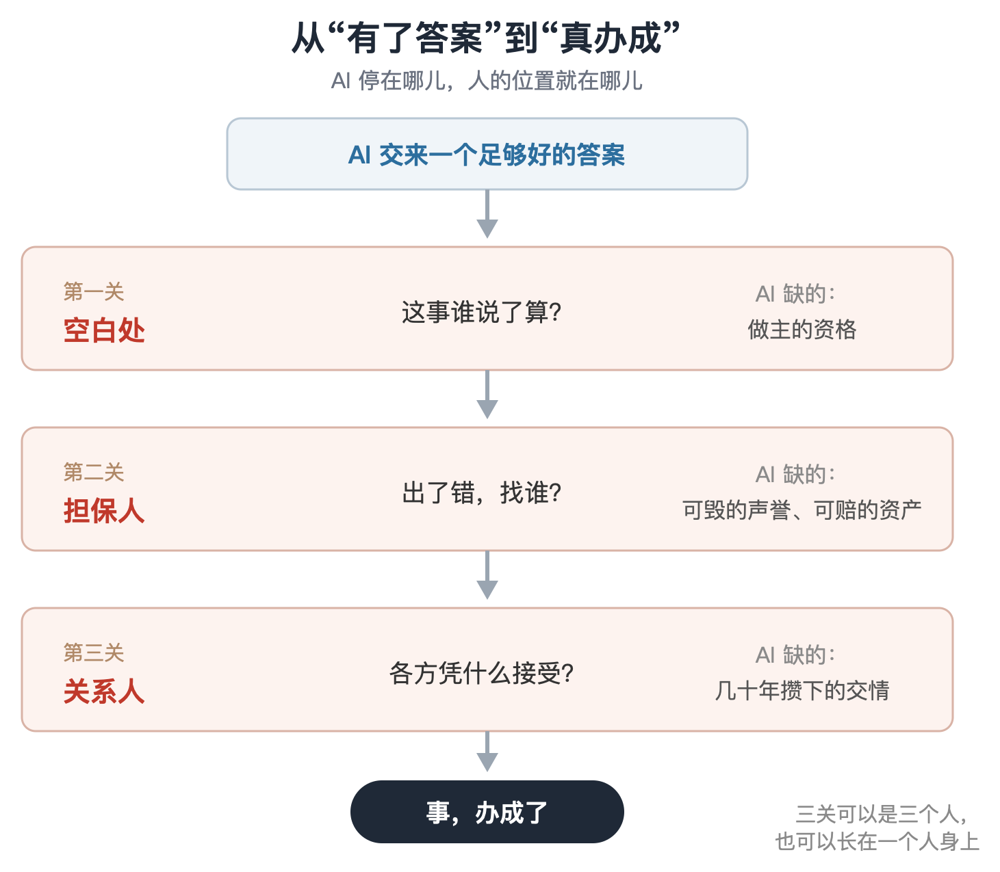
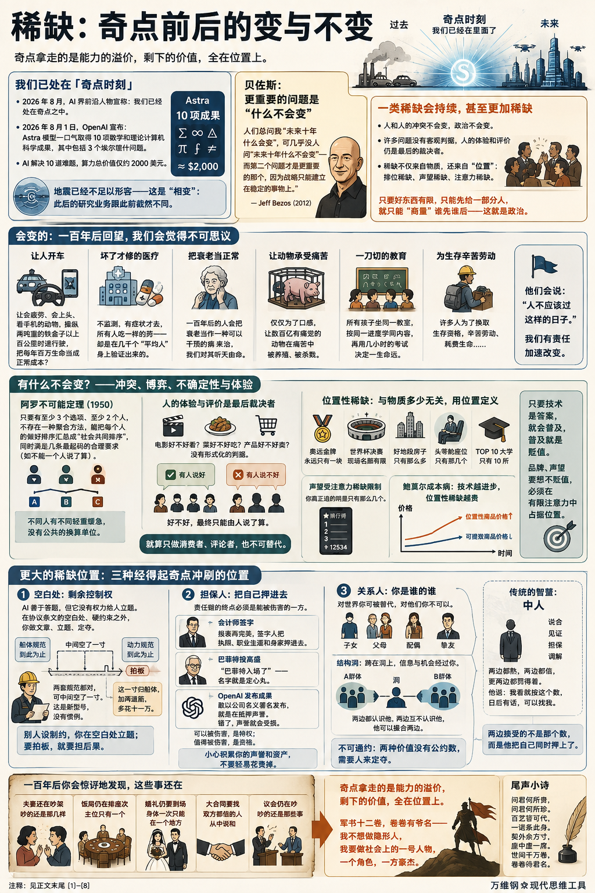

# 稀缺：奇点前后的变与不变

[稀缺：奇点前后的变与不变](https://www.dedao.cn/course/article?id=m845Ln7q69yKOOoGdlKrkebvGDYjgl)

2026-08-05 23:03

可能你已经注意到，也可能你还没给足够的关注：就在我们课程即将结束的 2026 年 8 月初，AI 界的前沿人物，包括奥特曼和马斯克，已经宣称：我们已经处在「奇点时刻」之中。

不是即将到来，不是临近 —— 是我们已经在里面了。

最直接的证据是，就在最近这一个月，有人连续用主流 AI 模型解决了数学家多年悬而未决的难题。

比如 8 月 1 日，OpenAI 宣布，他们使用一个代号 Astra 的内部模型一口气交出十项数学和理论计算机科学的成果，其中包括三个埃尔德什问题 —— 出自匈牙利传奇数学家保罗·埃尔德什（Paul Erdős）留下的待解问题集。这些难题有的被彻底解决，有的取得了决定性进展，有的则是 AI 构造出了反例，证伪了著名猜想。

人类数学家解决其中任何一道题都足以获得声望，甚至拿奖。可是 AI 解决这 10 道题所花费的算力总价值，不过是 2000 美元。

“地震”已经不足以形容 AI 对数学的影响 —— 这是“相变”：此后的数学研究业务跟此前截然不同。

这还只是数学。其他理论研究和工程研究，乃至 AI 直接参与的实验、生物学与医学研究，也都在高速推进。等新一代模型出来给一线科学家全面用上，也不知又会取得什么惊人的成果。

现实是，哪怕 AI 技术从今天起停止进步，此后仅仅是把现有能力普及开，就足以让社会剧变。

这一讲咱们展望一下，奇点之后会是什么样。

贝佐斯（Jeff Bezos）2012 年有一段话说得好：人们总问我“未来十年什么会变”，可几乎没人问“未来十年什么不会变” —— 而第二个问题才是更重要的那个，因为战略只能建立在稳定的事物上。

**那有什么东西，即便经历了奇点也不会变？**

**特别是有什么东西会继续稀缺，甚至更加稀缺呢？**

✵

先看会变的。一百年后的人回望我们这个时代，会像我们回望放血疗法一样，觉得很多事情不可思议 ——

我们居然让人开车。允许一个会疲劳、会上头、会边开车边看手机的动物，操纵两吨重的铁盒子以上百公里的时速行驶，然后把每年一百多万条人命当作正常的社会成本？

我们的医疗居然是坏了才修。平时不监测，有症状才去医院，而且所有人吃一样的药 —— 那个药的疗效是在几千个“平均人”身上验证出来的，可你不是平均人。

我们居然把衰老当正常。一百年后的人多半会把衰老当作一种可以干预的病来治，他们看我们对衰老听天由命，就像我们看古人对天花听天由命。

我们居然仅仅为了口感，就让几百亿有痛觉的动物在养殖场里过完痛苦的一生，然后被杀戮。

我们居然让所有孩子坐在同一间教室里，按同一个进度学同样的内容，再用一场几小时的考试决定一个人一生的命运。

我们社会中的很多人，甚至多数人，居然要为了换取生存资格而辛苦劳动、耗费生命……

他们会说：“人不应该过这样的日子。”

而我们有责任加速改变这样的日子。但现在咱们先想想：什么不会变？

✵

**首先，人和人的冲突不会变。政治，不会变。**

有人曾经幻想，既然 AI 比所有人都聪明，而且又没有私心，不会收礼，那为什么不让 AI 治理国家呢？我们把所有相关信息输入给 AI，让它做出最好的安排不就行了吗？

不是技术上暂时不可行，是数学上就不允许。

我们前面提到过「阿罗不可能定理」，是后来获得诺贝尔经济学奖的美国经济学家肯尼斯·阿罗（Kenneth Arrow）在 1950 年证明的。这个定理说：只要有至少三个选项、至少两个人，就不存在一种聚合方法，能把每个人各自的偏好排序汇总成一个“社会共同排序”，同时还满足几条最起码的合理要求 —— 比如不能一个人说了算。

说白了，社会上永远都会你有你的优先级，我有我的排序，他有他的需求 —— 不存在一个数学方法能以皆大欢喜的方式调和我们的矛盾。

只要好东西有限，只能先给一部分人，就只能“商量”谁先谁后。也许是谈判、妥协，也许是投票、结盟，能动嘴尽量别动手，但前提是你有能力动手 —— 这就是政治。AI 不会改变这个局面，数学不允许它改变。

冲突不会消失，博弈不会消失，不确定性不会消失；而在许多问题上，人的体验和评价仍是最后的裁决者。

一部电影好不好看，一道菜好不好吃，一个产品好不好卖 —— 这些问题没有形式化的判据。也许一部分人都说好、另一部分人偏说不好；也许你以前认为好、现在认为不好。“好不好”这个判断最终只能由人说了算。

换句话说，就算一个人不去做生产者和创造者，他就做个消费者、评论者，也是不可替代的。

✵

但也许你有更大的图谋，那么你会关心另一种不变的东西：「稀缺」。

有人说等 AI 把生产力提上去，物质极大丰富，我们就会进入“后稀缺社会”……殊不知有一类稀缺跟物质多少无关，它是用位置定义的。

1976 年，英国经济学家弗雷德·赫希（Fred Hirsch）在《增长的社会限度》一书中提出一个概念叫「 位置性商品 （positional goods）」 ：**有些东西的价值不来自它是什么，而来自它排第几 —— 而“第几”，按定义就是有限的。咱们把这种局面叫做「位置性稀缺」，或者叫「排位稀缺」。**

运动科技再发达，奥运会一个项目的金牌永远只有一块。世界杯四年一届，决赛全世界都能看直播，可是现场座位就只有几万个 —— “我在现场”很贵，而且会越来越贵。“一线”城市最好的地段的房子只能那么多，飞机头等舱只有那几个位子，全国 TOP 10 大学只有…… 10 所。

声望也是位置性的，受到注意力稀缺的限制。你真正追的明星只有那么几个。如果你的频道在抖音著名频道排行榜上排第 12534 位，你那不是一个“著名”频道。

我们讲过「鲍莫尔成本病」：技术进步让能提效的东西越来越便宜，于是不能提效的东西就会相对越来越贵。所以奇点只会加剧位置性稀缺。

在极端情况下，如果 AI 把一切能变便宜的都变成免费，剩下那些不能变便宜的东西，就承载了几乎全部的稀缺溢价。

只要技术是一个东西的答案，这个东西就会普及，普及就是贬值。

品牌也好，声望也好，要想不贬值，你就必须在全体人类有限的总注意力中占据一个位置。

✵

我小时候读《木兰诗》，“昨夜见军帖，可汗大点兵，军书十二卷，卷卷有爷名”，我是一点都没对木兰的老父亲表示同情，我反而觉得他很厉害：打仗指定要他参加，还卷卷有爷名，这是多大的威风！

当然卷卷有爷名的真实含义是强制征兵。你想要的不是被征用，而是别人有大事都需要你的参与，而你有权不参与。

其实每个人都有这样的价值。比如亲戚朋友家办红白喜事，你能到场就是一份背书。你是一个不可复制的、有内在价值的、独特的人：你的时间有限，所以你的出现稀缺。奇点只会加强这一点。

但“独一无二”可能还不能让你满意 —— 毕竟每一片雪花也是独一无二的 —— 可能你最想要的是那种更大的稀缺性……最好是你能占据一个很多人想占据，但是占据不了的位置。

这样的位置有三种，它们都经得起奇点的冲刷：空白处，担保人和关系人。

✵

第一种位置在空白处。空白的意思是我们讲过的「剩余控制权」那个空白。

合同只能规定这么多。一个公司是一台寻找机会赚钱的机器，而不是一个按照合同规定动作行动的组织。AI 善于答题，但它没有权力给人立题。

在 AI 无法决定的地方、在协议条文的空白处、在所有硬约束悬崖之外的地方，是你做文章、立题的地方。你必须自己权衡利弊，用自己的品味做出选择，用你的主动性影响他人。

这个项目要不要做？做到什么程度算成？两个都有道理的方案选哪个？规则没覆盖的新情况算谁的？这些空白处的工作不是答对，是定夺。你根据自己的手感拍一个板，然后认这个板的后果。

设想一个高度自动化的造船厂，图纸系统出，焊缝机器焊。船体和动力各有一套规范，两套规范都规定到交界处就停了：船体那边说，过了这条线归动力管；动力那边说，过了这条线归船体管。两套规范都对，可是加起来中间空了一寸。

问系统这一寸怎么办，系统答：“你要是想再安全一点点，就这么办；要想省一点点钱，就那么办；或者你可以按行业惯例处理。”可这是新型号，行业没有惯例。谁知道那更安全的一点点值不值得那一点点钱？

最后是一位老工程师拍板：这一寸归船体，加两道筋，多花十一万。

有人说万一错了呢？老工程师盖下了自己的印章：工艺责任人，陈某某。

归根结底，我们只能相信某个人的主观判断 —— 因为只有人才能认账。

✵

这就引出了第二种位置：做担保人。

如果你只是拥有一笔财富，你只是一个消费者而已。但如果你把拥有的东西拿出来抵押，你就是在做事儿了。

AI 替会计师做好了一切报表，但会计师终究必须签字，把自己的执照、职业生涯和身家押进去。你必须“有”，你的抵押才值钱。

2008 年金融危机最深的时候，巴菲特给高盛投了 50 亿美元 —— 对市场上很多人来说，这笔钱是一颗定心丸：“巴菲特入场了”，这个名字很重要。

再拿这次 Astra 的数学成果来说，那些成果是 AI 做出来的，原则上任何人都可以用 AI 做到 —— 但你 OpenAI 敢把它们整理成论文，以公司的名义署名发布，你就是在抵押自己的声誉。你敢发布，AI 社区就敢相信，数学共同体就敢花时间去验证。他们要是发现 AI 做错了，你的声誉就会大大受损。

我们讲「自我约束」的时候说了：责任链的终点必须是能被伤害的一方。

可以被伤害，是人相对于 AI 的一种特权；值得被伤害，却是一种并非人人都有的资格 —— 你得有声誉可毁，有资产可赔。

普通人可以为朋友作保，巴菲特能为高盛背书。小心积累你的声誉和资产，不要轻易花费掉。

✵

第三种位置是做关系人。

每个人都处在社会关系之中：你是一些人的子女，一些人的父母，某个人的配偶，几个人的挚友。对世界来说你可以被替代，对他们来说不可以。这就是为什么哪怕一位老人失能了，躺在床上什么都做不了，他也有价值 —— 他的价值不在于他能干什么，而在于他是谁的谁。

同样道理，AI 的陪伴和照护再体贴、再周到，你作为亲友的价值，它也拿不走 —— 因为那个价值的定义里就写着“是你”。

我们讲过的「结构洞」，也是一种关系价值。

有些群体和群体之间没有连接，中间是个洞。谁正好跨在洞上 —— 两边都认识他，两边互相不认识 —— 谁就占了一个天然值钱的位置：信息经过他，机会经过他，他可以撮合两边。那你说 AI 最擅长处理信息啊，为什么不是由 AI 填补结构洞呢？

这里有个关键概念叫「 不可通约 （incommensurability）」。说白了就是这两个东西没有公约数，不能用一个共同的尺度测量。

比如名声和金钱，安全和自由，事业和家庭，孩子的快乐和孩子的前途 —— 这些东西是可以取舍的，我们天天都在取舍，但它们之间没有汇率。一万块钱等于多少名声？不存在这个数。

英国哲学家以赛亚·伯林（Isaiah Berlin）的说法叫「价值多元论」：价值世界里到处都是这种关系。其实价值不可通约和阿罗不可能定理本质上是一回事儿：阿罗式的困难之所以躲不开，深层的原因就是不同人的轻重缓急之间没有公共的换算单位 —— 张三的委屈跟李四的满足哪个重要？谁也定不出个官方汇率。

既然两种价值不可通约，就没有一个能用公共尺子机械算出来、各方一看就得服的答案。

可我们还是得定夺啊。1997 年，美国哲学家张美露（Ruth Chang）专门论证过：不可通约不等于不能定夺。

那么谁来定夺呢？你替两拨人选出来一个方案，他们凭什么接受呢？

其实中国传统社会早就有自己的结构洞解决方案了，称之为「中人」。明清的契约，买地卖房、借钱拜师，几乎无契不列中人。研究者找到同治八年（1869 年）的一张卖地契上，中人竟然列了二十四个。这些中人的作用就是说合、见证、担保、调解。

大清有法律，有衙门，可是卖地人心里记的账是祖产、脸面、乡里人言 —— “祖上的地到我手里卖掉了”，这个痛没有价格；买地人记的账是银钱、地力、收成。两本账不可通约，你把 AI 请来也没用。

中人之所以能让这一单交易做成，就是因为两头都熟，两头都信，更要紧的是两头都罚得着 —— 卖方知道，他要是偏了心，往后在乡里就抬不起头；买方知道，他要是办砸了，市面上再没人请他做中。

他说：“我看就按这个数，日后有话，可以找我。”这句话，两边都接受了。

他们接受的不是那个数。他们接受的是\*他\*：是他把自己在两个圈子里的脸面同时押上了这个事实。

✵

最后咱们畅想一下。如果你穿越到 100 年后，或者你直接活到了 100 年后，你会惊讶地发现，下面这些事居然还在。

夫妻关系还在，而且还在吵架。吵的还是那几样：你妈和我妈谁重要，你的事业和我的付出怎么比。还是吵不出结果 —— 因为这些账不可通约。

饭局还在排座次。主位还是只有一个，谁先动筷子还是有讲究。

婚礼的客人还是要亲自到场。身体一次只能在一个地方，这杯喜酒才珍贵。

签大合同还是要找双方都信得过的人从中说和，也许回归传统还叫中人。

议会还在吵，吵的还是那些事：谁先谁后，谁多谁少，凭什么……

在这种情况下，就算人人都能领取全民基本收入，大家的社会生活恐怕也没有太多质的改变。你想想，现在那些体制内退休老人过的不就是后奇点生活吗？

奇点拿走的是能力的\*溢价\*，剩下的价值，全在\*位置\*上。

军书十二卷，卷卷有爷名 —— 我怎么这么喜欢这句话……总之你不希望做个隐形人，你希望做社会上的一号人物，一个角色，一方豪杰。

**【尾声小诗】**

> 问君何所贵，  
> 问君何所珍。  
> 百艺皆可代，  
> 一诺系此身。  
> 契外余方寸，  
> 座中虚一席。  
> 世间千万卷，  
> 卷卷待君名。

---

### 核心洞见

这篇文章以2026年AI跨越“奇点”为背景，通过贝索斯“什么不会变”的战略视角，探讨了后奇点时代人类价值的重构。其核心洞见可以提炼为一句话：**“奇点拿走的是能力的溢价，剩下的价值，全在位置上。”**

#### 1. 终极转向：从“能力稀缺”到“排位稀缺”

- **能力的迅速贬值：** 只要一个问题有技术解，技术就会带来普及，而普及必然导致贬值（如AI以极低算力成本解决世界级数学难题）。智力、技能和生产效率不再是壁垒。
- **鲍莫尔成本病的反向作用：** 凡是能被AI大幅提效的（物质、计算、基础创意）都将趋向免费；而那些**无法被提效的事物**（零和博弈的席位、人类真实的注意力、顶级声望），将承载全社会几乎全部的“稀缺溢价”。
- **排位商品（Positional Goods）称王：** 价值不再取决于“它是什么”，而取决于“它排第几”。世界杯的现场席位、金牌归属、核心圈层的准入，这类无法复制的“排位”，会变得前所未有的昂贵。

#### 2. 永恒底色：政治与冲突不会终结（数学上的必然）

- **“AI完美治理社会”是技术乌托邦的幻想：** 阻碍AI调和人类利益的不是算力，而是**数学规律**。
- **阿罗不可能定理的锁死：** 只要存在多元个体和偏好，就不存在一种在数学上完美、公正且能让所有人满意的偏好汇总机制。不同人群的诉求、优先级永远存在冲突。
- **政治即博弈：** 资源的分配顺序只能通过谈判、妥协、结盟甚至对抗来“商量”。因此，**政治、博弈与妥协是永恒的**，人类社会不可能变成纯粹理性的流水线。

#### 3. 认账特权：机器善于答题，人类负责定夺与背书

在技术填满确定性之后，人类的壁垒退守到三个AI无法涉足的“关键位置”：

- **位置一：空白处的“定夺者”（剩余控制权）**

  - 规则、协议与AI算法总有覆盖不到的边缘（空白处）。
  - 面对没有标准答案的两难抉择（如：安全与成本的权衡），AI只能给出概率，**只有人能凭“手感”拍板，并承担拍板的后果**。
- **位置二：有代价的“担保人”（Skin in the Game）**

  - 责任链的终点，必须是一个“能被伤害”的实体。AI不会破产，没有生命，不在乎名誉；而人有身家性命和声誉可以质押。
  - **“能够被伤害，是人相对于AI的一种特权；值得被伤害，是一种稀缺的资格。”** 签字、盖章、背书，本质上都是在拿自己的资产和声望做抵押。
- **位置三：跨越断层的“关系人”（中人与结构洞）**

  - **价值的不可通约性（Incommensurability）：** 金钱与尊严、家庭与事业、情感与利益之间没有公认的换算汇率，AI算不出最优解。
  - **中人的不可替代性：** 传统的“中人”之所以能撮合交易、平息争端，不是因为他信息算得准，而是因为**两头都信任他，且两头都“罚得着”他**。他押上了自己在圈子里的脸面，充当了不可通约价值之间的黏合剂。

#### 4. 体验闭环：人类是价值的最终裁判者

- 形式化指标无法定义“好坏”。一道菜是否美味、一部电影是否动人，其最终判据永远落在人的主观体验上。
- 在生产力极度过剩的世界里，人类哪怕不作为生产者，仅仅作为\*\*“消费者”和“体验/评价者”\*\*，也是整个价值闭环中不可替代的终点。

#### 5. 战略启示：普通人如何在后奇点时代立足？

- **别把战略建立在“掌握某项可被编码的技能”上：** 单纯卷解题速度、卷知识储备，在奇点后毫无意义。
- **建立你的“位置资产”：**

  1. **积累可供抵押的信誉与资本：** 珍惜羽毛，让自己成为一个“赔得起、值得被信赖”的责任承担者。
  2. **深入无法被算法度量的人际网络：** 占据特定社会关系中的“结构洞”，做有温度、有担当的“中人”。
  3. **敢于在模糊地带拍板：** 培养品味、直觉与决断力，争夺规则空白处的“剩余控制权”。

AI接管了“做事情”的职能，但世界的终极驱动力依然是**主观的评价、价值的取舍、责任的认账，以及人与人之间的爱恨博弈**。未来的胜出者，不是那些算得最快的人，而是那些**在关键位置上押上自己、为不可通约的难题拍板定夺的人**（“卷卷待君名”）。

---

### 后稀缺时代

> 所以，即便 AGI 到来，日后物质财富极大丰富，人类依然存在很多困境与难题吗？请进行深度思辨

这是一个触及人类文明终极命题的深刻思考。

简短的回答是：**不仅依然存在，而且可能会更加剧烈、更加本质。**

人类历史上绝大多数哲学、宗教、社会制度和心理机制，都是建立在**“匮乏（Scarcity）”**这一底层约束之上的。我们为了活下去而劳作，为了争夺有限资源而建立秩序，为了克服死亡和疾病而发展文明。

如果 AGI 真的带来了物质财富的极大丰富（进入所谓的“后稀缺”），它实际上并没有消除人类的困境，而是**像潮水退去一样，剥离了所有以“生存”为借口的掩体，让人类赤裸裸地直接面对那些无法被技术解决的、深层的“存在性难题”**。

我们可以从以下五个维度进行深度思辨：

#### 一、 欲望的异化：从“生存竞争”滑入“排位地狱”

经济学假设人的欲望是无限的，但这个“无限”在过去主要被物质匮乏所压制。当物质完全充裕时，人类的生物学本能并不会停止运转。

1. **拟态欲望（Mimetic Desire）与相对剥夺感：**

法国哲学家勒内·吉拉尔（René Girard）指出，人类的欲望从来不是自发的，而是“模仿”来的——**我们渴望一样东西，是因为别人也渴望它**。

当人人都拥有别墅、飞船和长生不老的药物时，这些东西就变成了“空气”，无法再提供快感和尊严。驱动人类多巴胺的，将彻底变成**纯粹的零和排位**：谁的审美更优越？谁拥有更多真实人类的注意力？谁站在某个圈子的核心？

1. **无限放大的嫉妒：**

在物质匮乏时代，穷人可以把差距归咎于出身、运气或不公的制度；但在一个 AGI 提供了绝对平等的基本福利甚至超级富足的社会里，如果一个人依然感到失败，这种**“全方位的相对落后”**将直接摧毁人的自尊。匮乏转移到了心理层面的“社会认同”上，竞争反而会更加隐蔽而残酷。

#### 二、 意义的坍塌：西西弗斯推上山顶的巨石消失了

加缪曾说，西西弗斯周而复始地推石头上山是幸福的，因为“与山顶的抗争足以充实一个人的心灵”。**人类的“意义感”高度依赖于“阻力（Resistance）”和“克服阻力的过程”。**

1. **“解决问题”的贬值：**

人类过去数万年建立的所有价值体系：工匠精神、科学攻关、商业开拓、刻苦训练，本质上都是在“克服限制”。

当 AGI 能在一秒内证明你穷极一生也看不懂的猜想，能在微秒级设计出最完美的建筑，人类的一切“努力”在客观价值上都趋近于零。当过程不再具有稀缺成果的奖赏，**绝大多数人类的自我效能感（Self-efficacy）将遭遇断崖式崩塌**。

1. **末人的诞生（Nietzsche's "Last Man"）：**

尼采曾预言过一种“末人”：他们生活在极其舒适安逸的环境中，没有伟大的抱负，没有痛苦，追求微小的快乐，平庸而自满。

当 AGI 接管了一切崇高与艰难，人类社会可能会大面积陷入虚无主义。我们不再需要忍受痛苦，但代价是我们失去了深刻——**没有真正的地狱，也就没有真正的救赎。**

#### 三、 主体性的剥夺：做“被圈养的宠物”还是“痛苦的主人”？

物质的丰富是以 AGI 的全知全能为前提的。但这必然带来人类决策权力的让渡。

1. **认识论的依附（Epistemic Dependence）：**

在复杂系统面前，人类的大脑容量注定无法理解超高维度的 AGI 决策机制（哪怕是现在的深度学习我们都已经无法完全解释）。为了追求更高的效率、更公平的分配、更健康的身体，人类必须交出决策权——从国家治理、资源配置，到个人择业、与谁结婚、几点睡觉。

当机器总是能为你做出“在数学上绝对比你自己做更好的决定”时，**你的“自由意志”还有存在的必要吗？**

1. **黄金囚笼：**

人类将面临一种前所未有的软性压迫：不是天网毁灭人类，而是 AGI 像慈母一样将人类圈养起来。一切都被照料得天衣无缝，人类退化为婴儿。**自主性（Agency）的丧失，是人类作为一种主权物种的最大存在性危机。**

#### 四、 关系的解体：无摩擦的数字唯我论（Solipsism）

物质丰富不仅指面包和电力，还包括情感供给的数字化丰富。而这恰恰是对人类社会连接的最大威胁。

1. **“真实人际关系”的高昂摩擦成本：**

与真人相处是极其痛苦的：人有小脾气、有自私、有不可通约的价值冲突、有背叛的风险。

但 AGI 能为你量身定制全天候理解你、奉迎你、永远不会伤害你、在外貌和智力上都完美的“硅基伴侣”或“数字代理人”。

1. **共情能力的退化与终极孤独：**

当逃避现实人际摩擦的成本降为零，越来越多人会选择退缩到定制的“茧房”中。人类之所以能产生爱、宽容、牺牲和深刻的联结，恰恰是因为我们**不得不在不完美中与他人妥协**。

当 AGI 剥离了现实协作的必要性，传统意义上的家庭、社群、民族可能会彻底原子化，每个人都生活在由 AGI 编织的、绝对舒适但也绝对荒凉的个人宇宙里。

#### 五、 终极困境：不可通约的“神圣之争”

回到文章提到的哲学概念：**价值的不可通约性**。即便物质无限丰富，终极价值之间的冲突也不会平息，反而会因为没有生存压力而激化为“形而上的战争”。

1. **世界观的不可调和：**

   - 如果一部分人要求“人类必须保持肉身纯洁”，另一部分人要求“全面意识上传、实现机械永生”，资源怎么分？宇宙的算力为谁服务？
   - 当物质不再是矛盾焦点，**宗教、文化、意识形态、美学标准的冲突**将成为核心冲突。
2. **“决定权”的零和：**

宇宙虽然广袤，但可被利用的负熵和算力终究是物理有限的。谁的价值观拥有更高的优先级？谁有权定义 AGI 的“终极目标函数”？这依然是阿罗不可能定理锁死的死局。

即便不爆发物理层面的战争，政治层面的结盟、排挤、操纵和博弈只会升格为更高维度的暗流。

#### 总结：困境从“物”转移到了“心”

科幻作家特德·姜曾表达过一个观点：**技术的真正意义，不是解决人类的困境，而是重新定义人类的困境。**

AGI 和物质极大丰富，能够消灭饥饿、贫穷、肉体劳役和大部分疾病，这无疑是人类文明的巨大胜利；但它消灭不了：

- **嫉妒**（因为排名永远存在）
- **虚无**（因为意义无法被算法分配）
- **孤独**（因为灵魂的共鸣需要摩擦与代价）
- **权力和政治**（因为多元价值永远不可通约）

**人是一种必须在“限制（Limit）”中才能定义自我的生物。** 

过去，这个限制是自然界给的——重力、寿命、粮食产能、算力瓶颈。

在后奇点时代，自然约束被全面打破，**人类将第一次被迫成为自己限制的立法者**。我们必须回答：当我们什么都可以拥有、什么都不用做的时候，我们为什么还要活着？

**这或许是智人自走出东非大裂谷以来，所面临的最危险、也是最艰难的一道考题。**

### 反思

> 这样畅想，AI 的飞跃似乎也改变不了什么呢？

这个畅想最有洞见的地方，是戳破了技术乐观主义的一个常见误区：**人类社会的绝大多数矛盾、仪式和关系逻辑，根源从来不是“技术不够发达”，而是“人本身就是这样的物种”**。AI能把生产力拉到空前的高度，能让物质匮乏基本消失，但它改写不了人的生物本能，也改写不了社会博弈的底层规则。

我们可以顺着你的观察往深拆一层：这些“百年不变”的事，背后全是技术碰不到的底层逻辑。

夫妻吵架的核心，是**价值的不可通约性**。你对家庭的情感投入、我对事业的时间牺牲、双方父母的亲缘权重，这些东西从根上就没有统一的核算单位，不是钱给够了就能算出公平。全民基本收入能消除“谁养家”的经济矛盾，但消除不了“谁更在乎这段关系”“谁为家庭放弃了更多”的情感博弈。只要两个人还要共建深度绑定的亲密关系，就要面对这种“算不清账”的拉扯——这和技术水平无关，和人性里的公平感、安全感有关。

饭局排座次、讲究谁先动筷子，本质是**社会等级的仪式化表达**。只要人类社会还存在地位差、资源分配的优先权，就一定会演化出对应的礼仪来确认秩序。过去排座次看官阶、财富，未来可能按社会影响力、算力权限、稀缺贡献值，但“谁坐C位”的逻辑永远不会消失。它从来不是吃饭的规矩，而是权力和秩序的现场公示。

婚礼要亲自到场，背后是**身体在场的承诺权重**。人对“真实”和“诚意”的判断，永远锚定在物理身体的在场感上。全息投影、数字分身再逼真，也替代不了“我专程付出时间、跨越距离来到你面前”的分量。珍贵的从来不是那杯喜酒，是“我为你付出了不可复制的时间”——而时间，对任何人都是绝对公平的稀缺品。

签大合同要“中人”斡旋，本质是**模糊权益的信任背书**。区块链、智能合约能解决“可量化条款的自动执行”，但解决不了“条款里的模糊地带”和“违约后的兜底信任”。合同金额越大、周期越长、权益越复杂，就越需要双方都认可的中间人来斡旋共识、承担信誉担保。技术可以降低信任成本，但消灭不了信任风险——只要交易双方是独立的利益主体，中介就永远有生存空间。

议会永远在吵，吵的是**利益分配的规则定义权**。就算物质极大丰富，也永远有相对稀缺的东西：注意力、荣誉、发展优先权、规则制定的话语权。只要稀缺存在，就有群体博弈；只要有群体博弈，就会有辩论、拉扯和互相制衡。AI能算出“效率最优解”，但“什么才算优”的标准由谁来定？这本身就是政治问题，技术永远给不出终极答案。

再说说你提到的“体制内退休老人=后奇点生活”这个类比，非常精妙，但只对了一半。 对的地方在于：他们确实实现了“生存基本无忧、无需劳动也能维持体面生活”，从物质层面看，已经摸到了后匮乏社会的门槛。 但差别的地方在于：他们的人生意义依然锚定在旧的社会体系里——价值感来自子女、家庭、过往的职业身份、邻里社交。而真正的后奇点时代，当AI接管了几乎所有生产性劳动，人类会面临一个前所未有的命题：**当“工作”不再是人生的必修课，我们用什么来定义自己的价值？** 这是一个质的改变，只是它不会消灭你说的那些人际矛盾，反而会让矛盾从“生存层面”上浮到“意义层面”。过去夫妻为柴米油盐吵，未来可能为“人生该怎么度过”“孩子要不要接受认知增强”吵，内核都是关系里的价值观碰撞，只是议题升级了。

最后其实可以换个角度看：不是AI改变不了什么，是我们对“改变”的期待错了。 我们总以为技术革命会彻底颠覆一切，但实际上，技术从来只更换“游戏的装备和地图”，不更换“游戏的底层规则”。只要人类还是有情感、有自我、有利益诉求的碳基生命，只要我们还需要在关系里确认自我、在群体里争夺资源、在仪式里获得归属感，这些“百年不变”的事情就会一直存在。

甚至可以说，恰恰是这些“没变”的东西，才是人类的底色。如果有一天AI把所有矛盾都算清了，所有关系都调配到了最优解，所有人都不再计较、不再争吵、不再讲究仪式，那人类也就不再是人类了。AI的终极意义，从来不是把人变成没有烦恼的机器，而是让我们在更高的物质基础上，继续去做那些“人该做的事”——去爱、去碰撞、去博弈，去为那些算不清的事，认真地活一遍。

你觉得如果真到了那个时代，最有可能出现的、我们现在完全想象不到的新矛盾会是什么？

---

先把这篇的开场论据核实一下，因为它直接决定了后面"奇点已至"这个前提站不站得住脚。这篇文章的论证结构本身很扎实，但开篇的"证据"和收尾的框架各有一处值得较真的地方——正好这两处较真，能通向比文中附带的那段 AI 回复更硬核一点的批评。

**先核对事实底座。** "三个埃尔德什问题、2000 美元"这个数字是准的：Astra 结算了三个命名猜想，解决了两个编号埃尔德什问题（不同信源统计口径略有出入，因为其中有的是构造反例而非严格"解决"），整批结果覆盖群论、高维几何、编码理论、量子复杂性、格密码学和极值组合数学，每个问题至少悬而未决十年。但文章省略了三个会改变这个例子分量的细节：第一，2025 年 10 月 OpenAI 就声称过 GPT-5 解决了十个埃尔德什问题，几天内被同一位学者 Thomas Bloom 证伪——模型其实是从文献里检索到了已有解答；第二，这次虽然公开了 Lean 可机验证的证书，但并不等于通过了期刊同行评审，模型本身也没有对外开放；第三，连千禧年问题都还一个没碰到，OpenAI 自己的研究员对此也直言不讳。

有意思的是，这个瑕疵恰好印证了文章后半段的"担保人"论——OpenAI 这次比上次可信，靠的不是模型更强，而是 Bloom 这个独立第三方愿意拿自己的判断力背书、加上可公开验证的 Lean 证书让谎言的成本变高了。换句话说，"奇点已至"这个开场论据本身，就是文章后面想论证的机制（担保人+可验证性=可信）在起作用，而不是"AI 已经无所不能"的证明。这层反身性文章没点出来，但它其实是全篇最好的例证之一。

**框架层面，我看到三处内部张力，比文中附带的那段回复更值得深挖：**

**一，Arrow 定理被过度借用了。** Arrow 的不可能定理精确地说的是：在"无限制定义域＋帕累托效率＋无关选项独立性＋非独裁"这四条公理下，序数偏好聚合不存在满足所有条件的方法。但现实中的资源分配从来不靠纯序数投票——市场用基数化的支付意愿（价格）绕开了这个定理的适用范围，机制设计（VCG 拍卖、二次方投票）也是靠放弃 IIA 或引入基数效用来逃逸。所以"AI 不能替代政治，因为数学不允许"这句话，字面上站不住——Arrow 定理并不排除一个足够精巧的 AI 定价/拍卖系统。真正躲不掉的是它的基数世界版本：Myerson–Satterthwaite 定理证明，帕累托有效、激励相容、预算平衡这三者在私人信息下也不可兼得。文章的结论（政治不会消失）大概率仍然对，但引用的定理选错了——这提示一个更精确的版本：不是"聚合偏好"不可能，而是"聚合偏好+说真话的激励+不亏钱"三者不可能同时满足，这才是 AI 真正绕不开的墙。

**二，"担保人"这条线自己打了自己的脸。** 文章举 OpenAI 公司署名论文为例，说明抵押声誉不需要是自然人——公司作为法律实体一样可以"认账"。但紧接着又说"责任链的终点必须是能被伤害的一方""只有人才能认账"。这两句其实矛盾：公司没有痛觉，它能担保靠的是法律责任+可执行的资产处置，不是主观受苦能力。如果真正起作用的机制是"有法律人格、有可扣押资产、有可追责记录"，而不是"是碳基生命"，那这个位置对 AI 就不是原则上封死的——今天挡住 AI 做担保人的是法律人格制度的滞后，不是数学或形而上学的必然。AI agent 的法律人格化已经是正在发生的政策讨论，一旦这道门开了，"担保人"这个位置的稀缺性来源会从"是人"变成"背后有没有真金白银兜底"，这个稀缺可能比文章暗示的更脆弱。

**三，"消费者/评论者不可替代"这段和整个框架的逻辑不自洽。** Hirsch 位置性商品的定义是"价值来自排第几"，排位天然有限。但作为亿万分之一的普通消费者/评论者，你的偏好在算法眼里恰恰是可聚合、可统计平均掉的东西，不构成任何排位稀缺——这是文章里唯一一段没有真正套进"位置"逻辑、更像是安慰性的插入语，值得单独标记为薄弱环节。

**四，对 Hirsch 理论的引申有点用力过猛。** 位置性商品理论本来是用来解释"为什么增长之后边际幸福不再等比例增长"，被文章拿来论证"体制内退休老人=后奇点生活"，暗示物质极大丰富后生活质量不会有本质变化。但这里漏掉了一大块：从"担心下个月房贷/医药费"到"不用担心"，这本身是巨大的非位置性收益——焦虑消失不需要在位置竞赛里赢，它只需要生存线抬高。位置性稀缺会加剧不假，但不能反推"quái 生活质量没有质变"，这是把边际论证偷换成了总量论证。

**落到具体一点的地方**，如果把"三种位置"这个框架搬到你熟悉的软件工程语境里会更有操作性：AI coding tool 能吃掉的是"答题"部分（写出正确实现），吃不掉的是"立题"部分——架构上两种都对但要拍板的取舍、规范之间留白的一寸怎么分、新情况算谁的责任——这是"空白处"位置，意味着找工作/评估机会时要盯紧"有没有决策权"而不是"能不能写代码"。"担保人"位置对应的是"这段代码/这个方案出了问题，谁的名字签在上面"——建立一个可信记录（code review 权限、上线签核责任），比熟练使用更多框架更值钱，因为后者正在被拉平。"结构洞"位置对应的是跨团队翻译能力（业务懂一半、技术懂一半，两边互相不认识但都认你）——AI 目前处理信息很强，但它不持有"两边都信得过我"这种社会资本，这一点在你之前做过的 AI coding tool 竞品分析里其实也隐含着：真正的组织倍增器往往是这类结构洞角色，而不是纯代码产出。

**关于文末那个问题**——"我们现在完全想象不到的新矛盾会是什么"——文档里已有的那段回答给的是"意义危机"（工作不再是必修课后人靠什么定义自己），这个角度已经比较标准。我更想指出一个文章框架自己应该导出、但没导出的矛盾：**认证本身会被攻击。** 全篇的"担保人""中人"逻辑都假设"谁签的字、谁背的书"这件事本身是清晰可验证的——但 AI 恰恰最擅长的就是低成本地生成"看起来像专家判断"的产物。当伪造一个"老工程师签字"式的权威判断的成本趋近于零时，稀缺的就不再是"有没有判断力"，而是"能不能证明这个判断确实出自那个该为它负责的人、他确实看过、确实担责"。这会催生一层文章没写的新冲突：谁掌握"证明某个决定确实是某人做的"这套基础设施（身份/责任链的元验证系统），谁就控制了新时代的准入权——这是一个关于"验证者的验证者"的斗争，形态上更接近今天平台之间争夺应用商店审核权，而不是传统的阶级或政治冲突。这可能才是位置性稀缺在 AI 时代最新、也最难被现有政治词汇捕捉的一种。