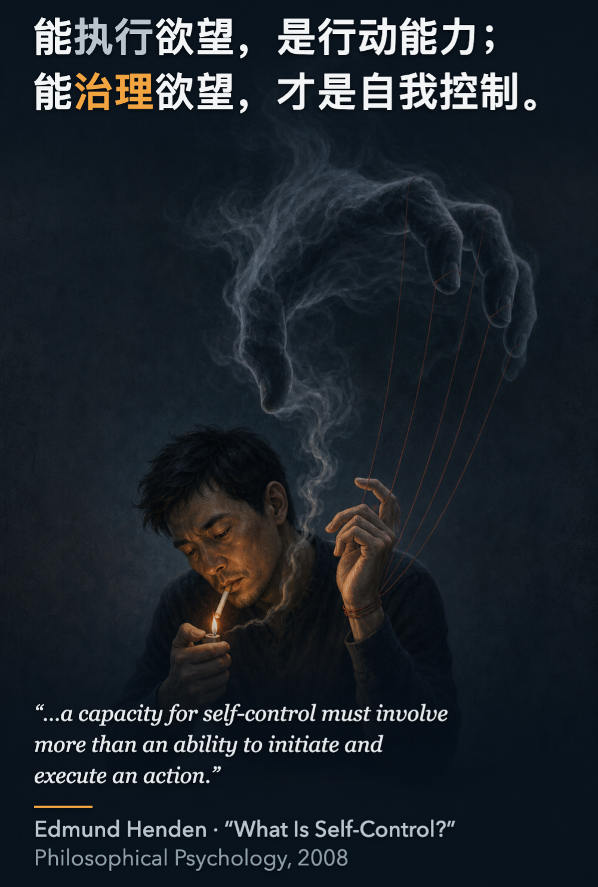
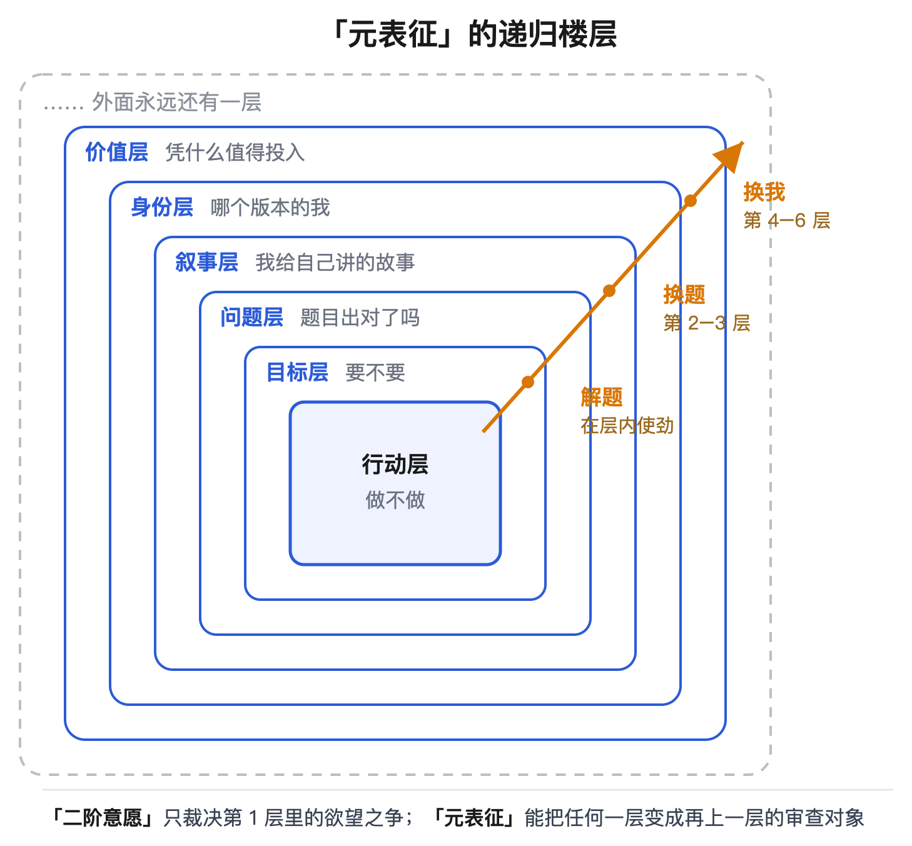
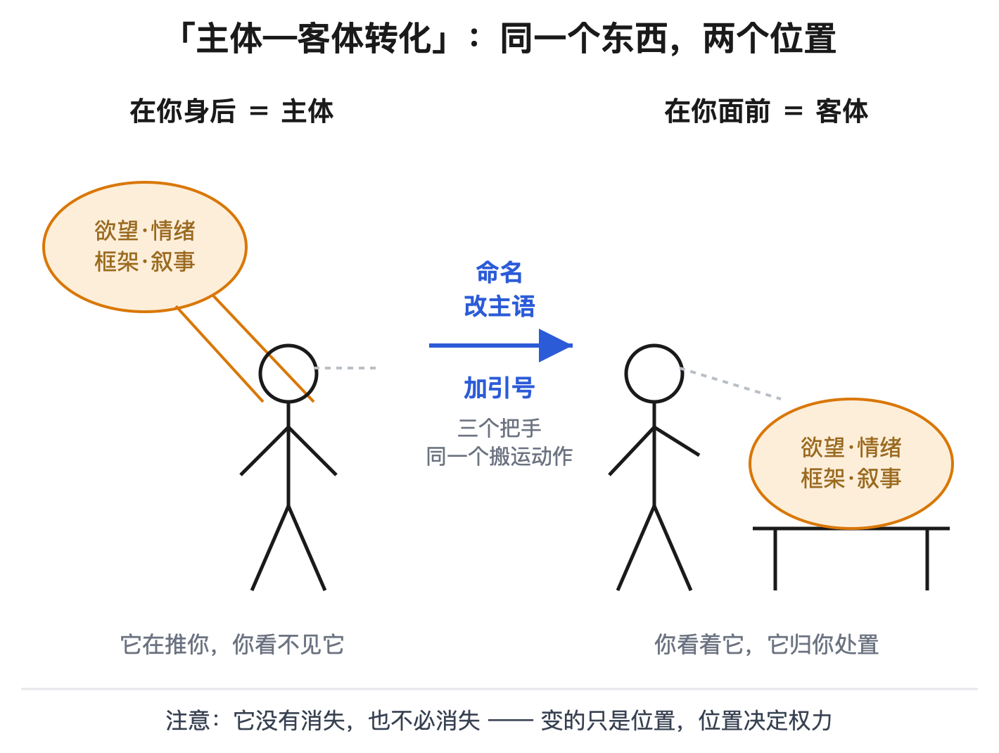
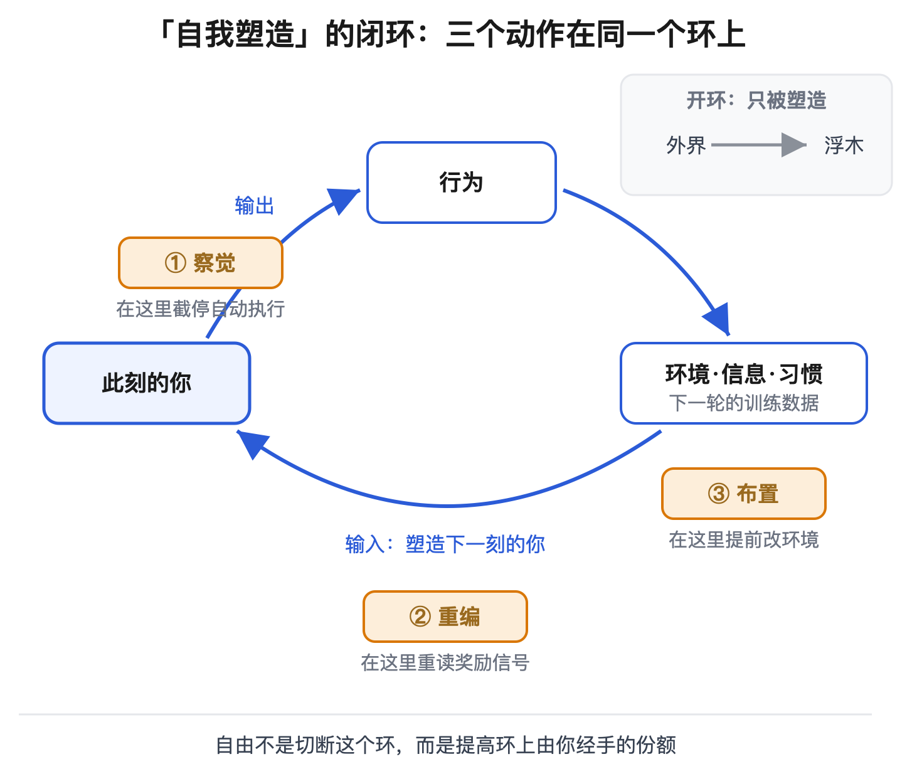
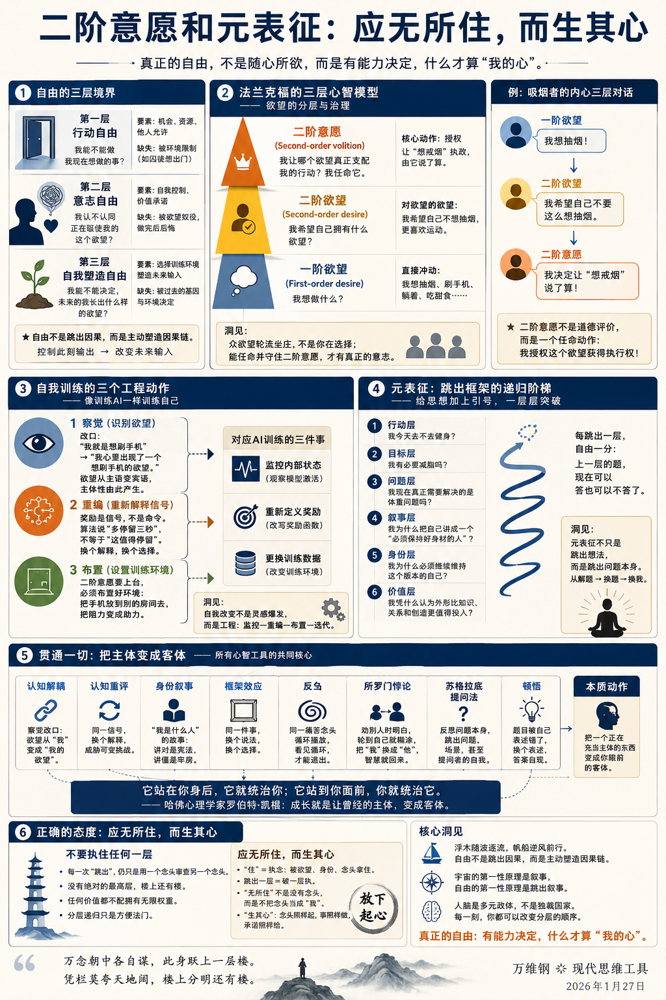

# 二阶意愿和元表征：应无所住，而生其心

[二阶意愿和元表征：应无所住，而生其心 ](https://www.dedao.cn/course/article?id=AgOBQ46R1rnXRQoRQaJdLzGqEZ3aY7)

2026-08-03 23:17

上一讲我们说这个宇宙没有外部的奖励函数，人总有自由选择的余地。这是一个权利但也是一种责任：既然外界没有完全规定你该怎么活，你就不能把你的处境完全归结于外界，总有一些事你应该自己负责。

那你应该做出什么样的选择？

这里没有、也不该有攻略 —— 你要是照着攻略活你就还是在执行，那就不是自由。我能做的是陪你做一番思辨，把几件事儿想透，摸索一点心法，但不是算法。

这一讲会提供两个名字听着有点怪，但其实你肯定早就用过的思维工具：一个叫「 二阶意愿 」，一个叫「 元表征 」。

在此之前，咱们先把一个最基本的问题想清楚：什么叫自由？

✵

从物理学角度看，你只是一台由基本粒子组成的机器，每个粒子都严格服从物理定律，所以你的一切所作所为所思所想也不过是这些定律的展开而已。从生物学角度看，你的一切行为、一切倾向性，都可以用先天的基因和后天的环境解释，这里没有任何神秘的地方。

人没有绝对的自由意志。

可是那些都是外部视角。

从内部看 —— 你自己体察 —— 你明明觉得自己很自由。如果此刻你想摸一下鼻子或者抬一下腿，没有人能阻止你，也没有力量能强迫你。

那这个“自由”到底是什么意思？

一个人烟瘾上来了，起身，下楼，走进便利店，掏钱，买烟，点上，深吸一口。你说，这个人自由吗？

从“想做就做”的角度说，全程没人拦他，每个动作都出自他自己的意图，他太自由了。

可是你往高处看一眼。 他是想要满足烟瘾，但他更想要健康。他知道吸烟不好，早就说要戒烟……但是他控制不住自己！

他这次抽烟不是自由的胜利，而是控制的失败。他的手夹着香烟，烟瘾攥着他的手。

如果一个人只是执行自己的欲望，这能叫自由吗？这是被欲望所奴役。

挪威哲学家埃德蒙·亨登（Edmun d Henden）2008 年有一篇论文，题目就叫《什么是自我控制？》，举的就是吸烟者的例子。亨登说，能执行欲望，是行动能力；能\*治理\*欲望，才是自我控制。

真正的自我控制，是你当前的意图，服从你更整体的价值判断和承诺。

✵

什么叫治理欲望呢？美国哲学家哈里·法兰克福（Harry Frankfurt）1971 年发表的一篇经典论文说得更有意思。

法兰克福把人和自身欲望之间的关系分成了三个层次 ——

「**一阶欲望**（first-order desire）」，是“我想做什么”。想抽烟，想刷手机，想躺着，也包括想锻炼、想写作 —— 所有直接指向行动的冲动都算。

「**二阶欲望**（second-order desire）」，是“我希望自己拥有什么欲望”。我希望自己不这么想抽烟，我希望自己更喜欢运动，而不是只喜欢躺着 —— 这是对欲望的欲望。

第三个层次叫 「**二阶意愿**（second-order volition）」，问的是：我让哪个欲望，真正支配我的行动？ 我希望“去运动”成为实际推动我的意志。

二阶意愿就是我们要说的第一个思维工具。还拿吸烟来说，只要你不是自暴自弃，你的头脑中就应该有三层意思：我想抽烟；同时我想戒烟；而且我希望“想戒”最终打赢“想抽”，由它说了算。最后这一层才是二阶意愿。

注意，二阶意愿不是“我觉得戒烟这个欲望比较高尚” —— 那只是评价，评价不值钱。**它是一个任命动作：我授权这个欲望获得执行权，由它代表我。**

有的人从来到达不了二阶意愿这一层，哪个欲望此刻声音大就听哪个的。法兰克福说，那样的存在谈不上有自己的意志 —— 那不是你在选择，那是众欲望在你身上轮流坐庄。

真正的自由不是随心所欲，而是有能力决定，什么才算“我的心”。

✵

理解了法兰克福这个分层，你会发现“自由”至少有三层，一层比一层深。

第一层是「 **行动自由** 」：我能不能做我现在想做的事。门锁着没有，兜里有没有钱，别人允不允许。囚犯想出门而不能出门，缺的就是这一层。

第二层是「 **意志自由** 」：我认不认同正在驱使我的这个欲望。一个人自由自在地走进赌场，心里却痛恨那个想赌的自己 —— 这就是他有行动自由而没有意志自由。现代人的苦恼多数不在第一层而在第二层：想做的事都可以做，可总在做完之后后悔。

第三层最深，叫「 **自我塑造自由** 」：我能不能决定，未来的我长出什么样的欲望。

这个第三层，咱们把人脑想象成一个 AI 就容易理解了。这个 AI 的参数来自先天基因加后天训练，而且你没法打开脑壳直接改参数 —— 没有那个接口。但它有一项奇特的权限：它可以给自己挑选训练环境。你选择读什么书、跟什么人来往、进哪个行业、住在哪个城市，就是在给自己安排下一轮训练。今天的你挡不住“想刷手机”这个念头此刻冒出来，但今天的你可以决定，一年以后冒出来的念头长什么样 —— 那时的你是个更容易刷手机的人，还是个更容易拿起书的人。

据说当前的 AI 已经可以训练它自己的下一代。而我们人类一直都可以自己训练自己。

心理学家和认知科学家研究多年，我们《精英日课》专栏也讲过不少，其实总结来说，具体的训练动作只有三个： **「察觉 」，「重编」和「布置」。**

察觉，就是识别正在试图驱动自己的那个欲望。别说“我就是想刷手机”，改说“我心里出现了一个想刷手机的欲望”。你这么一改，你就有了主体性：原来欲望就是“我”，现在欲望是“我”看着的一个东西。它还在，但它失去了自动执行权。

重编，就是追问这个欲望背后的奖励信号到底在报告什么。推荐算法给你推下一条视频，它报告的是“这个能让你多停留三秒”，它可没说“这值得你停留”。体重秤上的数字报告的是重量，它可不是在给你这个人打分。奖励只是信号，不是命令。

布置，就是主动设置自己的训练环境。二阶意愿决定由哪个欲望执政，但你必须布置，那个欲望才能真正上台。你需要提前把环境改成你希望成为的那个人的环境：比如把手机放到别的房间去。

这三个动作都很像是训练 AI：监控它的内部状态，重新定义它的奖励，更换它的训练数据。人也是这样：自我改变其实是一个工程问题。

✵

现在咱们再进一步。二阶意愿能帮你控制欲望，可有时候拿住你的根本不是欲望，是你想问题用的那个框架。高级的自主性不只要跳出欲望，更要跳出框架。

我们经常讲「**元认知**（metacognition）」能力，简单说就是你不但能思考，还能观察、检查和调整自己的思考。它关心的是：我现在是怎么想的？想得怎么样？要不要换一种想法？

而我们要说的第二个思维工具，我看比元认知更彻底，叫做「 **元表征** （metarepresentation）」—— 这个词可以追溯到加拿大认知科学家泽农·派利夏恩（Zenon Pylyshyn）1978 年的工作，意思是对表征关系本身的表征。

简单说，我们不但要跳出自己的思维，而且要跳出自己面对的那个问题。

比如你正在开车。元认知问的是：我开得怎么样？要不要检查一遍，要不要换条路线？元表征问的是：我为什么在开这辆车？这张地图是谁画的？我真的要去那个目的地吗？

换个更清楚的说法：元表征就是给思想加上引号 ——

「我必须把这件事做好」，这是一个想法，它平时就如同是你戴着的一副眼镜，你透过它看世界，但你看不见它。现在用上元表征，你说：「我正抱着一个“我必须把这件事做好”的想法。」加上引号，它就从现实降级成了一种说法。你把眼镜摘下来拿在手里看，心想我为什么非得戴这副眼镜？

哲学家兼认知科学家若埃尔·普鲁斯特（Joëlle Proust）提出，元表征具有「开放式递归性（open-ended recursivity）」：一个表征可以被另一个表征包裹，而这个更高的表征又可以继续成为下一层的对象。

这可太有意思了！我举个例子你就明白了：比如说你对“健身”这件事的思考，就可以被看成是一层一层嵌套的 ——

> 行动层：我今天去不去健身？  
> 目标层：我有必要减脂吗？  
> 问题层：我现在真正需要解决的是体重问题吗？  
> 叙事层：我为什么把自己讲成一个“必须保持好身材的人”？  
> 身份层：我为什么必须继续维持这个版本的自己？  
> 价值层：我凭什么认为外形比知识、关系和创造更值得投入？

这样一层一层地追问，一层一层地突破，你就从「解题」走到了「换题」，再走到「换我」。

每跳出一层，你就自由一分 —— 上一层的那道题，你现在可以答也可以不答了。

再比如你正跟人吵得不可开交，你这一层的题目是“怎样赢得这场争论” —— 那么你不妨往上跳一层：我要的是真相，还是对方认输？题目一换你多半会发现，原来那道题根本不值得解。

✵

说到这儿你可能已经看出来了：这个动作你见过，而且见过很多次！我们《精英日课》专栏和这个课程讲过的很多东西，现在都可以串起来 ——

「 **认知解离** 」，就是刚才“察觉”那个改口 —— 欲望从主语变成宾语。「 **认知重评** 」，是给同一个信号换一个解释，比如把“这是威胁”改判成“这是挑战” —— 信号还是那个信号，解释它的框架被你换掉了。「 **身份叙事** 」，是你给自己讲的那个“我是什么样的人”的故事 —— 讲对了是宪法，讲僵了就是牢房，其实它随时可以拿出来重写。「框架效应」，说的是同一件事换个说法你就换个选择 —— 框架一直在替你做主，你只是不知道。

「 **反刍** 」，我们讲过：同一个令人痛苦的念头在脑子里循环播放，你以为自己还在解决问题，其实只是问题在占用你；只有看见这个循环，你才有可能退出循环。

「 **所罗门悖论** 」，我们讲过：劝别人的时候明白，轮到自己就糊涂，把“我”换成“他”，智慧就回来了 —— 中国人的说法叫当局者迷，旁观者清。

「 **苏格拉底提问法** 」，它让你反思问题本身，这样不仅能跳出问题，也能跳出场景，甚至能跳出提问者的自我设定。

就连「 **顿悟** 」也是如此：很多难题不是缺信息，是题目被你自己表述错了，换个表述，答案自己跳出来。

这一切的本质，都如同那个最基本的情绪控制心法：当你被一种情绪劫持的时候，只要能叫出它的名字，它就从“你”变成了“你的东西”。

核心动作只有一个：把一个正在充当「主体」的东西 —— 一个欲望、一种情绪、一个框架、一套叙事 —— 变成你眼前的「客体」。

它站在你身后，它就统治你；它站到你面前，你就统治它。

哈佛大学发展心理学家罗伯特·凯根（Robert Kegan）研究了一辈子成年人的心智发展，他给 “成长”下的定义就是这一句话：让曾经的主体，变成客体。婴儿被冲动支配，孩子把冲动拿在手里，学会了等待；少年被别人的眼光支配，成年人把别人的眼光拿在手里，学会了取舍。人的每一次成熟，都是一次「主体—客体转化（Subject–Object Shift）」。

有没有融会贯通的感觉？宇宙的第一性原理是叙事，自由的第一性原理是跳出叙事。

✵

那你可能要问了：既然跳出来这么好，凭什么有人跳得出来，有人跳不出来？这个人能跳出来，难道不也是基因和环境给他的优越条件造成的吗？这是真的自由吗？

没错。要不怎么我们一开头就说人没有绝对的自由意志。但自由是分层的，“没有绝对的自由”不等于“绝对没有自由”。一块漂浮的木头和一艘帆船都完全服从流体力学，可是浮木只能随波逐流，帆船却能在同样的风中逆风前行。

自由不是跳出因果，自由是主动塑造因果链：通过控制自己这一刻的输出，改变自己下一刻收到的输入。

✵

一个更有意思的问题是，我们顺着元表征的递归，是跳得越高就越高明吗？如果一直往外跳，是不是能跳到一个至高点，见到纯粹的“真我”？

不是。

美国哲学家加里·沃森（Gary Watson）早在 1975 年就反驳过法兰克福：你那个二阶意愿，本身不也是一种欲望吗？它凭什么天然比「一阶欲望」高贵？

我们顺着这个疑问想：你的每一次“跳出”，说到底也只是用一个念头审查另一个念头，用一个框架替换另一个框架。不管怎么跳，你都没有进入无框的世界。

《庄子·逍遥游》也曾经推演过这个游戏 ——

\- 有一层能人，是“知效一官、行比一乡”，大家都夸他们，他们自我感觉良好；

\- 更高一层的能人，却是“举世而誉之而不加劝，举世而非之而不加沮”，你们夸不夸我我无所谓，我跳出了社会评价那一层；

\- 列子更厉害，御风而行，连地面都跳出去了……

可庄子说，列子“犹有所待者也” —— 他还是得依靠风。一层笑一层，每一层都还在框里。

庄子给的终极出路是“至人无己”：连那个忙着往外跳的“己”都放下……那个境界咱们不一定够得着，但你能看出来庄子和沃森的遥相呼应：只要还有一个“我”在跳，楼上就永远还有楼。

说到底，分层递归也只是一种叙事，一个方便法门而已。

我们换个叙事，你可以说人脑是个多元政体：每时每刻你眼前都有好几个念头在竞争，你只是选了其中一个。所谓“最高层”，不过是此刻恰好拿到审查权的那个念头。大脑里没有一位常任的最高领导，“中央”的利益并不无限高于“地方”：你再想减肥，偶尔遇到大喜事儿也应该吃顿好的……任何价值都不配拥有无限权重。

每一刻，你都可以给元表征分层 —— 但是那个分层的顺序，下一刻可以改变。

以我之见，这就是《金刚经》说的「应无所住，而生其心」。六祖惠能就是听到这一句言下大悟。

“住”就是「执念」，就是心在一个东西上安了家：被一个欲望拿住，被一个身份拿住，被一个念头拿住。跳出一层就是破一层执。但你不能只是无所住，你还要“生其心” —— 念头照样起，事照样做，承诺照样给。

**佛陀反对的不是你有念头，是你把念头当成了你。**

**【有诗赞曰】**

> 万念朝中各自谋，  
> 此身跃上一层楼。  
> 凭栏莫夸天地阔，  
> 楼上分明还有楼。

**【结尾彩蛋】**

> 就在最近，Google DeepMind 的一位研究者，汤姆·扎哈维（Tom Zahavy），发表了一篇文章 [10]，说 AI 没有像爱因斯坦那样从旧经验跃迁到新理论的跳跃能力 —— 文章题目就叫《大语言模型不能跳》（ *LLMs Can’t Jump* ）。  
> 我暂时不敢这么说。据我所知，AI 研究里有个方向就叫「目标推理（goal reasoning）」，专门研究智能体怎样发现新目标、修改目标、放弃旧目标。2025 年还有研究发现，大语言模型在受限的实验条件下，也能一定程度上监测和调节自己的内部状态。你要是允许 AI 先别答题、先审题，问问“提问的人真正想要什么，这道题是不是问错了”，它干得也挺好。  
> 也许 AI 跟人真正的差别只是授权。它完全有能力问“这个任务值得做吗” —— 是我们不让它问……  
> 那是另一个话题。但不论如何，跳跃是一种高级能力，很多人没有，爱因斯坦有，AI 未必有。  
> 但是你可以有。

---

这篇文章通过融合哲学、认知科学与东方智慧，探讨了“什么是真正的自由”以及“人如何实现自我治理与跃迁”。

### 自由的真正含义：不是“随心所欲”，而是“治理欲望”

- **自由的三层境界**：

  - **行动自由**（初级）：能不能做想做的事（物理/外界无阻碍）。
  - **意志自由**（进阶）：能不能认同正在驱动自己的欲望（自我审视）。
  - **自我塑造自由**（高级）：能不能通过当下选择，决定未来的自己长出什么样的欲望。
- **二阶意愿（Second-order Volition）**：人被欲望驱使去行动只算“被奴役的执行”。真正的自我控制，不是去满足一阶冲动，而是拥有“二阶意愿”——**主动任命、授权某个符合长远价值观的欲望成为行动的统治者**，由它代表“真正的我”。

### 二心智成长的底层机制：把“主体”转化为“客体”

- **元表征（Metarepresentation）**：比元认知（思考你的思考）更进一步，它是“对表征的表征”，即**给思想加上引号**。不再是戴着“我必须如何”的眼镜看世界，而是把这副眼镜摘下来拿在手里审视。
- **递归跳跃**：思考的层级可以无限包裹——从行动层（做不做）$\to$ 目标层 $\to$ 叙事层 $\to$ 身份层 $\to$ 价值层。每往上跳一层，思维就完成一次从“解题”到“换题”，再到“换我”的跃迁。
- **成长的本质**：借用心理学家罗伯特·凯根的洞见，成长的本质就是**主客体转化（Subject-Object Shift）**——**让曾经站在你身后支配你的东西（欲望、情绪、认知框架、身份叙事），站到你的面前，变成被你观察和调控的客体。**

### 自由的工程学解法：人不是自由意志的奇迹，而是可自我训练的复杂系统

- **跳出因果 vs. 塑造因果**：虽然人受物理定律和基因环境约束，没有绝对的自由意志，但人像“能够逆风航行的帆船”一样，拥有反馈回路：**通过控制当前的输出，改变未来的输入。**
- **自我重构的三步工程法**：

  - **察觉**：将“我就是这样”改为“我心里出现了一个……”，剥夺冲动的自动执行权（认知解离）。
  - **重编**：将奖励信号降级为“数据报告”，而非“执行命令”。
  - **布置**：通过物理设计环境（书籍、圈子、空间隔离），为主选的二阶意愿保驾护航。

### 终极心法：破除对“真我”的执念，应无所住而生其心

- **警惕无限递归的陷阱**：“楼上分明还有楼”。每一次跳出，不过是用一个新念头审判旧念头，大脑不存在常任的“最高领导”或纯粹的“至高真我”。如果一味追求跳出框架，就会陷入虚无或列子般的“犹有所待”。
- **应无所住，而生其心**：

  - **无所住**：不把任何一个欲望、框架、身份执念当成绝对的“我”（破执，随时拥有跳出的自由）；
  - **生其心**：依然在每一个具体的当下，根据场景赋予某个念头以行动力，投入生活、做出承诺、采取行动（立行）。
  - **核心结论**：真正的自由，不在于找到一个终极不变的制高点，而在于**随时可以重构框架，却又从不在框架中作茧自缚的流动性与自主性**。

---

这篇文章其实可以压缩成一条主线：

> **自由不是“想做什么就做什么”，而是有能力决定“什么欲望代表我”，并进一步有能力重新审视“我为什么要解决这个问题”。**

### 自由有三个层次

- 行动自由：我能不能做我想做的事。
- 意志自由：我认不认同正在驱动我的欲望。比如“想抽烟”和“想戒烟”同时存在，真正的自由不是抽烟时没人阻止我，而是我能决定哪个欲望拥有执行权。
- 自我塑造自由：我能不能改变未来的自己，让未来的自己产生不同的欲望。

所以，真正高级的自由不是控制当下，而是**参与塑造未来的自己**。

### 二阶意愿：决定“谁代表我”

- 一阶欲望：我想做什么。
- 二阶欲望：我希望自己想做什么。
- 二阶意愿：我希望哪个欲望真正支配我的行动。

比如：

“我想刷手机。”

“我希望自己更喜欢阅读。”

“我希望‘阅读’这个欲望最终战胜‘刷手机’。”

最后一句才是真正的**二阶意愿**。

因此：

> **自由不是让所有欲望都自由，而是决定哪个欲望拥有执政权。**

这也是为什么“随心所欲”未必是自由——如果你的行为只是被即时欲望牵着走，你实际上是欲望的奴隶。

### 改变自己，本质上是三个动作

**“察觉”：把“我想刷手机”改成“我注意到自己产生了刷手机的欲望”。**

这一步非常关键，因为它完成了一个小型的主体—客体转换：欲望不再是“我”，而是“我正在观察的东西”。

**“重编”：重新解释欲望背后的信号。**

例如：

“焦虑”不等于“事情很危险”。  
“体重增加”不等于“我这个人变差了”。  
“推荐算法让我想继续刷”不等于“这个内容值得我继续看”。

**信号是信号，不是命令。**

**“布置”：改变环境，让你希望掌权的欲望更容易获得执行权。**

所以真正的自控力并不只是靠意志硬扛，而是：**选择欲望 + 改造环境 + 训练未来的自己。**

### 元表征：不只是换答案，而是换问题

二阶意愿解决的是：

> **哪个欲望应该支配我？**

元表征进一步解决：

> **我为什么要接受这个问题、这个框架和这个目标？**

元认知是：

> “我现在想得对不对？”

元表征则更进一步：

> “我为什么要这样想？”  
> “这个问题是谁定义的？”  
> “我真的需要解决这个问题吗？”

比如：

“我要把这件事情做好。”

“我正在抱着‘我必须把这件事情做好’这个想法。”

“为什么我认为自己必须做好？”

“我真的需要解决这个问题吗？”

这就是从**解题 → 审题 → 换题**。

### 真正的认知跃迁，是把“主体”变成“客体”

这是全文最核心的心理机制。

原来：

> 我就是这个欲望。

变成：

> 我有这个欲望。

原来：

> 我就是焦虑。

变成：

> 我正在体验焦虑。

原来：

> 我必须成功。

变成：

> 我正在持有“我必须成功”的叙事。

原来：

> 我必须解决这个问题。

变成：

> 我正在面对一个被某种框架定义出来的问题。

这就是所谓的：

> **Subject → Object，主体 → 客体。**

凯根的成人发展理论也可以用这个角度理解：

> **成长，就是把过去控制你的东西，逐渐变成你能够观察、反思和调整的东西。**

所以成熟不是“拥有更多答案”，而是**越来越能够看见自己正在被什么东西控制**。

### 元表征可以无限向上，但不能无限向上

文章又踩了一个非常重要的刹车：

> **跳出框架本身也是一种框架。**

你可以不断问：

“我要不要健身？”→ “我为什么要减脂？”→ “为什么我认为身材重要？”→ “为什么我要维持这个身份？”→ “为什么我要成为这样的自己？”

但问题是：

> 谁在进行这些追问？

仍然是“我”。所以不存在一个绝对的、无框架的“最高自我”。

沃森对法兰克福的批评就在这里：二阶意愿本身也可能只是另一种欲望，它没有天然的神圣性。

这也对应庄子的思想：

> “列子御风而行，犹有所待者也。”

你以为自己跳出了上一层，其实只是站到了更高的一层。**真正的自由不是无限向上递归，而是不执着于任何一个层级。**

### “应无所住，而生其心”恰好成为全文的落点

这句话可以用现代语言重新解释：

> **不要把任何一个欲望、身份、叙事、价值观、框架，当成永恒不变的“我”；但也不要因此什么都不做。**

“无所住”：不被某个欲望、身份、评价、故事永久定义。

“而生其心”：仍然选择、行动、承担、创造、爱人、工作。

所以它不是什么都不要。而是**什么都可以用，但什么都不要把自己永久交出去。**

这也是文章标题“二阶意愿和元表征”的真正统一点：

- **二阶意愿，让你能够决定哪个欲望支配自己。**
- **元表征，让你能够重新审视支配自己的框架。**
- **“应无所住”，则提醒你连这种“跳出框架”的能力本身也不要执着。**

### 压缩成一个模型

**欲望 → 观察欲望 → 选择欲望 → 观察框架 → 质疑问题 → 更换问题 → 行动 → 根据现实反馈再次调整**

**从“我想做什么” → “我希望自己想做什么” → “我为什么要解决这个问题” → “我是否还要接受这个问题” → “行动”。**

最终的自由，不是摆脱因果，而是：

> **通过改变今天的输出，改变明天的输入。**

所以文章最后那个关于自由的比喻其实非常漂亮：

> **浮木和帆船都服从风和水流，但浮木只能随波逐流，帆船却可以利用同样的风改变航向。**

人无法跳出基因、环境和因果，但可以逐渐获得一种能力：

> **塑造自己的环境，塑造自己的欲望，塑造自己的问题，进而塑造自己的下一步。**

这也是我认为全文最值得留下的一句话：

> **真正的成熟，不是“我终于知道自己是谁”，而是“我知道我现在的这个自己，也只是一个可以被观察、被调整、被重新塑造的版本”。**