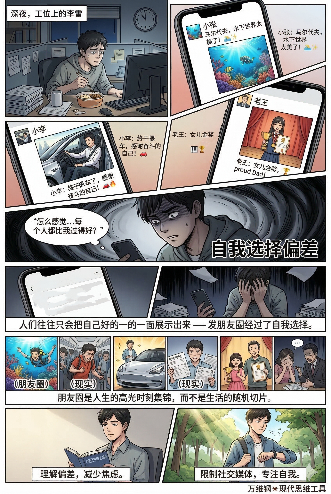
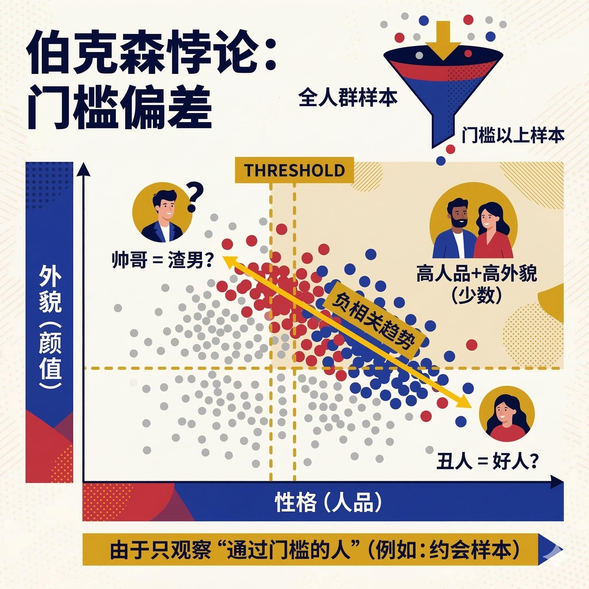

# 选择偏差：就算无人说谎，你看到的也不是真实世界（得到课程讲稿 + AI 加工段）

# 选择偏差：就算无人说谎，你看到的也不是真实世界

[选择偏差：就算无人说谎，你看到的也不是真实世界](https://www.dedao.cn/course/article?id=qzNakylrn9WVaZWMxGJ7DOop10vZwL)

如果你年纪稍长还经常上网，会不会有一种社会文化“今不如昔”的感慨。

现在网上充斥着博眼球的烂梗和家长里短的市侩哲学，一开口就是牛马、彩礼、出轨，连主流媒体都不会说正经中文了。偶尔把以前拍的《红楼梦》《三国演义》电视剧翻出来看看，你难免会觉得这届观众不行，中国人的文化素质在严重下降。

再看线下，很多人怀念上世纪八十、九十年代的好时光。那时候如果你是个国企职工，工作不但一点都不累，还有丰富的业余文化生活，有充分的安全感。那时候的大学生毕业就能随便找到好工作，而且素质也是真高……

可我要说的是，就算你真的经历过以前那些好日子，你这场乡愁也是幻觉。

八十年代初中国人口城镇化率只有 20%，到 1990 年高等教育毛入学率才 3%……而今天，城镇化率已经达到 67%，大学入学率超过 60%。你记忆中那些快乐的工人和自豪的大学生，在以前是极少数人 —— 绝大多数中国人居住在农村，极度贫困，他们不是文化消费者更不是叙事主体，他们连抱怨都很难被你听见。

今天的社会文化之所以俗气，是因为这些原本沉默的人上网了：他们成了收视的主体和广告的目标，是他们在决定文化的走向。

中国文化不是降级了，而是扩容了。

今天那些住在前 20% 的好地区、学历高居前 3% 的精英，可能日子过得也不错、品位甚至比过去更高级，但他们的文化存在感被淹没了：不值得专门为这么点人拍电视剧。

人们怀念的，并不是过去中国的\*平均值\*，而是那个被强烈过滤过的中国。你的印象不是由全体样本决定，而是由“上桌样本”决定：以前是少数城市精英样本冒充了中国总体，现在影响你的则是更普通的人，还有平台算法的推波助澜。

这个机制叫「 选择偏差 （selection bias）」。现实世界中有太多观念陷阱，你必须掌握这个工具，才可能做出准确的判断。选择偏差就是进入你视野的样本，并不等概率代表真实世界。

你以为你在观察整个大海，殊不知你只是在看渔网里捞上来的鱼 —— 而这张网的网眼大小、下网的位置，早就决定了你会看到什么。

又好比你站在急诊室门口看一整天，得出结论说“这座城市的人都在流血” —— 你看到的每一幕都是真的，没有人在故意对你说谎，但你的世界观是假的。我看过一个短视频，一位在亲子鉴定机构工作的女士说，她经历了这么多案例，认为男性才是弱势群体……她可能没意识到绝大多数夫妻没有来做亲子鉴定。

**学术界发现了十几种选择偏差，我把它们粗略分为四类。**

第一类叫「 自我选择偏差 （Self-selection Bias）」。就如同开一场 party，来参加的人，都是自己\*想要\*来参加的。

最典型的一个现象，我们不妨称之为「朋友圈悖论」：你感觉朋友圈上几乎每个人都过得比你好。小张在马尔代夫潜水，小李刚提了新车，老王的女儿拿了钢琴大赛一等奖，而你，却在吃着外卖填报表。

他们没有撒谎，但人们往往只会把自己\*好的一面\*展示出来 —— 发朋友圈这个动作经过了自我选择。那对刚因为房贷吵完架的夫妻，那个刚刚被老板痛骂的打工人，正如此刻的你，是不会发朋友圈的。

朋友圈是人生的高光时刻集锦，而不是生活的随机切片。可是如果有人不懂这个道理，非得拿自己的日常去对比别人的宣传海报，那就会陷入选择偏差，感觉失落。有研究发现，使用 Facebook 越频繁的人，越容易觉得别人更幸福、日子过得更好；而如果能把社交媒体使用限制到每天 30 分钟以下，人们就会显著减少孤独感和抑郁感。

另一个例子是网络评论。为什么很多电影、商品、餐馆的评价都呈现所谓「J 型分布」：绝对的主力在五星吹爆，次高峰在一星痛骂，中间的二、三、四星极少？因为只有当一个事物激发了你强烈情绪的时候，你才有动力去打开 APP、登录、写字、发表，“还行吧”那种温和体验没有发言动力。

更细致的研究认为评论背后有两层自我选择 —— 除了极端者发言的漏报偏差，还有一层是购买偏差，也就是愿意买的人本来就更可能偏正面……

平台为了让评论更有用绞尽了脑汁，有的搞默认好评、已购才能评、积分激励、评价提醒等等，但偏差是无法消除的。根本问题不是技术，而是动力：不是每个人都想说话，想说话的人也不是平均人。

还有，你打开国际新闻，感觉世界太乱了；你打开社会新闻，感觉人的素质江河日下；你觉得某些国家极其危险，某些地方的人都很坏……这些都是因为自我选择偏差：只有极其罕见、极其恶劣的事件，才值得上新闻；岁月静好可不会上热搜。

自我选择偏差会让人长期处在一种被极端样本包围的精神状态，容易陷入无谓的焦虑、抑郁和心态失衡。

须知社交媒体不是生活，评论区不是民意，热搜不是人间。

第二类叫「 **幸存者偏差** （Survivorship Bias）」。如果说自我选择偏差是“有兴趣的人才来”，幸存者偏差就是：没来的人不是因为没兴趣，而是因为根本来不了。

幸存者偏差可能是商业世界最致命的认知陷阱，因为它会帮你总结错误的成功经验。

如果你只看巨头的传记，你会认为要想成功就得有极度的激情，敢于冒险，就得打破常规甚至做个偏执狂，要对新机会“All in”，尤其是要在很年轻的时候创业：比尔·盖茨、乔布斯、扎克伯格、山姆·奥特曼都没读完大学……于是你得出结论，成功 = 辍学 + 孤注一掷。

可是你不知道同样年轻、同样孤注一掷而\*失败了\*的人有多少。那些人都赔光、失业、回老家了，他们没有进入你的视野。

如果把失败的数据也统计进来，你会发现大部分创业公司都在半路消失了；增长最快的公司的创始人平均年龄并不是二十多岁，而是 45 岁：他们成功不是因为他们叛逆，而恰恰是因为他们积累了行业经验。

你不能听说几个人靠买彩票发了大财，就把买彩票视为理想的发财手段。成功学往往是把幸存者的运气当成因果关系。

理财基金是另一个重灾区。你要买理财，基金公司的小姐姐打开一张图表，说你看我们的历史收益多漂亮。她很可能没有骗你。但是她不能证明这只基金的业绩好到底是因为公司能力强，还是因为在这一只上蒙对了运气 —— 因为她没给你看失败的数据。

现实是那些业绩糟糕、早就清盘、合并、死掉的基金，根本没机会站在你面前。金融学界早就研究过这个现象：如果只看基金样本的幸存者，公司真实业绩就一定会被系统性高估。

你看见的是冠军橱窗，却不知后院堆着一地尸体。

有人说某个偏方能治大病、某种健身法或者饮食疗法神奇，其实只不过是感受到好转的人更愿意出来讲故事，没效果的人早就离场了。

有人看见现在坐办公室的白领动不动就抑郁、亚健康，反倒是工厂里的蓝领工人一个个都特别壮实扛造，就说体力劳动有利于身体和精神健康 —— 其实真相是那些不健康的人根本承受不住工厂的重体力劳动，早就被淘汰了。流行病学对此甚至专门有个名词，叫「健康工人幸存效应（Healthy Worker Survivor Effect）」。

还有，怀旧，也有很大的成分是幸存者偏差。要知道人的记忆有个特点：从长期来看，我们记住的往往是一些高光时刻，我们会忘记困惑和麻烦。

有人怀念以前的文艺作品，有人怀念以前的社区关系，有人怀念以前的政治局面。可是如果你能到现场考察一番，会发现以前的人也有跟我们一样的担心 —— 他们在怀念更早的以前。以前你很年轻，而年轻总是伴随各种美好的回忆；以前的你的麻烦都解决了，所以你不再认为它们是麻烦，而现在的麻烦还没解决。

不是时代退步了，而是时间替过去做过一轮筛选。

第三类叫「 分组选拔偏差 （Selection / Sorting Bias）」。问题出在事物一开始的分配环节：它根本就不是随机分组的。

这里有个最反常识、也最刺痛中产阶级神经的例子，名校效应。

你砸锅卖铁也要买学区房，牺牲所有的空闲时间领孩子去参加这个活动那个活动，只为能上重点中学和好大学，最好是常春藤名校。你相信名校代表最好的教育，能把孩子培养成高级人才……但这是一个极度忽视科学检验的幻觉。

孩子们并不是被闭着眼睛随机分配到各个学校的，他们是经过了严苛的选拔才进去的。那些被选中的本来就是又聪明又努力、家庭条件又好的孩子，他们本来就更有可能是人才 —— 那么名校到底是培养了他们，还是沾了他们的光呢？

美国经济学家斯泰西·戴尔（Stacy Dale）和艾伦·克鲁格（Alan Krueger）做过一系列研究。他们不是简单比较“名校生”和“普通校生”的收入，而是专门看那些水平差不多、都有能力去名校，但是有的去了、有的因为种种原因没去，而选择了普通学校的学生。结果发现，名校并没有让毕业生获得明显更高的收入 —— 尤其是如果你看长期收益，名校效应就缩水到接近于零。

戴尔和克鲁格的研究认为，只有对出生于弱势家庭 —— 比如是少数族裔，父母受教育程度很低 —— 的学生，名校这块牌子才有明显的帮助。可能是因为他们更需要学校这个社交平台。

简单说，名校更像筛选器，而不是炼丹炉。

同样道理，你不能看有些孩子补课提高成绩，就认为补课能提高成绩；也不能看有些孩子从小参加各种课外活动、长大后成了成功人士，就认为那些素质教育有利于成功。那也许只不过是因为爱学习的孩子才爱补课，富裕的家庭才有条件让孩子去学击剑和马术，他们的成功只是个人能力和家庭能力的外溢。

第四类叫「 门槛偏差 （Threshold Bias）」，也叫「 伯克森悖论 （Berkson's Paradox）」。这里的问题是你看到的都是跨过某个门槛之后的样本。

有一些民间智慧说：

\- 长得帅的男人都是渣男。

\- 美女通常脾气差。

\- 业务能力强的人情商低。

\- 体育好的学生文化课差，文化课好的学生体育差。

难道说老天爷讲公平，给人一个优点就必定再给他一个缺点吗？其实这些统统都是错觉。

两个原本可能完全不相关的变量，如果你非得把它们加在一起，设定一个总的门槛，然后只看那些越过门槛的样本，你就会发现这两个变量显得负相关。

就拿婚恋市场来说，我们假设女生最看重的两项男生价值一个是长得帅，一个是人品好，能两者兼具就更好，但决不能又丑又渣。你默默地设定，男性的综合吸引力 = 颜值 + 人品，给每人都计算了一个总分。

一个男生哪怕想要成为你的备胎，他的总分也得越过一个门槛。那你可以想见，门槛里边的人两项都是高分的肯定是少数，大多数人必定是一项分高，一项分低 —— 于是你发现颜值和人品是互斥的。

其实这一切只不过是因为那些又帅又专一的男生本来就少，而且早被人抢走了，而又丑又渣的男生根本就没有成为你的样本。

同样道理，为什么业务能力强的人情商低？因为公司招的都是“业务 + 情商”超过一定门槛的人。两项都强的是极少数，两项都弱的进不来，剩下你容易看见的，就必定是一项强、一项弱的那些。

相亲不是人口普查，招聘不是社会抽样，门槛会制造对立，筛子会伪造规律。

选择偏差是因为样本有问题。但有时候就算样本没问题，你的眼睛还可能出问题。你可能只注意极端的案例而对那些平凡的事物视而不见；你可能只愿意看见支持自己观点的证据 —— 这些现象被称作「可得性偏误（Availability Bias）」和「确认偏误（Confirmation Bias）」，我们这里不必细说。

想要在真实世界中获得一点真知，那是非常困难的。

科学家为了对付选择偏差费劲了力气。最理想的办法是把人随机分组做实验。但如果你不能做实验，只能被动统计现成的结果，你就必须得确保样本是干净的 —— 其中最重要的就是去追踪那些没有出现的人。他们可能是因为失败而退出了游戏，但他们的参与仍然很有意义：他们可以贡献知识。

我们听说任何故事，总可以先问四句话：谁没来？谁来不了？分组是随机的吗？这里有没有门槛？

如果你听说了很多坏消息，请提醒自己真实世界可能比你想的要好一点。对于老百姓的日常经验，也请提醒自己，人有多么容易陷入偏差。

正所谓：

灯下看人皆匆忙，

瀑前观水势奔狂。

若问世间真面目，

先寻沉默与退场。

---

## 选择偏差：世界不是假的，但你看到的世界可能是“被筛过”的

这篇文章最深刻的地方，不在于介绍了一个统计学概念，而在于它揭示了：

> 人类的大多数世界观，并不是建立在“真实样本”上，而是建立在“进入视野的样本”上。

而“谁能进入你的视野”，往往早已被：

- 平台算法
- 社会结构
- 情绪机制
- 生存淘汰
- 文化门槛
- 传播动力

提前决定了。

所以很多时候：

不是别人骗了你，

而是你的观察窗口本身就是歪的。

---

### 人最容易犯的错误：把“可见”当“普遍”

这是选择偏差最核心的一句话：

> 能被你看到的，从来都不是随机样本。

互联网时代尤其如此。

因为互联网不是现实世界的镜子，而是一个：

- 高情绪浓度
- 高极端浓度
- 高冲突浓度
- 高猎奇浓度

的信息筛选器。

于是你会产生很多错觉：

- 热搜天天骂战 → 觉得社会撕裂
- 评论区全是戾气 → 觉得人性恶劣
- 社交媒体人人成功 → 觉得自己失败
- 新闻里全是犯罪 → 觉得世界危险
- 网上全是男女对立 → 觉得亲密关系已经崩坏

但真实世界里，大部分人其实：

- 没那么成功
- 没那么坏
- 没那么极端
- 没那么戏剧化

只是：正常生活没有传播性。

---

### 今天的互联网，不是在“反映现实”，而是在“放大极端”

这一点尤其重要。

因为平台算法天然偏爱：

- 强情绪
- 强冲突
- 强立场
- 强刺激

原因很简单：

平静不会让人停留，

愤怒会。

于是慢慢地：

> 你看到的世界，开始越来越不像世界本身，  
> 而像“最容易传播的那部分世界”。

这也是为什么：

很多长期沉浸社交媒体的人，会越来越焦虑、愤怒、悲观。

因为他的大脑每天都在接触：

“经过情绪筛选后的现实”。

就像：

天天站在急诊室门口，

自然会觉得整个城市都在流血。

---

### 怀旧，本质上也是一种选择偏差

这是全文最锋利的一部分。

很多人怀念过去：

- 八九十年代的人文气质
- 过去的电视剧
- 过去的大学生
- 过去的工人阶级
- 过去的邻里关系

但问题在于：

你怀念的“过去”，其实是：

> 被历史过滤后的过去。

因为：

真正能留下来的东西，本来就是少数精品。

你今天回头看：

- 看到的是《红楼梦》
- 看不到当年的大量粗制滥造
- 看到的是经典歌曲
- 看不到大量早已消失的口水歌
- 看到的是优秀知识分子
- 看不到沉默的大多数

时间本身，就是一个巨大的幸存者筛选器。

所以人会产生一种幻觉：

> 过去好像全是精品，  
> 现在怎么全是垃圾。

其实不是现在变差了。

而是：

你正在拿“今天的平均值”，去比较“过去幸存下来的顶级样本”。

这是极不公平的。

---

### 幸存者偏差：成功学最大的骗局

这部分几乎可以解释整个现代商业鸡汤。

因为成功者天然更容易被看见。

失败者：

- 不会上采访
- 不会出传记
- 不会上节目
- 不会被传播

于是你看到：

- 辍学创业的亿万富翁
- 孤注一掷成功的人
- All in 改变命运的人

你很容易得出：

> 成功 = 冒险 + 偏执 + 梭哈。

但你没看到的是：

还有无数同样：

- 偏执
- 冒险
- All in

的人已经失败退场。

真正完整的数据一旦加入：

很多传奇立刻会“均值回归”。

所以：

> 成功故事最危险的地方，不是它是假的，而是它只讲了活下来的人。

---

### 名校、精英、成功人士，很多时候更像“筛选器”

这是最反直觉的一点。

很多人天然认为：

名校培养人才。

但很多研究发现：

名校更大的作用可能是：

> 把原本就优秀的人筛选出来。

因为：

- 家庭资源
- 智力
- 自律
- 教育投入
- 环境支持

本来就不是随机分布。

所以：

你看到“名校生成功”，

不等于“名校制造成功”。

同样：

- 补课有效
- 素质教育有效
- 精英教育有效

很多时候都可能只是：

优秀家庭的“外溢结果”。

这也是现代社会一个很大的认知陷阱：

> 人们特别容易把“相关性”误认为“因果性”。

---

### 门槛偏差：为什么你总感觉“优秀的人都有缺点”

因为现实里很多“负相关”，是人为筛选制造出来的。

比如：

你觉得：

- 帅哥容易渣
- 美女脾气差
- 学霸体育差
- 能力强的人情商低

其实不是因为：

“上天公平”。

而是因为：

你只在观察“跨过门槛的人”。

举个最简单的例子：

公司招聘：

- 能力 + 情商 > 及格线

那么：

- 能力和情商都低的人进不来
- 两者都极高的人极少
- 最常见的，就是“一强一弱”

于是你就误以为：

能力强的人都情商差。

实际上：

这是筛选机制制造出来的错觉。

---

### 一个成熟的人，要学会“寻找沉默样本”

文章最后那四个问题，非常有力量：

- 谁没来？
- 谁来不了？
- 分组是随机的吗？
- 有没有门槛？

这几乎可以作为现代社会的信息免疫系统。

因为真正的认知升级，不是知道更多故事。

而是：

> 开始意识到，自己没看到什么。

很多时候：

- 沉默者比发言者更重要
- 失败者比成功者更重要
- 退出者比幸存者更重要

因为他们决定了：

真实分布到底长什么样。

---

### 真正的世界，通常比互联网更平静

最后可以把全文浓缩成一句话：

> 互联网让极端变得可见，而选择偏差让你误以为极端就是世界本身。

所以一个人越成熟，越会主动做几件事：

- 少刷情绪化信息
- 少把评论区当民意
- 少把热搜当现实
- 少拿别人高光对比自己日常
- 少从成功者倒推成功公式

并且不断提醒自己：

> 看见，不等于普遍；  
> 传播，不等于真实；  
> 幸存，不等于规律。

真正的现实，永远比舆论安静，比算法温和，比热搜正常。
