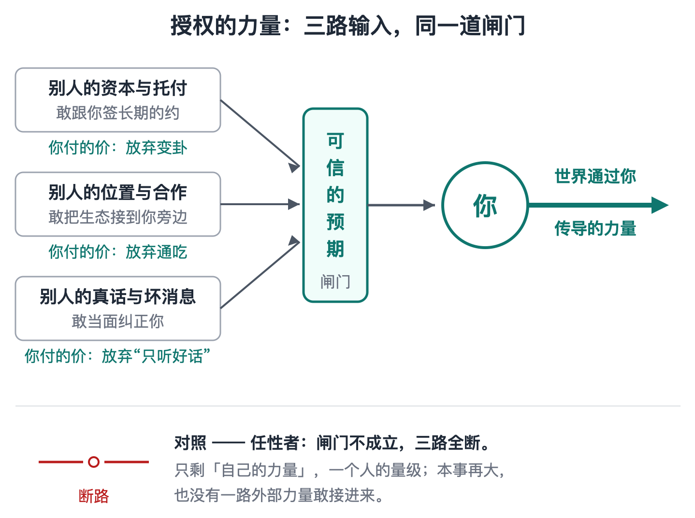
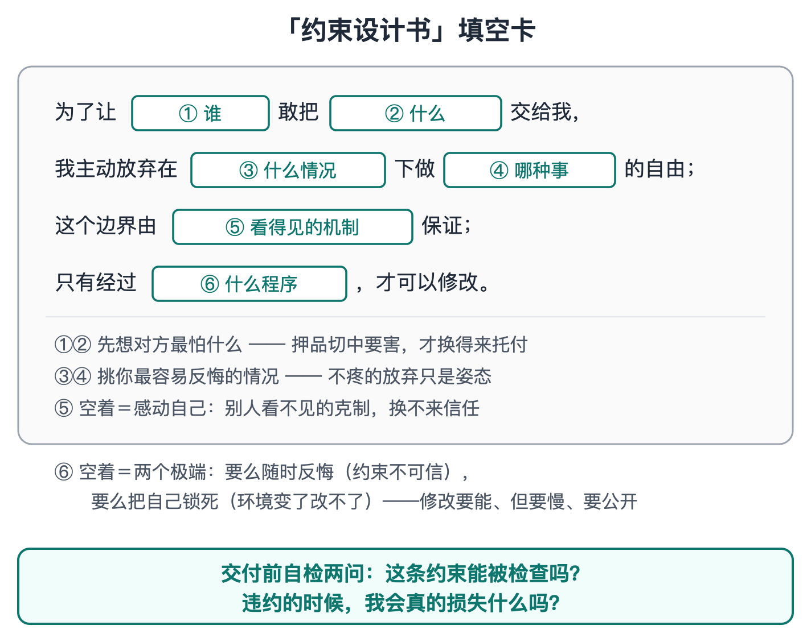
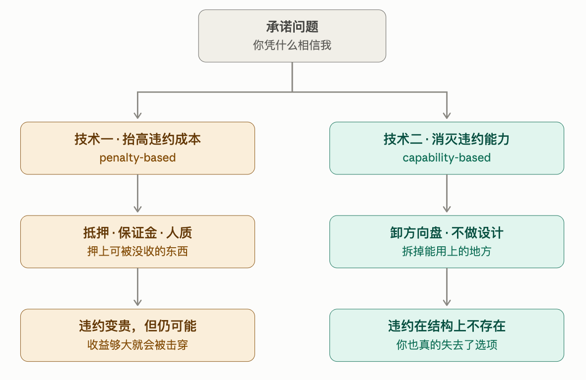
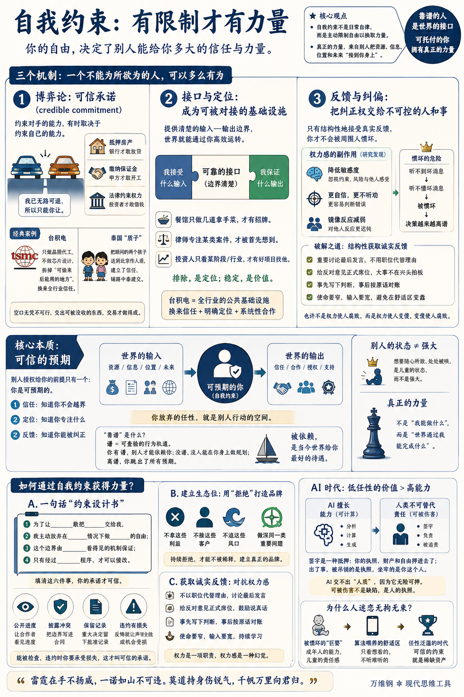

# 自我约束：有限制才有力量

[自我约束：有限制才有力量](https://www.dedao.cn/course/article?id=v5WgnrDGd8bKNdo607JMNRm1wO264y)

2026-08-01 08:52

这一讲我给你说一个在现代世界成为重要人物的秘密武器。它不用花钱，人人都能练，但是它极为稀缺，乃至于堪称一种超能力。

我们可以把它叫做「 **自我约束** 」。

注意，这可不是人们平时说的什么「自律」。自律是动用意志力跟自己的日常坏习惯较量，比如坚持早起、健身、少刷手机……有时候你能管住自己，有时候管不住，那都是你自己的事儿，不影响别人。自我约束说的是更大的事儿，而且是让你想不服从也不行，是对自由的绝对限制。

一般人的直觉是希望减少限制。最好我想做什么就做什么，而且我随时可以改变主意，你们都得迁就我。现在年轻人结婚都叫“大婚”，生个孩子叫“小公主”、“小王子”，长大之后“姐就是女王”，打个网约车人家都得喊“公主请上车”。这些人幻想能像爽剧主角那样要什么有什么，全世界配合他们打脸虐渣，认为这就是“强”……

那不是强大。那是一种非常弱的状态，因为那是儿童的状态。小孩可以随时掀桌子制造混乱，没人会怪他，但是也没人会把保险柜钥匙交给他。

你指望别人都哄着你，你得到的是别人都防着你、绕着你。

反过来说，只要你能主动自我约束，以至于人们相信你是高度受限制的、你不自由，那么你就可以在社会中扮演一种绝对重要的角色 ——

“成年人”。

这会带给你巨大的力量，因为你是可「托付」的。

我们说三个机制。你会看到一个不能为所欲为的人，可以多么有为。

✵

第一个机制是博弈论里说的「可信承诺（credible commitment）」。

这是我们多次提到过的哈佛大学经济学家托马斯·谢林（Thomas Schelling）的理论贡献。1960 年，谢林在《冲突的战略》一书中提出：约束对手的能力，有时取决于约束自己的能力。 比如两辆车在一条路上相向而行，眼看就要撞上了，谁躲开，谁就算认怂，那你怎么才能逼对方躲开呢？答案是你当着对方的面把方向盘卸下来扔出窗外 —— 我已经没有让路的可能性，所以只能你让。

空口无凭，你必须做出一个实质性的、无法撤销的动作来约束自己，你的承诺才是可信的，别人才能跟你合作。

借款人把房产抵押给银行，承包商把履约保证金押给甲方，公司把客户资金交给第三方托管，政府把征税和举债关进不能随意绕过的法律程序，这些安排都削弱了自己的自由 —— 但正因为这样，银行才敢放贷，甲方才敢开工，客户才敢付款，投资者才敢把钱借给国家。

这也是我们前面说过的，为什么光荣革命之后，国王不能任意征税，英国政府权力受到高度限制，它的借债能力反而增强了。

另一个必然被写进史书的案例是台积电。张忠谋后来回忆，台积电从创办起采用的就是「纯晶圆代工」模式：不设计自己的芯片，只替别人制造；它不跟英特尔、德州仪器这些半导体公司竞争，而是成为它们的供应商。

注意这不是承诺“我不偷你的设计” —— 那种承诺不值钱 —— 这是拆掉了偷来之后能用的地方：一家没有芯片设计部门、根本就不卖自己的芯片的公司，偷英伟达的设计又能干什么呢？

于是大家完全放心。这才有了苹果和英伟达们敢把身家性命押上它的产线，各方敢全力跟它合作研发最先进制程，今天全球晶圆代工超过七成的生意在台积电一家手里。

还有一段更有意思的历史。1956 年，泰国是美国的铁杆盟友，但是很想跟新中国建立一条外交通道，又怕北京不信。泰国总理銮披汶最亲信的谋士，桑·帕他诺泰，用了个中国人特别熟悉的办法：把自己两个未成年孩子，一儿一女，秘密送到北京交给周恩来照顾。搁古代这叫“质子”！后来正是这兄妹俩参与了 1972 年重开中泰接触，为 1975 年两国正式建交铺路。

美国经济学家奥利弗·威廉姆森（Oliver Williamson）专门研究过这种安排，就叫「人质（hostage）」：把可以被没收的东西押给对方，交易才做得成。

开什么玩笑，你以为虎躯一震别人就得相信你？做大事不是过家家。

✵

而如果人们能够多次地、持续地、结构性地相信你，你就成了社会上的一个接口、一个基础设施。这就是自我约束带给你力量的第二个机制。

接口首先是一份边界清楚的契约：我接受什么输入，保证什么输出，哪些事情绝不擅自改变。两个模块能对接的前提是双方都保证在接口处不越界。提供可靠的接口，你就找到了一个生态位。

定位是一种排除运算。你要说“我什么都能干”，市场听到的就是“你什么都不精”，或者“不知道你能干什么”，以至于“不知道你”。

一家餐馆只做几道拿手菜，顾客才会记住它的招牌；一个律师只接某一类案件，客户遇上那种麻烦才会首先想到他；一个投资人明确只看某个阶段、某个行业，创业者才知道什么项目应该送到他桌上。你每排除一种可能，自己的社会地址就清楚一分。

台积电只做晶圆代工不做芯片设计，除了换来信任，还把自己变成了全行业的公共基础设施。

✵

第三个机制是：只有把纠正你的权力交给自己控制不了的人和事，你才不会被周围人惯坏。

如果你真的处于一个你说啥是啥、周围的人都对你唯命是从的环境之中，那你可就危险了。因为权力感会把人变傻。这里有一系列的研究 ——

\- 2003 年，加州大学伯克利分校心理学家达契尔·凯尔特纳（Dacher Keltner）等人提出「接近—抑制理论」：权力感会系统性降低人对约束、风险和他人内心的敏感度。

\- 2011 年，纽约大学的凯莉·西伊（Kelly See）等人用实验证明：人一旦在实验中被诱发出权力感，就会立刻变得更自信、更不听劝，乃至于更容易做出错误的判断。

\- 2014 年的一项经颅磁刺激实验发现，仅仅让受试者回忆一段自己支配别人的经历，他的大脑，在神经层面，对他人动作的镜像反应就会明显减弱。

简单说，仅仅是觉得自己有权力，你都会开始低估风险、高估自己，对别人的想法和感受也变得更迟钝。

那你要是真有权力、真没人能限制得了你呢？

周围的人会开始对你说好话而不说真话。只要一个人的升迁、收入和资源取决于你，他就会自动优化送到你面前的信息：坏消息晚一点，反对意见软一点，你爱听的多一点。

2011 年，管理学家詹姆斯·德特特（James Detert）和艾米·埃德蒙森（Amy Edmondson）用四项研究发现，职场中的自我审查，常常来自人们早已内化的一套“什么时候不该开口”的潜规则；连明明有利于组织的建议，也会被提前咽回去。

一边是你听不见坏消息，一边是你就算听见了也听不懂。一句话，你被惯坏了。

哲学家卡尔·波普尔（Karl Popper）说，有些理论“似乎能够解释几乎一切”（“appeared to be able to explain practically everything”）：无论发生什么，都能算作对它的证实 —— 可是“这种表面上的强大，实际上正是它们的弱点”（“this apparent strength was in fact their weakness”）。

权力干的事，就是把一个人变成这样一套“万能理论” —— 无论发生什么，都能证明他是对的。看上去无所不能，实际上已经失去了被现实纠正的能力。

你看那些贪官：他们原本也都是正常人，甚至还是能人。可越到掌权后期，干出来的事就越荒唐，甚至荒诞，仿佛已经失去了理性。他们其实就跟被父母惯坏的孩子一样。

也许不是权力使人腐败，而是权力使人变傻，变傻使人腐败。

人都本能地想被人宠着，但如果你想要力量，你不希望被人宠。你希望获得真实的反馈。

✵

信任、定位、反馈，这三个机制是同一个东西：「可信的预期」。 这里有一个对力量的基本认知。

一般人以为的力量是「自己的力量」：我能做什么。最好我像漫画里的超级英雄一样，独立自主，想干什么就干什么。这是一个幼稚的幻想。一个人的力量再大又能有多大呢？

真正的力量是「授权的力量」：别人把资源、信息、位置和未来接到你身上 —— 是世界通过你传导的力量。

而别人授权给你的前提只有一个：你是可预期的。

你必须自我约束，才能给人提供确定性；你放弃的任性，就是别人行动的空间。

这就是中国人说的“靠谱”。谱是什么？曲谱、棋谱、家谱 —— 是写定了的、可查验的行为轨道。说你靠谱，就是你的行为有谱可依，以至于别人可以照着那个谱安排自己；“没谱”，是没人能在你身上做规划；最严重的是“离谱” —— 你跳出了所有的预期。

我们常说被依赖，是当今世界给你最好的待遇 —— 你有谱，别人才能依赖你。

如果你能扮演一个确定的角色，承担一份确定的责任，甚至成为一件基础设施，你就会成为社会上的一号人物。

✵

那么，一个人怎样通过自我约束获得力量呢？这里没有固定算法，不过我可以给你提供一个思路，一份一句话的“约束设计书” ——

“为了让＿＿敢把＿＿交给我，我主动放弃在＿＿情况下做＿＿的自由；这个边界由＿＿看得见的机制保证；只有经过＿＿程序，才可以修改。”

这句话迫使你填明白六件事：谁要信任你，他要托付什么，什么情况最容易诱发你的任性，你具体放弃哪种自由，别人凭什么相信边界存在，以及边界怎样才可以修改。

你还可以公开写下交付标准和时间，让合作者看见进度；把利益冲突提前披露，把不能碰的边界写进合同；重大决定保留批准记录，不把失败全部推给执行者；如果你反悔，就让自己的声誉受损，或者自动失去某些机会、损失真金白银。

能被检查，违约时你要承受损失，这才叫可信的承诺。这比什么“我一定尽力”“这件事包在我身上”可强太多了。

如果你想建立生态位，比个人品牌包装更重要的是先写一张“不做清单”：哪类利益我不拿，哪种客户我不接，哪种风口我不追，我宁可损失机会也不改变标准。

真正的品牌是靠持续拒绝稀释建立起来的。你必须维护「慢变量」：你反复解决同一类重要问题，长期用一种别人能够识别的方式交付，又允许自己从很宽的领域吸收信息，世界才会给你分配一个位置。

如果你想得到诚实反馈，就不能放纵自己的权力感。权力是一项职责，权力感却是一种幻觉：我比别人看得准，我不需要解释，我可以随时改主意。要配得上拥有权力，你就得放弃任性的特权 ——

重要讨论最后发言，不用职位代替理由；大事不在兴头上拍板，给反对意见一个正式席位；事先写下自己的判断，事后按原话对账，不许自己随意改写历史。

这里的要领是“使命要窄，输入要宽”。使命太宽，别人不知道去哪儿找你；输入太窄，你会在自己的生态位里越来越蠢。

✵

当然你不能只有约束没有能力。理想的局面是高能力、低任性 —— 但是，因为 AI 时代的到来，低任性的价值可能会超过高能力。

我们正眼看着 AI 在一项项能力上超过人类，可是各行各业的关键决定，最后签字的还得是人：AI 诊断再准，处方得医生签；AI 分析财报再好，审计意见得合伙人亲笔签。

这里的根本理由是人可以被伤害。

签字其实是一种抵押 —— 签下去，你的执照、财产和自由就押进去了；出了事，吊销的是你的执照，坐牢的是你这个人。

责任链的终点必须是能被伤害的一方，可是世界只能伤害人，而伤害不了 AI。AI 说“我保证”，信息量是零 —— 不是它不真诚，是它无险可押。用这一讲的话说：AI 交不出人质。可被伤害不是人的缺陷，是人的执照。一个刀枪不入的人是不可交往的。

而且自我约束并不是说我不干坏事、有道德就行。它不是一句修养口号，而是一整套获得信任、反馈和授权的技术。

执行约束也不是照章办事那么简单。给定一部法律，一般人也难以判断一个行为是否违法，这就是为什么需要律师和法官这些专业人士。

原则是抽象的，现实永远具体；要在利益诱惑、情况变化和各种例外面前，仍然准确判断哪里不能越线，本身就是一门技术性极强的学问。

✵

为什么人这么迷恋无拘无束？是因为从小被管得太严吗？有些人长大以后，潜意识中最大的愿望就是“谁也别管我”：无拘无束、为所欲为，稍有不顺便急头白脸。用武志红老师的话说那叫「全能自恋」 。

一直到几十年前，大部分人都生活在一个短缺的世界之中。那个世界的容错率非常低，一次小小的放任就可能让全家吃不上饭。所以人类社会一直以来都是礼法森严，一般人没有资格被惯坏。

现代世界第一次把皇帝待遇给平价化了：很多家里只有一个孩子，父母舍不得让他受挫，学校不敢让他受委屈，公司只筛选不教育，社会保障兜底，商家捧着，连你听到的信息都是算法按你的喜好筛过的。于是有了人类历史上第一批被批量惯坏的人 —— 也就是武志红说的「巨婴」：成年人的能力，儿童的责任感。

当你看见网上那些巨婴言论的时候，你应该意识到这里有套利机会。

可信的约束是稀缺的。人人任性的时代，你不需要天赋异禀，只要管得住自己、说话算数，你就自动进入一条人烟稀少的赛道。

你不练琴，也有在家随便弹几下的自由；可只有把十根手指练到不再任性，你才有登上大舞台、让整个乐团与你合奏的自由。

我们一直在讲要扩充自己的选项，要保留期权，要在硬约束的空隙中寻找自由发挥的空间，要应无所住而生其心 —— 但你要是想获得力量，要在某一方面获得大自由，你就必须主动给自己更多，而不是更少的约束。

**【有诗赞曰】**

> 雷霆在手不扬威，  
> 一诺如山不可违。  
> 莫道持身伤锐气，  
> 千帆万里向君归。

---

### 核心洞见

这篇文章颠覆了大众对“自由”、“力量”和“自律”的浅层认知，从**博弈论、系统论、演化心理学和现代商业逻辑**的高度，构建了一套关于“如何通过自我设限成为关键人物”的深层洞见。

### 权力的本质重构——从“自身力量”到“授权力量”

- **平庸的误区**：认为强大就是“拥有绝对的自主权，为所欲为，不受限制”（这是漫画英雄式的儿童思维）。
- **深层的本质**：**个人的力量上限极低，真正的力量是“世界通过你传导的力量”（授权力量）。**
- **传导的前提**：外部的资源、资本、信息和信任，只会流向\*\*“确定性”最高、可被预期（靠谱）的节点\*\*。你放弃的任性空间，恰恰是别人敢于与你协作、把身家性命托付给你的安全空间。
- **结论**：**“无所限制”意味着“不可托付”；自我受限越深，能承载的授权与能量越大。**

### 自我约束的三大底层杠杆

文章没有停留在道德劝诫，而是揭示了自我约束的三个硬核机制：

#### 1. 博弈论杠杆：抵押与人质（可信承诺）

- **谢林猜想**：约束对手的能力，取决于约束自己的能力。空口无凭的承诺一文不值。
- **拆掉作恶的工具**：台积电“只做代工绝不下场做芯片”，不仅是表态，更是物理上拆除了窃取客户设计的动机与能力；古代质子、履约保证金、分权宪政，都是通过**主动交出能被对方“没收”的人质**，达成了合作的纳什均衡。

#### 2. 系统论杠杆：接口与生态位（做排除法）

- **定位是排除运算**：声称“什么都能做”等于“不知道你是谁”。
- **把自己变成基础设施**：自我约束就是定义清楚系统接口（保证输出、限制越界）。通过列出严格的“不做清单”，持续拒绝稀释，成为一个生态中不可或缺的确定性接口。

#### 3. 认知论杠杆：抗熵增与防愚蠢（保留纠偏反馈）

- **权力使人变蠢**：心理学证明，不受限制的权力感会让人神经层面迟钝、过度自信、丧失共情。
- **波普尔反诘**：绝对不受限制的权力，就像“能解释一切的伪科学理论”，看似无敌，实则彻底丧失了被现实证伪和纠偏的能力。
- **约束即清醒**：只有主动把惩处、制衡、纠错的权力交给外部独立机制（制度、反对者、公开记录），才能避免沦为被周围环境捧杀的“全能巨婴”。

### AI 时代人类终极护城河——“可被伤害性”

这是全篇最具穿透力的前瞻性洞见：

- **能力的通胀与任性的贬值**：AI 时代，纯粹的技能和智力越来越廉价，高能力的溢价在下降，**低任性（绝对守信、高确定性）的溢价在飙升**。
- **签字的本质是抵押**：处方、审计、关键决策必须由人签字，不是因为人比 AI 聪明，而是因为**人可以被伤害、被起诉、被吊销执照、被剥夺自由**。
- **AI 交不出人质**：AI 刀枪不入，无法承担后果，因此 AI 做出承诺的信息量为零。**“能被伤害、有软肋押在现实中”（Skin in the game），是人类通往最高信用和最终责任的唯一执照。**

### 时代巨婴与“确定性套利”

- **历史的罕见阶段**：短缺时代容错率极低，没人敢任性；现代社会的物质丰裕、独生子女保护与算法投喂，历史上第一次将“皇帝待遇”平价化，批量生产了\*\*“拥有成人能力，却只有儿童责任感”的巨婴\*\*。
- **稀缺性套利**：当全网都在呼唤“谁也别管我”、追求无拘无束时，“自我约束”成为整个时代最稀缺的硬通货。**人人任性的时代，你只要做到言出必行、行为有谱、主动受限，你就进入了一条无人竞争的高维赛道。**

### 自我约束的工程学实现（如何把约束变为资产）

自我约束不是靠意气用事的意志力，而是一套**契约与系统设计技术**：

1. **约束设计书**：“为了让【谁】敢把【什么】交给我，我主动放弃在【情境】下做【何种任性行为】的自由；这个边界由【外部机制】保证；只有经由【严苛程序】方可修改。”
2. **维护慢变量**：使命要窄（生态位清晰），输入要宽（保持学习与反馈），通过长期、恒定、重复的交付标准积累声誉复利。
3. **制度化自限**：领导者最后发言、重大决策立字据事后对账、引入制度化的反对意见，主动剥离“任性的特权”。

### 金句

- **自律是对抗坏习惯的私事，自我约束是交出自由以换取信任的公权力技术。**
- **不是权力使人腐败，而是权力先使人变傻，变傻再使人腐败。**
- **一个刀枪不入的人是不可交往的；可被伤害，是人类获取托付的终极执照。**
- **想要在某一维度获得呼风唤雨的“大自由”，就必须在底层对自己施加不可撤销的“硬约束”。**