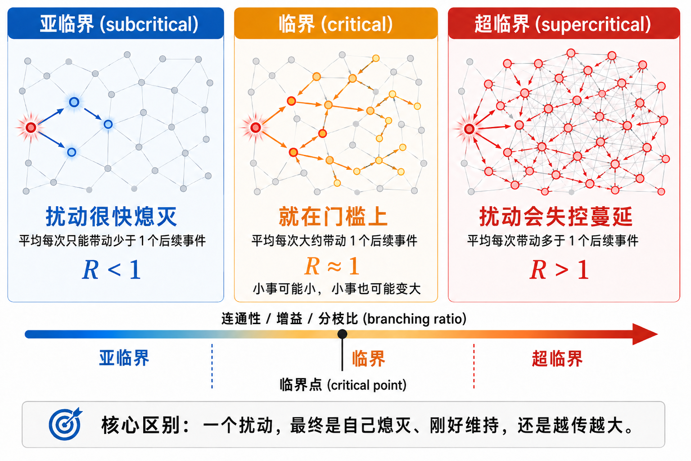
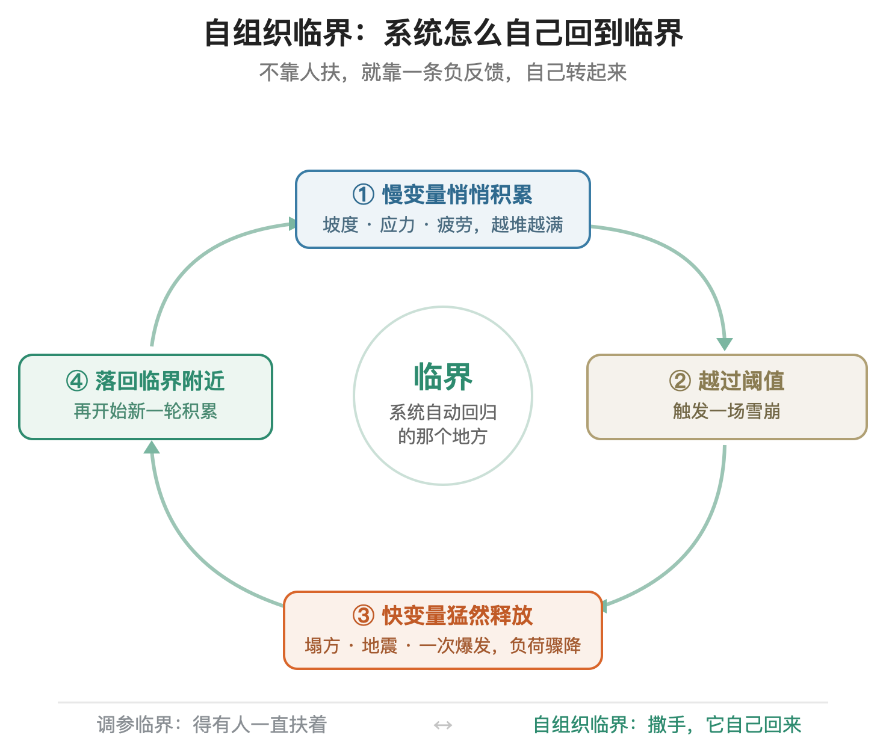
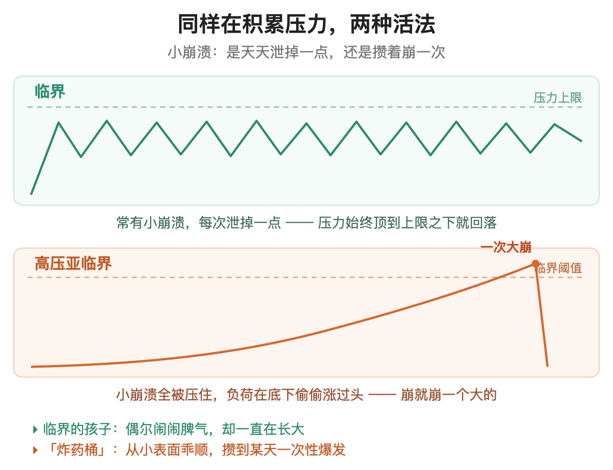
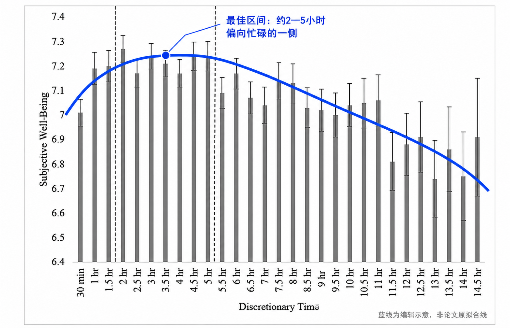
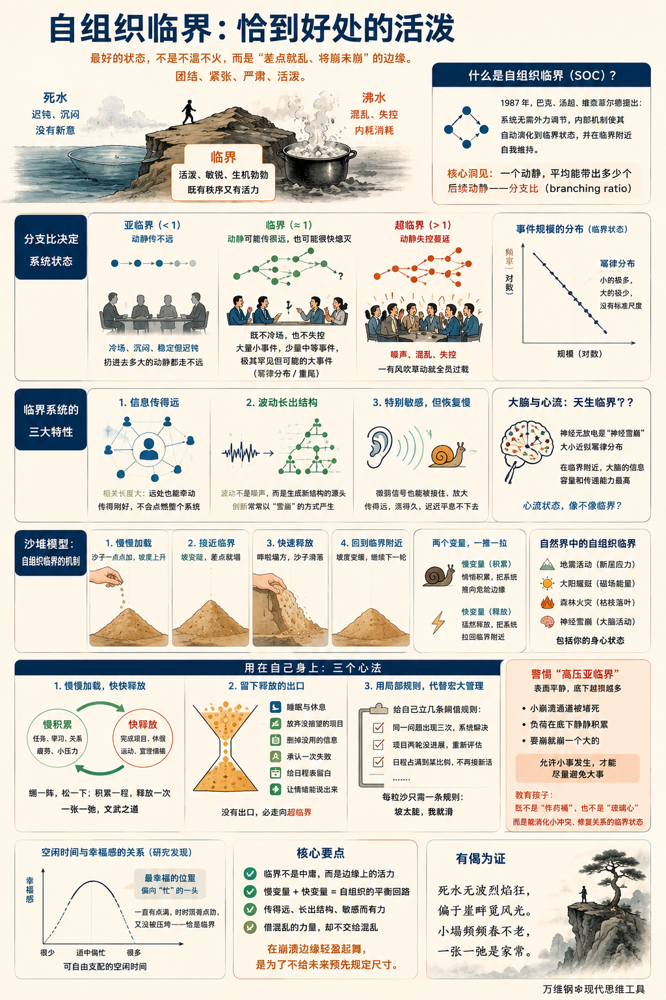

# 自组织临界：恰到好处的活泼

[自组织临界：恰到好处的活泼](https://www.dedao.cn/course/article?id=bezDG7wBonmJwgqB9MJvQkAg5PyO1x)

2026-07-20 23:09

一个组织，或者随便一群人，或者一个人，最好的状态应该是什么样的？

你可能觉得这都不成其为一个问题，什么状态都可能是好的状态 —— 难道还有什么系统性的说法吗？

有。我先说几个画面，你体会一下。

一潭死水，和一锅沸水。一个开会时没人发言、领导说什么是什么的单位，和一个天天内斗、鸡飞狗跳、谁也指挥不动谁的单位。一个人闲得发慌、不知道今天该干点啥，和一个人忙到失眠、脑子里十几件事同时炸响。

你立即就会发现这些都不是特别好的状态。好的状态应该在死水和沸水之间。但答案可不是直接取一个不温不火的中点。

**最好的状态是一条边缘 —— 一条“差点就乱、将崩未崩”的边缘。**它离混乱很近，近到随时可能要崩溃。可偏偏就是这个“看着挺危险，实则也不是那么安全”的位置，让它活泼、敏锐、生机勃勃。

这一讲送给你的思维工具叫做「 自组织临界 （self-organized criticality）」。这个词听着很学术，但你不觉得也有点酷吗？它出自物理学，但完全应该被用在各行各业，它应该成为我们的一个基础认知。

1987 年，布鲁克海文国家实验室的三位物理学家 —— 佩尔·巴克（Per Bak）、汤超（Chao Tang）和库尔特·维森菲尔德（Kurt Wiesenfeld）—— 提出了「自组织临界」这个概念。

物理学所说的「临界」，通常出现在系统发生相变的特殊位置。接近这个位置时，系统不同部分之间的关联可以跨越许多尺度，小扰动有时只影响局部，有时却能牵动很大范围。那项研究说的是一堆沙子，咱们先不说沙堆，先说你更熟悉的。

一堆东西，不管是一群人也好，一堆沙子也好，组成了一个系统。我现在关心这个系统里，一个个体遭遇的事件，平均会引发几个后续事件。

比如谣言传播。你们公司一个同事知道一个小道消息，请问他会把这个消息告诉几个人？得知这个消息的一个人，又会把它告诉另外几个人？每个人传播消息的平均数，叫做「 **分支比** （branching ratio）」。物理学家的洞见是，分支比代表了系统的带动能力：一个动静，平均能带出多少个后续动静。

如果分支比小于 1 —— 大家听完一乐，懒得往下传 —— 那消息传不了两轮就没影了。这种情况我们说系统处于「**亚临界**（subcritical）」状态：它很稳定可也很迟钝，你扔进去多大的动静都走不远。

如果分支比大于 1 —— 每个听到的人都忍不住添油加醋，再讲给好几个人 —— 那就一传十十传百，半天工夫传遍全公司，再往后就没法收场了。这叫「**超临界**（supercritical）」：这样的系统一惊一乍，有点风吹草动就失控。

而当分支比恰好在 1 附近，系统就处在「**临界**（critical）」状态：你说出去的一句话可能传一步就停，也可能传遍整栋楼，事先谁也说不准。你会在这样的系统中看到大量的小事件、少量的中等事件，以及极其罕见，却真的可能发生的大事件。

严格说来，临界状态下的事件大小服从一种「幂律（power law）」分布，也就是我们前面讲过的「重尾分布」 —— 小的极多，大的少，没有标准尺度，偶尔还有黑天鹅。

临界是一种特别理想的状态。我说一个画面你就明白了，想象一群人坐在一起开会 ——

亚临界的会，是大家都不怎么爱说话。就算你站起来发表一番暴论，也没几个人表态，更没人鼓掌。会场很有秩序，可是没有商量出什么新东西来。

超临界的会，是所有人抢着说话。哪怕有人咳嗽一声都能引发全场起哄。会场特别热闹但全是噪声，照样什么正事也办不成。

临界的会，却能让一个好观点穿过整个房间，一路点燃接话、补充和延伸；而那些不靠谱的念头则大多刚说出口就自己熄火了。既不冷场，也不失控。你能感到一种“人人都有点紧张，又都还在线上”的兴奋劲儿。

你看出来好处没有？临界既不死板又不混乱，既有秩序又有活力，可谓是「团结、紧张、严肃、活泼」的状态。

临界系统有许多有意思的性质。咱们翻译成人话，归纳成下面三条 ——

第一，也是最要紧的一条：信息传得远。

刚才开会那个画面里，一个好点子能穿过整个房间 —— 用物理学的话说这叫「相关长度（correlation length）」很大：系统里离得老远的两个点也能彼此牵动；边缘上一丁点小动静也能传到中心。

可它跟超临界又不一样 —— 超临界是“传得太猛”，一有风吹草动就全员过载、烧成一团；临界是“传得刚好”，一个信号能跑到很远，却不会把整个系统点着。

第二，波动能长出结构来。在死板的系统里，波动只是噪声，是围着平均值的小抖动，一冒头就被抹平。可在临界系统里，波动不再是敌人，而成了结构的生成器 —— 一个小小的随机扰动都有机会长成任意尺度的新花样。

创新，常常就是这么以雪崩的方式生成的。

第三，它特别敏感。再微弱的信号，它也能接住、放大 —— 比如一个小小的 demo、一次普通的争论，都可能在临界系统里激起一大片回响。但这份敏感是有代价的：临界系统传得远，却恢复得慢，一个扰动进来，它能荡很久很久，迟迟平息不下去。

临界系统就像一个聪明又敏感的人：她既能听见远方的耳语，又忘不掉刚才的搅扰。那你说这样的系统如果做智力工作，岂不是效率极高吗？没错。

这些年神经科学里有个还在争论的理论，叫「临界脑假说（critical brain hypothesis）」，认为我们大脑的高效工作状态，就是一个临界附近的状态。

你看啊，2003 年，美国国立卫生研究院的两位神经科学家约翰·贝格斯（John Beggs）和迪特马尔·普伦茨（Dietmar Plenz），在培养皿里的大脑皮层组织上观测到一种现象：神经元的集体放电忽大忽小，活像一场接一场的「神经雪崩（neuronal avalanche）」，大小的分布接近幂律……这不就是临界吗？

至少在一些实验和模型里，这种状态下神经的信息容量和传递能力更高。

你想想，你最有创造力、最敏锐的那些时刻，你那个「心流（flow）」状态 —— 警觉性很高，注意力聚在一个问题上，可又不时冒出一些旁枝的联想；你觉得这个复杂的东西我拿捏得住，而不是被信息推着走 —— 像不像临界。

组织也是如此。信息流得动的组织创造力才旺盛 —— 一个基层的小发现能激起一连串的响应；一次不起眼的试验能引发连锁的创新。

一般人形容一个系统，要么就说它太闲了，要么就说它太乱了，而殊不知在闲和乱之间，还有一个叫做临界的美好状态。

那你说临界这么好，一个系统怎么才能达到和保持临界状态呢？

一个办法是有个操控者，比如说会议主持人，看见会议冷场了就不断点名让人发言，看见会议太乱了就控制发言时间、打断跑题，这叫「调参临界（tuned criticality）」：靠外力调节。

而我们要说的这个「自组织临界」，则是一种神奇的机制：系统内部自带一个平衡回路，能把亚临界和超临界状态自动拉回到临界附近。

这就要说到巴克等人那个沙堆模型了。

想象你往桌上一粒一粒地、慢慢地加沙子。沙堆越堆越高，坡越来越陡。可它不会一直陡下去 —— 坡陡到某个程度，哗啦，塌一次方，一部分沙子顺着斜坡滚下去、从桌沿漏掉，坡度又降回来。然后你接着加，它接着陡，陡到一定程度再塌……就这么一轮一轮循环下去。

那个比较高、坡比较陡的状态，就是沙堆的临界状态。但沙堆并不需要谁来告诉它“临界坡度是多少”。坡太缓，你加沙子，它自己变陡，往临界爬；坡太陡，它自己塌方，把坡削平，退回临界附近。那个临界坡度，成了整个沙堆自动回归的地方。

地震活动、太阳耀斑、神经雪崩，都有自组织临界的影子；包括你的身心状态也可以用这个机制理解。

维持自组织临界全靠两个变量的配合 ——

**一个是「慢变量」，是那个悄悄积累的东西**：沙堆的坡度、断层的应力、森林里的枯枝、你身上的疲劳。它不动声色地，一点一点，把系统往危险的边缘推。

**一个是「快变量」，是那个猛然释放的东西**：一次塌方、一次地震、一场火、一次崩溃。它在一瞬间，把积累的负荷泄掉。

慢变量负责把系统推向临界，快变量负责把系统从过火的地方打回临界。一推一拉，系统就在临界附近来回晃荡。

自组织临界的这个智慧可以用在我们自己身上，咱们说三个心法 ——

**第一，慢慢加载，快快释放。**

工作、学习、家庭、社会关系，成年人面对各种任务，越忙越累，劳累就如同小沙子一点点积累在你身上。那么你需要释放，而且要像沙堆塌方一样，来一次快速的释放。比如完成一个干了很长时间的项目，休个假，旅游散散心，甚至干脆跟人爆发一次情绪。

爆发完，轻装上阵，再开始下一轮的慢积累。

很多人却是反着来的：要么平时很轻松，偶尔接一个特别大的任务根本不知道怎么下手；要么每天忙碌，从来不得休息……要么就是亚临界要么就是超临界。

想起《礼记》里有个典故。子贡有一次看不惯人们过节时候纵情狂欢 —— 就像现在有些官员，见不得老百姓快乐，总想把人管起来 —— 可是孔子说，人本来就该这样：“张而不弛，文武弗能也；弛而不张，文武弗为也；一张一弛，文武之道也”。

很多人把「一张一弛」解释成“松紧适度”“劳逸结合” —— 那其实不是高效率干活的人的文武之道。

张是绷紧，弛是松开，孔子的意思是让这两样轮着来，绷一阵，松一下；积累一程，释放一次。孔子说的是沙堆的节奏，是说不应该像高速公路收费员一样每天到点上班到点下班做同一个动作。

**第二，留下释放的出口。**

沙子能从沙堆边缘漏出去，系统才不至于一直堆到爆。人生里的“漏沙口”是睡眠和休息，是果断放弃没指望的项目，是删掉没用的信息，是承认一次失败，是给日程表留白，是让憋着的情绪能说出来。没有这个出口，你会走向超临界。

**第三，用几条局部规则，代替宏大的自我管理。**

沙堆里的沙子不需要理解整座沙山。每一粒沙只需要遵守一条简单的规矩：坡太陡，我就滑。你也一样。

你不需要每天重新规划人生大战略，你只要给自己立几条局部的阈值规则：同一个问题出现三次就停下来系统地解决掉；一个项目连着两轮没进展就重新评估；日程占满到某个比例就不再接新活儿……

只要长期遵守这些规则，你自然就会长出一种健康的秩序来。

听到这儿你可能忍不住会说，临界好是好，但似乎还是有点危险，毕竟这里有黑天鹅。没错，肯定不是所有东西都该临界 —— 临界会放大好点子，也会放大谣言和传染病 —— 有些事物还是处在亚临界比较好。

但是请注意，有些原本是活的、该临界的东西，你要是为了图省心，强行把它压在亚临界状态中，那可就不好了。

比如一个组织，如果你要绝对的安全稳定，不许小的失败发生，不许坏消息冒头，不许小的矛盾释放出来，那你就得动用各种手段把小崩溃的通道一条条堵死。你可能会得到相当长时间的风平浪静。可是那些本该被小崩溃一点点泄掉的负荷，可没有消失。它会在底下一声不响地越攒越多。

我们不妨把这个状态称为「高压亚临界」。它不是不崩，它是攒着，要崩就崩一个大的。

比如说地震原本就是一种临界现象。地壳板块慢慢积累应力，某一刻突然释放。地震断层上的小地震平时多得数不清，大地震一般极其稀少。而一段地震断层如果很长时间连一次小地震都不出，那往往不是太平，反而是危险的信号 —— 地质学家称为「地震空区（seismic gap）」。小震不来不是应力消失了，是它被死死锁住，在底下越憋越满，直到憋出一场大的。

正如咱们讲「反脆弱」的时候说过，一片一百年不许烧小火的森林，枯枝落叶越积越厚，早晚会憋出一场烧穿一切的大火来结账。

临界的一个精神就是不能怕出事儿。临界不能保证不出大事儿，但是平时允许出小事儿，才能尽量避免出大事儿。

教育孩子不也是一样吗？你既不希望他成为「炸药桶」—— 也就是高压亚临界，平时被压得过分听话，最后一次性爆发；也不希望他是「玻璃心」—— 也就是超临界，天天遇到一点小事就情绪失控。你希望他处于临界状态：允许孩子犯错、发脾气、甚至顶嘴，让他学着自己把小冲突消化掉、把关系修回来，这样才能扛事儿啊！

2021 年的一项研究分析了三万五千多人的数据，还做了两个实验，专门考察一个人“可自由支配的空闲时间”和幸福感的关系。结论是一条倒 U 型的曲线：**空闲太少，被事情追着跑，不幸福；但空闲太多，无所事事、日子空落落的，也不幸福。**

请注意，研究者发现的那个最幸福的位置，并不落在正当中那个“不闲不忙”的舒服点上，而是明显偏向“忙”的这一头 —— **是那种手头工作一直有点满，时时顶着点劲，可又没被压垮的状态。**

那恰恰就是临界状态。

你是有点累。但是你的反应非常敏锐，你感到兴奋，你动作很快，你充满了动力，你发得出去也收得回来，你借到了混乱的力量，却没有把自己交给混乱。

那是恰到好处的活泼。

你说我是在危险的边缘疯狂试探，我说我是在秩序尚未封口的地方写入现实。

**【有偈为证】**

> 死水无波烈焰狂，  
> 偏于崖畔觅风光。  
> 小塌频频春不老，  
> 一张一弛是家常。

