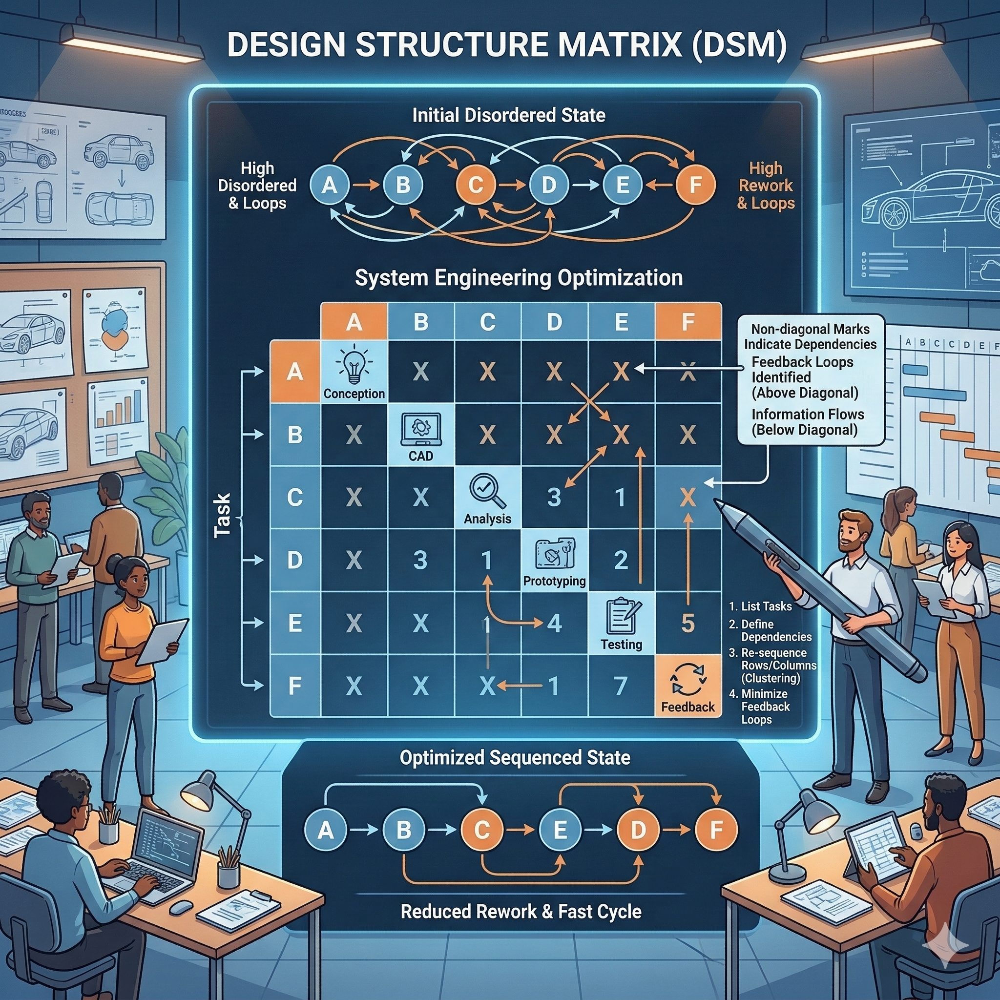

# 状态杠杆：你不是不努力，你是没做在点子上（得到课程讲稿 + AI 加工段）

# 状态杠杆：你不是不努力，你是没做在点子上

[状态杠杆：你不是不努力，你是没做在点子上](https://www.dedao.cn/course/article?id=Mr9mzb36pP4JL5o2jAXkWqB2EYNegL)

一般老百姓对“努力”有过高的评价。特别是当今内卷时代，很多公司默认要想提高效率就得让全体员工更努力、花费更多的时间。也许努力真的是个必要条件，但如果你整天只想着努力，你可就差远了。

殊不知努力更像一个标量，只有强弱；行动则至少同时有方向、时机和先后次序。

这一讲的思维工具叫「 状态杠杆 （state leverage）」，是我发明的一个名词，学术界并没有统一的说法，但是我们有很多现成的研究结果支持。

状态杠杆，简单说，就是这一步做完之后，世界会不会变得对下一步更友好。

我们先看两个生活中的小感悟。

第一个来自家务活儿。你从超市买了好几条排骨，打算先放冰箱里冻起来，过几天再吃。对此你有两个办法：一个是先切好，分成几份装袋再冻，做的时候打开一个袋子扔锅里就行；另一个是先冻起来，等要吃现切。第二个做法允许你暂时偷懒，可是会带给你很多麻烦 —— 你切之前得先把排骨解冻，为此你必须规划好做饭的时间，更不用说刚解冻的排骨切起来更费力。

买回来就切，把劳动前置，不但劳动量更少，而且是把局面推进到一个\*低摩擦\*的状态。

第二个感悟来自《西游记》。唐僧师徒到了祭赛国，发现有冤情，唐僧为了还愿，就去寺院里扫一座宝塔。他跟孙悟空两人从下层往上扫，扫到上面听见有妖怪说话，于是破案。这种扫法当然是剧情需要，但是你看到这儿一定会产生一个疑问：扫塔难道不应该是从上往下扫吗？

从上往下扫，上层的灰扫下来，下层顺手就一起带走了；可是像唐僧那样从下往上扫，你下面刚扫干净，上面一动手，灰又掉下来……你扫一晚上塔不还是脏的吗？

其实两种扫法花的力气差不多，毕竟人的疲劳感主要是来自挥动扫帚、调整姿势、来回移动这些固定成本，而不是清理灰尘的那一点有效功。但是扫塔这个活儿不满足交换律：先做 A 再做 B，和先做 B 再做 A，结果非常不同。

从下往上扫，你创造出来的临时干净状态会被后面的动作推翻；只有从上往下扫，你创造的才是不可逆进展。

切排骨和扫塔的道理都是：做事的顺序，和做事的努力程度，至少是同等重要的。

状态杠杆，就是那些能改变系统状态的行动，它们会重塑后续行动的成本、返工概率和选择空间。

你要优化的不只是这个动作，更是这个动作之后留下来的状态。

三种杠杆。

第一种是「前置杠杆（Preventive Leverage）」，在事情的上游做的那些动作，相当于一个项目的设计阶段。越早做的决定，对全局的锁定效应就越强。

美国国家航空航天局（NASA）有个著名的观察。一个项目在设计阶段所花的钱只占全部预算的 15%，但这个阶段锁定（commit）了大约 75% 的生命周期成本。测试、制造、集成、运行和维护怎么做，基本都被早期设计决定了。

设计阶段如果你发现一个小错误，随手改了就改了，很容易。但是如果等到后面实施阶段才发现问题，重新设计和重新验证的代价就会非常大。比如盖大楼，前期图纸上只是轻轻一笔，后期工地上却是锤子、钢筋、预算、工期、吵架、甩锅、法律程序……后果不堪设想。

据美国国家标准与技术研究院（NIST）2002 年的一份报告说，超过一半的软件缺陷不是在上游被发现，而是拖到更下游的开发和使用环节才暴露出来……可是缺陷发现得越晚，修复成本提高得越厉害。如果能改进测试基础设施，更早发现问题，报告估算早在那个年代，每年可以避免的损失就超过 220 亿美元。

所以设计看似便宜，其实是全项目最贵的地方。

这就是为什么丹麦经济学家傅以斌（Bent Flyvbjerg）在《怎样做成大事》一书中说，越是大项目，越应该在设计阶段加倍小心，宁可时间花长一点也没关系……他总结的经验叫做「**慢慢谋定，快速行动**」。

预防远胜于补救，前期多喝两天咖啡，后期少加无数个班，这就是前置杠杆。可是如果你没在真实世界参与过大项目，你可能无法想象，人们就是会在前期做一些很随意的选择，让项目匆匆上马，把一些明明是从从容容的小事变成了灾后重建。

第二种状态杠杆叫「顺序杠杆（Sequencing Leverage）」，项目的不同任务之间存在信息依赖，必须按照严格的顺序进行。

比如你家装修房子。你不能先刷墙再走水电，因为水电一改，墙还得重新砸开；你也不能地板都铺好了，才想起来还没装中央空调。正确的顺序一定是先定方案，再走水电，再做泥木，再刷墙，最后铺地板、装家具。这跟唐僧扫塔是一个道理。

很多人把项目理解成待办清单，先干这个再干那个。可是复杂项目不只是一条线，而是一个依赖网络，其中有多个并行交叉的依赖关系，那怎么办呢？你需要一个叫做「设计结构矩阵（Design Structure Matrix, DSM）」的工具。

设计结构矩阵把任务之间谁依赖谁、谁影响谁，画成一个方阵。它不但能看出哪些任务可以单向推进、哪些任务互相咬住、哪里有循环，还能告诉你怎样重排顺序才能让信息尽可能单向流动，让进展尽可能单调累积，避免“你等我、我等你”的局面。

一个很典型的案例是用 DSM 梳理福特汽车引擎盖系统的开发流程。你可能觉得引擎盖就是车前面那块铁皮，没什么了不起 —— 但它牵动的可是一串彼此咬合的决定。

造型团队想把线条压低一点，就会影响内部间隙；间隙一变，铰链的位置和开合轨迹就得跟着改；铰链一改，锁扣的位置、装配方式、碰撞安全，甚至工厂里机器人怎么抓取怎么安装，可能都得重来。

最麻烦的不是事情多，而是事情互相牵连。造型团队先改了外形，只是前端多画了几笔，后面的人就发现原来的结构装不上了。于是结构团队返工。结构一返工，制造团队又得重新评估工艺。工艺一变，安全测试的假设条件又不成立了……项目就在这种来回拉扯中消耗。

DSM 能找出哪些任务之间耦合最强，哪些地方最容易形成返工回路。这样你就能重新安排顺序：哪些问题必须尽早一起协调，哪些事情可以等前面的条件稳定了再做，哪些环节不能贸然往前推进。

你要让所有人同时开工，那就是在互相制造废品。

这个关键认知是工作与工作是不平等的。不是所有团队都该被一视同仁地平推管理。有些接口就是天生高耦合，你不给它更高的协调优先级，项目就一定返工。

第三种状态杠杆是「 约束杠杆 」， 出自以色列物理学家高德拉特（Eliyahu M. Goldratt）提出的「约束理论（Theory of Constraints, TOC）」。约束理论的核心逻辑非常简单： 任何系统的产出，都受制于它最窄的地方 —— 也就是「瓶颈」，也就是卡脖子的地方。你先别着急优化全流程，你先把瓶颈解决。

比如你们公司的前端营销每天能带来 100 个潜在客户，中端销售每天能转化 50 个，而后端交付团队每天只能服务 10 个，那你的瓶颈就是交付。如果你不能提高交付，反而去搞什么“全员狼性培训”，把营销翻倍到 200 个，销售翻倍到 100 个，有用吗？你不仅没有增加一分钱的真实产出，反而因为堆积了大量无法兑现的订单而造成内部混乱和客户投诉。

瓶颈理论比木桶理论可有用多了，毕竟谁家也不会用只有一个短板的木桶 —— 但是任何一个系统，流水线也好、团队研发也好、审批流程也好，还是你个人的生活也好，其整体的总吞吐量（throughput）都只由一个环节决定，那就是最慢的那个环节 —— 瓶颈。在非瓶颈环节上搞得再热闹也是虚假繁荣。

有一项对上百个已发表 TOC 成功案例的综述发现，一旦企业真抓住了瓶颈，改善往往不是这里省一点、那里快一点，而是一整片指标一起好转。平均来说，从接单到交付的总耗时（lead time）缩短 69%，企业内部流程跑一圈时间（cycle time）缩短 66%，准时交付率提升 60%，库存下降 50%，吞吐量增加 68%，财务表现提升 82%。

这可是极大的改进！瓶颈就如同高速公路上最窄的一段车道，你把别的路段修得再宽，车还是堵在那里；可一旦把那一段拓开，车流一下子就顺了，积压也跟着缓解。

高德拉特给的解法分五步 ——

1. 先识别瓶颈：到底哪个环节卡住了全局；

2. 充分利用瓶颈：确保瓶颈本身别浪费时间，别停工，别被无关事务打断；

3. 让其他环节服从瓶颈节拍，整个系统要围着瓶颈来配速；

4. 提升瓶颈，在必要的时候增加设备、人手和流程支持，把那个最窄的地方拓宽；

5. 回到第一步，寻找新的瓶颈。

逻辑很简单，但是这里有一个巨大的情感问题：如果你不在瓶颈上，你其实没必要干得那么忙 —— 可是老板们却是看谁闲就催谁。很多老板最受不了员工闲着，哪知道瓶颈没解决，其他努力不但无效，而且还增加麻烦。

我之所以把这些称为「状态杠杆」，是因为它们背后有一个更底层的数学灵魂，那就是理查德·贝尔曼（Richard Bellman）在 1954 年提出的「**动态规划**（Dynamic Programming）」理论。

绝大多数人干活，都是在自己的局部运行一个「**贪心算法**」：我负责的这个事儿，我怎么干最省力，怎么让我当前的收益最大。比如买回排骨直接扔进冰箱就是贪心算法 —— 在当下这一秒，这是最轻松的解法，至于说过两天不好切，那是未来的我操心的事儿。

贪心算法使得一系列局部的最优解拼接出了一个全局的糟糕结果。贝尔曼的动态规划拯救了这个局面。

贝尔曼提出一个方程（Bellman Equation），通俗来说 ——

你的总收益 = 你眼前的即时回报 + 你即将进入的下一个状态的潜在价值（Value of the next state）。

在动态规划的视角下，动作的目的不只是在当下，更是在于完成一次「**状态转移**（State Transition）」。这就好像职业选手打台球一样，不仅要打进当前的球，还要通过精确控制力度和旋转，让白球在碰撞后停在最完美的位置，方便击打下一颗球……

前置杠杆，就是宁可牺牲当前的即时回报，也要把系统推入一个“未来不用返工”的高价值状态。顺序杠杆，就是用设计结构矩阵为你规划出一条正确的状态转移路径。约束杠杆，则是说在一个复杂系统里，真正决定“下一个状态价值”的变量只有一个，那就是瓶颈。

简单说，你这一步怎么走，不能只看这一步本身值不值，而要看它会把你带到一个什么状态：后面的路是更宽了，还是更窄了，成本是更低了，还是更高了。

贝尔曼有个「**最优性原理**（Principle of Optimality）」，翻译成大白话就是：不管你过去多烂，也不管你起点在哪，你当下的这个决策，必须能让你在\*新状态\*下，面对未来时拥有最好的出路。

咱们看几个日常的应用场景。

前置杠杆，厨房里有句法语叫 “Mise en place”，意思是“一切就位”：大厨在开火炒菜之前，会花大量时间把所有要用的食材切好，酱汁调好，肉类腌好，所有小碗按顺序摆在手边。一旦点火，行云流水，绝不能半途关火去满世界找盐。

你的工作环境最好先处于低摩擦状态。比如你要写个什么东西，也应该先备料 —— 做好调研，把所有的数据、文献、核心大纲全部整理在手边 —— 一旦开始写，就进入纯粹的输出状态，而不是边写边找资料、想结构，甚至还时不时回复个消息。

顺序杠杆除了用于装修房子，更重要的心法是遏制自己先干那些“看起来像进展”的事儿的冲动：你这个报告的核心主题都没想好，就在那儿研究 PPT 皮肤，光修标题字体就花了 15 分钟，一看就不是真干活的人。

瓶颈杠杆告诉我们不要“到处努力”，而要“只在命门上用力”。能量产的、谁来都差不多的活儿，都不是你最该亲自下场的地方。真正值钱的是那个决定全局节奏的卡点。

你以为自己今天效率低下是因为意志力薄弱、不够自律，其实你的瓶颈是物理的：你昨晚睡眠不足。公司天天搞狼性动员，项目推进还是慢，那就根本不是执行力的问题，而是因为只有老板一个人有拍板权，他的决策带宽锁死了总吞吐量。你写不出东西抱怨自己文笔不够好、打字不够快，其实瓶颈是你脑子里没有值得被写下来的洞见……

刀还是那把刀，扫帚还是那把扫帚，力气还是那些力气。可就是因为你用力的地方不同、顺序不同、卡点不同，事情就发生了质变。

做在点子上，和没做在点子上：

一个叫积累，一个叫耗费；

一个越做越顺，一个越做越堵；

一个是在生利息，一个是在交罚息。

你是在完成任务，还是在制造一个更好的未来状态？

---

## 真正的高手，不是在“拼命”，而是在“改变状态”

这篇文章最有价值的地方，是它其实揭示了一个很多人一辈子都没意识到的底层问题：

很多人活得越来越累，并不是因为不努力，而是因为他们的努力无法累积。他们每天都在消耗，但系统状态没有变好。于是：

- 今天的问题，明天继续出现；
- 今天的忙碌，明天重新来一遍；
- 今天刚清理好的局面，后天再次崩塌。

这不是“工作量”问题，而是“状态转移”问题。

---

### 普通人的努力，为什么经常越努力越堵？

因为大部分人的行动逻辑，本质上是“解决当前问题。”而不是“创造一个更优状态。”这两者差别极大。

比如：

- 有人每天都在收拾桌子，但从不建立收纳系统；
- 有人天天回复消息，但从不建立信息过滤机制；
- 有人一直加班，但从不消灭返工；
- 有人不断学知识，但从不建立知识结构；
- 有人持续焦虑，但从不改变导致焦虑的生活结构。

于是人生会出现一种很可怕的现象：你做了很多事，但世界对你没有变得更友好。

真正的高手不是更能扛，而是：他做完一件事之后，后面的事情变简单了。

这就是“状态杠杆”。

---

### 什么叫“高价值动作”？

很多人判断行动价值，只看两个指标：

- 花了多少时间
- 付出了多少辛苦

但真正重要的是第三个指标：这个动作，会不会改变后续状态？

#### 低状态杠杆动作

- 不停擦地，却不限制脏源
- 一直回消息，却不减少无效社交
- 天天记账，却不改变消费结构
- 拼命背单词，却不进入真实语言环境
- 不断“清任务”，却不解决系统混乱

这些动作有个共同点：它们不能积累。做完之后，系统很快回到原状。你只是“维持”。

---

#### 高状态杠杆动作

- 建立自动化流程
- 提前规划
- 一次性整理环境
- 提高默认选项质量
- 消灭返工源头
- 找到瓶颈
- 建立长期结构

这些动作有个特点：

它们会改变未来。今天多花一点力气，后面很多事情都会自动变轻。这就是“利息”。

---

### 真正厉害的人，都在偷偷优化“状态”

很多人以为高手效率高，是因为：

- 更自律
- 更聪明
- 更能吃苦

其实往往不是。高手真正厉害的地方，是他们会不断把自己推入“低摩擦状态”。

比如：

#### 写作者会提前备料

不是坐下才开始想写什么。

而是：

- 平时积累素材
- 建立卡片系统
- 提前想好结构
- 提前形成洞见

等真正开写时，

已经不是“创作”，而是“倾倒”。

---

#### 程序员会优先自动化

优秀工程师最讨厌重复劳动。

因为他们知道：

重复不是勤奋，重复说明系统设计有问题。

所以他们宁愿：

- 花一天写脚本
- 花两天搭工具
- 花时间重构架构

来换未来几百次的轻松。

---

#### 高水平管理者不追求“所有人都忙”

低水平管理：谁闲就骂谁。

高水平管理：先找瓶颈。

因为系统吞吐量，从来不是由“平均努力”决定的，而是由“最窄处”决定的。

所以很多公司看似人人忙疯了，实际总产出还是低。

因为真正卡住全局的人：可能只有老板自己。

---

### 人生里最重要的能力之一：识别“伪进展”

> 很多人会先做那些“看起来像进展”的事。

这是现代人极大的陷阱。

因为“伪进展”会提供情绪奖励。

比如：

- PPT主题还没想好，先调动画
- 文章逻辑还没通，先修辞
- 产品还没验证，先做Logo
- 身体还没恢复，先研究效率工具
- 核心技能没建立，先经营个人IP

这些事都有个特点：

做起来轻松，而且容易产生“我已经开始了”的幻觉。

但它们不会推动系统状态发生关键跃迁。

真正困难的事情，往往是：

- 定方向
- 做取舍
- 找瓶颈
- 改结构
- 建系统
- 处理根问题

这些东西通常不性感，甚至短期看起来“没成果”。但它们才真正决定未来。

---

### 为什么很多中年人越来越累？

到了中年，系统复杂度开始指数上升：

- 家庭
- 工作
- 健康
- 情绪
- 孩子
- 父母
- 财务
- 时间

这时候如果还是：“哪里出问题补哪里”，人生会迅速失控。

因为你会进入：持续救火 → 状态恶化 → 更多救火

最后形成系统性疲劳。

所以中年以后最重要的能力，不是“更拼”，而是建立低摩擦人生。

#### 身体上的状态杠杆

- 规律睡眠
- 固定运动
- 稳定饮食
- 控制压力

睡眠不足会毁掉几乎所有认知效率。很多人以为自己缺的是自律，其实缺的是恢复。

---

#### 环境上的状态杠杆

- 减少噪音
- 减少无意义社交
- 减少信息污染
- 减少决策疲劳

因为人的意志力是高成本资源。高手不是更能硬撑，而是更少被消耗。

---

#### 认知上的状态杠杆

- 心智模型
- 知识结构
- 长期框架

这样你遇到问题时，不是每次重新思考，而是调用系统。这才是真正的“经验”。

---

### 动态规划视角：人生不是单步游戏

人生不是每一步都追求“当前最舒服”。而是你要不断把自己送进“未来更有优势的位置”。

比如：

- 年轻时学写作
- 学编程
- 学英语
- 学表达
- 学思维模型

短期收益都不大。

但它们会改变你之后几十年的状态空间。

这就是高价值状态转移。

---

### 一个极其重要的判断标准

以后你做任何事情，

都可以问自己一句：

> 这个动作，是在创造复利，还是在支付罚息？

因为人生很多痛苦，本质上都是：

过去长期没有做状态优化，导致今天不得不高成本补偿。

比如：

- 健康罚息
- 情绪罚息
- 财务罚息
- 关系罚息
- 认知罚息
- 时间管理罚息

而高手的人生，会越来越顺。

不是因为他们突然更幸运。

而是因为他们长期在做：

高状态价值动作。

他们不断让：

- 系统更稳定
- 摩擦更低
- 信息更清晰
- 路径更宽
- 成本更小

于是复利开始出现。

---

低水平努力：解决问题。

高水平努力：改变状态。

真正决定人与人差距的，不是谁更能吃苦。

而是谁更擅长：把今天的动作，变成明天更容易获胜的位置。
