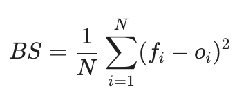
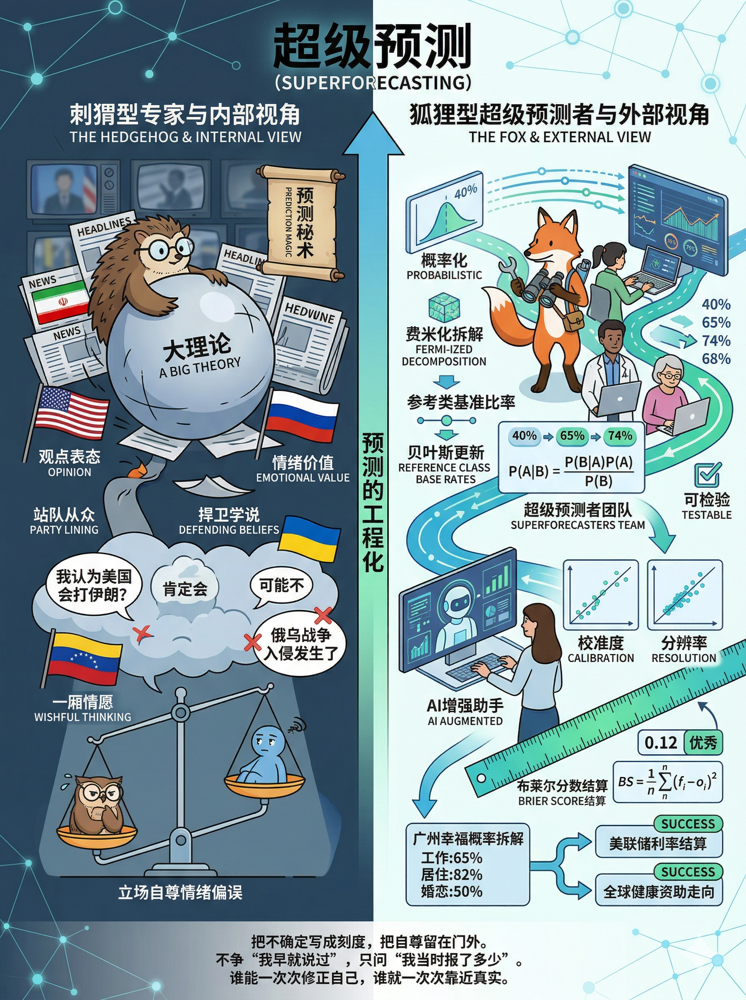

# 超级预测：给不确定性命名，给自己打分（得到课程讲稿 + AI 加工段）

# 超级预测：给不确定性命名，给自己打分

[超级预测：给不确定性命名，给自己打分](https://www.dedao.cn/course/article?id=QLYWyjMZoa0J1vYAZrXp4wvzDbO26B)

「参考类预测（Reference Class Forecasting）」，核心心法是把预测从「内部视角」切换到「外部视角」 —— 别总觉得自己这次不一样，应该先看看那些类似的项目最后都怎样了。参考类预测是对一厢情愿的巨大修正，但还是有点粗糙。

如果我在 2026 年1月问你美国会不会在三个月内打伊朗，你知道怎么预测吗？

你可以考察参考类，也就是历史上\*类似\*的危机最后有多少真打起来了……但是什么叫“类似”？油价、选举周期、盟友态度、地区代理人动作、总统的风险偏好这些因素都很重要，按照哪个分类呢？你会发现，这次事件的\*具体细节\*可能很重要，比如说美军在中东的军力部署节奏、双方谈判窗口有没有真的关上等等。怎么把所有这些考虑都融入你的预测之中呢？

你可能想不到，这样的预测，以前连专家都不知道该怎么办。直到过去十几年间，才有人把预测未来这件事从一门跳大神的手艺，变成了一套硬核的工程学。

这一讲的思维工具叫作「 **超级预测** （Super Forecasting）」，它是一门技术活儿，但你可以借鉴其中的心法。

我们的英雄是宾夕法尼亚大学心理学与政治学教授菲利普·泰特洛克（Philip E. Tetlock）。

泰特洛克早年就做过一件了不起的事情。他用二十多年，追踪了 284 位长期评论政治和经济趋势的专家，收集了八万多条预测……发现这些人根本没有想象中那么会预测。他们的准确度还不如最简单的统计算法，有时候连黑猩猩都不如。

泰特洛克 2005 年出了本书叫《专家的政治判断》（ *Expert Political Judgment* ，书中借用哲学家以赛亚·柏林（Isaiah Berlin）关于“狐狸与刺猬”的比喻，把专家分成了两类：「刺猬型专家」知道一件大事，抱着自己的一套大理论到处解释世界，特别容易陷入一厢情愿；「狐狸型专家」知道很多小事，愿意接受事情的复杂度，能考虑多个线索并且随时修正自己的观点，预测水平就更好一些。

但总体上，专家的准确度都不高。这些整天在媒体上谈论国家大事、以预测博关注的人，其实都不是很会做预测。

对此你容易理解。就在美国抓捕委内瑞拉总统马杜罗、打伊朗炸死哈梅内伊之前，有多少中国专家信誓旦旦地说美国根本不敢那么做？现在他们可不会承认自己预测失败。

但专家也不容易，他们背负了太多的包袱。

老百姓从专家的预测中获得情绪价值，会把预测看成站队。你要说伊朗损失惨重，他们会认为你\*希望\*伊朗损失惨重。专家还会自觉捍卫某个学说。你要是主张特朗普的外交策略必定失败，那他就最好在每一件事儿上都失败。预测成了观点表达，成了为基本盘站台。

人们还会把内心的脆弱带入预测之中。比如刚刚发生了一起恐怖袭击，专家和老百姓就都会成倍高估未来发生同样袭击的概率，陷入可得性偏误。

预测往往不是反映了那个事情如何，而是反映了预测者自身如何。

但真正的预测不是表态，是算账。

做预测，你得抛开立场、自尊、从众心理和安全感的影响。

之前人们就想了一些办法，让我们的判断更为客观。比如说在内部设立「红队（Red Teaming）」，专门找人来拆你的假设、破你的自信；还有「事前验尸（pre-mortem）」，让团队先设想项目已经失败，再倒推原因。丹尼尔·卡尼曼晚年极力推崇「决策卫生（Decision Hygiene）」，则是通过规范开会流程、确保大家独立判断来减少组织里的噪声。

但这些方法跟我们要说的「超级预测」相比，可就太过笼统了。

「超级预测（Superforecasting）」这个词听着有点浮夸，而且还被注册了商标，但它实际上是个严肃的学术概念，代表一套方法论。

事情的缘起是这样的。2003年，美国情报机构信誓旦旦地声称，伊拉克拥有大规模杀伤性武器。小布什真的开战了，结果打进去把伊拉克翻了个底朝天，却什么也没找到。

这可是奇耻大辱。你们这些搞情报的都怎么搞的？但是当时确实没有什么好的预测方法。

为了雪耻，美国情报高级研究计划局（IARPA）在 2011 年举办了一场国家级的预测锦标赛，允许各个大学和机构组队参赛。比赛持续了 4 年，有成千上万人参加。参赛者回答了 500 多个真实的预测问题，等事情结果出来再评分，完全是实打实。

泰特洛克出手了。他组建了一支队伍叫“良好判断项目”（Good Judgment Project），成员都是程序员、药剂师甚至是退休大妈之类的业余选手。而且他只给队伍进行了简单的培训……

结果这支队伍以巨大优势取得冠军。比赛打到第二年，其余队伍大多已被淘汰，只剩泰特洛克团队一路留到最后。他们的预测甚至比能接触机密信息的情报分析师更准。

泰特洛克的打法就是「超级预测」。他把这件事儿写成了一本书就叫《超预测》（Superforecasting）。

咱们来看看超级预测是怎么做的。

基本思想就是两件事：**概率化 + 可检验。**

所谓概率化，就是把你的一切预测都用概率数字表示。 不要说什么“美国很可能会对伊朗越来越强硬”，要说“到某年某月某日之前，美国对伊朗目标实施军事打击的概率是多少”：前者是感想，后者才是可结算的预测。

概率化可以分为三步 ——

第一步，把大而化之的“云状问题” —— 就是边界模糊、无法直接判定对错的问题 —— 拆成可操作的小问题。

这个思想起源于物理学家恩里科·费米（Enrico Fermi）倡导的估算方法，所以被泰特洛克称为「费米化（Fermi-izing）」。

比如领导问你“中美会不会脱钩？”，这就是一个云状问题 —— 到底什么叫“脱钩”？你根本无从下手。费米化就是要把问题拆解成“未来六个月内，某个关税法案通过的概率是多少？”“两国某项核心技术贸易额下降超过10%的概率是多少？”这些具体的小问题。

看到这些小问题的概率，你对局面才能有清晰的判断。大问题发生的概率是一系列小问题概率的综合。

第二步，用外部视角打底，用内部视角微调。

怎么得到概率？还是从上一讲说的「参考类」出发，看看历史上类似的局面，结局都是什么。有了这个基础比率，你心里就算有底了。然后你再看看你这个特定的事件，在参考类中的位置是怎样的，再根据它的特殊性进行一定的修正。

第三步，贝叶斯更新。

这一招我们前面也讲过。上一步得到的概率作为「先验」。随着事情的进展，局面有了新的变化，那你就在之前那个概率的基础之上，用贝叶斯公式进行微调：今天出个利好新闻，概率就从 43% 调到 46%，明天再出个利空又回到 41% —— 你没有听而不闻也没有听风就是雨，你非常稳健。

等到预测截止那天，这就是你提交的答案。但是事情还没完，你必须准备接受检验。

检验看的是你一揽子预测的长期表现，不是单道题押没押中。一个是看「校准度（Calibration）」，也就是你给的概率准不准：在那一系列你预测概率为 70% 的事件中，是不是真的发生了 70%？一个是「区分度（Resolution）」，也就是你敢不敢给出特别大或特别小的概率？别和稀泥把所有事情的概率都定为 50%。

一个最好的检验标准叫「 **布里尔分数** （Brier score）」。它测量你预测的概率与实际结果之间的误差的平方，你可以简单看一眼公式——

要点是它让你不能随便报概率：如果一件事的结局是没发生，而你原本预测的概率是 27%，你受到的惩罚会比你预测概率是 25% 时要高，比 30% 要低。

概率和检验构成了一个完美闭环：没有概率就没有校准，没有记分就没有学习。这个系统逼着预测者剥离模糊放下我执，对一个细节问题的概率是 37% 还是 38% 斤斤计较。

为了让你有手感，咱们来一道例题。

假设你在北京卷不动了，想搬去广州生活。你非常焦虑：我去广州能幸福吗？

首先我们把“幸福”这个云状问题进行费米化，拆解成四个维度：工作、居住、婚恋和生活适应，一个个算概率。拿工作来说，你真正想问的是：“我能在 3 个月内，找到一份月薪不低于现在 80% 的工作吗？”

我们先看参考类，查阅同行在广州的平均求职周期和薪资水平 —— 假设根据猎头数据，你得到概率是 40%。然后再看内部视角，考虑到你在这个行业有核心专利，再加上前同事内推，把概率上调到 65%。

于是你发了一圈简历。假设一周后拿到了两个面试，那你再把这个概率做贝叶斯更新，上调到 74%，看来比较乐观。

对其他几个维度照此办理，你就得到了一个广州前景分布图。如果四个维度中有三项概率超过了 60%，你可能就比较稳了。

你的决策将不再是人格宣言，更不是豪赌。你把人生难题变成了一个可操作、可更新的项目。

然后别忘了记分。搬到广州之后，把你得到的结果和你的预测做一番比较。当时你有没有一厢情愿的成分？好好反思，下次注意，你的预测能力将会越来越好。有研究表明，哪怕是这种短期的训练，只要计分，就能显著提高一个人的预测水平。

泰特洛克的“良好判断项目”现在已经把超级预测做成了一项服务（goodjudgment.com），你可以直接花钱请他们的团队帮你做预测。

在预测美联储利率调整这件事上，“良好判断项目”的超级预测者从 2023 到 2025 年连续压过市场定价，布里尔分数大幅度领先。2025 年，慈善网站 GiveWell 甚至直接掏钱请他们去预测美国对外援助和全球健康资金的未来走向，因为这些概率会影响真金白银的资助决策。

不过他们也有失败的教训，比如说俄乌战争。良好判断项目在事后复盘中承认，在 2022 年 1 月 21 日到 2 月 10 日之间，他们对俄罗斯全面入侵乌克兰的概率一直压在 50% 以下 —— 可是入侵发生了。反思的结论是团队太过依赖历史参考类，毕竟这种事情很罕见；他们大大低估了普京的冒险意愿，而且也低估了美国的情报准确度。

2025 年，泰特洛克已经把超级预测跟 AI 结合了起来。他们的研究发现，目前单独的大语言模型的预测能力不如人类超级预测者。但是，让人类预测者与大模型协作，准确率比对照组提高了 24% 到 28%。

你至少暂时还不应该把预测完全交给 AI。AI 善于搜索信息，但人擅长界定问题边界、挑选参考类、决定哪个变量该忽略、哪个异常值该认真对待……人拆解问题和编审框架的能力还是非常有用的。但 AI 能够进一步帮助人把自尊从判断里剥离出去。

我最大的感慨是，超级预测让我们看到了社会科学的工程化。

古早的社会科学像文科，讲理念讲叙事，只要能给你一个事后解释就好。后来引入了数据，变得科学化，能使用模型和统计学给你因果关系 —— 但都只限于一事一议。

现实世界中发生的事件往往受多个因素的影响，同时属于多个学科的叙事和模型，你找个专家，他只考虑一个模型，这哪行呢？

超级预测恰恰是使用工程化的方法，尽可能把多个关键因素纳入一个可更新、可记分的工作流，给你一个总的概率分数。

有意思的是它并没有用到太多模型！你只要忠诚于“参考类”和“贝叶斯更新”，就已经能做得很好了。模型可以用于解释和干预……预测可能是个更简单的事情。

预测是一门大业务，也许应该在大学里开设一个叫做“预测工程”的专业。当今世界可能不需要很多思想家和评论员，但是它需要很多调参师。

如果你曾经被专家的预测误导，我想请你先反思一下，自己真正想要的到底是表态、是祈愿，还是预测？你想要的是情绪价值，还是决策价值。

而如果你是一个诚意的预测者，我觉得超级预测中最神奇的一步，是费米化。精神病学家丹尼尔·西格尔（Dan Siegel）有句话叫「Name it to tame it」，意思是给一个情绪命名，你就能驯服这个情绪 —— 我们这里也可以说：不确定性一旦被拆解和命名、被写成概率，它就从一种令人恐慌的情绪，变成了可求解的工程问题。

所以别再说什么“差不多会了”“用户应该喜欢”，请说“下次模考数学上 120 分的概率是 43%”“三个月后留存率超过 25% 的概率是多少”。

预测不是观点的延长线，而是自我校准的工艺。

你不是在求一个神谕，你是在训练自己的判断账本。

或许你可以建一个 Excel 表格，从今天起在左边写下你的焦虑（比如“明天客户会毁约”），右边写下概率（“35%”），然后定期回头去结算。

**【收束小诗】**

> 把不确定写成刻度，  
> 把自尊留在门外。  
> 不争“我早就说过”，  
> 只问“我当时报了多少”。  
> 谁能一次次修正自己，  
> 谁就一次次靠近真实。

---

这篇文章探讨了菲利普·泰特洛克（Philip Tetlock）提出的**「超级预测（Superforecasting）」方法论，其核心洞见可以从认知重构、方法框架、心理机制与实践哲学**四个维度进行提炼：

### 认知重构：预测是“工程算账”，不是“站队表态”

1. **区分情绪价值与决策价值：**

大部分传统专家和公众所做的不是“预测”，而是**“观点表达”与“立场防御”（如刺猬型专家，守着一套大叙事到处套用）。预测往往反映的不是客观世界，而是预测者内心的脆弱、阵营与一厢情愿。真正的预测必须剥离自尊、立场与从众心理，把玄学式的猜想变成严肃的概率工程**。

1. **狐狸型优于刺猬型：**

世界充满复杂性与噪音，抱着宏大理论解释一切的人准确率极低；而那些承认世界复杂、掌握多种小工具、随时根据现实修正观点的人（狐狸型），预测水平显著更高。

### 方法论闭环：概率化 + 可检验

超级预测的核心引擎由**“概率化建模”与“结果结算”**两部分构成闭环：

1. **三步实现“概率化”：**

   - **费米化（Fermi-izing）：** 将不可判定的“云状模糊问题”（如“中美会脱钩吗？”“我去广州能幸福吗？”）拆解为清晰、具体的“可结算子问题”。
   - **外部视角打底，内部视角微调：** 优先寻找\*\*参考类（Reference Class）\*\*获取基础比率（历史大数概率），作为先验锚点；再结合当前案情的特殊细节进行微调。
   - **贝叶斯更新（Bayesian Updating）：** 拒绝非黑即白，随着局势发展用新证据不断微调概率（如从 43% 调到 46%），既不麻木滞后，也不听风就是雨。
2. **可检验与布里尔分数（Brier Score）：**

   - **没有记分就没有学习：** 衡量预测不看单次押注，而看长期的**校准度**（报 70% 概率的事是否真发生了 70%）与**区分度**（敢不敢给出极值概率）。
   - 误差平方的惩罚机制（布里尔分数）逼迫预测者精细化思考，对“37% 还是 38%”斤斤计较，倒逼认知精确。

### 心理与决策心法：命名即驯服（Name it to tame it）

- **化解焦虑的工程解法：**

人面对未来容易陷入恐慌或过度乐观，本质是因为不确定性处于“无形且庞大”的状态。将模糊的宏大难题拆解并赋予精确的概率刻度，**不确定性就从一种令人窒息的情绪，变成了可求解、可迭代的工程参数**。

- **人机协作的边界：**

单纯的 AI 预测能力尚不及人类超级预测者，因为人擅长**界定问题边界、挑选参考类、甄别异常值与编审框架**；但 AI 能高效检索并辅助剔除人类的人格偏见，两相结合准确率最高。

### 时代洞察：从“思想家”到“调参师”

- **社会科学的硬核工程化：**

传统社科侧重事后叙事和单变量模型，而现实问题跨越多个学科。超级预测不迷信复杂理论模型，仅凭“参考类 + 贝叶斯更新 + 反馈记分”，就完成了高维复杂系统的动态逼近。

- **决策者的自我修养：**

现代人不需要成为能言善辩的评论员，而应成为冷静客观的**“生活与决策调参师”**——把决策当成不断校准的账本，在 Excel 里记下担忧、标上概率、定期复盘，将人生难题转化为一个个可管理的项目。
