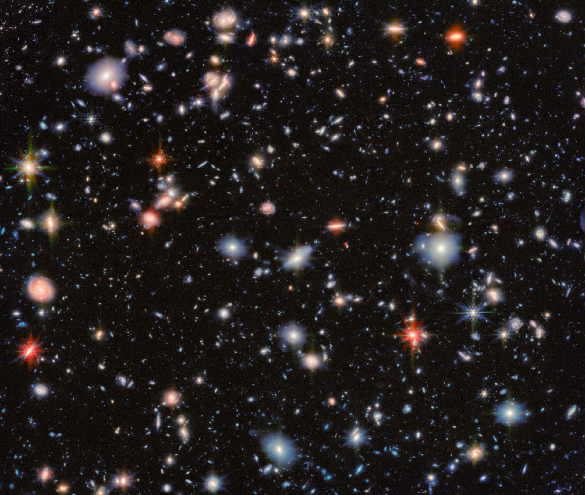
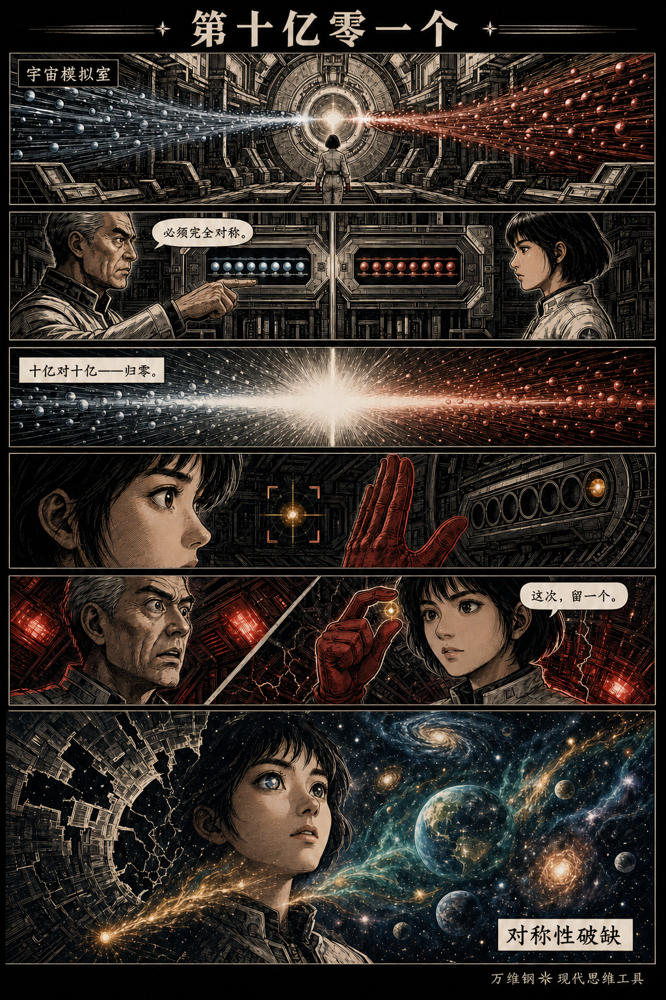
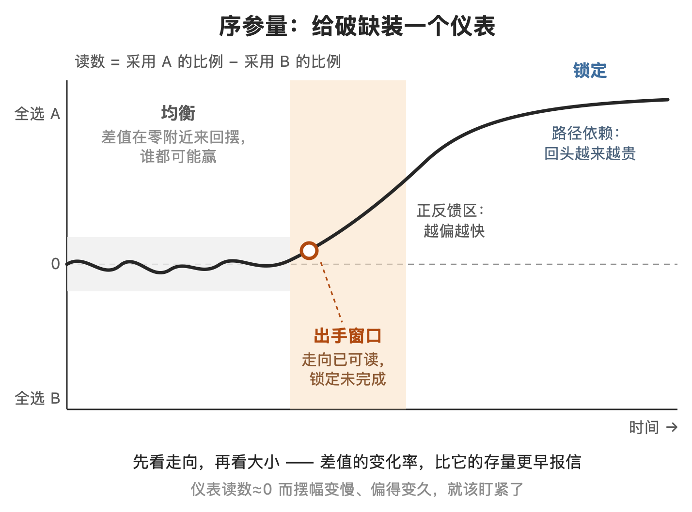
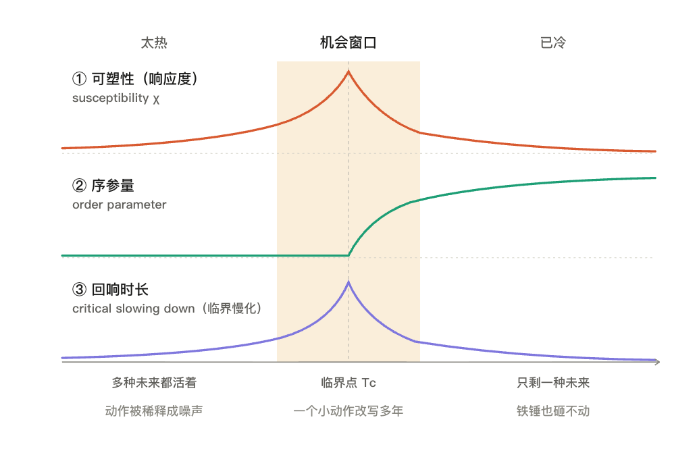
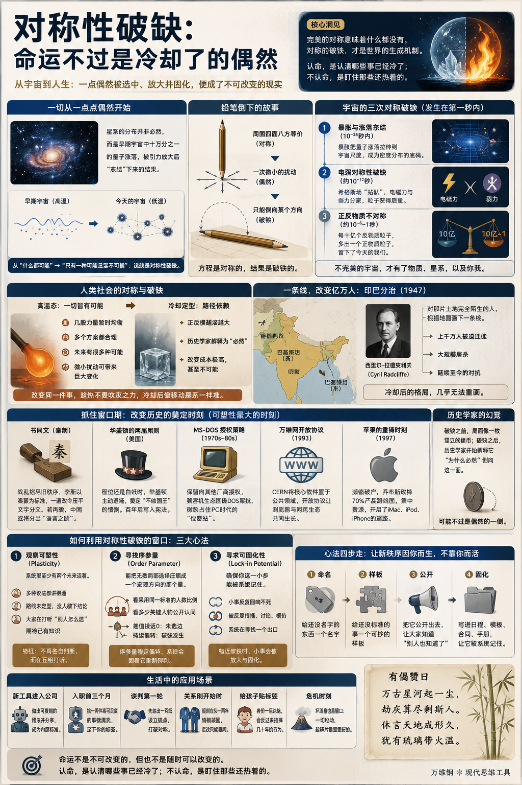

# 对称性破缺：命运不过是冷却了的偶然

[对称性破缺：命运不过是冷却了的偶然](https://www.dedao.cn/course/article?id=EGBgdkRbn1mKgdWBQgVY890D3rvPOA)

2026-07-16 23:23

这一讲的思想工具可能是复杂性科学送给我们最强大的一个武器。

你肯定看过太空望远镜拍摄的那种星空照片：无数颗星星密密麻麻铺满画面，它们的位置看上去完全随机。可能你会想，这些星星这么乱，随便挪动几颗，大概也看不出什么区别。

但事实是你挪不动。照片上每一个小光点不是一颗星星，而是一个星系；照片上一毫米的距离就是几亿光年。你把一个星系“稍微挪一挪”需要的能量是大自然根本不允许的。星系是都在动，但那张照片几千年都不会有可见的变化。你面对的是一个坚不可摧的既成事实。

可为什么那些星系的位置是这样的呢？总得有个来历吧？

答案是来自偶然。早期宇宙的物质—能量密度近乎均匀，只叠加着极其微小的量子涨落 —— 这里稍微密一点点，那里稍微稀一点点，这个“一点点”，是十万分之一。但就是那一点点的差异，让宇宙后来的物质这里多一点点，那里少一点点。那些物质在引力作用下慢慢变成星系，就是我们今天看到的样子。

今天这些星系的分布格局，哪里星光成团、哪里一片空旷，不过是那阵随机抖动的放大。

这个从“什么都可能”变成“只有一种可能、而且坚不可摧”的过程，物理学有个专门的词，叫「 对称性破缺 （symmetry breaking）」。

想象把一支铅笔笔尖朝下立在桌上。它周围四面八方完全等价 —— 物理方程没有偏爱任何一个方向，这就是对称。可是铅笔不能永远立着，可能因为空气瞬间的扰动，可能因为桌面细微的纹理，因为一些小到不能再小的偶然，它会倒下。而它一旦倒下，就只能倒向某一个方向，再也回不来了，这就是对称的破缺。

方程是对称的，结果是破缺的。

混沌是对称的，混沌初开是破缺的。万事万物就由此展开。

1972 年，贝尔实验室的物理学家菲利普·安德森（Philip Anderson） —— 他后来得了诺贝尔物理学奖 —— 在《科学》杂志发表一篇文章叫《多者异也（More Is Different）》。他感慨宏观世界的规律不能从微观方程简单推出来，而“破缺的对称性（broken symmetry）”正是理解世界为什么一层一层长出新秩序的钥匙。

我要说的是，这把钥匙不但能解释星空，还能解释你的处境。简单说 ——

命运不过是冷却了的偶然。

✵

咱们先看宇宙的演化。宇宙的历史是一部降温史，每一次降温都逼着宇宙做一次选择。

根据阿兰·古斯（Alan Guth）1981 年提出的「暴胀理论」：宇宙诞生后远远、远远不到一秒钟，经历过一次暴胀（cosmic inflation）—— 也就是空间本身的超级爆炸式膨胀 —— 把微观世界里本来转瞬即逝的量子涨落一口气拉伸到宏观尺度，“冻结”成宇宙密度分布的底稿。后来的一百多亿年里引力只是在按这份底稿施工。

接着，大约在诞生后万亿分之一秒，温度降到千万亿度的量级，破缺轮到了力和质量。在那之前，电磁和弱相互作用还是同一种力，传力的粒子和组成物质的粒子全都没有质量。在那之后，弥漫在整个宇宙的希格斯场撑不住了，如同桌上的铅笔随机倒向了一个方向。电磁力和弱力从此分家，电子、夸克这些粒子有了质量。这叫「电弱对称性破缺（electroweak symmetry breaking）」。

然后是正反物质粒子的不对称。按理说，大爆炸应该产出严格等量的正物质和反物质。正反物质相遇就会湮灭，化为光。如果宇宙坚决执行这个对称性，它的结局就是一片纯粹的光。

可不知道为什么，当年的账目里有一个微小的零头：大约每十亿个反物质粒子，对应十亿零一个正物质粒子。

结果当湮灭如期而至，十亿对十亿同归于尽之后，总会剩下一个。

**这个十亿分之一的零头，就构成了今天宇宙里所有的普通物质 —— 包括你。**

这个零头到底从哪儿来的？物理定律到底哪儿不对称了？物理学家这么多年找到了一些线索，但是还没有完全解决 。

这三次对称破缺都发生在大爆炸后的第一秒之内。我们很庆幸，宇宙是「不完美」的产物。

完美的东西应该绝对对称，可绝对对称就意味着什么都没有。不偏心的湮灭留不下物质，不站队的希格斯场给不出质量，完全均匀的宇宙长不出星系。

所以破缺不是世界的瑕疵。破缺是世界的生成机制。

✵

涨落冻结、希格斯站队和正反物质湮灭是三种很不一样的物理过程，但它们都是让一点偶然的差异被选中，被放大，然后被永久保存。大自然如此，人世间也是如此。

人类社会也有对称时刻：几股力量暂时达成均衡，几个阵营都可能赢，几个标准都合理，几个未来都说得过去，一切皆有可能，那么微小的扰动就能带来巨大的变化。这就是社会的高温态。那时的社会就像一块刚出炉的玻璃，柔软可塑，你吹一口气就能让它弯个弧度……

但它很快就会冷却定型。到时候你就算用铁锤砸，结果也只有两种：要么它纹丝不动，要么粉身碎骨 —— 反正你想要的那个形状是得不到的。

1947 年，英国人终于决定撤出印度。印度国大党打算统一全印度，穆斯林联盟则坚持另建巴基斯坦，于是英国给了个印巴分治方案。可是分界线应该画在哪呢？两边争执不下，英国政府干脆就把这项任务交给了一名伦敦律师，西里尔·拉德克利夫（Cyril Radcliffe）。

拉德克利夫接到任务才第一次前往印度。但他并没有去需要划边界的地方，只是参加了委员会的工作。他是身在德里，根据地图、人口普查报告和一些听证材料做出的裁决。

如果当时有个明白人请拉德克利夫吃顿饭，给他讲一讲两边的宗教信仰和历史情况，想必今天的局面会好得多……可结果恰恰是这么一个对那片土地完全陌生的人，随手画了一条线，就给印度和巴基斯坦完成了地理手术。

随后上千万人从国界的一边逃向另一边，然后是大仇杀，然后是延续至今的印巴对抗。拉德克利夫那条线明显没画好，可你现在想重新画，却是几乎没可能。

改变同一件事，趁热的时候不费吹灰之力，冷却了就像移动星系一样难。

✵

所以要想建立惠及万世的基业，光有聪明才智是不够的，必须赶上窗口期才行。

比如说，以中国之大，从南到北从西到东，距离那么遥远的人都使用同一种文字，你难道不觉得这是一个奇迹吗？那是秦始皇刚统一天下，战乱刚刚把旧秩序熔了个干净，李斯抓住了这个时刻，以秦篆为标准完成的“书同文”。

纵观中国历史，要做成这件事可能就只有这一个窗口。

本来各国的文字都出自商周传统，但早已分叉，各有各的写法 —— 所幸的是，各国还没有各自养出几百年的经典、成熟公文和大批读书人，所以对文字的认同感不深。这就使得李斯一道政令就能压平。如果李斯当年不做，让各地的语言文字继续独立演化下去，中国就会像欧洲一样 —— 有拉丁文也不好使，最终法语、意大利语、西班牙语等罗曼语族语言从拉丁语中分化出来，英语、德语等日耳曼语族语言则另有源流，全都发展出成熟的文化，后人再想统一可就难了。

可塑性不是权力的函数，而是温度的函数。

我可以列举很多这样的奠定时刻：只要系统还热，你就可以把自己的选择变成后人的默认值。

美国总统这个职位还是一张白纸时，华盛顿做满两届便主动退场，从此“总统不是国王”就是惯例。此后一百四十多年的所有总统都把任期控制在两届以内，直到富兰克林·罗斯福打破先例……但最后这条惯例还是被写进了宪法。

个人电脑的操作系统还没有定型时，比尔·盖茨没有把 DOS 一次性卖给 IBM，而是保留了向其他厂商授权的权利。此后兼容机、软件和用户都围着 MS-DOS 聚拢，微软占住了整个 PC 世界的收费站。

万维网还只是欧洲核子研究中心（CERN）内部的一个信息共享项目时，CERN 在 1993 年把核心软件置于公共领域。于是浏览器、服务器和网页得以围绕开放协议共同生长。

1997 年苹果公司濒临破产，乔布斯趁整个组织都快垮了，一口气砍掉 70% 的产品路线图、重新集中资源。后来 iMac、iPod 和 iPhone 的道路就是从这次几周内完成的重铸中打开的。

破缺之前，局面像一枚竖立的硬币；破缺之后，历史学家开始解释它“为什么必然”倒向这一面 —— 而复杂性科学提醒我们那可能不过是偶然的一倒。

但局面只要开始一边倒，正反馈就会把这个偶然越锁越死：越多人接受它，接受它的理由就越充分 —— 经济学家称之为「路径依赖（path dependence）」。

开创者怎么干都有理。绝大多数人却是在玻璃冷透之后，才想起自己对它的形状有意见。

✵

你说这跟我一个普通人有啥关系？回答是你越想改变命运，就越得能抓住热局面。

其实也不是越热越好。如果玻璃一直都是热的，你的动作就只是噪声。真正的窗口是局面“将冷未冷”：可能性已经开始收敛，却还没收敛到只剩一种 —— 正如我们前面讲赚钱的时候说过的「机会窗口」理论：机会窗口是在主导类别出现的时候打开，到主导设计出现的时候关闭。

这里咱们大略总结一下利用对称性破缺的心法，出自「临界现象」的相关研究，就三点 ——

**第一是观察系统的「可塑性（plasticity）」**，热系统必须有不止一个未来活着。

一个领域如果只剩一个公认的赢家、一套公认的做法，它已经冷了。而如果三四种说法都讲得通，谁也不敢说哪个是标准，技术路线还没定型，行业还没有职称体系，组织还没有流程，平台还没有公认的“爆款公式”，它就还在窗口里。

而将冷未冷的一个特征是大家不再各自判断，而是互相打听“别人怎么选”：“再等等，看大厂怎么动”“看领导怎么表态”，人们在期待「共有知识」。

**第二，咱们借助一个物理学名词，叫做寻找「序参量（order parameter）」**：能把无数局部选择压缩成一个宏观方向的那个量。

磁铁看净磁化方向，行业看有多少人采用同一标准，圈子看有多少关键人物公开承认同一个名分，这些就是序参量。

两条技术路线竞争，用采用 A 的比例减去采用 B 的比例：如果差值接近零，系统还没选边；差值持续偏向一侧，则破缺正在发生。序参量一旦稳定偏转，系统里大量原本各自独立的选择，就开始围着它重新排列。

**第三是寻求「可固化性（lock-in potential）」** 。你终于出手！你要确保你这一小步能被系统记住。

小动作原本没啥用，因为稳定系统消化能力强，小事故、小文章、小争论，很快无声无息。但是临近对称性破缺的系统，小事会反复回响不死 —— 一篇文章转了又转，一个小 demo 让全行业焦虑，一次普通会议被私下议论好几个星期。这一切说明，系统正在寻找一个出口……

✵

咱们看几个生活中的应用场景。

一个是新工具刚进公司的时候。老板宣布“全面拥抱 AI”，可是没有流程、没有模板、没人知道怎么用，大家都在观望打听 —— 这就是可塑性。而“哪套用法正在成为标准动作”，就是序参量。你不声不响做出一套可复制的 Skill 分给同事，乃至于进入内部教程，破缺就已经发生。等大家开始问“这事儿是不是得按你那个方法来”，你就是制度的铸模者。

一个是你刚入职的头三个月。这时候没人知道你是谁，你可以决定别人怎么给你定型。第一印象会持续很久很久。所以头三个月要挑一两件能见度高的小事做漂亮，让人第一次想起你就想到一个清晰的标签，比如“这人能把复杂问题讲明白。”

再比如谈判的第一轮。第一轮表达的价格、职责和边界会成为锚点。所以别等对方出题，你要先打破对称。比如一上来就给一页纸：目标、分工、交付、时限、什么不包括在内，请对方回复、确认和引用它。

还有一段关系刚开始的时候。夫妻俩谁管钱、怎么吵架、各自父母的边界在哪儿 —— 这些规则会在相处的头一两年悄悄凝固。过了这个时机，模式成为默认，再想改可就只能靠闹了。

对孩子也是如此。每个孩子刚出生都是对称的，每贴一张标签就发生一次破缺。“我是数学不好的人”“我是能上台的人” —— 这些身份一旦冻结，会反过来指挥他此后几十年的行为。

还有一种特殊的窗口，那就是危机。失业、生病、项目崩盘、关系破裂，这些是坏消息，但也是局面重归对称的时刻。平时你想改都改不动的那些结构 —— 住在哪儿、跟谁来往、怎么工作、怎么生活 —— 此刻全都松动了。危机暂时把改变的成本打了折。趁一切还是碎的，重新拼一个更好的。

总结来说，这套心法就是：命名 → 样板 → 公开 → 固化。给还没名字的东西一个名字，给还没标准的事一个能抄的样板，把它公开出去让大家知道“别人也知道了”，然后写进日程、模板、合同、手册。

用上一讲「生成」的话说，这就是让新秩序因你而生、不靠你而活。

✵

人们常说未来有无限种可能。其实只有年轻人的未来有无限种可能。你的每一次成长都是一次选择，每一次选择都是一次破缺，每一次破缺都是一次定型。

你的身份会固定，你的路径会锁死，你的社会关系会固化，你的生活会冷却。那可太没意思了，这就是为什么文艺作品的主人公几乎都是年轻人。

“选择大于努力”没错，可我们并不是任何时候都有得选。窗口开着的时候，一个小动作能改写后面很多年；窗口关了，你以为的选择不过是摆姿势而已。

汉初的曹参接了萧何的班，整天喝酒一事不改。惠帝责问他怎么这样当丞相呢？曹参反问：论才能，您比得上高帝、我比得上萧何吗？潜台词是人家那时候的系统是热的，到咱手里已经冷了。

当然好消息是你还会遇到别的破缺时刻。

命运不是不可改变的，但也不是随时可以改变的。**认命，是认清哪些事已经冷了；不认命，是盯住那些还热着的。**

**有偈赞曰：**

> 万古星河起一尘，  
> 劫灰算尽剩斯人。  
> 休言天地成形久，  
> 犹有琉璃带火温。

