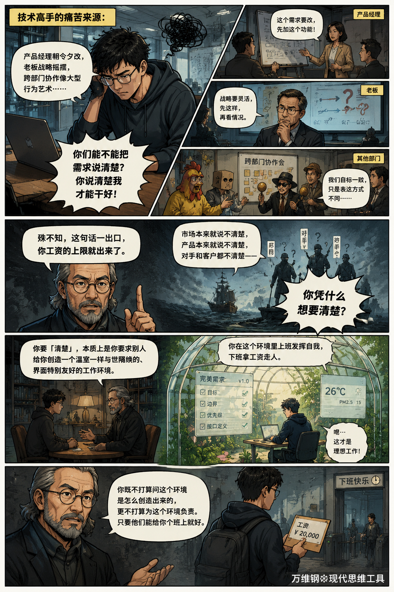
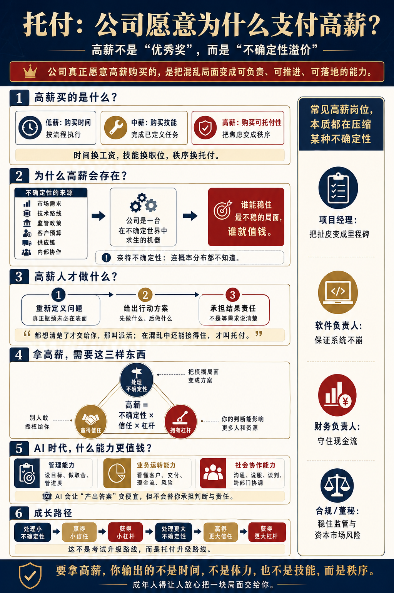

# 托付：世界奖励把不确定性变成确定性的人

[托付：世界奖励把不确定性变成确定性的人](https://www.dedao.cn/course/article?id=06eGYrQb1gzVxoLE3vKPl73kZRqOaB)

2026-06-02 22:56

我们这个“赚钱”模块说了这么多思维工具，都是默认说给企业家、创业者和自由职业者的：你直接面对市场，面对客户，面对现金流，赚钱也好亏损也好，现实直接落在你身上。

大多数人不必如此。可能你不想天天处理融资、招聘、合同、税务、媒体的批评和网上的舆论，你就想躲在一个组织内部做个员工，俗称“打工人” —— 但你说也想发挥大作用，以至于拿个高薪，行不行呢？

当然行。其实很多高级打工人挣的钱比小老板赚的钱都多，而且更有成就感。如果能在职场指挥千军万马，谁还愿意去开个小餐馆呢？这一讲咱们就说说怎么在一家公司里挣大钱。

外行看一个拿高薪的人，比如说用丈母娘挑女婿的眼光看，说为啥我家女婿年薪百万？那肯定是因为他优秀啊！这孩子从小就学习好、毕业于名校，所以那个大公司那么难进他都能进去；他平时工作特别努力，每天都加班，这么忙肯定是掌握了核心技术；老板主动给他升职加薪，说明他情商也高……

这么说也不能说完全不对，但这是错误的思维方式 —— 我们不妨称之为「**科举思维**」。科举思维认为世界是一个大考场，对人有一系列评价指标，应该奖励那些在这些指标上表现优秀的人：只要你做到了，你就是素质高，世界就应该给你提供相应的待遇，否则就是不公平。

但市场不是考场，公司不是给人颁奖的机构，财富是创造出来不是分配下来的。你优秀不优秀辛苦不辛苦，都不是公司给你高薪的理由。公司愿意给你高薪，一定是因为你能在财富创造的过程中，起到一个关键作用。

简单说，公司用低薪购买员工的时间，用中薪购买技能，用高薪购买……「**可托付性**（Entrustability）」。

我们公司面临一个模糊、昂贵而且有严重后果的问题，现在上上下下很焦虑。那你来了，你能不能把这一团混沌的信息、互相冲突的目标、没人愿意碰的责任，压缩成一个可以判断、可以执行、可以负责的局面？我们能不能把这个事儿托付给你？

这才是你拿高薪的理由。

**对公司最值钱的能力是把焦虑变成秩序。**要理解这一点，我们必须先从另一个视角想想老板是怎么赚钱的。

以前连很多学者都想不通：为什么老板的利润，可以比普通员工的收入高那么多？

如果公司就是一个办事机构，生产产品也好提供服务也罢，所有成果都是大家一起努力完成的，你这个老板也没有超能力，你一天也是 24 个小时，你凭什么赚那么多钱呢？

一直到 1921 年，美国经济学家弗兰克·奈特（Frank Knight）出了本书叫《风险、不确定性与利润（ *Risk, Uncertainty, and Profit* ）》，大家才想明白。奈特的答案是：**老板的利润来自他承担的不确定性。**

要生产这个产品，我们前期必须投入很多钱，我们得购买机器、招聘工人、囤积原材料，花时间设计。等我们生产出来可能已经是半年之后了 —— 那时候的市场还需不需要这个产品，是不确定的。没有人能准确预测明年的流行时装将会是什么款式，但是你必须今年就开始备货。

这种「不确定性（uncertainty）」跟一般的「风险（risk）」还不一样：**风险（risk）是你知道概率分布，最起码可以用购买保险的方式加以管理；不确定性（uncertainty）是你连概率分布都不知道，甚至将来这个事儿还有没有意义、会不会被另外一个你完全没想到的事儿取代，你都不知道** —— 这就是我们前面说过的「奈特不确定性（Knightian uncertainty）」。

如果世间没有不确定性，公司就只是一个执行机构，那老板就根本不应该有利润，所有人都拿个标准工资就算了。但现实是市场需求、技术路线、监管政策、客户预算、供应链、竞争对手和内部团队都充满不确定性，所以做生意必须用到老板本人的眼光、见识和创造力，在很大程度上是做不讲理的主观选择，甚至就是赌。人家有很大的可能会赌输，所以当人家赌赢的时候，你必须给人一个高利润，不然这个游戏就没人玩了。

**市场经济中任何人都可以当老板，但大多数人选择安稳地当个员工。凡是不是董事长的小舅子还敢出来当老板的，都是有冒险精神的英雄豪杰。**

公司是一台在不确定世界中求生的机器。所以老板关心的不是“谁最优秀”，而是“哪块局面最不稳”。谁能让那块局面稳下来，谁就值钱。

并不是努力和优秀没用，高素质总会有些用处 —— **但世界奖励的终归不是努力和优秀，而是那些把不确定性变成确定性的人。**

**别忘了不确定性是意义的燃料。高薪不是优秀奖，而是不确定性溢价。**

其实人只要出来做事，就多多少少会把一些不确定变成确定。毕竟再小的活儿完成之后，也总会比完成之前多一点秩序。**大家的区别只是在于大小和主动性不同。**

初级打工人的心态是你让我干什么，我就干什么。你给我一个工单，我处理；你给我一份表格，我填；你给我一个标准流程，我照着做。外卖、客服、基础运营、简单行政、流水线岗位，包括很多号称是“知识工作”的岗位，都是这个逻辑。

我用时间和体力换取工资。至于说干出来的活儿有多大作用、能帮公司赚多少钱，那是你的事，不是我的事。

工作不能没有这样的人，但是他们的可替代性非常高。所以工资不可能太高。

中级打工人则会超越流程，发挥自己的判断力和创造性。产品经理说个需求，程序员能自己设计路径，写好代码，设计师能出图；老板下个指令，律师能写合同，财务分析师能建模型，销售能签单；病人来了，医生知道该怎么处理；教练派球星上场，球星是真能给你进球。

他们卖的不是时间和体力，而是技能，正所谓“学成文武艺，货与帝王家”。很多人认为这就是打工人的天花板，其实不然。

**他们仍然是在等待别人定义任务。**

这是很多技术高手的痛苦来源：他老觉得产品经理朝令夕改，老板战略摇摆，跨部门协作像大型行为艺术，他认为这一切都是在给自己制造麻烦。他说：你们能不能把需求说清楚？你说清楚我才能干好！

殊不知这句话一出口，你工资的上限就出来了。

市场本来就说不清楚，产品本来就说不清楚，对手和客户都不清楚 —— 你凭什么想要清楚？

你要「清楚」，本质上是你要求别人给你创造一个温室一样与世隔绝的、界面特别友好的工作环境。你在这个环境里上班发挥自我，下班拿工资走人。你既不打算问这个环境是怎么创造出来的，更不打算为这个环境负责。只要他们能给你个班上就好。

我最近看了个短视频。一家公司倒闭了，老板很体面，给全体员工发了 N+1 的补偿。结果员工们一个个情绪都挺正面，甚至还有点喜笑颜开，面对采访说有点遗憾，但也挺期待去找下一份工作。我对这个场景的评论是：他们只会继续搞垮下一家公司。

**如果是一支足球队降级，哪有球员一个个喜形于色的？你们在这里工作这么多年，就算没有持股，现在公司给干黄了，就没有一点愧疚之心吗？你们的才能发挥在了哪里？你们的时间和体力创造了什么价值？**

这些人把自己视为“带接口的模块”。我能装在这里，也能装在那里。项目成了，我拿奖金；项目黄了，我换公司。**你当然有这个自由，但你既然不是 skin in the game，就别指望拿高薪。**

高端打工人不要求你先把任务说清楚。

老板给他的往往不是任务，而是一团焦虑：

“我们这个新产品老推不动，你看看问题在哪儿。”

“这个大客户快丢了，你去稳住。”

“现在 AI 起来了，我们到底该怎么调整组织？”

“这个部门成本太高，但不能简单裁人，你给我一个方案。”

老板可能自己都不知道自己焦虑的到底是什么。他只知道这事很贵、很麻烦、后果严重，而且没人愿意接。

高端打工人站出来，不可能第一句话先问“需求文档在哪儿”或者“我看一看操作流程”。他会帮你把问题想清楚。

**第一是重新定义问题**：你以为问题是 A，其实瓶颈在 B。你以为是技术不行，其实是我们没跟上客户的脚步；你以为是销售不努力，其实是产品定位错了；你以为是人手不够，其实是决策节奏太慢。

**第二是给出行动建议**：咱们先做这个；验证一个小假设，再投入大资源；一定要稳住关键客户，然后再谈长期改造；先按照版本 B 推进一下，三周后根据指标决定是否加码。

**第三是提供逻辑支撑**：为什么我们应该这么做？因为这样能降低下行风险，争取时间，保留选择权，并且让下一步决策有证据。

在老板完全没有头绪、束手无策的情况下，你像定海神针一样把这一摊事儿挺起来，这就叫「托付」。

都想清楚了才交给你，那叫派活。

但光是你说你能应对不确定性还不行，你还得被人信任。信任是别人敢不敢授权给你，是你的判断力此前积累出来的信用。然后你还需要有杠杆，也就是你的判断能不能影响更多人、更多钱、更多客户、更多流程。

能应对不确定性，拥有信任，能调动杠杆，你的决策和行动本质上是企业这个有机体在进行「主动推断」，这样的人才应该拿高薪。

世界经济论坛（WEF）发布过一份《2025 年未来就业报告》，说雇主最看重的核心技能中，排在前三位的是：**分析性思维、韧性与灵活性、以及领导力与社会影响** —— 发现没有？这些都不是专业的“硬技能”，而是“处理复杂局面”的软实力。

经济合作与发展组织（OECD）2024 年发表的一个研究也发现，**在 AI 暴露度最高的岗位中，真正能涨薪的不是“会用某个 AI 工具”，而是三类更上游的能力** ——

**第一是管理能力**，也就是设目标、分任务、做取舍、管进度；

**第二是业务运转能力**，也就是你得懂公司的这门生意到底怎么跑起来 —— 客户从哪里来，订单怎么交付，钱从哪里进，成本卡在哪里，风险在哪个环节最大；

**第三是社会协作能力**，也就是沟通、说服、谈判、跨部门协调和建立信任。

简单说，AI 会让产出一个答案变便宜，但它不会自动告诉你，这个答案应该嵌入哪条业务链、由谁执行、出了问题谁负责。OECD 的数据说明 AI 不是替代了商业判断，而是把商业判断推到了更值钱的位置。

**其实就算没有 AI，各行各业的高薪岗位也都在处理某种不确定性。**

高端项目经理卖的不是画甘特图和开会催进度，而是“这件事终于有人管了”。他把模糊需求转成规格，把跨部门依赖转成里程碑，把互相扯皮转成可追责接口。

**高端软件开发者不是“会写代码”的人，而是能保证系统不崩溃的人。**

高端财务经理处理的不是日常账目，而是现金流、预算偏差、资本成本和尾部风险。很多时候公司不是死于没利润，而是死于现金流断裂。

高端律师不是背法条的机器，他们干的是把法律模糊地带转成合同边界、交易路径和合规红线。合规负责人不直接创造一分钱收入，但他能避免一场罚款、诉讼、牌照丢失和上市失败。

蒂姆·库克（Tim Cook）在 2011 年成为苹果 CEO 之前是 COO，负责全球销售与运营，他起家靠的是供应链管理。你以为供应链只是后台吗？**库克把全球工厂、库存、渠道、交付、现金周期拧成一台机器，确保灵活响应市场，那可是最高级的不确定性压缩。**

据统计，**2024 年 A 股上市公司里，有 12 位董事长年薪超过 1000 万元，85 位总经理年薪超过 500 万元，1070 位董秘年薪超过 100 万元。**你以为董秘只是“高级秘书”吗？他直面资本市场，职责包括信息披露、投资者关系、再融资和监管问询 —— 一个公告写错，一次沟通失控，市值和信用都可能出问题。高薪不是因为他“会写材料”，而是奖励他“稳住了资本市场的不确定性”。

年轻人怎样才能成长成这样的人才呢？

科举思维是学技能 → 考证书 → 找工作 → 升职 → 加薪，是想通过变优秀而得到待遇。可是商业思维、市场思维的路线图却是：**处理小不确定性 → 赢得小信任 → 获得小杠杆 → 处理更大不确定性 → 赢得更大信任 → 获得更大杠杆……。**

这才是公司里的财富复利。

你当然要学一大堆技能，如果是从名校毕业就更好，但那些都只是工具和敲门砖而已。公司没有义务为你的“优秀”买单。**公司给你多高的高薪，是看你能处理的不确定性，你拥有的信任和杠杆。**

你必须向组织释放一个信号：我不是反馈黑洞，我不是“我以为”，我不是等别人喂确定性的学徒，我是一个能处理混乱的可信节点。

我有个朋友叫赵培培，在美国一家制造业企业担任高管。他跟我分享了一个思考，叫做「**员工要有创业心态，创业要有员工心态。**」什么意思呢？

如果你创业，公司是你的，但你不能说就可以随便怎么搞，你必须把公司做正规。很多创业失败是因为公司不正规，各方面制度都不健全，导致员工整天跟打仗似的，身心俱疲，没有工作—生活平衡。投资者一看这么混乱，也不愿意投你。

而如果你打工，你反而要有主人翁意识，把公司扛在肩上。**你不能只想着干分内的活、拿分内的工资，你得主动干一些分外的事情才行。**赵培培总爱自发代表公司去谈合作，而且跟客户吃饭从来不让公司报销，他不跟公司算这点小账，他甚至不计较自己的底薪，他靠持有公司的股票挣钱，他把公司当成自己的去运营。

你说这样的人，现在是不是太少了？

看看你周围的同事们，你会发现大量员工的心态就好像是个学生。等着别人把规则说清楚，等着领导派任务，等产品经理提需求，等组织给确定性：“我做对了，你们就得奖励我，否则就是你们不公平。”

可是凭什么？凭什么人家要给你搭建这么一个奖励环境？要知道你能坐在这里，是因为有人在替你负责。

一个美军军官有个说法叫「**极端的所有权**（Extreme Ownership）」：I own this —— **这块归我管；相关责任我来承担；相关变量我来协调；出问题我不甩锅。**中国也有句话，叫「可以托六尺之孤，可以寄百里之命，临大节而不可夺也。君子人与？君子人也。」

成年人得让人放心把这一块儿交给你，你守土有责才行。

**要拿高薪，你输出的不是时间，不是体力，也不是技能，而是秩序。**

**【收束小诗】**

> 休把寒窗认赏旌，满身才气误虚名。  
> 风雷到眼无人起，鼓角临门尚问程。  
> 惯向案头求定策，未曾局里解迷城。  
> 可怜满座称英俊，临阵犹然等题生。

